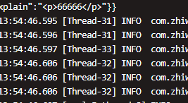
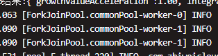
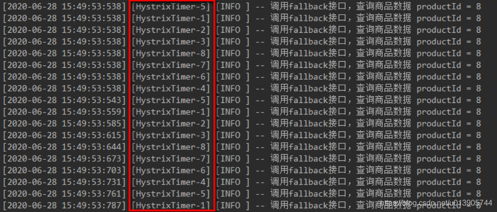
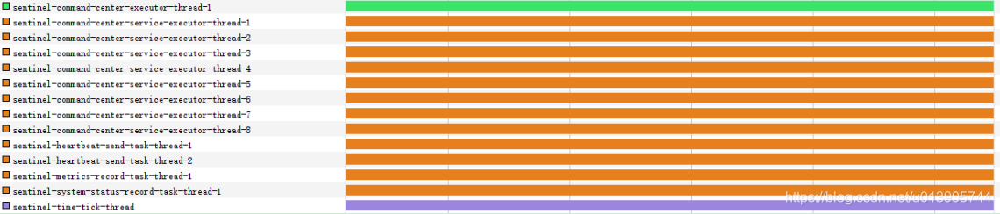

# CompletableFuture 学习笔记

# 文章

## 生产问题之CompletableFuture默认线程池踩坑，请务必自定义线程池

https://www.cnblogs.com/blackmlik/p/16098938.html

>## **先说结论:**
>
>**CompletableFuture是否使用默认线程池的依据，和机器的CPU核心数有关。当CPU核心数-1大于1时，才会使用默认的线程池，否则将会为每个CompletableFuture的任务创建一个新线程去执行**。
>
>即，CompletableFuture 的默认线程池，只有在**双核以上的机器**内才会使用。在双核及以下的机器中，会为每个任务创建一个新线程，**等于没有使用线程池，且有资源耗尽的风险**。
>
>因此建议，在使用CompletableFuture时，**务必要自定义线程池**。因为即便是用到了默认线程池，**池内的核心线程数，也为机器核心数-1**。也就意味着假设你是4核机器，那最多也只有3个核心线程，对于CPU密集型的任务来说倒还好，但是我们平常写业务代码，更多的是IO密集型任务，对于IO密集型的任务来说，这其实远远不够用的，**会导致大量的IO任务在等待**，导致吞吐率大幅度下降，即默认线程池比较适用于CPU密集型任务。
>
>## 经过
>
>于是一顿操作，优化完毕，执行速度从1500ms下降到300ms左右，在经过本地和测试环境后，上线生产。众所周知，CompletableFuture在没有指定线程池的时候，会使用一个默认的ForkJoinPool线程池，也就是下面这个玩意。
>
>```java
> 	public static ForkJoinPool commonPool() {
>        // assert common != null : "static init error";
>        return common;
>    }
>```
>
>**等发了生产之后看日志打印的线程号，却发现了一个极其诡异的事情。明明是同一套代码，生产环境的没有用到默认的线程池。而测试环境和本地环境都使用了默认的ForkJoinPool线程池**，
>
>这是生产环境打印的线程日志
>
>
>
>这是测试和本地环境打印的线程日志
>
>
>
>从日志打印的线程编号可以看到，测试和本地环境都是从ForkJoinPool中取工作线程，**但是生产环境却是为每个任务创建了一个全新的线程。这是一个很危险的行为，假如这是一个并发比较高的接口，并且该接口使用了比较多的CompletableFuture来并行的执行任务。在高并发的时候，为每个任务都创建一个子线程，就会存在线程资源被耗尽的可能性，从而导致服务器崩溃。**
>
>那这是为什么呢？明明是同一套代码，在不同的机器上却有不同的线程使用情况。
>
>## 原因
>
>在带着疑问翻阅了CompletableFuture的源码之后，终于找到了原因：**【是否使用默认的ForkJoinPool线程池，和机器的配置有关】**
>
>我们点进supplyAsync方法的源码
>
>```java
>public static <U> CompletableFuture<U> supplyAsync(Supplier<U> supplier) {
>        return asyncSupplyStage(asyncPool, supplier);
>    }
>    
>```
>
>可以看到这里使用了默认使用了一个asyncPool，点进这个asyncPool
>
>
>
>```java
>  //是否使用默认线程池的判断依据
>private static final Executor asyncPool = useCommonPool ?
>        ForkJoinPool.commonPool() : new ThreadPerTaskExecutor();
>//useCommonPool的来源
> private static final boolean useCommonPool =
>        (ForkJoinPool.getCommonPoolParallelism() > 1);
>```
>
>其实代码看到这里就很清晰了，CompletableFuture是否使用默认线程池，是根据这个useCommonPool的boolean值来的，如果为true，就使用默认的ForkJoinPool，否则就为每个任务创建一个新线程，也就是这个ThreadPerTaskExecutor，见名知义。
>
>那这个useCommonPool的布尔值什么情况下才为true，也就是什么时候才能使用到默认的线程池呢。即getCommonPoolParallelism（）返回的值要大于1，我们继续跟进这个getCommonPoolParallelism（）方法
>
>
>
>```java
>//类顶SMASK常量的值
>static final int SMASK  = 0xffff;   
>final int config;
>static final ForkJoinPool common;
>
>//该方法返回了一个commonParallelism的值
>public static int getCommonPoolParallelism() {
>        return commonParallelism;
>    }
>
>
>    //而commonParallelism的值是在一个静态代码块里被初始化的，也就是类加载的时候初始化
>static {
>    	//初始化common，这个common即ForkJoinPool自身
>        common = java.security.AccessController.doPrivileged
>            (new java.security.PrivilegedAction<ForkJoinPool>() {
>                public ForkJoinPool run() { return makeCommonPool(); }});
>    //根据par的值来初始化commonParallelism的值
>        int par = common.config & SMASK; // report 1 even if threads disabled
>        commonParallelism = par > 0 ? par : 1;
>    }
>```
>
>总结一下上面三部分代码，结合在一起看，这部分代码主要是初始化了commonParallelism的值，也就是getCommonPoolParallelism（）方法的返回值，这个返回值也决定了是否使用默认线程池。而commonParallelism的值又是通过par的值来确定的，par的值是common来确定的，而common则是在makeCommonPool()这个方法中初始化的。
>
>我们继续跟进makeCommonPool（）方法
>
>
>
>```java
>private static ForkJoinPool makeCommonPool() {
>        int parallelism = -1;
>       
>        if (parallelism < 0 && // default 1 less than #cores
>            //获取机器的cpu核心数 将机器的核心数-1 赋值给parallelism 这一段是是否使用线程池的关键
>            //同时 parallelism也是ForkJoinPool的核心线程数
>            (parallelism = Runtime.getRuntime().availableProcessors() - 1) <= 0)
>            parallelism = 1;
>        if (parallelism > MAX_CAP)
>            parallelism = MAX_CAP;
>        return new ForkJoinPool(parallelism, factory, handler, LIFO_QUEUE,
>                                "ForkJoinPool.commonPool-worker-");
>    }
>
>//上面的那个构造方法，可以看到把parallelism赋值给了config变量
>private ForkJoinPool(int parallelism,
>                         ForkJoinWorkerThreadFactory factory,
>                         UncaughtExceptionHandler handler,
>                         int mode,
>                         String workerNamePrefix) {
>        this.workerNamePrefix = workerNamePrefix;
>        this.factory = factory;
>        this.ueh = handler;
>        this.config = (parallelism & SMASK) | mode;
>        long np = (long)(-parallelism); // offset ctl counts
>        this.ctl = ((np << AC_SHIFT) & AC_MASK) | ((np << TC_SHIFT) & TC_MASK);
>    }
>```
>
>总结一下上面两段代码，获取**机器核心数-1的值**，赋值给parallelism变量，再通过构造方法把parallelism的值赋值给config变量。
>
>然后初始化ForkJoinPool的时候。再将config的值赋值给par变量。如果par大于0则将par的值赋给commonParallelism，如果commonParallelism的值大于1的话，useCommonPool的值就为true，就使用默认的线程池，否则就为每个任务创建一个新线程。**另外即便是用到了默认线程池，池内的核心线程数，也为机器核心数-1。也就意味着假设你是4核机器，那最多也只有3个核心线程，对于IO密集型的任务来说，这其实远远不够的**。
>
>## 总结
>
>- 使用CompletableFuture一定要自定义线程池
>- CompletableFuture是否使用默认线程池和机器核心数有关，当核心数减1大于1时才会使用默认线程池，否则将为每个任务创建一个新线程去处理
>- 即便使用到了默认线程池，池内最大线程数也是核心数减1，对io密集型任务是远远不够的，会令大量任务等待，降低吞吐率
>- **ForkJoinPool比较适用于CPU密集型的任务，比如说计算。**


## 使用CompletableFuture

https://www.liaoxuefeng.com/wiki/1252599548343744/1306581182447650

本文示例代码见： java007， com.tv.demo001.juc.compeletableFuture.CompeletableFutureDemo

>使用`Future`获得异步执行结果时，要么调用阻塞方法`get()`，要么轮询看`isDone()`是否为`true`，这两种方法都不是很好，因为主线程也会被迫等待。 
>
>**从Java 8开始引入了`CompletableFuture`，它针对`Future`做了改进，可以传入回调对象，当异步任务完成或者发生异常时，自动调用回调对象的回调方法。**
>
>我们以获取股票价格为例，看看如何使用 `CompletableFuture`：
>
>```java
>public class Main {
>    public static void main(String[] args) throws Exception {
>        // 创建异步执行任务:
>        CompletableFuture<Double> cf = CompletableFuture.supplyAsync(Main::fetchPrice);
>        // 如果执行成功:
>        cf.thenAccept((result) -> {
>            System.out.println("price: " + result);
>        });
>        // 如果执行异常:
>        cf.exceptionally((e) -> {
>            e.printStackTrace();
>            return null;
>        });
>        // 主线程不要立刻结束，否则CompletableFuture默认使用的线程池会立刻关闭:
>        Thread.sleep(200);
>    }
>
>    static Double fetchPrice() {
>        try {
>            Thread.sleep(100);
>        } catch (InterruptedException e) {
>        }
>        if (Math.random() < 0.3) {
>            throw new RuntimeException("fetch price failed!");
>        }
>        return 5 + Math.random() * 20;
>    }
>}
>```
>
>可见`CompletableFuture`的优点是：
>
>- **异步任务结束时，会自动回调某个对象的方法；**
>- **异步任务出错时，会自动回调某个对象的方法；**
>- **主线程设置好回调后，不再关心异步任务的执行。**
>
>如果只是实现了异步回调机制，我们还看不出`CompletableFuture`相比`Future`的优势。`CompletableFuture`更强大的功能是，多个`CompletableFuture`可以串行执行，例如，定义两个`CompletableFuture`，第一个`CompletableFuture`根据证券名称查询证券代码，第二个`CompletableFuture`根据证券代码查询证券价格，这两个`CompletableFuture`实现串行操作如下：
>
>```java
>public class Main {
>    public static void main(String[] args) throws Exception {
>        // 第一个任务:
>        CompletableFuture<String> cfQuery = CompletableFuture.supplyAsync(() -> {
>            return queryCode("中国石油");
>        });
>        // cfQuery成功后继续执行下一个任务:
>        CompletableFuture<Double> cfFetch = cfQuery.thenApplyAsync((code) -> {
>            return fetchPrice(code);
>        });
>        // cfFetch成功后打印结果:
>        cfFetch.thenAccept((result) -> {
>            System.out.println("price: " + result);
>        });
>        // 主线程不要立刻结束，否则CompletableFuture默认使用的线程池会立刻关闭:
>        Thread.sleep(2000);
>    }
>
>    static String queryCode(String name) {
>        try {
>            Thread.sleep(100);
>        } catch (InterruptedException e) {
>        }
>        return "601857";
>    }
>
>    static Double fetchPrice(String code) {
>        try {
>            Thread.sleep(100);
>        } catch (InterruptedException e) {
>        }
>        return 5 + Math.random() * 20;
>    }
>}
>```
>
>### 小结
>
>**`CompletableFuture`可以指定异步处理流程：**
>
>- **`thenAccept()`处理正常结果；**
>- **`exceptional()`处理异常结果；**
>- **`thenApplyAsync()`、 supplyAsync() 用于串行化另一个`CompletableFuture`；**
>- **`anyOf()`和`allOf()`用于并行化多个`CompletableFuture`。**

## CompletableFuture

>## CompletableFuture 作为 Future 使用
>
>
>
>## 异步执行 code
>
>```java
>// 无返回结果 异步执行
>static     CompletableFuture<Void> runAsync(Runnable runnable)
>static     CompletableFuture<Void> runAsync(Runnable runnable,
>                                            Executor executor)
>// 有返回结果 异步执行
>static <U> CompletableFuture<U> supplyAsync(Supplier<U> supplier)
>static <U> CompletableFuture<U> supplyAsync(Supplier<U> supplier,
>                                            Executor executor)
>
>```
>
>
>
>## 组合Futures
>
>
>
>## 并行执行任务
>
>
>
>## 异常处理
>
>```java
>public <U> CompletableFuture<U> handle(
>BiFunction<? super T, Throwable, ? extends U> fn) {
>return uniHandleStage(null, fn);
>}
>```

## 使用示例

https://github.com/ddean2009/learn-java-concurrency/blob/master/CompletableFuture/src/main/java/com/flydean/CompletableFutureUsage.java


## java8中 CompletableFuture 异步处理超时的方法

https://blog.csdn.net/u013905744/article/details/109134516

>如何实现 Asynchronous timeouts?
>
>Java 8 的 CompletableFuture 并没有 timeout 机制，虽然可以在 get 的时候指定 timeout，但是我们知道get 是一个同步堵塞的操作。怎样让 timeout 也是异步的呢？
>
>> timeout异步就是说，如果forkjoin-pool中一个线程在规定时间内没有返回，那么就结束掉，而不是继续执行直到获取结果，比如main线程200ms内返回，但forkjoin-pool中某个执行线程执行400ms才返回，而其返回值根本没有被使用到. 
>
>Java 8 内有内建的机制支持，一般的实现方案是启动一个 `ScheduledThreadpoolExecutor` 线程在 timeout 时间后直接调用 `CompletableFuture.completeExceptionally(new TimeoutException())`，然后用 `acceptEither()` 或者 `applyToEither` 看是先计算完成还是先超时：
>
>```java
>public static <T> CompletableFuture<T> within(CompletableFuture<T> future, long timeout, TimeUnit unit) {
>    final CompletableFuture<T> timeoutFuture = timeoutAfter(timeout, unit);
>    // 哪个先完成 就apply哪一个结果 这是一个关键的API
>    return future.applyToEither(timeoutFuture, Function.identity());
>}
>```
>
>一个简单的 timeoutAfter 实现如下：
>
>```java
>public static <T> CompletableFuture<T> timeoutAfter(long timeout, TimeUnit unit) {
>    CompletableFuture<T> result = new CompletableFuture<T>();
>    // timeout 时间后 抛出TimeoutException 类似于sentinel / watcher
>    delayer.schedule(() -> result.completeExceptionally(new TimeoutException()), timeout, unit);
>    return result;
>}
>```
>
>其中 delayer 是 ScheduledThreadPoolExecutor 的一个实例：
>
>```java
>    /**
>     * Singleton delay scheduler, used only for starting and * cancelling tasks.
>     */
>    static final class Delayer {
>        static ScheduledFuture<?> delay(Runnable command, long delay,
>                                        TimeUnit unit) {
>            return delayer.schedule(command, delay, unit);
>        }
>
>        static final class DaemonThreadFactory implements ThreadFactory {
>            @Override
>            public Thread newThread(Runnable r) {
>                Thread t = new Thread(r);
>                t.setDaemon(true);
>                t.setName("CompletableFutureDelayScheduler");
>                return t;
>            }
>        }
>
>        static final ScheduledThreadPoolExecutor delayer;
>
>        // 注意，这里使用一个线程就可以搞定 因为这个线程并不真的执行请求 而是仅仅抛出一个异常
>        static {
>            (delayer = new ScheduledThreadPoolExecutor(
>                    1, new DaemonThreadFactory())).
>                    setRemoveOnCancelPolicy(true);
>        }
>    }
>
>```
>
>示例demo参考：https://gitee.com/constfafa/spring_springboot_learning/tree/master/deferresult-demo
>cn.bellychang.controller.AsyncController#orderCompletionStage
>
>在 java 9 引入了 `orTimeout` 和 `completeOnTimeOut` 两个方法支持 异步 timeout 机制：
>
>- public CompletableFuture orTimeout(long timeout, TimeUnit unit) : completes the CompletableFuture with a TimeoutException after the specified timeout has elapsed.
>- public CompletableFuture completeOnTimeout(T value, long timeout, TimeUnit unit) : provides a default value in the case that the CompletableFuture pipeline times out.
>
>内部实现上跟我们上面的实现方案是一模一样的，只是现在不需要自己实现了。
>
>实际上hystrix等熔断的框架，其实现线程Timeout之后就关闭线程，也是基于同样的道理，所以我们可以看到hystrix中会有一个Timer Thread
>
>
>
>比如 alibaba sentinel 中也有一个 Timer Thread:
>
>
>
>


## CompletableFuture 异常优雅处理方式

https://blog.csdn.net/kaoya156/article/details/125075464

## [Java 完成CompletableFuture](https://geek-docs.com/java/java-examples/java-complete-completablefuture.html)

https://juejin.cn/post/6924884838264766472

>完成 `CompletableFuture`
>
>```java
>public CompletableFuture<Product> getProduct(int id) {
>    try {
>        Product product = getLocal(id);
>        if (product != null) {
>            return CompletableFuture.completedFuture(product);  ➊
>        } else {
>            CompletableFuture<Product> future = new CompletableFuture<>();
>            Product p = getRemote(id);                          ➋
>            cache.put(id, p);
>            future.complete(p);                                 ➌
>            return future;
>        }
>    } catch (Exception e) {
>        CompletableFuture<Product> future = new CompletableFuture<>();
>        future.completeExceptionally(e);                        ➍
>        return future;
>    }
>}
>
>```
>
>**如果已有 `CompletableFuture` 且希望将其设置为给定的值，可以采用 `complete` 方法； `CompletableFuture` 方法是一种工厂方法，它使用给定的值创建一个新的 `CompletableFuture`； `completeExceptionally` 方法使用给定的异常来结束 `Future`。**
>
>```java
>public CompletableFuture<Product> getProductAsync(int id) {
>    try {
>        Product product = getLocal(id);
>        if (product != null) {
>            logger.info("getLocal with id=" + id);
>            return CompletableFuture.completedFuture(product);
>        } else {
>            logger.info("getRemote with id=" + id);
>						// 改为异步执行的方式获取 Product
>            return CompletableFuture.supplyAsync(() -> {    
>                Product p = getRemote(id);
>                cache.put(id, p);
>                return p;
>            });
>        }
>    } catch (Exception e) {
>        logger.info("exception thrown");
>        CompletableFuture<Product> future = new CompletableFuture<>();
>        future.completeExceptionally(e);
>        return future;
>    }
>}
>
>```
>
>

# 官网

```java

/**
 * A {@link Future} that may be explicitly completed (setting its
 * value and status), and may be used as a {@link CompletionStage},
 * supporting dependent functions and actions that trigger upon its
 * completion.
 *
 * <p>When two or more threads attempt to
 * {@link #complete complete},
 * {@link #completeExceptionally completeExceptionally}, or
 * {@link #cancel cancel}
 * a CompletableFuture, only one of them succeeds.
 *
 * <p>In addition to these and related methods for directly
 * manipulating status and results, CompletableFuture implements
 * interface {@link CompletionStage} with the following policies: <ul>
 *
 * <li>Actions supplied for dependent completions of
 * <em>non-async</em> methods may be performed by the thread that
 * completes the current CompletableFuture, or by any other caller of
 * a completion method.</li>
 *
 * <li>All <em>async</em> methods without an explicit Executor
 * argument are performed using the {@link ForkJoinPool#commonPool()}
 * (unless it does not support a parallelism level of at least two, in
 * which case, a new Thread is created to run each task).  To simplify
 * monitoring, debugging, and tracking, all generated asynchronous
 * tasks are instances of the marker interface {@link
 * AsynchronousCompletionTask}. </li>
 *
 * <li>All CompletionStage methods are implemented independently of
 * other public methods, so the behavior of one method is not impacted
 * by overrides of others in subclasses.  </li> </ul>
 *
 * <p>CompletableFuture also implements {@link Future} with the following
 * policies: <ul>
 *
 * <li>Since (unlike {@link FutureTask}) this class has no direct
 * control over the computation that causes it to be completed,
 * cancellation is treated as just another form of exceptional
 * completion.  Method {@link #cancel cancel} has the same effect as
 * {@code completeExceptionally(new CancellationException())}. Method
 * {@link #isCompletedExceptionally} can be used to determine if a
 * CompletableFuture completed in any exceptional fashion.</li>
 *
 * <li>In case of exceptional completion with a CompletionException,
 * methods {@link #get()} and {@link #get(long, TimeUnit)} throw an
 * {@link ExecutionException} with the same cause as held in the
 * corresponding CompletionException.  To simplify usage in most
 * contexts, this class also defines methods {@link #join()} and
 * {@link #getNow} that instead throw the CompletionException directly
 * in these cases.</li> </ul>
 *
 * @author Doug Lea
 * @since 1.8
 */
```


## CompletionStage

### exceptionally

https://docs.oracle.com/javase/9/docs/api/java/util/concurrent/CompletionStage.html

**Method [`exceptionally`](https://docs.oracle.com/javase/9/docs/api/java/util/concurrent/CompletionStage.html#exceptionally-java.util.function.Function-) supports computation only when the triggering stage completes exceptionally, computing a replacement result, similarly to the java `catch` keyword.** **In all other cases,  if a stage's computation terminates abruptly with an (unchecked) exception or error, then all dependent stages requiring its completion complete exceptionally as well, with a [`CompletionException`](https://docs.oracle.com/javase/9/docs/api/java/util/concurrent/CompletionException.html) holding the exception as its cause.** If a stage is dependent on *both* of two stages, and both complete exceptionally, then the CompletionException may correspond to either one of these exceptions. If a stage is dependent on *either* of two others, and only one of them completes exceptionally, no guarantees are made about whether the dependent stage completes normally or exceptionally. In the case of method `whenComplete`, when the supplied action itself encounters an exception, then the stage completes exceptionally with this exception unless the source stage also completed exceptionally, in which case the exceptional completion from the source stage is given preference and propagated to the dependent stage.


