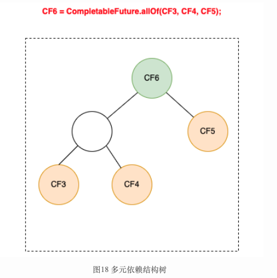

# CompletableFuture 学习笔记

# 文章

FutureTask 和 ForkjoinTask 区别，联系.  

## [ForkJoin框架之ForkJoinTask](https://segmentfault.com/a/1190000019549838) (CompletableFuture 原理三)

讲得非常详细, 需要多读几遍.

>```java
>@SuppressWarnings("serial")
>abstract static class Completion extends ForkJoinTask<Void>
>    implements Runnable, AsynchronousCompletionTask {
>    volatile Completion next;      // Treiber stack link
>
>    /**
>     * Performs completion action if triggered, returning a
>     * dependent that may need propagation, if one exists.
>     *
>     * @param mode SYNC, ASYNC, or NESTED
>     */
>    abstract CompletableFuture<?> tryFire(int mode);
>
>    /** Returns true if possibly still triggerable. Used by cleanStack. */
>    abstract boolean isLive();
>
>    public final void run()                { tryFire(ASYNC); }
>    public final boolean exec()            { tryFire(ASYNC); return true; }
>    public final Void getRawResult()       { return null; }
>    public final void setRawResult(Void v) {}
>}
>
>static void lazySetNext(Completion c, Completion next) {
>    UNSAFE.putOrderedObject(c, NEXT, next);
>}
>```
>
>CompletableFuture 中栈的定义：
>
>```java
>volatile Object result;       // Either the result or boxed AltResult
>volatile Completion stack;    // Top of Treiber stack of dependent actions
>```
>
>官方解释： ForkJoinTask 就是运行在 ForkJoinPool 的一个任务抽象, ForkJoinPool 就是运行ForkJoinTask 的线程池. 
>
>**ForkJoin框架包含 ForkJoinTask,ForkJoinWorkerThread,ForkJoinPool和若干ForkJoinTask的子类**,**它的核心在于分治和工作窍取,最大程度利用线程池中的工作线程,避免忙的忙死,饿的饿死.**
>
>ForkJoinTask 可以理解为类线程但比线程轻量的实体,在ForkJoinPool中运行的少量ForkJoinWorkerThread可以持有大量的ForkJoinTask和它的子任务.ForkJoinTask同时也是一个轻量的Future,使用时应避免较长阻塞和io.
>
>ForkJoinTask在JAVA8中应用广泛,但它是一个抽象类,它的子类派生了各种用途,如后续计划单独介绍的CountedCompleter,以及若干JAVA8中stream api定义的与并行流有关的各种操作(ops).
>
>


## [FutureTask源码解读 ](https://www.cnblogs.com/micrari/p/7374513.html) 

很详细, 很深入.  


```java
/**
 * A cancellable asynchronous computation.  This class provides a base
 * implementation of {@link Future}, with methods to start and cancel
 * a computation, query to see if the computation is complete, and
 * retrieve the result of the computation.  The result can only be
 * retrieved when the computation has completed; the {@code get}
 * methods will block if the computation has not yet completed.  Once
 * the computation has completed, the computation cannot be restarted
 * or cancelled (unless the computation is invoked using
 * {@link #runAndReset}).
 *
 * <p>A {@code FutureTask} can be used to wrap a {@link Callable} or
 * {@link Runnable} object.  Because {@code FutureTask} implements
 * {@code Runnable}, a {@code FutureTask} can be submitted to an
 * {@link Executor} for execution.
 *
 * <p>In addition to serving as a standalone class, this class provides
 * {@code protected} functionality that may be useful when creating
 * customized task classes.
 *
 * @since 1.5
 * @author Doug Lea
 * @param <V> The result type returned by this FutureTask's {@code get} methods
 */
```

>## 1. 背景与简介
>
>Future 是 Java 执行异步任务时的常用接口。我们通常会往ExecutorService中提交一个Callable/Runnable并得到一个Future对象，Future对象表示异步计算的结果，支持获取结果，取消计算等操作。在Java提供的Executor框架中，Future的默认实现为java.util.concurrent.FutureTask。本文针对FutureTask的源码进行分析与解读。
>
>
>
>

## Treiber stack (CompletableFuture 原理二)

### [Treiber Stack介绍 ](https://www.cnblogs.com/micrari/p/7719408.html)

>## 实现
>
>下面给出的Java语言实现为《Java并发编程实战》一书的15.4.1小结中的实现。Treiber Stack 的实现套路很简单，就是CAS+重试，不需要任何注释就能轻松的看懂代码。
>
>```java
>@ThreadSafe
>public class ConcurrentStack <E> {
>    AtomicReference<Node<E>> top = new AtomicReference<Node<E>>();
>
>    public void push(E item) {
>        Node<E> newHead = new Node<E>(item);
>        Node<E> oldHead;
>        do {
>            oldHead = top.get();
>            newHead.next = oldHead;
>        } while (!top.compareAndSet(oldHead, newHead));
>    }
>
>    public E pop() {
>        Node<E> oldHead;
>        Node<E> newHead;
>        do {
>            oldHead = top.get();
>            if (oldHead == null)
>                return null;
>            newHead = oldHead.next;
>        } while (!top.compareAndSet(oldHead, newHead));
>        return oldHead.item;
>    }
>
>    private static class Node <E> {
>        public final E item;
>        public Node<E> next;
>
>        public Node(E item) {
>            this.item = item;
>        }
>    }
>}
>
>```
>
>## JDK中的使用
>
>JDK中的FutureTask使用了Treiber Stack。关于FutureTask的源码解读，可以参考我的博文[FutureTask源码解读](http://www.cnblogs.com/micrari/p/7374513.html)。FutureTask用了Treiber Stack来维护等待任务完成的线程，在FutureTask的任务完成/取消/异常后在finishCompletion钩子方法中会唤醒栈中等待的线程。
>
>## 参考
>
>《Java并发编程实战》
>[Treiber Stack](https://en.wikipedia.org/wiki/Treiber_Stack)


## 观察者模式（监听模式） (CompletableFuture 原理一)

https://www.runoob.com/design-pattern/observer-pattern.html

>观察者模式是一种行为型设计模式，**它定义了一种一对多的依赖关系，当一个对象的状态发生改变时，其所有依赖者都会收到通知并自动更新。**
>
>当对象间存在一对多关系时，则使用观察者模式（Observer Pattern）。比如，当一个对象被修改时，则会自动通知依赖它的对象。观察者模式属于行为型模式。
>
>**观察者模式包含以下几个核心角色：**
>
>- **主题（Subject）**：也称为被观察者或可观察者，它是具有状态的对象，并维护着一个观察者列表。主题提供了添加、删除和通知观察者的方法。
>- **观察者（Observer）**：观察者是接收主题通知的对象。观察者需要实现一个更新方法，当收到主题的通知时，调用该方法进行更新操作。
>- **具体主题（Concrete Subject）**：具体主题是主题的具体实现类。它维护着观察者列表，并在状态发生改变时通知观察者。
>- **具体观察者（Concrete Observer）**：具体观察者是观察者的具体实现类。它实现了更新方法，定义了在收到主题通知时需要执行的具体操作。
>
>观察者模式通过将主题和观察者解耦，实现了对象之间的松耦合。当主题的状态发生改变时，所有依赖于它的观察者都会收到通知并进行相应的更新。
>
>## 实现
>
>观察者模式使用三个类 Subject、Observer 和 Client。Subject 对象带有绑定观察者到 Client 对象和从 Client 对象解绑观察者的方法。我们创建 *Subject* 类、*Observer* 抽象类和扩展了抽象类 *Observer* 的实体类。
>
>
>
>### 步骤 1
>
>创建 Subject 类。
>
>```java
>import java.util.ArrayList;
>import java.util.List;
> 
>public class Subject {
>   
>   private List<Observer> observers 
>      = new ArrayList<Observer>();
>   private int state;
> 
>   public int getState() {
>      return state;
>   }
> 
>   public void setState(int state) {
>      this.state = state;
>      notifyAllObservers();
>   }
> 
>   public void attach(Observer observer){
>      observers.add(observer);      
>   }
> 
>   public void notifyAllObservers(){
>      for (Observer observer : observers) {
>         observer.update();
>      }
>   }  
>}
>```
>
>### 步骤 2
>
>创建 Observer 类。
>
>```java
>public abstract class Observer {
>   protected Subject subject;
>   public abstract void update();
>}
>```
>
>### 步骤 3
>
>创建实体观察者类。
>
>```java
>public class BinaryObserver extends Observer{
>   // 初始化的时候把自己注册到 Subject 上
>   public BinaryObserver(Subject subject){
>      this.subject = subject;
>      this.subject.attach(this);
>   }
> 
>   @Override
>   public void update() {
>      System.out.println( "Binary String: " 
>      + Integer.toBinaryString( subject.getState() ) ); 
>   }
>}
>```
>
>```java
>public class OctalObserver extends Observer{
> 
>   public OctalObserver(Subject subject){
>      this.subject = subject;
>      this.subject.attach(this);
>   }
> 
>   @Override
>   public void update() {
>     System.out.println( "Octal String: " 
>     + Integer.toOctalString( subject.getState() ) ); 
>   }
>}
>```
>
>```java
>public class HexaObserver extends Observer{
> 
>   public HexaObserver(Subject subject){
>      this.subject = subject;
>      this.subject.attach(this);
>   }
> 
>   @Override
>   public void update() {
>      System.out.println( "Hex String: " 
>      + Integer.toHexString( subject.getState() ).toUpperCase() ); 
>   }
>}
>```
>
>### 步骤 4
>
>使用 *Subject* 和实体观察者对象。
>
>```java
>public class ObserverPatternDemo {
>   public static void main(String[] args) {
>      Subject subject = new Subject();
> 
>      new HexaObserver(subject);
>      new OctalObserver(subject);
>      new BinaryObserver(subject);
> 
>      System.out.println("First state change: 15");   
>      subject.setState(15);
>      System.out.println("Second state change: 10");  
>      subject.setState(10);
>   }
>}
>```
>
>


## [CompletableFuture原理与实践-外卖商家端API的异步化](https://tech.meituan.com/2022/05/12/principles-and-practices-of-completablefuture.html)

https://tech.meituan.com/2022/05/12/principles-and-practices-of-completablefuture.html

有深度的文章，很详细.  

>## 2 并行加载的实现方式
>
>并行从下游获取数据，从IO模型上来讲分为**同步模型**和**异步模型**。
>
>### 2.1 同步模型
>
>从各个服务获取数据最常见的是同步调用，如下图所示：
>
>
>
>图2 同步调用
>
>在同步调用的场景下，接口耗时长、性能差，接口响应时长T > T1+T2+T3+……+Tn，这时为了缩短接口的响应时间，一般会使用线程池的方式并行获取数据，商家端订单卡片的组装正是使用了这种方式。
>
>
>
>图3 并行之线程池
>
>这种方式由于以下两个原因，导致资源利用率比较低：
>
>- **CPU资源大量浪费在阻塞等待上**，导致CPU资源利用率低。在Java 8之前，一般会通过回调的方式来减少阻塞，但是大量使用回调，又引发臭名昭著的**回调地狱**问题，导致代码可读性和可维护性大大降低。
>- **为了增加并发度，会引入更多额外的线程池**，随着CPU调度线程数的增加，会导致更严重的资源争用，宝贵的CPU资源被损耗在上下文切换上，而且线程本身也会占用系统资源，且不能无限增加。
>
>同步模型下，会导致**硬件资源无法充分利用**，**系统吞吐量容易达到瓶颈。**
>
>### 2.2 NIO异步模型
>
>我们主要通过以下两种方式来减少线程池的调度开销和阻塞时间：
>
>- 通过**RPC NIO异步调用的方式可以降低线程数，从而降低调度（上下文切换）开销**，如Dubbo的异步调用可以参考[《dubbo调用端异步》](https://dubbo.apache.org/zh/docs/v3.0/references/features/async-call/)一文。
>- 通过**引入CompletableFuture（下文简称CF）对业务流程进行编排，降低依赖之间的阻塞。**本文主要讲述CompletableFuture的使用和原理。
>
>### 2.3 为什么会选择CompletableFuture？
>
>我们首先对业界广泛流行的解决方案做了横向调研，主要包括Future、CompletableFuture注2、RxJava、Reactor。它们的特性对比如下：
>
>
>
>- **可组合**：可以将多个依赖操作通过不同的方式进行编排，例如CompletableFuture提供thenCompose、thenCombine等各种then开头的方法，这些方法就是对“可组合”特性的支持。
>- **操作融合**：将数据流中使用的多个操作符以某种方式结合起来，进而降低开销（时间、内存）。
>- **延迟执行**：操作不会立即执行，当收到明确指示时操作才会触发。例如Reactor只有当有订阅者订阅时，才会触发操作。
>- **回压**：某些异步阶段的处理速度跟不上，直接失败会导致大量数据的丢失，对业务来说是不能接受的，这时需要反馈上游生产者降低调用量。
>
>RxJava与Reactor显然更加强大，它们提供了更多的函数调用方式，支持更多特性，但同时也带来了更大的学习成本。而我们本次整合最需要的特性就是“异步”、“可组合”，综合考虑后，我们选择了学习成本相对较低的CompletableFuture。
>
>## 3 CompletableFuture使用与原理
>
>### 3.1 CompletableFuture的背景和定义
>
>#### 3.1.1 CompletableFuture解决的问题
>
>CompletableFuture是由Java 8引入的，在Java8之前我们一般通过Future实现异步。
>
>- Future用于表示异步计算的结果，只能通过阻塞或者轮询的方式获取结果，而且不支持设置回调方法，Java 8之前若要设置回调一般会使用guava的ListenableFuture，回调的引入又会导致臭名昭著的回调地狱（下面的例子会通过ListenableFuture的使用来具体进行展示）。
>- CompletableFuture对Future进行了扩展，可以通过设置回调的方式处理计算结果，同时也支持组合操作，支持进一步的编排，同时一定程度解决了回调地狱的问题。
>
>#### 3.1.2 CompletableFuture 的定义
>
>
>
>CompletableFuture实现了两个接口（如上图所示）：Future、CompletionStage。Future表示异步计算的结果，CompletionStage 用于表示异步执行过程中的一个步骤（Stage），这个步骤可能是由另外一个CompletionStage触发的，随着当前步骤的完成，也可能会触发其他一系列CompletionStage的执行。从而我们可以根据实际业务对这些步骤进行多样化的编排组合，CompletionStage 接口正是定义了这样的能力，我们可以通过其提供的thenAppy、thenCompose等函数式编程方法来组合编排这些步骤。
>
>### 3.2 CompletableFuture的使用
>
>下面我们通过一个例子来讲解CompletableFuture如何使用，使用CompletableFuture也是构建依赖树的过程。一个CompletableFuture的完成会触发另外一系列依赖它的CompletableFuture的执行：
>
>
>
>如上图所示，这里描绘的是一个业务接口的流程，其中包括CF1\CF2\CF3\CF4\CF5共5个步骤，并描绘了这些步骤之间的依赖关系，每个步骤可以是一次RPC调用、一次数据库操作或者是一次本地方法调用等，在使用CompletableFuture进行异步化编程时，图中的每个步骤都会产生一个CompletableFuture对象，最终结果也会用一个CompletableFuture来进行表示。
>
>根据CompletableFuture依赖数量，可以分为以下几类：零依赖、一元依赖、二元依赖和多元依赖。
>
>#### 3.2.1 零依赖：CompletableFuture的创建
>
>我们先看下如何不依赖其他CompletableFuture来创建新的CompletableFuture：
>
>
>
>如上图红色链路所示，接口接收到请求后，首先发起两个异步调用CF1、CF2，主要有三种方式：
>
>```java
>ExecutorService executor = Executors.newFixedThreadPool(5);
>//1、使用runAsync或supplyAsync发起异步调用
>CompletableFuture<String> cf1 = CompletableFuture.supplyAsync(() -> {
>  return "result1";
>}, executor);
>//2、CompletableFuture.completedFuture()直接创建一个已完成状态的CompletableFuture
>CompletableFuture<String> cf2 = CompletableFuture.completedFuture("result2");
>//3、先初始化一个未完成的CompletableFuture，然后通过complete()、completeExceptionally()，完成该CompletableFuture
>CompletableFuture<String> cf = new CompletableFuture<>();
>cf.complete("success");
>```
>
>第三种方式的一个典型使用场景，就是**将回调方法转为CompletableFuture，然后再依赖CompletableFure的能力进行调用编排**，示例如下：
>
>```java
>@FunctionalInterface
>public interface ThriftAsyncCall {
>    void invoke() throws TException;
>}
> /**
>  * 该方法为美团内部rpc注册监听的封装，可以作为其他实现的参照
>  * OctoThriftCallback 为thrift回调方法
>  * ThriftAsyncCall 为自定义函数，用来表示一次thrift调用（定义如上）
>  */
>  public static <T> CompletableFuture<T> toCompletableFuture(final OctoThriftCallback<?,T> callback , ThriftAsyncCall thriftCall) {
>   //新建一个未完成的CompletableFuture
>   CompletableFuture<T> resultFuture = new CompletableFuture<>();
>   //监听回调的完成，并且与CompletableFuture同步状态
>   callback.addObserver(new OctoObserver<T>() {
>       @Override
>       public void onSuccess(T t) {
>           resultFuture.complete(t);
>       }
>       @Override
>       public void onFailure(Throwable throwable) {
>           resultFuture.completeExceptionally(throwable);
>       }
>   });
>   if (thriftCall != null) {
>       try {
>           thriftCall.invoke();
>       } catch (TException e) {
>           resultFuture.completeExceptionally(e);
>       }
>   }
>   return resultFuture;
>  }
>```
>
>#### 3.2.2 一元依赖：依赖一个CF
>
>
>
>如上图红色链路所示，CF3，CF5 分别依赖于CF1和CF2，这种对于单个CompletableFuture的依赖可以通过thenApply、thenAccept、thenCompose等方法来实现，代码如下所示： 
>
>```java
>CompletableFuture<String> cf3 = cf1.thenApply(result1 -> {
>  //result1为CF1的结果
>  //......
>  return "result3";
>});
>CompletableFuture<String> cf5 = cf2.thenApply(result2 -> {
>  //result2为CF2的结果
>  //......
>  return "result5";
>});
>```
>
>#### 3.2.3 二元依赖：依赖两个CF
>
>
>
>如上图红色链路所示，CF4同时依赖于两个CF1和CF2，这种二元依赖可以通过thenCombine等回调来实现，如下代码所示：
>
>```java
>CompletableFuture<String> cf4 = cf1.thenCombine(cf2, (result1, result2) -> {
>  //result1和result2分别为cf1和cf2的结果
>  return "result4";
>});
>```
>
>#### 3.2.4 多元依赖：依赖多个CF
>
>
>
>如上图红色链路所示，整个流程的结束依赖于三个步骤CF3、CF4、CF5，这种多元依赖可以通过`allOf`或`anyOf`方法来实现，区别是当需要多个依赖全部完成时使用`allOf`，当多个依赖中的任意一个完成即可时使用`anyOf`，如下代码所示：
>
>```java
>CompletableFuture<Void> cf6 = CompletableFuture.allOf(cf3, cf4, cf5);
>CompletableFuture<String> result = cf6.thenApply(v -> {
>  //这里的join并不会阻塞，因为传给thenApply的函数是在CF3、CF4、CF5全部完成时，才会执行 。
>  result3 = cf3.join();
>  result4 = cf4.join();
>  result5 = cf5.join();
>  //根据result3、result4、result5组装最终result;
>  return "result";
>});
>```
>
>### 3.3 CompletableFuture原理 (重要)
>
>CompletableFuture中包含两个字段：**result**和**stack**。result用于存储当前CF的结果，stack（Completion）表示当前CF完成后需要触发的依赖动作（Dependency Actions），去触发依赖它的CF的计算，依赖动作可以有多个（表示有多个依赖它的CF），以栈（[Treiber stack](https://en.wikipedia.org/wiki/Treiber_stack)）的形式存储，stack表示栈顶元素。
>
>
>
>这种方式类似“观察者模式”，依赖动作（Dependency Action）都封装在一个单独Completion子类中。下面是Completion类关系结构图。CompletableFuture中的每个方法都对应了图中的一个Completion的子类，Completion本身是**观察者**的基类。
>
>- UniCompletion继承了Completion，是一元依赖的基类，例如thenApply的实现类UniApply就继承自UniCompletion。
>- BiCompletion继承了UniCompletion，是二元依赖的基类，同时也是多元依赖的基类。例如thenCombine的实现类BiRelay就继承自BiCompletion。
>
>
>
>#### 3.3.1 CompletableFuture的设计思想
>
>按照类似“观察者模式”的设计思想，原理分析可以从“观察者”和“被观察者”两个方面着手。由于回调种类多，但结构差异不大，所以这里单以一元依赖中的thenApply为例，不再枚举全部回调类型。如下图所示：
>
>
>
>**3.3.1.1 被观察者**
>
>1. 每个CompletableFuture都可以被看作一个被观察者，其内部有一个Completion类型的链表成员变量stack，用来存储注册到其中的所有观察者。当被观察者执行完成后会弹栈stack属性，依次通知注册到其中的观察者。上面例子中步骤fn2就是作为观察者被封装在UniApply中。
>2. 被观察者CF中的result属性，用来存储返回结果数据。这里可能是一次RPC调用的返回值，也可能是任意对象，在上面的例子中对应步骤fn1的执行结果。
>
>**3.3.1.2 观察者**
>
>CompletableFuture支持很多回调方法，例如thenAccept、thenApply、exceptionally等，这些方法接收一个函数类型的参数f，生成一个Completion类型的对象（即观察者），并将入参函数f赋值给Completion的成员变量fn，然后检查当前CF是否已处于完成状态（即result != null），如果已完成直接触发fn，否则将观察者Completion加入到CF的观察者链stack中，再次尝试触发，如果被观察者未执行完则其执行完毕之后通知触发。
>
>1. **观察者中的dep属性：指向其对应的CompletableFuture，在上面的例子中dep指向CF2。**
>2. **观察者中的src属性：指向其依赖的CompletableFuture，在上面的例子中src指向CF1。**
>3. 观察者Completion中的fn属性：用来存储具体的等待被回调的函数。这里需要注意的是不同的回调方法（thenAccept、thenApply、exceptionally等）接收的函数类型也不同，即fn的类型有很多种，在上面的例子中fn指向fn2。
>
>#### 3.3.2 整体流程
>
>**3.3.2.1 一元依赖**
>
>这里仍然以thenApply为例来说明一元依赖的流程：
>
>1. 将观察者Completion注册到CF1，此时CF1将Completion压栈。
>2. 当CF1的操作运行完成时，会将结果赋值给CF1中的result属性。
>3. 依次弹栈，通知观察者尝试运行。
>
>
>
>初步流程设计如上图所示，这里有几个关于注册与通知的并发问题，大家可以思考下：
>
>**Q1**：在观察者注册之前，如果CF已经执行完成，并且已经发出通知，那么这时观察者由于错过了通知是不是将永远不会被触发呢 ？ **A1**：不会。在注册时检查依赖的CF是否已经完成。如果未完成（即result == null）则将观察者入栈，如果已完成（result != null）则直接触发观察者操作。
>
>**Q2**：在”入栈“前会有”result == null“的判断，这两个操作为非原子操作，CompletableFufure的实现也没有对两个操作进行加锁，完成时间在这两个操作之间，观察者仍然得不到通知，是不是仍然无法触发？
>
>
>
>图14 入栈校验
>
>**A2**：不会。入栈之后再次检查CF是否完成，如果完成则触发。
>
>**Q3**：当依赖多个CF时，观察者会被压入所有依赖的CF的栈中，每个CF完成的时候都会进行，那么会不会导致一个操作被多次执行呢 ？如下图所示，即当CF1、CF2同时完成时，如何避免CF3被多次触发。
>
>
>
>图15 多次触发
>
>**A3**：CompletableFuture的实现是这样解决该问题的：观察者在执行之前会先通过CAS操作设置一个状态位，**将status由0改为1。如果观察者已经执行过了，那么CAS操作将会失败，取消执行。**
>
>通过对以上3个问题的分析可以看出，**CompletableFuture在处理并行问题时，全程无加锁操作，极大地提高了程序的执行效率。我们将并行问题考虑纳入之后，可以得到完善的整体流程图如下所示：**
>
>
>
>CompletableFuture支持的回调方法十分丰富，但是正如上一章节的整体流程图所述，他们的整体流程是一致的。所有回调复用同一套流程架构，不同的回调监听通过**策略模式**实现差异化。
>
>**3.3.2.2 二元依赖**
>
>我们以thenCombine为例来说明二元依赖：
>
>
>
>图17 二元依赖数据结构
>
>​        thenCombine操作表示依赖两个CompletableFuture。其观察者实现类为BiApply，如上图所示，BiApply通过src和snd两个属性关联被依赖的两个CF，fn属性的类型为BiFunction。与单个依赖不同的是，在依赖的CF未完成的情况下，thenCombine会尝试将BiApply压入这两个被依赖的CF的栈中，每个被依赖的CF完成时都会尝试触发观察者BiApply，BiApply会检查两个依赖是否都完成，如果完成则开始执行。这里为了解决重复触发的问题，同样用的是上一章节提到的CAS操作，执行时会先通过CAS设置状态位，避免重复触发。
>
>**3.3.2.3 多元依赖**
>
>依赖多个CompletableFuture的回调方法包括`allOf`、`anyOf`，区别在于`allOf`观察者实现类为BiRelay，需要所有被依赖的CF完成后才会执行回调；而`anyOf`观察者实现类为OrRelay，任意一个被依赖的CF完成后就会触发。二者的实现方式都是将多个被依赖的CF构建成一棵平衡二叉树，执行结果层层通知，直到根节点，触发回调监听。
>
>
>
>#### 3.3.3 小结
>
>本章节为CompletableFuture实现原理的科普，旨在尝试不粘贴源码，而通过结构图、流程图以及搭配文字描述把CompletableFuture的实现原理讲述清楚。把晦涩的源码翻译为“整体流程”章节的流程图，并且将并发处理的逻辑融入，便于大家理解。
>
>## 4 实践总结
>
>在商家端API异步化的过程中，我们遇到了一些问题，这些问题有的会比较隐蔽，下面把这些问题的处理经验整理出来。希望能帮助到更多的同学，大家可以少踩一些坑。
>
>### 4.1 线程阻塞问题
>
>#### 4.1.1 代码执行在哪个线程上？
>
>要合理治理线程资源，最基本的前提条件就是要在写代码时，清楚地知道每一行代码都将执行在哪个线程上。下面我们看一下CompletableFuture的执行线程情况。
>
>CompletableFuture实现了CompletionStage接口，通过丰富的回调方法，支持各种组合操作，每种组合场景都有同步和异步两种方法。
>
>同步方法（即不带Async后缀的方法）有两种情况。
>
>- 如果注册时被依赖的操作已经执行完成，则直接由当前线程执行。
>- 如果注册时被依赖的操作还未执行完，则由回调线程执行。 (回调线程是哪个？)
>
>异步方法（即带Async后缀的方法）：可以选择是否传递线程池参数Executor运行在指定线程池中；当不传递Executor时，会使用ForkJoinPool中的共用线程池CommonPool（CommonPool的大小是CPU核数-1，如果是IO密集的应用，线程数可能成为瓶颈）。
>
>例如：
>
>```java
>ExecutorService threadPool1 = new ThreadPoolExecutor(10, 10, 0L, TimeUnit.MILLISECONDS, new ArrayBlockingQueue<>(100));
>CompletableFuture<String> future1 = CompletableFuture.supplyAsync(() -> {
>    System.out.println("supplyAsync 执行线程：" + Thread.currentThread().getName());
>    //业务操作
>    return "";
>}, threadPool1);
>//此时，如果future1中的业务操作已经执行完毕并返回，则该thenApply直接由当前main线程执行；否则，将会由执行以上业务操作的threadPool1中的线程执行。
>future1.thenApply(value -> {
>    System.out.println("thenApply 执行线程：" + Thread.currentThread().getName());
>    return value + "1";
>});
>//使用ForkJoinPool中的共用线程池CommonPool
>future1.thenApplyAsync(value -> {
>//do something
>  return value + "1";
>});
>//使用指定线程池
>future1.thenApplyAsync(value -> {
>//do something
>  return value + "1";
>}, threadPool1);
>```
>
>### 4.2 线程池须知 (重要)
>
>#### 4.2.1 异步回调要传线程池
>
>前面提到，异步回调方法可以选择是否传递线程池参数Executor，这里我们建议**强制传线程池，且根据实际情况做线程池隔离**。
>
>当不传递线程池时，会使用ForkJoinPool中的公共线程池CommonPool，**这里所有调用将共用该线程池，核心线程数=处理器数量-1（单核核心线程数为1），所有异步回调都会共用该CommonPool，核心与非核心业务都竞争同一个池中的线程，很容易成为系统瓶颈。手动传递线程池参数可以更方便的调节参数，并且可以给不同的业务分配不同的线程池，以求资源隔离，减少不同业务之间的相互干扰。**
>
>#### 4.2.2 线程池循环引用会导致死锁
>
>```java
>public Object doGet() {
>  ExecutorService threadPool1 = new ThreadPoolExecutor(10, 10, 0L, TimeUnit.MILLISECONDS, new ArrayBlockingQueue<>(100));
>  CompletableFuture cf1 = CompletableFuture.supplyAsync(() -> {
>  //do sth
>    return CompletableFuture.supplyAsync(() -> {
>        System.out.println("child");
>        return "child";
>      }, threadPool1).join();//子任务
>    }, threadPool1);
>  return cf1.join();
>}
>```
>
>如上代码块所示，doGet方法第三行通过supplyAsync向threadPool1请求线程，并且内部子任务又向threadPool1请求线程。threadPool1大小为10，当同一时刻有10个请求到达，则threadPool1被打满，子任务请求线程时进入阻塞队列排队，但是父任务的完成又依赖于子任务，这时由于子任务得不到线程，父任务无法完成。主线程执行cf1.join()进入阻塞状态，并且永远无法恢复。
>
>为了修复该问题，需要将父任务与子任务做线程池隔离，两个任务请求不同的线程池，避免循环依赖导致的阻塞。
>
>#### 4.2.3 异步RPC调用注意不要阻塞IO线程池
>
>服务异步化后很多步骤都会依赖于异步RPC调用的结果，这时需要特别注意一点，如果是使用基于NIO（比如Netty）的异步RPC，则返回结果是由IO线程负责设置的，即回调方法由IO线程触发，CompletableFuture同步回调（如thenApply、thenAccept等无Async后缀的方法）如果依赖的异步RPC调用的返回结果，**那么这些同步回调将运行在IO线程上，而整个服务只有一个IO线程池，这时需要保证同步回调中不能有阻塞等耗时过长的逻辑，否则在这些逻辑执行完成前，IO线程将一直被占用，影响整个服务的响应。**
>
>### 4.3 其他
>
>#### 4.3.1 异常处理
>
>由于**异步执行的任务在其他线程上执行，而异常信息存储在线程栈中，因此当前线程除非阻塞等待返回结果，否则无法通过try\catch捕获异常。CompletableFuture提供了异常捕获回调exceptionally，相当于同步调用中的try\catch。使用方法如下所示：**
>
>```java
>@Autowired
>private WmOrderAdditionInfoThriftService wmOrderAdditionInfoThriftService;//内部接口
>public CompletableFuture<Integer> getCancelTypeAsync(long orderId) {
>    CompletableFuture<WmOrderOpRemarkResult> remarkResultFuture = wmOrderAdditionInfoThriftService.findOrderCancelledRemarkByOrderIdAsync(orderId);//业务方法，内部会发起异步rpc调用
>    return remarkResultFuture
>      .exceptionally(err -> {//通过exceptionally 捕获异常，打印日志并返回默认值
>         log.error("WmOrderRemarkService.getCancelTypeAsync Exception orderId={}", orderId, err);
>         return 0;
>      });
>}
>```
>
>有一点需要注意，CompletableFuture 在回调方法中对异常进行了包装。大部分异常会封装成CompletionException后抛出，真正的异常存储在cause属性中，因此如果调用链中经过了回调方法处理那么就需要用Throwable.getCause()方法提取真正的异常。但是，有些情况下会直接返回真正的异常（[Stack Overflow的讨论](https://stackoverflow.com/questions/49230980/does-completionstage-always-wrap-exceptions-in-completionexception)），最好使用工具类提取异常，如下代码所示：
>
>```java
>@Autowired
>private WmOrderAdditionInfoThriftService wmOrderAdditionInfoThriftService;//内部接口
>public CompletableFuture<Integer> getCancelTypeAsync(long orderId) {
>    CompletableFuture<WmOrderOpRemarkResult> remarkResultFuture = wmOrderAdditionInfoThriftService.findOrderCancelledRemarkByOrderIdAsync(orderId);//业务方法，内部会发起异步rpc调用
>    return remarkResultFuture
>          .thenApply(result -> {//这里增加了一个回调方法thenApply，如果发生异常thenApply内部会通过new CompletionException(throwable) 对异常进行包装
>      //这里是一些业务操作
>        })
>      .exceptionally(err -> {//通过exceptionally 捕获异常，这里的err已经被thenApply包装过，因此需要通过Throwable.getCause()提取异常
>         log.error("WmOrderRemarkService.getCancelTypeAsync Exception orderId={}", orderId, ExceptionUtils.extractRealException(err));
>         return 0;
>      });
>}
>```
>
>上面代码中用到了一个自定义的工具类ExceptionUtils，用于CompletableFuture的异常提取，在使用CompletableFuture做异步编程时，可以直接使用该工具类处理异常。实现代码如下：
>
>```java
>public class ExceptionUtils {
>    public static Throwable extractRealException(Throwable throwable) {
>          //这里判断异常类型是否为CompletionException、ExecutionException，如果是则进行提取，否则直接返回。
>        if (throwable instanceof CompletionException || throwable instanceof ExecutionException) {
>            if (throwable.getCause() != null) {
>                return throwable.getCause();
>            }
>        }
>        return throwable;
>    }
>}
>```
>
>#### 4.3.2 沉淀的工具方法介绍
>
>在实践过程中我们沉淀了一些通用的工具方法，在使用CompletableFuture开发时可以直接拿来使用，详情参见“附录”。
>
>## 6 参考文献
>
>1. [CompletableFuture (Java Platform SE 8 )](https://docs.oracle.com/javase/8/docs/api/java/util/concurrent/CompletableFuture.html)
>2. [java - Does CompletionStage always wrap exceptions in CompletionException? - Stack Overflow](https://stackoverflow.com/questions/49230980/does-completionstage-always-wrap-exceptions-in-completionexception)
>3. [exception - Surprising behavior of Java 8 CompletableFuture exceptionally method - Stack Overflow](https://stackoverflow.com/questions/27430255/surprising-behavior-of-java-8-completablefuture-exceptionally-method)
>4. [文档 | Apache Dubbo](https://dubbo.apache.org/zh/docs/)
>
>## 7 名词解释及备注
>
>注1：“增量同步”是指商家客户端与服务端之间的订单增量数据同步协议，客户端使用该协议获取新增订单以及状态发生变化的订单。
>
>注2：本文涉及到的所有技术点依赖的Java版本为JDK 8，CompletableFuture支持的特性分析也是基于该版本。
>
>## 附录
>
>### 自定义函数
>
>```java
>@FunctionalInterface
>public interface ThriftAsyncCall {
>    void invoke() throws TException ;
>}
>
>```
>
>### CompletableFuture 处理工具类
>
>```java
>/**
> * CompletableFuture 封装工具类
> */
>@Slf4j
>public class FutureUtils {
>/**
> * 该方法为美团内部 rpc 注册监听的封装，可以作为其他实现的参照
> * OctoThriftCallback 为thrift回调方法
> * ThriftAsyncCall 为自定义函数，用来表示一次thrift调用（定义如上）
> */
>public static <T> CompletableFuture<T> toCompletableFuture(final OctoThriftCallback<?,T> callback , ThriftAsyncCall thriftCall) {
>    CompletableFuture<T> thriftResultFuture = new CompletableFuture<>();
>    callback.addObserver(new OctoObserver<T>() {
>        @Override
>        public void onSuccess(T t) {
>            thriftResultFuture.complete(t);
>        }
>        @Override
>        public void onFailure(Throwable throwable) {
>            thriftResultFuture.completeExceptionally(throwable);
>        }
>    });
>    if (thriftCall != null) {
>        try {
>            thriftCall.invoke();
>        } catch (TException e) {
>            thriftResultFuture.completeExceptionally(e);
>        }
>    }
>    return thriftResultFuture;
>}
>  /**
>   * 设置CF状态为失败
>   */
>  public static <T> CompletableFuture<T> failed(Throwable ex) {
>   CompletableFuture<T> completableFuture = new CompletableFuture<>();
>   completableFuture.completeExceptionally(ex);
>   return completableFuture;
>  }
>  /**
>   * 设置CF状态为成功
>   */
>  public static <T> CompletableFuture<T> success(T result) {
>   CompletableFuture<T> completableFuture = new CompletableFuture<>();
>   completableFuture.complete(result);
>   return completableFuture;
>  }
>  /**
>   * 将List<CompletableFuture<T>> 转为 CompletableFuture<List<T>>
>   */
>  public static <T> CompletableFuture<List<T>> sequence(Collection<CompletableFuture<T>> completableFutures) {
>   return CompletableFuture.allOf(completableFutures.toArray(new CompletableFuture<?>[0]))
>           .thenApply(v -> completableFutures.stream()
>                   .map(CompletableFuture::join)
>                   .collect(Collectors.toList())
>           );
>  }
>  /**
>   * 将List<CompletableFuture<List<T>>> 转为 CompletableFuture<List<T>>
>   * 多用于分页查询的场景
>   */
>  public static <T> CompletableFuture<List<T>> sequenceList(Collection<CompletableFuture<List<T>>> completableFutures) {
>   return CompletableFuture.allOf(completableFutures.toArray(new CompletableFuture<?>[0]))
>           .thenApply(v -> completableFutures.stream()
>                   .flatMap( listFuture -> listFuture.join().stream())
>                   .collect(Collectors.toList())
>           );
>  }
>  /*
>   * 将List<CompletableFuture<Map<K, V>>> 转为 CompletableFuture<Map<K, V>>
>   * @Param mergeFunction 自定义key冲突时的merge策略
>   */
>  public static <K, V> CompletableFuture<Map<K, V>> sequenceMap(
>       Collection<CompletableFuture<Map<K, V>>> completableFutures, BinaryOperator<V> mergeFunction) {
>   return CompletableFuture
>           .allOf(completableFutures.toArray(new CompletableFuture<?>[0]))
>           .thenApply(v -> completableFutures.stream().map(CompletableFuture::join)
>                   .flatMap(map -> map.entrySet().stream())
>                   .collect(Collectors.toMap(Entry::getKey, Entry::getValue, mergeFunction)));
>  }
>  /**
>   * 将List<CompletableFuture<T>> 转为 CompletableFuture<List<T>>，并过滤调null值
>   */
>  public static <T> CompletableFuture<List<T>> sequenceNonNull(Collection<CompletableFuture<T>> completableFutures) {
>   return CompletableFuture.allOf(completableFutures.toArray(new CompletableFuture<?>[0]))
>           .thenApply(v -> completableFutures.stream()
>                   .map(CompletableFuture::join)
>                   .filter(e -> e != null)
>                   .collect(Collectors.toList())
>           );
>  }
>  /**
>   * 将List<CompletableFuture<List<T>>> 转为 CompletableFuture<List<T>>，并过滤调null值
>   * 多用于分页查询的场景
>   */
>  public static <T> CompletableFuture<List<T>> sequenceListNonNull(Collection<CompletableFuture<List<T>>> completableFutures) {
>   return CompletableFuture.allOf(completableFutures.toArray(new CompletableFuture<?>[0]))
>           .thenApply(v -> completableFutures.stream()
>                   .flatMap( listFuture -> listFuture.join().stream().filter(e -> e != null))
>                   .collect(Collectors.toList())
>           );
>  }
>  /**
>   * 将List<CompletableFuture<Map<K, V>>> 转为 CompletableFuture<Map<K, V>>
>   * @Param filterFunction 自定义过滤策略
>   */
>  public static <T> CompletableFuture<List<T>> sequence(Collection<CompletableFuture<T>> completableFutures,
>                                                     Predicate<? super T> filterFunction) {
>   return CompletableFuture.allOf(completableFutures.toArray(new CompletableFuture<?>[0]))
>           .thenApply(v -> completableFutures.stream()
>                   .map(CompletableFuture::join)
>                   .filter(filterFunction)
>                   .collect(Collectors.toList())
>           );
>  }
>  /**
>   * 将List<CompletableFuture<List<T>>> 转为 CompletableFuture<List<T>>
>   * @Param filterFunction 自定义过滤策略
>   */
>  public static <T> CompletableFuture<List<T>> sequenceList(Collection<CompletableFuture<List<T>>> completableFutures,
>                                                         Predicate<? super T> filterFunction) {
>   return CompletableFuture.allOf(completableFutures.toArray(new CompletableFuture<?>[0]))
>           .thenApply(v -> completableFutures.stream()
>                   .flatMap( listFuture -> listFuture.join().stream().filter(filterFunction))
>                   .collect(Collectors.toList())
>           );
>  }
>/**
> * 将 CompletableFuture<Map<K,V>> 的list转为 CompletableFuture<Map<K,V>>。 多个map合并为一个map。 如果key冲突，采用新的value覆盖。
> */
>  public static <K, V> CompletableFuture<Map<K, V>> sequenceMap(
>       Collection<CompletableFuture<Map<K, V>>> completableFutures) {
>   return CompletableFuture
>           .allOf(completableFutures.toArray(new CompletableFuture<?>[0]))
>           .thenApply(v -> completableFutures.stream().map(CompletableFuture::join)
>                   .flatMap(map -> map.entrySet().stream())
>                   .collect(Collectors.toMap(Entry::getKey, Entry::getValue, (a, b) -> b)));
>  }}
>```
>
>### 异常提取工具类
>
>```java
>  public class ExceptionUtils {
>   /**
>    * 提取真正的异常
>    */
>   public static Throwable extractRealException(Throwable throwable) {
>       if (throwable instanceof CompletionException || throwable instanceof ExecutionException) {
>           if (throwable.getCause() != null) {
>               return throwable.getCause();
>           }
>       }
>       return throwable;
>   }
>  }
>```
>
>### 打印日志
>
>```java
>@Slf4j
>  public abstract class AbstractLogAction<R> {
>  protected final String methodName;
>  protected final Object[] args;
>    
>public AbstractLogAction(String methodName, Object... args) {
>    this.methodName = methodName;
>    this.args = args;
>}
>    
>protected void logResult(R result, Throwable throwable) {
>    if (throwable != null) {
>        boolean isBusinessError = throwable instanceof TBase || (throwable.getCause() != null && throwable
>                .getCause() instanceof TBase);
>        if (isBusinessError) {
>            logBusinessError(throwable);
>        } else if (throwable instanceof DegradeException || throwable instanceof DegradeRuntimeException) {//这里为内部rpc框架抛出的异常，使用时可以酌情修改
>            if (RhinoSwitch.getBoolean("isPrintDegradeLog", false)) {
>                log.error("{} degrade exception, param:{} , error:{}", methodName, args, throwable);
>            }
>        } else {
>            log.error("{} unknown error, param:{} , error:{}", methodName, args, ExceptionUtils.extractRealException(throwable));
>        }
>    } else {
>        if (isLogResult()) {
>            log.info("{} param:{} , result:{}", methodName, args, result);
>        } else {
>            log.info("{} param:{}", methodName, args);
>        }
>    }
>}
>private void logBusinessError(Throwable throwable) {
>    log.error("{} business error, param:{} , error:{}", methodName, args, throwable.toString(), ExceptionUtils.extractRealException(throwable));
>}
>private boolean isLogResult() {
>      //这里是动态配置开关，用于动态控制日志打印，开源动态配置中心可以使用nacos、apollo等，如果项目没有使用配置中心则可以删除
>    return RhinoSwitch.getBoolean(methodName + "_isLogResult", false);
>}}
>```
>
>### 日志处理实现类
>
>```java
>/**
> * 发生异常时，根据是否为业务异常打印日志。
> * 跟CompletableFuture.whenComplete配合使用，不改变completableFuture的结果（正常OR异常）
> */
>@Slf4j
>public class LogErrorAction<R> extends AbstractLogAction<R> implements BiConsumer<R, Throwable> {
>public LogErrorAction(String methodName, Object... args) {
>    super(methodName, args);
>}
>@Override
>public void accept(R result, Throwable throwable) {
>    logResult(result, throwable);
>}
>}
>```
>
>### 打印日志方式
>
>```java
>completableFuture
>.whenComplete(
>  new LogErrorAction<>("orderService.getOrder", params));
>```
>
>### 异常情况返回默认值
>
>```java
>/**
> * 当发生异常时返回自定义的值
> */
>public class DefaultValueHandle<R> extends AbstractLogAction<R> implements BiFunction<R, Throwable, R> {
>    private final R defaultValue;
>/**
> * 当返回值为空的时候是否替换为默认值
> */
>private final boolean isNullToDefault;
>/**
> * @param methodName      方法名称
> * @param defaultValue 当异常发生时自定义返回的默认值
> * @param args            方法入参
> */
>  public DefaultValueHandle(String methodName, R defaultValue, Object... args) {
>   super(methodName, args);
>   this.defaultValue = defaultValue;
>   this.isNullToDefault = false;
>  }
>/**
> * @param isNullToDefault
> * @param defaultValue 当异常发生时自定义返回的默认值
> * @param methodName      方法名称
> * @param args            方法入参
> */
>  public DefaultValueHandle(boolean isNullToDefault, R defaultValue, String methodName, Object... args) {
>   super(methodName, args);
>   this.defaultValue = defaultValue;
>   this.isNullToDefault = isNullToDefault;
>  }
>@Override
>public R apply(R result, Throwable throwable) {
>    logResult(result, throwable);
>    if (throwable != null) {
>        return defaultValue;
>    }
>    if (result == null && isNullToDefault) {
>        return defaultValue;
>    }
>    return result;
>}
>public static <R> DefaultValueHandle.DefaultValueHandleBuilder<R> builder() {
>    return new DefaultValueHandle.DefaultValueHandleBuilder<>();
>}
>public static class DefaultValueHandleBuilder<R> {
>    private boolean isNullToDefault;
>    private R defaultValue;
>    private String methodName;
>    private Object[] args;
>    DefaultValueHandleBuilder() {
>    }
>    public DefaultValueHandle.DefaultValueHandleBuilder<R> isNullToDefault(final boolean isNullToDefault) {
>        this.isNullToDefault = isNullToDefault;
>        return this;
>    }
>    public DefaultValueHandle.DefaultValueHandleBuilder<R> defaultValue(final R defaultValue) {
>        this.defaultValue = defaultValue;
>        return this;
>    }
>    public DefaultValueHandle.DefaultValueHandleBuilder<R> methodName(final String methodName) {
>        this.methodName = methodName;
>        return this;
>    }
>    public DefaultValueHandle.DefaultValueHandleBuilder<R> args(final Object... args) {
>        this.args = args;
>        return this;
>    }
>    public DefaultValueHandle<R> build() {
>        return new DefaultValueHandle<R>(this.isNullToDefault, this.defaultValue, this.methodName, this.args);
>    }
>    public String toString() {
>        return "DefaultValueHandle.DefaultValueHandleBuilder(isNullToDefault=" + this.isNullToDefault + ", defaultValue=" + this.defaultValue + ", methodName=" + this.methodName + ", args=" + Arrays.deepToString(this.args) + ")";
>    }
>}
>```
>
>### 默认返回值应用示例
>
>```java
>completableFuture.handle(new DefaultValueHandle<>("orderService.getOrder", Collections.emptyMap(), params));
>```
>
>

## 生产问题之CompletableFuture默认线程池踩坑，请务必自定义线程池

https://www.cnblogs.com/blackmlik/p/16098938.html

>## **先说结论:**
>
>**CompletableFuture是否使用默认线程池的依据，和机器的CPU核心数有关。当CPU核心数-1大于1时，才会使用默认的线程池，否则将会为每个CompletableFuture的任务创建一个新线程去执行**。
>
>即，CompletableFuture 的默认线程池，只有在**双核以上的机器**内才会使用。在双核及以下的机器中，会为每个任务创建一个新线程，**等于没有使用线程池，且有资源耗尽的风险**。
>
>因此建议，在使用CompletableFuture时，**务必要自定义线程池**。因为即便是用到了默认线程池，**池内的核心线程数，也为机器核心数-1**。也就意味着假设你是4核机器，那最多也只有3个核心线程，对于CPU密集型的任务来说倒还好，但是我们平常写业务代码，更多的是IO密集型任务，对于IO密集型的任务来说，这其实远远不够用的，**会导致大量的IO任务在等待**，导致吞吐率大幅度下降，即默认线程池比较适用于CPU密集型任务。
>
>## 经过
>
>于是一顿操作，优化完毕，执行速度从1500ms下降到300ms左右，在经过本地和测试环境后，上线生产。众所周知，CompletableFuture在没有指定线程池的时候，会使用一个默认的ForkJoinPool线程池，也就是下面这个玩意。
>
>```java
> 	public static ForkJoinPool commonPool() {
>        // assert common != null : "static init error";
>        return common;
>    }
>```
>
>**等发了生产之后看日志打印的线程号，却发现了一个极其诡异的事情。明明是同一套代码，生产环境的没有用到默认的线程池。而测试环境和本地环境都使用了默认的ForkJoinPool线程池**，
>
>这是生产环境打印的线程日志
>
>
>
>这是测试和本地环境打印的线程日志
>
>
>
>从日志打印的线程编号可以看到，测试和本地环境都是从ForkJoinPool中取工作线程，**但是生产环境却是为每个任务创建了一个全新的线程。这是一个很危险的行为，假如这是一个并发比较高的接口，并且该接口使用了比较多的CompletableFuture来并行的执行任务。在高并发的时候，为每个任务都创建一个子线程，就会存在线程资源被耗尽的可能性，从而导致服务器崩溃。**
>
>那这是为什么呢？明明是同一套代码，在不同的机器上却有不同的线程使用情况。
>
>## 原因
>
>在带着疑问翻阅了CompletableFuture的源码之后，终于找到了原因：**【是否使用默认的ForkJoinPool线程池，和机器的配置有关】**
>
>我们点进supplyAsync方法的源码
>
>```java
>public static <U> CompletableFuture<U> supplyAsync(Supplier<U> supplier) {
>        return asyncSupplyStage(asyncPool, supplier);
>    }
>    
>```
>
>可以看到这里使用了默认使用了一个asyncPool，点进这个asyncPool
>
>
>
>```java
>  //是否使用默认线程池的判断依据
>private static final Executor asyncPool = useCommonPool ?
>        ForkJoinPool.commonPool() : new ThreadPerTaskExecutor();
>//useCommonPool的来源
> private static final boolean useCommonPool =
>        (ForkJoinPool.getCommonPoolParallelism() > 1);
>```
>
>其实代码看到这里就很清晰了，CompletableFuture是否使用默认线程池，是根据这个useCommonPool的boolean值来的，如果为true，就使用默认的ForkJoinPool，否则就为每个任务创建一个新线程，也就是这个ThreadPerTaskExecutor，见名知义。
>
>那这个useCommonPool的布尔值什么情况下才为true，也就是什么时候才能使用到默认的线程池呢。即getCommonPoolParallelism（）返回的值要大于1，我们继续跟进这个getCommonPoolParallelism（）方法
>
>
>
>```java
>//类顶SMASK常量的值
>static final int SMASK  = 0xffff;   
>final int config;
>static final ForkJoinPool common;
>
>//该方法返回了一个commonParallelism的值
>public static int getCommonPoolParallelism() {
>        return commonParallelism;
>    }
>
>
>    //而commonParallelism的值是在一个静态代码块里被初始化的，也就是类加载的时候初始化
>static {
>    	//初始化common，这个common即ForkJoinPool自身
>        common = java.security.AccessController.doPrivileged
>            (new java.security.PrivilegedAction<ForkJoinPool>() {
>                public ForkJoinPool run() { return makeCommonPool(); }});
>    //根据par的值来初始化commonParallelism的值
>        int par = common.config & SMASK; // report 1 even if threads disabled
>        commonParallelism = par > 0 ? par : 1;
>    }
>```
>
>总结一下上面三部分代码，结合在一起看，这部分代码主要是初始化了commonParallelism的值，也就是getCommonPoolParallelism（）方法的返回值，这个返回值也决定了是否使用默认线程池。而commonParallelism的值又是通过par的值来确定的，par的值是common来确定的，而common则是在makeCommonPool()这个方法中初始化的。
>
>我们继续跟进makeCommonPool（）方法
>
>
>
>```java
>private static ForkJoinPool makeCommonPool() {
>        int parallelism = -1;
>       
>        if (parallelism < 0 && // default 1 less than #cores
>            //获取机器的cpu核心数 将机器的核心数-1 赋值给parallelism 这一段是是否使用线程池的关键
>            //同时 parallelism也是ForkJoinPool的核心线程数
>            (parallelism = Runtime.getRuntime().availableProcessors() - 1) <= 0)
>            parallelism = 1;
>        if (parallelism > MAX_CAP)
>            parallelism = MAX_CAP;
>        return new ForkJoinPool(parallelism, factory, handler, LIFO_QUEUE,
>                                "ForkJoinPool.commonPool-worker-");
>    }
>
>//上面的那个构造方法，可以看到把parallelism赋值给了config变量
>private ForkJoinPool(int parallelism,
>                         ForkJoinWorkerThreadFactory factory,
>                         UncaughtExceptionHandler handler,
>                         int mode,
>                         String workerNamePrefix) {
>        this.workerNamePrefix = workerNamePrefix;
>        this.factory = factory;
>        this.ueh = handler;
>        this.config = (parallelism & SMASK) | mode;
>        long np = (long)(-parallelism); // offset ctl counts
>        this.ctl = ((np << AC_SHIFT) & AC_MASK) | ((np << TC_SHIFT) & TC_MASK);
>    }
>```
>
>总结一下上面两段代码，获取**机器核心数-1的值**，赋值给parallelism变量，再通过构造方法把parallelism的值赋值给config变量。
>
>然后初始化ForkJoinPool的时候。再将config的值赋值给par变量。如果par大于0则将par的值赋给commonParallelism，如果commonParallelism的值大于1的话，useCommonPool的值就为true，就使用默认的线程池，否则就为每个任务创建一个新线程。**另外即便是用到了默认线程池，池内的核心线程数，也为机器核心数-1。也就意味着假设你是4核机器，那最多也只有3个核心线程，对于IO密集型的任务来说，这其实远远不够的**。
>
>## 总结
>
>- 使用CompletableFuture一定要自定义线程池
>- CompletableFuture是否使用默认线程池和机器核心数有关，当核心数减1大于1时才会使用默认线程池，否则将为每个任务创建一个新线程去处理
>- 即便使用到了默认线程池，池内最大线程数也是核心数减1，对io密集型任务是远远不够的，会令大量任务等待，降低吞吐率
>- **ForkJoinPool比较适用于CPU密集型的任务，比如说计算。**


## 使用CompletableFuture

https://www.liaoxuefeng.com/wiki/1252599548343744/1306581182447650

本文示例代码见： java007， com.tv.demo001.juc.compeletableFuture.CompeletableFutureDemo

>使用`Future`获得异步执行结果时，要么调用阻塞方法`get()`，要么轮询看`isDone()`是否为`true`，这两种方法都不是很好，因为主线程也会被迫等待。 
>
>**从Java 8开始引入了`CompletableFuture`，它针对`Future`做了改进，可以传入回调对象，当异步任务完成或者发生异常时，自动调用回调对象的回调方法。**
>
>我们以获取股票价格为例，看看如何使用 `CompletableFuture`：
>
>```java
>public class Main {
>    public static void main(String[] args) throws Exception {
>        // 创建异步执行任务:
>        CompletableFuture<Double> cf = CompletableFuture.supplyAsync(Main::fetchPrice);
>        // 如果执行成功:
>        cf.thenAccept((result) -> {
>            System.out.println("price: " + result);
>        });
>        // 如果执行异常:
>        cf.exceptionally((e) -> {
>            e.printStackTrace();
>            return null;
>        });
>        // 主线程不要立刻结束，否则CompletableFuture默认使用的线程池会立刻关闭:
>        Thread.sleep(200);
>    }
>
>    static Double fetchPrice() {
>        try {
>            Thread.sleep(100);
>        } catch (InterruptedException e) {
>        }
>        if (Math.random() < 0.3) {
>            throw new RuntimeException("fetch price failed!");
>        }
>        return 5 + Math.random() * 20;
>    }
>}
>```
>
>可见`CompletableFuture`的优点是：
>
>- **异步任务结束时，会自动回调某个对象的方法；**
>- **异步任务出错时，会自动回调某个对象的方法；**
>- **主线程设置好回调后，不再关心异步任务的执行。**
>
>如果只是实现了异步回调机制，我们还看不出`CompletableFuture`相比`Future`的优势。`CompletableFuture`更强大的功能是，多个`CompletableFuture`可以串行执行，例如，定义两个`CompletableFuture`，第一个`CompletableFuture`根据证券名称查询证券代码，第二个`CompletableFuture`根据证券代码查询证券价格，这两个`CompletableFuture`实现串行操作如下：
>
>```java
>public class Main {
>    public static void main(String[] args) throws Exception {
>        // 第一个任务:
>        CompletableFuture<String> cfQuery = CompletableFuture.supplyAsync(() -> {
>            return queryCode("中国石油");
>        });
>        // cfQuery成功后继续执行下一个任务:
>        CompletableFuture<Double> cfFetch = cfQuery.thenApplyAsync((code) -> {
>            return fetchPrice(code);
>        });
>        // cfFetch成功后打印结果:
>        cfFetch.thenAccept((result) -> {
>            System.out.println("price: " + result);
>        });
>        // 主线程不要立刻结束，否则CompletableFuture默认使用的线程池会立刻关闭:
>        Thread.sleep(2000);
>    }
>
>    static String queryCode(String name) {
>        try {
>            Thread.sleep(100);
>        } catch (InterruptedException e) {
>        }
>        return "601857";
>    }
>
>    static Double fetchPrice(String code) {
>        try {
>            Thread.sleep(100);
>        } catch (InterruptedException e) {
>        }
>        return 5 + Math.random() * 20;
>    }
>}
>```
>
>### 小结
>
>**`CompletableFuture`可以指定异步处理流程：**
>
>- **`thenAccept()`处理正常结果；**
>- **`exceptional()`处理异常结果；**
>- **`thenApplyAsync()`、 supplyAsync() 用于串行化另一个`CompletableFuture`；**
>- **`anyOf()`和`allOf()`用于并行化多个`CompletableFuture`。**

## CompletableFuture

>## CompletableFuture 作为 Future 使用
>
>
>
>## 异步执行 code
>
>```java
>// 无返回结果 异步执行
>static     CompletableFuture<Void> runAsync(Runnable runnable)
>static     CompletableFuture<Void> runAsync(Runnable runnable,
>                                            Executor executor)
>// 有返回结果 异步执行
>static <U> CompletableFuture<U> supplyAsync(Supplier<U> supplier)
>static <U> CompletableFuture<U> supplyAsync(Supplier<U> supplier,
>                                            Executor executor)
>
>```
>
>
>
>## 组合Futures
>
>
>
>## 并行执行任务
>
>
>
>## 异常处理
>
>```java
>public <U> CompletableFuture<U> handle(
>BiFunction<? super T, Throwable, ? extends U> fn) {
>return uniHandleStage(null, fn);
>}
>```

## 使用示例

https://github.com/ddean2009/learn-java-concurrency/blob/master/CompletableFuture/src/main/java/com/flydean/CompletableFutureUsage.java


## java8中 CompletableFuture 异步处理超时的方法

https://blog.csdn.net/u013905744/article/details/109134516

>如何实现 Asynchronous timeouts?
>
>Java 8 的 CompletableFuture 并没有 timeout 机制，虽然可以在 get 的时候指定 timeout，但是我们知道get 是一个同步堵塞的操作。怎样让 timeout 也是异步的呢？
>
>> timeout异步就是说，如果forkjoin-pool中一个线程在规定时间内没有返回，那么就结束掉，而不是继续执行直到获取结果，比如main线程200ms内返回，但forkjoin-pool中某个执行线程执行400ms才返回，而其返回值根本没有被使用到. 
>
>Java 8 内有内建的机制支持，一般的实现方案是启动一个 `ScheduledThreadpoolExecutor` 线程在 timeout 时间后直接调用 `CompletableFuture.completeExceptionally(new TimeoutException())`，然后用 `acceptEither()` 或者 `applyToEither` 看是先计算完成还是先超时：
>
>```java
>public static <T> CompletableFuture<T> within(CompletableFuture<T> future, long timeout, TimeUnit unit) {
>    final CompletableFuture<T> timeoutFuture = timeoutAfter(timeout, unit);
>    // 哪个先完成 就apply哪一个结果 这是一个关键的API
>    return future.applyToEither(timeoutFuture, Function.identity());
>}
>```
>
>一个简单的 timeoutAfter 实现如下：
>
>```java
>public static <T> CompletableFuture<T> timeoutAfter(long timeout, TimeUnit unit) {
>    CompletableFuture<T> result = new CompletableFuture<T>();
>    // timeout 时间后 抛出TimeoutException 类似于sentinel / watcher
>    delayer.schedule(() -> result.completeExceptionally(new TimeoutException()), timeout, unit);
>    return result;
>}
>```
>
>其中 delayer 是 ScheduledThreadPoolExecutor 的一个实例：
>
>```java
>    /**
>     * Singleton delay scheduler, used only for starting and * cancelling tasks.
>     */
>    static final class Delayer {
>        static ScheduledFuture<?> delay(Runnable command, long delay,
>                                        TimeUnit unit) {
>            return delayer.schedule(command, delay, unit);
>        }
>
>        static final class DaemonThreadFactory implements ThreadFactory {
>            @Override
>            public Thread newThread(Runnable r) {
>                Thread t = new Thread(r);
>                t.setDaemon(true);
>                t.setName("CompletableFutureDelayScheduler");
>                return t;
>            }
>        }
>
>        static final ScheduledThreadPoolExecutor delayer;
>
>        // 注意，这里使用一个线程就可以搞定 因为这个线程并不真的执行请求 而是仅仅抛出一个异常
>        static {
>            (delayer = new ScheduledThreadPoolExecutor(
>                    1, new DaemonThreadFactory())).
>                    setRemoveOnCancelPolicy(true);
>        }
>    }
>
>```
>
>示例demo参考：https://gitee.com/constfafa/spring_springboot_learning/tree/master/deferresult-demo
>cn.bellychang.controller.AsyncController#orderCompletionStage
>
>在 java 9 引入了 `orTimeout` 和 `completeOnTimeOut` 两个方法支持 异步 timeout 机制：
>
>- public CompletableFuture orTimeout(long timeout, TimeUnit unit) : completes the CompletableFuture with a TimeoutException after the specified timeout has elapsed.
>- public CompletableFuture completeOnTimeout(T value, long timeout, TimeUnit unit) : provides a default value in the case that the CompletableFuture pipeline times out.
>
>内部实现上跟我们上面的实现方案是一模一样的，只是现在不需要自己实现了。
>
>实际上hystrix等熔断的框架，其实现线程Timeout之后就关闭线程，也是基于同样的道理，所以我们可以看到hystrix中会有一个Timer Thread
>
>
>
>比如 alibaba sentinel 中也有一个 Timer Thread:
>
>
>
>


## CompletableFuture 异常优雅处理方式

https://blog.csdn.net/kaoya156/article/details/125075464

## [Java 完成CompletableFuture](https://geek-docs.com/java/java-examples/java-complete-completablefuture.html)

https://juejin.cn/post/6924884838264766472

>完成 `CompletableFuture`
>
>```java
>public CompletableFuture<Product> getProduct(int id) {
>    try {
>        Product product = getLocal(id);
>        if (product != null) {
>            return CompletableFuture.completedFuture(product);  ➊
>        } else {
>            CompletableFuture<Product> future = new CompletableFuture<>();
>            Product p = getRemote(id);                          ➋
>            cache.put(id, p);
>            future.complete(p);                                 ➌
>            return future;
>        }
>    } catch (Exception e) {
>        CompletableFuture<Product> future = new CompletableFuture<>();
>        future.completeExceptionally(e);                        ➍
>        return future;
>    }
>}
>
>```
>
>**如果已有 `CompletableFuture` 且希望将其设置为给定的值，可以采用 `complete` 方法； `CompletableFuture` 方法是一种工厂方法，它使用给定的值创建一个新的 `CompletableFuture`； `completeExceptionally` 方法使用给定的异常来结束 `Future`。**
>
>```java
>public CompletableFuture<Product> getProductAsync(int id) {
>    try {
>        Product product = getLocal(id);
>        if (product != null) {
>            logger.info("getLocal with id=" + id);
>            return CompletableFuture.completedFuture(product);
>        } else {
>            logger.info("getRemote with id=" + id);
>						// 改为异步执行的方式获取 Product
>            return CompletableFuture.supplyAsync(() -> {    
>                Product p = getRemote(id);
>                cache.put(id, p);
>                return p;
>            });
>        }
>    } catch (Exception e) {
>        logger.info("exception thrown");
>        CompletableFuture<Product> future = new CompletableFuture<>();
>        future.completeExceptionally(e);
>        return future;
>    }
>}
>
>```
>
>

# 官网

```java

/**
 * A {@link Future} that may be explicitly completed (setting its
 * value and status), and may be used as a {@link CompletionStage},
 * supporting dependent functions and actions that trigger upon its
 * completion.
 *
 * <p>When two or more threads attempt to
 * {@link #complete complete},
 * {@link #completeExceptionally completeExceptionally}, or
 * {@link #cancel cancel}
 * a CompletableFuture, only one of them succeeds.
 *
 * <p>In addition to these and related methods for directly
 * manipulating status and results, CompletableFuture implements
 * interface {@link CompletionStage} with the following policies: <ul>
 *
 * <li>Actions supplied for dependent completions of
 * <em>non-async</em> methods may be performed by the thread that
 * completes the current CompletableFuture, or by any other caller of
 * a completion method.</li>
 *
 * <li>All <em>async</em> methods without an explicit Executor
 * argument are performed using the {@link ForkJoinPool#commonPool()}
 * (unless it does not support a parallelism level of at least two, in
 * which case, a new Thread is created to run each task).  To simplify
 * monitoring, debugging, and tracking, all generated asynchronous
 * tasks are instances of the marker interface {@link
 * AsynchronousCompletionTask}. </li>
 *
 * <li>All CompletionStage methods are implemented independently of
 * other public methods, so the behavior of one method is not impacted
 * by overrides of others in subclasses.  </li> </ul>
 *
 * <p>CompletableFuture also implements {@link Future} with the following
 * policies: <ul>
 *
 * <li>Since (unlike {@link FutureTask}) this class has no direct
 * control over the computation that causes it to be completed,
 * cancellation is treated as just another form of exceptional
 * completion.  Method {@link #cancel cancel} has the same effect as
 * {@code completeExceptionally(new CancellationException())}. Method
 * {@link #isCompletedExceptionally} can be used to determine if a
 * CompletableFuture completed in any exceptional fashion.</li>
 *
 * <li>In case of exceptional completion with a CompletionException,
 * methods {@link #get()} and {@link #get(long, TimeUnit)} throw an
 * {@link ExecutionException} with the same cause as held in the
 * corresponding CompletionException.  To simplify usage in most
 * contexts, this class also defines methods {@link #join()} and
 * {@link #getNow} that instead throw the CompletionException directly
 * in these cases.</li> </ul>
 *
 * @author Doug Lea
 * @since 1.8
 */
```


## CompletionStage

### exceptionally

https://docs.oracle.com/javase/9/docs/api/java/util/concurrent/CompletionStage.html

**Method [`exceptionally`](https://docs.oracle.com/javase/9/docs/api/java/util/concurrent/CompletionStage.html#exceptionally-java.util.function.Function-) supports computation only when the triggering stage completes exceptionally, computing a replacement result, similarly to the java `catch` keyword.** **In all other cases,  if a stage's computation terminates abruptly with an (unchecked) exception or error, then all dependent stages requiring its completion complete exceptionally as well, with a [`CompletionException`](https://docs.oracle.com/javase/9/docs/api/java/util/concurrent/CompletionException.html) holding the exception as its cause.** If a stage is dependent on *both* of two stages, and both complete exceptionally, then the CompletionException may correspond to either one of these exceptions. If a stage is dependent on *either* of two others, and only one of them completes exceptionally, no guarantees are made about whether the dependent stage completes normally or exceptionally. In the case of method `whenComplete`, when the supplied action itself encounters an exception, then the stage completes exceptionally with this exception unless the source stage also completed exceptionally, in which case the exceptional completion from the source stage is given preference and propagated to the dependent stage.


