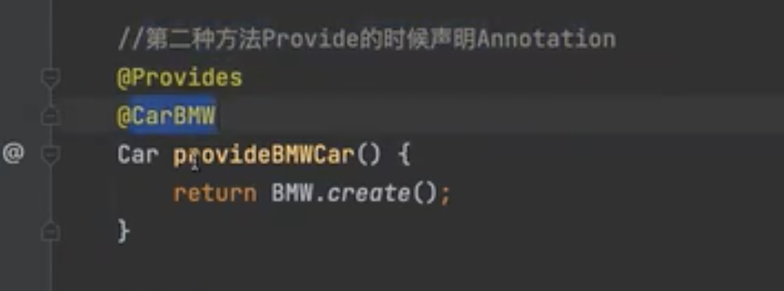

# Guice学习笔记

## Google I/O 2009 - Big Modular Java with Guice

https://www.youtube.com/watch?v=hBVJbzAagfs

>
>
>
>
>
>
>
>
>


## 依赖注入DI -- Guice by古城算法

https://www.bilibili.com/video/BV1qr4y137qW

### 三种依赖注入的方式


#### 三种方式向容器中注入对象

1. 构造方法加 @Inject   ，构造器实例化对象本身注入、构造器方法参数注入。


2. bind to interface or instance
3. use @Provides （类似spring @Bean）


使用 Provides 替换bind


### Singleton

三种方式实现singleton的效果，保证在 guice 的bean map 中只有一个instance 实例。


### Provider

只要**标记注入容器中的对象**，都可以通过 Provider 类去获取，并且只有在provider.get() 方法调用的时候，被注入的类对象才会真正的实例化并注入。


### Named 已经被 duplicated

声明Bean 的时候加上 @Named 注解(向容器中注入的时候会把name也拼上作为key)，构造器拿Bean的时候也加上对应的 @Named 注解, 会拿到不同name的bean实现.

被废弃的原因是 Named 注解里面是 String ，no strong type checking.


### @Qualifier 已经替换了 @Named

@Qualifier 加到注解上。


注入有以下两种方式：

配合 bind 用的比较少。


在 @Provides 声明的时候带上 Qualifer 的方式比较多。



获取时把对应的注解再加上：


# 文章

## DI | Guice教程篇

https://aiden-dong.gitee.io/2019/07/25/DI%E6%A1%86%E6%9E%B6Guice%E6%95%99%E7%A8%8B/

>**默认情况下，Guice为每一个依赖（对应Spring的“prototype”范围）注入一个新的、单独的对象实例，而Spring则默认提供单态实例**。
>
>#### 直接绑定:
>
>被依赖基类:
>
>```
>public class DatabaseTransactionLog extends TransactionLog{}
>public class MySqlDatabaseTransactionLog extends DatabaseTransactionLog{}
>```
>
>直接依赖配置
>
>```
>public class BillingModule extends AbstractModule {
>  @Override 
>  protected void configure() {
>    bind(TransactionLog.class).to(DatabaseTransactionLog.class);
>    bind(DatabaseTransactionLog.class).to(MySqlDatabaseTransactionLog.class);
>  }
>}
>```
>
>如果请求 `TransactionLog` 时， 将返回 `DatabaseTransactionLog`
>
>```
>@Inject
>private TransactionLog log;
>```
>
>#### `@ImplementedBy`
>
>```
>public class PayPalCreditCardProcessor implements CreditCardProcessor {
>}
>@ImplementedBy(PayPalCreditCardProcessor.class)
>public interface CreditCardProcessor {
>  ChargeResult charge(String amount, CreditCard creditCard)
>      throws UnreachableException;
>}
>```
>
>等效与
>
>```
>bind(CreditCardProcessor.class).to(PayPalCreditCardProcessor.class);
>```
>
>#### 注释依赖:
>
>Guice附带一个 `@Named` 带有字符串的内置绑定注释：
>
>```
>@Inject
>@Named('dataLog')
>private TransactionLog log;
>```
>
>要绑定特定名称，请使用`Names.named()`以创建要传递给的实例 `annotatedWith`
>
>```
>bind(TransactionLog.class)
>    .annotatedWith(Names.named("dataLog"))
>    .to(DatabaseTransactionLog.class);
>```
>
>#### 注解依赖:
>
>定义注解:
>
>```
>import com.google.inject.BindingAnnotation;
>import java.lang.annotation.Target;
>import java.lang.annotation.Retention;
>import static java.lang.annotation.RetentionPolicy.RUNTIME;
>import static java.lang.annotation.ElementType.PARAMETER;
>import static java.lang.annotation.ElementType.FIELD;
>import static java.lang.annotation.ElementType.METHOD;
>
>@Target({ FIELD, PARAMETER, METHOD }) 
>@Retention(RUNTIME)
>@BindingAnnotation 
>public @interface PayPal {}
>```
>
>> 说明:
>
>`@BindingAnnotation` 告诉Guice这是一个绑定注释。如果多个绑定注释适用于同一成员，Guice将产生错误。
>
>`@Target({FIELD, PARAMETER, METHOD})` 对您的用户是礼貌的。它可以防止@PayPal在没有任何用途的情况下意外使用。
>
>`@Retention(RUNTIME)` 使注释在运行时可用。
>
>依赖:
>
>```
>@Inject
>@PayPal
>private CreditCardProcessor processor;
>```
>
>绑定配置:
>
>```
>bind(CreditCardProcessor.class)
>    .annotatedWith(PayPal.class)
>    .to(PayPalCreditCardProcessor.class);
>```
>
>### 通过方法构造的类依赖
>
>当我们需要代码来创建对象时，则需要基于方法构造类依赖方式。
>
>#### `@Provides` 注解
>
>如果构造类的方法在 `AbstractModule` 派生类中，我们可以使用 `@Provides` 注解把返回对象托管给 Guice.
>
>```
>public class BillingModule extends AbstractModule {
>  @Override
>  protected void configure() {
>    ...
>  }
>
>  @Provides
>  TransactionLog provideTransactionLog() {
>    DatabaseTransactionLog transactionLog = new DatabaseTransactionLog();
>    transactionLog.setJdbcUrl("jdbc:mysql://localhost/pizza");
>    transactionLog.setThreadPoolSize(30);
>    return transactionLog;
>  }
>}
>```
>
>当然，`@Provides` 注解可以配合`@Named`, 或自定义依赖注解一起使用.
>
>```
>@Provides 
>@PayPal
>CreditCardProcessor providePayPalCreditCardProcessor(
>    @Named("PayPal API key") String apiKey) {
>  PayPalCreditCardProcessor processor = new PayPalCreditCardProcessor();
>  processor.setApiKey(apiKey);
>  return processor;
>}
>```
>
>#### `Provider<T>` 派生类
>
>当我们的 `@Provides` 方法开始变得复杂时，就可以定义类来进行封装。 提供程序类实现了Guice的Provider接口，这是一个用于提供值的简单通用接口：
>
>```
>public interface Provider<T> {
>   T get（）;
>}
>```
>
>我们实现了Provider接口，已提供自定义实体对象，以定义完整类型安全返回的内容：
>
>```
>public class DatabaseTransactionLogProvider implements Provider<TransactionLog> {
>  private final Connection connection;
>
>  @Inject
>  public DatabaseTransactionLogProvider(Connection connection) {
>    this.connection = connection;
>  }
>
>  public TransactionLog get() {
>    DatabaseTransactionLog transactionLog = new DatabaseTransactionLog();
>    transactionLog.setConnection(connection);
>    return transactionLog;
>  }
>}
>```
>
>这个时候我们需要在 `AbstractModule` 派生类中绑定我们的类。
>
>```
>@Override
>protected void configure() {
>  bind(TransactionLog.class)
>      .toProvider(DatabaseTransactionLogProvider.class);
>}
>```
>
>#### `@ProvidedBy` 注解
>
>`@ProvidedBy` 告诉注入器一个`Provider`生成实例的类：
>
>```
>@ProvidedBy(DatabaseTransactionLogProvider.class)
>public interface TransactionLog {
>  void logConnectException(UnreachableException e);
>  void logChargeResult(ChargeResult result);
>}
>```
>
>注释等同于 `toProvider()` 绑定：
>
>```
>bind(TransactionLog.class)
>    .toProvider(DatabaseTransactionLogProvider.class);
>```
>
>### Scopes
>
>默认情况下，`Guice`每次提供一个值时都会返回一个新实例。
>
>不过我们也可以通过注解来显式的配置依赖的生命周期。
>
>| 注解             | 范围                           |
>| :--------------- | :----------------------------- |
>| `@Singleton`     | 整个应用程序生命周期范围(单例) |
>| `@SessionScoped` | 基于session的会话范围          |
>| `@RequestScoped` | 基于每次请求的范围             |
>
>> 应用范围
>
>Guice使用注释来标识范围。通过将范围注释应用于实现类来指定类型的范围。除了功能性之外，此注释还可用作文档。例如，`@Singleton`表示该类旨在是线程安全的。
>
>```
>@Singleton
>public class InMemoryTransactionLog implements TransactionLog {
>  /* everything here should be threadsafe! */
>}
>```
>
>`Scopes` 也可以在`bind`语句中配置：
>
>```
>bind(TransactionLog.class).to(InMemoryTransactionLog.class).in(Singleton.class);
>```
>
>也可以通过`@Provides`注释方法：
>
>```
>@Provides  
>@Singleton 
>TransactionLog provideTransactionLog（）{
>   ... 
>}
>```
>
>### Injections 
>
>**依赖注入模式将行为与依赖性解析分开。 该模式不是直接查找依赖项或从工厂查找依赖项，而是建议传入依赖项。 将依赖项设置为对象的过程称为注入。**
>
>#### 构造器函数注入
>
>构造函数注入将实例化与注入相结合。要使用它，请使用注释注释构造函数`@Inject`。 此构造函数应接受类依赖项作为参数。然后，大多数构造函数将参数分配给最终字段。
>
>```
>public class RealBillingService implements BillingService {
>  private final CreditCardProcessor processorProvider;
>  private final TransactionLog transactionLogProvider;
>
>  @Inject
>  public RealBillingService(CreditCardProcessor processorProvider,
>      TransactionLog transactionLogProvider) {
>    this.processorProvider = processorProvider;
>    this.transactionLogProvider = transactionLogProvider;
>  }
>```
>
>如果您的类没有@`Inject`注释构造函数，Guice将使用 `public no-arguments 构造函数`（如果存在)。 首选注释，该类型参与依赖注入的文档。
>
>#### 函数注入
>
>Guice可以注入具有`@Inject`注释的方法。 依赖关系采用参数的形式，在调用方法之前，注入器会解析这些参数。 注入的方法可以具有任意数量的参数，并且方法名称不会影响注入。
>
>```
>public class PayPalCreditCardProcessor implements CreditCardProcessor {
>  
>  private static final String DEFAULT_API_KEY = "development-use-only";
>  
>  private String apiKey = DEFAULT_API_KEY;
>
>  @Inject
>  public void setApiKey(@Named("PayPal API key") String apiKey) {
>    this.apiKey = apiKey;
>  }
>```
>
>#### 字段注入
>
>Guice使用`@Inject`注释注入字段。这是最简洁的注射剂，**但是最不可测试的**。
>
>```
>public class DatabaseTransactionLogProvider implements Provider<TransactionLog> {
>  @Inject 
>  Connection connection;
>
>  public TransactionLog get() {
>    return new DatabaseTransactionLog(connection);
>  }
>}
>```
>
>

## Guice依赖注入的三种方式和injectMembers方法的使用

https://blog.csdn.net/sidongxue2/article/details/72626470

>注解:依赖注入@Inject * 依赖注入的方式有三种:[属性](https://www.jb51.cc/tag/shuxing/)注入,构造[方法](https://www.jb51.cc/tag/fangfa/)注入和setter[方法](https://www.jb51.cc/tag/fangfa/)注入. 
>
>* Injector.injectMembers[方法](https://www.jb51.cc/tag/fangfa/)的[使用](https://m.jb51.cc/tag/shiyong/): * 即如果某个对象是new出来的,但是它里面的对象需要依赖需要注入,则可[使用](https://m.jb51.cc/tag/shiyong/)injectMembers[方法](https://www.jb51.cc/tag/fangfa/).

## 你用过依赖注入框架 Google Guice 吗？

https://ld246.com/article/1639316349334/comment/1639390913496

>Guice 里最常用的两个注解就是 @Singleton 和 @Inject，Singleton 表示构建的对象是单例的，Inject 表示被标注的字段将使用 Guice 自动注入。在一般的项目中这两个注解一般可以完成 90% 以上的装配工作。
>
>Guice 需要实例化对象，请确保相应**被实例化的对象有默认构造器**。

## 轻量级IOC框架Guice

http://t.zoukankan.com/Leo_wl-p-4186142.html

>Guice 是由 Google 大牛Bob lee开发的一款绝对轻量级的java IoC容器。其优势在于：
>
>1. 速度快，号称比spring快100倍。
>2. 无外部配置(如需要使用外部可以可以选用Guice的扩展包)，完全基于annotation特性，支持重构，代码静态检查。
>3. 简单，快速，基本没有学习成本。
>
>Guice和spring各有所长，Guice更适合与嵌入式或者高性能但项目简单方案，如OSGI容器，spring更适合大型项目组织。
>
>**Binder利用链式形成一套独具语义的DSL**，如：
>
>- 基本配置：binder.bind(serviceClass).to(implClass).in(Scopes.[SINGLETON | NO_SCOPE]);
>- 无base类、接口配置：binder.bind(implClass).in(Scopes.[SINGLETON | NO_SCOPE]);
>- service实例配置：binder.bind(serviceClass).toInstance(servieInstance).in(Scopes.[SINGLETON | NO_SCOPE]);
>- 多个实例按名注入：binder.bind(serviceClass).annotatedWith(Names.named(“name”)).to(implClass).in(Scopes.[SINGLETON | NO_SCOPE]);
>- 运行时注入：利用@Provides标注注入方法，相当于spring的@Bean。
>- @ImplementedBy：或者在实现接口之上标注@ImplementedBy指定其实现类。这种方式有点反OO设计，抽象不该知道其实现类。
>
>对于上面的配置在注入的方式仅仅需要@Inject标注，但对于按名注入需要在参数前边加入@Named标注，如：
>
>```java
>public void configure() {
>    final Binder binder = binder();
>    //TODO: bind named instance;
>}
>@Inject
>public List<NamedService> getAllItemServices(@Named("impl1") NamedService nameService1,
>                                                 @Named("impl2") NamedService nameService2) {
>}
>```
>
>Guice也可以利用@Provides标注注入方法来运行时注入：如  
>
>```java
>   @Provides
>   public List<NamedService> getAllItemServices(@Named("impl1") NamedService nameService1,
>                                             @Named("impl2") NamedService nameService2) {
>    final ArrayList<NamedService> list = new ArrayList<NamedService>();
>    list.add(nameService1);
>    list.add(nameService2);
>    return list;
>}
>```
>
>## Guice的使用
>
>对于Guice的使用则比较简单，利用利用Guice module初始化Guice创建其injector，如：
>
>```java
>Injector injector = Guice.createInjector(new AppModule(bundleContext));
>```
>
>这里可以传入多个module，我们可以利用module分离领域依赖。
>
>Guice api方法：
>
>```java
>public static Injector createInjector(Module... modules) 
>
>public static Injector createInjector(Iterable<? extends Module> modules) 
>
>public static Injector createInjector(Stage stage, Module... modules)
>
>public static Injector createInjector(Stage stage, Iterable<? extends Module> modules) 
>```
>
>Guice同时也支持不同Region配置，上面的State重载，state支持 TOOL,DEVELOPMENT,PRODUCTION选项;默认为DEVELOPMENT环境。
>
>

# 官网&学习网站

## Google Guice Tutorial

https://www.tutorialspoint.com/guice/index.htm

>
>
>

## guice github

https://github.com/google/guice

## guice 的设计原理讲得很好

https://github.com/google/guice/wiki/MentalModel

>## Using Guice
>
>There are two parts to using Guice:
>
>1. **Configuration**: your application adds things into the "Guice map".
>2. **Injection**: your application asks Guice to create and retrieve objects from the map.
>
>

## Scopes

### Singleton

Guice comes with a built-in `@Singleton` scope that reuses the same instance during the lifetime of an application within a single injector. Both `javax.inject.Singleton` and `com.google.inject.Singleton` are supported by Guice, but **prefer the standard `javax.inject.Singleton`** since it is also supported by other injection frameworks like Dagger.

## Bindings

*Overview of bindings in Guice*

A **binding** is an object that corresponds to an entry in the [Guice map](https://github.com/google/guice/wiki/MentalModel.md). You add new entries into the Guice map by creating bindings.

## BindingAnnotations

Occasionally you'll want multiple bindings for the same type. For example, you might want both a PayPal credit card processor and a Google Checkout processor. To enable this, bindings support an optional *binding annotation*. The annotation and type together uniquely identify a binding. **This pair is called a *key*.**

**To depend on the annotated binding, apply the annotation to the injected parameter:**

```java
public class RealBillingService implements BillingService {

  @Inject
  public RealBillingService(@PayPal CreditCardProcessor processor,
      TransactionLog transactionLog) {
    ...
  }
```

**Lastly we create a binding that uses the annotation:**

```java
final class CreditCardProcessorModule extends AbstractModule {
  @Override
  protected void configure() {
    // This uses the optional `annotatedWith` clause in the `bind()` statement
    bind(CreditCardProcessor.class)
        .annotatedWith(PayPal.class)
        .to(PayPalCreditCardProcessor.class);
  }

  // This uses binding annotation with a @Provides method
  @Provides
  @GoogleCheckout
  CreditCardProcessor provideCheckoutProcessor(
      CheckoutCreditCardProcessor processor) {
    return processor;
  }
}
```

## @Named

Guice comes with a built-in binding annotation `@Named` that takes a string:

```java
public class RealBillingService implements BillingService {

  @Inject
  public RealBillingService(@Named("Checkout") CreditCardProcessor processor,
      TransactionLog transactionLog) {
    ...
  }
```

To bind a specific name, use `Names.named()` to create an instance to pass to `annotatedWith`:

```java
final class CreditCardProcessorModule extends AbstractModule {
  @Override
  protected void configure() {
    bind(CreditCardProcessor.class)
      .annotatedWith(Names.named("Checkout"))
      .to(CheckoutCreditCardProcessor.class);
  }
}
```

Since the compiler can't check the string, we recommend using `@Named` sparingly. Defining your own purpose-built annotations provides better type-safety.

## InstanceBindings

You can bind a type to a specific instance of that type. This is usually only useful for objects that don't have dependencies of their own, such as value objects:

```java
    bind(String.class)
        .annotatedWith(Names.named("JDBC URL"))
        .toInstance("jdbc:mysql://localhost/pizza");
    bind(Integer.class)
        .annotatedWith(Names.named("login timeout seconds"))
        .toInstance(10);
```

Avoid using `.toInstance` with objects that are complicated to create, since it can slow down application startup. You can use an `@Provides` method instead.

You can also bind constants using `bindConstant`:

```java
  bindConstant()
      .annotatedWith(HttpPort.class)
      .to(8080);
```

`bindConstant` is a shortcut to bind primitive types and other constant types like `String`, enum and `Class`.

## @Provides Methods

When you need code to create an object, use an `@Provides` method. The method must be defined within a module, and it must have an `@Provides` annotation. **The method's return type is the bound type. Whenever the injector needs an instance of that type, it will invoke the method.**

```java
public class BillingModule extends AbstractModule {
  @Override
  protected void configure() {
    ...
  }

  @Provides
  static TransactionLog provideTransactionLog() {
    DatabaseTransactionLog transactionLog = new DatabaseTransactionLog();
    transactionLog.setJdbcUrl("jdbc:mysql://localhost/pizza");
    transactionLog.setThreadPoolSize(30);
    return transactionLog;
  }
}
```

TIP: `@Provides` methods can be static methods or instance methods.

### With Binding Annotation

If the `@Provides` method has a binding annotation like `@PayPal` or `@Named("Checkout")`, Guice binds the annotated type. Dependencies can be passed in as parameters to the method. The injector will exercise the bindings for each of these before invoking the method.

```java
  @Provides @PayPal
  CreditCardProcessor providePayPalCreditCardProcessor(
      @Named("PayPal API key") String apiKey) {
    PayPalCreditCardProcessor processor = new PayPalCreditCardProcessor();
    processor.setApiKey(apiKey);
    return processor;
  }
```

## Provider Bindings

When your `@Provides` methods start to grow complex, you may consider moving them to a class of their own. **The provider class implements Guice's `Provider` interface, which is a simple, general interface for supplying values:**

```java
public interface Provider<T> {
  T get();
}
```

**Our provider implementation class has dependencies of its own, which it receives via its `@Inject`-annotated constructor. It implements the `Provider` interface to define what's returned with complete type safety:**

```java
public class DatabaseTransactionLogProvider implements Provider<TransactionLog> {
  private final Connection connection;

  @Inject
  public DatabaseTransactionLogProvider(Connection connection) {
    this.connection = connection;
  }

  public TransactionLog get() {
    DatabaseTransactionLog transactionLog = new DatabaseTransactionLog();
    transactionLog.setConnection(connection);
    return transactionLog;
  }
}
```

**Finally we bind to the provider using the `.toProvider` clause:**

```java
public class BillingModule extends AbstractModule {
  @Override
  protected void configure() {
    bind(TransactionLog.class)
        .toProvider(DatabaseTransactionLogProvider.class);
  }
}
```

If your providers are complex, be sure to test them!

## UntargettedBindings

You may create bindings without specifying a target. This is most useful for concrete classes and types annotated by either `@ImplementedBy` or `@ProvidedBy`. **An untargeted binding informs the injector about a type, so it may prepare dependencies eagerly.** Untargeted bindings have no *to* clause, like so:

```java
    bind(MyConcreteClass.class);
    bind(AnotherConcreteClass.class).in(Singleton.class);
```

When specifying binding annotations, you must still add the target binding, even it is the same concrete class. For example:

```java
    bind(MyConcreteClass.class)
        .annotatedWith(Names.named("foo"))
        .to(MyConcreteClass.class);
    bind(AnotherConcreteClass.class)
        .annotatedWith(Names.named("foo"))
        .to(AnotherConcreteClass.class)
        .in(Singleton.class);
```

## Constructor Bindings

**Occasionally it's necessary to bind a type to an arbitrary constructor. This comes up when the `@Inject` annotation cannot be applied to the target constructor: either because it is a third party class, or because *multiple* constructors that participate in dependency injection.** [@Provides methods](https://github.com/google/guice/wiki/ProvidesMethods) provide the best solution to this problem! By calling your target constructor explicitly, you don't need reflection and its associated pitfalls. But there are limitations of that approach: manually constructed instances do not participate in [AOP](https://github.com/google/guice/wiki/AOP).

To address this, Guice has `toConstructor()` bindings. They require you to reflectively select your target constructor and handle the exception if that constructor cannot be found:

```java
public class BillingModule extends AbstractModule {
  @Override
  protected void configure() {
    try {
      bind(TransactionLog.class).toConstructor(
          DatabaseTransactionLog.class.getConstructor(DatabaseConnection.class));
    } catch (NoSuchMethodException e) {
      addError(e);
    }
  }
}
```

In this example, the `DatabaseTransactionLog` must have a constructor that takes a single `DatabaseConnection` parameter. That constructor does not need an `@Inject` annotation. Guice will invoke that constructor to satisfy the binding.

## Built-in Bindings

## Just-in-time Bindings

***Bindings that are created automatically by Guice***

When the injector needs an instance of a type, it needs a binding. The bindings in modules are called *explicit bindings*, and the injector uses them whenever they're available. **If a type is needed but there isn't an explicit binding, the injector will attempt to create a *Just-In-Time binding*. These are also known as *JIT bindings* or *implicit bindings*.**

## @Inject Constructors

Guice can create bindings for concrete types by using the type's *injectable constructor*. Guice considers a constructor injectable if:

- (**recommended**) The constructor is explicitly annotated with `@Inject` (both `com.google.inject.Inject` and `javax.inject.Inject` are supported).
- or, the constructor takes zero arguments, and
  - the constructor is non-private and defined in a non-private class (Guice supports private constructor only when it is defined in a private class, however, private constructors are not recommended because they can be slow in Guice due to the cost of reflection). 
  - the injector has not opted in to require explicit @Inject constructor, see [explicit @Inject constructors](https://github.com/google/guice/wiki/JustInTimeBindings#explicit-inject-constructors-feature) section below.

**Injectable constructor examples:**

```java
public final class Foo {
  // An @Inject annotated constructor.
  @Inject
  Foo(Bar bar) {
    ...
  }
}

public final class Bar {
  // A no-arg non private constructor.
  Bar() {}

  private static class Baz {
    // A private constructor to a private class is also usable by Guice, but
    // this is not recommended since it can be slow.
    private Baz() {}
  }
}
```

A constructor is **not injectable** if:

- The constructor takes one or more arguments and is not annotated with `@Inject`.
- There are more than one `@Inject` annotated constructors.
- The constructor is defined in a non-static nested class. Inner classes have an implicit reference to their enclosing class that cannot be injected.

**Non-injectable constructor examples:**

```java
public final class Foo {
  // Not injectable because the construct takes an argument and there is no
  // @Inject annotation.
  Foo(Bar bar) {
    ...
  }
}

public final class Bar {
  // Not injectable because the constructor is private
  private Bar() {}

  class Baz {
    // Not injectable because Baz is not a static inner class
    Baz() {}
  }
}
```

#### Explicit @Inject constructors feature

An application can opt-in to enforce that Guice only use `@Inject` annotated constructors by calling `binder().requireAtInjectRequired()` in a module that is installed in the injector. When opted-in, Guice will only consider `@Inject` annotated constructors and if there is none then a `MISSING_CONSTRUCTOR` is reported.

**TIP:** Install `Modules.requireAtInjectOnConstructorsModule()` to opt-in for `@Inject` on constructor requirement.

### @ImplementedBy

### @ProvidedBy

`@ProvidedBy` tells the injector about a `Provider` class that produces instances:

```java
@ProvidedBy(DatabaseTransactionLogProvider.class)
public interface TransactionLog {
  void logConnectException(UnreachableException e);
  void logChargeResult(ChargeResult result);
}
```

The annotation is equivalent to a `toProvider()` binding:

```java
    bind(TransactionLog.class)
        .toProvider(DatabaseTransactionLogProvider.class);
```

Like `@ImplementedBy`, if the type is annotated and used in a `bind()` statement, the `bind()` statement will be used.

### Enforce Explicit Bindings

To disable implicit bindings, you can use the `requireExplicitBindings` API:

```java
final class ExplicitBindingModule extends AbstractModule {
  @Override
  protected void configure() {
    binder().requireExplicitBindings();
  }
}
```

Installing the above module will cause Guice to enforce that all bindings must be listed in a Module in order to be injected.

## Multibindings


## Injections

*How Guice initializes your objects*

### Constructor Injection

Constructor injection combines instantiation with injection. To use it, annotate the constructor with the `@Inject` annotation. This constructor should accept class dependencies as parameters. Most constructors will then assign the parameters to final fields.

```java
public class RealBillingService implements BillingService {
  private final CreditCardProcessor processorProvider;
  private final TransactionLog transactionLogProvider;

  @Inject
  RealBillingService(CreditCardProcessor processorProvider,
      TransactionLog transactionLogProvider) {
    this.processorProvider = processorProvider;
    this.transactionLogProvider = transactionLogProvider;
  }
```

If your class has no `@Inject`-annotated constructor, Guice will use a public, no-arguments constructor if it exists. Prefer the annotation, which documents that the type participates in dependency injection.

### Method Injection

**WARNING**: Method injection implies that the class being injected into is mutable, which should be avoided in general. So prefer [constructor injection](https://github.com/google/guice/wiki/Injections#constructor-injection) over method injection.

Guice can inject methods that have the `@Inject` annotation. Dependencies take the form of parameters, which the injector resolves before invoking the method. Injected methods may have any number of parameters, and the method name does not impact injection. 

```java
public class PayPalCreditCardProcessor implements CreditCardProcessor {

  private static final String DEFAULT_API_KEY = "development-use-only";

  private String apiKey = DEFAULT_API_KEY;

  @Inject
  public void setApiKey(@Named("PayPal API key") String apiKey) {
    this.apiKey = apiKey;
  }
```

### Field Injection

**WARNING**: Same as [method injection](https://github.com/google/guice/wiki/Injections#method-injection), field injection implies that the class being injected into is mutable, which should be avoided in general. So prefer [constructor injection](https://github.com/google/guice/wiki/Injections#constructor-injection) over field injection.

Guice injects fields with the `@Inject` annotation. This is the most concise injection, but the least testable.

```java
public class DatabaseTransactionLogProvider implements Provider<TransactionLog> {
  @Inject Connection connection;

  public TransactionLog get() {
    return new DatabaseTransactionLog(connection);
  }
}
```

Avoid using field injection with `final` fields, which has [weak semantics](http://java.sun.com/javase/6/docs/api/java/lang/reflect/Field.html#set(java.lang.Object, java.lang.Object)).

### Optional Injections

Occasionally it's convenient to use a dependency when it exists and to fall back to a default when it doesn't. Method and field injections may be optional, which causes Guice to silently ignore them when the dependencies aren't available. To use optional injection, apply the `@Inject(optional=true)` annotation:

```java
public class PayPalCreditCardProcessor implements CreditCardProcessor {
  private static final String SANDBOX_API_KEY = "development-use-only";

  private String apiKey = SANDBOX_API_KEY;

  @Inject(optional=true)
  public void setApiKey(@Named("PayPal API key") String apiKey) {
    this.apiKey = apiKey;
  }
```

### On-demand Injection

Method and field injection can be used to initialize an existing instance. You can use the `Injector.injectMembers` API:

```java
  public static void main(String[] args) {
    Injector injector = Guice.createInjector(...);

    CreditCardProcessor creditCardProcessor = new PayPalCreditCardProcessor();
    injector.injectMembers(creditCardProcessor);
```

### Automatic Injection

Guice automatically performs field and method injections on the following type of objects:

- instances passed to `toInstance()` in a bind statement
- provider instances passed to `toProvider()` in a bind statement

Those injections are performed as part of injector creation.

### Injection Points

An *injection point* is a place in the code where Guice has been asked to inject a dependency.

Example injection points:

- parameters of an [injectable constructor](https://github.com/google/guice/wiki/JustInTimeBindings#inject-constructors)
- parameters of a [@Provides method](https://github.com/google/guice/wiki/ProvidesMethods)
- parameters of an [`@Inject` annotated method](https://github.com/google/guice/wiki/Injections#method-injection)
- [fields annotated with `@Inject`](https://github.com/google/guice/wiki/Injections#field-injection)

## Aspect Oriented Programming

Most developers won't write method interceptors directly; but they may see their use in integration libraries like [Warp Persist](http://www.wideplay.com/guicewebextensions2). Those that do will need to select the matching methods, create an interceptor, and configure it all in a module.

[Matcher](http://google.github.io/guice/api-docs/latest/javadoc/com/google/inject/matcher/Matcher.html) is a simple interface that either accepts or rejects a value. For Guice AOP, you need two matchers: one that defines which classes participate, and another for the methods of those classes. To make this easy, there's a [factory class](http://google.github.io/guice/api-docs/latest/javadoc/com/google/inject/matcher/Matchers.html) to satisfy the common scenarios.

[MethodInterceptors](http://aopalliance.sourceforge.net/doc/org/aopalliance/intercept/MethodInterceptor.html) are executed whenever a matching method is invoked. They have the opportunity to inspect the call: the method, its arguments, and the receiving instance. They can perform their cross-cutting logic and then delegate to the underlying method. Finally, they may inspect the return value or exception and return. Since interceptors may be applied to many methods and will receive many calls, their implementation should be efficient and unintrusive.

## Example: Forbidding method calls on weekends

To illustrate how method interceptors work with Guice, we'll forbid calls to our pizza billing system on weekends. The delivery guys only work Monday thru Friday so we'll prevent pizza from being ordered when it can't be delivered! This example is structurally similar to use of AOP for authorization.

To mark select methods as weekdays-only, we define an annotation:

```
@Retention(RetentionPolicy.RUNTIME) @Target(ElementType.METHOD)
@interface NotOnWeekends {}
```

...and apply it to the methods that need to be intercepted:

```java
public class RealBillingService implements BillingService {

  @NotOnWeekends
  public Receipt chargeOrder(PizzaOrder order, CreditCard creditCard) {
    ...
  }
}
```

Next, we define the interceptor by implementing the `org.aopalliance.intercept.MethodInterceptor` interface. When we need to call through to the underlying method, we do so by calling `invocation.proceed()`:

```java
public class WeekendBlocker implements MethodInterceptor {
  public Object invoke(MethodInvocation invocation) throws Throwable {
    Calendar today = new GregorianCalendar();
    if (today.getDisplayName(DAY_OF_WEEK, LONG, ENGLISH).startsWith("S")) {
      throw new IllegalStateException(
          invocation.getMethod().getName() + " not allowed on weekends!");
    }
    return invocation.proceed();
  }
}
```

Finally, we configure everything. This is where we create matchers for the classes and methods to be intercepted. In this case we match any class, but only the methods with our `@NotOnWeekends` annotation:

```java
public class NotOnWeekendsModule extends AbstractModule {
  protected void configure() {
    bindInterceptor(Matchers.any(), Matchers.annotatedWith(NotOnWeekends.class),
        new WeekendBlocker());
  }
}
```

Putting it all together, (and waiting until Saturday), we see the method is intercepted and our order is rejected:

```
Exception in thread "main" java.lang.IllegalStateException: chargeOrder not allowed on weekends!
  at com.publicobject.pizza.WeekendBlocker.invoke(WeekendBlocker.java:65)
  at com.google.inject.internal.InterceptorStackCallback.intercept(...)
  at com.publicobject.pizza.RealBillingService$$EnhancerByGuice$$49ed77ce.chargeOrder(<generated>)
  at com.publicobject.pizza.WeekendExample.main(WeekendExample.java:47)
```

Behind the scenes, method interception is implemented by generating bytecode at runtime. Guice dynamically creates a subclass that applies interceptors by overriding methods. If you are on a platform that doesn't support bytecode generation (such as Android), you should use [Guice without AOP support](https://github.com/google/guice/wiki/OptionalAOP).

This approach imposes limits on what classes and methods can be intercepted:

- Classes must be public or package-private.
- Classes must be non-final
- Methods must be public, package-private or protected
- Methods must be non-final
- Instances must be created by Guice by an `@Inject`-annotated or no-argument constructor. It is not possible to use method interception on instances that aren't constructed by Guice.

### Injecting Interceptors

If you need to inject dependencies into an interceptor, use the `requestInjection` API.

```java
public class NotOnWeekendsModule extends AbstractModule {
  protected void configure() {
    WeekendBlocker weekendBlocker = new WeekendBlocker();
    requestInjection(weekendBlocker);
    bindInterceptor(Matchers.any(), Matchers.annotatedWith(NotOnWeekends.class),
       weekendBlocker);
  }
}
```

Another option is to use Binder.getProvider and pass the dependency in the constructor of the interceptor.

```java
public class NotOnWeekendsModule extends AbstractModule {
  protected void configure() {
    bindInterceptor(any(),
                    annotatedWith(NotOnWeekends.class),
                    new WeekendBlocker(getProvider(Calendar.class)));
  }
}
```

Use caution when injecting interceptors. If your interceptor calls a method that it itself is intercepting, you may receive a `StackOverflowException` due to unending recursion.


