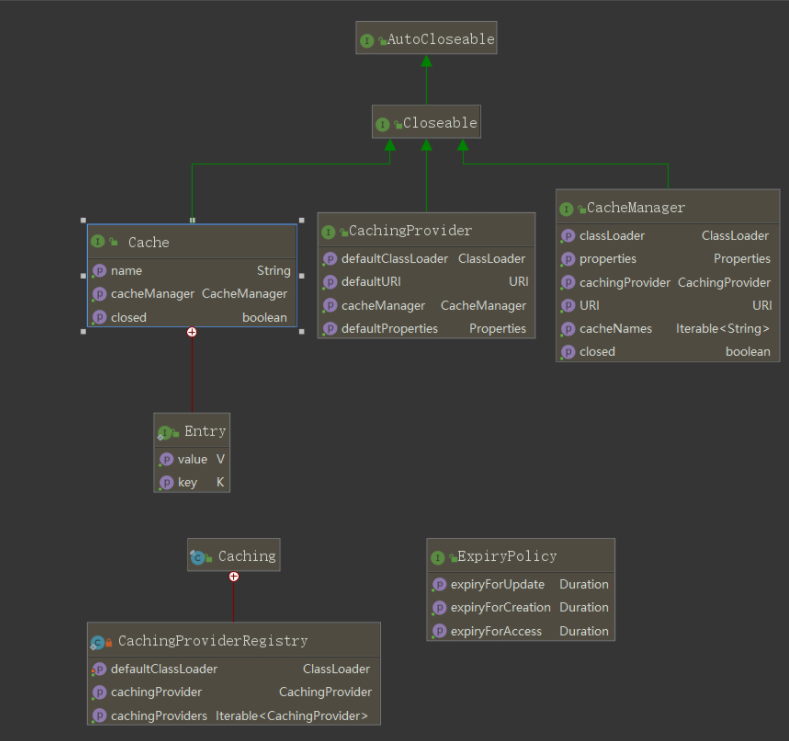
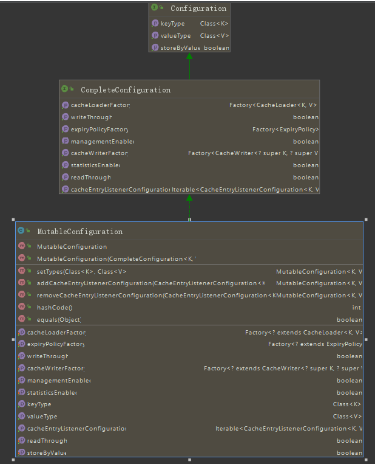
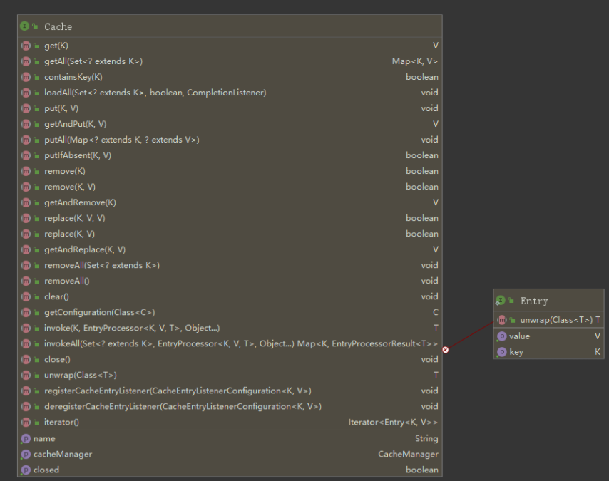
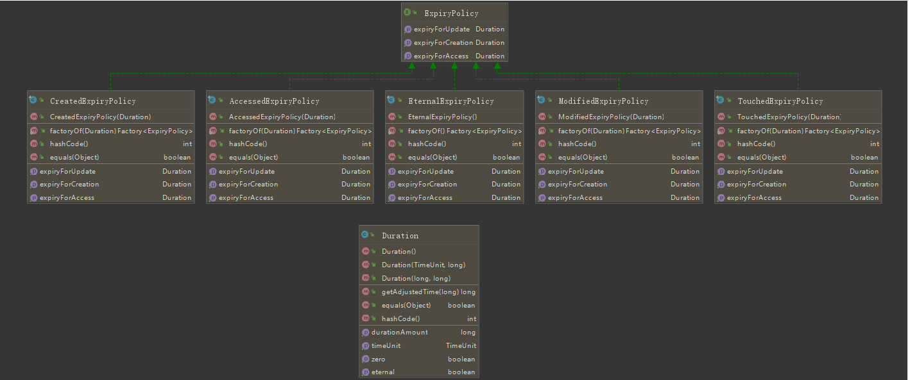
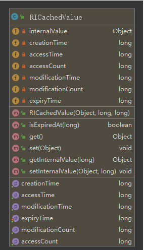

# 官方文档

https://docs.google.com/document/d/1ijduF_tmHvBaUS7VBBU2ZN8_eEBiFaXXg9OI0_ZxCrA/edit#

## Introduction

This specification describes the objectives and functionality of the Java Caching Application Programming Interface (“API”). 
The Java Caching API provides a common way for Java programs to create, access, update and remove entries from caches.

## Fundamentals

**Core Concepts**

The Java Caching API defines five core interfaces: 

**CachingProvider**, **CacheManager**, **Cache**, **Entry** and **ExpiryPolicy**.
		A **CachingProvider** defines the mechanism to establish, configure, acquire, manage and control zero or more CacheManagers. An application may access and use zero or more CachingProviders at runtime.
		A **CacheManager** defines the mechanism to establish, configure, acquire, manage and control zero or more uniquely named Caches all within the context of the CacheManager. A CacheManager is owned by a single CachingProvider.
		A **Cache** is a Map-like data-structure that permits the temporary storage of Key-based Values, some what like java.util.Map data-structure. A Cache is owned by a single CacheManager. 
		An **Entry** is a single **key-value pair stored by a Cache.** 
		Each entry stored by a cache has a defined duration, called the **Expiry Duration**, during which they may be accessed, updated and removed. Once this duration has passed, the entry is said to be Expired. Once expired, entries are no longer available to be accessed, updated or removed, just as if they never existed in a cache. **Expiry** is set using an ExpiryPolicy.




```java
//resolve a cache manager
    CachingProvider cachingProvider = Caching.getCachingProvider();
    CacheManager cacheManager = cachingProvider.getCacheManager();

    //configure the cache
    MutableConfiguration<String, Integer> config = 
   new MutableConfiguration<>()
        .setTypes(String.class, Integer.class)
        .setExpiryPolicyFactory(AccessedExpiryPolicy.factoryOf(ONE_HOUR))
        .setStatisticsEnabled(true);

    //create the cache
    Cache<String, Integer> cache = cacheManager.createCache("simpleCache", config);

    //cache operations
    String key = "key";
    Integer value1 = 1;
    cache.put("key", value1);
    Integer value2 = cache.get(key);
    assertEquals(value1, value2);
    cache.remove(key);
    assertNull(cache.get(key));


```

## **《剖析缓存系列》—— 熟悉JSR-107 JAVA缓存规范**

https://www.imooc.com/article/details/id/291449

### Caching 是个工具类

**Caching**类时javax提供的一个工具类，为了方便开发者去获取合适的**CachingProvider**实例的（该接口的实现类是管理CacheManager的生命周期）。该Caching类大致提供了3种获取**CachingProvider**实例的方式

1. 获取默认的**CachingProvider**
2. 根据**ClassLoader**获取**CachingProvider**
3. 根据全类名创建/获取开发者实现的实例

### CachingProvider

该类是缓存核心接口。这个接口的实现类提供创建和管理`CacheManager`生命周期的方法。可以通过**java.net.URI**和**ClassLoader**创建一个唯一`CacheManager`实例,通常会使用**java.net.URI**去创建一个唯一`CacheManager`实例,

#### 存储**CacheManager**的数据结构

`CachingProvider`内部是通过`WeakHashMap`存储CacheManager。

1. 先根据**ClassLoader**作为key，value是HashMap<URI, CacheManager>
2. 再由**URI**作为key,值才是真正的**CacheManager**
   这样子做的目的是为了可以让ClassLoad和URI确定一个CacheManager.(一个**CachingProvider**可以创建多个不同的**CacheManager**实例)
   存储结构如下：

```java
WeakHashMap<ClassLoader, HashMap<URI, CacheManager>> cacheManagersByClassLoader
```

**为什么搞这么复杂用URI和ClassLoader来确定同一个缓存？**
因为为了在分布式情况下，共用同一个URI就可以定位到同一个缓存，从而达到共享缓存
ClassLoader主要想可以将CacheManager划分不同的职责，例如：OrderClassLoader 主要是订单功能用的CacheManager

#### 销毁**CacheManager**实例

**CachingProvider**是创建和管理**CacheManager**实例的生命周期，自然也负责销毁它，提供了3个方法用于销毁自己管理的**CacheManager**实例

- 销毁其管理的所有**CacheManager**实例
- 销毁其管理的由某个**ClassLoader**加载的**CacheManager**实例
- 销毁其管理的某个**ClassLoader**和某个**URI**确定的唯一**CacheManager**实例

销毁其管理的所有**CacheManager**实例的源码如下：
其实销毁逻辑并不在**CachingProvider**中实现，而是交给每个**CacheManager**实例去实现销毁

#### 创建CachingProvider

CachingProvider是由`javax.cache.Caching`创建的
创建方式跟创建`CacheManager`类似

- 可以通过`java.util.ServiceLoader`创建实例（**ServiceLoader**是JAVA提供的一个可以加载**META-INF/services**目录下的全类名，以这些类名创建provider实例，并以类名作为key）
- 可以通过默认方法`Caching.getCachingProvider()`创建/获取默认实例
- 可以通过全类名创建实例（简化了第一种方法，直接以提供的全类名去创建provider实例）

### CacheManager

`CacheManger`是一个接口，主要提供**创建，配置，获取，关闭和销毁缓存**的方法。

- 同一个CacheManager管理的缓存，由同一个基础结构创建而成的，例如同一个`ClassLoader`和同一个`properties` （同一套配置），因为`ClassLoader`和`properties` 都是由**CachingProvider**管理的。
- 同样的，也可以共同分享外部资源，例如存储在同一个存储空间里。
- 可以通过`CacheProvider`获取默认的`CacheManager`实现实例。
- 所有异常都会抛出`IllegalStateException`异常，例如：对关闭的缓存进行访问和操作，配置校验不正确

`CacheManager`提供的方法：

- 建立和配置一个唯一名称的缓存对象
- 根据唯一名称获取缓存对象
- 销毁缓存
- 获取其绑定的`CacheProvider`对象
- 等等

### Configuration配置缓存

Javax提供了2个接口（`Configuration`,`CompleteConfiguration`）和一个实现类（`MutableConfiguration`）完成对cache的配置。



##### `Configuration`接口

从类图可以看到`Configuration`接口是父接口，其主要定义了**Cache**的k-v的类型。k-v都是对象类型，那么比较k-v就可以通过重写**hashCode()** 和 **equlas()** 这两个方法。该接口也定义一个**isStoreByValue()** 方法，用于判断该**Cache** 是值存储还是引用存储，如果为false，那么key和value都是引用存储。true是值存储。默认是值存储。值存储一般通过序列化实现，因此存储对象需要实现Serialized接口。
值存储也有可能引发值引用的问题，当值存储的对象中有参数是引用，那么就会有这种问题。

##### `CompleteConfiguration` 接口

该接口是用于配置**javax.cache.Cache**类的。如果开发者是自定义实现缓存的操作类（类似**javax.cache.Cache**），那么只需要实现`Configuration`接口即可。
也就是说，javax对Cache增加了一些配置，这些配置都由`CompleteConfiguration` 接口统一管理了。那么开发者要自定义缓存操作类添加自定义配置，应该创建一个与`CompleteConfiguration` 接口一样性质的接口

### `Cache`接口

这是剖析的第四个接口。这个接口定义对缓存的操作，因此会缓存的操作实现类应该继承此接口。`Cache`的内部接口`Entry<k,v>`才是定义缓存存储对象的接口。
这个接口是核心，很多逻辑都是在此接口定义的方法中触发的，例如**put()** 方法，会触发**CacheEntryCreatedListener**事件，如果是更新操作，还会触发**CacheEntryUpdatedListener**事件，如果是旧值过期还有触发**CacheEntryExpiredListener**事件。源码的剖析会在下文细讲。



##### 内部接口Entry

类似Map存储结构的临时存储对象。这种存储结构：父接口定义操作方法，内部接口定义存储数据格式使用非常广泛。例如Map接口使用了这种存储结构。
我们可以看一下**org.jsr107.ri**的实现：
可看到**RIEntry**实现了内部类**Cache.Entry**，并且增加多了一个参数oldValue，用于更新缓存的时候，保留旧的缓存value

```java
public class RIEntry<K, V> implements Cache.Entry<K, V> {
  private final K key;
  private final V value;
  private final V oldValue;
}
```

##### 类型安全, 可以配置cache的k-v类型

为了保证运行安全,`Configuration`配置类中可以配置cache的k-v类型，在`CacheManager`也提供了`getCache(name,kType,vType)`的方法获取指定的缓存类型（如果类型不正确，抛出`IllegalStateException`异常）

### `ExpiryPolicy `接口

提供了一个接口`ExpiryPolicy`, 这个接口并没有提供任何的过期策略，只是定义了对缓存分别做创建，获取，更新操作的时候返回一个`Duration`对象的操作的方法。（`ExpiryPolicy`的实现类可以通过这三个接口，获取Duration，通过Duration对象处理时间）

JCahce 提供了5个过期策略: 
`CreateExpiryPolicy`: 创建缓存的时候设置一个过期时间
`ModifiedExpiryPolicy`:更新缓存的时候刷新过期时间
`AccessExpiryPolicy`:获取缓存的时候刷新过期时间
`TouchedExpiryPolicy`:获取缓存和更新缓存都会刷新缓存时间
`EternalExpiryPolicy`:默认策略，没有过期时间



##### `Duration`类

该类可以看做是时间长度类，通常创建后就不会改变，用来计算时长后的时间。`ExpiryPolicy`的实现类内部就是使用这个对象来对缓存进行时间的操作。



## A Simple Example

This simple example creates a default CacheManager, configures a cache on it called “simpleCache” with a key type of String and a value type of Integer and an expiry of one hour and then performs some cache operations.

```java
public void simpleAPITypeEnforcement() {

    //获取默认的cacheManager
    CachingProvider cachingProvider = Caching.getCachingProvider();
    CacheManager cacheManager = cachingProvider.getCacheManager();

    //配置缓存
    MutableConfiguration<String, Integer> config = new MutableConfiguration<>();
    //使用值引用存储
    config.setStoreByValue(false)
        .setTypes(String.class, Integer.class)
        .setExpiryPolicyFactory(AccessedExpiryPolicy.factoryOf(ONE_HOUR))   //设置过期时间 使用AccessExpiryPolicy
        .setStatisticsEnabled(true);

    //创建缓存
    cacheManager.createCache("simpleOptionalCache", config);

    //获取到上面创建的缓存
    Cache<String, Integer> cache = Caching.getCache("simpleOptionalCache",
        String.class, Integer.class);

    //使用缓存，存储数据
    String key = "key";
    Integer value1 = 1;
    cache.put("key", value1);
    Integer value2 = cache.get(key);
    assertEquals(value1, value2);

    cache.remove("key");
    assertNull(cache.get("key"));
  }

```

## 总结

本篇介绍了JAVA缓存的一些概念和规范。介绍了4个核心接口：`CacheingProvider`,`CacheManager`,`Cache`,`ExporyPolicy`和一个工具类`Caching`。

