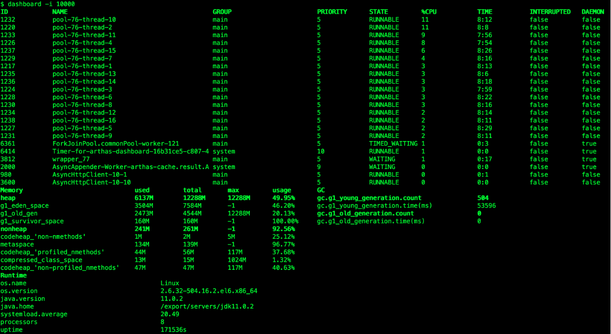

# Linux 专题

## Linux TOP 命令

https://zhuanlan.zhihu.com/p/458010111

>### 线程运行情况
>
>top 命令默认显示的进程的运行情况，在 top 命令执行后，按大写的H，**可进入线程执行情况页面，再按一次H则会到进程展示。或者在启动时对top加参数`top -H`**
>
>### 二、arthas 命令及示例 【阿尔萨斯】
>
>这里只介绍比较常用的几种命令，其他请参考教程。java -jar arthas-boot.jar启动arthas，并选择相关进程attach。
>
>1. dashboard
>
>当前系统的实时数据面板，默认每五秒刷新一次。-i 指定刷新间隔时间。打印了线程ID、占用cpu及耗时
>
>
>
>2. thread
>
>thread -n 3 打印占用cpu最多的3个线程。thread 1217 可查看线程1217的具体信息
>
>
>
>3. trace
>
>trace方法内部调用路径，并输出方法路径上的每个节点上耗时。可以不断trace调用链，追踪耗时症结。
>
>异步调用并将结果保存 trace com.jd.broadway.processors.rulers.NewHpMultiMaterialDiversityRuler rule >> /export/Logs/arthas/test.out &
>
>
>
>

## known_hsots

​       由于采用公私钥形式访问，客户端每次请求会在客户端本地~/.ssh/know_hosts做记录。SFTP 切换后，VIP后端real server地址如果变化过，跟据knows_hosts特性，系统使用同一ip，登录过一次后就会把ssh信息记录在本地的~/.ssh/known_hsots文件中，切换该系统后再用ssh访问这台主机就会出现冲突警告，需要手动删除修改known_hsots里面的内容。

Know_hosts 作用：纪录连到对方时，对方给的 host key。每次连线时都会检查目前对方给的 host key 与纪录的 host key 是否相同，可以简单验证连结是否又被诈骗等相关事宜。

### h3 linux shell命令行选项与参数用法详解

https://www.jb51.net/article/48691.htm

问题描述：在linux shell中如何处理tail -n 10 access.log这样的命令行选项？
在bash中，可以用以下三种方式来处理命令行参数，每种方式都有自己的应用场景。
**1，直接处理，依次对$1,$2,...,$n进行解析，分别手工处理；**
**2，getopts来处理，单个字符选项的情况（如：-n 10 -f file.txt等选项）；**
**3，getopt，可以处理单个字符选项，也可以处理长选项long-option（如：--prefix=/home等）。**
总结：小脚本手工处理即可，getopts能处理绝大多数的情况，getopt较复杂、功能也更强大。

**1，直接手工处理位置参数**
必须要要知道几个变量，

​     $0 ：即命令本身，相当于c/c++中的argv[0]
  \*  $1 ：第一个参数.
  \*  $2, $3, $4 ... ：第2、3、4个参数，依次类推。
  \*  $# 参数的个数，不包括命令本身
  \*  $@ ：参数本身的列表，也不包括命令本身
  \*  $* ：和$@相同，但"$*" 和 "$@"(加引号)并不同，"$*"将所有的参数解释成一个字符串，而"$@"是一个参数数组。

**2，getopts （shell内置命令）**
处理命令行参数是一个相似而又复杂的事情，为此，c提供了getopt/getopt_long等函数，c++的boost 提供了options库，在shell中，处理此事的是**getopts和getopt**。
getopts/getopt 的区别，**getopt是个外部binary文件，而getopts是shell builtin**。

**3，getopt（一个外部工具）**
具体用用法可以 man getopt
\#-o表示短选项，两个冒号表示该选项有一个可选参数，可选参数必须紧贴选项，如-carg 而不能是-c arg
\#--long表示长选项
例子，(getopt.sh)：


### iTerm2使用小技巧-密码管理器(profile+password manager)

https://cloud.tencent.com/developer/article/1593867


### h3 [**Linux**中的**Page cache**和**Buffer cache**详解](https://blog.csdn.net/yangyangye/article/details/89399399)

>**3.1 Page cache**和**Buffer cache**的区别
>
>磁盘的操作有逻辑级（文件系统）和物理级（磁盘块），这两种Cache就是分别缓存逻辑和物理级数据的。
>
>假设我们通过文件系统操作文件，那么文件将被缓存到Page Cache，如果需要刷新文件的时候，Page Cache将交给Buffer Cache去完成，因为Buffer Cache就是缓存磁盘块的。
>
>**Page cache**实际上是针对文件系统的，是文件的缓存，在文件层面上的数据会缓存到page cache。
>
>**Buffer cache**是针对磁盘块的缓存，也就是在没有文件系统的情况下，直接对磁盘进行操作的数据会缓存到buffer cache中，例如，文件系统的元数据都会缓存到buffer cache中。
>
>简单说来，**page cache**用来缓存文件数据，**buffer cache**用来缓存磁盘数据。在有文件系统的情况下，对文件操作，那么数据会缓存到**page cache**，如果直接采用**dd**等工具对磁盘进行读写，那么数据会缓存到**buffer cache**。
>
>Cache(Page Cache)以页面形式缓存了文件系统的文件，给需要使用的程序读取，它是为了给读操作提供缓冲，避免频繁读硬盘，提高读取效率。  
>
>Buffer(Buffer Cache)以块形式缓冲了块设备的操作，定时或手动的同步到硬盘，它是为了缓冲写操作然后一次性将很多改动写入硬盘，避免频繁写硬盘，提高写入效率。  

### [cat <<EOF与cat <<-EOF的区别](https://blog.csdn.net/apache0554/article/details/45508631)

>两个都是获取stdin,并在EOF处结束stdin，输出stdout。
>
>但是<<-是什么意思呢？
>
>先来看man中的说明：
>
>***\*If the redirection operator is\** \**<<-\**\**, then all leading tab characters are\** \**stripped from input lines and the line containing\** \**delimiter\**\**.\****  
>
>翻译过来的意思就是：如果重定向的操作符是<<-，那么分界符（EOF）所在行的开头部分的制表符（Tab）都将被去除。
>
>这可以解决由于脚本中的自然缩进产生的制表符。
>
>通俗一点的解释：
>
>在我们使用cat <<EOF时，我们输入完成后，需要在一个新的一行输入EOF结束stdin的输入。EOF必须顶行写，前面不能用制表符或者空格。
>
>比如,下面的语句就不会出错：
>
>```ruby
>cat <<EOF
>Hello,world!
>EOF
>```
>
>如果结束分解符EOF前有制表符或者空格，则EOF不会被当做结束分界符，只会继续被当做stdin来输入。
>
>而<<-就是为了解决这一问题：
>
>```ruby
>cat <<-EOF
>Hello,world!
> EOF
>```
>
>上面的写法，虽然最后的EOF前面有多个制表符和空格，但仍然会被当做结束分界符，表示stdin的结束。
>
>这就是<<和<<-的区别。

[Ubuntu--apt-get update和apt-get upgrade的作用](https://zhuanlan.zhihu.com/p/35581641)

>apt-get update的作用是更新 /etc/apt/sources.list 和 /etc/apt/sources.list.d 中列出的源的地址，而是相当于windows下面的检查更新，获取的是软件的状态。
>
>而upgrade则是更据update命令同步好了的包的索引文件，去真正地更新软件。
>
>而dist-upgrade则是更聪明的upgrade，man文档中说它以更聪明的方式来解决更新过程中出现的软件依赖问题，它也是从/etc/apt/source.list文件中获得地址，然后从这些地址中检索需要更新的包。
>
>需要注意的是，每回更新之前，我们需要先运行update，然后才能运行upgrade和dist-upgrade，因为相当于update命令获取了包的一些信息，比如大小和版本号，然后再来运行upgrade去下载包，如果没有获取包的信息，那么upgrade就是无效的啦！

* [同步系统时间——ntpd](https://my.oschina.net/adailinux/blog/1633264)

### **零拷贝**

* [**Linux 中的零拷贝技术，第 1 部分**](https://www.ibm.com/developerworks/cn/linux/l-cn-zerocopy1/index.html)

>传统的 Linux 操作系统的标准 **I/O 接口是基于数据拷贝操作的，即 I/O 操作会导致数据在操作系统内核地址空间的缓冲区和应用程序地址空间定义的缓冲区之间进行传输。这样做最大的好处是可以减少磁盘 I/O 的操作，因为如果所请求的数据已经存放在操作系统的高速缓冲存储器中，那么就不需要再进行实际的物理磁盘 I/O 操作。但是数据传输过程中的数据拷贝操作却导致了极大的 CPU 开销，限制了操作系统有效进行数据传输操作的能力。**
>
>零拷贝（ zero-copy ）这种技术可以有效地改善数据传输的性能，在内核驱动程序（比如网络堆栈或者磁盘存储驱动程序）处理 I/O 数据的时候，**零拷贝技术可以在某种程度上减少甚至完全避免不必要 CPU 数据拷贝操作。**
>
>对于 Linux 操作系统来说，基于数据排序或者校验等各方面因素的考虑，操作系统内核会在处理数据传输的过程中进行多次拷贝操作。在某些情况下，这些数据拷贝操作会极大地降低数据传输的性能。
>
>当应用程序需要访问某块数据的时候，操作系统内核会先检查这块数据是不是因为前一次对相同文件的访问而已经被存放在操作系统内核地址空间的缓冲区内，如果在内核缓冲区中找不到这块数据，Linux 操作系统内核会先将这块数据从磁盘读出来放到操作系统内核的缓冲区里去。
>
>在 read() 读数据的过程中，数据并不是直接来自于硬盘，而是必须先经过操作系统的文件系统层。在 write() 写数据的过程中，为了和要传输的数据包的大小相吻合，数据必须要先被分割成块，而且还要预先考虑包头，并且要进行数据校验和操作。
>
>图 1. 传统使用 read 和 write 系统调用的数据传输
>
>
>
>### 什么是零拷贝？
>
>简单一点来说，零拷贝就是一种避免 CPU 将数据从一块存储拷贝到另外一块存储的技术。针对操作系统中的设备驱动程序、文件系统以及网络协议堆栈而出现的各种零拷贝技术极大地提升了特定应用程序的性能，并且使得这些应用程序可以更加有效地利用系统资源。
>
>零拷贝技术可以减少数据拷贝和共享总线操作的次数，消除传输数据在存储器之间不必要的中间拷贝次数，从而有效地提高数据传输效率。而且，零拷贝技术减少了用户应用程序地址空间和操作系统内核地址空间之间因为上下文切换而带来的开销。进行大量的数据拷贝操作其实是一件简单的任务，从操作系统的角度来说，如果 CPU 一直被占用着去执行这项简单的任务，那么这将会是很浪费资源的；如果有其他比较简单的系统部件可以代劳这件事情，从而使得 CPU 解脱出来可以做别的事情，那么系统资源的利用则会更加有效。综上所述，零拷贝技术的目标可以概括如下：
>
>**避免数据拷贝**
>
>- 避免操作系统内核缓冲区之间进行数据拷贝操作。
>- 避免操作系统内核和用户应用程序地址空间这两者之间进行数据拷贝操作。
>- 用户应用程序可以避开操作系统直接访问硬件存储。
>- 数据传输尽量让 DMA 来做。
>
>**将多种操作结合在一起**
>
>- 避免不必要的系统调用和上下文切换。
>- 需要拷贝的数据可以先被缓存起来。
>- 对数据进行处理尽量让硬件来做。
>
>概括起来，Linux 中的零拷贝技术主要有下面这几种：
>
>- 直接 I/O：对于这种数据传输方式来说，应用程序可以直接访问硬件存储，操作系统内核只是辅助数据传输：这类零拷贝技术针对的是操作系统内核并不需要对数据进行直接处理的情况，数据可以在应用程序地址空间的缓冲区和磁盘之间直接进行传输，完全不需要 Linux 操作系统内核提供的页缓存的支持。
>- 在数据传输的过程中，避免数据在操作系统内核地址空间的缓冲区和用户应用程序地址空间的缓冲区之间进行拷贝。有的时候，应用程序在数据进行传输的过程中不需要对数据进行访问，那么，将数据从 Linux 的页缓存拷贝到用户进程的缓冲区中就可以完全避免，传输的数据在页缓存中就可以得到处理。在某些特殊的情况下，这种零拷贝技术可以获得较好的性能。Linux 中提供类似的系统调用主要有 mmap()，sendfile() 以及 splice()。
>- 对数据在 Linux 的页缓存和用户进程的缓冲区之间的传输过程进行优化。该零拷贝技术侧重于灵活地处理数据在用户进程的缓冲区和操作系统的页缓存之间的拷贝操作。这种方法延续了传统的通信方式，但是更加灵活。在　 Linux 　中，该方法主要利用了写时复制技术。

### mac 文件验证

[Mac 下验证下载文件的 MD5/SHA1/SHA256](https://blog.csdn.net/vencent7/article/details/76998332)

>#### 验证SHA-256
>
>```shell
>openssl dgst -sha256 /path/to/file1
>```
>
>#### 验证SHA-1
>
>```shell
>openssl sha1 /path/to/file1
>```
>
>#### 验证 MD5
>
>```shell
>openssl md5 /path/to/file1
>```
>
>#### 备注
>
>1. MD5已经不再安全，推荐使用 SHA-256
>2. 最新的 macOS好像可以通过`md5 /path/to/file`的命令来验证MD5了，而sha256和sha1则没有这么直观的方式。不妨在 .bashrc / .zshrc 里加入一行`alias sha256="openssl dgst -sha256"`来实现通过`sha256 /path/to/file`校验 SHA256
>3. 文件路径不一定要手动打，可以拖拽文件到 terminal

###  [Linux awk 命令](https://www.runoob.com/linux/linux-comm-awk.html)

用法一：

```shell
awk '{[pattern] action}' {filenames}   # 行匹配语句 awk '' 只能用单引号
```

```shell
# 每行按空格或TAB分割，输出文本中的1、4项
 $ awk '{print $1,$4}' log.txt
 ---------------------------------------------
 2 a
 3 like
 This's
 10 orange,apple,mongo
 # 格式化输出
 $ awk '{printf "%-8s %-10s\n",$1,$4}' log.txt
 ---------------------------------------------
 2        a
 3        like
 This's
 10       orange,apple,mongo
```

用法二：

```shell
awk -F  #-F相当于内置变量FS, 指定分割字符
```

实例：

```shell
# 使用","分割
 $  awk -F, '{print $1,$2}'   log.txt
 ---------------------------------------------
 2 this is a test
 3 Are you like awk
 This's a test
 10 There are orange apple
 # 或者使用内建变量
 $ awk 'BEGIN{FS=","} {print $1,$2}'     log.txt
 ---------------------------------------------
 2 this is a test
 3 Are you like awk
 This's a test
 10 There are orange apple
 # 使用多个分隔符.先使用空格分割，然后对分割结果再使用","分割
 $ awk -F '[ ,]'  '{print $1,$2,$5}'   log.txt
 ---------------------------------------------
 2 this test
 3 Are awk
 This's a
 10 There apple
```

用法三：

```shell
awk -v  # 设置变量
```

实例：

```shell
 $ awk -va=1 '{print $1,$1+a}' log.txt
 ---------------------------------------------
 2 3
 3 4
 This's 1
 10 11
 $ awk -va=1 -vb=s '{print $1,$1+a,$1b}' log.txt
 ---------------------------------------------
 2 3 2s
 3 4 3s
 This's 1 This'ss
 10 11 10s
```

用法四：

```shell
awk -f {awk脚本} {文件名}
```

实例：

```shell
 $ awk -f cal.awk log.txt
```


awk、sed、grep更适合的方向：**

-  grep 更适合单纯的查找或匹配文本
-  sed 更适合编辑匹配到的文本
-  awk 更适合格式化文本，对文本进行较复杂格式处理

### [sed详解](http://allenn.cn/articles/2016-09/sed-usage/)

>sed是stream editor的简称，也就是流编辑器。它一次处理一行内容，处理时，把当前处理的行存储在临时缓冲区中，称为“模式空间”（pattern space），接着用sed命令处理缓冲区中的内容，处理完成后，把缓冲区的内容送往屏幕。接着处理下一行，这样不断重复，直到文件末尾。文件内容并没有改变，除非你使用重定向存储输出。

### [Linux文件目录大小详解](https://blog.csdn.net/zzhongcy/article/details/103262245?utm_medium=distribute.pc_relevant.none-task-blog-BlogCommendFromMachineLearnPai2-2.channel_param&depth_1-utm_source=distribute.pc_relevant.none-task-blog-BlogCommendFromMachineLearnPai2-2.channel_param)

>在Ubuntu上，发现大部分目录大小都是4096，不论目录包含内容多少，即使空的
>
>```shell
>root@s:~# mkdir a
>root@s:~# ll
>total 124
>drwx------ 10 root root  4096 Jan 30 11:25 ./
>drwxr-xr-x 23 root root  4096 Jan 18 17:57 ../
>drwxr-xr-x  2 root root  4096 Jan 30 11:25 a/
>```
>
>这里有[解释](https://link.jianshu.com/?t=https%3A%2F%2Fsuperuser.com%2Fquestions%2F142893%2Fwhy-is-the-size-of-a-directory-always-4096-bytes-in-unix)，这里记录一下实验。
>**一般情况下，HDD磁盘最小的管理单位是扇区（Sector，也叫Unit或者Block），扇区的大小是512Bytes，但Linux一次I/O是8个扇区即4096Bytes**，因此Linux（准确的说是ext2/ext3等文件系统）存取文件的**最小单位即使4096Bytes（=8个Blocks)（Windows的NTFS好像是1K即2个Blocks）**。
>
>* 一般目录大小
>
>**而[目录是特殊文件](https://link.jianshu.com/?t=http%3A%2F%2Fwww.ruanyifeng.com%2Fblog%2F2011%2F12%2Finode.html),OS初始分配8个Blocks，且size也即是4096Bytes**，这与普通文件（Regular file）不同，**普通文件的size是给予文件内容计算的实际值**，但是**目录实际占用的磁盘空间总是4096的倍数**。

### [使用 Shell 脚本来处理 JSON](https://www.tomczhen.com/2017/10/15/parsing-json-with-shell-script/)

### 惊群效应

>惊群效应就是当一个fd的事件被触发时，所有等待这个fd的线程或进程都被唤醒。
>一般都是socket的accept()会导致惊群（当然也可以弄成一堆线程/进程阻塞read一个fd，但这样写应该没什么意义吧），很多个进程都block在server socket的accept()，一但有客户端进来，所有进程的accept()都会返回，但是只有一个进程会读到数据，就是惊群。实际上现在的Linux内核实现中不会出现惊群了，只会有一个进程被唤醒（Linux2.6内核）。
>
>使用mutex锁住多个线程是不会惊群的，在某个线程解锁后，只会有一个线程会获得锁，其它的继续等待。
>
>作者：钟宇腾
>链接：https://www.zhihu.com/question/22756773/answer/22516222
>来源：知乎
>著作权归作者所有。商业转载请联系作者获得授权，非商业转载请注明出处。

### shell脚本中 “set -e” 的作用

>\-----------------------------------------------------------
>\#!/bin/bash
>
>set -e
>
>command 1
>command 2
>...
>
>exit 0
>\----------------------------------------------------------
>你写的每个脚本都应该在文件开头加上set -e,这句语句告诉bash如果任何语句的执行结果不是true则应该退出。
>这样的好处是防止错误像滚雪球般变大导致一个致命的错误，而这些错误本应该在之前就被处理掉。如果要增加可读性，可以使用set -o errexit，它的作用与set -e相同。

### [iTerm2 + Oh My Zsh 打造舒适终端体验](https://segmentfault.com/a/1190000014992947)

### [linux系统--spawn 用法](https://www.cnblogs.com/joangaga/p/5886444.html)

spawn与except组合可达到远程登录设备执行命令的作用
下面是登录设备的一段代码

>```shell
>#!/usr/bin/expect -f
>user=root
>host=1.1.1.1
>password=root
>spawn $user@$host
>set timeout 60
>except {
>　　"(yes/no)?" {
>　　　　send "yes\n"
>　　　　expect "*assword:*"
>　　　　send "$password\n"
>　　　}
>　　"assword:" {
>　　　　send "$password\n"
>
>　　} timeout {
>　　　　exit
>　　} eof{
>　　　　exit
>　　}}
>```

### [Linux expect spawn用法](https://blog.csdn.net/liuwei0376/article/details/97142348)

># 背景
>
>开发中，经常会有一些任务需要人机交互，比如登录到某台server上，远程拷贝其上的软件，并分发到其他sever上。
>传统的操作方式，会产生开发人员与计算机的交互，如等待用户输入密码之类的操作会打断自动化流程的实现。

### [Linux expect 介绍和用法](https://www.cnblogs.com/saneri/p/10819348.html)

>spawn               交互程序开始后面跟命令或者指定程序
>expect              获取匹配信息匹配成功则执行expect后面的程序动作
>send exp_send       用于发送指定的字符串信息
>exp_continue        在expect中多次匹配就需要用到
>send_user           用来打印输出 相当于shell中的echo
>exit                退出expect脚本
>eof                 expect执行结束 退出
>set                 定义变量
>puts                输出变量
>set timeout         设置超时时间

### [shell中的EOF用法](https://blog.csdn.net/sprita1/article/details/42676307)

>1、EOF 
>
>Shell中通常将EOF与 << 结合使用，表示后续的输入作为子命令或子Shell的输入，直到遇到EOF为止，再返回到主调Shell。
>可以把EOF替换成其他东西，意思是把内容当作标准输入传给程序。
>
>回顾一下< <的用法。当shell看到< <的时候，它就会知道下一个词是一个分界符。在该分界符以后的内容都被当作输入，直到shell又看到该分界符(位于单独的一行)。这个分界符可以是你所定义的任何[字符串](http://www.jbxue.com/zt/zifuchuan/)。
>
>例子：自动登录[mysql](http://www.jbxue.com/db/mysql/)（root:root,passwd:123456),查询test库，test1表里的user=aa的记录。
>
>复制代码代码如下:
>
>```shell
>#!/bin/sh
>mysql -uroot -p123456 <<EOF
>use test;
>select * from testaa while a=10000; ###1000 not usr single quote mark,because a is int
>\# type,only char type need single quote mark.
>exit
>EOF
>```
>
>

# Docker

## Dockerfile（11） - COPY 指令详解

https://cloud.tencent.com/developer/article/1896354


