# RPC 专题

## GRPC客户端创建和调用原理解析

https://www.freesion.com/article/2904303363/

写得很详细。

>## 1. GRPC客户端创建流程
>
>### 1.1. 背景
>
>**gRPC是在HTTP/2之上实现的RPC框架**，HTTP/2是第7层（应用层）协议，它运行在TCP（第4层 - 传输层）协议之上，相比于传统的REST/JSON机制有诸多的优点：
>
>- 基于HTTP/2之上的二进制协议（Protobuf序列化机制）
>- 一个连接上可以多路复用，并发处理多个请求和响应
>- 多种语言的类库实现
>- 服务定义文件和自动代码生成（.proto文件和Protobuf编译工具）
>
>### 1.3. RPC调用流程
>
>**gRPC的客户端调用主要包括基于Netty的HTTP/2客户端创建、客户端负载均衡、请求消息的发送和响应接收处理四个流程。**
>
>gRPC的客户端调用总体流程如下图所示：
>
>[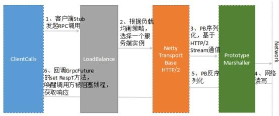](https://link.juejin.im/?target=http%3A%2F%2Fcdn3.infoqstatic.com%2Fstatics_s2_20170913-0458%2Fresource%2Farticles%2Fgrpc-client-creation-and-invocation-principle-analysis%2Fzh%2Fresources%2F02.jpg)
>
>gRPC 的客户端调用流程如下：
>
>1) 客户端Stub(GreeterBlockingStub)调用sayHello(request)，发起RPC调用
>
>2) 通过DnsNameResolver进行域名解析，获取服务端的地址信息（列表），随后使用默认的LoadBalancer策略，选择一个具体的gRPC服务端实例
>
>3) 如果与路由选中的服务端之间没有可用的连接，则创建NettyClientTransport和NettyClientHandler，发起HTTP/2连接
>
>4) 对请求消息使用PB（Protobuf）做序列化，通过HTTP/2 Stream发送给gRPC服务端
>
>5) 接收到服务端响应之后，使用PB（Protobuf）做反序列化
>
>6) 回调GrpcFuture的set(Response)方法，唤醒阻塞的客户端调用线程，获取RPC响应
>
>需要指出的是，**客户端同步阻塞RPC调用阻塞的是调用方线程（通常是业务线程），底层Transport的I/O线程（Netty的NioEventLoop）仍然是非阻塞的。**
>
>**ManagedChannel是对Transport层SocketChannel的抽象，Transport层负责协议消息的序列化和反序列化，以及协议消息的发送和读取。ManagedChannel将处理后的请求和响应传递给与之相关联的ClientCall进行上层处理，同时，ManagedChannel提供了对Channel的生命周期管理（链路创建、空闲、关闭等）。**
>
>**ManagedChannel提供了接口式的切面ClientInterceptor，它可以拦截RPC客户端调用，注入扩展点，以及功能定制，方便框架的使用者对gRPC进行功能扩展。**
>
>**ManagedChannel的主要实现类ManagedChannelImpl创建流程如下：**
>
>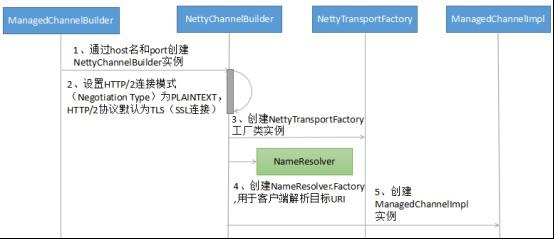
>
>图1-3 ManagedChannelImpl创建流程
>
>流程关键技术点解读：
>
>1. 使用builder模式创建ManagedChannelBuilder实现类NettyChannelBuilder，NettyChannelBuilder提供了buildTransportFactory工厂方法创建NettyTransportFactory，最终用于创建NettyClientTransport。
>2. 初始化HTTP/2连接方式：采用plaintext协商模式还是默认的TLS模式，HTTP/2的连接有两种模式：h2（基于TLS之上构建的HTTP/2）和h2c（直接在TCP之上构建的HTTP/2）。
>3. 创建NameResolver.Factory工厂类，用于服务端URI的解析，gRPC默认采用DNS域名解析方式。
>
>**ManagedChannel实例构造完成之后，即可创建ClientCall，发起RPC调用。**
>
>完成ManagedChannelImpl创建之后，由ManagedChannelImpl发起创建一个新的ClientCall实例。ClientCall的用途是业务应用层的消息调度和处理，它的典型用法如下：
>
>```python
>__Fri Sep 15 2017 09:46:36 GMT+0800 (CST)____Fri Sep 15 2017 09:46:36 GMT+0800 (CST)__ call = channel.newCall(unaryMethod, callOptions);
> call.start(listener, headers);
> call.sendMessage(message);
> call.halfClose();
> call.request(1);
> // wait for listener.onMessage()__Fri Sep 15 2017 09:46:36 GMT+0800 (CST)____Fri Sep 15 2017 09:46:36 GMT+0800 (CST)__
>```
>
>ClientCall 实例的创建流程如下所示：
>
>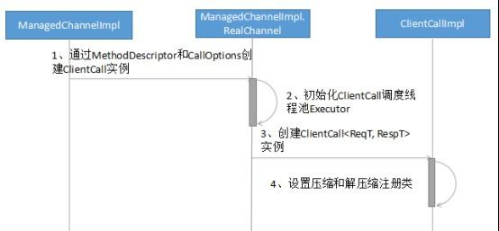
>
>流程关键技术点解读：
>
>1. **ClientCallImpl的主要构造参数是MethodDescriptor和CallOptions，其中MethodDescriptor存放了需要调用RPC服务的接口名、方法名、服务调用的方式（例如UNARY类型）以及请求和响应的序列化和反序列化实现类。CallOptions则存放了RPC调用的其它附加信息，例如超时时间、鉴权信息、消息长度限制和执行客户端调用的线程池等。**
>2. **设置压缩和解压缩的注册类（CompressorRegistry和DecompressorRegistry），以便可以按照指定的压缩算法对HTTP/2消息做压缩和解压缩。**
>
>ClientCallImpl 实例创建完成之后，就可以调用 ClientTransport，创建HTTP/2 Client，向gRPC服务端发起远程服务调用。
>
>**gRPC 客户端底层基于Netty4.1的HTTP/2协议栈框架构建，以便可以使用HTTP/2协议来承载RPC消息，在满足标准化规范的前提下，提升通信性能。**
>
>gRPC HTTP/2协议栈（客户端）的关键实现是NettyClientTransport和NettyClientHandler，客户端初始化流程如下所示：
>
>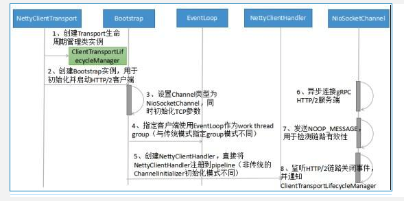
>
>图1-5 HTTP/2 Client创建流程
>
>流程关键技术点解读：
>
>1.NettyClientHandler的创建：级联创建Netty的Http2FrameReader、Http2FrameWriter和Http2Connection，用于构建基于Netty的gRPC HTTP/2客户端协议栈。
>
>2.HTTP/2 Client启动：仍然基于Netty的Bootstrap来初始化并启动客户端，但是有两个细节需要注意：
>
>- NettyClientHandler（实际被包装成ProtocolNegotiator.Handler，用于HTTP/2的握手协商）创建之后，不是由传统的ChannelInitializer在初始化Channel时将NettyClientHandler加入到pipeline中，而是直接通过Bootstrap的handler方法直接加入到pipeline中，以便可以立即接收发送任务。
>- 客户端使用的work线程组并非通常意义的EventLoopGroup，而是一个EventLoop：即HTTP/2客户端使用的work线程并非一组线程（默认线程数为CPU内核 * 2），而是一个EventLoop线程。这个其实也很容易理解，一个NioEventLoop线程可以同时处理多个HTTP/2客户端连接，它是多路复用的，对于单个HTTP/2客户端，如果默认独占一个work线程组，将造成极大的资源浪费，同时也可能会导致句柄溢出（并发启动大量HTTP/2客户端）。
>
>3. WriteQueue创建：Netty的NioSocketChannel初始化并向Selector注册之后（发起HTTP连接之前），立即由NettyClientHandler创建WriteQueue，用于接收并处理gRPC内部的各种Command，例如链路关闭指令、发送Frame指令、发送Ping指令等。
>
>HTTP/2 Client创建完成之后，即可由客户端根据协商策略发起HTTP/2连接。如果连接创建成功，后续即可复用该HTTP/2连接，进行RPC调用。
>
>HTTP/2在TCP连接之初通过协商的方式进行通信，只有协商成功，才能进行后续的业务层数据发送和接收。
>
>HTTP/2的版本标识分为两类：
>
>- 基于TLS之上构架的HTTP/2, 即HTTPS，使用h2表示（ALPN）：0x68与0x32
>- 直接在TCP之上构建的HTTP/2,即HTTP，使用h2c表示
>
>HTTP/2连接创建，分为两种：通过协商升级协议方式和直接连接方式。
>
>假如不知道服务端是否支持HTTP/2，可以先使用HTTP/1.1进行协商，客户端发送协商请求消息（只含消息头），报文示例如下：
>
>```
>__Fri Sep 15 2017 09:46:36 GMT+0800 (CST)____Fri Sep 15 2017 09:46:36 GMT+0800 (CST)__GET / HTTP/1.1
>Host: 127.0.0.1
>Connection: Upgrade, HTTP2-Settings
>Upgrade: h2c
>HTTP2-Settings: <base64url encoding of HTTP/2 SETTINGS payload>__Fri Sep 15 2017 09:46:36 GMT+0800 (CST)____Fri Sep 15 2017 09:46:36 GMT+0800 (CST)__
>```
>
>服务端接收到协商请求之后，如果不支持HTTP/2，则直接按照HTTP/1.1响应返回，双方通过HTTP/1.1进行通信，报文示例如下：
>
>```
>__Fri Sep 15 2017 09:46:36 GMT+0800 (CST)____Fri Sep 15 2017 09:46:36 GMT+0800 (CST)__HTTP/1.1 200 OK
>Content-Length: 28
>Content-Type: text/css
> 
>body...__Fri Sep 15 2017 09:46:36 GMT+0800 (CST)____Fri Sep 15 2017 09:46:36 GMT+0800 (CST)__
>```
>
>如果服务端支持HTTP/2,则协商成功，返回101结果码，通知客户端一起升级到HTTP/2进行通信，示例报文如下：
>
>```
>__Fri Sep 15 2017 09:46:36 GMT+0800 (CST)____Fri Sep 15 2017 09:46:36 GMT+0800 (CST)__HTTP/1.1 101 Switching Protocols
>Connection: Upgrade
>Upgrade: h2c
> 
>[ HTTP/2 connection...__Fri Sep 15 2017 09:46:36 GMT+0800 (CST)____Fri Sep 15 2017 09:46:36 GMT+0800 (CST)__
>```
>
>101响应之后，服务需要发送SETTINGS帧作为连接序言，客户端接收到101响应之后，也必须发送一个序言作为回应，示例如下：
>
>```
>__Fri Sep 15 2017 09:46:36 GMT+0800 (CST)____Fri Sep 15 2017 09:46:36 GMT+0800 (CST)__PRI * HTTP/2.0\r\n\r\nSM\r\n\r\n
>SETTINGS帧__Fri Sep 15 2017 09:46:36 GMT+0800 (CST)____Fri Sep 15 2017 09:46:36 GMT+0800 (CST)__
>```
>
>客户端序言发送完成之后，可以不需要等待服务端的SETTINGS帧，而直接发送业务请求Frame。
>
>假如客户端和服务端已经约定使用HTTP/2,则可以免去101协商和切换流程，直接发起HTTP/2连接，具体流程如下所示：
>
>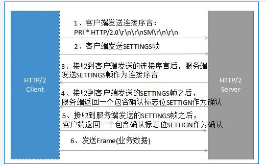
>
>图1-6 HTTP/2 直接连接过程
>
>几个关键点：
>
>- 如果已经明确知道服务端支持HTTP/2，则可免去通过HTTP/1.1 101协议切换方式进行升级。TCP连接建立之后即可发送序言，否则只能在接收到服务端101响应之后发送序言
>- 针对一个连接，服务端第一个要发送的帧必须是SETTINGS帧，连接序言所包含的SETTINGS帧可以为空
>- 客户端可以在发送完序言之后发送应用帧数据，不用等待来自服务器端的序言SETTINGS帧
>
>**负载均衡**
>
>总体上看，RPC的负载均衡策略有两大类：
>
>- **服务端负载均衡（例如代理模式、外部负载均衡服务）**
>- 客户端负载均衡（内置负载均衡策略和算法，客户端实现）
>
>外部负载均衡模式如下所示：
>
>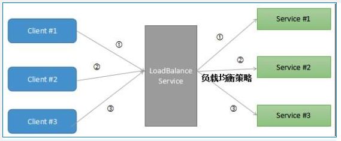
>
>图1-8 代理负载均衡模式示意图
>
>以代理LB模式为例：RPC客户端向负载均衡代理发送请求，负载均衡代理按照指定的路由策略，将请求消息转发到后端可用的服务实例上。负载均衡代理负责维护后端可用的服务列表，如果发现某个服务不可用，则将其剔除出路由表。
>
>代理LB模式的优点是客户端不需要实现负载均衡策略算法，也不需要维护后端的服务列表信息，不直接跟后端的服务进行通信，在做网络安全边界隔离时，非常实用。例如通过Ngix做L7层负载均衡，将互联网前端的流量安全的接入到后端服务中。
>
>代理LB模式通常支持L4（Transport）和L7（Application)层负载均衡，两者各有优缺点，可以根据RPC的协议特点灵活选择。L4/L7层负载均衡对应场景如下：
>
>1. L4层：对时延要求苛刻、资源损耗少、RPC本身采用私有TCP协议
>2. L7层：有会话状态的连接、HTTP协议簇（例如Restful）
>
>**客户端负载均衡**
>
>客户端负载均衡策略由客户端内置负载均衡能力，通过**静态配置、域名解析服务（例如DNS服务）、订阅发布（例如Zookeeper服务注册中心）等方式获取RPC服务端地址列表，并将地址列表缓存到客户端内存中。每次RPC调用时，根据客户端配置的负载均衡策略由负载均衡算法从缓存的服务地址列表中选择一个服务实例，发起RPC调用。**
>
>客户端负载均衡策略工作原理示例如下：
>
>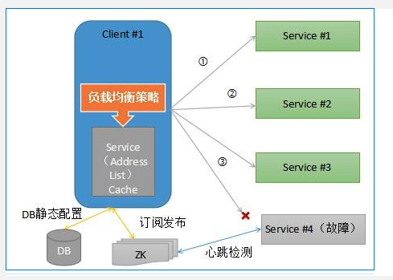
>
>图1-9 客户端负载均衡策略示意图
>
>**gRPC 默认采用客户端负载均衡策略，同时提供了扩展机制，使用者通过自定义实现NameResolver和LoadBalancer，即可覆盖gRPC默认的负载均衡策略，实现自定义路由策略的扩展。**
>
>gRPC 提供的负载均衡策略实现类如下所示：
>
>- PickFirstBalancer：无负载均衡能力，即使有多个服务端地址可用，也只选择第一个地址。
>- RoundRobinLoadBalancer：“RoundRobin”负载均衡策略。
>
>gRPC负载均衡流程如下所示：
>
>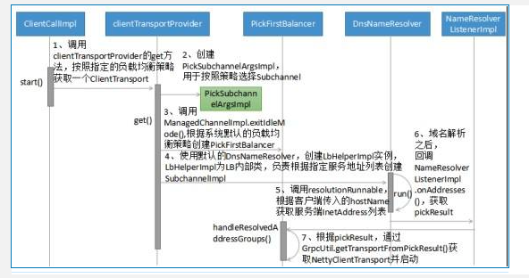
>
>图1-10 gRPC客户端负载均衡流程图
>
>**流程关键技术点解读： （重要）**
>
>**1.负载均衡功能模块的输入是客户端指定的hostName、需要调用的接口名和方法名等参数，输出是执行负载均衡算法后获得的NettyClientTransport。通过NettyClientTransport可以创建基于Netty HTTP/2的gRPC客户端，发起RPC调用。**
>
>**2.gRPC系统默认提供的是DnsNameResolver，它通过InetAddress.getAllByName(host)获取指定host的IP地址列表（本地DNS服务）。**
>
>对于扩展者而言，可以继承 NameResolver 实现自定义的地址解析服务，例如使用Zookeeper替换DnsNameResolver，把Zookeeper作为动态的服务地址配置中心，它的伪代码示例如下：
>
>**第一步：继承 NameResolver，实现start(Listener listener)方法：**
>
>```python
>__Fri Sep 15 2017 09:46:36 GMT+0800 (CST)____Fri Sep 15 2017 09:46:36 GMT+0800 (CST)__void start(Listener listener)
>{
>     //获取ZooKeeper地址，并连接
>     //创建Watcher，并实现process(WatchedEvent event)，监听地址变更
> //根据接口名和方法名，调用getChildren方法，获取发布该服务的地址列表
>//将地址列表加到List中
>// 调用NameResolver.Listener.onAddresses(),通知地址解析完成__Fri Sep 15 2017 09:46:36 GMT+0800 (CST)____Fri Sep 15 2017 09:46:36 GMT+0800 (CST)__
>```
>
>**第二步：创建ManagedChannelBuilder时，指定Target的地址为Zookeeper服务端地址，同时设置nameResolver为Zookeeper NameResolver,示例代码如下所示：**
>
>```python
>__Fri Sep 15 2017 09:46:36 GMT+0800 (CST)____Fri Sep 15 2017 09:46:36 GMT+0800 (CST)__ this(ManagedChannelBuilder.forTarget(zookeeperAddr)
>        .loadBalancerFactory(RoundRobinLoadBalancerFactory.getInstance())
>        .nameResolverFactory(new ZookeeperNameResolverProvider())
>        .usePlaintext(false));__Fri Sep 15 2017 09:46:36 GMT+0800 (CST)____Fri Sep 15 2017 09:46:36 GMT+0800 (CST)__
>```
>
>3. **LoadBalancer**负责从**nameResolver**中解析获得的服务端URL中按照指定路由策略，选择一个目标服务端地址，并创建ClientTransport。同样，可以通过覆盖handleResolvedAddressGroups实现自定义负载均衡策略。
>
>**通过 LoadBalancer + NameResolver，可以实现灵活的负载均衡策略扩展。**例如基于Zookeeper、etcd的分布式配置服务中心方案。
>
>gRPC  默认基于 Netty HTTP/2 + PB 进行RPC调用，请求消息发送流程如下所示：
>
>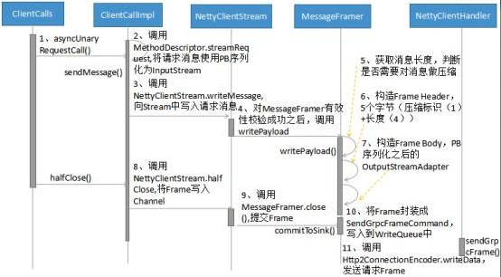
>
>图1-11 gRPC 请求消息发送流程图
>
>流程关键技术点解读：
>
>1. ClientCallImpl的sendMessage调用，主要完成了请求对象的序列化（基于PB）、HTTP/2 Frame的初始化。
>2. ClientCallImpl的halfClose调用将客户端准备就绪的请求Frame封装成自定义的SendGrpcFrameCommand，写入到WriteQueue中。
>3. WriteQueue执行flush()将SendGrpcFrameCommand写入到Netty的Channel中，调用Channel的write方法，被NettyClientHandler拦截到，由NettyClientHandler负责具体的发送操作。
>4. NettyClientHandler调用Http2ConnectionEncoder的writeData方法，将Frame写入到HTTP/2 Stream中，完成请求消息的发送。
>
>**gRPC客户端响应消息的接收入口是NettyClientHandler**，它的处理流程如下所示：
>
>[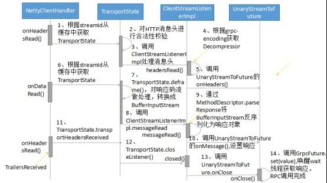](https://link.juejin.im/?target=http%3A%2F%2Fcdn3.infoqstatic.com%2Fstatics_s2_20170913-0458%2Fresource%2Farticles%2Fgrpc-client-creation-and-invocation-principle-analysis%2Fzh%2Fresources%2F12.jpg)
>
>图1-12 gRPC响应消息接收流程图
>
>流程关键技术点解读：
>
>1. NettyClientHandler的onHeadersRead(int streamId, Http2Headers headers, boolean endStream)方法会被调用两次，根据endStream判断是否是Stream结尾。
>2. 请求和响应的关联：**根据streamId可以关联同一个HTTP/2 Stream，将NettyClientStream缓存到Stream中，客户端就可以在接收到响应消息头或消息体时还原出NettyClientStream，进行后续处理**。
>3. **RPC客户端调用线程的阻塞和唤醒使用到了GrpcFuture的wait和notify机制，来实现客户端调用线程的同步阻塞和唤醒。**
>4. 客户端和服务端的HTTP/2 Header和Data Frame解析共用同一个方法，即MessageDeframer的deliver()。
>
>


## gRPC系列(三) 如何借助HTTP2实现传输

https://zhuanlan.zhihu.com/p/161577635

>## HTTP2 当救世主
>
>H1.1 在速度和成本上的权衡让人纠结不已，HTTP2 的出现就是为了优化这些问题，在`更快的传输`和`更低的成本`两个目标上更进了一步。有以下几个基本点：
>
>- HTTP2 未改变HTTP的语义(如GET/POST等)，只是在传输上做了优化
>- 引入帧、流的概念，在TCP连接中，可以区分出多个request/response
>- 一个域名只会有一个TCP连接，借助帧、流可以实现多路复用，降低资源消耗
>- 引入二进制编码，降低header带来的空间占用
>
>核心可分为 **`头部压缩` 和 `多路复用`**。这两个点都服务于**`更快的传输`、`更低的资源消耗`**这两个目标，与上文呼应。
>
>## 头部压缩
>
>现在的web页面，大多比较复杂，新打开一个地址，动辄产生几十个请求，这会发送大量的header，大部分内容都是一样的内容，以baidu为例: 
>
>```text
>request:
>GET  HTTP/1.1
>Host: www.baidu.com
>Cache-Control: no-cache
>Postman-Token: a9702bac-94c4-c7da-2041-7c7ac5f85b6e
>
>response:
>Access-Control-Allow-Credentials: true
>Connection: keep-alive
>Content-Encoding: gzip
>Content-Type: text/html; charset=UTF-8
>Server: Apache
>Transfer-Encoding: chunked
>Vary: Accept-Encoding
>```
>
>这些文本内容一次次重复地发送，占用了大量的带宽，如何将这些成本降下去，而又保留HTTP无状态的优点呢？
>
>基于这个想法，诞生了 HPACK[2]，全称为`HTTP2头部压缩`，它以极富创造力的方式，提供了两种方式极大地降低了header的传输占用。
>
>一、**将高频使用的Header编成一个静态表**，每个header对应一个数组索引，每次只用传这个索引，而不是冗长的文本。表总共有61项，下图是前30项：
>
>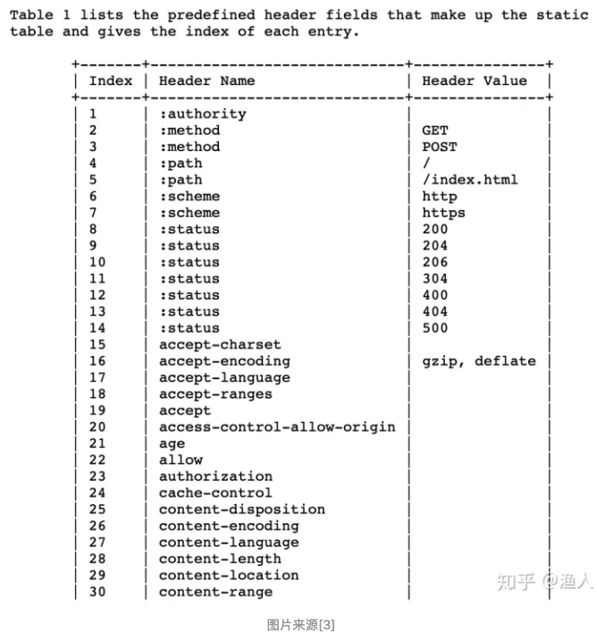
>
>- 传 3 代表 "POST"，这用一个字节表示了原来4个字节
>- 传28代表content-length，这用一个字节表示了原来14个字节（value下文会讨论）
>
>可以预见这种方式，在大量的请求环境下，可以明显降低传输内容。服务端根据内容查表，就可以还原出header。
>
>二、**支持动态地**在表中增加header
>
>```text
>Host: www.baidu.com
>```
>
>在上面的实例中，打开baidu时，对应域名的所有请求都会带上Host，这又是重复冗余的数据。但由于各家网站的host不相同，无法像上面那样做成一个静态的表。HPACK支持动态地在表中增加header，例如：
>
>```text
>62   Host: www.baidu.com
>```
>
>在请求发起前，通过协议将上面Header添加到表中，则后面的请求都只用发送62即可，不用再发送文本，这又节约了大量空间。(请求方/服务方的`表成员`会保持同步一致)
>
>上面两个分别被成为静态表和动态表。静态表是协议级别的约定，是不变的内容。动态表则是基于当前TCP连接进行协商的结果，发送请求时会相互设置好header，让请求方和服务方维护同一份动态表，后续的请求可复用。连接销毁时，动态表也会注销。
>
>## 多路复用
>
>**H1.1 核心的尴尬点在于，在同一个TCP连接中，没办法区分response是属于哪个请求，一旦多个请求返回的文本内容混在一起，就天下大乱，所以请求只能一个个串行排队发送。这直接导致了TCP资源的闲置。**
>
>**HTTP2 为了解决这个问题，提出了`流`的概念，每一次请求对应一个流，有一个唯一ID，用来区分不同的请求。基于流的概念，进一步提出了`帧`，一个请求的数据会被分成多个帧，方便进行数据分割传输，每个帧都唯一属于某一个流ID，将帧按照流ID进行分组，即可分离出不同的请求。这样同一个TCP连接中就可以同时并发多个请求，不同请求的帧数据可穿插在一起，根据流ID分组即可。这样直接解决了H1.1的核心痛点，通过这种复用TCP连接的方式，不用再同时建多个连接，提升了TCP的利用效率**。 这也是`多路复用`思想的一种落地方式，在很多消息队列协议中也广泛存在，如AMQP[4]，其`channel`的概念和`流`如出一辙，大道相通。
>
>**在HTTP2中，流是一个逻辑上的概念，实际上就是一个int类型的ID，可顺序自增，只要不冲突即可，每条`帧`数据都会携带一个流ID，当一串串帧在TCP通道中传输时，通过其流ID，即可区分出不同的请求。**
>
>帧则有更多较为复杂的作用，**HTTP2几乎所有数据交互，都是以帧为单位进行的，包括header、body、约定配置(除了Magic串)，这天然地就需要给帧进行分类，于是协议约定了以下帧类型：**
>
>- HEADERS：帧仅包含 HTTP header信息。
>- DATA：帧包含消息的所有或部分请求数据。
>- PRIORITY：指定分配给流的优先级。服务方可先处理高优先请求
>- RST_STREAM：错误通知：一个推送承诺遭到拒绝。终止某个流。
>- SETTINGS：指定连接配置。(用于配置，流ID为0) [会ACK确认收到]
>- PUSH_PROMISE：通知一个将资源推送到客户端的意图。
>- PING：检测信号和往返时间。（流ID为0）[会ACK]
>- GOAWAY：停止为当前连接生成流的停止通知。
>- WINDOW_UPDATE：用于流控制，约定发送窗口大小。
>- CONTINUATION：用于继续传送header片段序列。
>
>一次HTTP2的请求有以下过程：
>
>- 通过一个或多个SETTINGS帧约定一些数据（会有ACK机制，确认约定内容）
>- 请求方通过HEADERS帧将`请求A`header打包发出
>- *请求B可穿插···*
>- 请求方通过DATA帧将`请求A`request数据打包发出
>- 服务方通过HEADERS帧将`请求A`response header打包发出
>- *请求C可穿插···*
>- 服务方通过DATA帧将`请求A`response数据打包发出
>
>## 深入HTTP2
>
>
>
>## gRPC 请求抓包
>
>上文已经搞清楚了 HTTP2 的传输原理，接下来通过wireshark透视一下gRPC调用的过程。
>
>请求内容：
>
>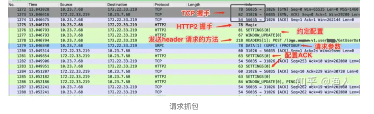
>
>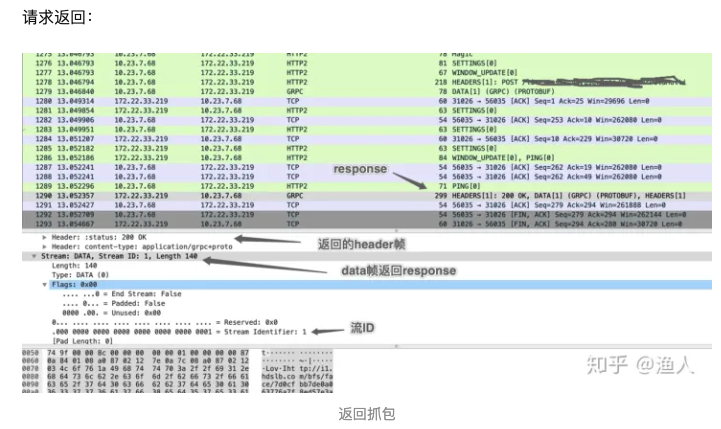
>
>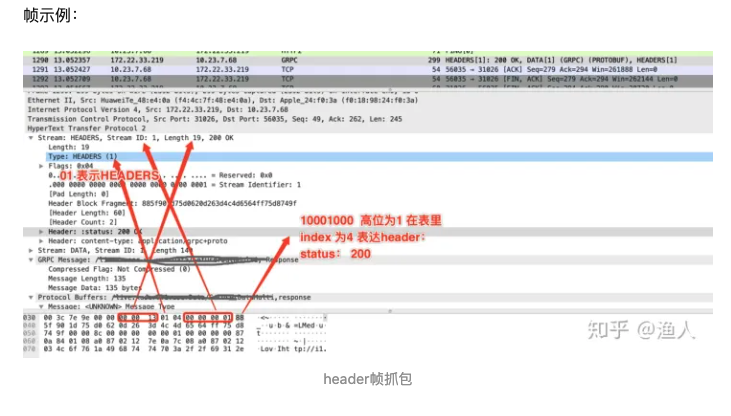
>
>先约定配置，SETTINGS 帧有 ACK 表达确认
>
>- 请求的Method在header中传递
>- 参数用DATA帧
>- 返回状态用HEADER帧
>- 返回数据用DATA帧
>
>**可见调用语义和HTTP并无差别，但通过协议优化，在很大程度上降低了传输的体积，节省资源的同时，也较好地提升了性能。**
>
>看了单个请求的抓包样例，我们得再看看gRPC的stream是什么鬼，代码约定如下：
>
>```protobuf
>// proto
>service XXX {
>    rpc StreamTest(stream StreamTestReq) returns (stream StreamTestResp);
>}
>message StreamTestReq {
>    int64 i = 1;
>}
>message StreamTestResp {
>    int64 j = 1;
>}
>// server端代码
>func (s *XXXService) StreamTest(re v1pb.XXX_StreamTestServer ) (err error) {
>    for {
>        data, err := re.Recv()
>        if err != nil {
>            break
>        }
>             // 将客户端发送来的值乘以10再返回给它
>        err = re.Send(&v1pb.StreamTestResp{J: data.I * 10 }) 
>    }
>    return
>}
>// client 端代码
>func TestStream(t *testing.T) {
>    c, _ := service2.daClient.StreamTest(context.TODO())
>    go func(){
>        for {
>            rec, err := c.Recv()
>            if err != nil {
>                break
>            }
>            fmt.Printf("resp: %v\n", rec.J)
>        }
>    }()
>    for _, x := range []int64{1,2,3,4,5,6,7,8,9}{
>        _ = c.Send(&dav1.StreamTestReq{I: x})
>        time.Sleep(100*time.Millisecond)
>    }
>    _ = c.CloseSend()
>}
>// client端输出结果
>resp: 10
>resp: 20
>resp: 30
>resp: 40
>resp: 50
>resp: 60
>resp: 70
>resp: 80
>resp: 90
>```
>
>- 上面是一个双向stream流
>- client和server端同时在收发数据
>- client连续发送9次后，中断过程。常规的流式服务，如视频编解码，可以一直持续直到结束
>- 服务端将client的参数*10后返回
>
>我们不禁要问，这种流式请求和常规的gRPC有没有区别？ 这从抓包便可知分晓：
>
>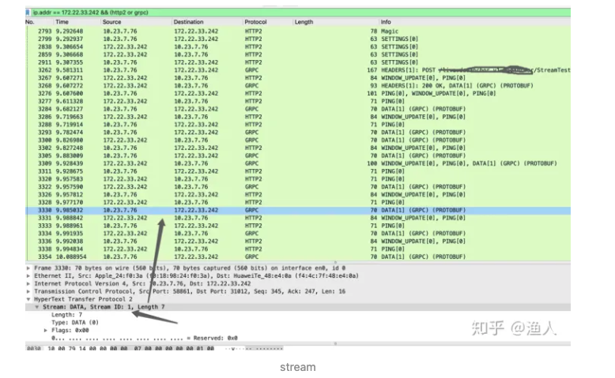
>
>**上面只提取了http2 和grpc的协议内容，否则会被tcp的ack打乱视野，可以从图上看到：**
>
>- **请求的method只发送了一次**
>- **服务端的回复header也只返回了一次(200 OK 那行)**
>- **剩下的就是： client的data帧和server 端的data帧交替**
>- **其实全场就只有一次请求(stream ID 未变化)**
>
>**stream模式，其实就是gRPC从协议层支持了，在一次长请求中，分批地处理小量数据，达到多次请求的效果，像流水一样可以延绵不绝，直到某一方终止。**
>
>试想下，如果gRPC内部不支持这种模式，其实也能自己实现流式的服务，只不过在形式上要多调用几次接口而已。 从上面抓包来看，这种封装在无论在性能和语义上都更好。
>
>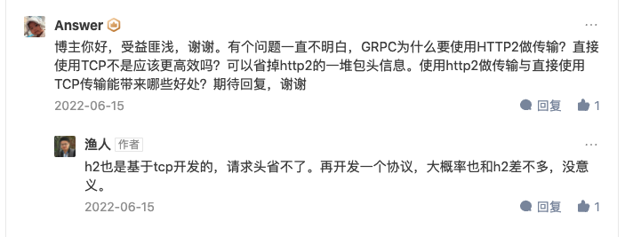


## Grpc Streaming 你造？

>## 一、前言
>
>grpc 是一个由 google 推出的、高性能、开源、通用的 rpc 框架。它是基于 HTTP2 协议标准设计开发，默认采用 Protocol Buffers 数据序列化协议，支持多种开发语言。
>
>一般业务场景下，我们都是使用**grpc的simple-rpc模式**，也就是每次客户端发起请求，服务端会返回一个响应结果的模式。
>
>
>
>但是grpc除了这种一来一往的请求模式外，还有流式模式，下面我们一一道来。
>
>## 二 grpc服务端流
>
>服务端流模式是说客户端发起一次请求后，服务端在接受到请求后，可以以流的方式，使用同一连接，不断的向客户端写回响应结果，客户端则可以源源不断的接受到服务端写回的数据。
>
>
>
>启动客户端后，可以看到StreamObserver的onNext方法会源源不断的接受到服务端返回的数据。
>
>服务端流使用场景：
>
>- 客户端请求一次，但是需要服务端源源不断的返回大量数据时候，比如大批量数据查询的场景。
>- 比如客户端订阅服务端的一个服务数据，服务端发现有新数据时，源源不断的吧数据推送给客户端。
>
>## 三 grpc客户端流
>
>客户端流模式是说客户端发起请求与服务端建立链接后，可以使用同一连接，不断的向服务端传送数据，等客户端把全部数据都传送完毕后，服务端才返回一个请求结果。
>
>
>
>如上启动客户端后，可以看到代码3会把数据1，2，3，4，5通过同一个链接发送到服务端，然后等服务端结束完毕数据后，会计算接受到的数据的平均值，然后把平均值写回客户端。然后代码2设置的监听器的onNext方法就会被回调，然后打印出服务端返回的平均值3。
>
>客户端流使用场景：
>
>- 比如数据批量计算场景：如果只用simple rpc的话，服务端就要一次性收到大量数据，并且在收到全部数据之后才能对数据进行计算处理。如果用客户端流 rpc的话，服务端可以在收到一些记录之后就开始处理，也更有实时性。
>
>## 四 grpc双向流
>
>双向流意味着客户端向服务端发起请求后，客户端可以源源不断向服务端写入数据的同时，服务端可以源源不断向客户端写入数据。
>
>
>
>下面我们通过简单例子，来说明如何使用双向流。
>要实现双向流，需要把grpc方法定义如下：
>
>```java
>service MetricsService {
>    rpc collectTwoWayStream (stream Metric) returns (stream Average);
>}
>```
>
>如上代码，服务端使用流式对象的onNext方法不断接受客户端发来的数据，然后等客户端发送结束后，使用onCompleted方法，把响应结果写回客户端。**并且服务端保存了流式对象responseObserverT用来不断的写数据到客户端**
>
>双向流使用场景：
>
>- 需要双向数据交互的场景，比如聊天机器人，游戏室等。
>
>## 五 StreamObserver转换为反应式框架流
>
>## 五 StreamObserver转换为反应式框架流
>
>StreamObserver是grpc自己定义的一个流式接口，其定义如下：
>
>```text
>public interface StreamObserver<V> {
>    void onNext(V var1);
>
>    void onError(Throwable var1);
>
>    void onCompleted();
>}
>```
>
>grpc虽然提供了流式接口，但是其并没有提供便捷的流操作符，而我们知道Reactor或者Rxjava这些反应式编程框架，本身是提供了丰富便捷的流操作符的。所以我们想看看如何把StreamObserver转换为反应式框架流，由于Reactor是spring5自带的，所以我们看看如何把StreamObserver转换为Reactor的Flux流对象。
>
>转换代码如下：
>
>```java
>public class StreamObserverPublisher implements Publisher<StreamingExample.Average>, StreamObserver<StreamingExample.Average> {
>
>    private Subscriber<? super StreamingExample.Average> subscriber;
>
>    @Override
>    public void onNext(StreamingExample.Average l) {
>        subscriber.onNext(l);
>    }
>
>    @Override
>    public void onError(Throwable throwable) {
>        subscriber.onError(throwable);
>    }
>
>    @Override
>    public void onCompleted() {
>        subscriber.onComplete();
>    }
>
>    @Override
>    public void subscribe(Subscriber<? super StreamingExample.Average> subscriber) {
>        this.subscriber = subscriber;
>        this.subscriber.onSubscribe(new BaseSubscriber() {
>        });
>    }
>}
>
>
>
>public class MetricsClientTwoWay {
>    public static void main(String[] args) throws InterruptedException {
>        //创建客户端桩
>        ManagedChannel channel = ManagedChannelBuilder.forAddress("localhost", 8080).usePlaintext().build();
>        MetricsServiceGrpc.MetricsServiceStub stub = MetricsServiceGrpc.newStub(channel);
>
>        //转换StreamObserver流为Flux流
>        StreamObserverPublisher streamObserverPublisher = new StreamObserverPublisher();
>        Flux<StreamingExample.Average> flux = Flux.from(streamObserverPublisher);
>        //订阅流，缓存，并消费
>        flux.buffer(4).subscribe(o -> System.out.println("ele:" + o.size())); // must be done before executing the gRPC request
>
>        //发起rpc请求
>        StreamObserver<StreamingExample.Metric> collect = stub.collectTwoWayStream(streamObserverPublisher);
>}
>```
>
>## 六 总结
>
>grpc除了提供了simple-rpc还提供了双向流操作，大家可以结合自己的业务场景，选择性使用。另外为了使用反应式框架丰富的流操作符，我们可以便捷的把StreamObserver流转换为Flux流。

## 微服务—gRPC之Protobuf语法

http://events.jianshu.io/p/129c10e88922

GRPC + protobuf

>
>
>


## gRPC 概览

https://doc.oschina.net/grpc?t=58008

>## gRPC 是什么？
>
>在 gRPC 里*客户端*应用可以像调用本地对象一样直接调用另一台不同的机器上*服务端*应用的方法，使得您能够更容易地创建分布式应用和服务。与许多 RPC 系统类似，gRPC 也是基于以下理念：**定义一个*服务*，指定其能够被远程调用的方法（包含参数和返回类型）。在服务端实现这个接口，并运行一个 gRPC 服务器来处理客户端调用。在客户端拥有一个 *存根* 访问像服务端一样的方法。**
>
>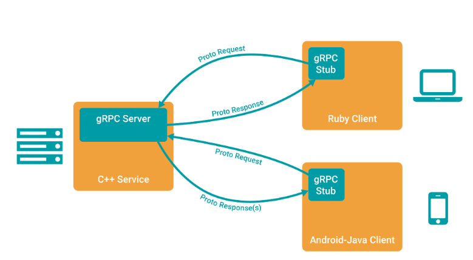
>
>### 使用 proto 定义服务
>
>创建我们例子的第一步是定义一个*服务*：**一个 RPC 服务通过参数和返回类型来指定可以远程调用的方法。就像你在 [概览](https://doc.oschina.net/grpc?t=58008#protocol buffers) 里所看到的， gRPC 通过 [protocol buffers](https://doc.oschina.net/https：//developers.google.com/protocol-buffers/docs/overview) 来实现。 我们使用 protocol buffers 接口定义语言来定义服务方法，用 protocol buffer 来定义参数和返回类型。客户端和服务端均使用服务定义生成的接口代码。** 这里有我们服务定义的例子，在 [helloworld.proto](https://doc.oschina.net/https：//github.com/grpc/grpc-java/tree/master/examples/src/main/proto) 里用 protocol buffers IDL 定义的。`Greeter` 服务有一个方法 `SayHello` ，可以让服务端从远程客户端接收一个包含用户名的 `HelloRequest` 消息后，在一个 `HelloReply` 里发送回一个 `Greeter`。这是你可以在 gRPC 里指定的最简单的 RPC - 你可以在教程里找到针对你选择的语言更多类型的例子。
>
>```protobuf
>syntax = "proto3";
>
>option java_package = "io.grpc.examples";
>
>package helloworld;
>
>// The greeter service definition.
>service Greeter {
>  // Sends a greeting
>  rpc SayHello (HelloRequest) returns (HelloReply) {}
>}
>
>// The request message containing the user's name.
>message HelloRequest {
>  string name = 1;
>}
>
>// The response message containing the greetings
>message HelloReply {
>  string message = 1;
>}
>```
>
>### 生成 gRPC 代码
>
>**一旦定义好服务，我们可以使用 protocol buffer 编译器 `protoc` 来生成创建应用所需的特定客户端和服务端的代码 - 你可以生成任意 gRPC 支持的语言的代码**，当然 PHP 和 Objective-C 仅支持创建客户端代码。
>
>**生成的代码同时包括客户端的存根和服务端要实现的抽象接口**，均包含 `Greeter` 所定义的方法。
>
>(假如你没有在系统里安装 gRPC 插件和 protoc ，并且仅仅是要看一下这个例子，你可以跳过这一步，直接到下一步来查看生成的代码。)  
>
>- Java
>
>    这个例子的构建系统也是 Java gRPC 本身构建的一部分 —— 为了简单起见，我们推荐使用我们事先生成的例子代码。你可以参考 [README](https://doc.oschina.net/https：//github.com/grpc/grpc——java/blob/master/README.md) 来看一下如何从你自己的 .proto 文件生成代码。
>
>    这个例子事先生成的代码在 [src/generated/main](https://doc.oschina.net/https：//github.com/grpc/grpc——java/tree/master/examples/src/generated/main)下。以下类包含所有我们需要创建这个例子所有的代码：
>
>  - HelloRequest.java， HelloResponse.java 和其他文件包含所有 protocol buffer 用来填充、序列化和提取 `HelloRequest` 和 `HelloReply` 消息类型的代码。
>
>  - GreeterGrpc.java， 包含 (还有其他有用的代码)：
>
>      **`Greeter` 服务端需要实现的接口**
>
>```java
>        public static interface Greeter {
>        	public void sayHello(Helloworld.HelloRequest request,
>        	StreamObserver<Helloworld.HelloReply> responseObserver);
>        }
>```
>
>​              **客户端用来与 `Greeter` 服务端进行对话的 `存根` 类**。就像你所看到的，异步存根也实现了 `Greeter` 接口。
>
>```java
>    public static class GreeterStub extends AbstractStub<GreeterStub>
>    implements Greeter {
>      ...
>    }
>```
>
>### 写一个服务器
>
>现在让我们写点代码！首先我们将创建一个服务应用来实现服务。在本节，我们不打算对如何创建一个服务端进行更深入地探讨 —— 更详细的信息可以在你选择语言对应的教程里找到。
>
>#### 服务实现
>
>- Java
>
>    [GreeterImpl.java](https://doc.oschina.net/https：//github.com/grpc/grpc-java/blob/master/examples/src/main/java/io/grpc/examples/helloworld/HelloWorldServer.java#L51) 准确地实现了 `Greeter` 服务所需要的行为。  正如你所见，`GreeterImpl` 类通过实现 `sayHello` 方法，实现了从 [IDL](https://doc.oschina.net/https：//github.com/grpc/grpc-java/tree/master/examples/src/main/proto) 生成的`GreeterGrpc.Greeter` 接口 。
>
>  ```java
>  @Override
>  public void sayHello(HelloRequest req, StreamObserver<HelloReply> responseObserver) {
>  	HelloReply reply = HelloReply.newBuilder().setMessage("Hello " + req.getName()).build();
>  	responseObserver.onNext(reply);
>  	responseObserver.onCompleted();
>  }
>  ```
>
>    `sayHello` 有两个参数：
>
>  - `HelloRequest`： 请求。
>
>  - `StreamObserver<HelloReply>`： 应答观察者，一个特殊的接口，服务器用应答来调用它。
>
>    为了返回给客户端应答并且完成调用：
>
>  1. 用我们消息构建并填充一个在我们接口定义的 `HelloReply` 应答对象。
>  2. 将 `HelloReply` 返回给客户端，然后表明我们已经完成了对 RPC 的处理。
>
>#### 服务端实现
>
>需要提供一个 gRPC 服务的另一个主要功能是**让这个服务实在在网络上可用。**
>
>- Java
>
>    [HelloWorldServer.java](https://doc.oschina.net/https：//github.com/grpc/grpc-java/blob/master/examples/src/main/java/io/grpc/examples/helloworld/HelloWorldServer.java) 提供了以下代码作为 Java 的例子。
>
>  ```java
>  /* The port on which the server should run */
>  private int port = 50051;
>  private Server server;
>  private void start() throws Exception {
>  server = ServerBuilder.forPort(port)
>      .addService(GreeterGrpc.bindService(new GreeterImpl()))
>      .build()
>      .start();
>  logger.info("Server started, listening on " + port);
>  Runtime.getRuntime().addShutdownHook(new Thread() {
>    @Override
>    public void run() {
>      // Use stderr here since the logger may has been reset by its JVM shutdown hook.
>      System.err.println("*** shutting down gRPC server since JVM is shutting down");
>      HelloWorldServer.this.stop();
>      System.err.println("*** server shut down");
>    }
>  });
>  }
>  ```
>
>  ### 写一个客户端
>
>  **客户端的 gRPC** 非常简单。在这一步，我们将用生成的代码写一个简单的客户程序来访问我们在上一节里创建的 `Greeter` 服务器。 同样，我们也不打算对如何实现一个客户端程序深入更多，我们把这些内容放到教程里。
>
>  #### 连接服务
>
>  首先我们看一下我们如何连接 `Greeter` 服务器。我们需要创建一个 gRPC  Channel，指定我们要连接的主机名和服务器端口。然后我们用这个 Channel 创建存根实例。
>
>  - Java
>
>    ```java
>    private final ManagedChannel channel;
>    private final GreeterGrpc.GreeterBlockingStub blockingStub;
>    public HelloWorldClient(String host, int port) {
>    channel = ManagedChannelBuilder.forAddress(host, port)
>        .usePlaintext(true)
>        .build();
>    blockingStub = GreeterGrpc.newBlockingStub(channel);
>    }
>    ```
>
>      在这个例子里，我们创建了一个阻塞的存根。这意味着 RPC 调用要等待服务器应答，将会返回一个应答或抛出一个异常。 gRPC Java 还可以有其他种类的存根，可以向服务器发出非阻塞的调用，这种情况下应答是异步返回的。
>
>  #### 调用 RPC
>
>  现在我们可以联系服务并获得一个 greeting ：
>
>  1. 我们创建并填充一个 `HelloRequest` 发送给服务。
>  2. 我们用请求调用存根的 `SayHello()`，如果 RPC 成功，会得到一个填充的 `HelloReply` ，从其中我们可以获得 greeting。
>
>  - Java
>
>    ```java
>    HelloRequest req = HelloRequest.newBuilder().setName(name).build();
>    HelloReply reply = blockingStub.sayHello(req);
>    ```
>
>      你可以在 [HelloWorldClient.java](https://doc.oschina.net/https：//github.com/grpc/grpc-java/blob/master/examples/src/main/java/io/grpc/examples/helloworld/HelloWorldClient.java) 里查看完整的客户端代码。


## gRPC Server 端启动流程

https://blog.csdn.net/u013360850/article/details/115425311

>## 核心类
>
>- `io.grpc.Server`
>
>Server 的定义接口，实现类是 `io.grpc.internal.ServerImpl`，实现了服务、方法与方法处理器的绑定，端口监听，不同类型的 Server 实现的调用，Server [生命周期](https://so.csdn.net/so/search?q=生命周期&spm=1001.2101.3001.7020)管理等。
>
>- `io.grpc.BindableService`
>
>由编译器生成的服务抽象类的基础接口，并将实现类绑定到服务器，**提供将服务的实现的实例绑定到 Server 的方式**。
>
>- `io.grpc.ServerInterceptor`
>
>Server 端的拦截器，在方法调用之前会被调用。
>
>* io.grpc.HandlerRegistry
>  方法处理器注册器，所有的方法注册器会注册在这里，通过服务名和方法名查找
>
>* io.grpc.ServerServiceDefinition
>  服务定义，包含服务描述信息，方法信息集合
>
>* io.grpc.ServerMethodDefinition
>  方法定义，包含方法描述信息，方法处理器启动流程
>
> ## 启动大致流程
>
>  1. **创建 ServerBuilder**
>
>  2. **指定端口**
>
>  3. **为 ServerBuilder 添加方法**
>     **构建服务定义**
>     **通过生成的代码构建方法定义，将方法与处理器绑定**
>     **将方法处理器添加到方法定义中**
>     **将服务定义添加到服务注册器中**
>
>  4. **添加拦截器等其他的配置**
>
>  5. **构建 Server 实例**
>     **构建 ServerTransport 实例**
>     **遍历所有监听的地址，创建相应的 NettyServer**
>
>  6. **启动 Server**
>     **遍历所有的 NettyServer，调用 start 方法启动。**
>     **创建相应的 ServerBootstrap，绑定监听的地址，可以接受连接。**
>     **创建 NettyServerTransport，调用 start 方法启动 Transport。**
>     **为 NettyServerTransport 创建 NettyServerHandler，用于处理请求。**
>
>  7. **保持 Server 启动状态，启动完成 .**
>
>
>
>    #### 绑定端口
>    
>    最终会使用指定的端口，创建 InetSocketAddress 并将其加入到监听的地址集合中
>    
>    private NettyServerBuilder(int port) {
>        // 将本地 IP 和端口的地址添加到监听的地址集合中
>        this.listenAddresses.add(new InetSocketAddress(port));
>    }
>    
>    **绑定服务**
>    
>    将指定的服务实现类添加到方法注册器中
>    
>    - io.grpc.internal.AbstractServerImplBuilder#addService(io.grpc.BindableService)
>    
>    添加的服务是 `BindableService` 接口的实现类的实例
>    
>    #### 绑定拦截器
>    
>    ```java
>    io.grpc.internal.AbstractServerImplBuilder#intercept
>    通过 intercept 方法，将拦截器添加到拦截器集合中
>    
>    public final T intercept(ServerInterceptor interceptor) {
>        interceptors.add(checkNotNull(interceptor, "interceptor"));
>        return thisT();
>    }
>    ```
>    
>    #### 构建 Server 实例
>    
>    构建 Server 实例
>    io.grpc.internal.AbstractServerImplBuilder#build
>    在构建器中创建 Server 的实例
>    
>    public final Server build() {
>        return new ServerImpl(this, buildTransportServers(getTracerFactories()), Context.ROOT);
>    }
>    
>    ### 启动 Server
>    
>    - io.grpc.internal.ServerImpl#start
>    
>    启动 `Server`，会创建服务监听器，遍历所有的监听的地址，并启动相应的 `Transport`，修改启动状态为 true
>    
>    保持 Server 运行
>    
>    ```java
>    io.grpc.internal.ServerImpl#awaitTermination()
>    通过轮询关闭的状态，如果没有关闭，则使锁等待，保持 Server 线程的运行
>    
>    public void awaitTermination() throws InterruptedException {
>        synchronized (lock) {
>            while (!terminated) {
>                lock.wait();
>            }
>        }
>    }
>    ```
>
>

## 既然有 HTTP 请求，为什么还要用 RPC 调用？

>我估计题主是看了下面这个图，觉得http和rpc是在同一个层，而且互斥的概念。**RPC只是对底层协议的封装，其实对具体的通信协议是啥并没有太多要求**。
>
>
>
>其实**http是最常用的承载RPC的通信协议之一。而且我们可以在http 上传输xml和json这样的文本协议，也可以是protobuf和thrift这样的二进制协议，这都不是问题。大家常用的REST api就可以很好的封装成rpc。**当然，http这种协议是笨重一些，但它的穿透性比较好，配套的设施也齐全，也比较简单直观，还是比较收欢迎的。**比如说著名的grpc就通过http来传输。**
>
>至于题主说引用太多包的问题，这就是RPC的服务器端框架和实现的问题了。要看题主要用什么样的框架，但总的来说这些rpc框架是让你的远程调用更方便，而不是更麻烦的。

既然有 HTTP 请求，为什么还要用 RPC 调用？ - 手不要乱摸的回答 - 知乎 https://www.zhihu.com/question/41609070/answer/191965937

>这个问题其实是有理解误区的，首先 http 和 rpc 并不是一个并行概念。
>
>rpc 是远端过程调用，**其调用协议通常包含传输协议和序列化协议。**
>
>传输协议包含: 如著名的 [gRPC]([grpc / grpc.io](https://link.zhihu.com/?target=http%3A//www.grpc.io/)) 使用的 http2 协议，也有如dubbo一类的自定义报文的tcp协议。
>
>序列化协议包含: 如基于文本编码的 xml json，也有二进制编码的 protobuf hessian等。
>
>要解决这个问题就应该搞清楚 http 使用的 tcp 协议，和我们自定义的 tcp 协议在报文上的区别。
>
>**首先要否认一点 http 协议相较于自定义tcp报文协议，增加的开销在于连接的建立与断开。http协议是支持连接池复用的，也就是建立一定数量的连接不断开，并不会频繁的创建和销毁连接**。第二要说的是**http也可以使用protobuf这种二进制编码协议对内容进行编码**，因此二者最大的区别还是在传输协议上。
>
>通用定义的http1.1协议的tcp报文包含太多废信息，一个POST协议的格式大致如下：
>
>``` html
>HTTP/1.0 200 OK 
>Content-Type: text/plain
>Content-Length: 137582
>Expires: Thu, 05 Dec 1997 16:00:00 GMT
>Last-Modified: Wed, 5 August 1996 15:55:28 GMT
>Server: Apache 0.84
>
><html>
><body>Hello World</body>
></html>
>```
>
>即使编码协议也就是body是使用二进制编码协议，报文元数据也就是header头的键值对却用了文本编码，非常占字节数。如上图所使用的报文中有效字节数仅仅占约 30%，也就是70%的时间用于传输元数据废编码。
>
>**简单来说成熟的rpc库相对http容器，更多的是封装了“服务发现”，"负载均衡"，“熔断降级”一类面向服务的高级特性。可以这么理解，rpc框架是面向服务的更高级的封装。**如果把一个http servlet容器上封装一层服务发现和函数代理调用，那它就已经可以做一个rpc框架了。
>
>所以为什么要用rpc调用？
>
>**因为良好的rpc调用是面向服务的封装，针对服务的可用性和效率等都做了优化。单纯使用http调用则缺少了这些特性。**

区分 RPC 和 http：

RPC, Remote Procedure Call. 是相对于Local Procedure Call的。核心是能像使用local procedure那样，去调用remote procedure。性能优先的，会考虑基于TCP/UDP层，设计binary格式的协议。开发友好的，会选择基于HTTP协议实现text based的协议。

