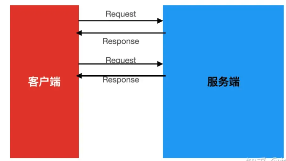
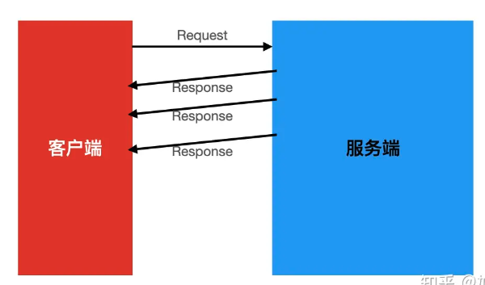
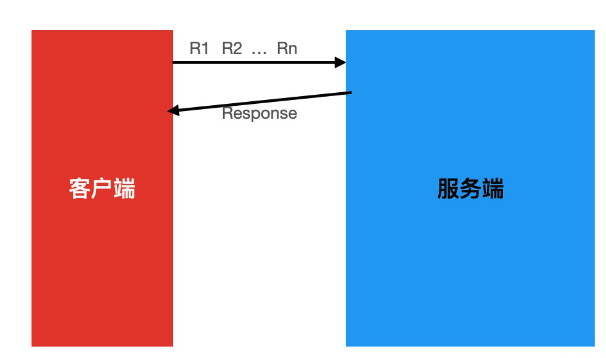
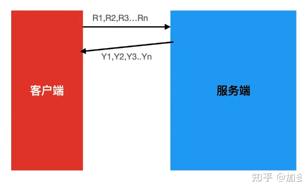
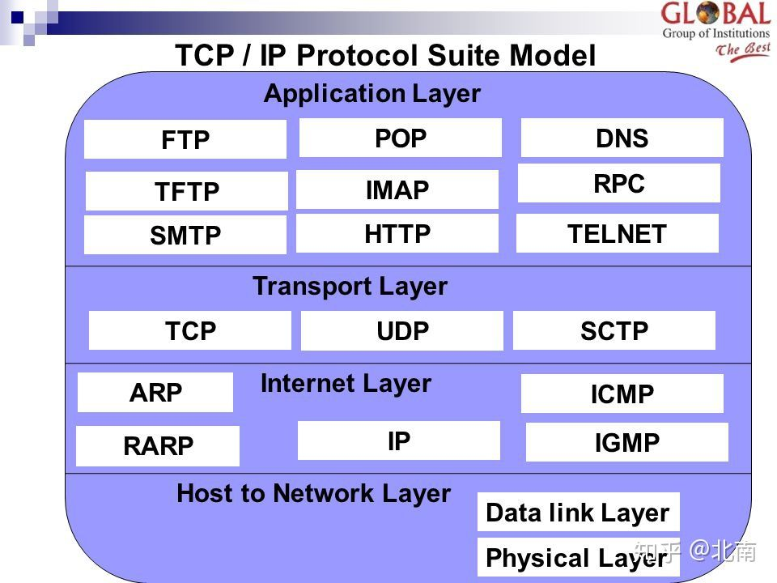

# RPC 专题

## Grpc Streaming 你造？

>## 一、前言
>
>grpc 是一个由 google 推出的、高性能、开源、通用的 rpc 框架。它是基于 HTTP2 协议标准设计开发，默认采用 Protocol Buffers 数据序列化协议，支持多种开发语言。
>
>一般业务场景下，我们都是使用**grpc的simple-rpc模式**，也就是每次客户端发起请求，服务端会返回一个响应结果的模式。
>
>
>
>但是grpc除了这种一来一往的请求模式外，还有流式模式，下面我们一一道来。
>
>## 二 grpc服务端流
>
>服务端流模式是说客户端发起一次请求后，服务端在接受到请求后，可以以流的方式，使用同一连接，不断的向客户端写回响应结果，客户端则可以源源不断的接受到服务端写回的数据。
>
>
>
>启动客户端后，可以看到StreamObserver的onNext方法会源源不断的接受到服务端返回的数据。
>
>服务端流使用场景：
>
>- 客户端请求一次，但是需要服务端源源不断的返回大量数据时候，比如大批量数据查询的场景。
>- 比如客户端订阅服务端的一个服务数据，服务端发现有新数据时，源源不断的吧数据推送给客户端。
>
>## 三 grpc客户端流
>
>客户端流模式是说客户端发起请求与服务端建立链接后，可以使用同一连接，不断的向服务端传送数据，等客户端把全部数据都传送完毕后，服务端才返回一个请求结果。
>
>
>
>如上启动客户端后，可以看到代码3会把数据1，2，3，4，5通过同一个链接发送到服务端，然后等服务端结束完毕数据后，会计算接受到的数据的平均值，然后把平均值写回客户端。然后代码2设置的监听器的onNext方法就会被回调，然后打印出服务端返回的平均值3。
>
>客户端流使用场景：
>
>- 比如数据批量计算场景：如果只用simple rpc的话，服务端就要一次性收到大量数据，并且在收到全部数据之后才能对数据进行计算处理。如果用客户端流 rpc的话，服务端可以在收到一些记录之后就开始处理，也更有实时性。
>
>## 四 grpc双向流
>
>双向流意味着客户端向服务端发起请求后，客户端可以源源不断向服务端写入数据的同时，服务端可以源源不断向客户端写入数据。
>
>
>
>下面我们通过简单例子，来说明如何使用双向流。
>要实现双向流，需要把grpc方法定义如下：
>
>```java
>service MetricsService {
>    rpc collectTwoWayStream (stream Metric) returns (stream Average);
>}
>```
>
>如上代码，服务端使用流式对象的onNext方法不断接受客户端发来的数据，然后等客户端发送结束后，使用onCompleted方法，把响应结果写回客户端。**并且服务端保存了流式对象responseObserverT用来不断的写数据到客户端**
>
>双向流使用场景：
>
>- 需要双向数据交互的场景，比如聊天机器人，游戏室等。
>
>## 五 StreamObserver转换为反应式框架流
>
>## 五 StreamObserver转换为反应式框架流
>
>StreamObserver是grpc自己定义的一个流式接口，其定义如下：
>
>```text
>public interface StreamObserver<V> {
>    void onNext(V var1);
>
>    void onError(Throwable var1);
>
>    void onCompleted();
>}
>```
>
>grpc虽然提供了流式接口，但是其并没有提供便捷的流操作符，而我们知道Reactor或者Rxjava这些反应式编程框架，本身是提供了丰富便捷的流操作符的。所以我们想看看如何把StreamObserver转换为反应式框架流，由于Reactor是spring5自带的，所以我们看看如何把StreamObserver转换为Reactor的Flux流对象。
>
>转换代码如下：
>
>```java
>public class StreamObserverPublisher implements Publisher<StreamingExample.Average>, StreamObserver<StreamingExample.Average> {
>
>    private Subscriber<? super StreamingExample.Average> subscriber;
>
>    @Override
>    public void onNext(StreamingExample.Average l) {
>        subscriber.onNext(l);
>    }
>
>    @Override
>    public void onError(Throwable throwable) {
>        subscriber.onError(throwable);
>    }
>
>    @Override
>    public void onCompleted() {
>        subscriber.onComplete();
>    }
>
>    @Override
>    public void subscribe(Subscriber<? super StreamingExample.Average> subscriber) {
>        this.subscriber = subscriber;
>        this.subscriber.onSubscribe(new BaseSubscriber() {
>        });
>    }
>}
>
>
>
>public class MetricsClientTwoWay {
>    public static void main(String[] args) throws InterruptedException {
>        //创建客户端桩
>        ManagedChannel channel = ManagedChannelBuilder.forAddress("localhost", 8080).usePlaintext().build();
>        MetricsServiceGrpc.MetricsServiceStub stub = MetricsServiceGrpc.newStub(channel);
>
>        //转换StreamObserver流为Flux流
>        StreamObserverPublisher streamObserverPublisher = new StreamObserverPublisher();
>        Flux<StreamingExample.Average> flux = Flux.from(streamObserverPublisher);
>        //订阅流，缓存，并消费
>        flux.buffer(4).subscribe(o -> System.out.println("ele:" + o.size())); // must be done before executing the gRPC request
>
>        //发起rpc请求
>        StreamObserver<StreamingExample.Metric> collect = stub.collectTwoWayStream(streamObserverPublisher);
>}
>```
>
>## 六 总结
>
>grpc除了提供了simple-rpc还提供了双向流操作，大家可以结合自己的业务场景，选择性使用。另外为了使用反应式框架丰富的流操作符，我们可以便捷的把StreamObserver流转换为Flux流。
>
>


## 微服务—gRPC之Protobuf语法

http://events.jianshu.io/p/129c10e88922

GRPC + protobuf

>
>
>

### gRPC Server 端启动流程

https://blog.csdn.net/u013360850/article/details/115425311

>## 核心类
>
>- `io.grpc.Server`
>
>Server 的定义接口，实现类是 `io.grpc.internal.ServerImpl`，实现了服务、方法与方法处理器的绑定，端口监听，不同类型的 Server 实现的调用，Server [生命周期](https://so.csdn.net/so/search?q=生命周期&spm=1001.2101.3001.7020)管理等。
>
>- `io.grpc.BindableService`
>
>由编译器生成的服务抽象类的基础接口，并将实现类绑定到服务器，**提供将服务的实现的实例绑定到 Server 的方式**。
>
>- `io.grpc.ServerInterceptor`
>
>Server 端的拦截器，在方法调用之前会被调用。
>
>* io.grpc.HandlerRegistry
>  方法处理器注册器，所有的方法注册器会注册在这里，通过服务名和方法名查找
>
>* io.grpc.ServerServiceDefinition
>  服务定义，包含服务描述信息，方法信息集合
>
>* io.grpc.ServerMethodDefinition
>  方法定义，包含方法描述信息，方法处理器启动流程
>
> ## 启动大致流程
>
>  1. 创建 ServerBuilder
>
>  2. 指定端口
>
>  3. 为 ServerBuilder 添加方法
>     构建服务定义
>     通过生成的代码构建方法定义，将方法与处理器绑定
>     将方法处理器添加到方法定义中
>     将服务定义添加到服务注册器中
>
>  4. 添加拦截器等其他的配置
>
>  5. 构建 Server 实例
>     构建 ServerTransport 实例
>     遍历所有监听的地址，创建相应的 NettyServer
>
>  6. 启动 Server
>     遍历所有的 NettyServer，调用 start 方法启动。
>     创建相应的 ServerBootstrap，绑定监听的地址，可以接受连接。
>     创建 NettyServerTransport，调用 start 方法启动 Transport。
>     为 NettyServerTransport 创建 NettyServerHandler，用于处理请求。
>
>  7. 保持 Server 启动状态，启动完成 .
>
>
>
>    #### 绑定端口
>    
>    最终会使用指定的端口，创建 InetSocketAddress 并将其加入到监听的地址集合中
>    
>    private NettyServerBuilder(int port) {
>        // 将本地 IP 和端口的地址添加到监听的地址集合中
>        this.listenAddresses.add(new InetSocketAddress(port));
>    }
>    
>    **绑定服务**
>    
>    将指定的服务实现类添加到方法注册器中
>    
>    - io.grpc.internal.AbstractServerImplBuilder#addService(io.grpc.BindableService)
>    
>    添加的服务是 `BindableService` 接口的实现类的实例
>    
>    #### 绑定拦截器
>    
>    ```java
>    io.grpc.internal.AbstractServerImplBuilder#intercept
>    通过 intercept 方法，将拦截器添加到拦截器集合中
>    
>    public final T intercept(ServerInterceptor interceptor) {
>        interceptors.add(checkNotNull(interceptor, "interceptor"));
>        return thisT();
>    }
>    ```
>    
>    #### 构建 Server 实例
>    
>    构建 Server 实例
>    io.grpc.internal.AbstractServerImplBuilder#build
>    在构建器中创建 Server 的实例
>    
>    public final Server build() {
>        return new ServerImpl(this, buildTransportServers(getTracerFactories()), Context.ROOT);
>    }
>    
>    ### 启动 Server
>    
>    - io.grpc.internal.ServerImpl#start
>    
>    启动 `Server`，会创建服务监听器，遍历所有的监听的地址，并启动相应的 `Transport`，修改启动状态为 true
>    
>    保持 Server 运行
>    
>    ```java
>    io.grpc.internal.ServerImpl#awaitTermination()
>    通过轮询关闭的状态，如果没有关闭，则使锁等待，保持 Server 线程的运行
>    
>    public void awaitTermination() throws InterruptedException {
>        synchronized (lock) {
>            while (!terminated) {
>                lock.wait();
>            }
>        }
>    }
>    ```
>
>

### 既然有 HTTP 请求，为什么还要用 RPC 调用？

>我估计题主是看了下面这个图，觉得http和rpc是在同一个层，而且互斥的概念。**RPC只是对底层协议的封装，其实对具体的通信协议是啥并没有太多要求**。
>
>
>
>其实**http是最常用的承载RPC的通信协议之一。而且我们可以在http 上传输xml和json这样的文本协议，也可以是protobuf和thrift这样的二进制协议，这都不是问题。大家常用的REST api就可以很好的封装成rpc。**当然，http这种协议是笨重一些，但它的穿透性比较好，配套的设施也齐全，也比较简单直观，还是比较收欢迎的。**比如说著名的grpc就通过http来传输。**
>
>至于题主说引用太多包的问题，这就是RPC的服务器端框架和实现的问题了。要看题主要用什么样的框架，但总的来说这些rpc框架是让你的远程调用更方便，而不是更麻烦的。

既然有 HTTP 请求，为什么还要用 RPC 调用？ - 手不要乱摸的回答 - 知乎 https://www.zhihu.com/question/41609070/answer/191965937

>这个问题其实是有理解误区的，首先 http 和 rpc 并不是一个并行概念。
>
>rpc 是远端过程调用，**其调用协议通常包含传输协议和序列化协议。**
>
>传输协议包含: 如著名的 [gRPC]([grpc / grpc.io](https://link.zhihu.com/?target=http%3A//www.grpc.io/)) 使用的 http2 协议，也有如dubbo一类的自定义报文的tcp协议。
>
>序列化协议包含: 如基于文本编码的 xml json，也有二进制编码的 protobuf hessian等。
>
>要解决这个问题就应该搞清楚 http 使用的 tcp 协议，和我们自定义的 tcp 协议在报文上的区别。
>
>**首先要否认一点 http 协议相较于自定义tcp报文协议，增加的开销在于连接的建立与断开。http协议是支持连接池复用的，也就是建立一定数量的连接不断开，并不会频繁的创建和销毁连接**。第二要说的是**http也可以使用protobuf这种二进制编码协议对内容进行编码**，因此二者最大的区别还是在传输协议上。
>
>通用定义的http1.1协议的tcp报文包含太多废信息，一个POST协议的格式大致如下：
>
>``` html
>HTTP/1.0 200 OK 
>Content-Type: text/plain
>Content-Length: 137582
>Expires: Thu, 05 Dec 1997 16:00:00 GMT
>Last-Modified: Wed, 5 August 1996 15:55:28 GMT
>Server: Apache 0.84
>
><html>
><body>Hello World</body>
></html>
>```
>
>即使编码协议也就是body是使用二进制编码协议，报文元数据也就是header头的键值对却用了文本编码，非常占字节数。如上图所使用的报文中有效字节数仅仅占约 30%，也就是70%的时间用于传输元数据废编码。
>
>**简单来说成熟的rpc库相对http容器，更多的是封装了“服务发现”，"负载均衡"，“熔断降级”一类面向服务的高级特性。可以这么理解，rpc框架是面向服务的更高级的封装。**如果把一个http servlet容器上封装一层服务发现和函数代理调用，那它就已经可以做一个rpc框架了。
>
>所以为什么要用rpc调用？
>
>**因为良好的rpc调用是面向服务的封装，针对服务的可用性和效率等都做了优化。单纯使用http调用则缺少了这些特性。**

区分 RPC 和 http：

RPC, Remote Procedure Call. 是相对于Local Procedure Call的。核心是能像使用local procedure那样，去调用remote procedure。性能优先的，会考虑基于TCP/UDP层，设计binary格式的协议。开发友好的，会选择基于HTTP协议实现text based的协议。

