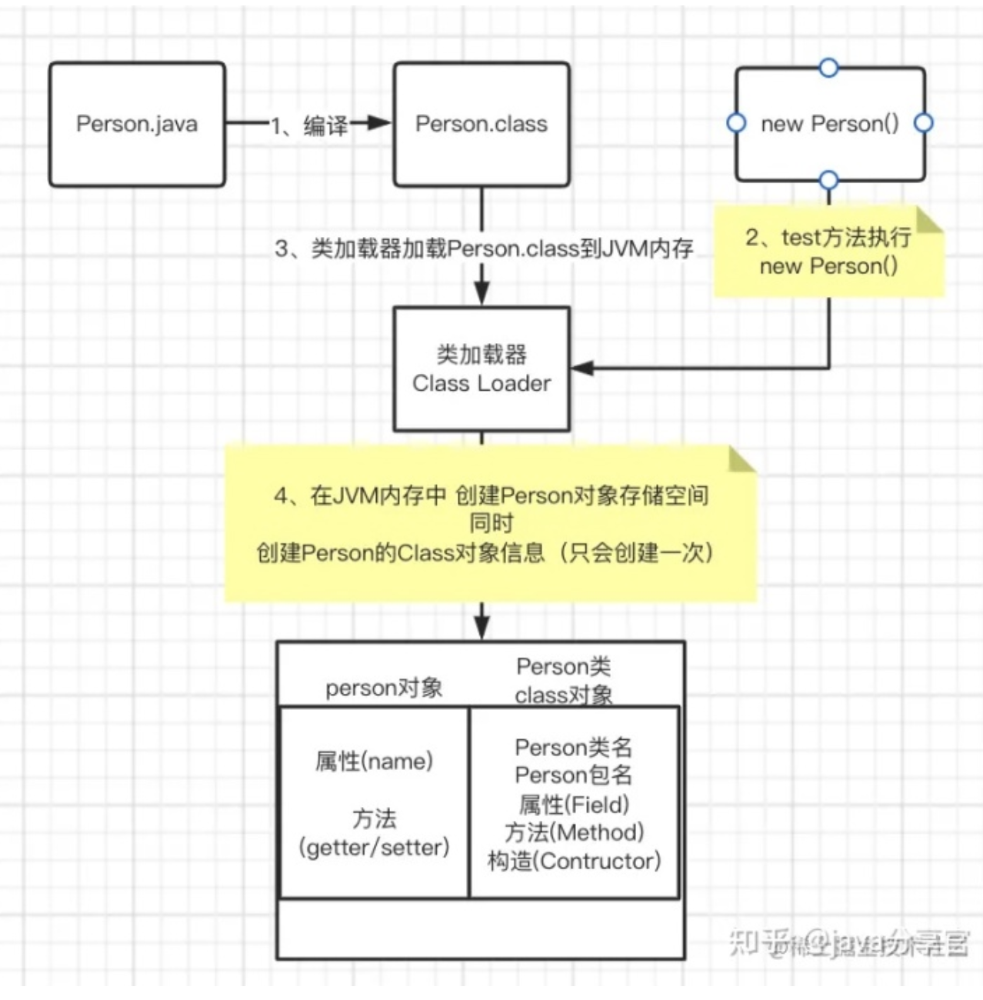

# Reflections library 学习笔记

# 官网

https://github.com/ronmamo/reflections

## Java runtime metadata analysis

Reflections scans and indexes your project's classpath metadata, allowing reverse transitive query of the type system on runtime.

Using Reflections you can query for example:

- Subtypes of a type
- Types annotated with an annotation
- Methods with annotation, parameters, return type
- Resources found in classpath
  And more...

Note that:

- **Scanner must be configured in order to be queried, otherwise an empty result is returned**
  If not specified, default scanners will be used SubTypes, TypesAnnotated.
  For all standard scanners use `Scanners.values()`. See more scanners in the source [package](https://ronmamo.github.io/reflections/org/reflections/scanners).
- **All relevant URLs should be configured**
  Consider `.filterInputsBy()` in case too many classes are scanned.
  If required, Reflections will [expand super types](https://ronmamo.github.io/reflections/org/reflections/Reflections.html#expandSuperTypes(java.util.Map)) in order to get the transitive closure metadata without scanning large 3rd party urls.
- Classloader can optionally be used for resolving runtime classes from names.


# 文章

## Java Reflections框架，类扫描工具

https://www.jianshu.com/p/49199793aff3

>Reflection框架可以：
>
>- 获取某个类型的全部子类
>- 只要类型、构造器、方法，字段上带有特定注解，便能获取带有这个注解的全部信息（类型、构造器、方法，字段）
>- 获取所有能匹配某个正则表达式的资源
>- 获取所有带有特定签名的方法，包括参数，参数注解，返回类型
>- 获取所有方法的名字
>- 获取代码里所有字段、方法名、构造器的使用
>
>

## 反射创建对象和直接 new 创建对象的区别？？

* **new 只能用于编译期就能确定的类型, 而反射可以在运行时才确定类型并创建其对象.**

  **反射代替 new 就是为了接口和实现分离.**

* 实际应用：

```java
   反射可以不用import就生成对象一般会配合接口使用如果不用反射，interface Myobj=new Classimpl（）这样接口和实现类都要import进来这样的话，如果实现类发生变动，需要重新编译，那这段代码也需要重新编译. 
   如果用反射的话，实现类可以不用import进来也能生成一个满足接口的对象出来这样当实现类改动的时候，这段代码可以不用重新编译，这样就实现了解偶 decoupling 的目的.
链接：https://www.zhihu.com/question/340517449/answer/788991501
```

## new 对象不行吗？为什么要用反射？

https://zhuanlan.zhihu.com/p/461723456

>
>
>1. 首先程序启动，Person.java 文件编译成 Person.class 文件;
>2. 程序执行到new Person()，开辟内存空间;
>3. 类加载器将Person.class加载到JVM内存中；
>4. **将Person.class加载到JVM的同时也会将person对象，以及Person类的Class对象加载到JVM内存中。**
>
>不知道大家看完上述流程会不会出现如下问题：
>
>- **没有new对象，启动会不会加载该类？ 不会**
>- **new了对象，不调用，启动会不会加载该类？不会，调用了会被加载**
>- **类真的是只会被加载一次吗？是的**
>
>只有被系统使用的类才会被JVM加载，且每个类只会被加载一次，类加载后会生成一个Class对象，该Class对象中包含这个类的所有信息！
>
>通过类加载的流程我们知道，类被加载后会生成一个对前类的Class对象，该Class对象包含了这个类的所有信息，而**反射就是通过读取这个Class对象，反向获取类的相关信息，并对其进行相关操作。**
>
>## 反射缺点
>
>反射很强大，但不应该乱用，因为使用反射会给我们带来一些困扰，比如：
>
>- 性能开销：**反射涉及动态解析类型，因此无法执行某些Java虚拟机的优化**，**应该避免在性能敏感功能中使用反射**
>- **安全限制**：反射需要在安全管理器下运行时可能不存在的运行时权限。对于必须在受限安全上下文中运行的代码（例如在 Applet 中），这是一个重要的考虑因素。
>- 内部暴露：**反射允许代码执行在非反射代码中非法的操作，例如访问private字段和方法，因此使用反射可能会导致意想不到的副作用，这可能会导致代码功能失调并可能破坏可移植性。**反射代码打破了抽象，因此可能会随着平台的升级而改变行为。

## 