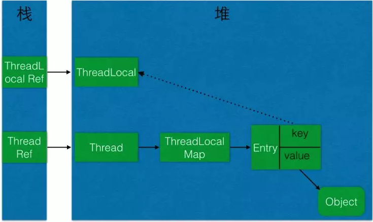

# ThreadLocal 的学习笔记（源码解析、最佳实践）

## 1. 源码解析

* #### get() 方法

java.lang.ThreadLocal#get

```java
/**
 * Returns the value in the current thread's copy of this
 * thread-local variable.  If the variable has no value for the
 * current thread, it is first initialized to the value returned
 * by an invocation of the {@link #initialValue} method.
 *
 * @return the current thread's value of this thread-local
 */
public T get() {
    Thread t = Thread.currentThread();
    ThreadLocalMap map = getMap(t);  //1. 获取当前线程的 ThreadLocalMap 对象
    if (map != null) {
       // 2. 当前线程的 ThreadLocalMap 对象根据当前的 ThreadLocal 对象获取 Entry 值
        ThreadLocalMap.Entry e = map.getEntry(this);  
        if (e != null) {
            @SuppressWarnings("unchecked")
            T result = (T)e.value;
            return result;
        }
    }
    return setInitialValue();
}
```

```java
// java.lang.ThreadLocal#getMap
/**
 * Get the map associated with a ThreadLocal. Overridden in
 * InheritableThreadLocal.
 *
 * @param  t the current thread
 * @return the map
 */
ThreadLocalMap getMap(Thread t) {
    return t.threadLocals;  // Thread 对象中的 ThreadLocalMap threadLocals 变量
}
```

java.lang.Thread#threadLocals

```java
/* ThreadLocal values pertaining to this thread. This map is maintained
 * by the ThreadLocal class. */
ThreadLocal.ThreadLocalMap threadLocals = null;
```

* #### 几个构造函数

##### (1)java.lang.ThreadLocal.ThreadLocalMap#ThreadLocalMap(java.lang.ThreadLocal<?>, java.lang.Object)

``` java
ThreadLocalMap(ThreadLocal<?> firstKey, Object firstValue) {
            table = new Entry[INITIAL_CAPACITY];
            int i = firstKey.threadLocalHashCode & (INITIAL_CAPACITY - 1);
            table[i] = new Entry(firstKey, firstValue);
            size = 1;
            setThreshold(INITIAL_CAPACITY);
        }
```

注意：Entry 数组 `table = new Entry[INITIAL_CAPACITY];`、index 的生成方式 ` int i = firstKey.threadLocalHashCode & (INITIAL_CAPACITY - 1);` 和 HashMap 有些类似。

##### (2) java.lang.ThreadLocal.ThreadLocalMap.Entry

``` java
/**
         * The entries in this hash map extend WeakReference, using
         * its main ref field as the key (which is always a
         * ThreadLocal object).  Note that null keys (i.e. entry.get()
         * == null) mean that the key is no longer referenced, so the
         * entry can be expunged from table.  Such entries are referred to
         * as "stale entries" in the code that follows.
         */
        static class Entry extends WeakReference<ThreadLocal<?>> {
            /** The value associated with this ThreadLocal. */
            Object value;

            Entry(ThreadLocal<?> k, Object v) {
                super(k);   // Entry 中的 key 是 ThreadLocal 对象的弱引用
                value = v;
            }
        }
```

* #### java.lang.ThreadLocal#set  方法

``` java
/**
     * Sets the current thread's copy of this thread-local variable
     * to the specified value.  Most subclasses will have no need to
     * override this method, relying solely on the {@link #initialValue}
     * method to set the values of thread-locals.
     *
     * @param value the value to be stored in the current thread's copy of
     *        this thread-local.
     */
    public void set(T value) {
        Thread t = Thread.currentThread();
        ThreadLocalMap map = getMap(t);   // 1. 获取当前线程的 ThreadLocalMap
        if (map != null)
            map.set(this, value);   // 2. 在 当前线程的 ThreadLocalMap 实例中，设置以当前 ThreadLocal 实例为 key，以参数 value 为value的 new Entry(key, value) 实例。
        else
            createMap(t, value);
    }
```

 java.lang.ThreadLocal.ThreadLocalMap#set

``` java
/**
         * Set the value associated with key.
         *
         * @param key the thread local object
         * @param value the value to be set
         */
        private void set(ThreadLocal<?> key, Object value) {

            // We don't use a fast path as with get() because it is at
            // least as common to use set() to create new entries as
            // it is to replace existing ones, in which case, a fast
            // path would fail more often than not.

            Entry[] tab = table;   // Entry 数组
            int len = tab.length;
            int i = key.threadLocalHashCode & (len-1);   // 求index 的方法

            for (Entry e = tab[i];
                 e != null;
                 e = tab[i = nextIndex(i, len)]) {
                ThreadLocal<?> k = e.get();

                if (k == key) {
                    e.value = value;
                    return;
                }

                if (k == null) {
                    replaceStaleEntry(key, value, i);
                    return;
                }
            }

            tab[i] = new Entry(key, value);
            int sz = ++size;
            if (!cleanSomeSlots(i, sz) && sz >= threshold)
                rehash();
        }
```

和 HashMap 的set有类似。

* #### java.lang.ThreadLocal#remove 方法

``` java
/**
     * Removes the current thread's value for this thread-local
     * variable.  If this thread-local variable is subsequently
     * {@linkplain #get read} by the current thread, its value will be
     * reinitialized by invoking its {@link #initialValue} method,
     * unless its value is {@linkplain #set set} by the current thread
     * in the interim.  This may result in multiple invocations of the
     * {@code initialValue} method in the current thread.
     *
     * @since 1.5
     */
     public void remove() {
         ThreadLocalMap m = getMap(Thread.currentThread());   //1 获取当前线程的 ThreadLocalMap
         if (m != null)
             m.remove(this);  //2 从 ThreadLocalMap 中移除key为当前 ThreadLocal 实例的Entry
     }
```

java.lang.ThreadLocal.ThreadLocalMap#remove    ThreadLocalMap 中移除key为当前 ThreadLocal 实例的Entry

``` java
 /**
         * Remove the entry for key.
         */
        private void remove(ThreadLocal<?> key) {
            Entry[] tab = table;
            int len = tab.length;
            int i = key.threadLocalHashCode & (len-1);
            for (Entry e = tab[i];
                 e != null;
                 e = tab[i = nextIndex(i, len)]) {
                if (e.get() == key) {
                    e.clear();
                    expungeStaleEntry(i);
                    return;
                }
            }
        }
```

总结：每次在某个线程中调用 TheadLocal 实例 的 remove() 方法时，是从当前线程的 ThreadLocalMap 对象中移除 key 为 当前 TheadLocal 实例 的 entry。

## 2. 最佳实践

* #### 将 ThreadLocal 设置为 private static

(1) 减少内存开销

[将ThreadLocal变量设置为private static的好处是啥？ - 黄昏之贼的回答 - 知乎](https://www.zhihu.com/question/35250439/answer/1156417906) 

> 如果不使用static修饰，每个工作线程取得任务后都会重复创建一个ThreadLocal对象，导致不必要的内存开销。

>ThreadLocal 对象建议使用 static 修饰。这个变量是针对一个线程内所有操作共享的，所以设置为静态变量，所有此类实例共享 此静态变量 ，也就是说在类第一次被使用时装载，只分配一块存储空间，所有此类的对象(只 要是这个线程内定义的)都可以操控这个变量。
>
>摘自阿里巴巴规范手册 
>
>链接：https://www.zhihu.com/question/35250439/answer/1069588228

（2） 防止内存泄露，具体分析见下文的这段

>threadlocal 内存泄漏通常在有界线程池中不是一个大问题，因为如果使用静态变量来保存threadlocal单例实例，threadlocal 变量在线程被再次使用时最终都可能被覆盖，在线程池中，每个线程只泄漏(最多)一个实例(一个thread local值);但是，如果你不使用静态变量保存单例实例，程序可能会一次又一次地创建新ThreadLocal实例，线程本地值不会被覆盖，并且会在每个线程的threadlocal map中累积。这可能会导致严重的泄漏。即使ThreadLocal实例被回收，其关联的变量依然存在.

* #### 使用者需要手动调用remove函数，删除不再使用的ThreadLocal.

正如javadoc中所说：

> 只要线程是活动的并且线程本地实例是可访问的，那么每个线程都持有对其线程本地变量副本的隐式引用。在线程消失之后，它的所有线程本地实例副本都将进入垃圾收集(除非存在对这些副本的其他引用)。

例如，如果您的服务在servlet容器中执行，那么当请求完成时，它的线程将返回到池中。如果您还没有清理线程的ThreadLocal变量内容，那么在线程处理下一个请求时该数据将继续存在。每个线程都是GC根节点，附加到线程的线程本地变量在线程结束后才会被垃圾回收。

所以为线程池中的线程清理线程本地变量，原因有两个:

* 防止内存(或其他资源)泄漏。
* 防止信息通过threadlocal从一个请求意外泄漏到另一个请求。

threadlocal 内存泄漏通常在有界线程池中不是一个大问题，因为如果使用静态变量来保存threadlocal单例实例，threadlocal 变量在线程被再次使用时最终都可能被覆盖，在线程池中，每个线程只泄漏(最多)一个实例(一个thread local值);但是，如果你不使用静态变量保存单例实例，程序可能会一次又一次地创建新ThreadLocal实例，线程本地值不会被覆盖，并且会在每个线程的threadlocal map中累积。这可能会导致严重的泄漏。即使 ThreadLocal 实例被回收，其关联的变量依然存在，看网上一幅图



ThreadLocalMap使用ThreadLocal的弱引用作为key，如果一个ThreadLocal没有外部强引用来引用它，那么系统 GC 的时候，这个ThreadLocal势必会被回收，这样一来，ThreadLocalMap中就会出现key为null的Entry，就没有办法访问这些key为null的Entry的value，如果当前线程再迟迟不结束的话，这些key为null的Entry的value就会一直存在一条强引用链：Thread Ref -> Thread -> ThreaLocalMap -> Entry -> value永远无法回收，造成内存泄漏。JAVA的ThreadLocal对Key使用到了弱引用，但是为了保证不再内存泄露，在每次set.get的时候主动对key==null的entry做遍历回收。虽然不会造成内存泄露，但是因为只有在每次set，get的时候才会对entry做key==null的判断，从而释放内存，这并不能保证ThreadLocal不会发生内存泄漏，例如：

- 使用static的ThreadLocal，延长了ThreadLocal的生命周期，可能导致的内存泄漏。
- 分配使用了ThreadLocal又不再调用get()、set()、remove()方法，那么就会导致内存泄漏。

所以，您需要自己处理线程局部变量。***唯一彻底的方法是调用ThreadLocal.remove()方法***。要执行清理，通常需要确定线程在当前处理中完成的位置。

## 3. 使用场景

**ThreadLocal使用场景**

1. 每个线程都需要维护一个自己专用的线程的上下文变量，比如jdbc连接，web应用中的session等。
2. 包装一个线程不安全的成员变量，给其提供一个线程安全的环境，同时避免对该对象的同步访问(synchronized)，比如Java里面的SimpleDateFormat是线程不安全的，所以在多线程下使用可以采用ThreadLocal包装，从而提供安全的访问。
3. 对于一些线程级别，传递方法参数有许多层的时候，我们可以使用ThreadLocal包装，只在特定地方set一次，然后不管在什么地方都可以随便get出来，从而巧妙了避免了多层传参。如果上下文信息的范围仅限于一个service，那么最好通过方法参数传递信息，而不是使用ThreadLocal。ThreadLocal适用于需要跨不同服务或在不同层中传递提供信息的情况，如果只被一个service使用，那么你的代码就会显得过于复杂。如果你有数据被AOP advice在不同对象使用，那么将这些数据放到threadlocal中可能是一种不错的方法。

## 4. references

[1] [深入理解ThreadLocal](https://mp.weixin.qq.com/s?__biz=MzA3OTUxNDY2MA==&mid=2247484753&idx=1&sn=8179c18aa2af1f9879dab4e28d349437&chksm=9fb3181aa8c4910c7ef3543f07e0d41d7e64363ec43ab4e1782e5691167c024677fa56983167&xtrack=1&scene=0&subscene=10000&clicktime=1550436792&ascene=7&devicetype=android-26&version=27000336&nettype=WIFI&lang=zh_CN&pass_ticket=kY%2F9PyvLRushZtcbFD1KwCMsMi%2BSwDMEQ%2B6lTIo%2BlWu4AEWYtaym%2FWBvG3gL7Pgr&wx_header=1)

[2] [将ThreadLocal变量设置为private static的好处是啥？](https://www.zhihu.com/question/35250439)

[3] [ThreadLocal源码深度剖析](https://juejin.im/post/5a5efb1b518825732b19dca4)

