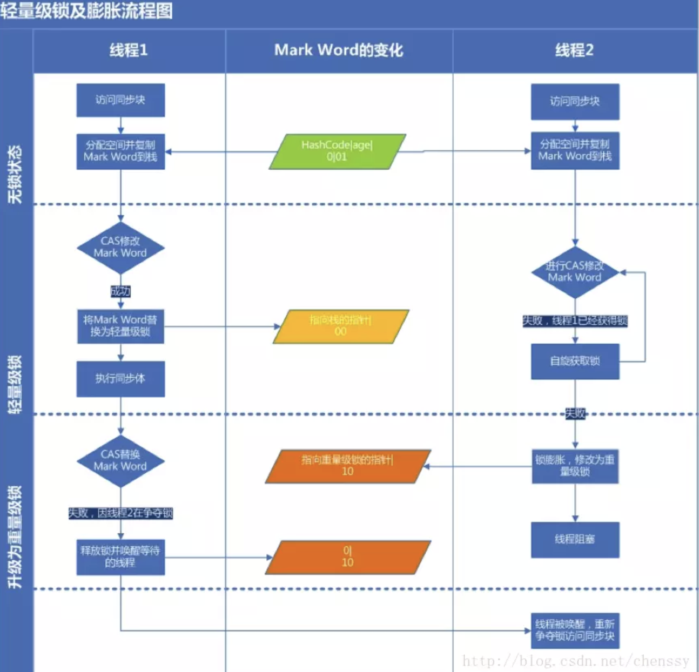

[TOC]

# 1. fj问题记录

2020年3月11日

主要集中的方向
java 基础，项目，中间件（原理不够精通），~~机器学习算法~~ ，数据结构算法

2020年5月23日
CountDownLatch 能保证线程的执行顺序吗。
还有那些方法能保证线程的执行顺序。
CountDownLatch 会导致主线程阻塞吗，在什么情况下会导致线程阻塞。    写一片文章，把countDownLatch 的源码，相关知识点分析下。

maven 插件用的还不熟，很多东西用得少，但是也得会。

# java基础专题(下设三级标题)

### 问题积累


### [java中的float和double的精度问题](https://www.cnblogs.com/vineleven/p/8267005.html)

>**1、背景知识** 
>在java中没有细讲，只是讲了float占32位（bit），double占 64位。 
>对于计算机来说，用位数表示是合适的。但有人喜欢用字节(byte)表示。一个字节占8位。 
>1 byte = 8 bit. 
>所以float占4个字节，double占8个字节。 
>不过我还是喜欢用位数表示。这样更直接，也更容易理解计算机是怎么存储这些类型的。
>
>**3、下面切入正题** 
>===================== 
>在c++中单精度float类型与双精度double类型的问题 
>
>【"单精度用float表示，在计算机中使用4位字节（32位bit）来表示，具有7位有效数字"】 
>
>float类型存储的时候1个bit是符号位，8个bit是指数位，剩下的23个bit是有效数字位。 
>2的23次方是8388608，即7位有效数字，精度（10进制）。 
>
>一个单精度的浮点数在内存当中占用了32个bit位，按照浮点数的表示标准，最高位表示符号，这32位一部分用来表示阶码，一部分用来表示小数部分。 
>按照这个表示方法转化成10进制之后，它能表示的最高精度是7位有效数字。 
>
>比如 
>float a=3.14159;a在内存中实际上表示为0.314159乘以10的1次方（0是符号位），而分配给a的存储单元就分为两部分，一部分存0.314159，一部分存指数1，而且也都是转化为2进制来存。 
>
>================== 
>float ，1位符号位， 8位指数位，23位尾数位 
>double，1位符号位，11位指数位，52位尾数位 
>
>float尾数位23位，2^23=8.3E6，7位，所以不同的编译器规定不同，有些是7位，有些8位 
>double尾数52位，2^52=4.5E15，15位，所以double的有效位数是15位 .

### [对 AtomicReference 的理解和使用](http://ckjava.com/2020/05/08/Java-AtomicReference-understand-practice/)

>## 2 方法列表
>
>1. public final V get() 以非原子的方式 返回当前值
>2. public final void set(V newValue) 以非原子的方式 直接将值设置为预期值
>3. public final void lazySet(V newValue) 以原子的方式 将值设置为预期值
>4. public final boolean compareAndSet(V expect, V update) 以原子的方式 只有在当前值等于预期值的时候才会将值更新，返回是否更新成功
>5. public final boolean weakCompareAndSet(V expect, V update) 以原子的方式 只有在当前值等于预期值的时候才会将值更新，返回是否更新成功
>6. public final V getAndSet(V newValue) 以原子的方式修改后返回旧值
>7. public final V getAndUpdate(UnaryOperator updateFunction) 以原子的方式 修改后返回旧值
>8. public final V updateAndGet(UnaryOperator updateFunction) 以原子的方式 修改后返回新值
>9. public final V getAndAccumulate(V x, BinaryOperator accumulatorFunction) 以原子的方式 修改指定值后返回旧值
>10. public final V accumulateAndGet(V x, BinaryOperator accumulatorFunction) 以原子的方式 修改指定值后返回新值
>
>## 3 构造函数
>
>1. `public AtomicReference()`
>2. `public AtomicReference(V initialValue)`

### [高并发编程之ConcurrentLinkedDeque讲解]( https://blog.csdn.net/weixin_42146366/article/details/88012792)

>四、总结
>①、基于链接节点的无界并发deque 。 并发插入，删除和访问操作可以跨多个线程安全执行。 一个 ConcurrentLinkedDeque是许多线程将共享对公共集合的访问的适当选择。 像大多数其他并发集合实现一样，此类不允许使用null元素， ConcurrentLinkedDeque是一个双向链表 。
>
>②、ConcurrentLinkedDeque使用了自旋+CAS的非阻塞算法来保证线程并发访问时的数据一致性。由于队列本身是一种双链表结构，所以虽然算法看起来很简单，但其实需要考虑各种并发的情况，实现复杂度较高，并且ConcurrentLinkedDeque不具备实时的数据一致性，实际运用中，如果需要一种线程安全的栈结构，可以使用ConcurrentLinkedDeque。
>
>③、关于ConcurrentLinkedDeque还有以下需要注意的几点：
>
>1、ConcurrentLinkedDeque的迭代器是弱一致性的，这在并发容器中是比较普遍的现象，主要是指在一个线程在遍历队列结点而另一个线程尝试对某个队列结点进行修改的话不会抛出ConcurrentModificationException，这也就造成在遍历某个尚未被修改的结点时，在next方法返回时可以看到该结点的修改，但在遍历后再对该结点修改时就看不到这种变化。
>2、size方法需要遍历链表，所以在并发情况下，其结果不一定是准确的，只能供参考。
>————————————————
>版权声明：本文为CSDN博主「住手丶让我来」的原创文章，遵循CC 4.0 BY-SA版权协议，转载请附上原文出处链接及本声明。
>原文链接：https://blog.csdn.net/weixin_42146366/article/details/88012792

### [通俗易懂的双亲委派机制](https://blog.csdn.net/codeyanbao/article/details/82875064)

>你得先知道
>在介绍双亲委派机制的时候，不得不提ClassLoader（类加载器）。说ClassLoader之前，我们得先了解下Java的基本知识。  
>  Java是运行在Java的虚拟机(JVM)中的，但是它是如何运行在JVM中了呢？我们在IDE中编写的Java源代码被编译器编译成.class的字节码文件。然后由我们得ClassLoader负责将这些class文件给加载到JVM中去执行。  
>  JVM中提供了三层的ClassLoader：
>
>Bootstrap classLoader:主要负责加载核心的类库(java.lang.*等)，构造ExtClassLoader和APPClassLoader。
>
>ExtClassLoader：主要负责加载jre/lib/ext目录下的一些扩展的jar。
>
>AppClassLoader：主要负责加载应用程序的主函数类
>
>那如果有一个我们写的Hello.java编译成的Hello.class文件，它是如何被加载到JVM中的呢？别着急，请继续往下看。
>
>### 双亲委派机制
>
>我打开了我的AndroidStudio，搜索了下“ClassLoader”,然后打开“java.lang”包下的**ClassLoader**类。然后将代码翻到**loadClass**方法：
>
>```java
>    public Class<?> loadClass(String name) throws ClassNotFoundException {
>        return loadClass(name, false);
>    }
>    //              -----??-----
>    protected Class<?> loadClass(String name, boolean resolve)
>        throws ClassNotFoundException
>    {
>            // 首先，检查是否已经被类加载器加载过
>            Class<?> c = findLoadedClass(name);
>            if (c == null) {
>                try {
>                    // 存在父加载器，递归的交由父加载器
>                    if (parent != null) {
>                        c = parent.loadClass(name, false);
>                    } else {
>                        // 直到最上面的Bootstrap类加载器
>                        c = findBootstrapClassOrNull(name);
>                    }
>                } catch (ClassNotFoundException e) {
>                    // ClassNotFoundException thrown if class not found
>                    // from the non-null parent class loader
>                }
> 
>                if (c == null) {
>                    // If still not found, then invoke findClass in order
>                    // to find the class.
>                    c = findClass(name);
>                }
>            }
>            return c;
>    }
>```
>
>其实这段代码已经很好的解释了双亲委派机制，为了大家更容易理解，我做了一张图来描述一下上面这段代码的流程： 
>
>
>
>从上图中我们就更容易理解了，当一个Hello.class这样的文件要被加载时。不考虑我们自定义类加载器，首先会在AppClassLoader中检查是否加载过，如果有那就无需再加载了。如果没有，那么会拿到父加载器，然后调用父加载器的loadClass方法。父类中同理也会先检查自己是否已经加载过，如果没有再往上。注意这个类似递归的过程，直到到达Bootstrap classLoader之前，都是在检查是否加载过，并不会选择自己去加载。直到BootstrapClassLoader，已经没有父加载器了，这时候开始考虑自己是否能加载了，如果自己无法加载，会下沉到子加载器去加载，一直到最底层，如果没有任何加载器能加载，就会抛出ClassNotFoundException。那么有人就有下面这种疑问了？
>
>为什么要设计这种机制
>这种设计有个好处是，如果有人想替换系统级别的类：String.java。篡改它的实现，在这种机制下这些系统的类已经被Bootstrap classLoader加载过了（为什么？因为当一个类需要加载的时候，最先去尝试加载的就是BootstrapClassLoader），所以其他类加载器并没有机会再去加载，从一定程度上防止了危险代码的植入。
>
>总结了一张脑图如下：
>

## java序列化机制之protoStuff  ??

https://zhuanlan.zhihu.com/p/78781763

>
>
>

## [JavaGuide ms 突击版](https://snailclimb.gitee.io/javaguide-interview/#/?id=javaguide面试突击版)

## 妙用Java 8中的 Function接口 消灭if...else...

>### Function 函数式接口
>
>使用注解`@FunctionalInterface`标识，并且只包含一个抽象方法的接口是函数式接口。函数式接口主要分为Supplier供给型函数、Consumer消费型函数、Runnable无参无返回型函数和Function有参有返回型函数。
>
>#### Supplier供给型函数
>
>Supplier的表现形式为不接受参数、只返回数据.
>
>#### Consumer消费型函数
>
>Consumer消费型函数和Supplier刚好相反。Consumer接收一个参数，没有返回值.
>
>#### Runnable无参无返回型函数
>
>Runnable的表现形式为即没有参数也没有返回值.
>
>**Function有参有返回型函数**
>
>Function函数的表现形式为接收一个参数，并返回一个值。`Supplier`、`Consumer`和`Runnable`可以看作Function的一种特殊表现形式。

## [javaagent使用指南](https://www.cnblogs.com/rickiyang/p/11368932.html)  看不明白???

>#### JVM启动前静态Instrument[#](https://www.cnblogs.com/rickiyang/p/11368932.html#468667690)
>
>Javaagent 是什么？
>
>Javaagent是java命令的一个参数。参数 javaagent 可以用于指定一个 jar 包，并且对该 java 包有2个要求：
>
>1. 这个 jar 包的 MANIFEST.MF 文件必须指定 Premain-Class 项。
>2. Premain-Class 指定的那个类必须实现 premain() 方法。
>
>premain 方法，从字面上理解，就是运行在 main 函数之前的的类。当Java 虚拟机启动时，在执行 main 函数之前，JVM 会先运行`-javaagent`所指定 jar 包内 Premain-Class 这个类的 premain 方法 。
>
>##### 运行时加载 instrument agent 过程：
>
>通过 JVM 的attach机制来请求目标 JVM 加载对应的agent，过程大致如下：
>
>1. 创建并初始化JPLISAgent；
>2. 解析 javaagent 里 MANIFEST.MF 里的参数；
>3. 创建 InstrumentationImpl 对象；
>4. 监听 ClassFileLoadHook 事件；
>5. 调用 InstrumentationImpl 的`loadClassAndCallAgentmain`方法，在这个方法里会去调用javaagent里 MANIFEST.MF 里指定的`Agent-Class`类的`agentmain`方法。
>
>#### Instrumentation的局限性[#](https://www.cnblogs.com/rickiyang/p/11368932.html#2512116431)
>
>大多数情况下，我们使用Instrumentation都是使用其**字节码插桩的功能，或者笼统说就是类重定义(Class Redefine)的功能**，但是有以下的局限性：
>
>1. premain和agentmain两种方式修改字节码的时机都是类文件加载之后，也就是说必须要带有Class类型的参数，不能通过字节码文件和自定义的类名重新定义一个本来不存在的类。
>
>2. 类的字节码修改称为类转换(Class Transform)，类转换其实最终都回归到类重定义Instrumentation#redefineClasses()方法，此方法有以下限制：
>
>   1. 新类和老类的父类必须相同；
>   2. 新类和老类实现的接口数也要相同，并且是相同的接口；
>   3. 新类和老类访问符必须一致。 新类和老类字段数和字段名要一致；
>   4. 新类和老类新增或删除的方法必须是private static/final修饰的；
>   5. 可以修改方法体。
>
>   ## 和类加载器比较
>
>   类加载器也可以实现运行时修改代码。但是对代码的侵入性很高。使用 java agent 能让修改字节码这个动作化于无形，对业务透明，减少侵入性。

## [java Process类详解！](https://zhuanlan.zhihu.com/p/44957705)

>java.lang
>类 Process
>java.lang.Object
>
>**java.lang.Process**
>
>public abstract class **Process**extends Object
>
>**`ProcessBuilder.start()` 和 `Runtime.exec` 方法创建一个本机进程，并返回 `Process` 子类的一个实例，该实例可用来控制进程并获得相关信息。`Process` 类提供了执行从进程输入、执行输出到进程、等待进程完成、检查进程的退出状态以及销毁（杀掉）进程的方法。**
>创建进程的方法可能无法针对某些本机平台上的特定进程很好地工作，比如，本机窗口进程，守护进程，Microsoft Windows 上的 Win16/DOS 进程，或者 shell 脚本。创建的子进程没有自己的终端或控制台。**它的所有标准 io（即 stdin、stdout 和 stderr）操作都将通过三个流 (`getOutputStream()`、`getInputStream()` 和 `getErrorStream()`) 重定向到父进程。**父进程使用这些流来提供到子进程的输入和获得从子进程的输出。因为有些本机平台仅针对标准输入和输出流提供有限的缓冲区大小，如果读写子进程的输出流或输入流迅速出现失败，则可能导致子进程阻塞，甚至产生死锁。
>当没有 `Process` 对象的更多引用时，不是删掉子进程，而是继续异步执行子进程。
>对于带有 `Process` 对象的 Java 进程，没有必要异步或并发执行由 `Process` 对象表示的进程。
>
>当`ProcessBuilder.start()` 和 `Runtime.exec` 方法执行之后都会返回一个Process类的实例，它不代表上述方法创建的进程，但是可以用来操纵该进程。那么既然可以操纵进程，那肯定要调用方法，如下：
>
>

## java 内部类

1.匿名内部类、静态内部类 的用法。
内部类的好处：
解决 java 只能支持单继承的问题，内部类的唯一好处就是可以方便的访问外部类的私有属性。
为什么用匿名内部类？
如果接口实现类只使用一次，那么还有必要单独定义一个子类B吗？很显然是没有必要的，所以此时就可以使用匿名内部类完成，匿名内部类的好处是使代码更加简洁，紧凑。

### [java内部类有什么作用？](https://www.zhihu.com/question/26954130)

>作者：BWH.Steven
>链接：https://www.zhihu.com/question/26954130/answer/708467570
>来源：知乎
>著作权归作者所有。商业转载请联系作者获得授权，非商业转载请注明出处。
>
>
>
>## **内部类**
>
>### **(一) 概述**
>
>把类定义在另一个类的内部，该类就被称为内部类。
>
>举例：把类Inner定义在类Outer中，类Inner就被称为内部类。
>
>```java
>  class Outer {
>      class Inner {
>      }
>  }
>```
>
>### **(二) 内部类的访问规则**
>
>​	A:可以直接访问外部类的成员，包括私有
>
>​	B:外部类要想访问内部类成员，必须创建对象
>
>### **(三) 内部类的分类**
>
>​	A：成员内部类
>
>​	B：局部内部类
>
>​	C：静态内部类
>
>​	D：匿名内部类
>
>### **(1) 成员内部类**
>
>> 成员内部类——就是位于外部类成员位置的类
>> 特点：可以使用外部类中所有的成员变量和成员方法（包括private的）
>
>### **A：格式：**
>
>```java
>  class Outer {
>      private int age = 20;
>      //成员位置
>      class Inner {
>          public void show() {
>              System.out.println(age);
>          }
>      }
>  }
>  
>  class Test {
>      public static void main(String[] ages) {
>          //成员内部类是非静态的演示
>          Outer.Inner oi = new Outer().new Inner();
>          oi.show();
>      }
>  }
>```
>
>### **B：创建对象时：**
>
>```java
>  //成员内部类不是静态的：
>  外部类名.内部类名 对象名 = new 外部类名.new 内部类名();
>  
>  //成员内部类是静态的：
>  外部类名.内部类名 对象名 = new 外部类名.内部类名();    
>```
>
>### **C：成员内部类常见修饰符：**
>
>**A：private**
>
>如果我们的内部类不想轻易被任何人访问，可以选择使用private修饰内部类，这样我们就无法通过创建对象的方法来访问，想要访问只需要在外部类中定义一个public修饰的方法，间接调用。这样做的好处就是，我们可以在这个public方法中增加一些判断语句，起到数据安全的作用。
>
>```java
>  class Outer {
>      private class Inner {
>          public void show() {
>              System.out.println(“密码备份文件”);
>          }
>      }
>      
>      public void method() {
>          if(你是管理员){
>              Inner i = new Inner();
>              i.show();
>          }else {
>              System.out.println(“你没有权限访问”);
>          }
>      }
>  }
>```
>
>下面我们给出一个更加规范的写法
>
>```java
>  class Outer {
>      private class Inner {
>          public void show() {
>              System.out.println(“密码备份文件”);
>          }
>      }
>      //使用getXxx()获取成员内部类，可以增加校验语句（文中省略）
>      public Inner getInner() {
>          return new Inner();
>      }
>      
>      public static void main(String[] args) {
>          Outer outer = new Outer();
>          Outer.Inner inner = outer.getInner();
>          inner.show();
>      }
>  }
>```
>
>### **B：static**
>
>这种被 static 所修饰的内部类，按位置分，属于成员内部类，但也可以称作静态内部类，也常叫做嵌套内部类。具体内容我们在下面详细讲解。
>
>**D：成员内部类经典题(填空)**
>
>请在三个println 后括号中填空使得输出25,20,18
>
>```java
>  class Outer {
>      public int age = 18;    
>      class Inner {
>          public int age = 20;    
>          public viod showAge() {
>              int age  = 25;
>              System.out.println(age);//空1
>              System.out.println(this.age);//空2
>              System.out.println(Outer.this.age);//空3
>          }
>      }
>  } 
>```
>
>### **(2) 局部内部类**
>
>> 局部内部类——就是定义在一个方法或者一个作用域里面的类
>> 特点：主要是作用域发生了变化，只能在自身所在方法和属性中被使用
>
>**A 格式：**
>
>```java
>  class Outer {
>      public void method(){
>          class Inner {
>          }
>      }
>  }
>```
>
>**B：访问时：**
>
>```java
>  //在局部位置，可以创建内部类对象，通过对象调用和内部类方法
>  class Outer {
>      private int age = 20;
>      public void method() {
>          final int age2 = 30;
>          class Inner {
>              public void show() {
>                  System.out.println(age);
>                  //从内部类中访问方法内变量age2，需要将变量声明为最终类型。
>                  System.out.println(age2);
>              }
>          }
>          
>          Inner i = new Inner();
>          i.show();
>      }
>  }
>```
>
>**C: 为什么局部内部类访问局部变量必须加final修饰呢？**
>
>因为**局部变量是随着方法的调用而调用**，**使用完毕就消失**，**而堆内存的数据并不会立即消失**。
>
>所以，堆内存还是用该变量，而该变量已经没有了。**为了让该值还存在，就加final修饰。**
>
>原因是，当我们使用final修饰变量后，堆内存直接存储的**是值**，而**不是变量名**。
>
>（即上例 age2 的位置存储着常量30 而不是 age2 这个变量名）
>
>### **(3) 静态内部类**
>
>> 我们所知道static是不能用来修饰类的,但是成员内部类可以看做外部类中的一个成员,所以可以用static修饰,这种用static修饰的内部类我们称作静态内部类,也称作嵌套内部类.
>> 特点：不能使用外部类的非static成员变量和成员方法
>
>**解释**：非静态内部类编译后会默认的保存一个指向外部类的引用，而静态类却没有。
>
>**简单理解**：
>
>即使没有外部类对象，也可以创建静态内部类对象，而外部类的非static成员必须依赖于对象的调用，静态成员则可以直接使用类调用，不必依赖于外部类的对象，所以静态内部类只能访问静态的外部属性和方法。
>
>```java
>  class Outter {
>      int age = 10;
>      static age2 = 20;
>      public Outter() {        
>      }
>       
>      static class Inner {
>          public method() {
>              System.out.println(age);//错误
>              System.out.println(age2);//正确
>          }
>      }
>  }
>  
>  public class Test {
>      public static void main(String[] args)  {
>          Outter.Inner inner = new Outter.Inner();
>          inner.method();
>      }
>  }
>```
>
>
>
>### **(4) 匿名内部类**
>
>> 一个没有名字的类，是内部类的简化写法
>
>**A 格式：**
>
>```java
>  new 类名或者接口名() {
>      重写方法();
>  }
>```
>
>本质：其实是继承该类或者实现接口的子类匿名对象
>
>这也就是下例中，可以直接使用 new Inner() {}.show(); 的原因 == **子类**对象.show();
>
>```java
>  interface Inner {
>      public abstract void show();
>  }
>  
>  class Outer {
>      public void method(){
>          new Inner() {
>              public void show() {
>                  System.out.println("HelloWorld");
>              }
>          }.show();
>      }
>  }
>  
>  class Test {
>      public static void main(String[] args)  {
>          Outer o = new Outer();
>          o.method();
>      }
>  }    
>```
>
>
>
>如果匿名内部类中有多个方法又该如何调用呢？
>
>```java
>  Inter i = new Inner() {  //多态，因为new Inner(){}代表的是接口的子类对象
>      public void show() {
>      System.out.println("HelloWorld");
>      }
>  };
>```
>
>
>
>**B：匿名内部类在开发中的使用**
>
>我们在开发的时候，会看到抽象类，或者接口作为参数。
>
>而这个时候，实际需要的是一个子类对象。
>
>如果该方法仅仅调用一次，我们就可以使用匿名内部类的格式简化。
>
>\-----------------------------------------------------------------------------
>
>2019-8-17更新补充
>
>## **使用内部类的原因**
>
>## **(一) 封装性**
>
>作为一个类的编写者，我们很显然需要对这个类的使用访问者的访问权限做出一定的限制，我们需要将一些我们不愿意让别人看到的操作隐藏起来，
>
>如果我们的内部类不想轻易被任何人访问，可以选择使用private修饰内部类，这样我们就无法通过创建对象的方法来访问，想要访问只需要在外部类中定义一个public修饰的方法，间接调用。
>
>```java
>  public interface Demo {
>      void show();
>  }
>  
>  class Outer {
>      private class test implements Demo {
>          public void show() {
>              System.out.println("密码备份文件");
>          }
>      }
>      
>      public Demo getInner() {
>          return new test();
>      }
>      
>  }
>```
>
>我们来看其测试
>
>```java
>      public static void main(String[] args) {
>          Outer outer = new Outer();
>          Demo d = outer.getInner();
>          i.show();
>      }
>  
>  //运行结果
>  密码备份文件
>```
>
>这样做的好处之一就是，我们可以在这个public方法中增加一些判断语句，起到数据安全的作用。
>
>其次呢，我们的对外可见的只是getInner()这个方法，它返回了一个Demo接口的一个实例，而我们真正的内部类的名称就被隐藏起来了
>
>## **(二) 实现多继承 **
>
>我们之前的学习知道，java是不可以实现多继承的，一次只能继承一个类，我们学习接口的时候，有提到可以用接口来实现多继承的效果，即一个接口有多个实现，但是这里也是有一点弊端的，那就是，一旦实现一个接口就必须实现里面的所有方法，有时候就会出现一些累赘，但是使用内部类可以很好的解决这些问题
>
>```java
>  public class Demo1 {
>      public String name() {
>          return "BWH_Steven";
>      }
>  }
>  
>  public class Demo2 {
>      public String email() {
>          return "xxx.@163.com";
>      }
>  }
>  
>  public class MyDemo {
>  
>      private class test1 extends Demo1 {
>          public String name() {
>              return super.name();
>          }
>      }
>  
>      private class test2 extends Demo2  {
>          public String email() {
>              return super.email();
>          }
>      }
>  
>      public String name() {
>          return new test1().name();
>      }
>  
>      public String email() {
>          return new test2().email();
>      }
>  
>      public static void main(String args[]) {
>          MyDemo md = new MyDemo();
>          System.out.println("我的姓名:" + md.name());
>          System.out.println("我的邮箱:" + md.email());
>      }
>  }
>```
>
>我们编写了两个待继承的类Demo1和Demo2，在MyDemo类中书写了两个内部类，test1和test2 两者分别继承了Demo1和Demo2类，这样MyDemo中就间接的实现了多继承
>
>## **(三) 用匿名内部类实现回调功能**
>
>我们用通俗讲解就是说在Java中，通常就是编写一个接口，然后你来实现这个接口，然后把这个接口的一个对象作以参数的形式传到另一个程序方法中， 然后通过接口调用你的方法，匿名内部类就可以很好的展现了这一种回调功能
>
>```java
>  public interface Demo {
>      void demoMethod();
>  }
>  
>  public class MyDemo{
>      public test(Demo demo){
>          System.out.println("test method");
>      }
>      
>      public static void main(String[] args) {
>          MyDemo md = new MyDemo();
>          //这里我们使用匿名内部类的方式将接口对象作为参数传递到test方法中去了
>          md.test(new Demo){
>              public void demoMethod(){
>                  System.out.println("具体实现接口")
>              }
>          }
>      }
>  }
>```
>
>## **(四) 解决继承及实现接口出现同名方法的问题**
>
>编写一个接口 Demo
>
>```java
>  public interface Demo {
>      void test();
>  }
>```
>
>编写一个类 MyDemo
>
>```java
>  public class MyDemo {
>  
>      public void test() {
>          System.out.println("父类的test方法");
>      }
>      
>  }
>```
>
>编写一个测试类
>
>```java
>  public class DemoTest extends MyDemo implements Demo {
>      public void test() {
>      }
>  }
>```
>
>这样的话我就有点懵了，这样如何区分这个方法是接口的还是继承的，所以我们使用内部类解决这个问题
>
>```java
>  public class DemoTest extends MyDemo {
>  
>  
>      private class inner implements Demo {
>          public void test() {
>              System.out.println("接口的test方法");
>          }
>      }
>      
>      public Demo getIn() {
>          return new inner();
>      }
>      
>      
>      public static void main(String[] args) {
>          //调用接口而来的test()方法
>          DemoTest dt = new DemoTest();
>          Demo d = dt.getIn();
>          d.test();
>          
>          //调用继承而来的test()方法
>          dt.test();
>      }
>  }
>  
>  //运行结果
>  接口的test方法
>  父类的test方法
>```
>
>

### [java为什么匿名内部类的参数引用时final？](https://www.zhihu.com/question/21395848)

>java为什么匿名内部类的参数引用时final？ - kenan-7的回答 - 知乎 https://www.zhihu.com/question/21395848/answer/353882210
>
>内部类会持有外部类引用和方法中参数的引用，这个是正解。反编译class文件后，内部类的class文件的构造函数参数 中会显示传入 外部类对象（必然会加）以及方法内局部变量和形参（如果内部类有调用会加），不管是基本数据类型还是引用变量，如果重新赋值了，会导致内外指向的对象不一致，所以java就暴力的规定使用final，不能重新赋值。
>
>final如果修饰基本数据类型，不能重新赋值
>
>final如果修饰引用对象，不能重新赋值，但是可以修改对象本身，比如修改对象的属性。

### [Why are only final variables accessible in anonymous class?](https://stackoverflow.com/questions/4732544/why-are-only-final-variables-accessible-in-anonymous-class)

## 动手写一个阻塞队列 ？？ 


## HashMap

3.(转)为什么HashMap中链表长度超过8会转换成红黑树
https://www.cnblogs.com/rgever/p/9643872.html
15、HashMap工作原理和扩容机制
https://www.jianshu.com/p/c3633291ecda

#### [hashmap扩容时死循环问题](https://blog.csdn.net/chenyiminnanjing/article/details/82706942)

>废话不多说，大家都知道，hashmap 不能用于多线程场景中，多线程下推荐使用concurrentHashmap！
>但为什么多线程下不能使用hashmap那，主要原因就在于其的扩容机制。
>
>扩容时，1.7 的头插法容易导致死循环。 

## int 溢出

* [java int溢出总结](https://njucz.github.io/2017/08/16/java-int溢出总结/)

>java的int是32位有符号整数类型，其最大值是0x7fffffff,最小值则是0x80000000。即int表示的数的范围是-2147483648 ～ 2147483647之间。当int类型的运算结果超出了这个范围时则发生了溢出，而且不会有任何异常抛出。

## cas in java

* [Comparable vs Comparator in Java](https://www.geeksforgeeks.org/comparable-vs-comparator-in-java/)

>**Using Comparable Interface**
>
>A comparable object is capable of comparing itself with another object. The class itself must implements the **java.lang.Comparable** interface to compare its instances.
>
>Consider a Movie class that has members like, rating, name, year. Suppose we wish to sort a list of Movies based on year of release. We can implement the Comparable interface with the Movie class, and we override the method compareTo() of Comparable interface.
>
>**Using Comparator**
>
>Unlike Comparable, Comparator is external to the element type we are comparing. It’s a separate class. We create multiple separate classes (that implement Comparator) to compare by different members.

### 浅谈CAS以及CAS在java中应用

原文链接：https://blog.csdn.net/ln_6am/article/details/85642853
它可以解决多线程并发安全的问题，以前我们对一些多线程操作的代码都是使用synchronize关键字，来保证线程安全的问题；现在我们将cas放入到多线程环境里我们看一下它是怎么解决的，我们假设有A、B两个线程同时执行一个int值value自增的代码，并且同时获取了当前的value，我们还要假设线程B比A快了那么0.00000001s，所以B先执行，线程B执行了cas操作之后，发现当前值和预期值相符，就执行了自增操作，此时这个value = value + 1;然后A开始执行，A也执行了cas操作，但是此时value的值和它当时取到的值已经不一样了，所以此次操作失败，重新取值然后比较成功，然后将value值更新，这样两个线程进入，value值自增了两次，符合我们的预期。
CAS有没有什么不好的隐患呢？
1、首先就是经典的ABA问题
2、长时间自旋非常消耗资源

### 经典的ABA问题与解决方法
https://blog.csdn.net/qq_42576040/article/details/88240595


**在hadoop中有些 Writable 类型继承了 java.lang.Comparable，同时hadoop提供了一个优化接口是继承了 java Comparator 的 RawCompatator 接口。**，该接口允许直接比较数据流中的记录，无需把数据流反序列化为对象。

### [详解 & 0xff 的作用](https://blog.csdn.net/i6223671/article/details/88924481)

> 1. 只是为了取得低八位
> 2. 保证补码的一致性

### Java protected 关键字详解

>- 基类的 protected 成员是包内可见的，并且对子类可见；
>- 若子类与基类不在同一包中，那么在子类中，子类实例可以访问其从基类继承而来的protected方法，而不能访问基类实例的protected方法。

### [java中boolean占用几个字节](http://www.spring4all.com/article/19154)

- 因为在虚拟机规范中说了，boolean值在编译之后都使用**Java虚拟机中的int数据类型**来代替，而int是4个字节，那么boolean值就是4个字节。
- **boolean 类型数组的访问与修改共用 *byte* 类型数组的baload和 bastore指令**，因为两者共用，只有两者字节一样才能通用呀，所以byte数组中一个byte是1个字节，那么boolean数组中boolean是1个字节。
- 总结：boolean在数组情况下为1个字节，单个boolean为4个字节

### [Java transient关键字使用小记](https://www.cnblogs.com/lanxuezaipiao/p/3369962.html)

* [Java ConcurrentModificationException异常原因和解决方法](https://www.cnblogs.com/dolphin0520/p/3933551.html)

>单线程解决方法：
>
>因此，在迭代器中如果要删除元素的话，需要调用Itr类的remove方法。
>
>　　将上述代码改为下面这样就不会报错了：
>
>```java
>public class Test {
>
>    public static void main(String[] args) {  
>
>    ArrayList list = new ArrayList();   
>    list.add(2);   
>    Iterator iterator = list.iterator();   
>    while(iterator.hasNext()){ 
>    Integer integer = iterator.next();  
>    if(integer==2)    
>    iterator.remove();  //注意这个地方  
>    } 
>    }
>}
>```
>
>多线程解决方法：
>
>有可能有朋友说ArrayList是非线程安全的容器，换成Vector就没问题了，实际上换成Vector还是会出现这种错误。
>
>　　原因在于，虽然Vector的方法采用了synchronized进行了同步，但是实际上通过Iterator访问的情况下，每个线程里面返回的是不同的iterator，也即是说expectedModCount是每个线程私有。假若此时有2个线程，线程1在进行遍历，线程2在进行修改，那么很有可能导致线程2修改后导致Vector中的modCount自增了，线程2的expectedModCount也自增了，但是线程1的expectedModCount没有自增，此时线程1遍历时就会出现expectedModCount不等于modCount的情况了。
>
>　　因此一般有2种解决办法：
>
>　　1）在使用iterator迭代的时候使用synchronized或者Lock进行同步；
>
>　　2）使用并发容器CopyOnWriteArrayList代替ArrayList和Vector。

### java中的lock和synchronized

JAVA并发编程：LOCK（锁）
https://www.cnblogs.com/wuhan729/p/8601108.html

1. Lock 是个接口。
总结一下，也就是说Lock提供了比synchronized更多的功能。但是要注意以下几点：
　　1）Lock不是Java语言内置的，synchronized是Java语言的关键字，因此是内置特性。Lock是一个类，通过这个类可以实现同步访问；
　　2）Lock和synchronized有一点非常大的不同，采用synchronized不需要用户去手动释放锁，当synchronized方法或者synchronized代码块执行完之后，系统会自动让线程释放对锁的占用；而Lock则必须要用户去手动释放锁，如果没有主动释放锁，就有可能导致出现死锁现象。

 Lock 接口的几个方法的区别。

1. lockInterruptibly()
当一个线程获取了锁之后，是不会被interrupt()方法中断的。因为本身在前面的文章中讲过单独调用interrupt()方法不能中断正在运行过程中的线程，只能中断阻塞过程中的线程。
2. ReentrantLock
    　　ReentrantLock，意思是“可重入锁”，关于可重入锁的概念在下一节讲述。ReentrantLock是唯一实现了Lock接口的类，并且ReentrantLock提供了更多的方法。下面通过一些实例看具体看一下如何使用ReentrantLock。
3. ReadWriteLock
    　　ReadWriteLock也是一个接口，在它里面只定义了两个方法：
4. ReentrantReadWriteLock
    　　ReentrantReadWriteLock里面提供了很多丰富的方法，不过最主要的有两个方法：readLock()和writeLock()用来获取读锁和写锁。
        　　下面通过几个例子来看一下ReentrantReadWriteLock具体用法。

5.Lock和synchronized的选择
　　总结来说， Lock 和 synchronized 有以下几点不同：
　　1）Lock是一个接口，而synchronized是Java中的关键字，synchronized是内置的语言实现；
　　2）synchronized在发生异常时，会自动释放线程占有的锁，因此不会导致死锁现象发生；而Lock在发生异常时，如果没有主动通过unLock()去释放锁，则很可能造成死锁现象，因此使用Lock时需要在finally块中释放锁；
　　3）Lock 可以让等待锁的线程响应中断，而synchronized却不行，使用synchronized时，等待的线程会一直等待下去，不能够响应中断；
　　4）通过Lock可以知道有没有成功获取锁，而synchronized却无法办到。
　　5）Lock可以提高多个线程进行读操作的效率。

### 深入理解Lock的底层实现原理


### ThreadLocal

ThreadLocal作用、场景、原理         （内容较简单）

https://www.jianshu.com/p/6fc3bba12f38

Java中的ThreadLocal详解
https://www.cnblogs.com/fsmly/p/11020641.html

>4、如下图所示：每个线程内部有一个名为threadLocals的成员变量，该变量的类型为ThreadLocal.ThreadLocalMap类型（类似于一个HashMap），其中的key为当前定义的ThreadLocal变量的this引用，value为我们使用set方法设置的值。每个线程的本地变量存放在自己的本地内存变量threadLocals中，如果**当前线程一直不消亡，那么这些本地变量就会一直存在（所以可能会导致内存溢出），因此使用完毕需要将其remove掉。**
>InheritableThreadLocal
>在上面说到的ThreadLocal类是不能提供子线程访问父线程的本地变量的，而InheritableThreadLocal类则可以做到这个功能。
>
>### 2、分析ThreadLocalMap内部实现
>
>　　上面我们知道ThreadLocalMap内部实际上是一个Entry数组，我们先看看Entry的这个内部类
>
>[](javascript:void(0);)
>
>```java
> 1 /**
> 2  * 是继承自WeakReference的一个类，该类中实际存放的key是
> 3  * 指向ThreadLocal的弱引用和与之对应的value值(该value值
> 4  * 就是通过ThreadLocal的set方法传递过来的值)
> 5  * 由于是弱引用，当get方法返回null的时候意味着坑能引用
> 6  */
> 7 static class Entry extends WeakReference<ThreadLocal<?>> {
> 8     /** value就是和ThreadLocal绑定的 */
> 9     Object value;
>10 
>11     //k：ThreadLocal的引用，被传递给WeakReference的构造方法
>12     Entry(ThreadLocal<?> k, Object v) {
>13         super(k);
>14         value = v;
>15     }
>16 }
>17 //WeakReference构造方法(public class WeakReference<T> extends Reference<T> )
>18 public WeakReference(T referent) {
>19     super(referent); //referent：ThreadLocal的引用
>20 }
>21 
>22 //Reference构造方法     
>23 Reference(T referent) {
>24     this(referent, null);//referent：ThreadLocal的引用
>25 }
>26 
>27 Reference(T referent, ReferenceQueue<? super T> queue) {
>28     this.referent = referent;
>29     this.queue = (queue == null) ? ReferenceQueue.NULL : queue;
>30 }
>```
>
>　　在上面的代码中，我们可以看出，**当前ThreadLocal的引用k被传递给WeakReference的构造函数，所以ThreadLocalMap中的key为ThreadLocal的弱引用。当一个线程调用ThreadLocal的set方法设置变量的时候，当前线程的ThreadLocalMap就会存放一个记录，这个记录的key值为ThreadLocal的弱引用，value就是通过set设置的值。如果当前线程一直存在且没有调用该ThreadLocal的remove方法，如果这个时候别的地方还有对ThreadLocal的引用，那么当前线程中的ThreadLocalMap中会存在对ThreadLocal变量的引用和value对象的引用，是不会释放的，就会造成内存泄漏。**
>
>　　考虑这个ThreadLocal变量没有其他强依赖，**如果当前线程还存在**，由于线程的ThreadLocalMap里面的key是弱引用，所以当前线程的ThreadLocalMap里面的ThreadLocal变量的弱引用在gc的时候就被回收，但是对应的value还是存在的这就可能造成内存泄漏(因为这个时候ThreadLocalMap会存在key为null但是value不为null的entry项)。
>
>　　总结：**THreadLocalMap中的Entry的key使用的是ThreadLocal对象的弱引用，在没有其他地方对ThreadLoca依赖，ThreadLocalMap中的ThreadLocal对象就会被回收掉，但是对应的 value 不会被回收，这个时候Map中就可能存在key为null但是value不为null的项，这需要实际的时候使用完毕及时调用remove方法避免内存泄漏。**


### Java的ConcurrentHashMap

#### [探索 ConcurrentHashMap 高并发性的实现机制](https://developer.ibm.com/zh/articles/java-lo-concurrenthashmap/) 主要针对 jdk1.7 的实现

>**非结构性修改操作**只是更改某个 HashEntry 的 value 域的值。由于对 Volatile 变量的写入操作将与随后对这个变量的读操作进行同步。当一个写线程修改了某个 HashEntry 的 value 域后，另一个读线程读这个值域，Java 内存模型能够保证读线程读取的一定是更新后的值。所以，写线程对链表的非结构性修改能够被后续不加锁的读线程“看到”。
>
>**结构性修改**，实质上是对某个桶指向的链表做结构性修改。如果能够确保：在读线程遍历一个链表期间，写线程对这个链表所做的结构性修改不影响读线程继续正常遍历这个链表。那么读 / 写线程之间就可以安全并发访问这个 ConcurrentHashMap。
>
>结构性修改操作包括 put，remove，clear。下面我们分别分析这三个操作。
>
>clear 操作只是把 ConcurrentHashMap 中所有的桶”置空”，每个桶之前引用的链表依然存在，只是桶不再引用到这些链表（所有链表的结构并没有被修改）。正在遍历某个链表的读线程依然可以正常执行对该链表的遍历。
>
>从上面的代码清单”在 Segment 中执行具体的 put 操作”中，我们可以看出：put 操作如果需要插入一个新节点到链表中时 , 会在链表头部插入这个新节点。此时，链表中的原有节点的链接并没有被修改。也就是说：插入新健 / 值对到链表中的操作不会影响读线程正常遍历这个链表。
>
>下面来分析 remove 操作，先让我们来看看 remove 操作的源代码实现。
>
>##### 清单 7.remove 操作
>
>```java
>V remove(Object key, int hash, Object value) {
>       lock();         // 加锁
>       try{
>           int c = count - 1;
>           HashEntry<K,V>[] tab = table;
>           // 根据散列码找到 table 的下标值
>           int index = hash & (tab.length - 1);
>           // 找到散列码对应的那个桶
>           HashEntry<K,V> first = tab[index];
>           HashEntry<K,V> e = first;
>           while(e != null&& (e.hash != hash || !key.equals(e.key)))
>               e = e.next;
>
>           V oldValue = null;
>           if(e != null) {
>               V v = e.value;
>               if(value == null|| value.equals(v)) { // 找到要删除的节点
>                   oldValue = v;
>                   ++modCount;
>                   // 所有处于待删除节点之后的节点原样保留在链表中
>                   // 所有处于待删除节点之前的节点被克隆到新链表中
>                   HashEntry<K,V> newFirst = e.next;// 待删节点的后继结点
>                   for(HashEntry<K,V> p = first; p != e; p = p.next)
>                       newFirst = new HashEntry<K,V>(p.key, p.hash,
>                                                     newFirst, p.value);
>                   // 把桶链接到新的头结点
>                   // 新的头结点是原链表中，删除节点之前的那个节点
>                   tab[index] = newFirst;
>                   count = c;      // 写 count 变量
>               }
>           }
>           return oldValue;
>       } finally{
>           unlock();               // 解锁
>       }
>   }
>```
>
>`和 get 操作一样，首先根据散列码找到具体的链表；然后遍历这个链表找到要删除的节点；最后把待删除节点之后的所有节点原样保留在新链表中，把待删除节点之前的每个节点克隆到新链表中。下面通过图例来说明 remove 操作。` 假设写线程执行 remove 操作，要删除链表的 C 节点，另一个读线程同时正在遍历这个链表。
>
>**图 4. 执行删除之前的原链表：**
>
>
>
>**图 5. 执行删除之后的新链表**
>
>
>
>从上图可以看出，删除节点 C 之后的所有节点原样保留到新链表中；删除节点 C 之前的每个节点被克隆到新链表中，注意：它们在新链表中的链接顺序被反转了。
> 在执行 remove 操作时，原始链表并没有被修改，也就是说：**读线程不会受同时执行 remove 操作的并发写线程的干扰**。
> 综合上面的分析我们可以看出，**写线程对某个链表的结构性修改不会影响其他的并发读线程对这个链表的遍历访问。**
>
>**用 HashEntery 对象的不变性来降低读操作对加锁的需求**
> 在代码清单“HashEntry 类的定义”中我们可以看到，HashEntry 中的 key，hash，next 都声明为 final 型。这意味着，不能把节点添加到链接的中间和尾部，也不能在链接的中间和尾部删除节点。这个特性可以保证：**在访问某个节点时，这个节点之后的链接不会被改变。这个特性可以大大降低处理链表时的复杂性。**
>
>根据 Java 内存模型，对 同一个 volatile 变量的写 / 读操作可以确保：写线程写入的值，能够被之后未加锁的读线程”看到”。
>
>这个特性和前面介绍的 HashEntry 对象的不变性相结合，使得在 ConcurrentHashMap 中，读线程在读取散列表时，基本不需要加锁就能成功获得需要的值。这两个特性相配合，不仅减少了请求同一个锁的频率（读操作一般不需要加锁就能够成功获得值），也减少了持有同一个锁的时间（只有读到 value 域的值为 null 时 , 读线程才需要加锁后重读）。
>
>### 基于通常情形而优化
>
>在实际的应用中，散列表一般的应用场景是：除了少数插入操作和删除操作外，绝大多数都是读取操作，而且读操作在大多数时候都是成功的。正是基于这个前提，ConcurrentHashMap 针对读操作做了大量的优化。**通过 HashEntry 对象的不变性和用 volatile 型变量协调线程间的内存可见性**，使得 大多数时候，读操作不需要加锁就可以正确获得值。这个特性使得 ConcurrentHashMap 的并发性能在分离锁的基础上又有了近一步的提高。
>
>总结：
>
>在使用锁来协调多线程间并发访问的模式下，减小对锁的竞争可以有效提高并发性。有两种方式可以减小对锁的竞争：
>
>1. 减小请求 同一个锁的 频率。
>2. 减少持有锁的 时间。
>
>ConcurrentHashMap 的高并发性主要来自于三个方面：
>
>1. 用分离锁实现多个线程间的更深层次的共享访问。
>2. **用 HashEntery 对象的不变性来降低执行读操作的线程在遍历链表期间对加锁的需求。**
>3. 通过对同一个 Volatile 变量的写 / 读访问，协调不同线程间读 / 写操作的内存可见性。
>

#### [ConcurrentHashMap 1.7 和 1.8 实现上的不同](https://blog.csdn.net/weixin_44460333/article/details/86770169)


>ConcurrentHashMap 同样也分为 1.7 、1.8 版，两者在实现上略有不同。
>
>### Base 1.7
>
>1.7 的实现，下面是他的结构图：
>
>
>
>原理上来说：**ConcurrentHashMap 采用了分段锁技术，其中 Segment 继承于 ReentrantLock。**不会像 HashTable 那样不管是 put 还是 get 操作都需要做同步处理，理论上 ConcurrentHashMap 支持 CurrencyLevel (Segment 数组数量)的线程并发。每当一个线程占用锁访问一个 Segment 时，不会影响到其他的 Segment。
>
>#### get 方法
>
>get 逻辑比较简单：
>
>只需要将 Key 通过 Hash 之后定位到具体的 Segment ，再通过一次 Hash 定位到具体的元素上。
>
>由于 HashEntry 中的 value 属性是用 volatile 关键词修饰的，保证了内存可见性，所以每次获取时都是最新值。
>
>ConcurrentHashMap 的 get 方法是非常高效的，**因为整个过程都不需要加锁**。
>
>### Base 1.8
>
>其中抛弃了原有的 Segment 分段锁，而采用了 `CAS + synchronized` 来保证并发安全性。
>
>也将 1.7 中存放数据的 HashEntry 改为 Node，但作用都是相同的。
>
>其中的 `val next` 都用了 volatile 修饰，保证了可见性。
>
>```text
>1.8 在 1.7 的数据结构上做了大的改动，采用红黑树之后可以保证查询效率（O(logn)），甚至取消了 ReentrantLock 改为了 synchronized，这样可以看出在新版的 JDK 中对 synchronized 优化是很到位的。
>```
>
>1.8之后HashMap采用尾插法不会形成环形链表.
>
>#### put 方法
>
>(Note: 取消了分段锁，改 lock 加锁的方式为 cas + synchronized)
>
>- 根据 key 计算出 hashcode 。
>- 判断是否需要进行初始化。
>- `f` 即为当前 key 定位出的 Node，如果为空表示当前位置可以写入数据，利用 CAS 尝试写入，失败则自旋保证成功。
>- 如果当前位置的 `hashcode == MOVED == -1`,则需要进行扩容。
>- 如果都不满足，则利用 synchronized 锁写入数据。
>- 如果数量大于 `TREEIFY_THRESHOLD` 则要转换为红黑树。
>
>#### get 方法
>
>- 根据计算出来的 hashcode 寻址，如果就在桶上那么直接返回值。
>- 如果是红黑树那就按照树的方式获取值。
>- 就不满足那就按照链表的方式遍历获取值。

### [泛型的定义、用法与类型通配符的使用方式](https://www.cnblogs.com/fwnboke/p/8529670.html)

>#### 定义泛型方法
>
>先使用常规方法进行对比。
>
>```java
>	public static void main(String[] args) {
>		int[] arr = new int[] {1, 8, 15, 6, 3};
>		double[] douArr = {10.5, 25.1, 4.9, 1.8};
>		String[] strArr = {"我","是","字","符","串"};
>		forArr(strArr);
>	}
>	
>//遍历数组的重载方法，支持int和double类型	
>	public static void forArr(int[] arr) {
>		for(int i=0; i<arr.length; i++) {
>			System.out.println(arr[i]);
>		}
>	}
>	//重载了
>	public static void forArr(double[] arr) {
>		for(double d : arr) {
>			System.out.println(d);
>		}
>	}
>	//……
>	//……
>```
>
>如上所示，如果想遍历String类型数组，那就还要再次重载代码，如果是八种类型都有，代码量非常庞大。使用泛型方法全部通用，代码如下：
>
>```java
>	public static void main(String[] args) {
>		Integer[] arr =  {1, 8, 15, 6, 3};
>		Double[] douArr = {10.5, 25.1, 4.9, 1.8};
>		String[] strArr = {"我","是","字","符","串"};
>		
>		forArrGenric(strArr);
>		
>	}
>	//泛型方法
>	public static <T> void forArrGenric(T[] arr) {
>		for(int i=0; i < arr.length; i++) {
>			System.out.println(arr[i]);
>		}
>	}
>```
>
>只需定义一个泛型方法，根据运行时传入的参数类型，动态地获取类型，就能做到遍历所有类型数组。但需要注意，泛型的类型参数只能是引用类型，值类型无法在泛型中使用，所以上面的数组都改成了引用类型。值类型需要使用对应的包装类类型。
>
>**泛型为何不能应用于静态申明的实例解析**
>
>先给一个例子，在静态变量中和静态代码块中使用泛型。
>
>```java
>public class Test<T> {
>	public static T name;  //error
>	public T sex ;
>	
>	static {
>		T ab; //error
>	}
>}
>```
>
>报出异常：不能使一个静态引用指向一个非静态的类型 T。静态和非静态之分就在于静态是编译时类型，动态是运行时类型。T代表未知类型，如果可以用于静态申明，因为是未知类型，系统没法指定初始值，手动赋值也不行，因为不知道啥类型，只有运行时才可以指定。而泛型存在的意义就是为了动态指定具体类型，增强灵活性和通用性，所以用于静态声明违背了使用原则。为什么实例变量和实例方法可以使用呢？因为当你使用实例变量或者方法时，就说明对象存在了，即代表泛型参数也指定了。未指定具体类型默认是Object类型。
>
>## 为什么静态方法中可以定义泛型方法呢？
>
>先给三个实例，我们来慢慢分析。
>
>```java
>public class Test<T> {
>	public static void main(String[] args) {
>		
>	}
>	
>	//泛型方法
>	public T demo1(T t) {
>		return t;
>	}
>	
>	//静态方法使用泛型参数
>//	public static T demo2(T t) { return t;}
>				
>	//定义泛型静态方法
>	public static <W> void demo3(W w) {
>		System.out.println(w);
>	}  
>}
>```
>
>首先，要明确一点，泛型作用是确定具体类型。先看一个泛型方法，使用了泛型参数T作为返回值，当使用对象时来调用该方法时，T类型会变成具体类型。第二个泛型方法是静态的，使用了T作为返回值和方法参数类型，但是静态方法是属于类的，类直接调用的话，T类型无法指定具体类型，那么该方法就没有意义。所以直接报错。第三个也是静态方法，但是该静态方法是自定义一个泛型参数，并非使用类型参数。所以当传入一个具体类型时，该静态方法的<W>就是具体类型了。两者静态方法的区别就是一个是使用泛型参数，一个是定义泛型方法。

### [世界时区和Java时区详解](https://www.cnblogs.com/oldtrafford/p/9680791.html)

>### 3、UTC 时间的时间戳
>
>讲清楚了时间表达方式，再讲时间戳。其实时间戳是没有时区概念的，或者说时间戳只能是0时区的。时间戳是从1970-01-11 00:00:00+0000开始的（原因大家都知道），也就是在'1970-01-11 00:00:00+0000'这个时间点，时间戳是0。再换句话说在'1970-01-11 08:00:00+0800'时间戳也是0。这也是Java里时间组件的默认方式，不管用户输入的人类可识别的时间是什么格式，在内部统一存的是时间戳。
>
>例如时间是'2018-09-01 08:00:00+0800'，那么使用date.getTime()获取到时间戳是1535760000000；时间是'2018-09-01 00:00:00+0000'，获取到时间戳也是1535760000000。
>
>**测试代码如下：**
>
>```
>SimpleDateFormat sdf = new SimpleDateFormat("yyyy-MM-dd HH:mm:ssZ");
>System.out.println(sdf.parse("2018-09-01 08:00:00+0800").getTime());
>System.out.println(sdf.parse("2018-09-01 00:00:00+0000").getTime());
>```
>
>可以观察到这2行代码的输出都是1535760000000，这就证明了上面的观点。再啰嗦2点：
>
>- 第一行代码DateFormat中Z表示时区，所以String类型格式时间带上+0800这种表达式，就能正确获取时间戳了。
>- SimpleDateFormat是线程不安全的，不要用
>

### volatile

[volatile 可见性 防止指令重排](https://blog.csdn.net/weixin_40849725/article/details/106968177)

>### 详细说明：
>
>如果对声明了volatile的变量进行写操作，JVM就会向处理器发送一条Lock前缀的指令，将这个变量所在缓存行的数据写回到系统内存。
>
>| Java代码： | instance = new Singleton();//instance是volatile变量          |
>| ---------- | ------------------------------------------------------------ |
>| 汇编代码： | 0x01a3de1d: movb $0x0,0x1104800(%esi);0x01a3de24: **lock addl** $0x0,(%esp); |
>
>但是，就算写回到内存，如果其他处理器缓存的值还是旧的，再执行计算操作就会有问题。
>所以在多处理器下，为了保证各个处理器的缓存是一致的，就会实现缓存一致性协议，每个处理器通过嗅探在总线上传播的数据来检查自己缓存的值是不是过期了，当处理器发现自己缓存行对应的内存地址被修改，就会将当前处理器的缓存行设置成无效状态，当处理器对这个数据进行修改操作的时候，就会重新从系统内存中把数据读到处理器缓存里。
>
>### 缓存一致性协议
>
>最出名的就是Intel 的MESI协议，MESI协议保证了每个缓存中使用的共享变量的副本是一致的。它核心的思想是：当CPU（中央处理器，central processing unit）写数据时，如果发现操作的变量是共享变量（被多个线程访问的变量），即在其他CPU中也存在该变量的副本，会发出信号通知其他CPU将该变量的缓存行置为无效状态，因此当其他CPU需要读取这个变量时，发现自己缓存中缓存该变量的缓存行是无效的，那么它就会从内存重新读取。
>
>防止指令重排：
>

[DCL单例模式，如何解决DCL问题](https://blog.csdn.net/qq_37001674/article/details/87984698)

>何为DCL，DCL即Double Check Lock，双重检查锁定。
>
>懒汉式
>
>```java
>public void Singleton{
>private static Singleton singleton;
>private Singleton(){}
>    
>public static Singleton getInstance(){
> if(singleton==null){
>      singleton=new Singleton();
>    }
>     
>       return singleton;
> }
>     }
>```
>
>这种方法在单线程下是可取的，但是在并发也就是在多线程的情况下是不可取的，因为其无法保证线程安全，优化如下：
>
> ```java
>public void Singleton{
>private static Singleton singleton;
>
>    private Singleton(){}
> 
>    public synchronized static Singleton getInstance(){
>    if(singleton==null){
>              singleton=new Singleton();
>        }
>     
>        return singleton;
> }
>     
>    }
> ```
>
>优化非常简单，在getInstance方法上加上了synchronized同步，尽管jdk6以后对synchronized做了优化，但还是会效率较低的，性能下降。那该如何解决这个问题？于是有人就想到了双重检查DCL
>
>```java
>public void Singleton{
>private static Singleton singleton;
>
>    private Singleton(){}
> 
>    public static Singleton getInstance(){
>    if(singleton==null){
>           synchronized(Singleton.class){
>                if(singleton==null)  singleton=new Singleton();
>            }
>     
>        }
>                 return singleton;
>     }
>     
>    }
> ```
>
>这个代码看起来perfect：
>
>1. 如果检查第一一个singleton不为null，则不需要执行加锁动作，极大的提高了性能
>2. 如果第一个singleton为null，即使有多个线程同时判断，但是由于synchronized的存在，只有一个线程能创建对象
>3. 当第一个获取锁的线程创建完成singleton对象后，其他的在第二次判断singleton一定不会为null，则直接返回已经创建好的singleton对象
>
>DCL看起来非常完美，但其实这个是不正确的。逻辑没问题，分析也没问题？但为何是不正确的？不妨我们先回顾一下创建对象的过程
>
>1. 为对象分配内存空间
>2. 初始化对象
>3. 将内存空间的地址赋值给对应的引用
>
>但由于jvm编译器的优化产生的重排序缘故，步骤2、3可能会发生重排序：
>
>1. 为对象分配内存空间
>2. 将内存空间的地址赋值给对应的引用
>3. 初始化对象
>
>如果2、3发生了重排序就会导致第二个判断会出错，singleton != null，但是它其实仅仅只是一个地址而已，此时对象还没有被初始化，所以return的singleton对象是一个没有被初始化的对象
>
>知道问题的原因，那么我们就可以解决？
>
>不允许重排序
>
>重排序不让其他线程看到
>
>### 解决方法
>
>利用volatile的特性即可阻止重排序和可见性
>
>```java
>public class Singleton {
>  //通过volatile关键字来确保安全
>  private volatile static Singleton singleton;
> 
>   private Singleton(){}
> 
>   public static Singleton getInstance(){
>       if(singleton == null){
>           synchronized (Singleton.class){
>               if(singleton == null){
>                   singleton = new Singleton();
>               }
>           }
>       }
>       return singleton;
>   }
> }
> ```
>
>类初始化的解决方案
>
>```java
>public class Singleton {
>  private static class SingletonHolder{
>      public static Singleton singleton = new Singleton();
>   }
> 
>   public static Singleton getInstance(){
>       return SingletonHolder.singleton;
>   }
> }
> ```
>
>该解决方案的根本就在于：利用classloder的机制来保证初始化instance时只有一个线程。JVM在类初始化阶段会获取一个锁，这个锁可以同步多个线程对同一个类的初始化。
>
>```text
>Java语言规定，对于每一个类或者接口C,都有一个唯一的初始化锁LC与之相对应。从C到LC的映射，由JVM的具体实现去自由实现。JVM在类初始化阶段期间会获取这个初始化锁，并且每一个线程至少获取一次锁来确保这个类已经被初始化过了。
>```

### [单例模式之六种实现方式](https://www.cnblogs.com/dafengdeai/p/12180476.html)

>#### 注意：
>
>1. 单例类只能有一个实例。
>2. 单例类必须自己创建自己的唯一实例。
>3. 单例类必须给所有其他对象提供这一实例。
>
>## 介绍
>
>#### 意图：
>
>> 保证一个类仅有一个实例，并提供一个访问它的全局访问点。
>
>#### 主要解决：
>
>> 一个全局使用的类频繁地创建与销毁。
>
>#### 何时使用：
>
>> 当您想控制实例数目，节省系统资源的时候。
>
>#### 如何解决：
>
>> 判断系统是否已经有这个单例，如果有则返回，如果没有则创建。
>
>#### 关键代码：
>
>> 构造函数是私有的。
>
>#### 优点：
>
>1. 在内存里只有一个实例，减少了内存的开销，尤其是频繁的创建和销毁实例
>2. 避免对资源的多重占用（比如写文件操作）
>
>### 4、双检锁/双重校验锁（DCL，即 double-checked locking）
>
>是否 Lazy 初始化：是
>
>是否多线程安全：是
>
>实现难度：较复杂
>
>描述：这种方式采用双锁机制，安全且在多线程情况下能保持高性能。
>getInstance() 的性能对应用程序很关键。
>
>```java
>public class Singleton { 
>  // volatile 防止指令重排，
>  // 但是java1.6后直接new对象没有指令重排的问题了,需要再确定下？？？
>    private volatile static Singleton singleton;  
>    private Singleton (){}  
>    public static Singleton getSingleton() {  
>        if (singleton == null) {  
>            synchronized (Singleton.class) {  
>            if (singleton == null) {  
>                singleton = new Singleton();  
>            }  
>        }  
>    }  
>    return singleton;  
>    }  
>}
>```
>
>### 5、静态内部类
>
>是否 Lazy 初始化：是
>
>是否多线程安全：是
>
>实现难度：一般
>
>描述：这种方式能达到双检锁方式一样的功效，但实现更简单。对静态域使用延迟初始化，应使用这种方式而不是双检锁方式。这种方式只适用于静态域的情况，双检锁方式可在实例域需要延迟初始化时使用。
>这种方式同样利用了 classloader 机制来保证初始化 instance 时只有一个线程，它跟第 3 种方式不同的是：第 3 种方式只要 Singleton 类被装载了，那么 instance 就会被实例化（没有达到 lazy loading 效果），而这种方式是 Singleton 类被装载了，instance 不一定被初始化。因为 SingletonHolder 类没有被主动使用，只有通过显式调用 getInstance 方法时，才会显式装载 SingletonHolder 类，从而实例化 instance。想象一下，如果实例化 instance 很消耗资源，所以想让它延迟加载，另外一方面，又不希望在 Singleton 类加载时就实例化，因为不能确保 Singleton 类还可能在其他的地方被主动使用从而被加载，那么这个时候实例化 instance 显然是不合适的。这个时候，这种方式相比第 3 种方式就显得很合理。
>
>```java
>public class Singleton {  
>    private static class SingletonHolder {  
>        private static final Singleton INSTANCE = new Singleton();  
>    }  
>    private Singleton (){}  
>    public static final Singleton getInstance() {  
>        return SingletonHolder.INSTANCE;  
>    }  
>}
>```
>
>### 6、枚举   （不懂？？？）
>
>JDK 版本：JDK1.5 起
>
>是否 Lazy 初始化：否
>
>是否多线程安全：是
>
>实现难度：易
>
>描述：这种实现方式还没有被广泛采用，但这是实现单例模式的最佳方法。它更简洁，自动支持序列化机制，绝对防止多次实例化。
>这种方式是 Effective Java 作者 Josh Bloch 提倡的方式，它不仅能避免多线程同步问题，而且还自动支持序列化机制，防止反序列化重新创建新的对象，绝对防止多次实例化。不过，由于 JDK1.5 之后才加入 enum 特性，用这种方式写不免让人感觉生疏，在实际工作中，也很少用。
>不能通过 reflection attack 来调用私有构造方法。
>
>```java
>public enum StringUtil {
>    INSTANCE;
>    public int str2Int(String str){
>        return Integer.parseInt(str);
>    }
>}
>```

### [Java正则表达式详解](https://www.jianshu.com/p/d47851245dba)

### [Java ServiceLoader使用和解析](https://blog.csdn.net/shi2huang/article/details/80308531)

>二、使用方式
>
>在实现类的jar包的META-INF下新建一个文件夹services，并在services下新建一个文件，以接口的全限定名为文件名，内容为实现类的全限定名。
>
>通过以下的例子来分析实现原理.
>
>1. 新建一个接口，2个实现类。
>
>```java
>package com.test.loader;
>public interface HelloService {
>	public void sayHello();
>}
>package com.test.loader;
>public class Dog implements HelloService {
>@Override
>public void sayHello() {
>System.out.println("bark bark bark...");
>}
>}
>package com.test.loader;
>public class Sheep implements HelloService {
>@Override
>public void sayHello() {
>	System.out.println("bleat bleat bleat...");
>}
>}
>```
>
>2. 分别把接口、2个实现类打成3个jar包，放在D盘下。
>
> 
>
>3. 在Dog.jar、Sheep.jar 分别加上META-INF下新建一个文件夹services，并在services下新建一个文件，以接口的全限定名为文件名，内容为实现类的全限定名。如下：
>
> 
>
>4. 使用指定的ClassLoader不包含实现类
>
>```java
>public static void notInTheClassLoader() throws MalformedURLException {
>		ClassLoader serviceCL = new URLClassLoader(new URL[] { new URL("file:" + "D:/HelloService.jar") }, TestServiceLoader.class.getClassLoader().getParent());
>		/* 指定的ClassLoader没有实现类，所以扫描不到META-INF/services/com.test.loader.HelloService */
>		ServiceLoader<HelloService> helloServices = ServiceLoader.load(HelloService.class, serviceCL);
>		Iterator<HelloService> it = helloServices.iterator();
>		while (it.hasNext()) {
>			HelloService service = it.next();
>			service.sayHello();
>		}
>	}
>```
>
>结果不会打印任何信息。
>
>5. 指定的ClassLoader包含实现类
>
>```java
>public static void inTheClassLoader() throws MalformedURLException {
>ClassLoader serviceCL = new URLClassLoader(new URL[] { new URL("file:" + "D:/Dog.jar"), new URL("file:" + "D:/Sheep.jar") },TestServiceLoader.class.getClassLoader().getParent());
>/* 实现类在指定的ClassLoader，所以可以扫描META-INF/services/com.test.loader.HelloService */
>  ServiceLoader<HelloService> helloServices = ServiceLoader.load(HelloService.class, serviceCL);
>		Iterator<HelloService> it = helloServices.iterator();
>	while (it.hasNext()) {
>			HelloService service = it.next();
>			service.sayHello();
>		}
>	}
>```
>
>结果如下：
>
>```properties
>bark bark bark...
>bleat bleat bleat...
>```
>
>6. 使用指定的ClassLoader加载接口类，不指定ClassLoader加载实现类。
>
>```java
>public static void defaultClassLoader() throws MalformedURLException, ClassNotFoundException {
>		ClassLoader serviceCL = new URLClassLoader(new URL[] { new URL("file:" + "D:/HelloService.jar"),
>				new URL("file:" + "D:/Dog.jar"), new URL("file:" + "D:/Sheep.jar") },
>				TestServiceLoader.class.getClassLoader().getParent());
>		/* 默认会使用 ClassLoader.getSystemClassLoader() */
>		ServiceLoader<HelloService> helloServices = ServiceLoader
>				.load(
>          (Class<HelloService>) (serviceCL.loadClass("com.test.loader.HelloService")));
>		Iterator<HelloService> it = helloServices.iterator();
>		while (it.hasNext()) {
>			HelloService service = it.next();
>			service.sayHello();
>		}
>	}
>```
>
>结果不打印任何信息。
>
>7. 把2个实现jar加到工程的Build Path里面，不指定ClassLoader。
>
>
>
>```java
>public static void notSpecifyClassLoader() {
>
>		ServiceLoader<HelloService> helloServices = ServiceLoader.load(HelloService.class);
>		Iterator<HelloService> it = helloServices.iterator();
>		while (it.hasNext()) {
>       HelloService service = it.next();
>		   service.sayHello();
>		}
>	}
>```
>
>结果如下：
>
>```properties
>bark bark bark...
>
>bleat bleat bleat...
>```
>
>

### [背压(Back Pressure)与流量控制](https://lotabout.me/2020/Back-Pressure/)

>背压(back pressure)，也叫“反压”，指的是下游系统处理过慢，导致上游系统阻塞的现象。我们来聊聊背压后面的流控吧。
>
>## 流控策略
>
>如上图，系统中存在三方：生产者(Producer)产生数据，通过管道(Pipeline)传输给消费者(Consumer)。
>
>
>
>此时生产的速率(100/s)大于消费的速率(75/s)，多余的流量无处可去。于是自然地衍生出三种策略：
>
>1. 控制(Control)。降低生产速率，从源头减少流量
>2. 缓冲(Buffer)。管道将多余的流量存储起来
>3. 丢弃(Drop)。消费者将无暇处理的流量丢弃
>
>由于“控制”策略需要将消费者的压力反馈给生产者，从而降低生产速率，与“背压”现象很类似，因此在资料中背压也常常代指“控制”策略。

### [volatile 可见性 防止指令重排](https://blog.csdn.net/weixin_40849725/article/details/106968177)

># 指令重排
>
>指令重排是指在程序执行过程中, 为了性能考虑, 编译器和CPU可能会对指令重新排序.
>可参考：[Java内存模型与指令重排](https://www.cnblogs.com/xdecode/p/8948277.html).
>
>## 指令重排遵循的原则
>
>### as-if-serial原则
>
>[as-if-serial](https://www.cnblogs.com/jiuya/p/10791903.html)
>不管怎么重排序（编译器和处理器为了提高并行度），（单线程）程序的执行结果不能被改变。
>编译器，runtime 和处理器都必须遵守as-if-serial语义，（把单线程程序保护了起来）。
>为了遵守as-if-serial语义，编译器和处理器不会对存在数据依赖关系的操作做重排序，因为这种重排序会改变执行结果。但是，如果操作之间不存在数据依赖关系，这些操作可能被编译器和处理器重排序。
>
>### happens-before原则
>
>
>
>## 指令重排序导致的问题
>
>在单线程程序中，对存在控制依赖的操作重排序，不会改变执行结果（这也是as-if-serial语义允许对存在控制依赖的操作做重排序的原因）；但在多线程程序中，对存在控制依赖的操作重排序，可能会改变程序的执行结果。

### [@PostConstruct和@PreDestroy的使用说明](https://blog.csdn.net/qa275267067/article/details/89495290)

>有些需要在项目启动时执行的方法，如设置全局环境语言变量等，需要用到@PostConstruct注解，在此记录一下。
>
>1.@PostConstruct说明
>
>   被@PostConstruct修饰的方法会在服务器加载Servlet的时候运行，并且只会被服务器调用一次，类似于Servlet的inti()方法。被@PostConstruct修饰的方法会在构造函数之后，init() 方法之前运行。
>
>2.@PreDestroy说明
>
> 被@PreDestroy修饰的方法会在服务器卸载Servlet的时候运行，并且只会被服务器调用一次，类似于Servlet的destroy()方法。被@PreDestroy修饰的方法会在destroy()方法之后运行，在Servlet被彻底卸载之前。

### 理解 java.io.ObjectInputStream 和 java.io.ObjectOutputStream ？？？

java.io.ObjectOutputStream#annotateClass

java.io.ObjectInputStream#resolveObject

### 利用try-with-resource机制关闭连接

>JDK1.7之后有了try-with-resource处理机制。首先被自动关闭的资源需要实现Closeable或者AutoCloseable接口，因为只有实现了这两个接口才可以自动调用close()方法去自动关闭资源。写法为try(){}catch(){}，将要关闭的外部资源在try()中创建，catch()捕获处理异常。其实try-with-resource机制是一种语法糖，其底层实现原理仍然是try{}catch(){}finally{}写法，不过在catch(){}代码块中有一个addSuppressed()方法，即异常抑制方法。如果业务处理和关闭连接都出现了异常，业务处理的异常会抑制关闭连接的异常，只抛出处理中的异常，仍然可以通过getSuppressed()方法获得关闭连接的异常。
>————————————————
>版权声明：本文为CSDN博主「滴哩哩哩滴哩哩哩哒哒」的原创文章，遵循CC 4.0 BY-SA版权协议，转载请附上原文出处链接及本声明。
>原文链接：https://blog.csdn.net/weixin_42447959/article/details/81192098
>
>Java try-with-resource语句
>
>


### java 的 RMI机制？？？

### [java 安全加密api(cipher，signature，mac...)](https://www.jianshu.com/p/a3af4049c8ca)

>### 前言
>
>> 本文主要讲解常用加密算法，消息摘要，二进制字符变换等的java实现，对于加密算法本身的原理只会做简单的介绍，详细的原理可百度。
>
>### 相关概念
>
>- 加密
>
>> 加密是指将可读取的明文作为输入，通过特定的变换操作得到不易读取的输出(通常是二进制序列)，目前常用的加密算法包括 **对称加密的AES/DES**,**非对称加密的RSA/DSA/EC**，**加密很重要的一点就是解密，无论多复杂的数学变换，一定可以通过相应的逆变换得到原始输入，这是的加密行为才有意义。**
>
>- hash(哈希变换)
>
>> hash值又称**散列值**或者**消息摘要**,对输入的字符串或者二进制序列通过一定的变换得到`固定长度的输出`，它是一个不可逆的过程，理解这个不可逆的过程可以从数学中的求余函数理解，**例如：11/10 = 1 ... 1余数是1，以`除以10`作为变换，`余数`1作为输出，不可能通过余数是1得到被除数是11，因为有可能是21、31、41。。。。。。等等，同时和求余类似，hash碰撞指的就是不同的输入可能得到相同的输出**。当然对于真正的hash变换，不可能像求余过程如此简单，但是这个不可逆过程的原理是类似的。常用的hash变换有`MD5/SHA1/HmacSHA1/HmacMD5....`等,hash变换的目的并不是让输入不可读取，而是让输入不可改变。
>
>- 字节变换
>
>> 文件通常会分为文本文件和二进制文件，文本文件通过(Unicode/UTF-8/ASCII)编码之后是可以读取的，而二进制文件是不可读的，因为部分数值没有对应的编码。但是在开发过程中，很多时候需要将不可读的二进制数据转成可读的字符串进行传输，因此就有了字节变换操作，常用的字节变换操作有`Base64,UrlEncoder`，还有通过将二进制转成十六进制字符进行变换，在MD5和SHA1变换中常用。**字节变换最主要的目的是：将不易读取或者不易传输的数据转成易读取或者易传输的字符串**

>

### [JAVA学习篇--静态代理VS动态代理](https://blog.csdn.net/hejingyuan6/article/details/36203505)

>Proxy 代理模式是一种结构型设计模式，主要解决的问题是：在直接访问对象时带来的问题。
>
>代理是一种常用的设计模式，其目的就是为其他对象提供一个代理以控制对某个对象的访问。
>
>AOP只是在对OOP的基础上进行进一步抽象，使我们的类的职责更加单一。
>
>
>
>按照代理的创建时期，代理类可以分为两种： 
>
>**静态：由程序员创建代理类或特定工具自动生成源代码再对其编译。在程序运行前代理类的.class文件就已经存在了。**
>
>**动态：在程序运行时运用反射机制动态创建而成。**
>
>* 静态代理类优缺点
>
>优点：
>
>代理使客户端不需要知道实现类是什么，怎么做的，而客户端只需知道代理即可（解耦合），对于如上的客户端代码，newUserManagerImpl()可以应用工厂将它隐藏，如上只是举个例子而已。
>
>缺点：
>
>1）代理类和委托类实现了相同的接口，代理类通过委托类实现了相同的方法。这样就出现了大量的代码重复。如果接口增加一个方法，除了所有实现类需要实现这个方法外，所有代理类也需要实现此方法。增加了代码维护的复杂度。
>
>2）**代理对象只服务于一种类型的对象，如果要服务多类型的对象。势必要为每一种对象都进行代理，静态代理在程序规模稍大时就无法胜任了。如上的代码是只为UserManager类的访问提供了代理，但是如果还要为其他类如Department类提供代理的话，就需要我们再次添加代理Department的代理类。**
>
>2.动态代理类
>与静态代理类对照的是动态代理类，动态代理类的字节码在程序运行时由Java反射机制动态生成，无需程序员手工编写它的源代码。动态代理类不仅简化了编程工作，而且提高了软件系统的可扩展性，因为Java 反射机制可以生成任意类型的动态代理类。java.lang.reflect 包中的Proxy类和InvocationHandler 接口提供了生成动态代理类的能力。
>Proxy类提供了创建动态代理类及其实例的静态方法。
>（1）getProxyClass()静态方法负责创建动态代理类，它的完整定义如下：
>public static Class<?> getProxyClass(ClassLoader loader, Class<?>[] interfaces) throws IllegalArgumentException
>参数loader 指定动态代理类的类加载器，参数interfaces 指定动态代理类需要实现的所有接口。
>（2）newProxyInstance()静态方法负责创建动态代理类的实例，它的完整定义如下：
>public static Object newProxyInstance(ClassLoader loader, Class<?>[] interfaces, InvocationHandler handler) throws
>IllegalArgumentException
>参数loader 指定动态代理类的类加载器，参数interfaces 指定动态代理类需要实现的所有接口，参数handler 指定与动态代理类关联的 InvocationHandler 对象。
>以下两种方式都创建了实现Foo接口的动态代理类的实例：
>*方式一 
>//创建InvocationHandler对象
>InvocationHandler handler = new MyInvocationHandler(...);
>//创建动态代理类
>Class proxyClass = Proxy.getProxyClass(Foo.class.getClassLoader(), new Class[] { Foo.class });
>//创建动态代理类的实例
>Foo foo = (Foo) proxyClass.getConstructor(new Class[] { InvocationHandler.class }).
>newInstance(new Object[] { handler });
>*方式二 
>//创建InvocationHandler对象
>InvocationHandler handler = new MyInvocationHandler(...);
>//直接创建动态代理类的实例
>Foo foo = (Foo) Proxy.newProxyInstance(Foo.class.getClassLoader(),new Class[] { Foo.class }, handler);
>由Proxy类的静态方法创建的动态代理类具有以下特点：
>动态代理类是public、final和非抽象类型的；
>动态代理类继承了java.lang.reflect.Proxy类；
>动态代理类的名字以“$Proxy”开头；
>动态代理类实现getProxyClass()和newProxyInstance()方法中参数interfaces指定的所有接口；

### [java不同的包下相同的类名的问题与解决办法](https://www.cnblogs.com/yanggb/p/10650256.html)

>第二个问题，不同的jar里面相同的包名类名怎么去区别导入。
>
>这个问题与标题不符，标题是不同的包，这里的问题是不同的jar，虽然跑题了，但是还是可以归类到这里。
>
>具体问题是，如果两个jar包里面有相同的包，有相同的类名，如果同时引用了这两个jar，就可能会产生引用的类不对的问题。
>
>要知道这个问题产生的原因，就要了解JVM加载的方法。JVM在加载包的时候，是按CLASSPATH的路径从上往下找，找到第一个后就将这个包引用。
>
>这时如果包名和类名都相同，那么JVM就没法区分了。一般来说我们用的IDE都是会提示发生冲突而报错的，如果不报错的话，那么就只有第一个包被引入，即在CLASSPATH路径下排在前面的包，第二个包会在classLoader加载类的时候判断重复而忽略。
>
>知道了JVM加载包的方法，那么解决问题就很容易了，只需要将需要引用包的jar放在前边就可以了，也就是说放在CLASSPATH路径下前沿的位置。

### [受检异常和非受检异常的区别](https://blog.csdn.net/weixin_39506180/article/details/106720843)

>**非受检异常（RuntimeException）**：这类异常是编程人员的逻辑问题，不需要对异常进行捕获或者抛出。程序自动输入异常信息，常见的异常有：NullPointerException,ClassCastException,ArrayIndexsOutOfBoundsException.
>
>**受检异常（非RuntimeException）**：这类异常是由一些外部的偶然因素所引起的，**必须对该类型的异常进行捕获或者抛出**；受检异常可以控制义务逻辑，可在catch中处理异常带了的问题，常见的异常有：Exception, FileNotFoundException, IOException, SQLException。
>
>
>两者的差异和优缺点:
>受检异常是通过继承 Exception 来实现的.
>非受检异常是通过继承 RuntimeException 来实现的.
>
>受检异常降低代码的可读性，也可以影响代码规范的原则。
>当受检异常威胁到系统的稳定性、安全性、可靠性的时候必须进行处理，不能转换成非受检异常。其他情况下可转换成非受检异常。

### h3 [为什么阿里巴巴Java开发手册中强制要求接口返回值不允许使用枚举？](https://blog.csdn.net/qq_27276045/article/details/106152887)

>由于升级原因，导致双方的枚举类不尽相同，在接口解析，类反序列化时出现异常。
>
>Java 中出现的任何元素，在 Gosling 的角度都会有背后的思考和逻辑（尽管并非绝对完美，但 Java 的顶层抽象已经是天才级了），比如：接口、抽象类、注解、和本文提到的枚举。枚举有好处，类型安全，清晰直接，还可以使用等号来判断，也可以用在 switch 中。它的劣势也是明显的，就是不要扩展。可是为什么在返回值和参数进行了区分呢，如果不兼容，那么两个都有问题，怎么允许参数可以有枚举。当时的考虑，如果参数也不能用，那么枚举几乎无用武之地了。参数输入，毕竟是本地决定的，你本地有的，传送过去，向前兼容是不会有问题的。但如果是接口返回，就比较恶心了，因为解析回来的这个枚举值，可能本地还没有，这时就会抛出序列化异常。
>
>比如：你的本地枚举类，有一个天气 Enum：SUNNY, RAINY, CLOUDY，如果根据天气计算心情的方法：guess(WeatcherEnum xx)，传入这三个值都是可以的。返回值：Weather guess(参数)，那么对方运算后，返回一个 SNOWY，本地枚举里没有这个值，傻眼了。

### [自定义注解详细介绍](https://blog.csdn.net/xsp_happyboy/article/details/80987484)   实用，清晰

>2.1 基本语法
>注解类型的声明部分：
>
>注解在Java中，与类、接口、枚举类似，因此其声明语法基本一致，只是所使用的关键字有所不同@interface。在底层实现上，所有定义的注解都会自动继承java.lang.annotation.Annotation接口。
>
>```java
>public @interface CherryAnnotation {
>}
>```
>
>注解类型的实现部分：
>
>根据我们在自定义类的经验，在类的实现部分无非就是书写构造、属性或方法。但是，在自定义注解中，其实现部分只能定义一个东西：注解类型元素（annotation type element）。咱们来看看其语法：
>
>```java
>public @interface CherryAnnotation {
>	public String name();
>	int age();
>	int[] array();
>}
>```
>
>也许你会认为这不就是接口中定义抽象方法的语法嘛？别着急，咱们看看下面这个：
>
>```java
>public @interface CherryAnnotation {
>	public String name();
>	int age() default 18;
>	int[] array();
>}
>
>```
>
>看到关键字default了吗？还觉得是抽象方法吗？
>
>注解里面定义的是：注解类型元素！
>
>定义注解类型元素时需要注意如下几点：
>
>**访问修饰符必须为public，不写默认为public；**
>**该元素的类型只能是基本数据类型、String、Class、枚举类型、注解类型（体现了注解的嵌套效果）以及上述类型的一位数组；**
>**该元素的名称一般定义为名词，如果注解中只有一个元素，请把名字起为value（后面使用会带来便利操作）；**
>**()不是定义方法参数的地方，也不能在括号中定义任何参数，仅仅只是一个特殊的语法；**
>**default代表默认值，值必须和第2点定义的类型一致；**
>**如果没有默认值，代表后续使用注解时必须给该类型元素赋值。**
>**可以看出，注解类型元素的语法非常奇怪，即又有属性的特征（可以赋值）,又有方法的特征（打上了一对括号）**。
>
>但是这么设计是有道理的，我们在后面的章节中可以看到：**注解在定义好了以后，使用的时候操作元素类型像在操作属性，解析的时候操作元素类型像在操作方法。**
>
>2.2 常用的元注解
>一个最最基本的注解定义就只包括了上面的两部分内容：1、注解的名字；2、注解包含的类型元素。但是，我们在使用JDK自带注解的时候发现，有些注解只能写在方法上面（比如@Override）；有些却可以写在类的上面（比如@Deprecated）。当然除此以外还有很多细节性的定义，那么这些定义该如何做呢？接下来就该元注解出场了！
>元注解：专门修饰注解的注解。它们都是为了更好的设计自定义注解的细节而专门设计的。我们为大家一个个来做介绍。
>
>2.2.1 @Target
>@Target注解，是专门用来限定某个自定义注解能够被应用在哪些Java元素上面的。它使用一个枚举类型定义如下：
>
>```java
>public enum ElementType {
>    /** 类，接口（包括注解类型）或枚举的声明 */
>    TYPE,
>/** 属性的声明 */
>FIELD,
>
>/** 方法的声明 */
>METHOD,
>
>/** 方法形式参数声明 */
>PARAMETER,
>
>/** 构造方法的声明 */
>CONSTRUCTOR,
>
>/** 局部变量声明 */
>LOCAL_VARIABLE,
>
>/** 注解类型声明 */
>ANNOTATION_TYPE,
>
>/** 包的声明 */
>PACKAGE
>}
>```
>
>//@CherryAnnotation被限定只能使用在类、接口或方法上面
>
>```java
>//@CherryAnnotation被限定只能使用在类、接口或方法上面
>@Target(value = {ElementType.TYPE,ElementType.METHOD})
>public @interface CherryAnnotation {
>    String name();
>    int age() default 18;
>    int[] array();
>}
>
>```
>
>2.2.2 @Retention
>@Retention 注解，翻译为持久力、保持力。即用来修饰自定义注解的生命力。
>注解的生命周期有三个阶段：1、Java源文件阶段；2、编译到class文件阶段；3、运行期阶段。同样使用了RetentionPolicy枚举类型定义了三个阶段：
>
>```java
>public enum RetentionPolicy {
>    /**
>     * Annotations are to be discarded by the compiler.
>     * （注解将被编译器忽略掉）
>     */
>    SOURCE,
>
>    /**
>     * Annotations are to be recorded in the class file by the compiler
>     * but need not be retained by the VM at run time.  This is the default
>     * behavior.
>     * （注解将被编译器记录在class文件中，但在运行时不会被虚拟机保留，这是一个默认的行为）
>     */
>    CLASS,
>
>    /**
>     * Annotations are to be recorded in the class file by the compiler and
>     * retained by the VM at run time, so they may be read reflectively.
>     * （注解将被编译器记录在class文件中，而且在运行时会被虚拟机保留，因此它们能通过反射被读取到）
>     * @see java.lang.reflect.AnnotatedElement
>     */
>    RUNTIME
>}
>
>```
>
>我们再详解一下：
>
>如果一个注解被定义为RetentionPolicy.SOURCE，则它将被限定在Java源文件中，那么这个注解即不会参与编译也不会在运行期起任何作用，这个注解就和一个注释是一样的效果，只能被阅读Java文件的人看到；
>如果一个注解被定义为RetentionPolicy.CLASS，则它将被编译到Class文件中，那么编译器可以在编译时根据注解做一些处理动作，但是运行时JVM（Java虚拟机）会忽略它，我们在运行期也不能读取到；
>如果一个注解被定义为RetentionPolicy.RUNTIME，那么这个注解可以在运行期的加载阶段被加载到Class对象中。那么在程序运行阶段，我们可以通过反射得到这个注解，并通过判断是否有这个注解或这个注解中属性的值，从而执行不同的程序代码段。我们实际开发中的自定义注解几乎都是使用的RetentionPolicy.RUNTIME；
>在默认的情况下，自定义注解是使用的RetentionPolicy.CLASS。
>2.2.3 @Documented
>@Documented注解，是被用来指定自定义注解是否能随着被定义的java文件生成到JavaDoc文档当中。
>
>2.2.4 @Inherited
>@Inherited注解，是指定某个自定义注解如果写在了父类的声明部分，那么子类的声明部分也能自动拥有该注解。@Inherited注解只对那些@Target被定义为ElementType.TYPE的自定义注解起作用。
>————————————————
>版权声明：本文为CSDN博主「cherry-peng」的原创文章，遵循CC 4.0 BY-SA版权协议，转载请附上原文出处链接及本声明。
>原文链接：https://blog.csdn.net/xsp_happyboy/article/details/80987484

## h2    httpclient

### [总结httpclient资源释放和连接复用](https://www.cnblogs.com/pyx0/p/13125960.html)  有具体的实验过程，讲得很详细。

>#### 二、连接复用
>
>根据 http 协议 1.1 版本，各个 web 服务器都默认支持 keepalive，因此当 http 请求正常完成后，服务器不会主动关闭 tcp（直到空闲超时或数量达到上限），使连接会保留一段时间，前面我们也知道 httpclient 在判断可以 keepalive 后，即使调用了 close 也不会关闭 tcp 连接（可以认为 release 到连接池）。为了管理这些保留的连接，以及方便 api 调用，一般设置一个全局的连接池，并基于该连接池提供 httpclient 实例，这样就不需要考虑维护 httpclient 实例生命周期，随用随取（方便状态管理？），此外考虑到 http 的单路性，一个请求响应完成结束后，该连接才可以再次复用，因此连接池的最大连接数决定了并发处理量，该配置也是一种保护机制，超出上限的请求会被阻塞，也可以配合熔断组件使用，当服务方慢、或不健康时熔断降级。
>
>最后还有一个问题，观察到 keepalive 的 tcp 连接过一段时间后会变成如下状态：
>
>```shell
># netstat -n | grep tcp4 | grep 8080
>tcp4       0      0  127.0.0.1.8080         127.0.0.1.51866        FIN_WAIT_2
>tcp4       0      0  127.0.0.1.51866        127.0.0.1.8080         CLOSE_WAIT
>```
>
>可以看出服务器经过一段时间，认为该连接空闲，因此主动关闭，收到对方响应后进入 FIN_WAIT_2 状态（等待对方也发起关闭），而客户端进入 CLOSE_WAIT 状态后却不再发起自己这一方的关闭请求，这时双方处于半关闭。官方文档解释如下：
>
>> One of the major shortcomings of the classic blocking I/O model is that the network socket can react to I/O events only when blocked in an I/O operation. When a connection is released back to the manager, it can be kept alive however it is unable to monitor the status of the socket and react to any I/O events. If the connection gets closed on the server side, the client side connection is unable to detect the change in the connection state (and react appropriately by closing the socket on its end).
>
>这需要有定期主动做一些检测和关闭动作，从这个角度考虑，默认配置产生的 HttpClient 没有这一功能，不应该用于生产环境，下面这个监控线程可以完成该工作，包含它的完整的 HttpUtil 从文章最后连接获取。
>
>```java
>public static class IdleConnectionMonitorThread extends Thread {
>
>  private final HttpClientConnectionManager connMgr;
>  private volatile boolean shutdown;
>
>  public IdleConnectionMonitorThread(HttpClientConnectionManager connMgr) {
>    super();
>    this.connMgr = connMgr;
>  }
>
>  @Override
>  public void run() {
>    try {
>      while (!shutdown) {
>        synchronized (this) {
>          wait(30 * 1000);
>          // Close expired connections
>          connMgr.closeExpiredConnections();
>          // Optionally, close connections
>          // that have been idle longer than 30 sec
>          connMgr.closeIdleConnections(30, TimeUnit.SECONDS);
>        }
>      }
>    } catch (InterruptedException ex) {
>      // terminate
>    }
>  }
>```

>

### [HTTP协议的Keep-Alive 模式](https://www.jianshu.com/p/49551bda6619)  http 协议中的 keep-alive、长连接、短连接概念，http1.0 、http1.1、http2.0 版本的区别 讲得很清楚

># Keep-Alive模式
>
>由上面的示例可以看到里面的请求头部和响应头部都有一个key-value`Connection: Keep-Alive`，这个键值对的作用是让HTTP保持连接状态，因为HTTP 协议采用“请求-应答”模式，当使用普通模式，即非 Keep-Alive 模式时，每个请求/应答客户和服务器都要新建一个连接，完成之后立即断开连接（HTTP 协议为无连接的协议）；当使用 Keep-Alive 模式时，**Keep-Alive 功能使客户端到服务器端的连接持续有效**。
>
>在HTTP 1.1版本后，默认都开启Keep-Alive模式，只有加入加入 `Connection: close`才关闭连接，当然也可以设置Keep-Alive模式的属性，例如 `Keep-Alive: timeout=5, max=100`，表示这个TCP通道可以保持5秒，max=100，表示这个长连接最多接收100次请求就断开。
>
>### Keep-Alive模式下如何知道某一次数据传输结束
>
>如果不是Keep-Alive模式，HTTP协议中客户端发送一个请求，服务器响应其请求，返回数据。服务器通常在发送回所请求的数据之后就关闭连接。这样客户端读数据时会返回EOF（-1），就知道数据已经接收完全了。
> 但是如果开启了 Keep-Alive模式，那么客户端如何知道某一次的响应结束了呢？
>
>**以下有两个方法**
>
>- 如果是静态的响应数据，可以通过判断响应头部中的Content-Length 字段，判断数据达到这个大小就知道数据传输结束了。
>- 但是返回的数据是动态变化的，服务器不能第一时间知道数据长度，这样就没有 Content-Length 关键字了。这种情况下，服务器是分块传输数据的，`Transfer-Encoding：chunk`，这时候就要根据传输的数据块chunk来判断，数据传输结束的时候，最后的一个数据块chunk的长度是0。
>
># TCP的Keep Alive
>
>**HTTP的Keep-Alive与TCP的Keep Alive，有些不同，两者意图不一样。前者主要是 TCP连接复用，避免建立过多的TCP连接。而TCP的Keep Alive的意图是在于保持TCP连接的存活，就是发送心跳包。隔一段时间给连接对端发送一个探测包，如果收到对方回应的 ACK，则认为连接还是存活的，在超过一定重试次数之后还是没有收到对方的回应，则丢弃该 TCP 连接。**
>
># 短连接
>
>所谓短连接，及连接只保持在数据传输过程，请求发起，连接建立，数据返回，连接关闭。它适用于一些实时数据请求，配合轮询来进行新旧数据的更替。
>
># 长连接
>
>长连接便是在连接发起后，在请求关闭连接前客户端与服务端都保持连接，实质是保持这个通信管道，之后便可以对其进行复用。
> 它适用于涉及消息推送，请求频繁的场景（直播，流媒体）。连接建立后，在该连接下的所有请求都可以重用这个长连接管道，避免了频繁了连接请求，提升了效率。
>
># 使用HTTP建立长连接
>
>当需要建立 HTTP 长连接时，HTTP 请求头将包含如下内容：
> `Connection: Keep-Alive`
> 如果服务端同意建立长连接，HTTP 响应头也将包含如下内容：
> `Connection: Keep-Alive`
> 当需要关闭连接时，HTTP 头中会包含如下内容：
> `Connection: Close`
>
># HTTP版本区别
>
>### HTTP/1.0与HTTP/1.1
>
>主要体现在长连接与部分发送上面
>
>- 在 HTTP/1.0 时代，每一个请求都会重新建立一个 TCP 连接，一旦响应返回，就关闭连接，这种就是短连接，HTTP/1.1版本就支持Keep-Alive 模式，实现长连接了。
>- HTTP 1.1支持只发送header信息(不带任何body信息)，如果服务器认为客户端有权限请求服务器，则返回100，否则返回401。客户端如果接受到100，才开始把请求body发送到服务器。这样当服务器返回401的时候，客户端就可以不用发送请求body了，节约了带宽。
>
>### HTTP/1.1 与HTTP/2.0
>
>主要体现在多路复用上面。
>
>- HTTP2.0使用了多路复用的技术，做到同一个连接并发处理多个请求，而且并发请求的数量比HTTP1.1大了好几个数量级。当然HTTP1.1也可以多建立几个TCP连接，来支持处理更多并发的请求，但是创建TCP连接本身也是有开销的。
>- 支持header数据压缩
>- 支持服务器推送

### **[httpclient参数配置](https://cloud.tencent.com/developer/article/1339986)**   httpclient需要配置哪些关键参数，以及各个参数的含义、配置的原因。讲得非常好，全面

>

### [HttpClient连接池的一些思考](https://zhuanlan.zhihu.com/p/85524697)   对httpclient 的工作原理，源码的解释很清楚

>### MainClientExec处理连接
>
>处理完请求后，获取到response，通过**ConnectionReuseStrategy**判断连接是否可重用，如果是通过**ConnectionKeepAliveStrategy**获取到连接最长有效时间，并设置连接可重用标记。
>
>## 连接释放原理分析
>
>HttpClientBuilder 会构建一个 InternalHttpClient 实例，也是CloseableHttpClient实例。InternalHttpClient的doExecute方法来完成一次request的执行。
>
>会继续调用MainClientExec的execute方法，通过连接池管理者获取连接（HttpClientConnection）。
>
>请求执行完返回HttpResponse类型对象，然后包装成HttpResponseProxy对象（是CloseableHttpResponse实例）返回。
>
>
>
>CloseableHttpClient类**其中一个execute方法**如下，finally方法中会调用HttpResponseProxy对象的close方法释放连接。
>
>最终调用ConnectionHolder的releaseConnection方法释放连接。
>
>CloseableHttpClient类**另一个execute方法**如下，返回一个HttpResponseProxy对象（是CloseableHttpResponse实例）。
>
>**这种情况下调用者获取了HttpResponseProxy对象，可以直接拿到HttpEntity对象。大家关心的就是操作完HttpEntity对象，使用完InputStream到底需不需要手动关闭流呢？**（不用手动关闭流，再看看源码，深入理解）
>
>其实调用者不需要手动关闭流，因为HttpResponseProxy构造方法里有增强HttpEntity的处理方法，如下。
>
>
>
>调用者最终拿到的HttpEntity对象是ResponseEntityProxy实例。
>
>ResponseEntityProxy重写了获取InputStream的方法，返回的是EofSensorInputStream类型的InputStream对象。
>
>EofSensorInputStream对象每次读取都会调用checkEOF方法，判断是否已经读取完毕。
>
>checkEOF方法会调用ResponseEntityProxy（实现了EofSensorWatcher接口）对象的eofDetected方法。
>
>EofSensorWatcher#eofDetected方法中会释放连接并关闭流。
>
>**综上，通过CloseableHttpClient实例处理请求，无需调用者手动释放连接。**
>
>## 总结
>
>Apache的HttpClient组件可谓良心之作，细细的品味一下源码可以学到很多设计模式和比编码规范。不过在阅读源码之前最好了解一下**不同版本的HTTP协议，尤其是HTTP协议的Keep-Alive模式**。使用Keep-Alive模式（又称持久连接、连接重用）时，Keep-Alive功能使客户端到服 务器端的连接持续有效，当出现对服务器的后继请求时，Keep-Alive功能避免了建立或者重新建立连接。这里推荐一篇参考链接：[https://www.jianshu.com/p/49551bda6619](https://link.zhihu.com/?target=https%3A//www.jianshu.com/p/49551bda6619)。


------------------


### [HttpClient连接池设置引发的一次雪崩](https://blog.csdn.net/aaa31203/article/details/104687886)   排查问题的过程有点价值

> 这篇文章排查问题的过程有点价值。


### [异步httpclient(httpasyncclient)的使用与总结](https://blog.csdn.net/ouyang111222/article/details/78884634)

>### 1. 前言
>
>应用层的网络模型有同步与异步。同步意味当前线程是阻塞的，只有本次请求完成后才能进行下一次请求;异步意味着所有的请求可以同时塞入缓冲区,不阻塞当前的线程;
>
>httpclient在4.x之后开始提供基于nio的异步版本 httpasyncclient, httpasyncclient借助了Java并发库和nio进行封装(虽说NIO是同步非阻塞IO,但是HttpAsyncClient提供了回调的机制,与netty类似,所以可以模拟类似于AIO的效果),其调用方式非常便捷,但是其中也有许多需要注意的地方。

### [HttpClient Quick Start](http://hc.apache.org/httpcomponents-client-5.1.x/quickstart.html)  官网

>- The same requests can be executed using a simpler, albeit less flexible, fluent API.
>
>  ```java
>  // The fluent API relieves the user from having to deal with manual deallocation of system
>  // resources at the cost of having to buffer response content in memory in some cases.
>  
>  Request.Get("http://targethost/homepage")
>      .execute().returnContent();
>  Request.Post("http://targethost/login")
>      .bodyForm(Form.form().add("username",  "vip").add("password",  "secret").build())
>      .execute().returnContent();
>  ```
>
>  * The below code fragment illustrates the execution of HTTP requests using HttpClient async API.
>
>```java
>try (CloseableHttpAsyncClient httpclient = HttpAsyncClients.createDefault()) {
>    // Start the client
>    httpclient.start();
>
>    // Execute request
>    SimpleHttpRequest request1 = SimpleHttpRequests.get("http://httpbin.org/get");
>    Future<SimpleHttpResponse> future = httpclient.execute(request1, null);
>    // and wait until response is received
>    SimpleHttpResponse response1 = future.get();
>    System.out.println(request1.getRequestUri() + "->" + response1.getCode());
>
>    // One most likely would want to use a callback for operation result
>    CountDownLatch latch1 = new CountDownLatch(1);
>    SimpleHttpRequest request2 = SimpleHttpRequests.get("http://httpbin.org/get");
>    httpclient.execute(request2, new FutureCallback<SimpleHttpResponse>() {
>
>        @Override
>        public void completed(SimpleHttpResponse response2) {
>            latch1.countDown();
>            System.out.println(request2.getRequestUri() + "->" + response2.getCode());
>        }
>
>        @Override
>        public void failed(Exception ex) {
>            latch1.countDown();
>            System.out.println(request2.getRequestUri() + "->" + ex);
>        }
>
>        @Override
>        public void cancelled() {
>            latch1.countDown();
>            System.out.println(request2.getRequestUri() + " cancelled");
>        }
>
>    });
>    latch1.await();
>
>    // In real world one most likely would want also want to stream
>    // request and response body content
>    CountDownLatch latch2 = new CountDownLatch(1);
>    AsyncRequestProducer producer3 = AsyncRequestBuilder.get("http://httpbin.org/get").build();
>    AbstractCharResponseConsumer<HttpResponse> consumer3 = new AbstractCharResponseConsumer<HttpResponse>() {
>
>        HttpResponse response;
>
>        @Override
>        protected void start(HttpResponse response, ContentType contentType) throws HttpException, IOException {
>            this.response = response;
>        }
>
>        @Override
>        protected int capacityIncrement() {
>            return Integer.MAX_VALUE;
>        }
>
>        @Override
>        protected void data(CharBuffer data, boolean endOfStream) throws IOException {
>            // Do something useful
>        }
>
>        @Override
>        protected HttpResponse buildResult() throws IOException {
>            return response;
>        }
>
>        @Override
>        public void releaseResources() {
>        }
>
>    };
>    httpclient.execute(producer3, consumer3, new FutureCallback<HttpResponse>() {
>
>        @Override
>        public void completed(HttpResponse response3) {
>            latch2.countDown();
>            System.out.println(request2.getRequestUri() + "->" + response3.getCode());
>        }
>
>        @Override
>        public void failed(Exception ex) {
>            latch2.countDown();
>            System.out.println(request2.getRequestUri() + "->" + ex);
>        }
>
>        @Override
>        public void cancelled() {
>            latch2.countDown();
>            System.out.println(request2.getRequestUri() + " cancelled");
>        }
>
>    });
>    latch2.await();
>
>}
>```

### [HttpClient Examples (Classic)](http://hc.apache.org/httpcomponents-client-5.1.x/examples.html) 官网

### [HttpClient 三种 Http Basic Authentication 认证方式](https://blog.csdn.net/z694644032/article/details/100532526)


### [简单利用PoolingHttpClientConnectionManager来优化HttpClient方法，避免httpclient导致的排队堆积从而引发java.net.SocketException: Network is unreachable (connect failed)](https://www.cnblogs.com/zhuyu20/p/14165621.html)   ???

>

### httpClient 能复用吗？??

[httpClient可以复用吗？](https://www.imooc.com/wenda/detail/556925)

[总结httpclient资源释放和连接复用](https://www.cnblogs.com/pyx0/p/13125960.html)   详细

># Httpclient.close
>
>httpclient.close 会彻底关闭 httpclient 实例的连接池，以及其中所有连接，一般情况下，只有在关闭应用时调用以释放资源。

### [Spring boot集成httpclient](https://blog.csdn.net/weixin_40706319/article/details/90447435) 理论讲得很好

>二、HttpClient中的http持久连接
>2.1 HttpClient连接池的原理：
>当有连接第一次使用的时候建立连接；
>结束时对应连接不关闭，归还到池中；
>下次同个目的的连接可从池中获取一个可用连接；
>定期清理过期连接；
>2.2 HttpClient连接池的实现
>HttpClient通过连接池来管理持久连接，连接池分为两个，一个是总连接池，一个是每个route对应的连接池
>HttpClient通过异步的Future<CPoolEntry>来获取一个池化的连接
>默认连接重用策略与HTTP协议约束一致，根据response先判断Connection:Close则关闭，在判断Connection:Keep-Alive则开启，最后版本大于1.0则开启
>只有在HttpClientBuilder中手动开启了清理过期与空闲连接的开关后，才会清理连接池中的连接
>HttpClient4.4之后的版本通过一个死循环线程清理过期与空闲连接，该线程每次执行都sleep一会，以达到定期执行的效果
>2.3 HttpClient对持久连接的复用
>如果request首部中包含Connection:Close，不复用
>如果response中Content-Length长度设置不正确，不复用
>如果response首部包含Connection:Close，不复用
>如果reponse首部包含Connection:Keep-Alive，复用
>都没命中的情况下，如果HTTP版本高于1.0则复用
>2.4 HttpClient清理过期连接
>只有在HttpClientBuilder手动设置后，才会开启清理过期与空闲连接
>手动设置后，会启动一个线程死循环执行，每次执行sleep一定时间，调用HttpClientConnectionManager的清理方法清理过期与空闲连接。
>————————————————
>版权声明：本文为CSDN博主「weixin_40706319」的原创文章，遵循CC 4.0 BY-SA版权协议，转载请附上原文出处链接及本声明。
>原文链接：https://blog.csdn.net/weixin_40706319/article/details/90447435

### [SpringBoot集成HttpClient](https://blog.csdn.net/wanghaoalain/article/details/103988606)

### h3   guava 官方文档

https://github.com/google/guava/wiki


## [Apache HttpComponents](http://hc.apache.org/index.html)


## [@JsonFormat与@DateTimeFormat注解的使用](https://www.cnblogs.com/mracale/p/9828346.html)

>在 controller 层我们使用 spring mvc 表单自动封装映射对象时，我们在对应的接收前台数据的对象的属性上加@@DateTimeFormat
>
>```
>@DateTimeFormat(pattern = ``"yyyy-MM-dd"``)``@JsonFormat(pattern = ``"yyyy-MM-dd HH:mm:ss"``,timezone=``"GMT+8"``)``private` `Date symstarttime;` `@DateTimeFormat(pattern = ``"yyyy-MM-dd"``)``@JsonFormat(pattern = ``"yyyy-MM-dd HH:mm:ss"``,timezone=``"GMT+8"``)``private` `Date symendtime;
>```
>
>　　我这里就只贴这两个属性了，这里我两个注解都同时使用了，因为我既需要取数据到前台，也需要前台数据传到后台，都需要进行时间格式的转换，可以同时使用
>
>3.通过上面两个步骤之后，我们就可以获取一个符合自定义格式的时间格式存储到数据库了
>
>总结： 
>
> 注解@JsonFormat主要是后台到前台的时间格式的转换.
>
> 注解@DataFormAT主要是前后到后台的时间格式的转换.

## JVM 学习专题      #####

JVM?? 深入理解 java 虚拟机；


### [[g1垃圾回收器与cms垃圾回收器详解及最佳实践](https://my.oschina.net/begin01running/blog/1606677)](https://my.oschina.net/begin01running/blog/1606677)  (翻译于oracle java 的官方网站，实用性很强，并且容易理解)

英文原文https://www.oracle.com/webfolder/technetwork/tutorials/obe/java/G1GettingStarted/index.html

>G1执行垃圾回收的处理方式与CMS相似. G1在全局标记阶段(global marking phase)并发执行, 以确定堆内存中哪些对象是存活的。标记阶段完成后,G1就可以知道哪些heap区的empty空间最大。它会首先回收这些区,通常会得到大量的自由空间. 这也是为什么这种垃圾收集方法叫做Garbage-First(垃圾优先)的原因。顾名思义,**G1将精力集中放在可能布满可收回对象的区域, 可回收对象(reclaimable objects)也就是所谓的垃圾. G1使用暂停预测模型(pause prediction model)来达到用户定义的目标暂停时间,并根据目标暂停时间来选择此次进行垃圾回收的heap区域数量. **
>
>**被G1标记为适合回收的heap区将使用转移(evacuation)的方式进行垃圾回收. G1将一个或多个heap区域中的对象拷贝到其他的单个区域中,并在此过程中压缩和释放内存. 在多核CPU上转移是并行执行的(parallel on multi-processors), 这样能减少停顿时间并增加吞吐量. 因此,每次垃圾收集时, G1都会持续不断地减少碎片, 并且在用户给定的暂停时间内执行.** 这比以前的方法强大了很多. CMS垃圾收集器(Concurrent Mark Sweep,并发标记清理)不进行压缩. ParallelOld 垃圾收集只对整个堆执行压缩,从而导致相当长的暂停时间。
>
>#### G1 的内存占用(Footprint)
>
>如果从 ParallelOldGC 或者 CMS收集器迁移到 G1, 您可能会看到JVM进程占用更多的内存(a larger JVM process size). 这在很大程度上与 “accounting” 数据结构有关, 如 Remembered Sets 和 Collection Sets.
>
>Remembered Sets 简称 RSets, 跟踪指向某个heap区内的对象引用. 堆内存中的每个区都有一个 RSet. RSet 使heap区能并行独立地进行垃圾集合. RSets的总体影响小于5%.
>
>**Collection Sets 简称 CSets, 收集集合, 在一次GC中将执行垃圾回收的heap区. GC时在CSet中的所有存活数据(live data)都会被转移(复制/移动). 集合中的heap区可以是 Eden, survivor, 和/或 old generation. CSets所占用的JVM内存小于1%.  **   **(重要，因此即使在老年代中也不容易产生碎片)**
>
>#### **推荐使用 G1 的场景(Recommended Use Cases)**
>
>**G1的首要目标是为需要大量内存的系统提供一个保证GC低延迟的解决方案. 也就是说堆内存在6GB及以上,稳定和可预测的暂停时间小于0.5秒.**
>
>**如果应用程序具有如下的一个或多个特征,那么将垃圾收集器从CMS或ParallelOldGC切换到G1将会大大提升性能.**
>
>- **Full GC 次数太频繁或者消耗时间太长.**
>- **对象分配的频率或代数提升(promotion)显著变化.**
>- **受够了太长的垃圾回收或内存整理时间(超过0.5~1秒)**
>
>**注意: 如果正在使用CMS或ParallelOldGC,而应用程序的垃圾收集停顿时间并不长,那么继续使用现在的垃圾收集器是个好主意. 使用最新的JDK时并不要求切换到G1收集器。**
>
>## CMS的GC概述
>
>### 分代GC(Generational GC)与 CMS
>
>并发标记清理(CMS, Concurrent Mark Sweep)收集器(也称为多并发低暂停的收集器)回收老年代内存(tenured generation). **它将垃圾回收中的绝大部分工作与应用程序的线程一起并发执行,以期能最小化暂停时间. 通常多并发低暂停收集器收集器不复制或也不压缩存活的对象. 垃圾回收不移动存活的对象, 如果产生内存碎片问题,就会分配/占用更大的堆内存空间。**  **（标记-清除： 容易产生碎片）**
>
>注意: 年轻代使用的CMS收集器也和并行收集器（ParNew 收集器）采用一样的算法.
>
>#### CMS 垃圾收集阶段划分(Collection Phases)
>
>CMS收集器在老年代堆内存的回收中执行分为以下阶段:
>
>| 阶段                              | 说明                                                         |
>| --------------------------------- | ------------------------------------------------------------ |
>| (1) 初始标记 (Initial Mark)       | (Stop the World Event,所有应用线程暂停) 在老年代(old generation)中的对象, 如果从年轻代(young generation)中能访问到, 则被 “标记,marked” 为可达的(reachable).对象在旧一代“标志”可以包括这些对象可能可以从年轻一代。暂停时间一般持续时间较短,相对小的收集暂停时间. |
>| (2) 并发标记 (Concurrent Marking) | 在Java应用程序线程运行的同时遍历老年代(tenured generation)的可达对象图。扫描从被标记的对象开始,直到遍历完从root可达的所有对象. 调整器(mutators)在并发阶段的2、3、5阶段执行,在这些阶段中新分配的所有对象(包括被提升的对象)都立刻标记为存活状态. |
>| **(3) 再次标记(Remark)**          | **(Stop the World Event, 所有应用线程暂停) 查找在并发标记阶段漏过的对象，这些对象是在并发收集器完成对象跟踪之后由应用线程更新的.****（并发标记不会 STW, 再次标记会 STW）** |
>| (4) 并发清理(Concurrent Sweep)    | 回收在标记阶段(marking phases)确定为不可及的对象. 死对象的回收将此对象占用的空间增加到一个空闲列表(free list),供以后的分配使用。死对象的合并可能在此时发生. 请注意,存活的对象并没有被移动. |
>| (5) 重置(Resetting)               | 清理数据结构,为下一个并发收集做准备. 重置(resetting phase), 然后等候下一次的GC阀值到来(GC threshold). |
>
>
>
>#### CMS的GC步骤
>
>总结起来,G1的年轻代收集归纳如下:
>
>- 堆一整块内存空间,被分为多个heap区(regions).
>- 年轻代内存由一组不连续的heap区组成. 这使得在需要时很容易进行容量调整.
>- 年轻代的垃圾收集,或者叫 young GCs, 会有 stop the world 事件. 在操作时所有的应用程序线程都会被暂停(stopped).
>- 年轻代 GC 通过多线程并行进行.
>- 存活的对象被拷贝到新的 survivor 区或者老年代.
>
>### Old Generation Collection with G1
>
>和 CMS 收集器相似, G1 收集器也被设计为用来对老年代的对象进行低延迟(low pause)的垃圾收集. 下表描述了G1收集器在老年代进行垃圾回收的各个阶段.
>
>#### G1 收集阶段 - 并发标记周期阶段(Concurrent Marking Cycle Phases)
>
>G1 收集器在老年代堆内存中执行下面的这些阶段. 注意有些阶段也是年轻代垃圾收集的一部分.
>
>| 阶段                                 | 说明                                                         |
>| ------------------------------------ | ------------------------------------------------------------ |
>| (1) 初始标记(Initial Mark)           | (Stop the World Event,所有应用线程暂停) 此时会有一次 stop the world(STW)暂停事件. 在G1中, 这附加在(piggybacked on)一次正常的年轻代GC. 标记可能有引用指向老年代对象的survivor区(根regions). |
>| (2) 扫描根区域(Root Region Scanning) | 扫描 survivor 区中引用到老年代的引用. 这个阶段应用程序的线程会继续运行. 在年轻代GC可能发生之前此阶段必须完成. |
>| (3) 并发标记(Concurrent Marking)     | 在整个堆中查找活着的对象. 此阶段应用程序的线程正在运行. 此阶段可以被年轻代GC打断(interrupted). |
>| (4) 再次标记(Remark)                 | (Stop the World Event,所有应用线程暂停) 完成堆内存中存活对象的标记. 使用一个叫做 snapshot-at-the-beginning(SATB, 起始快照)的算法, 该算法比CMS所使用的算法要快速的多. |
>| (5) 清理(Cleanup)                    | (Stop the World Event,所有应用线程暂停,并发执行) 在存活对象和完全空闲的区域上执行统计(accounting). (Stop the world) 擦写 Remembered Sets. (Stop the world) 重置空heap区并将他们返还给空闲列表(free list). (Concurrent, 并发) |
>| (*) 拷贝(Copying)                    | (Stop the World Event,所有应用线程暂停) 产生STW事件来转移或拷贝存活的对象到新的未使用的heap区(new unused regions). 只在年轻代发生时日志会记录为 `[GC pause (young)]`. 如果在年轻代和老年代一起执行则会被日志记录为 `[GC Pause (mixed)]`. |
>
>#### 老年代GC(Old Generation GC)总结
>
>总结下来,G1对老年代的GC有如下几个关键点:
>
>- 并发标记清理阶段(Concurrent Marking Phase)
>  - 活跃度信息在程序运行的时候被并行计算出来
>  - 活跃度(liveness)信息标识出哪些区域在转移暂停期间最适合回收.
>  - 不像CMS一样有清理阶段(sweeping phase).
>- 再次标记阶段(Remark Phase)
>  - 使用的 Snapshot-at-the-Beginning (SATB, 开始快照) 算法比起 CMS所用的算法要快得多.
>  - 完全空的区域直接被回收.
>- 拷贝/清理阶段(Copying/Cleanup Phase)
>  - 年轻代与老年代同时进行回收.
>  - 老年代的选择基于其活跃度(liveness).
>
>G1 的 GC 参数完全列表
>
>下面是完整的 G1 的 GC 开关参数列表. 在使用时请记住上面所述的最佳实践.
>
>| 选项/默认值                          | 说明                                                         |
>| ------------------------------------ | ------------------------------------------------------------ |
>| -XX:+UseG1GC                         | 使用 G1 (Garbage First) 垃圾收集器                           |
>| -XX:MaxGCPauseMillis=n               | 设置最大GC停顿时间(GC pause time)指标(target). 这是一个软性指标(soft goal), JVM 会尽量去达成这个目标. |
>| -XX:InitiatingHeapOccupancyPercent=n | 启动并发GC周期时的堆内存占用百分比. G1之类的垃圾收集器用它来触发并发GC周期,基于整个堆的使用率,而不只是某一代内存的使用比. 值为 0 则表示"一直执行GC循环". 默认值为 45. |
>| -XX:NewRatio=n                       | 新生代与老生代(new/old generation)的大小比例(Ratio). 默认值为 2. |
>| -XX:SurvivorRatio=n                  | eden/survivor 空间大小的比例(Ratio). 默认值为 8.             |
>| -XX:MaxTenuringThreshold=n           | 提升年老代的最大临界值(tenuring threshold). 默认值为 15.     |
>| -XX:ParallelGCThreads=n              | 设置垃圾收集器在并行阶段使用的线程数,默认值随JVM运行的平台不同而不同. |
>| -XX:ConcGCThreads=n                  | 并发垃圾收集器使用的线程数量. 默认值随JVM运行的平台不同而不同. |
>| -XX:G1ReservePercent=n               | 设置堆内存保留为假天花板的总量,以降低提升失败的可能性. 默认值是 10. |
>| -XX:G1HeapRegionSize=n               | 使用G1时Java堆会被分为大小统一的的区(region)。此参数可以指定每个heap区的大小. 默认值将根据 heap size 算出最优解. 最小值为 1Mb, 最大值为 32Mb. |


### h3 [G1垃圾回收器详解](https://blog.csdn.net/fedorafrog/article/details/104503829/)(讲得很详细，很多不懂，不好理解)

># 4. 总结
>
>G1是一款非常优秀的垃圾收集器，不仅适合堆内存大的应用，同时也简化了调优的工作。通过主要的参数初始和最大堆空间、以及最大容忍的GC暂停目标，就能得到不错的性能；同时，我们也看到G1对内存空间的浪费较高，但通过**首先收集尽可能多的垃圾(Garbage First)**的设计原则，可以及时发现过期对象，从而让内存占用处于合理的水平。


### [**JDK8**的**GC**类型 与 高并发生产环境中不同**GC**类型带来的性能提升  ](https://blog.csdn.net/chengyun19830206/article/details/84727818)

> (1)在JVM中是+XX配置实现的搭配组合：
>
> UseSerialGC 表示 "Serial" + "Serial Old"组合
> UseParNewGC 表示 "ParNew" + "Serial Old"
> UseConcMarkSweepGC 表示 "ParNew" + "CMS". 组合，"CMS" 是针对旧生代使用最多的.
> UseParallelGC 表示 "Parallel Scavenge" + "Serial Old"组合
> UseParallelOldGC 表示 "Parallel Scavenge" + "Parallel Old"组合
> 在实践中使用UseConcMarkSweepGC 表示 "ParNew" + "CMS" 的组合是经常使用的.
>
> (2)JDK8不同启动方式所启用的GC介绍
>
> * JDK8 默认启动参数：-Xms2048M -Xmx2048M -XX:+PrintGC -Xloggc:/log/Jdk7GC.GCDeatil.log
>   垃圾回收器的名称：Parallel Scavenge (PS Scavenge)(新生代)
>   垃圾回收器的名称：Parallel Old (PS MarkSweep) (老年代)
>   等于启动参数使用 -XX:+UseParallelOldGC
> * JDK8使用UseConcMarkSweepGC启动参数：-Xms2048M -Xmx2048M -XX:+UseConcMarkSweepGC -XX:+PrintGC -Xloggc:/log/Jdk7GC.GCDeatil.log
>   垃圾回收器的名称：ParNew(新生代)
>   垃圾回收器的名称：ConcurrentMarkSweep (老年代)
>
> （3）GC额外配置 最佳实战说明
>
> * -XX:NewRatio=3：设置新生代与老年代的比例(需要根据企业产品的特征来做不同的设置：程序开辟内存驻留时间长短，手动销毁内存等)
> * -XX:SurvivorRatio=8：设置新生代中Eden与Survivor的比例(需要根据企业产品的特征来做不同的设置,一般需要在测试环境做不同配置参数的压力测试，从而得到最佳配置)
> * -Xms6144M -Xmx6144M -XX:PermSize=128M -XX:MaxPermSize=256M: 这些较为常见不做详细介绍。-XX:MetaspaceSize是JDK8里面的。

### [jvm中的PermSize、MaxPermSize](https://www.cnblogs.com/sharpest/p/5756324.html)

JVM使用-XX:PermSize设置非堆内存初始值，默认是物理内存的1/64；

在数据量的很大的文件导出时，一定要把这两个值设置上，否则会出现内存溢出的错误。

由XX:MaxPermSize设置最大非堆内存的大小，默认是物理内存的1/4。

那么，如果是物理内存4GB，那么64分之一就是64MB，这就是PermSize默认值，也就是永生代内存初始大小；

四分之一是1024MB，这就是MaxPermSize默认大小。

### [JVM底层原理之堆内存初始大小](https://blog.csdn.net/lixinkuan328/article/details/94506118)

元空间（java8）与永久代（java7）之间最大的区别在于：

永久代使用的是JVM堆内存，但是java8以后的元空间并不在虚拟机中，而是使用本机物理内存。

因此，默认情况下，元空间大小受本地内存限制。类的元数据放入native memory，字符串池和类的静态变量放入java堆，这样可以加载多少类的元数据就不再由MaxPermSize控制，而是由系统实际可用空间决定。


### [G1 垃圾收集器架构和如何做到可预测的停顿(阿里)](https://www.cnblogs.com/aspirant/p/8663872.html)

> 一般的垃圾回收器把内存分成三类: Eden(E), Suvivor(S)和Old(O), 其中Eden和Survivor都属于年轻代，Old属于老年代，新对象始终分配在Eden里面，熬过一次垃圾回收的对象就被移动到Survisor区了，经过数次垃圾回收之后还活着的对象会被移到Old区。
>
> 
>
> 跟其它垃圾回收器不一样的是：**G1虽然也把内存分成了这三大类，但是在G1里面这三大类不是泾渭分明的三大块内存，G1把内存划分成很多小块, 每个小块会被标记为E/S/O中的一个，可以前面一个是Eden后面一个就变成Survivor了。**
>
> 
>
> G1的内存分布
>
> 这么做给G1带来了很大的好处，由于把三块内存变成了几百块内存，**内存块的粒度变小了，从而可以垃圾回收工作更彻底的并行化。**
>
> **G1的并行收集做得特别好，我们第一次听到并行收集应该是CMS(Concurrent Mark & Sweep)垃圾回收算法, 但是CMS的并行收集也只是在收集老年代能够起效，而在回收年轻代的时候CMS是要暂停整个应用的(Stop-the-world)。而G1整个收集全程几乎都是并行的，**它回收的大致过程是这样的:
>
> - 在垃圾回收的最开始有一个短暂的时间段(Inital Mark)会停止应用(stop-the-world)
> - 然后应用继续运行，同时G1开始Concurrent Mark
> - 再次停止应用，来一个Final Mark (stop-the-world)
> - 最后根据Garbage First的原则，***选择一些内存块***进行回收。(stop-the-world)
>
> 由于它高度的并行化，因此它在应用停止时间(Stop-the-world)这个指标上比其它的GC算法都要好。
>
> **G1的另一个显著特点他能够让用户设置应用的暂停时间，为什么G1能做到这一点呢？也许你已经注意到了，G1回收的第4步，它是“选择一些内存块”，而不是整代内存来回收，这是G1跟其它GC非常不同的一点，其它GC每次回收都会回收整个Generation的内存(Eden, Old), 而回收内存所需的时间就取决于内存的大小，以及实际垃圾的多少，所以垃圾回收时间是不可控的；而G1每次并不会回收整代内存，到底回收多少内存就看用户配置的暂停时间，配置的时间短就少回收点，配置的时间长就多回收点，伸缩自如。 (阿里面试)**
>
> 由于内存被分成了很多小块，又带来了另外好处，由于内存块比较小，进行内存压缩整理的代价都比较小，相比其它GC算法，可以有效的规避内存碎片的问题。
>
> 说了G1的这么多好处，也该说说G1的坏处了，**如果应用的内存非常吃紧，对内存进行部分回收根本不够，始终要进行整个Heap的回收，那么G1要做的工作量就一点也不会比其它垃圾回收器少，而且因为本身算法复杂了一点，可能比其它回收器还要差。因此G1比较适合内存稍大一点的应用(一般来说至少4G以上)，小内存的应用还是用传统的垃圾回收器比如CMS比较合适**。

### [GC参数解析 UseSerialGC、UseParNewGC、UseParallelGC、UseConcMarkSweepGC](https://blog.csdn.net/leo187/article/details/88920036)

>XX:+UseSerialGC
>使用串行回收器进行回收，这个参数会使新生代和老年代都使用串行回收器，新生代使用复制算法，老年代使用标记-整理算法。Serial 收集器是最基本、历史最悠久的收集器，它是一个单线程收集器。一旦回收器开始运行时，整个系统都要停止。Client模式下默认开启，其他模式默认关闭。
>
>-XX:+UseParNewGC
>Parallel是并行的意思，**ParNew收集器是Serial收集器的多线程版本，使用这个参数后会在新生代进行并行回收，老年代仍旧使用串行回收**。新生代S区任然使用复制算法。操作系统是多核CPU上效果明显，单核CPU建议使用串行回收器。打印GC详情时ParNew标识着使用了ParNewGC回收器。默认关闭。
>————————————————
>
>-XX:+UseConcMarkSweepGC
>Concurrent Mark Sweep 并发标记清除，即使用CMS收集器。它是和应用程序线程一起执行，相对于Stop The World来说虚拟机停顿时间较少。停顿减少，吞吐量会降低。它使用的是 标记清除算法，运作过程为四个步骤，分别是 初始标记—并发标识—重新标记—并发清除。它是老年代的收集算法，新生代使用ParNew收集算法。默认关闭.
>**CMS收集器的缺点是对服务器CPU资源较为敏感，在并发标记时会降低吞吐量。它使用的标记清除算法也会产生大量空间碎片，空间碎片的存在会加大Full GC的频率，虽然老年代还有足够的内存，但是因为内存空间连续，不得不进行Full GC。**

### [**ElasticSearch**中的**JVM**性能调优](https://www.cnblogs.com/hapjin/p/11135187.html)

>note: 
>
>在使用CMS垃圾回收器时，**jmap -heap pid** 查看jvm实际为ES进程分配的新生代的大小。
>
>- -XX:CMSInitiatingOccupancyFraction 设置成75%。主要是因为CMS是并发收集，垃圾回收线程和用户线程同时运行，用户线程运行时可能继续无用的垃圾对象，如果到90%再去回收就太晚了。老年代使用到75%就回收可减少OOM异常发生的概率。
>- -XX:MaxTenuringThreshold 设置成6。这个值默认为15，即Survivor区对象经历15次Young GC后才进入老年代，设置成6就只需6次YGC就晋升到老年代了。默认情况下ES新生代采用 -XX:+UseParNewGC
>
>-Xms 初始堆内存
>
>-Xmx 最大堆内存
>
>-Xmn 年轻代内存
>
>-Xss 线程占用栈内存
>
>**Linux free** 内存参数 **:**
>
>free -m 查看机器的内存使用情况时，
>
>free 命令输出的内容其实就是 /proc/meminfo 中的内容，因此真正的是要理解 /proc/meminfo 中每一行的内容。
>
>命令输出的 free 和 available 之间的区别是什么？free表示：Unused memory (MemFree and SwapFree in /proc/meminfo)。而available 一般都比free字段数值大，这是因为：**available** 还包含了那些已经被使用但是可以被回收的内存。
>
>* 一个**JVM**长时间停顿的示例（部署Kafka和ES的机器上为什么常常要禁用内存交换？）
>
>**随着系统的运行，JVM堆内存会被使用，引用不可达对象就是垃圾对象，而操作系统有可能会把这些垃圾对象（长期未用的物理页面）交换到磁盘上去。当JVM堆使用到一定程度时，触发FullGC，FullGC过程中发现这些未引用的对象都被交换到磁盘上去了，于是JVM垃圾回收进程得把它们重新读回来到内存中，然而戏剧性的是：这些未引用的对象本身就是垃圾，读到内存中的目的是回收被丢弃它们！而这种来回读取磁盘的操作导致了FullGC 消耗了大量时间，(有可能)发生长时间的stop the world。因此，需要禁用内存交换以避免这种现象，这也是为什么在部署Kafka和ES的机器上都应该要禁用内存交换的原因吧(如果因长时间STW导致node与master之间的"心跳包"失效，集群的master节点认为该节点发生了故障，于是是自动进行failover，对于ES来说可能就发生自动rebalance分片迁移)。**


### [关键业务系统的**JVM**参数推荐**(2018**仲夏版**)** ](https://blog.csdn.net/u014172271/article/details/82221238) 

>**2.** 内存与**GC**篇
>
>-XX:+UseConcMarkSweepGC -XX:CMSInitiatingOccupancyFraction=75 -XX:+UseCMSInitiatingOccupancyOnly
>
>因为我们的监控系统会通过JMX监控内存达到90%的状况，所以设置让它75%就开始跑了，早点开始也能减少Full GC等意外情况(概念重申，这种主动的CMS GC，和JVM的老生代、永久代、堆外内存完全不能分配内存了而强制Full GC是不同的概念)。
> 为了让这个设置生效，还要设置-XX:+UseCMSInitiatingOccupancyOnly，否则75％只被用来做开始的参考值，后面还是JVM自己算。
>
>**2. -XX:MaxTenuringThreshold=2**
>
>这是改动效果最明显的一个参数了。对象在Survivor区最多熬过多少次Young GC后晋升到年老代，JDK8里CMS 默认是6，其他如G1是15。
>
>内存分配：
>
>**-Xmn or -XX:NewSize or -XX:NewRatio**
>
>JDK默认新生代占堆大小的1/3，个人喜欢把对半分， 因为增大新生代能减少GC的频率，如果老生代里没多少长期对象的话，占2/3通常太多了。可以用-Xmn 直接赋值(等于-XX:NewSize and -XX:MaxNewSize同值的缩写)，或把NewRatio设为1来对半分。

* [**JVM** 的 **Stop The World**，安全点，黑暗的地底世界](https://juejin.im/entry/57dfa54d128fe10064d60abe) 

>-XX:+PrintGCApplicationStoppedTime   把全部的JVM停顿时间（不只是GC），打印在GC日志里。
>
>-XX:+PrintGCApplicationConcurrentTime 打印JVM在两次停顿之间的正常运行时间（同样没有时间戳），但好歹能配合有时间戳的GC日志，反推出Stop发生的时间了。
>
>怎么进的安全点？
>
>-XX:+PrintSafepointStatistics -XX: PrintSafepointStatisticsCount=1
>
>那长期打开安全点日志如何？
>
>在实战中，我们利用安全点日志，**发现过有程序定时调用Thread Dump（会导致GC停顿）等等情况**。
>
>但是，
>
>1. 安全点日志默认输出到stdout，一是stdout日志的整洁性，二是stdout所重定向的文件如果不在/dev/shm，可能被锁。
>
>2. 对于一些很短的停顿，比如**取消偏向锁**，**打印的消耗比停顿本身还大**。
>
>3. 安全点日志是在安全点内打印的，**本身加大了安全点的停顿时间**。
>
>   所以并不建议默认长期打开，只在问题排查时打开。		

[JVM参数分享 OmitStackTraceInFastThrow](https://www.jianshu.com/p/e87d166380eb)

### [Metaspace 之三--jdk8 Metaspace 调优](https://www.cnblogs.com/duanxz/p/10276603.html)

>从JDK8开始，永久代(PermGen)的概念被废弃掉了，取而代之的是一个称为Metaspace的存储空间。**Metaspace使用的是本地内存**，而不是堆内存，也就是说在默认情况下Metaspace的大小只与本地内存大小有关。当然你也可以通过以下的几个参数对Metaspace进行控制：
>
>1. -XX:MetaspaceSize=N ：这个参数是初始化的Metaspace大小，该值越大触发Metaspace GC的时机就越晚。随着GC的到来，虚拟机会根据实际情况调控Metaspace的大小，可能增加上线也可能降低。在默认情况下，这个值大小根据不同的平台在12M到20M浮动。使用java -XX:+PrintFlagsInitial命令查看本机的初始化参数，-XX:Metaspacesize为21810376B（大约20.8M）。
>2. -XX:MaxMetaspaceSize=N ：这个参数用于限制Metaspace增长的上限，防止因为某些情况导致Metaspace无限的使用本地内存，影响到其他程序。默认无上限。
>3. -XX:MinMetaspaceFreeRatio=N ：当进行过Metaspace GC之后，会计算当前Metaspace的空闲空间比，如果空闲比小于这个参数，那么虚拟机将增长Metaspace的大小。在本机该参数的默认值为40，也就是40%。设置该参数可以控制Metaspace的增长的速度，太小的值会导致Metaspace增长的缓慢，Metaspace的使用逐渐趋于饱和，可能会影响之后类的加载。而太大的值会导致Metaspace增长的过快，浪费内存。
>4. -XX:MaxMetasaceFreeRatio=N ：当进行过Metaspace GC之后， 会计算当前Metaspace的空闲空间比，如果空闲比大于这个参数，那么虚拟机会释放Metaspace的部分空间。在本机该参数的默认值为70，也就是70%。
>5. -XX:MaxMetaspaceExpansion=N ：Metaspace增长时的最大幅度。在本机上该参数的默认值为5452592B（大约为5MB）。
>6. -XX:MinMetaspaceExpansion=N ：Metaspace增长时的最小幅度。在本机上该参数的默认值为340784B（大约330KB为）.		

**Java**偏向锁实现原理**(Biased Locking)**

https://blog.csdn.net/hsuxu/article/details/9472381   理解的不深刻？？？

>**挂起持有偏向锁的线程**，这步操作类似GC的pause，但不同之处是，它只挂起持有偏向锁的线程（非当前线程）。
>
>在抢占模式的橙色区域说明中有提到，**指向当前堆栈中最近的一个lock record（在轻量级锁原理一文有讲到，lock record是进入锁前会在stack上创建的一份内存空间）。**
>这里提到的最近的一个lock record，其实就是当前锁所在的stack frame上分配的lock record。
>整个步骤是从偏向锁恢复到轻量级锁的过程。
>
>

**Java Integer(-128~127)**值的**==**和**equals**比较产生的思考

https://blog.csdn.net/chengzhezhijian/article/details/9628251

>**<-128~127**以内的**Integer**值，**Integer x = value;**的方式赋值！**>**
>
>**i=127,j =127**
>
>**i == j**：**true<--**比较**-->i.equals(j):true**
>
>**<-128~127**以外的**Integer**值，**Integer x = value;**的方式赋值！**>**
>
>**m=128,n =128**
>
>**m == n**：**false<--**比较**-->m.equals(n):true**
>
>**<**任意**Integer**值，**Integer x = new Integer(value);**的方式赋值！**>**
>
>**x=299,y =299**
>
>**1**、以上代码第一段和第二段旨在说明：在**-128~127**的**Integer**值并且以**Integer x = value;**的方式赋值的**Integer**值在进行**==**和**equals**比较时，都会返回**true**，数值之间==也是比较的对象地址值，可是都取的静态数组里面的integer对象，所以是一样的，超过就会创建新的integer对象。
>
>**2**、第三段旨在说明：**==**和**equals**的区别，**==**是进行地址及值比较，无法对**==**操作符进行重载，而对于**equals**方法，**Integer**里面的**equals**方法重写了**Object**的**equals**方法，查看**Integer**源码可以看出**equals**方法进行的是数值比较。
>
>这儿的IntegerCache有一个静态的Integer数组，在类加载时就将-128 到 127 的Integer对象创建了，并保存在cache数组中，一旦程序调用valueOf 方法，如果i的值是在-128 到 127 之间就直接在cache缓存数组中去取Integer对象。
>
>***使用Oracle/Sun JDK 6，在server模式下，使用-XX:AutoBoxCacheMax=NNN参数即可将Integer的自动缓存区间设置为[-128,NNN]。注意区间的下界固定在-128不可配置。***
>
>在设置了-XX:+AggressiveOpts启动参数后，AutoBoxCacheMax 的默认值会被修改为 20000 并且生效。

难道这些 Java 大牛说的都是真的？

https://toutiao.io/posts/hltb1e/preview

**JVM** 系列文章之 **Full GC** 和 **Minor GC** 

https://juejin.im/post/5b8d2a5551882542ba1ddcf8

>**JVM**如何避免**Minor GC**扫描全堆
>
>HotSpot 给出的解决方案是 一项叫做 卡表 的技术。
>
>**Full GC**
>
>**Full GC** 就是收集整个堆，包括**新生代，老年代，永久代**(在**JDK 1.8**及以后，永久代会被移除，换为**metaspace**)等收集所有部分的模式。
>
>**Partial GC(**局部 **GC)**: 并不收集整个 GC 堆的模式
>
>- Young GC: 只收集young gen的GC，**Young GC**还有种说法就叫做 **"Minor GC"**
>- Old GC: 只收集old gen的GC。只有垃圾收集器CMS的concurrent collection 是这个模式
>- Mixed GC: 收集整个young gen 以及部分old gen的GC。只有垃圾收集器 G1有这个模式

**MetaspaceSize** 是存什么的；

类的Class metadata；

[深入探究 JVM | 探秘 Metaspace](https://www.sczyh30.com/posts/Java/jvm-metaspace/)

>首先，Metaspace（元空间）是哪一块区域？官方的解释是：
>
>> In JDK 8, classes metadata is now stored in the **native heap** and this space is called **Metaspace**.
>
>## 优点
>
>使用本地内存有什么好处呢？最直接的表现就是OOM问题将不复存在，因为默认的类的元数据分配只受本地内存大小的限制，也就是说本地内存剩余多少，理论上Metaspace就可以有多大（貌似容量还与操作系统的虚拟内存有关？这里不太清楚），这解决了空间不足的问题。不过，让 Metaspace 变得无限大显然是不现实的，因此我们也要限制 Metaspace 的大小：使用 **-XX:MaxMetaspaceSize** 参数来指定 Metaspace 区域的大小。JVM 默认在运行时根据需要动态地设置。
>
>**MaxMetaspaceSize** 的大小。也就是说，JDK 8 开始把类的元数据放到本地堆内存(native heap)中，这一块区域就叫 Metaspace，中文名叫元空间。
>
>如果Metaspace的空间占用达到了设定的最大值，那么就会触发GC来收集死亡对象和类的加载器。根据JDK 8的特性，G1和CMS都会很好地收集Metaspace区（一般都伴随着Full GC）。
>
>**为了减少垃圾回收的频率及时间，控制吞吐量，对Metaspace进行适当的监控和调优是非常有必要的。如果在Metaspace区发生了频繁的Full GC，那么可能表示存在内存泄露或Metaspace区的空间太小了**。

https://docs.oracle.com/javase/8/docs/technotes/guides/vm/gctuning/considerations.html#sthref66

**JVM** 参数**MetaspaceSize**的误解     （理解的不深刻）

https://www.jianshu.com/p/b448c21d2e71

>那么-XX:MetaspaceSize=256m的含义到底是什么呢？其实，这个JVM参数是指Metaspace扩容时触发FullGC的初始化阈值，也是最小的阈值。
>
>如果没有配置-XX:MetaspaceSize，那么触发FGC的阈值是21807104（约20.8m），可以通过jinfo -flag MetaspaceSize pid得到这个值；
>
>如果配置了-XX:MetaspaceSize，那么触发FGC的阈值就是配置的值；
>
>Metaspace由于使用不断扩容到-XX:MetaspaceSize参数指定的量，就会发生FGC；且之后每次Metaspace扩容都可能会发生FGC（至于什么时候会，比较复杂，跟几个参数有关）；
>
>如果Old区配置CMS垃圾回收，那么扩容引起的FGC也会使用CMS算法进行回收；
>
>如果MaxMetaspaceSize设置太小，可能会导致频繁FullGC，甚至OOM；
>
>JDK8+移除了Perm，引入了Metapsace，它们两者的区别是什么呢？Metaspace上面已经总结了，无论-XX:MetaspaceSize和-XX:MaxMetaspaceSize两个参数如何设置，随着类加载越来越多不断扩容调整，直到MetaspaceSize(如果没有配置就是默认20.8m)触发FGC，上限是-XX:MaxMetaspaceSize，默认是几乎无穷大。而Perm的话，我们通过配置-XX:PermSize以及-XX:MaxPermSize来控制这块内存的大小，jvm在启动的时候会根据-XX:PermSize初始化分配一块连续的内存块，这样的话，如果-XX:PermSize设置过大，就是一种赤果果的浪费。很明显，Metapsace比Perm好多了.

什么是 JVM Segment Fault 。

[Major GC和Full GC的区别是什么？触发条件呢？](https://www.zhihu.com/question/41922036)

>Partial GC：并不收集整个GC堆的模式
>
>- Young GC：只收集young gen的GC
>- Old GC：只收集old gen的GC。只有CMS的concurrent collection是这个模式
>- Mixed GC：收集整个young gen以及部分old gen的GC。只有G1有这个模式
>
>Full GC：收集整个堆，包括young gen、old gen、perm gen（如果存在的话）等所有部分的模式。
>
>最简单的分代式GC策略，按HotSpot VM的serial GC的实现来看，触发条件是：
>
>- young GC：**当young gen中的eden区分配满的时候触发**。注意young GC中有部分存活对象会晋升到old gen，所以young GC后old gen的占用量通常会有所升高。
>- full GC：**当准备要触发一次young GC时，如果发现统计数据说之前young GC的平均晋升大小比目前old gen剩余的空间大，则不会触发young GC而是转为触发full GC**（因为HotSpot VM的GC里，**除了CMS的concurrent collection之外，其它能收集old gen的GC都会同时收集整个GC堆，包括young gen，所以不需要事先触发一次单独的young GC**）；或者，**如果有perm gen的话，要在perm gen分配空间但已经没有足够空间时，也要触发一次full GC；或者System.gc()、heap dump带GC，默认也是触发full GC**。**并发GC的触发条件就不太一样。以CMS GC为例，它主要是定时去检查old gen的使用量，当使用量超过了触发比例就会启动一次CMS GC，对old gen做并发收集。**
>
>
>
>4.1 **各种Young GC的触发原因都是eden区满了**；
>
>4.2 Serial Old GC／PS MarkSweep GC／Parallel Old GC的触发则是在要执行Young GC时候预测其promote的object的总size超过老生代剩余size；
>
>4.3 CMS GC的initial marking的触发条件是老生代使用比率超过某值；
>
>4.4 G1 GC的initial marking的触发条件是Heap使用比率超过某值，跟4.3 heuristics 类似；
>
>4.5 Full GC for CMS算法和Full GC for G1 GC算法的触发原因很明显，就是4.3 和 4.4 的fancy算法不赶趟了，只能全局范围大搞一次GC了（相信我，这很慢！这很慢！这很慢！）；
>
>作者：Ted Mosby
>链接：https://www.zhihu.com/question/41922036/answer/144566789
>来源：知乎
>著作权归作者所有。商业转载请联系作者获得授权，非商业转载请注明出处。

* [**使用jmap dump 分析JVM内存状态**](https://blog.csdn.net/xidiancoder/article/details/70948569)

>[root@node-10-122-157-64 ~]# jmap
>Usage:
>    jmap [option] <pid>
>        (to connect to running process)
>    jmap [option] <executable <core>
>        (to connect to a core file)
>    jmap [option] [server_id@]<remote server IP or hostname>
>        (to connect to remote debug server)
>
>where <option> is one of:
>    <none>               to print same info as Solaris pmap
>    -heap                to print java heap summary
>    -histo[:live]        to print histogram of java object heap; if the "live"
>                         suboption is specified, only count live objects
>    -clstats             to print class loader statistics
>    -finalizerinfo       to print information on objects awaiting finalization
>    -dump:<dump-options> to dump java heap in hprof binary format
>                         dump-options:
>                           live         dump only live objects; if not specified,
>                                        all objects in the heap are dumped.
>                           format=b     binary format
>                           file=<file>  dump heap to <file>
>                         Example: jmap -dump:live,format=b,file=heap.bin <pid>
>    -F                   force. Use with -dump:<dump-options> <pid> or -histo
>                         to force a heap dump or histogram when <pid> does not
>                         respond. The "live" suboption is not supported
>                         in this mode.
>    -h | -help           to print this help message
>    -J<flag>             to pass <flag> directly to the runtime system
>
>1.查看整个JVM内存状态
>
>jmap -heap [pid]   要注意的是在使用CMS GC 情况下，jmap -heap的执行有可能会导致[Java](http://lib.csdn.net/base/javase) 进程挂起
>
>2.导出整个JVM 中内存信息
>jmap -dump:format=b,file=文件名 [pid]
>
>3.jhat是sun 1.6及以上版本中自带的一个用于分析JVM 堆DUMP 文件的工具，基于此工具可分析JVM HEAP 中对象的内存占用情况
>jhat -J-Xmx1024M [file]
>执行后等待console 中输入start HTTP server on port 7000 即可使用浏览器访问 IP：7000
>
>4.查看JVM堆中对象详细占用情况
>
>jmap -histo [pid]
>
>5.查看堆栈信息
>
>jstack 是sun JDK 自带的工具，通过该工具可以看到JVM 中线程的运行状况，包括锁等待，线程是否在运行。
>执行 jstack [pid] ,线程的所有堆栈信息，**包括死锁进程**。

* [Java开发必须掌握的线上问题排查命令](https://juejin.im/post/5ac442946fb9a028d700cfdf#heading-8)

>### 1. jps 功能
>
>显示当前所有java进程pid的命令。
>
>```java
>jps：显示当前用户的所有java进程的PID
>
>jps -v 3331：显示虚拟机参数
>
>jps -m 3331：显示传递给main()函数的参数
>
>jps -l 3331：显示主类的全路径
>```
>
>##### 2. jinfo
>
>实时查看和调整虚拟机参数，可以显示未被显示指定的参数的默认值。
>
>##### 3.jstat (常用)
>
>显示进程中的类装载、内存、垃圾收集、JIT编译等运行数据。
>
>### 常用指令
>
>``` java
>jstat -gc 3331 250 20 ：查询进程2764的垃圾收集情况，每250毫秒查询一次，一共查询20次。
>
>jstat -gccause：额外输出上次GC原因
>
>jstat -calss：件事类装载、类卸载、总空间以及所消耗的时间
>```
>
>##### 4.jmap   (常用)
>
>生成堆转储快照（heapdump）
>
>``` java
>jmap -heap 3331：查看java 堆（heap）使用情况
>jmap -histo 3331：查看堆内存(histogram)中的对象数量及大小
>jmap -histo:live 3331：JVM会先触发gc，然后再统计信息
>jmap -dump:format=b,file=heapDump 3331：将内存使用的详细情况输出到文件，之后一般使用其他工具进行分析。
>```
>
>##### 5.jhat
>
>一般与jmap搭配使用，用来分析jmap生成的堆转储文件。
>
>```java
>由于有很多可视化工具（Eclipse Memory Analyzer 、IBM HeapAnalyzer）可以替代，所以很少用。不过在没有可视化工具的机器上也是可用的。
>```
>
>``` java
>jmap -dump:format=b,file=heapDump 3331 + jhat heapDump：解析Java堆转储文件,并启动一个 web server
>```
>
>##### 6.jstack
>
>生成当前时刻的线程快照。
>
>### 常用指令
>
>``` java
>`jstack 3331`：查看线程情况
>
>`jstack -F 3331`：正常输出不被响应时，使用该指令
>
>`jstack -l 3331`：除堆栈外，显示关于锁的附件信息
>```
>
>_________
>
>### 频繁GC问题或内存溢出问题
>
>一、使用`jps`查看线程ID
>
>二、使用`jstat -gc 3331 250 20` 查看gc情况，一般比较关注PERM区的情况，查看GC的增长情况。
>
>三、使用`jstat -gccause`：额外输出上次GC原因
>
>四、使用`jmap -dump:format=b,file=heapDump 3331`生成堆转储文件
>
>五、使用jhat或者可视化工具（Eclipse Memory Analyzer 、IBM HeapAnalyzer）分析堆情况。
>
>六、结合代码解决内存溢出或泄露问题。
>
>------
>
>### 死锁问题
>
>一、使用`jps`查看线程ID
>
>二、使用`jstack 3331`：查看线程情况
>
>----------

* [4大JVM性能分析工具详解，及内存泄漏分析方案](https://youzhixueyuan.com/jvm-performance-analysis-tool.html)

* [Java内存分析工具jmap](https://www.cnblogs.com/lujiango/p/9002270.html)

>- - [2.1 jmap -dump:live,format=b,file=dump.hprof 129665](https://www.cnblogs.com/lujiango/p/9002270.html#_lab2_1_0)
>  - [2.2 jmap -heap 129665](https://www.cnblogs.com/lujiango/p/9002270.html#_lab2_1_1)
>  - [2.3 jmap -finalizerinfo 129665](https://www.cnblogs.com/lujiango/p/9002270.html#_lab2_1_2)
>  - [2.4 jmap -histo:live 129665](https://www.cnblogs.com/lujiango/p/9002270.html#_lab2_1_3)
>  - [2.5 jmap -clstats 129665](https://www.cnblogs.com/lujiango/p/9002270.html#_lab2_1_4)
>  - [2.6 -F](https://www.cnblogs.com/lujiango/p/9002270.html#_lab2_1_5)


### [Java 内存模型和 JVM 内存结构真不是一回事](https://juejin.im/post/6844903941805703181)（重点，不仅要知道jvm的内存结构，还要知道java内存模型）

># Java 内存模型
>
>**Java 内存模型**（下文简称 **JMM**）就是在底层处理器内存模型的基础上，定义自己的多线程语义。它明确指定了一组排序规则，来保证线程间的可见性。
>
>这一组规则被称为 **Happens-Before**, JMM 规定，要想保证 B 操作能够看到 A 操作的结果（无论它们是否在同一个线程），那么 A 和 B 之间必须满足 **Happens-Before 关系**：
>
>- **单线程规则**：一个线程中的每个动作都 happens-before 该线程中后续的每个动作
>- **监视器锁定规则**：监听器的**解锁**动作 happens-before 后续对这个监听器的**锁定**动作
>- **volatile 变量规则**：对 volatile 字段的写入动作 happens-before 后续对这个字段的每个读取动作
>- **线程 start 规则**：线程 **start()** 方法的执行 happens-before 一个启动线程内的任意动作
>- **线程 join 规则**：一个线程内的所有动作 happens-before 任意其他线程在该线程 **join()** 成功返回之前
>- **传递性**：如果 A happens-before B, 且 B happens-before C, 那么 A happens-before C
>
>怎么理解 happens-before 呢？如果按字面意思，比如第二个规则，线程（不管是不是同一个）的解锁动作发生在锁定之前？这明显不对。happens-before 也是为了保证可见性，比如那个解锁和加锁的动作，可以这样理解，线程1释放锁退出同步块，线程2加锁进入同步块，那么线程2就能看见线程1对共享对象修改的结果。
>
>Java 提供了几种语言结构，包括 *volatile*, *final* 和 *synchronized*, 它们旨在帮助程序员向**编译器**描述程序的并发要求，其中：
>
>- **volatile** - 保证**可见性**和**有序性**
>- **synchronized** - 保证**可见性**和**有序性**; 通过**管程（Monitor）\**保证一组动作的\**原子性**
>- **final** - 通过禁止**在构造函数初始化**和**给 final 字段赋值**这两个动作的重排序，保证**可见性**（如果 **this 引用逃逸**就不好说可见性了）
>
>编译器在遇到这些关键字时，会插入相应的内存屏障，保证语义的正确性。
>
>有一点需要**注意**的是，**synchronized** **不保证**同步块内的代码禁止重排序，因为它通过锁保证同一时刻只有**一个线程**访问同步块（或临界区），也就是说同步块的代码只需满足 **as-if-serial** 语义 - 只要单线程的执行结果不改变，可以进行重排序。
>
>所以说，Java 内存模型描述的是多线程对共享内存修改后彼此之间的可见性，另外，还确保正确同步的 Java 代码可以在不同体系结构的处理器上正确运行。
>
>小结
>
>它们之间的关系可以这样来个总结，实现一个 JVM 要满足**内存结构**描述的组成部分，设计如何执行多个线程的时候，要满足**Java 内存模型**约定的多线程语义。

[Volatile可见性、主内存简介](https://blog.csdn.net/weixin_45216590/article/details/108273132)

>为了获得较好的执行效能，Java内存模型并没有限制执行引擎使用处理器的特定寄存器或缓存来和主内存进行交互，也没有限制即时编译器进行调整代码执行顺序这类优化措施。

###  [JVM常见垃圾回收算法](https://www.cnblogs.com/yulinfeng/p/7163052.html)

>**GC算法**
>
>　　1.**标记-清除算法**
>
>　　等待被回收对象的“标记”过程在上文已经提到过，如果在被标记后直接对对象进行清除，会带来另一个新的问题——内存碎片化。如果下次有比较大的对象实例需要在堆上分配较大的内存空间时，可能会出现无法找到足够的连续内存而不得不再次触发垃圾回收。
>
>　　2.**复制算法****（Java堆中新生代的垃圾回收算法）**
>
>此GC算法实际上解决了标记-清除算法带来的“内存碎片化”问题。首先还是先标记处待回收内存和不用回收的内存，下一步将不用回收的内存复制到新的内存区域，这样旧的内存区域就可以全部回收，而新的内存区域则是连续的。它的缺点就是会损失掉部分系统内存，因为你总要腾出一部分内存用于复制。
>
>　　在上文[《JVM](http://www.cnblogs.com/yulinfeng/p/7153391.html)[入门——运行时数据区》](http://www.cnblogs.com/yulinfeng/p/7153391.html)提到过在Java堆中被分为了新生代和老年代，这样的划分是方便GC。Java堆中的新生代就使用了GC复制算法。在新生代中又分为了三个区域：Eden 空间、To Survivor空间、From Survivor空间。不妨将注意力回到这张图的左边新生代部分：
>
>
>
>　　新的对象实例被创建的时候通常在Eden空间，发生在Eden空间上的GC称为Minor GC，**当在新生代发生一次GC后****，****会将Eden****和其中一个Survivor空间的内存复制到另外一个Survivor中**，如果反复几次有对象一直存活，此时内存对象将会被移至老年代。可以看到新生代中Eden占了大部分，而两个Survivor实际上占了很小一部分。这是因为大部分的对象被创建过后很快就会被GC（这里也许运用了是二八原则）。
>
>　　3.**标记****-****压缩算法****（或称为标记-整理算法，Java堆老年代的垃圾回收算法）**
>
>　　对于新生代，大部分对象都不会存活，所以在新生代中使用复制算法较为高效，而对于老年代来讲，大部分对象可能会继续存活下去，如果此时还是利用复制算法，效率则会降低。**标记-压缩算法首先还是“标记”，标记过后，将不用回收的内存对象压缩到内存一端，此时即可直接清除边界处的内存**，这样就能避免复制算法带来的效率问题，同时也能避免内存碎片化的问题。老年代的垃圾回收称为“Major GC”。

### h3 [对象如何进入老年代](https://blog.csdn.net/liyu121/article/details/90105990)

>问题：一般而言，对象首次创建会被放置在新生代的eden区，如果没有gc的介入就不会离开eden区，那么eden区的对象怎么进入老年代呢？
>
>主要有下面三种方式：大对象，长期存活的对象，动态对象年龄判定
>
>1：**大对象直接进入老年代**。比如很长的字符串，或者很大的数组等，参数-XX:PretenureSizeThreshold=3145728设置，超过这个参数设置的值就直接进入老年代
>
>2：**长期存活的对象进入老年代**。在堆中分配内存的对象，其内存布局的对象头中（Header）包含了 GC 分代年 龄标记信息。如果对象在 eden 区出生，那么它的 GC 分代年龄会初始值为 1，每熬过一次 Minor GC 而不被回收，这个值就会增  加 1 岁。当它的年龄到达一定的数值时，就会晋升到老年代中，可以通过参数-XX:MaxTenuringThreshold设置年龄阀值（默认是 15 岁）
>
>3：**动态年龄判断并进入老年代**。当 Survivor 空间中相同年龄所有对象的大小总和大于 Survivor 空间的一半，年龄大于或等于该年龄的对象就可以直接进入老年代，而不需要达到默认的分代年龄。

### [JDK1.8 JVM内存模型](https://blog.csdn.net/ztx114/article/details/79400789)

>
>
>这里介绍的是JDK1.8 JVM内存模型。1.8同1.7比，最大的差别就是：**元数据区取代了永久代**。元空间的本质和永久代类似，都是对JVM规范中方法区的实现。不过元空间与永久代之间最大的区别在于：**元数据空间并不在虚拟机中，而是使用本地内存**。


## h2轻量级锁、偏向锁 、重量级锁专题     ###

**Java**轻量级锁原理详解**(Lightweight Locking)**

https://blog.csdn.net/chen_fly2011/article/details/54895316

>[Java ](http://lib.csdn.net/base/java)Object Model中定义，Object Header是一个2字（1 word = 4 byte）长度的存储区域。
>
>第一个字长度的区域用来标记同步，**GC**以及**hash code**等，官方称之为  **mark word** 。第二个字长度的区域是指向到对象的 **Class**。
>
>在2个word中，mark word是轻量级锁实现的关键。它的结构见下表：
>
>
>
>最后一步unlock中，我们发现，JVM同样使用了CAS来验证 object mark word 在持有锁到释放锁之间，有无被其他线程访问。
>
>如果其他线程在持有锁这段时间里，尝试获取过锁，则可能自身被挂起，而mark word的重量级锁指针也会被相应修改。
>
>此时，unlock后就需要唤醒被挂起的线程。
>
>

**Java**偏向锁实现原理**(Biased Locking)**

https://blog.csdn.net/hsuxu/article/details/9472381

>轻量级锁是通过 CAS 来避免进入开销较大的互斥操作，而偏向锁是在无竞争场景下完全消除同步，连 CAS 也不执行。
>
>偏向锁，顾名思义，它会偏向于第一个访问锁的线程，如果在接下来的运行过程中，该锁没有被其他的线程访问，则持有偏向锁的线程将永远不需要触发同步。
>
>如果在运行过程中，遇到了其他线程抢占锁，则持有偏向锁的线程会被挂起，JVM会尝试消除它身上的偏向锁，将锁恢复到标准的轻量级锁。(偏向锁只能在单线程下起作用)
>
>偏向锁也会带来额外开销
>
>在JDK6中，偏向锁是默认启用的。它提高了单线程访问同步资源的性能。
> 但试想一下，如果你的同步资源或代码一直都是多线程访问的，那么消除偏向锁这一步骤对你来说就是多余的。事实上，消除偏向锁的开销还是蛮大的。
>
>所以在你非常熟悉自己的代码前提下，大可禁用偏向锁 -XX:-UseBiasedLocking 。


### [synchronized中重量级锁、偏向锁和轻量级锁的区别](https://blog.csdn.net/qq_24598059/article/details/98475865)    （这篇文章讲得很明白）

>Java1.5之前synchronized是一个重量级锁，Java 1.6对synchronized进行的各种优化后，synchronized 并不会显得那么重了。我们先介绍重量级锁，然后介绍优化后的轻量级锁和偏向锁。
>
># 0.对象头以及Mark Word
>
>
>
>
>
># 1重量级锁
>
>重量级的synchronized有三个用法：
>
>- 普通同步方法，锁的是当前实例对象。
>- 静态同步方法，锁的是当前类的class对象。
>
>同步代码块，锁的是synchronized括号里配置的对象。
>
>上述这三种机制的切换是根据竞争激烈程度进行的：
>
>- **在几乎无竞争的条件下， 会使用偏向锁**
>- **在轻度竞争的条件下， 会由偏向锁升级为轻量级锁**
>- **在重度竞争的情况下， 会由轻量级锁升级为重量级锁。**
>
>## 1.1普通同步方法用法及原理
>
>用法：
>
>```java
>public class SynchronizedMethod {
>  public synchronized void method() {
>      System.out.println("Hello World!");
>  }
>}
>```
>
>方法调用如下图所示：
>
>
>
>1.当前线程调用指令将会调用当前实例对象，去检查当前实例对象（**在堆中**）所对应的类方法（**在方法区中**）方法表中的**访问标志（ACC_SYNCHRONIZED）**是否被设置；
>
>2.如果设置了，那么检查此同步对象有没有被锁定，即检查它的**Mark Word**的锁标志位是不是01，则虚拟机首先在当前线程的栈中创建我们称之为“**锁记录（Lock Record）**”的空间，用于存储锁对象的Mark Word的拷贝，官方把这个拷贝称为**Displaced Mark Word**。
>
>3.执行线程将通过Displaced Mark Word中指向重量级锁的指针，找到**Monitor对象的起始地址**，获取到monitor对象，获取成功之后才能执行方法体，方法执行完后再释放monitor。在方法执行期间，其他任何线程都无法再获得同一个monitor对象。 
>
>## 1.2同步代码块用法及原理
>
>用法：
>
>```java
>public class SynchronizedDemo {
>  public void method() {
>      synchronized (this) {
>          System.out.println("Method 1 start");
>      }
>  }
>}
>```
>
>原理同2.1.1。
>
>## 1.3静态同步方法用法及原理
>
>用法：
>
>```java
>public static class Synchronized Method {
>  public synchronized void method() {
>      System.out.println("Hello World!");
>  }
>}
>```
>
>在类中如果某方法或某代码块中有 synchronized，那么在生成一个该类实例后，该实例也就有一个单独的Monitor对象，而**static synchronized则是所有该类的所有实例公用得一个 Monitor 对象。**
>
># 2偏向锁
>
>大多数情况下，锁不仅不存在多线程竞争，而且**总是由同一线程多次获得，偏向锁可以降低多次加锁解锁的开销。**
>
>偏向锁会偏向于第一个获得它的线程，如果在接下来的执行过程中，该锁没有被其他的线程获取，则持有偏向锁的线程将永远不需要同步。大多数情况下，锁不仅不存在多线程竞争，而且总是由同一线程多次获得，为了让线程获得锁的代价更低而引入了偏向锁。
>
>**当有另外一个线程去尝试获取这个锁时，偏向模式就宣告结束。**根据锁对象目前是否处于被锁定的状态，撤销偏向后恢复到未锁定或轻量级锁定状态。
>
>
>
>
>
># 3轻量级锁
>
>
>
># 4总结
>
>| **锁**       | **优点**                                                     | **缺点**                                         | **适用场景**                         |
>| ------------ | ------------------------------------------------------------ | ------------------------------------------------ | ------------------------------------ |
>| **偏向锁**   | 加锁和解锁不需要额外的消耗，和执行非同步方法比仅存在纳秒级的差距。 | 如果线程间存在锁竞争，会带来额外的锁撤销的消耗。 | 适用于只有一个线程访问同步块场景。   |
>| **轻量级锁** | **竞争的线程不会阻塞，提高了程序的响应速度。**               | 如果始终得不到锁竞争的线程使用自旋会消耗CPU。    | 追求响应时间。同步块执行速度非常快。 |
>| **重量级锁** | 线程竞争**不使用自旋**，不会消耗CPU。                        | 线程阻塞，响应时间缓慢。                         | 追求吞吐量。同步块执行速度较长。     |
>
>偏向锁和轻重量级锁最大的区别：**没有MarkWord 拷贝到栈，不用 cas 修改MarkWord 的指针。**
>
>轻量级锁和重量级锁最大的区别：**重量级锁没有 Cas**，拷贝到线程栈中的 Mark Word 没有指向Monitor对象就**直接挂起**。
>
>synchronized的执行过程： 
>\1. 检测Mark Word里面是不是当前线程的ID，如果是，表示当前线程处于偏向锁 
>\2. 如果不是，则使用CAS将当前线程的ID替换进 Mark Word 中，如果成功则表示当前线程获得偏向锁，置偏向标志位1 
>\3. 如果失败，则说明发生竞争，撤销偏向锁，进而升级为轻量级锁。 
>\4. 当前线程使用CAS将对象头的Mark Word替换为锁记录指针(指向当前栈中的 MarkWord 对象的指针)，如果成功，当前线程获得锁 
>\5. 如果失败，表示其他线程竞争锁，当前线程便尝试使用**自旋来获取锁**。 
>\6. 如果自旋成功则依然处于轻量级状态。 
>\7. 如果自旋失败，则升级为重量级锁。
>
>上面几种锁都是JVM自己内部实现，当我们执行synchronized同步块的时候jvm会根据启用的锁和当前线程的争用情况，决定如何执行同步操作；
>
>在所有的锁都启用的情况下**线程进入临界区时会先去获取偏向锁，如果已经存在偏向锁了，则会尝试获取轻量级锁，启用自旋锁，如果自旋也没有获取到锁，则使用重量级锁，没有获取到锁的线程阻塞挂起，直到持有锁的线程执行完同步块唤醒他们；**
>
>偏向锁是在无锁争用的情况下使用的，也就是同步开在当前线程没有执行完之前，没有其它线程会执行该同步块，一旦有了第二个线程的争用，偏向锁就会升级为轻量级锁，如果轻量级锁自旋到达阈值后，没有获取到锁，就会升级为重量级锁；
>
>如果线程争用激烈，那么应该禁用偏向锁。
>
>
>
>参考：
>
>https://www.jianshu.com/p/e62fa839aa41
>
>https://www.jianshu.com/p/73b9a8466b9c
>
>https://www.cnblogs.com/deltadeblog/p/9559035.html
>
>https://www.cnblogs.com/linghu-java/p/8944784.html
>
>

[GC之详解CMS收集过程和日志分析](https://blog.csdn.net/weixin_30736301/article/details/99312120?utm_medium=distribute.pc_relevant.none-task-blog-BlogCommendFromMachineLearnPai2-1.channel_param&depth_1-utm_source=distribute.pc_relevant.none-task-blog-BlogCommendFromMachineLearnPai2-1.channel_param)

## 线程池和信号量的区别？

Semaphore和线程池的差异
https://zhuanlan.zhihu.com/p/111038801

2. Semaphore和线程池的区别
先亮结果，Semaphore和线程池的区别如下：

使用Semaphore，实际工作线程由开发者自己创建；使用线程池，实际工作线程由线程池创建.
使用Semaphore，并发线程的控制必须手动通过acquire()和release()函数手动完成；使用线程池，并发线程的控制由线程池自动管理.
使用Semaphore不支持设置超时和实现异步访问；使用线程池则可以实现超时和异步访问，通过提交一个Callable对象获得Future，从而可以在需要时调用Future的方法获得线程执行的结果，同样利用Future也可以实现超时.

用Semaphore实现互斥锁
使用信号值为1的Semaphore对象便可以实现互斥锁，示例如下：

``` java
public static void testSemaphoreMutex() {
    Semaphore semaphore = new Semaphore(1);
    for (int i = 0; i < 6; i++) {
        new Thread() {
            public void run() {
                try {
                    semaphore.acquire();
                    System.out.println(Thread.currentThread().getName() + " get semaphore");
                    Thread.sleep(2000);
                    System.out.println(Thread.currentThread().getName() + " release semaphore");
                    semaphore.release();
                } catch (InterruptedException e) {
                    e.printStackTrace();
                }
            }
        }.start();
    }
}
```

可以看出，任何一个线程在释放许可之前，其它线程都拿不到许可。这样当前线程必须执行完毕，其它线程才可执行，这样就实现了互斥。

4. Semaphore 的易错点
使用Semophore时有一个非常容易犯错误的地方，即先release再acqure后会导致Semophore管理的虚拟许可额外新增一个.


## [悲观锁、乐观锁](https://blog.csdn.net/qq_34337272/article/details/81072874)

>悲观锁
>**总是假设最坏的情况，每次去拿数据的时候都认为别人会修改，所以每次在拿数据的时候都会上锁**，这样别人想拿这个数据就会阻塞直到它拿到锁（**共享资源每次只给一个线程使用，其它线程阻塞，用完后再把资源转让给其它线程**）。传统的关系型数据库里边就用到了很多这种锁机制，比如行锁，表锁等，读锁，写锁等，都是在做操作之前先上锁。Java中synchronized和ReentrantLock等独占锁就是悲观锁思想的实现。
>
>乐观锁：适用于多读的应用类型
>**总是假设最好的情况，每次去拿数据的时候都认为别人不会修改，所以不会上锁，但是在更新的时候会判断一下在此期间别人有没有去更新这个数据，可以使用版本号机制和CAS算法实现。乐观锁适用于多读的应用类型，这样可以提高吞吐量**，像数据库提供的类似于write_condition机制，其实都是提供的乐观锁。在Java中java.util.concurrent.atomic包下面的原子变量类就是使用了乐观锁的一种实现方式CAS实现的。
>
>**两种锁的使用场景
>从上面对两种锁的介绍，我们知道两种锁各有优缺点，不可认为一种好于另一种，像乐观锁适用于写比较少的情况下（多读场景），即冲突真的很少发生的时候，这样可以省去了锁的开销，加大了系统的整个吞吐量。但如果是多写的情况，一般会经常产生冲突，这就会导致上层应用会不断的进行retry，这样反倒是降低了性能，所以一般多写的场景下用悲观锁就比较合适。**
>
>**CAS与synchronized的使用情景**
>**简单的来说CAS适用于写比较少的情况下（多读场景，冲突一般较少），synchronized适用于写比较多的情况下（多写场景，冲突一般较多）**
>
>对于资源竞争较少（线程冲突较轻）的情况，使用synchronized同步锁进行线程阻塞和唤醒切换以及用户态内核态间的切换操作额外浪费消耗cpu资源；而CAS基于硬件实现，不需要进入内核，不需要切换线程，操作自旋几率较少，因此可以获得更高的性能。
>对于资源竞争严重（线程冲突严重）的情况，CAS自旋的概率会比较大，从而浪费更多的CPU资源，效率低于synchronized。
>补充： **Java并发编程这个领域中synchronized关键字一直都是元老级的角色，很久之前很多人都会称它为 “重量级锁” 。但是，在JavaSE 1.6之后进行了主要包括为了减少获得锁和释放锁带来的性能消耗而引入的 偏向锁 和 轻量级锁 以及其它各种优化之后变得在某些情况下并不是那么重了。synchronized的底层实现主要依靠 Lock-Free 的队列，基本思路是 自旋后阻塞，竞争切换后继续竞争锁，稍微牺牲了公平性，但获得了高吞吐量。在线程冲突较少的情况下，可以获得和CAS类似的性能；而线程冲突严重的情况下，性能远高于CAS。**


## Java里一个线程调用了Thread.interrupt()到底意味着什么？

https://www.zhihu.com/question/41048032/answer/89431513

首先，一个线程不应该由其他线程来强制中断或停止，而是应该由线程自己自行停止。

所以，Thread.stop, Thread.suspend, Thread.resume 都已经被废弃了。

而 Thread.interrupt 的作用其实也不是中断线程，而是「[通知线程](https://www.zhihu.com/search?q=通知线程&search_source=Entity&hybrid_search_source=Entity&hybrid_search_extra={"sourceType"%3A"answer"%2C"sourceId"%3A89431513})应该中断了」，

具体到底中断还是继续运行，应该由被通知的线程自己处理。

具体来说，当对一个线程，调用 interrupt() 时，

① 如果线程处于被阻塞状态（例如处于sleep, wait, join 等状态），那么线程将立即退出被阻塞状态，并抛出一个InterruptedException异常。仅此而已。

② 如果线程处于正常活动状态，那么会将该线程的中断标志设置为 true，仅此而已。被设置中断标志的线程将继续正常运行，不受影响。

interrupt() 并不能真正的中断线程，需要被调用的线程自己进行配合才行。

也就是说，一个线程如果有被中断的需求，那么就可以这样做。

① 在正常运行任务时，经常检查本线程的中断标志位，如果被设置了中断标志就自行停止线程。

② 在调用[阻塞方法](https://www.zhihu.com/search?q=阻塞方法&search_source=Entity&hybrid_search_source=Entity&hybrid_search_extra={"sourceType"%3A"answer"%2C"sourceId"%3A89431513})时正确处理InterruptedException异常。（例如，catch异常后就结束线程。

## 代码监控

### [基于Prometheus和Grafana的监控平台 - 环境搭建](https://zhuanlan.zhihu.com/p/89074965)

>微服务中的监控分根据作用领域分为三大类，Logging，Tracing，Metrics。
>
>- Logging - 用于记录离散的事件。例如，应用程序的调试信息或错误信息。它是我们诊断问题的依据。比如我们说的ELK就是基于Logging。
>- Metrics - 用于记录可聚合的数据。例如，队列的当前深度可被定义为一个度量值，在元素入队或出队时被更新；HTTP 请求个数可被定义为一个计数器，新请求到来时进行累。prometheus专注于Metrics领域。
>- Tracing - 用于记录请求范围内的信息。例如，一次远程方法调用的执行过程和耗时。它是我们排查系统性能问题的利器。最常用的有Skywalking，ping-point，zipkin。
>
>### Prometheus
>
>Prometheus(中文名:普罗米修斯)是由SoundCloud开发的开源监控报警系统和时序列数据库(TSDB). Prometheus使用Go语言开发, 是Google BorgMon监控系统的开源版本。
>
>Prometheus的基本原理是通过HTTP协议周期性抓取被监控组件的状态, 任意组件只要提供对应的HTTP接口就可以接入监控. 不需要任何SDK或者其他的集成过程。输出被监控组件信息的HTTP接口被叫做exporter，目前开发常用的组件大部分都有exporter可以直接使用, 比如Nginx、MySQL、Linux系统信息、Mongo、ES等.
>
>### exporter
>
>prometheus可以理解为一个数据库+数据抓取工具, 工具从各处抓来统一的数据, 放入prometheus这一个时间序列数据库中. 那如何保证各处的数据格式是统一的呢?就是通过这个exporter. Exporter是一类数据采集组件的总称. Exporter负责从目标处搜集数据, 并将其转化为Prometheus支持的格式, 它开放了一个http接口(以便Prometheus来抓取数据). 与传统的数据采集组件不同的是, Exporter并不向中央服务器发送数据, 而是等待中央服务器(如Prometheus等)主动前来抓取。[https://github.com/prometheus](https://link.zhihu.com/?target=https%3A//github.com/prometheus) 有很多写好的exporter,可以直接下载使用。
>
>### Grafana
>
>Grafana是一个图形化工具, 它可以从很多种数据源(例如Prometheus)中读取数据信息, 使用很漂亮的图表来展示数据, 并且有很多开源的dashborad可以使用,可以快速地搭建起一个非常精美的监控平台。它与Prometheus的关系就类似于Kibana与ElasticSearch。

### [用java简单实现一个prometheus exporter](https://blog.csdn.net/dgsfor/article/details/109987734)

>指标说明：
>
>| 指标      | 指标说明                                                     |
>| :-------- | :----------------------------------------------------------- |
>| Counter   | Counter类型代表一种样本数据单调递增的指标，即只增不减，除非监控系统发生了重置 |
>| Guage     | Guage类型代表一种样本数据可以任意变化的指标，即可增可减      |
>| Histogram | Histogram 由bucket{le=””}，bucket{le=”+Inf”},sum，count 组成，主要用于表示一段时间范围内对数据进行采样(通常是请求持续时间或响应大小)，并能够对其指定区间以及总数进行统计，通常它采集的数据展示为直方图 |
>| Summary   | Summary 和 Histogram 类似，由{quantile=”<φ>”}，sum，count 组成，主要用于表示一段时间内数据采样结果(通常是请求持续时间或响应大小)，它直接存储了 quantile 数据，而不是根据统计区间计算出来的。 |

### [prometheus学习笔记(2)-利用java client写入数据](https://www.cnblogs.com/yjmyzz/p/how-to-write-data-to-prometheus-using-java-client.html)

>```java
>package com.cnblogs.yjmyzz.springbootdemo;
> 
>import io.prometheus.client.Counter;
>import io.prometheus.client.Gauge;
>import io.prometheus.client.exporter.PushGateway;
>import org.springframework.context.annotation.AnnotationConfigApplicationContext;
>import org.springframework.context.annotation.Bean;
>import org.springframework.context.annotation.ComponentScan;
> 
>import java.io.IOException;
>import java.util.Random;
> 
> 
>/**
> * @author 菩提树下的杨过(http : / / yjmyzz.cnblogs.com)
> * 利用client写入prometheus示例
> */
>@ComponentScan("com.cnblogs.yjmyzz")
>public class SampleApplication {
> 
>    /**
>     * push网关
>     *
>     * @return
>     */
>    @Bean
>    public PushGateway getPushGateway() {
>        return new PushGateway("localhost:9091");
>    }
> 
>    /**
>     * counter实例
>     *
>     * @return
>     */
>    @Bean
>    public Counter getCounter() {
>        return Counter.build()
>                .name("blog_visit") //这里模拟博客访问量
>                .labelNames("blog_id") //博客id
>                .help("counter_blog_visit") //这个名字随便起
>                .register(); //注：通常只能注册1次，1个实例中重复注册会报错
>    }
> 
>    @Bean
>    public Gauge getGauge() {
>        return Gauge.build()
>                .name("blog_fans") //这里模拟粉丝数(注：这里我们没设置label)
>                .help("gauge_blog_fans")
>                .register();
>    }
> 
>    public static void main(String[] args) throws IOException, InterruptedException {
>        AnnotationConfigApplicationContext context = new AnnotationConfigApplicationContext(SampleApplication.class);
> 
>        //从spring上下文中取出这些实例
>        Counter counter = context.getBean(Counter.class);
>        Gauge gauge = context.getBean(Gauge.class);
>        PushGateway gateway = context.getBean(PushGateway.class);
>        Random rnd = new Random();
> 
>        //粉丝数先预设50
>        gauge.inc(50);
>        while (true) {
>            //随机生成1个blogId
>            int blogId = rnd.nextInt(100000);
>            //该blogId的访问量+1
>            counter.labels(blogId + "").inc();
>            //模拟粉丝数的变化
>            if (blogId % 2 == 0) {
>                gauge.inc();
>            } else {
>                gauge.dec();
>            }
>            //利用网关采集数据
>            gateway.push(counter, "job-counter-test");
>            gateway.push(gauge, "job-gauge-test");
> 
>            //辅助输出日志
>            System.out.println("blogId:" + blogId);
>            Thread.sleep(5000);
>        }
>    }
>}
>```

### [prometheus使用简介](https://segmentfault.com/a/1190000037691885)

>架构：
>
>
>
>组件：
>
>- Prometheus server：用于抓取和存储时间序列数据
>- client libraries：暴露监控指标的代码库
>- exporter：监控目标的服务
>- push gateway：根据prometheus的告警请求管理告警，可配置邮件，slack，web hook等方式
>- service discovery：发现被监控服务的方式，包括静态文件，k8s，consul等
>- 各种支持工具如可视化工具grafana
>
>简单的工作原理：
>客户端安装exporter监控中间件或服务集成依赖包，暴露监控指标，prometheus定期从客户端pull数据，通过grafana或api clinet进行查询。可配置告警规则，prometheus将符合规则的指标发往alertmanager，由alertmanager决定是否告警以及何时告警。
>
>- counter 是表示单个单调递增计数器的累积度量，其值只能在重启时增加或重置为零。Eg：请求数
>- gauge是一个度量指标，它表示一个既可以递增, 又可以递减的值。Eg：cpu内存占用
>- histogram，对观察结果进行采样（通常是请求持续时间或响应大小等），并将其计入可配置存储桶中。它还提供所有观察值的总和。
>- summary是采样点分位图统计(通常是请求持续时间和响应大小等)。虽然它还提供观察的总数和所有观测值的总和，但它在滑动时间窗口上计算可配置的分位数。


## Nginx 专题   #####

* nginx 常用命令

```shell
# linux/mac启动
$ service nginx start
# 手动指定配置
$ nginx -c /usr/local/nginx/conf/nginx.conf
# -p指定nginx运行目录(日志存储位置)
$ nginx -c /path/nginx.conf -p /path/
# 重启
$ nginx -s reload
# 关闭
$ nginx -s stop
# 查看nginx.conf配置文件位置
nginx -t
```

* nginx 配置文件解析

[nginx常用配置文件解析](https://www.jianshu.com/p/cee15a00728b)

>**server虚拟主机配置**
>
>http服务上支持若干虚拟主机。每个虚拟主机一个对应的server配置项，配置项里面包含该虚拟主机相关的配置。在提供mail服务的代理时，也可以建立若干server。每个server通过监听地址或端口来区分。
>
>### listen
>
>监听端口，默认80，小于1024的要以root启动。可以为listen *:80、listen 127.0.0.1:80等形式。
>
>### server_name
>
>服务器名，如localhost、[www.example.com](https://links.jianshu.com/go?to=http%3A%2F%2Fwww.example.com)，可以通过正则匹配。
>
>## location配置
>
>http服务中，某些特定的URL对应的一系列配置项
>
>### root /var/www/html
>
>定义服务器的默认网站根目录位置。如果locationURL匹配的是子目录或文件，root没什么作用，一般放在server指令里面或/下。
>
>### index index.jsp index.html index.htm
>
>定义路径下默认访问的文件名，一般跟着root放
>
>### proxy_pass http:/backend
>
>**请求转向backend定义的服务器列表，即反向代理，对应upstream负载均衡器**。也可以proxy_pass [http://ip:port](https://links.jianshu.com/go?to=http%3A%2F%2Fip%3Aport)。

* [Nginx配置中的log_format用法梳理（设置详细的日志格式）](https://www.cnblogs.com/kevingrace/p/5893499.html)

>```
>参数           说明                     示例
>$remote_addr       客户端地址                  211.28.65.253
>$remote_user       客户端用户名称                --
>$time_local       访问时间和时区                18``/Jul/2012``:17:00:01 +0800
>$request         请求的URI和HTTP协议              ``"GET /article-10000.html HTTP/1.1"
>$http_host        请求地址，即浏览器中你输入的地址（IP或域名）   www.wang.com 192.168.100.100
>$status         HTTP请求状态                 200
>$upstream_status     upstream状态                 200
>$body_bytes_sent     发送给客户端文件内容大小            1547
>$http_referer      url跳转来源                  https:``//www``.baidu.com/
>$http_user_agent     用户终端浏览器等信息              "Mozilla``/4``.0 (compatible; MSIE 8.0; Windows NT 5.1; Trident``/4``.0; SV1; GTB7.0; .NET4.0C;
>$ssl_protocol      SSL协议版本                  TLSv1
>$ssl_cipher       交换数据中的算法                RC4-SHA
>$upstream_addr      后台upstream的地址，即真正提供服务的主机地址   10.10.10.100:80
>$request_time      整个请求的总时间                0.205
>$upstream_response_time 请求过程中，upstream响应时间          0.002
>```

* [nginx 中通过server_name listen的方式配置多个服务器](https://blog.csdn.net/thlzjfefe/article/details/84489311)

>nginx作为代理服务器部署在主机 A 上面，B 和 C 作为两台应用服务器。现在想实现通过A访问B和C，有以下两种方式：
>
>一、通过不同的listen实现对B和C的访问，实现方式如下：在nginx.conf中添加两个server
>
>server {
>            listen  8081;
>            server_name test1;
>            location / {
>                proxy_pass http://192.168.1.168:9093;
>            }
>   }
>
>server {
>            listen  8082;
>            server_name test2;
>            location / {
>                proxy_pass http://192.168.1.169:9093;
>            }
>   }
>
>注意：1、在以上配置中，server_name 可以任意取名。
>
>           2、主机B的访问方式通过A监听端口8081来代理，访问方式：http://192.168.1.167:8081
>                                            
>           3、主机C的访问方式通过A监听端口8082来代理，访问方式：http://192.168.1.167:8082
>
>二、通过相同的listen，不同的server_name实现对B和C的访问，即通过不同的域名方式访问B和C，实现方式如下：
>
>server {
>            listen  8080;
>            server_name www.test1.com;
>            location / {
>                proxy_pass http://192.168.1.168:9093;
>            }
>   }
>
>server {
>            listen  8080;
>            server_name www.test2.com;
>            location / {
>                proxy_pass http://192.168.1.169:9093;
>            }
>   }
>————————————————
>版权声明：本文为CSDN博主「thlzjfefe」的原创文章，遵循CC 4.0 BY-SA版权协议，转载请附上原文出处链接及本声明。
>原文链接：https://blog.csdn.net/thlzjfefe/article/details/84489311

Nginx 日志

* [Configuring Logging](https://docs.nginx.com/nginx/admin-guide/monitoring/logging/)

>Another example of the log format enables tracking different time values between NGINX and an upstream server that may help to diagnose a problem if your website experience slowdowns. You can use the following variables to log the indicated time values:
>
>- [`$upstream_connect_time`](https://nginx.org/en/docs/http/ngx_http_upstream_module.html?&_ga=2.138239600.17528474.1591347329-1120404259.1591347329#var_upstream_connect_time) – The time spent on establishing a connection with an upstream server
>- [`$upstream_header_time`](https://nginx.org/en/docs/http/ngx_http_upstream_module.html#var_upstream_header_time) – The time between establishing a connection and receiving the first byte of the response header from the upstream server
>- [`$upstream_response_time`](https://nginx.org/en/docs/http/ngx_http_upstream_module.html#var_upstream_response_time) – The time between establishing a connection and receiving the last byte of the response body from the upstream server
>- [`$request_time`](https://nginx.org/en/docs/http/ngx_http_log_module.html#var_request_time) – The total time spent processing a request

* [FastCGI介绍及Nginx fastcgi配置优化](https://www.cnblogs.com/xiewenming/p/8109292.html)

* [[FastCGI - 维基百科，自由的百科全书](https://zh.wikipedia.org/zh-hans/FastCGI)

* [nginx优化之request_time和upstream_response_time差别](https://www.cnblogs.com/dongruiha/p/7007801.html)

>1、request_time
>
>官网描述：request processing time in seconds with a milliseconds resolution; time elapsed between the first bytes were read from the client and the log write after the last bytes were sent to the client 。
>
>指的就是从接受用户请求的第一个字节到发送完响应数据的时间，即包括接收请求数据时间、程序响应时间、输出响应数据时间。
>
>2、upstream_response_time
>
>官网描述：keeps times of responses obtained from upstream servers; times are kept in seconds with a milliseconds resolution. Several response times are separated by commas and colons like addresses in the $upstream_addr variable
>
>是指从Nginx向后端（php-cgi)建立连接开始到接受完数据然后关闭连接为止的时间。
>
>从上面的描述可以看出，$request_time肯定大于等于$upstream_response_time，特别是使用POST方式传递参数时，因为Nginx会把request body缓存住，接受完毕后才会把数据一起发给后端。所以如果用户网络较差，或者传递数据较大时，$request_time会比$upstream_response_time大很多。 
>
>所以如果使用nginx的accesslog查看php程序中哪些接口比较慢的话，记得在log_format中加入$upstream_response_time。
>
>根据引贴对官网描述的翻译：
>upstream_response_time:从 Nginx 建立连接 到 接收完数据并关闭连接
>request_time:从 接受用户请求的第一个字节 到 发送完响应数据.

## [logback 配置详解—logger、root](https://blog.csdn.net/u012129558/article/details/79947477)

>第2种：带有loger的配置，不指定级别，不指定appender，
>
>```java
>package logback;  
>  
>import org.slf4j.Logger;  
>import org.slf4j.LoggerFactory;  
>  
>public class LogbackDemo {  
>    private static Logger log = LoggerFactory.getLogger(LogbackDemo.class);  
>    public static void main(String[] args) {  
>        log.trace("======trace");  
>        log.debug("======debug");  
>        log.info("======info");  
>        log.warn("======warn");  
>        log.error("======error");  
>    }  
>}
>```
>
>
>
>```xml
> <configuration>   
>   
>  <appender name="STDOUT" class="ch.qos.logback.core.ConsoleAppender">   
>    <!-- encoder 默认配置为PatternLayoutEncoder -->   
>    <encoder>   
>      <pattern>%d{HH:mm:ss.SSS} [%thread] %-5level %logger{36} - %msg%n</pattern>   
>    </encoder>   
>  </appender>   
>   
>  <!-- logback为java中的包 -->   
>  <logger name="logback"/>   
>   
>  <root level="DEBUG">             
>    <appender-ref ref="STDOUT" />   
>  </root>     
>     
> </configuration>
>```
>
>其中appender的配置表示打印到控制台(稍后详细讲解appender )；
>
>**<logger name="logback" />将控制logback包下的所有类的日志的打印，但是并没用设置打印级别，所以继承他的上级<root>的日志级别“DEBUG”；
>没有设置addtivity，默认为true，将此loger的打印信息向上级传递；
>没有设置appender，此loger本身不打印任何信息。
><root level="DEBUG">将root的打印级别设置为“DEBUG”，指定了名字为“STDOUT”的appender.**
>
>**当执行logback.LogbackDemo类的main方法时， 因为LogbackDemo 在包logback中，所以首先执行<logger name="logback" />，将级别为“DEBUG”及大于“DEBUG”的日志信息传递给root，本身并不打印;**


## Mybastis 专题

### Mybatis-Plus 系列文章

>https://www.hangge.com/blog/cache/category_80_6.html


### [SpringBoot - MyBatis-Plus使用详解8（Mapper的CRUD接口5：增删改操作)](https://www.hangge.com/blog/cache/detail_2915.html)

>```java
>// 查询条件：名字中包含'ha'并且年龄小于40
>LambdaUpdateWrapper<UserInfo> updateWrapper = new LambdaUpdateWrapper<>();
>updateWrapper.like(UserInfo::getUserName,"ha").lt(UserInfo::getAge,40)
>        .set(UserInfo::getPassWord, "8888")
>        .set(UserInfo::getAge, null);
>// 开始修改，返回影响的记录数
>int i = userInfoMapper.update(null, updateWrapper);
> 
> 
>/*********** 二者可以结合使用的，下面效果等效于上面的 ****************/
> 
>// 查询条件：名字中包含'ha'并且年龄小于40
>LambdaUpdateWrapper<UserInfo> updateWrapper = new LambdaUpdateWrapper<>();
>updateWrapper.like(UserInfo::getUserName,"ha").lt(UserInfo::getAge,40)
>        .set(UserInfo::getAge, null);
>// 将满足条件的记录密码都设置为8888
>UserInfo userInfo = new UserInfo();
>userInfo.setPassWord("8888");
>// 开始修改，返回影响的记录数
>int i = userInfoMapper.update(userInfo, updateWrapper);
>```
>
>```java
>// 查询条件：名字中包含'ha'并且年龄小于40
>LambdaUpdateWrapper<UserInfo> updateWrapper = new LambdaUpdateWrapper<>();
>updateWrapper.like(UserInfo::getUserName,"ha").lt(UserInfo::getAge,40)
>        .setSql("pass_word = '8888'")
>        .setSql("age = null");
>// 开始修改，返回影响的记录数
>int i = userInfoMapper.update(null, updateWrapper);
> 
>/*********** 二者可以结合使用的，下面效果等效于上面的 ****************/
> 
>// 查询条件：名字中包含'ha'并且年龄小于40
>LambdaUpdateWrapper<UserInfo> updateWrapper = new LambdaUpdateWrapper<>();
>updateWrapper.like(UserInfo::getUserName,"ha").lt(UserInfo::getAge,40)
>        .setSql("age = null");
>// 将满足条件的记录密码都设置为8888
>UserInfo userInfo = new UserInfo();
>userInfo.setPassWord("8888");
>// 开始修改，返回影响的记录数
>int i = userInfoMapper.update(userInfo, updateWrapper);
>```
>
>上面每次编写完构造语句后都要将对象传递给 **mapper** 的 **update** 方法，比较麻烦，**MyBatisPlus** 提供了函数式编程方式：
>
>```java
>boolean success = new LambdaUpdateChainWrapper<>(userInfoMapper)
>        .like(UserInfo::getUserName,"ha")
>        .lt(UserInfo::getAge,40)
>        .set(UserInfo::getPassWord, "8888")
>        .set(UserInfo::getAge, null)
>        .update();
> 
>/*********** 二者可以结合使用的，下面效果等效于上面的 ****************/
> 
>UserInfo userInfo = new UserInfo();
>userInfo.setPassWord("8888");
>boolean success = new LambdaUpdateChainWrapper<>(userInfoMapper)
>        .like(UserInfo::getUserName,"ha")
>        .lt(UserInfo::getAge,40)
>        .set(UserInfo::getAge, null)
>        .update(userInfo);
>```
>
>下面是结合 **setSql** 使用：
>
>```java
>boolean success = new LambdaUpdateChainWrapper<>(userInfoMapper)
>        .like(UserInfo::getUserName,"ha")
>        .lt(UserInfo::getAge,40)
>        .setSql("pass_word = '8888'")
>        .setSql("age = null")
>        .update();
> 
>/*********** 二者可以结合使用的，下面效果等效于上面的 ****************/
> 
>UserInfo userInfo = new UserInfo();
>userInfo.setPassWord("8888");
>boolean success = new LambdaUpdateChainWrapper<>(userInfoMapper)
>        .like(UserInfo::getUserName,"ha")
>        .lt(UserInfo::getAge,40)
>        .setSql("age = null")
>        .update(userInfo);
>```

### h3 mybatis-plus思维导图，让mybatis-plus不再难懂    ？？？？

https://www.jianshu.com/p/df543044e8e2

### h3 Mybatis-Plus和Mybatis的区别

https://blog.csdn.net/qq_34508530/article/details/88943858
总结：MP的宗旨是简化开发，但是它在提供方便的同时却容易造成代码层次混乱，我们可能会把大量数据逻辑写到service层甚至contoller层中，使代码难以阅读。凡事过犹不及，在使用MP时一定要做分析，不要将所有数据操作都交给MP去实现。毕竟MP只是mybatis的增强工具，它并没有侵入mybatis的原生功能，在使用MP的增强功能的同时，原生mybatis的功能依然是可以正常使用的

### 《深入理解mybatis原理》 MyBatis 的架构设计以及实例分析  ???(很好的文章，还没看)

https://blog.csdn.net/luanlouis/article/details/40422941


## 跨域专题     ###

什么是跨域？
因为浏览器的同源策略规定某域下的客户端在没明确授权的情况下，不能读写另一个域的资源。
而在实际开发中，前后端常常是相互分离的，并且前后端的项目部署也常常不在一个服务器内或者在一个服务器的不同端口下。前端想要获取后端的数据，就必须发起请求，如果不做一些处理，就会受到浏览器同源策略的约束。后端可以收到请求并返回数据，但是前端无法收到数据。
为何浏览器会制定同源策略
同源（同协议、同域名、同端口）

如果在A网站中，我们希望使用Ajax来获得B网站中的特定内容
如果A网站与B网站不在同一个域中，那么就出现了跨域访问问题。
CSRF（Cross-site request forgery），中文名称：跨站请求伪造。
Cross Origin Resource Share (CORS)
CORS是一个跨域资源共享方案，为了解决跨域问题，通过增加一系列请求头和响应头，规范安全地进行跨站数据传输。

* 客户端只需按规范设置请求头。
* 服务端按规范识别并返回对应响应头，或者安装相应插件，修改相应框架配置文件等。具体视服务端所用的语言和框架而定。

同源：
如果两个页面的协议、域名、端口都相同，则两个页面具有相同的源。
同源策略限制了从同一个源加载的文档或脚本如何与来自另一个源的资源进行交互。
跨域可以大概分为两种目的

* 前后端分离时，前端为了获取后端数据而跨域
* 为不同域下的前端页面通信而跨域

## XSS 注入专题     ###

XSS注入问题是如何处理的？
XSS(Cross Site Scripting)，即跨站脚本攻击，XSS 通过在用户端注入恶意的可运行脚本，若服务器端对用户输入不进行处理，直接将用户输入输出到浏览器，则浏览器将会执行用户注入的脚本。
XSS常见漏洞出现的地方：
　　数据交互的地方：
　　　　-get post cookies headers
　　　　-反馈与浏览
　　　　-富文本编辑器
　　　　-各类标签插入和自定义
　　数据输出的地方：
　　　　-用户资料
　　　　-关键词、标签、说明
　　　　-文件上传
XSS出现的原因？
　　在HTML中常用到字符实体，将常用到的字符实体没有进行转译，导致完整的标签出现，在可输入的文本框等某些区域内输入特定的某些标签导致代码被恶意篡改。

防御措施就是对任何用户提交到服务器上的文本都要经过编码或者转译。

验证码生成工具：
Kaptcha

## 机器学习     ####

GBDT，LR

-----------数据结构---------------------------

MQ的 exactly-once 阻塞队列。

## MQ专题      ####

* rabbitMQ 相关
  （6）.消息基于什么传输？
  由于TCP连接的创建和销毁开销较大，且并发数受系统资源限制，会造成性能瓶颈。
  RabbitMQ使用信道的方式来传输数据。信道是建立在真实的TCP连接内的虚拟连接，且每条TCP连接上的信道数量没有限制。
  （7）.消息如何分发？
  若该队列至少有一个消费者订阅，消息将以循环（round-robin）的方式发送给消费者。每条消息只会分发给一个订阅的消费者（前提是消费者能够正常处理消息并进行确认）。
  通过路由可实现多消费的功能
  （9）.如何确保消息不丢失？
  **消息持久化，当然前提是队列必须持久化**
  RabbitMQ 确保持久性消息能从服务器重启中恢复的方式是，将它们写入磁盘上的一个持久化日志文件，当发布一条持久性消息到持久交换器上时，Rabbit 会在消息提交到日志文件后才发送响应。
  **一旦消费者从持久队列中消费了一条持久化消息，RabbitMQ会在持久化日志中把这条消息标记为等待垃圾收集**。如果持久化消息在被消费之前RabbitMQ重启，那么Rabbit会自动重建交换器和队列（以及绑定），
  并重新发布持久化日志文件中的消息到合适的队列。
  （10）mq好处
  （11）：为什么使用MQ?
  主要是：解耦、异步、削峰。
  （1）解耦：A 系统发送数据到 BCD 三个系统，通过接口调用发送。如果 E 系统也要这个数据呢？那如果 C 系统现在不需要了呢？A 系统负责人几乎崩溃......A 系统跟其它各种乱七八糟的系统严重耦合，A 系统产生一条比较关键的数据，很多系统都需要 A 系统将这个数据发送过来。如果使用 MQ，A 系统产生一条数据，发送到 MQ 里面去，哪个系统需要数据自己去 MQ 里面消费。如果新系统需要数据，直接从 MQ 里消费即可；如果某个系统不需要这条数据了，就取消对 MQ 消息的消费即可。这样下来，A 系统压根儿不需要去考虑要给谁发送数据，不需要维护这个代码，也不需要考虑人家是否调用成功、失败超时等情况。
  就是一个系统或者一个模块，调用了多个系统或者模块，互相之间的调用很复杂，维护起来很麻烦。但是其实这个调用是不需要直接同步调用接口的，如果用 MQ 给它异步化解耦。
  （2）异步：A 系统接收一个请求，需要在自己本地写库，还需要在 BCD 三个系统写库，自己本地写库要 3ms，BCD 三个系统分别写库要 300ms、450ms、200ms。最终请求总延时是 3 + 300 + 450 + 200 = 953ms，接近 1s，用户感觉搞个什么东西，慢死了慢死了。用户通过浏览器发起请求。如果使用 MQ，那么 A 系统连续发送 3 条消息到 MQ 队列中，假如耗时 5ms，A 系统从接受一个请求到返回响应给用户，总时长是 3 + 5 = 8ms。
  （3）削峰：减少高峰时期对服务器压力。
  （12）详情服务的mq是用的fanout路由策略；fanout广播模式

* [MQ如何保证消息的可靠性传输（绝对通俗易懂）](https://blog.csdn.net/qq_32662795/article/details/88742397)

>## 面试题剖析
>
>数据的丢失问题，可能出现在**生产者、MQ、消费者**中，咱们从 RabbitMQ 和 Kafka 分别来分析一下吧。
>
>* **生产者弄丢了数据**
>
>生产者将数据发送到 RabbitMQ 的时候，可能数据就在半路给搞丢了，因为网络问题啥的，都有可能。
>
>此时可以选择用 RabbitMQ 提供的事务功能，就是生产者**发送数据之前**开启 RabbitMQ 事务`channel.txSelect`，然后发送消息，如果消息没有成功被 RabbitMQ 接收到，那么生产者会收到异常报错，此时就可以回滚事务`channel.txRollback`，然后重试发送消息；如果收到了消息，那么可以提交事务`channel.txCommit`。
>
>``` java
>// 开启事务
>channel.txSelect
>try {
>    // 这里发送消息
>} catch (Exception e) {
>    channel.txRollback
> 
>    // 这里再次重发这条消息
>}
> 
>// 提交事务
>channel.txCommit
>```
>
>但是问题是，RabbitMQ 事务机制（同步）一搞，基本上**吞吐量会下来，因为太耗性能**。
>
>所以一般来说，如果你要确保说**写 RabbitMQ 的消息别丢，可以开启 `confirm` 模式，在生产者那里设置开启 `confirm` 模式之后，你每次写的消息都会分配一个唯一的 id，然后如果写入了 RabbitMQ 中，RabbitMQ 会给你回传一个 `ack` 消息，告诉你说这个消息 ok 了。如果 RabbitMQ 没能处理这个消息，会回调你的一个 `nack` 接口，告诉你这个消息接收失败，你可以重试**。而且你可以结合这个机制自己在内存里维护每个消息 id 的状态，如果超过一定时间还没接收到这个消息的回调，那么你可以重发。
>
>事务机制和 `confirm` 机制最大的不同在于，**事务机制是同步的**，你提交一个事务之后会**阻塞**在那儿，但是 `confirm` 机制是**异步**的，你发送个消息之后就可以发送下一个消息，然后那个消息 RabbitMQ 接收了之后会异步回调你的一个接口通知你这个消息接收到了。
>
>所以一般在生产者这块**避免数据丢失**，都是用 `confirm` 机制的。
>
>* **RabbitMQ 弄丢了数据**
>
>就是 RabbitMQ 自己弄丢了数据，这个你必须**开启 RabbitMQ 的持久化**，就是消息写入之后会持久化到磁盘，哪怕是 RabbitMQ 自己挂了，**恢复之后会自动读取之前存储的数据**，一般数据不会丢。除非极其罕见的是，RabbitMQ 还没持久化，自己就挂了，**可能导致少量数据丢失**，但是这个概率较小。
>
>设置持久化有**两个步骤**：
>
>- 创建 queue 的时候将其设置为持久化 这样就可以保证 RabbitMQ 持久化 queue 的元数据，但是它是不会持久化 queue 里的数据的。
>- 第二个是发送消息的时候将消息的 `deliveryMode` 设置为 2
>  就是将消息设置为持久化的，此时 RabbitMQ 就会将消息持久化到磁盘上去。
>
>必须要同时设置这两个持久化才行，RabbitMQ 哪怕是挂了，再次重启，也会从磁盘上重启恢复 queue，恢复这个 queue 里的数据。
>
>注意，哪怕是你给 RabbitMQ 开启了持久化机制，也有一种可能，就是这个消息写到了 RabbitMQ 中，但是还没来得及持久化到磁盘上，结果不巧，此时 RabbitMQ 挂了，就会导致内存里的一点点数据丢失。
>
>所以，持久化可以跟生产者那边的 `confirm` 机制配合起来，只有消息被持久化到磁盘之后，才会通知生产者 `ack` 了，所以哪怕是在持久化到磁盘之前，RabbitMQ 挂了，数据丢了，生产者收不到 `ack`，你也是可以自己重发的。
>
>* **消费端弄丢了数据**
>
>RabbitMQ 如果丢失了数据，主要是因为你消费的时候，**刚消费到，还没处理，结果进程挂了**，比如重启了，那么就尴尬了，RabbitMQ 认为你都消费了，这数据就丢了。
>
>这个时候得用 RabbitMQ 提供的 `ack` 机制，简单来说，就是你必须关闭 RabbitMQ 的自动 `ack`，可以通过一个 api 来调用就行，然后每次你自己代码里确保处理完的时候，再在程序里 `ack` 一把。这样的话，如果你还没处理完，不就没有 `ack` 了？那 RabbitMQ 就认为你还没处理完，这个时候 RabbitMQ 会把这个消费分配给别的 consumer 去处理，消息是不会丢的。

### [OpenMessaging概述](http://dazhuanlan.com/2020/01/30/5e328b5fd5f5d/)

>## 领域架构
>
>
>
>上图展示了OpenMessaging的领域架构。可见不同于普通仅提供管道和存储功能的消息队列，OpenMessaging还具备转换数据的能力(Routing)，并且不像Kafka作为附加组件的Streams，OpenMessaging的Routing更多是原生架构的一部分，地位更高。下面逐一解释图中涉及的实体。
>
>### NameSpace
>
>NameSpace类似于Linux的cgroup，用于安全地对资源进行隔离。每个NameSpace下都有自己的一组producer, consumer, topic, queue等等。
>
>### Producer
>
>OpenMessaging提供两种Producer:
>
>- 普通Producer，为延迟优化，提供多种方法来将消息流式地发送到Topic或者Queue，但是specification并没有进一步描述具体有什么方法，只能拭目以待。
>- SequenceProducer，为吞吐量优化，可以将多条消息合并为一个batch再发送给下游。
>
>看起来两种producer并没有什么质的差别，或许最关键的点在于发送方法上的不同。
>
>### Consumer
>
>不同于有固定消息模式的消息队列，OpenMessaging提供推、拉和流三种消息模式，分别对应三种consumer:
>
>- PullConsumer，从指定queue拉取消息，可以在任何时候通过消息确认机制提交消费结果。一个PullConsumer只能从一个指定的queue拉取消息。
>- PushConsumer，可以从多个queue接受消息，消息是以推的方式从服务端发送过来。PushConsumer可以通过不同的MessageListener来连接多个queue，然后在任何时间通过ReceiveMessageContext来条消费结果。
>- StreamingConsumer，一个面向流的consumer，可以很容易地和流式计算/大数据相关的平台集成。StreamingConsumer支持从指定queue像迭代器一样逐条消费消息。
>
>### Topic， Queue和Routing
>
>这三个实体有很强的联系，尽管Topic和Queue的作用不同，人们有可能会将它搞混。
>
>#### Topic
>
>Topic用于存储原始数据，服务端接收到的消息首先会被存放到这里。对于topic是否对消息的分布和顺序提供保证，OpenMessaging未作出要求。
>
>#### Routing
>
>在topic里面的消息是原始未经处理的，这并不能被consumer直接使用。换句话讲，topic是面向producer的，而不是面向consumer。Routing负责对topic里的消息进行处理，并路由到合适的queue。每个Routing拥有一个operator pipeline，后者由一系列的operator组成。消息经过这个pipeline从topic流向queue。 类似于流计算的一个转换函数，operator代表了对数据进行处理的操作。operator的种类有表达式operator(估计和lambda相似)，deduplicatot operator(用于去重)，joiner operator，filter operator, rpc operator等等。 最后，Routing可以跨网络传输，即通过建立多个routing实例将消息从一个网络发往另外一个网络。
>
>#### Queue
>
>消息被路由到queue之后，consumer就可以进行消费了。值得注意的是，Queue是分区的，分区键是消息header的`SHARDING_KEY`。Queue也可以从producer直接接收消息，即在数据流中跳过Topic和Routing，这样的话延迟更低，适合不需要对消息进行转换的场景。


------------


## PRC 专题     ####

* 既然有 HTTP 请求，为什么还要用 RPC 调用？

>我估计题主是看了下面这个图，觉得http和rpc是在同一个层，而且互斥的概念。**RPC只是对底层协议的封装，其实对具体的通信协议是啥并没有太多要求**。
>
>
>
>其实http是最常用的承载RPC的通信协议之一。而且我们可以在http 上传输xml和json这样的文本协议，也可以是protobuf和thrift这样的二进制协议，这都不是问题。大家常用的REST api就可以很好的封装成rpc。当然，http这种协议是笨重一些，但它的穿透性比较好，配套的设施也齐全，也比较简单直观，还是比较收欢迎的。比如说著名的grpc就通过http来传输。
>
>至于题主说引用太多包的问题，这就是RPC的服务器端框架和实现的问题了。要看题主要用什么样的框架，但总的来说这些rpc框架是让你的远程调用更方便，而不是更麻烦的。

既然有 HTTP 请求，为什么还要用 RPC 调用？ - 手不要乱摸的回答 - 知乎 https://www.zhihu.com/question/41609070/answer/191965937

>这个问题其实是有理解误区的，首先 http 和 rpc 并不是一个并行概念。
>
>rpc 是远端过程调用，其调用协议通常包含传输协议和序列化协议。
>
>传输协议包含: 如著名的 [gRPC]([grpc / grpc.io](https://link.zhihu.com/?target=http%3A//www.grpc.io/)) 使用的 http2 协议，也有如dubbo一类的自定义报文的tcp协议。
>
>序列化协议包含: 如基于文本编码的 xml json，也有二进制编码的 protobuf hessian等。
>
>要解决这个问题就应该搞清楚 http 使用的 tcp 协议，和我们自定义的 tcp 协议在报文上的区别。
>
>**首先要否认一点 http 协议相较于自定义tcp报文协议，增加的开销在于连接的建立与断开。http协议是支持连接池复用的，也就是建立一定数量的连接不断开，并不会频繁的创建和销毁连接**。第二要说的是**http也可以使用protobuf这种二进制编码协议对内容进行编码**，因此二者最大的区别还是在传输协议上。
>
>通用定义的http1.1协议的tcp报文包含太多废信息，一个POST协议的格式大致如下：
>
>``` html
>HTTP/1.0 200 OK 
>Content-Type: text/plain
>Content-Length: 137582
>Expires: Thu, 05 Dec 1997 16:00:00 GMT
>Last-Modified: Wed, 5 August 1996 15:55:28 GMT
>Server: Apache 0.84
>
><html>
>  <body>Hello World</body>
></html>
>```
>
>即使编码协议也就是body是使用二进制编码协议，报文元数据也就是header头的键值对却用了文本编码，非常占字节数。如上图所使用的报文中有效字节数仅仅占约 30%，也就是70%的时间用于传输元数据废编码。
>
>**简单来说成熟的rpc库相对http容器，更多的是封装了“服务发现”，"负载均衡"，“熔断降级”一类面向服务的高级特性。可以这么理解，rpc框架是面向服务的更高级的封装。**如果把一个http servlet容器上封装一层服务发现和函数代理调用，那它就已经可以做一个rpc框架了。
>
>所以为什么要用rpc调用？
>
>**因为良好的rpc调用是面向服务的封装，针对服务的可用性和效率等都做了优化。单纯使用http调用则缺少了这些特性。**

区分 RPC 和 http：

RPC, Remote Procedure Call. 是相对于Local Procedure Call的。核心是能像使用local procedure那样，去调用remote procedure。性能优先的，会考虑基于TCP/UDP层，设计binary格式的协议。开发友好的，会选择基于HTTP协议实现text based的协议。

## 线程专题     ####

Java线程的生命周期

>在线程的生命周期中，它要经过 **新建（New）、就绪（Runnable）、运行（Running）、阻塞（Blocked）和死亡（Dead）5种状态**。尤其是当线程启动以后，它不可能一直"霸占"着CPU独自运行，所以CPU需要在多条线程之间切换，于是 **线程状态也会多次在运行、阻塞之间切换**。
>
>作者：猿码道
>链接：https://juejin.im/post/5a72d4bd518825735300f37b
>来源：掘金
>著作权归作者所有。商业转载请联系作者获得授权，非商业转载请注明出处。

* [定时任务类ScheduledThreadPoolExecutor和心跳的使用](https://blog.csdn.net/genffe880915/article/details/101759261)

* [使用ThreadPoolExecutor进行多线程编程](https://www.cnblogs.com/fpqi/p/9719874.html)

>一旦程序启动将无限制执行下去，实际中可以通过限制定时任务的次数或者时间来终止程序的执行。
>
>1，限制程序执行的时间：scheduled.awaitTermination(100,TimeUnit.SECONDS); 这句话表明100毫秒后程序终止。
>
>2，限制程序执行的次数：如果是单线程，那么可以直接定义一个静态变量count，每执行一次，count加一，如果count大于某个值就调用shutdown或者shutdownNow函数；如果是多线程，稍微要复杂一点，但是原理也是一样的。定义一个静态变量count，没执行一个也是count加一，只不过在执行加一操作之前需要加锁，执行完之后需要解锁。

* [Java定时任务以及ScheduledThreadPoolExecutor需要注意的问题](https://blog.csdn.net/xfxf996/article/details/80876335)

>Java提供Timer和ScheduledThreadPoolExecutor两个类实现定时任务，其中Timer简单易用，但所有任务都是由同一个线程来调度，任务串行执行，任务之间存在互相干扰，一是前一个任务的延迟会导致后面的任务延迟，二是前一个任务异常导致后面的任务不再执行，三是Timer执行周期任务时依赖系统时间，如果当前系统时间发生变化，执行行为也会出现变化。
>
>  \1. 一定要使用try{}catch(Throwable t){}捕获所有可能的异常，因为ScheduledThreadPoolExecutor会在任务执行遇到异常时取消后续执行。
>
>  \2. 注意scheduleAtFixedRate与scheduleWithFixedDelay的区别，scheduleAtFixedRate是上一个任务开始执行之后延迟设定时间再执行，是从上一个任务开始时计时，但对于运行时长超过延迟时长的任务，会等上一个任务执行完之后，下一个任务才开始执行，此时，延时没有任何意义。而scheduleWithFixedDelay是在上一个任务结束执行之后延迟设定时间再执行，是从上一个任务结束时开始计算。

* [并发系列（7）之 ScheduledThreadPoolExecutor 详解](https://www.cnblogs.com/sanzao/p/10760641.html)


### FutureTask

futureTask 用法
https://www.cnblogs.com/yanliang12138/p/9798654.html

FutureTask 详解

https://blog.csdn.net/qq_39654841/article/details/90631795

>FutureTask介绍
>一个可取消的异步计算。FutureTask提供了对Future的基本实现，可以调用方法去开始和取消一个计算，可以查询计算是否完成并且获取计算结果。只有当计算完成时才能获取到计算结果，一旦计算完成，计算将不能被重启或者被取消，除非调用runAndReset方法。
>除了实现了Future接口以外，FutureTask还实现了Runnable接口，因此FutureTask交由Executor执行，也可以直接用线程调用执行(futureTask.run())。根据FutureTask的run方法执行的时机，FutureTask可以处于以下三种执行状态：
>1、未启动：在FutureTask.run()还没执行之前，FutureTask处于未启动状态。当创建一个FutureTask对象，并且run()方法未执行之前，FutureTask处于未启动状态。
>2、已启动：FutureTask对象的run方法启动并执行的过程中，FutureTask处于已启动状态。
>3、已完成：FutureTask正常执行结束，或者FutureTask执行被取消(FutureTask对象cancel方法)，或者FutureTask对象run方法执行抛出异常而导致中断而结束，FutureTask都处于已完成状态。
>FutureTask状态迁移图
>
>
>
>当FutureTask处于未启动或者已启动的状态时，调用FutureTask对象的get方法会将导致调用线程阻塞。当FutureTask处于已完成的状态时，调用FutureTask的get方法会立即放回调用结果或者抛出异常。
>当FutureTask处于未启动状态时，调用FutureTask对象的cancel方法将导致线程永远不会被执行；当FutureTask处于已启动状态时，调用FutureTask对象cancel(true)方法将以中断执行此任务的线程的方式来试图停止此任务;当FutureTask处于已启动状态时，调用FutureTask对象cancel(false)方法将不会对正在进行的任务产生任何影响；当FutureTask处于已完成状态时，调用FutureTask对象cancel方法将返回false；
>FutureTask的get和cancel的执行示意图
>
>

[关于java线程池的研究-Future与FutureTask](https://blog.csdn.net/chaofanwei/article/details/17300401)

___________


## 分布式事务

[关于分布式事务，XA协议的学习笔记](https://www.cnblogs.com/monkeyblog/p/10449363.html)


## 算法专题     ####

* **树型结构**
* [**MySQL索引背后的数据结构及算法原理**](http://blog.codinglabs.org/articles/theory-of-mysql-index.html)

>### 局部性原理与磁盘预读
>
>由于存储介质的特性，磁盘本身存取就比主存慢很多，再加上机械运动耗费，磁盘的存取速度往往是主存的几百分分之一，因此为了提高效率，要尽量减少磁盘I/O。为了达到这个目的，磁盘往往不是严格按需读取，而是每次都会预读，即使只需要一个字节，磁盘也会从这个位置开始，顺序向后读取一定长度的数据放入内存。这样做的理论依据是计算机科学中著名的局部性原理：
>
>当一个数据被用到时，其附近的数据也通常会马上被使用。
>
>程序运行期间所需要的数据通常比较集中。
>
>由于磁盘顺序读取的效率很高（不需要寻道时间，只需很少的旋转时间），因此对于具有局部性的程序来说，预读可以提高I/O效率。
>
>**预读的长度一般为页（page）的整倍数。页是计算机管理存储器的逻辑块，硬件及操作系统往往将主存和磁盘存储区分割为连续的大小相等的块，每个存储块称为一页（在许多操作系统中，页得大小通常为4k），主存和磁盘以页为单位交换数据。**当程序要读取的数据不在主存中时，会触发一个缺页异常，此时系统会向磁盘发出读盘信号，磁盘会找到数据的起始位置并向后连续读取一页或几页载入内存中，然后异常返回，程序继续运行。
>
>### B-/+Tree索引的性能分析
>
>到这里终于可以分析B-/+Tree索引的性能了。
>
>上文说过一般使用磁盘I/O次数评价索引结构的优劣。**先从B-Tree分析，根据B-Tree的定义，可知检索一次最多需要访问h个节点(h 表示树的高度)。数据库系统的设计者巧妙利用了磁盘预读原理，将一个节点的大小设为等于一个页，这样每个节点只需要一次I/O就可以完全载入。**为了达到这个目的，在实际实现B-Tree还需要使用如下技巧：
>
>**每次新建节点时，直接申请一个页的空间，这样就保证一个节点物理上也存储在一个页里，加之计算机存储分配都是按页对齐的，就实现了一个node只需一次I/O。**
>
>B-Tree中一次检索最多需要h-1次I/O（根节点常驻内存），渐进复杂度为(根据树的结构理解这个公式)
>
>
>
>
>
>O(h)=O(log d N)  。一般实际应用中，出度d是非常大的数字，通常超过100，因此h非常小（通常不超过3）。
>
>综上所述，用B-Tree作为索引结构效率是非常高的。
>
>而红黑树这种结构，h明显要深的多。由于逻辑上很近的节点（父子）物理上可能很远，无法利用局部性，所以红黑树的I/O渐进复杂度也为O(h)，效率明显比B-Tree差很多。
>
>上文还说过，B+Tree更适合外存索引，原因和内节点出度d有关。从上面分析可以看到，d越大索引的性能越好，而出度的上限取决于节点内key和data的大小：
>
>dmax=floor(pagesize/(keysize+datasize+pointsize))
>
>**floor表示向下取整。由于B+Tree内节点去掉了data域，因此可以拥有更大的出度，拥有更好的性能。**
>
>这一章从理论角度讨论了与索引相关的数据结构与算法问题，下一章将讨论B+Tree是如何具体实现为MySQL中索引，同时将结合MyISAM和InnDB存储引擎介绍非聚集索引和聚集索引两种不同的索引实现形式。
>
>

* [**从2-3树理解红黑树**](https://juejin.im/post/5c540e2ff265da2db155ee57)

1. B树

B-Tree，首先定义一条数据记录为一个二元组[key, data]，key为记录的键值，对于不同数据记录，key是互不相同的；data为数据记录除key外的数据。那么B-Tree是满足下列条件的数据结构：

d为大于1的一个正整数，称为B-Tree的度。

h为一个正整数，称为B-Tree的高度。

每个非叶子节点由n-1个key和n个指针组成，其中d<=n<=2d。

每个叶子节点最少包含一个key和两个指针，最多包含2d-1个key和2d个指针，叶节点的指针均为null 。

所有叶节点具有相同的深度，等于树高h。

key和指针互相间隔，节点两端是指针。

一个节点中的key从左到右非递减排列。

所有节点组成树结构。

每个指针要么为null，要么指向另外一个节点。

如果某个指针在节点node最左边且不为null，则其指向节点的所有key小于v(key1)v(key1)，其中v(key1)v(key1)为node的第一个key的值。

如果某个指针在节点node最右边且不为null，则其指向节点的所有key大于v(keym)v(keym)，其中v(keym)v(keym)为node的最后一个key的值。

如果某个指针在节点node的左右相邻key分别是keyikeyi和keyi+1keyi+1且不为null，则其指向节点的所有key小于v(keyi+1)v(keyi+1)且大于v(keyi)v(keyi)。

图2是一个d=2的B-Tree示意图。


2. **B+树**

B-Tree有许多变种，其中最常见的是B+Tree，例如MySQL就普遍使用B+Tree实现其索引结构。

与B-Tree相比，B+Tree有以下不同点：

每个节点的指针上限为2d而不是2d+1。

内节点不存储data，只存储key；叶子节点不存储指针。


一般来说，B+Tree比B-Tree更适合实现外存储索引结构，具体原因与外存储器原理及计算机存取原理有关.

**一般在数据库系统或文件系统中使用的B+Tree结构都在经典B+Tree的基础上进行了优化，增加了顺序访问指针。**


3. **二三树、红黑树** 

   https://juejin.im/post/5c540e2ff265da2db155ee57

2-3树的意思就是说，**一个父节点可以有两个子节点，也可以有三个子节点**，并且其也满足类似`二叉搜索树`的定义（父节点的值大于左子树，但小于右子树），所有叶子节点都在同一层。

红黑树也是一种**二叉平衡树**，它满足如下几个特性（根据算法中的定义）：

1. 根节点是黑色的。
2. 红链接均为左链接。
3. 从任一节点到其可达叶子节点，经过的黑色节点数量一样（黑平衡）。
4. 没有任何一个节点同时与两个红链接相连。

这个定义可能跟我们平常看到的不太一样，由于是以2-3树来理解红黑树，定义红链在左边，这样才能跟2-3树完全对应上。

`AVL`是一种极度平衡的二叉树，那为什么不用AVL呢？因为`AVL`插入删除要保持平衡，相比红黑树要慢一些，需要左旋右旋等等。但实际上它的旋转也只是几个场景的套用，哪些场景需要怎么旋转，理解就行了。

而**红黑树是近似平衡的（黑平衡），也就是说它不像`AVL`那样绝对的平衡，所以添加/删除节点后的平衡操作没那么多。所以对于插入和删除操作较多的场景，用红黑树效率会高一些**。

**将2-3树转换成红黑树**

主要思想：3节点分裂成2节点。

>将3节点的第一个元素，作为第二个元素的左节点，并用红色的线连接，此时红色线连接的节点就相当于红色。


将2-3树按照以上思想转换后，就得到了一颗红黑树。用这种方式理解是不是简单多了呢？

同时也有几个问题值得我们思考：

1. 为什么红链规定在左边呢？

   我觉得是前人的一个约定，为了保持统一，简化处理，都放在左边。那都放右边是不是也可以呢？

2. 没有任何一个节点同时与两个红链接相连

   因为一个红链表示一个3节点，如果有2个红链相连，则表示为4节点，不符合2-3树定义。

3. 根节点为黑色

   只有3节点的左链才为红色。根节点没有父节点，不可能为红色。

4. 根节点到叶子节点经过的黑色节点数目相同

   因为2-3树是完美平衡的。红黑树中经过的黑节点数=其层数。

   作者：summer_liu_liu
   链接：https://juejin.im/post/5c540e2ff265da2db155ee57
   来源：掘金
   著作权归作者所有。商业转载请联系作者获得授权，非商业转载请注明出处。

### 红黑树的应用

1. 散列表的冲突处理

   map的实现，底层一般会采用红黑树，在节点多的时候效率高。 在节点少的时候，可用链表方式。

2. 动态插入、删除和查询较多的场景

### [PriorityQueue详解](https://www.jianshu.com/p/f1fd9b82cb72)


## python专题     ###

### python数据类型
​    Numbers（数字）
​    String（字符串）
​    List（列表）
​    Tuple（元组）
​    Dictionary（字典）

### [Python内置的HTTP协议服务器SimpleHTTPServer使用指南](https://blog.51cto.com/tenderrain/1980603)

>Python内置了一个简单的HTTP服务器，只需要在命令行下面敲一行命令，一个HTTP服务器就起来了：
>
>```python
>python -m SimpleHTTPServer 80
>```
>
>如果当前文件夹有index.html文件，会默认显示该文件，否则，会以文件列表的形式显示目录下所有文件。这样已经实现了最基本的文件分享的目的，你可以做成一个脚本，再建立一个快捷方式，就可以很方便的启动文件分享了。

## Docker 专题   ###

[Dockerfile 中的Volume有什么意义，光用docker run -v效果相同吗？](https://segmentfault.com/q/1010000004107293)

>你可以把VOLUME理解为，从镜像中复制指定卷的文件夹到本地`/var/lib/docker/volumes/xxxxxxxxx/文件夹`，然后把本地的该文件夹挂载到容器里面去。
>
>本质上还是相当于一个本地文件夹挂载而已。
>
>继续补充，因为VOLUME实际上就是在本地新建了一个文件夹挂载了，那么实际上容器内部的文件夹有三种情况：
>1、没有指定VOLUME也没有指定-v，这种是普通文件夹。
>2、指定了VOLUME没有指定-v，这种文件夹可以在不同容器之间共享，但是无法在本地修改。
>3、指定了-v的文件夹，这种文件夹可以在不同容器之间共享，且可以在本地修改。
>
>首先，我们先了解容器中获取动态数据的方式：
>1、本地提供，挂载到容器
>2、远程提供，从远程下载
>3、生成提供，在容器内部生成
>
>后面两种命令都不需要在本地修改，但是他们生成的动态数据却可能需要共享。
>下载命令，比如git clone直接从git服务器拉取代码，不需要挂载本地文件夹。

* [关于Docker目录挂载的总结](https://www.cnblogs.com/ivictor/p/4834864.html)

docker 挂载多个主机文件夹作为数据卷,挂载几个主机目录就用几个-v选项。

   `docker run -it -P --name v_test -v /home/amor/Documents/:/opt/web_doc -v /home/amor/Downloads/:/opt/web_down centos /bin/bash`

* [如何运行多进程Docker容器？](http://dockone.io/article/951)

>一种方法是使用**Shell脚本**，另一种方法是使用进程管理工具[Supervisor](http://supervisord.org/)。

* [ubuntu中supervisor的安装及配置](https://www.jianshu.com/p/68605ac9d06a)

* [docker开机启动nginx，mysql等服务的方式](https://blog.csdn.net/u013945470/article/details/85268286)

>注意！注意！注意！
>
>所有supervisor管理的进程都不能开启后台模式，例如"service nginx start"这种，只能使用前台模式进行配置，否则服务会一直重启！

* [Docker容器时间与宿主机时间不同步](https://blog.csdn.net/lin521lh/article/details/78349739)

>统一两者的时区有下面几种方法
>1、共享主机的localtime
>
>#创建容器的时候指定启动参数，挂载localtime文件到容器内，保证两者所采用的时区是一致的。
>docker run -it -d --name web -v /etc/localtime:/etc/localtime:ro  centos:1.0  /bin/bash
>2、复制主机的localtime
>
>docker cp /etc/localtime 753f856bca45:/etc/
>3、创建dockerfile文件的时，自定义该镜像的时间格式及时区。在dockerfile文件里添加下面内容：
>#设置时区
>RUN /bin/cp /usr/share/zoneinfo/Asia/Shanghai /etc/localtime && echo 'Asia/Shanghai' >/etc/timezone
>————————————————
>版权声明：本文为CSDN博主「VacantYang」的原创文章，遵循CC 4.0 BY-SA版权协议，转载请附上原文出处链接及本声明。
>原文链接：https://blog.csdn.net/lin521lh/article/details/78349739

[docker mac 命令行登录报错处理 : Error saving credentials: error storing credentials - err: exit status 1](https://blog.csdn.net/xufwind/article/details/88756557?utm_medium=distribute.pc_relevant.none-task-blog-BlogCommendFromMachineLearnPai2-3.channel_param&depth_1-utm_source=distribute.pc_relevant.none-task-blog-BlogCommendFromMachineLearnPai2-3.channel_param)

>在网上找了很久，总算找个一个能用的:以下为具体操作
>
>\1. 点开启动台，搜索 Keychain Access并点开, 或是点开 访达(findder) -> 应用程序(applications) -> 实用工具(utilities) ->钥匙串访问(Keychain Access)
>
>\2. 右键点击登录 -> 锁定钥匙串登录，再解锁钥匙串登录就可以了，注意解锁的时候需要输入mac登录密码
>
>
>
>知识背景参考：
>
>https://docs.docker.com/engine/reference/commandline/login/#credentials-store

### ENTRYPOINT 指令

类似于 CMD 指令，但其不会被 docker run 的命令行参数指定的指令所覆盖，**而且这些命令行参数会被当作参数送给 ENTRYPOINT 指令指定的程序。所以 Dockerfile 中使用了ENTRYPOINT指令后使用命令行 docker run 加参数时要慎重，会直接加到 ENTRYPOINT 指令指定的程序后面。**

但是, 如果运行 docker run 时使用了 --entrypoint 选项，此选项的参数可当作要运行的程序覆盖 ENTRYPOINT 指令指定的程序。

[docker 安装](https://yeasy.gitbook.io/docker_practice/install/mac)

##  ###

# GIT 专题

### git tag

* 列出标签  

```console
git tag
git tag -l "v1.8.5   // 模糊匹配
```

* 创建标签

Git 支持两种标签：**轻量标签（lightweight）与附注标签（annotated）**。

轻量标签很像一个不会改变的分支——它只是某个特定提交的引用。

而附注标签是存储在 Git 数据库中的一个完整对象， 它们是可以被校验的，其中包含打标签者的名字、电子邮件地址、日期时间， 此外还有一个标签信息，并且可以使用 GNU Privacy Guard （GPG）签名并验证。 通常会建议创建附注标签，这样你可以拥有以上所有信息。但是如果你只是想用一个临时的标签， 或者因为某些原因不想要保存这些信息，那么也可以用轻量标签。

* 附注标签

在 Git 中创建附注标签十分简单。 最简单的方式是当你在运行 `tag` 命令时指定 `-a` 选项：

```console
$ git tag -a v1.4 -m "my version 1.4"
```

### 共享标签

默认情况下，`git push` 命令并不会传送标签到远程仓库服务器上。 在创建完标签后你必须显式地推送标签到共享服务器上。 这个过程就像共享远程分支一样——你可以运行 `git push origin <tagname>`。

```console
$ git push origin v1.5
Counting objects: 14, done.
Delta compression using up to 8 threads.
Compressing objects: 100% (12/12), done.
Writing objects: 100% (14/14), 2.05 KiB | 0 bytes/s, done.
Total 14 (delta 3), reused 0 (delta 0)
To git@github.com:schacon/simplegit.git
 * [new tag]         v1.5 -> v1.5
```

如果想要一次性推送很多标签，也可以使用带有 `--tags` 选项的 `git push` 命令。 这将会把所有不在远程仓库服务器上的标签全部传送到那里。

```console
$ git push origin --tags
Counting objects: 1, done.
Writing objects: 100% (1/1), 160 bytes | 0 bytes/s, done.
Total 1 (delta 0), reused 0 (delta 0)
To git@github.com:schacon/simplegit.git
 * [new tag]         v1.4 -> v1.4
 * [new tag]         v1.4-lw -> v1.4-lw
```

现在，当其他人从仓库中克隆或拉取，他们也能得到你的那些标签。

| Note | `git push` 推送两种标签使用 `git push <remote> --tags` 推送标签并不会区分轻量标签和附注标签， 没有简单的选项能够让你只选择推送一种标签。 |
| ---- | ------------------------------------------------------------ |
|      |                                                              |

### 删除标签

要删除掉你本地仓库上的标签，可以使用命令 `git tag -d <tagname>`。 例如，可以使用以下命令删除一个轻量标签：

```console
$ git tag -d v1.4-lw
Deleted tag 'v1.4-lw' (was e7d5add)
```

注意上述命令并不会从任何远程仓库中移除这个标签，你必须用 `git push <remote> :refs/tags/<tagname>` 来更新你的远程仓库：

第一种变体是 `git push <remote> :refs/tags/<tagname>` ：

```console
$ git push origin :refs/tags/v1.4-lw
To /git@github.com:schacon/simplegit.git
 - [deleted]         v1.4-lw
```

上面这种操作的含义是，将冒号前面的空值推送到远程标签名，从而高效地删除它。

第二种更直观的删除远程标签的方式是：

```console
$ git push origin --delete <tagname>
```

### 检出标签

如果你想查看某个标签所指向的文件版本，可以使用 `git checkout` 命令， 虽然这会使你的仓库处于“分离头指针（detached HEAD）”的状态——这个状态有些不好的副作用：

```console
$ git checkout 2.0.0
Note: checking out '2.0.0'.

You are in 'detached HEAD' state. You can look around, make experimental
changes and commit them, and you can discard any commits you make in this
state without impacting any branches by performing another checkout.

If you want to create a new branch to retain commits you create, you may
do so (now or later) by using -b with the checkout command again. Example:

  git checkout -b <new-branch>

HEAD is now at 99ada87... Merge pull request #89 from schacon/appendix-final

$ git checkout 2.0-beta-0.1
Previous HEAD position was 99ada87... Merge pull request #89 from schacon/appendix-final
HEAD is now at df3f601... add atlas.json and cover image
```

在“分离头指针”状态下，如果你做了某些更改然后提交它们，标签不会发生变化， 但你的新提交将不属于任何分支，并且将无法访问，除非通过确切的提交哈希才能访问。 因此，如果你需要进行更改，比如你要修复旧版本中的错误，那么通常需要创建一个新分支：

```console
$ git checkout -b version2 v2.0.0
Switched to a new branch 'version2'
```

如果在这之后又进行了一次提交，`version2` 分支就会因为这个改动向前移动， 此时它就会和 `v2.0.0` 标签稍微有些不同，这时就要当心了。

### git 分离头指针

https://zhuanlan.zhihu.com/p/158635615

那究竟什么是分离头指针呢，**它指的是HEAD不指向任何分支，而指向某次提交。**我们用`git checkout commit2`,来分离头指针，让它指向commit2这次提交，现在git时间线模式如下：


这个时候git会在终端提示(以我电脑输出示例)

```text
git checkout 58df8b3
Note: checking out '58df8b3'.

You are in 'detached HEAD' state. You can look around, make experimental
changes and commit them, and you can discard any commits you make in this
state without impacting any branches by performing another checkout.

If you want to create a new branch to retain commits you create, you may
do so (now or later) by using -b with the checkout command again. Example:

  git checkout -b <new-branch-name>

HEAD is now at 58df8b3 Update 2020-04-11-Git分支操作命令.md
```

翻译过来就是，Git提示你现在处于“分离头指针状态”，你可以查看、并且做些代码调试，还可以提交他们，**在这种状态下，如果checkout到其他分支，完全可以丢弃在此基础上做的修改,而不会影响到其他分支。** 如果你想保留本次的修改，你可以使用”git checkout -b 新的分支名”来保留它(现在或者以后都可以)。

Git提示你现在处于“分离头指针状态”，你可以查看、并且做些代码调试，还可以提交他们，在这种状态下，如果checkout到其他分支，完全可以丢弃在此基础上做的修改,而不会影响到其他分支。 如果你想保留本次的修改，你可以使用”git checkout -b 新的分支名”来保留它(现在或者以后都可以)。

有时候我们不想为某次的修改单独创建一个分支，也没有想要提交到版本库的意思，只是做下调试，那么我们就可以使用git提供的分离头指针方法。如果发现真的有必要提交到版本库，还可以使用`git checkout -b`命令来为这次的提交新建一个分支，再把分支合并上去。

### git submodule 添加，更新与删除

>三、subm子仓库更新
>主工程依赖的字仓库更新了，主工程如何更新
>1、更新主仓库
>2、git submodule update --remote
>这样会将子仓库的更新拉取下来
>如果远程仓库有更新。

### git merge 解决冲突之后，输 git merge --continue ，不要 重新 add commit。


### [git merge的原理（递归三路合并算法）](https://segmentfault.com/a/1190000021712743)  讲得很通透

>
>
>

### h3[自定义 Git - Git 钩子???](https://git-scm.com/book/zh/v2/%E8%87%AA%E5%AE%9A%E4%B9%89-Git-Git-%E9%92%A9%E5%AD%90)

>

### [7.11 Git 工具 - 子模块](https://git-scm.com/book/zh/v2/Git-%E5%B7%A5%E5%85%B7-%E5%AD%90%E6%A8%A1%E5%9D%97)

>## 子模块
>
>有种情况我们经常会遇到：某个工作中的项目需要包含并使用另一个项目。也许是第三方库，或者你独立开发的，用于多个父项目的库。 现在问题来了：你想要把它们当做两个独立的项目，同时又想在一个项目中使用另一个。
>
>将一个已存在的 Git 仓库添加为正在工作的仓库的子模块:
>
>```console
>git submodule add https://github.com/chaconinc/DbConnector
>```
>
>如果这时运行 `git status`，你会注意到几件事。
>
>```console
>$ git status
>On branch master
>Your branch is up-to-date with 'origin/master'.
>
>Changes to be committed:
>  (use "git reset HEAD <file>..." to unstage)
>
>	new file:   .gitmodules
>	new file:   DbConnector
>```
>
>首先应当注意到新的 `.gitmodules` 文件。 该配置文件保存了项目 URL 与已经拉取的本地目录之间的映射：
>
>```ini
>[submodule "DbConnector"]
>	path = DbConnector
>	url = https://github.com/chaconinc/DbConnector
>```
>
>如果有多个子模块，该文件中就会有多条记录。 要重点注意的是，该文件也像 `.gitignore` 文件一样受到（通过）版本控制。 它会和该项目的其他部分一同被拉取推送。 这就是克隆该项目的人知道去哪获得子模块的原因。
>
>如果你已经克隆了项目但忘记了 `--recurse-submodules`，那么可以运行 `git submodule update --init` 将 `git submodule init` 和 `git submodule update` 合并成一步。如果还要初始化、抓取并检出任何嵌套的子模块， 请使用简明的
>
> **`git submodule update --init --recursive`**

### [intelliJ IDEA版本控制时文件颜色代表的含义](https://www.jianshu.com/p/4ed962c86c05)

>### idea文件名颜色代表含义:
>
>绿色，已经加入版本控制暂未提交； add但没commit
> 红色，未加入版本控制； 没有add
> 蓝色，加入版本控制，已提交，有改动； add且commit
> 白色，加入版本控制，已提交，无改动；
> 黄色：版本控制已忽略文件。比如runtime文件，意思是不用git上去的文件

### [git stash 用法总结和注意点](https://www.cnblogs.com/zndxall/p/9586088.html)

>常用git stash命令：
>
>（1）**git stash** save "save message" : 执行存储时，添加备注，方便查找，只有git stash 也要可以的，但查找时不方便识别。
>
>（2）**git stash list** ：查看stash了哪些存储
>
>（3）**git stash show** ：显示做了哪些改动，默认show第一个存储,如果要显示其他存贮，后面加stash@{$num}，比如第二个 git stash show stash@{1}
>
>（4）**git stash show -p** : 显示第一个存储的改动，如果想显示其他存存储，命令：git stash show stash@{$num} -p ，比如第二个：git stash show stash@{1} -p
>
>（5）**git stash apply** :应用某个存储,但不会把存储从存储列表中删除，默认使用第一个存储,即stash@{0}，如果要使用其他个，git stash apply stash@{$num} ， 比如第二个：git stash apply stash@{1} 
>
>（6）**git stash pop** ：命令恢复之前缓存的工作目录，将缓存堆栈中的对应stash删除，并将对应修改应用到当前的工作目录下,默认为第一个stash,即stash@{0}，如果要应用并删除其他stash，命令：git stash pop stash@{$num} ，比如应用并删除第二个：git stash pop stash@{1}
>
>（7）**git stash drop** stash@{$num} ：丢弃stash@{$num}存储，从列表中删除这个存储
>
>（8）**git stash clear** ：删除所有缓存的stash

### [Could not restore untracked files from stash —— git stash -a 之后的事故处理](https://www.jianshu.com/p/efb9f2f1bd05)


### [Gerrit实践系列之-- refs/for/branch和refs/head/branch](https://www.jianshu.com/p/e58b382af0f3)

>#### git push时的refs/for/[branch_name]和refs/head/[branch_name]
>
>谈到git push时的refs/for/[branch_name]指令，其实它是[Gerrit](https://links.jianshu.com/go?to=https%3A%2F%2Fzh.wikipedia.org%2Fwiki%2FGerrit)工具的一种机制。简单的说，Gerrit为了保证每次代码提交都强制开启代码评审,要求研发人员在提交代码的时候统一使用:
>
>git push [REPO_NAME] HEAD:refs/for/[BRANCH_NAME]
>
>那么，再来说说refs/head/[BRANCH_NAME]，**和前面对应的，这条命令的意思就是提交代码，但是不开启代码评审。**
>

### [git rm与git rm --cached](https://www.cnblogs.com/toward-the-sun/p/6599656.html)

当我们需要删除`暂存区`或`分支`上的文件, 同时工作区也不需要这个文件了, 可以使用

```bash
1 git rm file_path
2 git commit -m 'delete somefile'
3 git push
```

当我们需要删除`暂存区`或`分支`上的文件, 但本地又需要使用, 只是不希望这个文件被版本控制, 可以使用。

```bash
git rm --cached file_path
git commit -m 'delete remote somefile'
git push
```

### [Git中tag标签的使用](https://blog.csdn.net/wei78008023/article/details/81866590)

### [2.6 Git 基础 - 打标签](https://git-scm.com/book/zh/v2/Git-%E5%9F%BA%E7%A1%80-%E6%89%93%E6%A0%87%E7%AD%BE)

### [git在工作中正确的使用方式----git rebase篇](https://blog.csdn.net/nrsc272420199/article/details/85555911)

>Git 操作
>假设Git目前只有一个分支master。开发人员的工作流程是
>
>git clone master branch
>在自己本地checkout -b local创建一个本地开发分支
>在本地的开发分支上开发和测试
>阶段性开发完成后（包含功能代码和单元测试），可以准备提交代码
>首先切换到master分支，git pull拉取最新的分支状态
>然后切回local分支
>**通过git rebase -i 将本地的多次提交合并为一个，以简化提交历史。本地有多个提交时,如果不进行这一步,在git rebase master时会多次解决冲突(最坏情况下,每一个提交都会相应解决一个冲突)**
>**git rebase master 将master最新的分支同步到本地，这个过程可能需要手动解决冲突(如果进行了上一步的话,只用解决一次冲突)**
>然后切换到master分支，git merge将本地的local分支内容合并到master分支
>git push将master分支的提交上传.

### [git rebase -i合并多次提交](https://blog.csdn.net/w57685321/article/details/86597808)

>简介
>在日常开发中，代码变更比较频繁，有时候想让前几次提交的合并为一次提交，这里可以使用git rebase -i 命令来完成，当然，git rebase命令不仅仅用于合并提交，它还有许多用处，比如可以使用git rebase onto将某一段commit粘贴到另一个分支上等等，这里主要介绍合并提交。
>
>命令介绍
>rebase为变基
>git rebase -i 命令可以压缩合并多次提交
>格式：git rebase -i [startpoint] [endpoint]
>
>其中-i的意思是–interactive，即弹出交互式的界面让用户编辑完成合并操作，[startpoint] [endpoint]则指定了一个编辑区间，如果不指定[endpoint]，则该区间的终点默认是当前分支HEAD所指向的commit(注：该区间指定的是一个前开后闭的区间)。
>
>在查看git的log后，可以使用如下命令
>
>```shell
>// 合并从当前head到15f745b(commit id)
>git rebase -i 15f745b
>或:
>// 合并最近的两次提交
>git rebase -i HEAD~2
>```
>
>执行这个命令后会跳到一个vi编辑器
>里面的提示有：
>pick：保留该commit（缩写:p）
>reword：保留该commit，但我需要修改该commit的注释（缩写:r）
>edit：保留该commit, 但我要停下来修改该提交(不仅仅修改注释)（缩写:e）
>squash：将该commit和前一个commit合并（缩写:s）
>fixup：将该commit和前一个commit合并，但我不要保留该提交的注释信息（缩写:f）
>exec：执行shell命令（缩写:x）
>drop：我要丢弃该commit（缩写:d）

### [git commit --amend 修改git提交记录用法详解](https://zhuanlan.zhihu.com/p/100243017)

>有时你提交过代码之后，发现一个地方改错了，你下次提交时不想保留上一次的记录；或者你上一次的commit message的描述有误，这时候你可以使用接下来的这个命令：git commit --amend。
>
>git功能十分强大，接下来我将讲解一下git commit --amend命令的用法~
>
>git log之后，可以看到你之前提交过的git历史：
>
>
>
>接下来，在bash里输入wq退出log状态，执行：
>
>```text
>$ git commit --amend
>```
>
>这时bash里会出现以下内容：
>
>
>
>其中，*second commit* 是你上次提交的描述，下面是一下说明信息，有告诉你上次提交的文件信息等等，可忽略。接下来你要是想修改描述信息的话。直接键入：i，此时进入了输入模式，变成这样子：
>
>
>
>可用键盘上下键转到描述所在的那一行，然后进行修改：
>
>
>
>修改完成后，按下 Esc键退出编辑模式，在键入 :wq 回车退出并保存修改，完成提交。这是你再git log 看一下提交日志：
>
>
>
>已经修改了提交描述信息，且原来的git版本没有了~喜大普奔！！
>但是有个地方要注意，就是该操作会改变你原来的commit id哦。

### [IDEA 中配置 Gerrit 插件以便快速操作](https://www.zifangsky.cn/1613.html)

### git 分支命名规范

>1. git 分支命名规范
>
>git 分支分为集成分支、功能分支和修复分支，分别命名为 develop、feature 和 hotfix，均为单数。不可使用 features、future、hotfixes、hotfixs 等错误名称。
>
>- master（主分支，永远是可用的稳定版本，不能直接在该分支上开发）
>- develop（开发主分支，所有新功能以这个分支来创建自己的开发分支，该分支只做只合并操作，不能直接在该分支上开发）
>- feature-xxx（功能开发分支，在develop上创建分支，以自己开发功能模块命名，功能测试正常后合并到develop分支）
>- feature-xxx-fix(功能bug修复分支，feature分支合并之后发现bug，在develop上创建分支修复，之后合并回develop分支。PS:feature分支在申请合并之后，未合并之前还是可以提交代码的，所以feature在合并之前还可以在原分支上继续修复bug)
>- hotfix-xxx（紧急bug修改分支，在master分支上创建，修复完成后合并到 master）
>
>注意事项：
>
>- 一个分支尽量开发一个功能模块，不要多个功能模块在一个分支上开发。
>- feature 分支在申请合并之前，最好是先 pull 一下 develop 主分支下来，看一下有没有冲突，如果有就先解决冲突后再申请合并。

### git reflog

https://blog.csdn.net/servermanage/article/details/103020846

>git-reflog 是用来恢复本地错误操作很重要的一个命令。
>
>命令：git reflog.
>
>代码运行效果截图如下：
>
>
>
>说明：
>
>（0）.最左侧黄色字体列为修改的commit的前7位，根据7位可以将代码恢复到对应节点位置。
>
>（1）.{n}表示HEAD更改历史记录，最近的操作在上面。
>
>（2）.通过HEAD{n}语法可以引用存在reflog中的提交。
>
>（3）.与HEAD~n功能类似，但HEAD{n}引用的是reflog记录中的commit提交，而HEAD~n引用是commit提交历史记录。
>
>（4）.rebase commit等为git操作与提交节点相关的具体指令。
>
>（5）.最后一个冒号后面的字串为提交信息的摘要信息。
>
>例如：我们需要把代码回退到HEAD@{13}处，我们可以执行：
>
>git reset --hard HEAD@{13}
>
>或者：git reset --hard 87ec395
>
>87ec395为HEAD@{13}对应的7位commit id 
>
>执行结果如下：
>
>
>
>更多:git相关实战技巧：git commit操作进阶
>————————————————
>版权声明：本文为CSDN博主「IT_熊」的原创文章，遵循CC 4.0 BY-SA版权协议，转载请附上原文出处链接及本声明。
>原文链接：https://blog.csdn.net/servermanage/article/details/103020846

### [git checkout -b dev origin/dev详解](https://zhuanlan.zhihu.com/p/84855994)

>一般来说
>
>在目录下用git clone git@github.com:xxxxx/yyyyy.git
>
>接着要查看下本地的当前分支嘛
>
>git branch
>
>你会看到你在master分支下
>
>这个时候往往会用git checkout -b dev origin/dev这个命令
>
>它意思是说.切换到dev分支上,接着跟**远程的origin地址上的dev分支关联起来**,这里要注意origin代表是一个路径,可以用git remote -v 查看
>
>说来白了,origin/dev有点像是git@github.com:xxxxx/yyyyy.git/dev

### git 删除分支

- **删除本地分支**
  git branch -d dev 【git branch -参数 本地分支名称】
- **删除远程分支**
  git push origin --delete dev 【git push origin --参数 远程分支名称】

### [git cherry-pick 教程](http://www.ruanyifeng.com/blog/2020/04/git-cherry-pick.html)

>对于多分支的代码库，将代码从一个分支转移到另一个分支是常见需求。
>
>这时分两种情况。一种情况是，你需要另一个分支的所有代码变动，那么就采用合并（`git merge`）。另一种情况是，你只需要部分代码变动（某几个提交），这时可以采用 Cherry pick。

# maven 专题(下设三级标题)

### maven-idea-plugin

https://maven.apache.org/plugins/maven-idea-plugin/usage.html

To generate the files needed for an IntelliJ IDEA Project setup, you only need to execute the main plugin goal, which is `idea:idea` like so:

```
mvn idea:idea
```

The above command will execute the other three goals needed to setup your project for IntelliJ IDEA: `idea:project`, `idea:module`, and `idea:workspace`.

### [Difference Between spring-boot:repackage and Maven package](https://www.baeldung.com/spring-boot-repackage-vs-mvn-package)

> **the JAR file created by the \*mvn package\* command contains only the resources and compiled Java classes from our project's source**.
>
> **the \*spring-boot:repackage\* goal takes the existing JAR or WAR archive as the source and repackages all the project runtime dependencies inside the final artifact together with project classes. In this way, the repackaged artifact is executable using the command line \*java -jar JAR_FILE.jar\*.**

### [spring-boot-maven插件repackage（goal）的那些事](https://blog.csdn.net/yu102655/article/details/112490962)

https://blog.csdn.net/yu102655/article/details/112490962

>1、在原始Maven打包形成的jar包基础上，进行重新打包，新形成的jar包不但包含应用类文件和配置文件，而且还会包含应用所依赖的jar包以及Springboot启动相关类（loader等），以此来满足Springboot独立应用的特性；
>
>2、将原始Maven打包的jar重命名为XXX.jar.original作为原始文件；
>————————————————
>版权声明：本文为CSDN博主「于大圣」的原创文章，遵循CC 4.0 BY-SA版权协议，转载请附上原文出处链接及本声明。
>原文链接：https://blog.csdn.net/yu102655/article/details/112490962

### [重新看待Jar包冲突问题及解决方案](https://www.jianshu.com/p/100439269148)

>## 一、冲突的本质
>
>Jar包冲突的本质是什么？Google了半天也没找到一个让人满意的完整定义。其实，我们可以从Jar包冲突产生的结果来总结，在这里给出如下定义（此处如有不妥，欢迎拍砖-）：
>
>> **Java应用程序因某种因素，加载不到正确的类而导致其行为跟预期不一致。**
>
>具体来说可分为两种情况：1）应用程序依赖的同一个Jar包出现了多个不同版本，并选择了错误的版本而导致JVM加载不到需要的类或加载了错误版本的类，为了叙述的方便，笔者称之为**第一类Jar包冲突问题**；2）同样的类（类的全限定名完全一样）出现在多个不同的依赖Jar包中，即该类有多个版本，并由于Jar包加载的先后顺序导致JVM加载了错误版本的类，称之为**第二类Jar包问题**。这两种情况所导致的结果其实是一样的，都会使应用程序加载不到正确的类，那其行为自然会跟预期不一致了，以下对这两种类型进行详细分析。
>
>## 二、冲突的产生原因
>
>### 2.1 maven仲裁机制
>
>当前maven大行其道，说到第一类Jar包冲突问题的产生原因，就不得不提[maven的依赖机制](https://link.jianshu.com?t=https://maven.apache.org/guides/introduction/introduction-to-dependency-mechanism.html)了。传递性依赖是Maven2.0引入的新特性，让我们只需关注直接依赖的Jar包，对于间接依赖的Jar包，Maven会通过解析从远程仓库获取的依赖包的pom文件来隐式地将其引入，这为我们开发带来了极大的便利，但与此同时，也带来了常见的问题——版本冲突，即同一个Jar包出现了多个不同的版本，针对该问题Maven也有一套仲裁机制来决定最终选用哪个版本，但**Maven的选择往往不一定是我们所期望的**，这也是产生Jar包冲突最常见的原因之一。先来看下Maven的仲裁机制：
>
>- 优先按照依赖管理**<dependencyManagement>**元素中指定的版本声明进行仲裁，此时下面的两个原则都无效了
>- 若无版本声明，则按照“短路径优先”的原则（Maven2.0）进行仲裁，即选择依赖树中路径最短的版本
>- 若路径长度一致，则按照“第一声明优先”的原则进行仲裁，即选择POM中最先声明的版
>
>### 2.1 Jar包的加载顺序
>
>对于第二类Jar包冲突问题，即多个不同的Jar包有类冲突，这相对于第一类问题就显得更为棘手。为什么这么说呢？在这种情况下，两个不同的Jar包，假设为 **A**、 **B**，它们的名称互不相同，甚至可能完全不沾边，如果不是出现冲突问题，你可能都不会发现它们有共有的类！对于A、B这两个Jar包，maven就显得无能为力了，因为maven只会为你针对同一个Jar包的不同版本进行仲裁，而这俩是属于不同的Jar包，超出了maven的依赖管理范畴。此时，当A、B都出现在应用程序的类路径下时，就会存在潜在的冲突风险，即A、B的加载先后顺序就决定着JVM最终选择的类版本，如果选错了，就会出现诡异的第二类冲突问题。
>
>那么Jar包的加载顺序都由哪些因素决定的呢？具体如下：
>
>- Jar包所处的加载路径，或者换个说法就是加载该Jar包的类加载器在JVM类加载器树结构中所处层级。由于JVM类加载的双亲委派机制，层级越高的类加载器越先加载其加载路径下的类，顾名思义，引导类加载器（bootstrap ClassLoader，也叫启动类加载器）是最先加载其路径下Jar包的，其次是扩展类加载器（extension ClassLoader），再次是系统类加载器（system ClassLoader，也就是应用加载器appClassLoader），Jar包所处加载路径的不同，就决定了它的加载顺序的不同。比如我们在eclipse中配置web应用的resin环境时，对于依赖的Jar包是添加到`Bootstrap Entries`中还是`User Entries`中呢，则需要仔细斟酌下咯。
>- 文件系统的文件加载顺序。这个因素很容易被忽略，而往往又是因环境不一致而导致各种诡异冲突问题的罪魁祸首。因tomcat、resin等容器的ClassLoader获取加载路径下的文件列表时是不排序的，这就依赖于底层文件系统返回的顺序，那么当不同环境之间的文件系统不一致时，就会出现有的环境没问题，有的环境出现冲突。例如，对于Linux操作系统，返回顺序则是由iNode的顺序来决定的，如果说测试环境的Linux系统与线上环境不一致时，就极有可能出现典型案例：测试环境怎么测都没问题，但一上线就出现冲突问题，规避这种问题的最佳办法就是尽量保证测试环境与线上一致。
>
>## 二、有效避免
>
>从上一节的解决方案可以发现，当出现第二类Jar包冲突，且冲突的Jar包又无法排除时，问题变得相当棘手，这时候要处理该冲突问题就需要较大成本了，所以，最好的方式是**在冲突发生之前能有效地规避之**！就好比数据库死锁问题，死锁避免和死锁预防就显得相当重要，若是等到真正发生死锁了，常规的做法也只能是回滚并重启部分事务，这就捉襟见肘了。那么怎样才能有效地规避Jar包冲突呢？
>
>### 2.1 良好的习惯：依赖管理
>
>对于第一类Jar包冲突问题，通常的做法是用**<excludes>**排除不需要的版本，但这种做法带来的问题是每次引入带有传递性依赖的Jar包时，都需要一一进行排除，非常麻烦。maven为此提供了集中管理依赖信息的机制，即依赖管理元素**<dependencyManagement>**，对依赖Jar包进行统一版本管理，一劳永逸。通常的做法是，在parent模块的pom文件中尽可能地声明所有相关依赖Jar包的版本，并在子pom中简单引用该构件即可。
>
>来看个示例，当开发时确定使用的httpclient版本为4.5.1时，可在父pom中配置如下：
>
>
>
>```xml
>...
>    <properties>
>      <httpclient.version>4.5.1</httpclient.version>
>    </properties>
>    <dependencyManagement>
>      <dependencies>
>        <dependency>
>          <groupId>org.apache.httpcomponents</groupId>
>          <artifactId>httpclient</artifactId>
>          <version>${httpclient.version}</version>
>        </dependency>
>      </dependencies>
>    </dependencyManagement>
>...
>```
>
>然后各个需要依赖该Jar包的子pom中配置如下依赖：
>
>
>
>```xml
>...
>    <dependencies>
>      <dependency>
>        <groupId>org.apache.httpcomponents</groupId>
>        <artifactId>httpclient</artifactId>
>      </dependency>
>    </dependencies>
>...
>```
>
>### 2.2 冲突检测插件
>
>对于第二类Jar包冲突问题，前面也提到过，其核心在于同名类出现在了多个不同的Jar包中，如果人工来排查该问题，则需要逐个点开每个Jar包，然后相互对比看有没同名的类，那得多么浪费精力啊？！好在这种费时费力的体力活能交给程序去干。**maven-enforcer-plugin**，这个强大的maven插件，配合**extra-enforcer-rules**工具，能自动扫描Jar包将冲突检测并打印出来，汗颜的是，笔者工作之前居然都没听过有这样一个插件的存在，也许是没遇到像工作中这样的冲突问题，算是涨姿势了。其原理其实也比较简单，通过扫描Jar包中的class，记录每个class对应的Jar包列表，如果有多个即是冲突了，故不必深究，我们只需要关注如何用它即可。
>
>在**最终需要打包运行的应用模块pom**中，引入maven-enforcer-plugin的依赖，在build阶段即可发现问题，并解决它。比如对于具有parent pom的多模块项目，需要将插件依赖声明在应用模块的pom中。这里有童鞋可能会疑问，为什么不把插件依赖声明在parent pom中呢？那样依赖它的应用子模块岂不是都能复用了？这里之所以强调“打包运行的应用模块pom”，是因为冲突检测针对的是最终集成的应用，关注的是应用运行时是否会出现冲突问题，而每个不同的应用模块，各自依赖的Jar包集合是不同的，由此而产生的**<ignoreClasses>**列表也是有差异的，因此只能针对应用模块pom分别引入该插件。


### [Java Remote Debug（远程调试）](https://my.oschina.net/aiguozhe/blog/104478))

### [学习Maven之Maven Surefire Plugin(JUnit篇)](https://www.cnblogs.com/qyf404/p/5013694.html)

># 1.maven-surefire-plugin是个什么鬼？
>
>如果你执行过`mvn test`或者执行其他maven命令时跑、了测试用例，你就已经用过`maven-surefire-plugin`了。`maven-surefire-plugin`是 maven 里执行测试用例的插件，不显示配置就会用默认配置。这个插件的`surefire:test`命令会默认绑定maven执行的`test`阶段。

### [maven跳过单元测试-maven.test.skip和skipTests的区别](https://blog.csdn.net/arkblue/article/details/50974957)

>-DskipTests，不执行测试用例，但编译测试用例类生成相应的class文件至target/test-classes下。
>
>-Dmaven.test.skip=true，不执行测试用例，也不编译测试用例类。
>
>不执行测试用例，但编译测试用例类生成相应的class文件至target/test-classes下。
>
>一 使用maven.test.skip，不但跳过单元测试的运行，也跳过测试代码的编译。
>
>```html
>mvn package -Dmaven.test.skip=true  
>```
>
>
>也可以在pom.xml文件中修改
>
>```html
><plugin>  
>    <groupId>org.apache.maven.plugin</groupId>  
>    <artifactId>maven-compiler-plugin</artifactId>  
>    <version>2.1</version>  
>    <configuration>  
>        <skip>true</skip>  
>    </configuration>  
></plugin>  
><plugin>  
>    <groupId>org.apache.maven.plugins</groupId>  
>    <artifactId>maven-surefire-plugin</artifactId>  
>    <version>2.5</version>  
>    <configuration>  
>        <skip>true</skip>  
>    </configuration>  
></plugin> 
>```
>
>二 使用 mvn package -DskipTests 跳过单元测试，但是会继续编译；如果没时间修改单元测试的bug，或者单元测试编译错误。使用上面的，不要用这个
>
>```html
><plugin>  
>    <groupId>org.apache.maven.plugins</groupId>  
>    <artifactId>maven-surefire-plugin</artifactId>  
>    <version>2.5</version>  
>    <configuration>  
>        <skipTests>true</skipTests>  
>    </configuration>  
></plugin> 
>```
>
>

### maven的scope值runtime是干嘛用的?

>可能你对maven的一些基本概念存在误解。你通过maven引入的jar包，里面的类，都是已经编译好的字节码，跟runtime或者provided没关系。所以你的疑问，不编译类从哪儿来，就显得比较初级。
>
>简单来说，compile、runtime和provided的区别，需要在执行mvn package命令，且打包格式是war之类（而不是默认的jar）的时候才能看出来。
>
>通过compile和provided引入的jar包，里面的类，你在项目中可以直接import进来用，编译没问题，但是runtime引入的jar包中的类，项目代码里不能直接用，用了无法通过编译，只能通过反射之类的方式来用。
>
>通过compile和runtime引入的jar包，会出现在你的项目war包里，而provided引入的jar包则不会。

### maven 配置，不让每次构建都从中央仓库下载很多构建 jar

强制把 setting 的 offline 设为 true 。
不然即使本地有 jar 包，每次也都需要去拉签名看看有没有变化。

### [dependencyManagement和dependencies区别](https://blog.csdn.net/sc9018181134/article/details/91358309)

>dependencyManagement和dependencies区别：
>1.dependencies:自动引入声明在dependencies里的所有依赖，并默认被所有的子项目继承。如果项目中不写依赖项，则会从父项目
>继承（属性全部继承）声明在父项目dependencies里的依赖项。
>2.dependencyManagement里只是声明依赖(可以理解为只在父项目，外层来声明项目中要引入哪些jar包)，因此子项目需要显示的声明需要的依赖。如果不在子项目中声明依赖，
>是不会从父项目中继承的；只有在子项目中写了该依赖项，并且没有指定具体版本，才会从父项目中继承该项，并且version和scope都读取
>自父pom;如果子项目中指定了版本号，那么会使用子项目中指定的jar版本。同时dependencyManagement让子项目引用依赖，而不用显示的列
>出版本号。Maven会沿着父子层次向上走，直到找到一个拥有dependencyManagement元素的项目，然后它就会使用在这个
>dependencyManagement元素中指定的版本号,实现所有子项目使用的依赖项为同一版本。
>3.dependencyManagement 中的 dependencies 并不影响项目的依赖项；而独立dependencies元素则影响项目的依赖项。只有当外
>层的dependencies元素中没有指明版本信息时，dependencyManagement 中的 dependencies 元素才起作用。一个是项目依赖，一个是maven
>项目多模块情况时作依赖管理控制的.

[maven菜鸟教程](https://www.runoob.com/maven/maven-build-life-cycle.html)

>Maven 有以下三个标准的生命周期：
>
>- **clean**：项目清理的处理
>- **default(或 build)**：项目部署的处理
>- **site**：项目站点文档创建的处理
>
>## 配置文件激活
>
>Maven的构建配置文件可以通过多种方式激活。
>
>- 使用命令控制台输入显式激活。
>- 通过 maven 设置。
>- 基于环境变量（用户或者系统变量）。
>- 操作系统设置（比如说，Windows系列）。
>- 文件的存在或者缺失。
>
>profile 可以让我们定义一系列的配置信息，然后指定其激活条件。这样我们就可以定义多个 profile，然后每个 profile 对应不同的激活条件和配置信息，从而达到不同环境使用不同配置信息的效果。
>
>通过命令行参数输入指定的 。
>
>执行命令：
>
>```shell
>mvn test -Ptest
>```
>
>提示：第一个 test 为 Maven 生命周期阶段，第 2 个 test 为**构建配置文件**指定的 <id> 参数，这个参数通过 **-P** 来传输，当然，它可以是 prod 或者 normal 这些由你定义的。
>
>## Maven 依赖搜索顺序
>
>当我们执行 Maven 构建命令时，Maven 开始按照以下顺序查找依赖的库：
>
>- **步骤 1** － 在本地仓库中搜索，如果找不到，执行步骤 2，如果找到了则执行其他操作。
>- **步骤 2** － 在中央仓库中搜索，如果找不到，并且有一个或多个远程仓库已经设置，则执行步骤 4，如果找到了则下载到本地仓库中以备将来引用。
>- **步骤 3** － 如果远程仓库没有被设置，Maven 将简单的停滞处理并抛出错误（无法找到依赖的文件）。
>- **步骤 4** － 在一个或多个远程仓库中搜索依赖的文件，如果找到则下载到本地仓库以备将来引用，否则 Maven 将停止处理并抛出错误（无法找到依赖的文件）。*

*[maven-shade-plugin的createDependencyReducedPom属性](https://www.jianshu.com/p/0ae23548e9f2)

>当这个属性为true的时候，如果我们使用maven-shade-plugin来打包项目，那么便会在项目根目录下生成一个`dependency-reduced-pom.xml`文件，这个被删减的pom文件会移除已经打包进jar包中的依赖。

[Maven：mirror和repository 区别](https://blog.csdn.net/caomiao2006/article/details/40401517)

>1.<mirrorOf>*</mirrorOf> 
>匹配所有远程仓库。 
>2.<mirrorOf>external:*</mirrorOf> 
>匹配所有远程仓库，使用localhost的除外，使用file://协议的除外。也就是说，匹配所有不在本机上的远程仓库。 
>3.<mirrorOf>repo1,repo2</mirrorOf> 
>匹配仓库repo1和repo2，使用逗号分隔多个远程仓库。 
>4.<mirrorOf>*,!repo1</miiroOf> 
>匹配所有远程仓库，repo1除外，使用感叹号将仓库从匹配中排除。 

[maven的pom.xml多个仓库配置](https://www.cnblogs.com/Beyond-Borders/p/12614063.html)

1、单个仓库配置如下，发布到远程仓库的命令是：mvn deploy 

 2、多个仓库配置如下，发布到远程仓库的命令是：mvn deploy -P {仓库id}

[03-2.Maven项目怎么调用远程仓库，及镜像配置mirrors的使用](https://blog.csdn.net/u011217058/article/details/79455837)

> 我们知道pom.xml里面的 repository和pluginRepository标签可以设置远程的仓库地址，同时settings.xml里的profile标签里的repository和pluginRepository标签可以设置远程的仓库地址，同时设置时，pom里的会覆盖settings里的。

[Maven —— 如何设置HTTP代理](https://www.cnblogs.com/memory4young/p/maven-http-proxy-setting.html)

```xml
<proxy>
      <id>optional</id>
      <active>true</active>
      <protocol>http</protocol>
      <username>proxyuser</username>
      <password>proxypass</password>
      <host>proxy.host.net</host>
      <port>80</port>
      <nonProxyHosts>local.net|some.host.com</nonProxyHosts>
</proxy>
```

>id：代理的名称（随便设，XYZ也行）
>
>active：表示该代理是否激活
>
>protocol：代理协议，这个不用改
>
>username：当代理需要认证时的用户名
>
>password：当代理需要认证时的密码
>
>host：代理的IP地址
>
>port：代理的端口号
>
>nonProxyHost：指定不需要使用代理的主机，可不设置。如果有多个，用 | 分隔.

[解决：spring.profiles.active=dev 多实例不生效问题](https://blog.csdn.net/csdn_1112/article/details/105910276?utm_medium=distribute.pc_relevant.none-task-blog-BlogCommendFromMachineLearnPai2-2.channel_param&depth_1-utm_source=distribute.pc_relevant.none-task-blog-BlogCommendFromMachineLearnPai2-2.channel_param)

>```
>解决
>spring-boot 2.x 使用mvn spring-boot:run -Dspring-boot.run.profiles=XXX
>mvn spring-boot:run -Dspring-boot.run.profiles=dev2
>1
>或者线上发布
>
>java -jar -Dspring.profiles.active=dev2 demo-0.0.1-SNAPSHOT.jar
>```


### [Maven多模块之父子关系的创建](https://www.jb51.net/article/157941.htm)

### [maven dependency中scope=compile 和 provided区别](https://blog.csdn.net/mccand1234/article/details/60962283?utm_medium=distribute.pc_relevant.none-task-blog-BlogCommendFromBaidu-2.control&depth_1-utm_source=distribute.pc_relevant.none-task-blog-BlogCommendFromBaidu-2.control)

### 依赖范围

maven中三种classpath 
编译，测试，运行 
1.compile：**默认范围**，编译测试运行都有效
2.provided：在编译和测试时有效
3.runtime：在测试和运行时有效 
4.test:只在测试时有效
5.system:在编译和测试时有效，与本机系统关联，可移植性差

### [Maven3种打包方式中maven-assembly-plugin的使用详解](https://www.jb51.net/article/191463.htm)

>- maven-jar-plugin，默认的打包插件，用来打普通的project JAR包；
>- maven-shade-plugin，用来打可执行JAR包，也就是所谓的fat JAR包；
>- maven-assembly-plugin，支持自定义的打包结构，也可以定制依赖项等。
>
>我们日常使用的以maven-assembly-plugin为最多，因为大数据项目中往往有很多shell脚本、SQL脚本、.properties及.xml配置项等，采用assembly插件可以让输出的结构清晰而标准化。
>
>ssembly插件的打包方式是通过descriptor（描述符）来定义的。
>Maven预先定义好的描述符有bin，src，project，jar-with-dependencies等。比较常用的是jar-with-dependencies，它是将所有外部依赖JAR都加入生成的JAR包中，比较傻瓜化。
>但要真正达到自定义打包的效果，就需要自己写描述符文件，格式为XML。下面是我们的项目中常用的一种配置。
>
>```xml
><assembly>
> <id>assembly</id>
>
> <formats>
> <format>tar.gz</format>
> </formats>
>
> <includeBaseDirectory>true</includeBaseDirectory>
>
> <fileSets>
> <fileSet>
>  <directory>src/main/bin</directory>
>  <includes>
>  <include>*.sh</include>
>  </includes>
>  <outputDirectory>bin</outputDirectory>
>  <fileMode>0755</fileMode>
> </fileSet>
> <fileSet>
>  <directory>src/main/conf</directory>
>  <outputDirectory>conf</outputDirectory>
> </fileSet>
> <fileSet>
>  <directory>src/main/sql</directory>
>  <includes>
>  <include>*.sql</include>
>  </includes>
>  <outputDirectory>sql</outputDirectory>
> </fileSet>
> <fileSet>
>  <directory>target/classes/</directory>
>  <includes>
>  <include>*.properties</include>
>  <include>*.xml</include>
>  <include>*.txt</include>
>  </includes>
>  <outputDirectory>conf</outputDirectory>
> </fileSet>
> </fileSets>
>
> <files>
> <file>
>  <source>target/${project.artifactId}-${project.version}.jar</source>
>  <outputDirectory>.</outputDirectory>
> </file>
> </files>
>
> <dependencySets>
> <dependencySet>
>  <unpack>false</unpack>
>  <scope>runtime</scope>
>  <outputDirectory>lib</outputDirectory>
> </dependencySet>
> </dependencySets>
></assembly>
>```
>
>**id与formats**
>
>formats是assembly插件支持的打包文件格式，有zip、tar、tar.gz、tar.bz2、jar、war。可以同时定义多个format。
>id则是添加到打包文件名的标识符，用来做后缀。
>也就是说，如果按上面的配置，生成的文件就是artifactId−{artifactId}-artifactId−{version}-assembly.tar.gz。
>
>**fileSets/fileSet
>**
>
>用来设置一组文件在打包时的属性。
>
>directory：源目录的路径。
>includes/excludes：设定包含或排除哪些文件，支持通配符。
>fileMode：指定该目录下的文件属性，采用Unix八进制描述法，默认值是0644。
>outputDirectory：生成目录的路径。
>
>files/file
>与fileSets大致相同，不过是指定单个文件，并且还可以通过destName属性来设置与源文件不同的名称。
>dependencySets/dependencySet
>用来设置工程依赖文件在打包时的属性。也与fileSets大致相同，不过还有两个特殊的配置：
>
>unpack：布尔值，false表示将依赖以原来的JAR形式打包，true则表示将依赖解成*.class文件的目录结构打包。
>scope：表示符合哪个作用范围的依赖会被打包进去。compile与provided都不用管，一般是写runtime。
>
>按照以上配置打包好后，将.tar.gz文件上传到服务器，解压之后就会得到bin、conf、lib等规范化的目录结构，十分方便。
>
>参考
>https://www.jb51.net/article/144979.htm

### [利用assembly插件分环境打包配置文件](https://www.jianshu.com/p/7e7c7c95ff13?t=123)

>
>
>

### [assembly配置详解-官网](http://maven.apache.org/plugins/maven-assembly-plugin/assembly.html)

### [浅谈maven 多环境打包发布的两种方式](https://www.jb51.net/article/144979.htm)

### [Maven根据pom文件中的Profile标签动态配置编译选项](https://juejin.cn/post/6844903653782863879)

>## profile属性的定义位置
>
>  我们有多个可选位置来定义profile。定义的地方不同，它的作用范围也不同。
>
>- 针对于特定项目的profile配置我们可以定义在该项目的pom.xml中。
>- 针对于特定用户的profile配置，我们可以在用户的settings.xml文件中定义profile。该文件在用户家目录下的“.m2”目录下。
>- 全局的profile配置。全局的profile是定义在Maven安装目录下的“conf/settings.xml”文件中的。
>
>## profile中能定义的信息
>
>  profile中能够定义的配置信息跟profile所处的位置是相关的。以下就分两种情况来讨论，一种是定义在settings.xml中，另一种是定义在pom.xml中。
>
>### profile定义在settings.xml中
>
>  当profile定义在settings.xml中时意味着该profile是全局的，它会对所有项目或者某一用户的所有项目都产生作用。也正因为它是全局的，所以在settings.xml中只能定义一些相对而言范围宽泛一点的配置信息，比如远程仓库等。而一些比较细致一点的需要根据项目的不同来定义的就需要定义在项目的pom.xml中。具体而言，能够定义在settings.xml中的信息有：
>
>- <repositories>
>- <pluginRepositories>
>- <properties>
>- 定义在<properties>里面的键值对可以在pom.xml中使用。
>
>### profile定义在pom.xml中
>
>定义在pom.xml中的profile可以定义更多的信息。主要有以下这些：
>
>- <repositories>
>- <pluginRepositories>
>- <dependencies>
>- <plugins>
>- <properties>
>- <dependencyManagement>
>- <distributionManagement>
>
>还有build元素下面的子元素，主要包括：
>
>- <defaultGoal>
>- <resources>
>- <testResources>
>- <finalName>
>
>## profile标签配置的激活方式
>
>  Maven给我们提供了多种不同的profile激活方式。比如我们可以使用-P参数在编译时，显示的激活一个profile，也可以根据环境条件的设置让它自动激活等。
>
>## 附录
>
>附Maven-profiles说明链接： [Maven – Introduction to build profiles](http://maven.apache.org/guides/introduction/introduction-to-profiles.html)
>

### [使用maven的Shade方式解决java 依赖包冲突](https://www.cnblogs.com/candlia/p/11920139.html)

>## 解决方案
>
>根据[官网博客][3]说明，我们将 ElasticSearch 以及它的相关依赖包以shade的打包成一个独立的jar包，对应ElasticSearch相关类的使用均从此jar包引用。
>
>为了避免ES中库与其他依赖库的冲突，可以选择将ES依赖的冲突库relocate，并映射到新的名词，避免库覆盖。

### Could not find artifact ...:pom:1.0-SNAPSHOT in snapshots

>Could not find artifact com.retail.stock:retail-stock-center:pom:1.0-SNAPSHOT in snapshots
>
>原因：
>A项目的sdk模块被B项目依赖，而A的sdk的pom里面有parent节点。
>
>**本地环境下**，多模块项目构建时，先将parent项目要先install一回，之后子项目才可以运行mvn compile命令,否则就会报如上异常。
>
>也就是将retail-stock-center所在的parent整体install一回。
>
>~~程环境下，A的sdk上传到了私服时候，需要将parent的pom同样上传到私服，否则远程工程C依赖了A的sdk编译时仍会报错。~~
>
>所以，对外提供的sdk包，尽量不要包含parent的节点，尽量简单。

**自测如果把A项目的sdk模块传到远程仓库的话，B项目就可以依赖了。**

# Netty 专题

## [Netty的高低水位](https://zhuanlan.zhihu.com/p/272840446)

>假如我们的底层使用Netty作为网络通信框架,业务流程在将业务数据发送到对端之前,实际先要将发送到Netty的缓冲区中,然后再从Netty的缓冲区发送到TCP的缓冲区,最后再到对端.
>
>
>
>业务数据不可能无限制向Netty缓冲区写入数据,TCP缓冲区也不可能无限制写入数据.Netty通过高低水位控制向Netty缓冲区写入数据的多少.
>
>它的大体流程就是向Netty缓冲区写入数据的时候,会判断写入的数据总量是否超过了设置的高水位值,如果超过了就设置通道(Channel)不可写状态.
>
>当Netty缓冲区中的数据写入到TCP缓冲区之后,Netty缓冲区的数据量变少,当低于低水位值的时候,就设置通过(Channel)可写状态.

# Linux 专题

### h3 linux shell命令行选项与参数用法详解

https://www.jb51.net/article/48691.htm

问题描述：在linux shell中如何处理tail -n 10 access.log这样的命令行选项？
在bash中，可以用以下三种方式来处理命令行参数，每种方式都有自己的应用场景。
**1，直接处理，依次对$1,$2,...,$n进行解析，分别手工处理；**
**2，getopts来处理，单个字符选项的情况（如：-n 10 -f file.txt等选项）；**
**3，getopt，可以处理单个字符选项，也可以处理长选项long-option（如：--prefix=/home等）。**
总结：小脚本手工处理即可，getopts能处理绝大多数的情况，getopt较复杂、功能也更强大。

**1，直接手工处理位置参数**
必须要要知道几个变量，

​     $0 ：即命令本身，相当于c/c++中的argv[0]
  \*  $1 ：第一个参数.
  \*  $2, $3, $4 ... ：第2、3、4个参数，依次类推。
  \*  $# 参数的个数，不包括命令本身
  \*  $@ ：参数本身的列表，也不包括命令本身
  \*  $* ：和$@相同，但"$*" 和 "$@"(加引号)并不同，"$*"将所有的参数解释成一个字符串，而"$@"是一个参数数组。

**2，getopts （shell内置命令）**
处理命令行参数是一个相似而又复杂的事情，为此，c提供了getopt/getopt_long等函数，c++的boost 提供了options库，在shell中，处理此事的是**getopts和getopt**。
getopts/getopt 的区别，**getopt是个外部binary文件，而getopts是shell builtin**。

**3，getopt（一个外部工具）**
具体用用法可以 man getopt
\#-o表示短选项，两个冒号表示该选项有一个可选参数，可选参数必须紧贴选项，如-carg 而不能是-c arg
\#--long表示长选项
例子，(getopt.sh)：


### iTerm2使用小技巧-密码管理器(profile+password manager)

https://cloud.tencent.com/developer/article/1593867


### h3 [**Linux**中的**Page cache**和**Buffer cache**详解](https://blog.csdn.net/yangyangye/article/details/89399399)

>**3.1 Page cache**和**Buffer cache**的区别
>
>磁盘的操作有逻辑级（文件系统）和物理级（磁盘块），这两种Cache就是分别缓存逻辑和物理级数据的。
>
>假设我们通过文件系统操作文件，那么文件将被缓存到Page Cache，如果需要刷新文件的时候，Page Cache将交给Buffer Cache去完成，因为Buffer Cache就是缓存磁盘块的。
>
>**Page cache**实际上是针对文件系统的，是文件的缓存，在文件层面上的数据会缓存到page cache。
>
>**Buffer cache**是针对磁盘块的缓存，也就是在没有文件系统的情况下，直接对磁盘进行操作的数据会缓存到buffer cache中，例如，文件系统的元数据都会缓存到buffer cache中。
>
>简单说来，**page cache**用来缓存文件数据，**buffer cache**用来缓存磁盘数据。在有文件系统的情况下，对文件操作，那么数据会缓存到**page cache**，如果直接采用**dd**等工具对磁盘进行读写，那么数据会缓存到**buffer cache**。
>
>Cache(Page Cache)以页面形式缓存了文件系统的文件，给需要使用的程序读取，它是为了给读操作提供缓冲，避免频繁读硬盘，提高读取效率。  
>
>Buffer(Buffer Cache)以块形式缓冲了块设备的操作，定时或手动的同步到硬盘，它是为了缓冲写操作然后一次性将很多改动写入硬盘，避免频繁写硬盘，提高写入效率。  

### [cat <<EOF与cat <<-EOF的区别](https://blog.csdn.net/apache0554/article/details/45508631)

>两个都是获取stdin,并在EOF处结束stdin，输出stdout。
>
>但是<<-是什么意思呢？
>
>先来看man中的说明：
>
>***\*If the redirection operator is\** \**<<-\**\**, then all leading tab characters are\** \**stripped from input lines and the line containing\** \**delimiter\**\**.\****  
>
>翻译过来的意思就是：如果重定向的操作符是<<-，那么分界符（EOF）所在行的开头部分的制表符（Tab）都将被去除。
>
>这可以解决由于脚本中的自然缩进产生的制表符。
>
>通俗一点的解释：
>
>在我们使用cat <<EOF时，我们输入完成后，需要在一个新的一行输入EOF结束stdin的输入。EOF必须顶行写，前面不能用制表符或者空格。
>
>比如,下面的语句就不会出错：
>
>```ruby
>cat <<EOF
>Hello,world!
>EOF
>```
>
>如果结束分解符EOF前有制表符或者空格，则EOF不会被当做结束分界符，只会继续被当做stdin来输入。
>
>而<<-就是为了解决这一问题：
>
>```ruby
>cat <<-EOF
>Hello,world!
>      EOF
>```
>
>上面的写法，虽然最后的EOF前面有多个制表符和空格，但仍然会被当做结束分界符，表示stdin的结束。
>
>这就是<<和<<-的区别。

[Ubuntu--apt-get update和apt-get upgrade的作用](https://zhuanlan.zhihu.com/p/35581641)

>apt-get update的作用是更新 /etc/apt/sources.list 和 /etc/apt/sources.list.d 中列出的源的地址，而是相当于windows下面的检查更新，获取的是软件的状态。
>
>而upgrade则是更据update命令同步好了的包的索引文件，去真正地更新软件。
>
>而dist-upgrade则是更聪明的upgrade，man文档中说它以更聪明的方式来解决更新过程中出现的软件依赖问题，它也是从/etc/apt/source.list文件中获得地址，然后从这些地址中检索需要更新的包。
>
>需要注意的是，每回更新之前，我们需要先运行update，然后才能运行upgrade和dist-upgrade，因为相当于update命令获取了包的一些信息，比如大小和版本号，然后再来运行upgrade去下载包，如果没有获取包的信息，那么upgrade就是无效的啦！

* [同步系统时间——ntpd](https://my.oschina.net/adailinux/blog/1633264)

### **零拷贝**

* [**Linux 中的零拷贝技术，第 1 部分**](https://www.ibm.com/developerworks/cn/linux/l-cn-zerocopy1/index.html)

>传统的 Linux 操作系统的标准 **I/O 接口是基于数据拷贝操作的，即 I/O 操作会导致数据在操作系统内核地址空间的缓冲区和应用程序地址空间定义的缓冲区之间进行传输。这样做最大的好处是可以减少磁盘 I/O 的操作，因为如果所请求的数据已经存放在操作系统的高速缓冲存储器中，那么就不需要再进行实际的物理磁盘 I/O 操作。但是数据传输过程中的数据拷贝操作却导致了极大的 CPU 开销，限制了操作系统有效进行数据传输操作的能力。**
>
>零拷贝（ zero-copy ）这种技术可以有效地改善数据传输的性能，在内核驱动程序（比如网络堆栈或者磁盘存储驱动程序）处理 I/O 数据的时候，**零拷贝技术可以在某种程度上减少甚至完全避免不必要 CPU 数据拷贝操作。**
>
>对于 Linux 操作系统来说，基于数据排序或者校验等各方面因素的考虑，操作系统内核会在处理数据传输的过程中进行多次拷贝操作。在某些情况下，这些数据拷贝操作会极大地降低数据传输的性能。
>
>当应用程序需要访问某块数据的时候，操作系统内核会先检查这块数据是不是因为前一次对相同文件的访问而已经被存放在操作系统内核地址空间的缓冲区内，如果在内核缓冲区中找不到这块数据，Linux 操作系统内核会先将这块数据从磁盘读出来放到操作系统内核的缓冲区里去。
>
>在 read() 读数据的过程中，数据并不是直接来自于硬盘，而是必须先经过操作系统的文件系统层。在 write() 写数据的过程中，为了和要传输的数据包的大小相吻合，数据必须要先被分割成块，而且还要预先考虑包头，并且要进行数据校验和操作。
>
>图 1. 传统使用 read 和 write 系统调用的数据传输
>
>
>
>### 什么是零拷贝？
>
>简单一点来说，零拷贝就是一种避免 CPU 将数据从一块存储拷贝到另外一块存储的技术。针对操作系统中的设备驱动程序、文件系统以及网络协议堆栈而出现的各种零拷贝技术极大地提升了特定应用程序的性能，并且使得这些应用程序可以更加有效地利用系统资源。
>
>零拷贝技术可以减少数据拷贝和共享总线操作的次数，消除传输数据在存储器之间不必要的中间拷贝次数，从而有效地提高数据传输效率。而且，零拷贝技术减少了用户应用程序地址空间和操作系统内核地址空间之间因为上下文切换而带来的开销。进行大量的数据拷贝操作其实是一件简单的任务，从操作系统的角度来说，如果 CPU 一直被占用着去执行这项简单的任务，那么这将会是很浪费资源的；如果有其他比较简单的系统部件可以代劳这件事情，从而使得 CPU 解脱出来可以做别的事情，那么系统资源的利用则会更加有效。综上所述，零拷贝技术的目标可以概括如下：
>
>**避免数据拷贝**
>
>- 避免操作系统内核缓冲区之间进行数据拷贝操作。
>- 避免操作系统内核和用户应用程序地址空间这两者之间进行数据拷贝操作。
>- 用户应用程序可以避开操作系统直接访问硬件存储。
>- 数据传输尽量让 DMA 来做。
>
>**将多种操作结合在一起**
>
>- 避免不必要的系统调用和上下文切换。
>- 需要拷贝的数据可以先被缓存起来。
>- 对数据进行处理尽量让硬件来做。
>
>概括起来，Linux 中的零拷贝技术主要有下面这几种：
>
>- 直接 I/O：对于这种数据传输方式来说，应用程序可以直接访问硬件存储，操作系统内核只是辅助数据传输：这类零拷贝技术针对的是操作系统内核并不需要对数据进行直接处理的情况，数据可以在应用程序地址空间的缓冲区和磁盘之间直接进行传输，完全不需要 Linux 操作系统内核提供的页缓存的支持。
>- 在数据传输的过程中，避免数据在操作系统内核地址空间的缓冲区和用户应用程序地址空间的缓冲区之间进行拷贝。有的时候，应用程序在数据进行传输的过程中不需要对数据进行访问，那么，将数据从 Linux 的页缓存拷贝到用户进程的缓冲区中就可以完全避免，传输的数据在页缓存中就可以得到处理。在某些特殊的情况下，这种零拷贝技术可以获得较好的性能。Linux 中提供类似的系统调用主要有 mmap()，sendfile() 以及 splice()。
>- 对数据在 Linux 的页缓存和用户进程的缓冲区之间的传输过程进行优化。该零拷贝技术侧重于灵活地处理数据在用户进程的缓冲区和操作系统的页缓存之间的拷贝操作。这种方法延续了传统的通信方式，但是更加灵活。在　 Linux 　中，该方法主要利用了写时复制技术。

### mac 文件验证

[Mac 下验证下载文件的 MD5/SHA1/SHA256](https://blog.csdn.net/vencent7/article/details/76998332)

>#### 验证SHA-256
>
>```shell
>openssl dgst -sha256 /path/to/file1
>```
>
>#### 验证SHA-1
>
>```shell
>openssl sha1 /path/to/file1
>```
>
>#### 验证 MD5
>
>```shell
>openssl md5 /path/to/file1
>```
>
>#### 备注
>
>1. MD5已经不再安全，推荐使用 SHA-256
>2. 最新的 macOS好像可以通过`md5 /path/to/file`的命令来验证MD5了，而sha256和sha1则没有这么直观的方式。不妨在 .bashrc / .zshrc 里加入一行`alias sha256="openssl dgst -sha256"`来实现通过`sha256 /path/to/file`校验 SHA256
>3. 文件路径不一定要手动打，可以拖拽文件到 terminal

###  [Linux awk 命令](https://www.runoob.com/linux/linux-comm-awk.html)

用法一：

```shell
awk '{[pattern] action}' {filenames}   # 行匹配语句 awk '' 只能用单引号
```

```shell
# 每行按空格或TAB分割，输出文本中的1、4项
 $ awk '{print $1,$4}' log.txt
 ---------------------------------------------
 2 a
 3 like
 This's
 10 orange,apple,mongo
 # 格式化输出
 $ awk '{printf "%-8s %-10s\n",$1,$4}' log.txt
 ---------------------------------------------
 2        a
 3        like
 This's
 10       orange,apple,mongo
```

用法二：

```shell
awk -F  #-F相当于内置变量FS, 指定分割字符
```

实例：

```shell
# 使用","分割
 $  awk -F, '{print $1,$2}'   log.txt
 ---------------------------------------------
 2 this is a test
 3 Are you like awk
 This's a test
 10 There are orange apple
 # 或者使用内建变量
 $ awk 'BEGIN{FS=","} {print $1,$2}'     log.txt
 ---------------------------------------------
 2 this is a test
 3 Are you like awk
 This's a test
 10 There are orange apple
 # 使用多个分隔符.先使用空格分割，然后对分割结果再使用","分割
 $ awk -F '[ ,]'  '{print $1,$2,$5}'   log.txt
 ---------------------------------------------
 2 this test
 3 Are awk
 This's a
 10 There apple
```

用法三：

```shell
awk -v  # 设置变量
```

实例：

```shell
 $ awk -va=1 '{print $1,$1+a}' log.txt
 ---------------------------------------------
 2 3
 3 4
 This's 1
 10 11
 $ awk -va=1 -vb=s '{print $1,$1+a,$1b}' log.txt
 ---------------------------------------------
 2 3 2s
 3 4 3s
 This's 1 This'ss
 10 11 10s
```

用法四：

```shell
awk -f {awk脚本} {文件名}
```

实例：

```shell
 $ awk -f cal.awk log.txt
```


awk、sed、grep更适合的方向：**

-  grep 更适合单纯的查找或匹配文本
-  sed 更适合编辑匹配到的文本
-  awk 更适合格式化文本，对文本进行较复杂格式处理

### [sed详解](http://allenn.cn/articles/2016-09/sed-usage/)

>sed是stream editor的简称，也就是流编辑器。它一次处理一行内容，处理时，把当前处理的行存储在临时缓冲区中，称为“模式空间”（pattern space），接着用sed命令处理缓冲区中的内容，处理完成后，把缓冲区的内容送往屏幕。接着处理下一行，这样不断重复，直到文件末尾。文件内容并没有改变，除非你使用重定向存储输出。

### [Linux文件目录大小详解](https://blog.csdn.net/zzhongcy/article/details/103262245?utm_medium=distribute.pc_relevant.none-task-blog-BlogCommendFromMachineLearnPai2-2.channel_param&depth_1-utm_source=distribute.pc_relevant.none-task-blog-BlogCommendFromMachineLearnPai2-2.channel_param)

>在Ubuntu上，发现大部分目录大小都是4096，不论目录包含内容多少，即使空的
>
>```shell
>root@s:~# mkdir a
>root@s:~# ll
>total 124
>drwx------ 10 root root  4096 Jan 30 11:25 ./
>drwxr-xr-x 23 root root  4096 Jan 18 17:57 ../
>drwxr-xr-x  2 root root  4096 Jan 30 11:25 a/
>```
>
>这里有[解释](https://link.jianshu.com/?t=https%3A%2F%2Fsuperuser.com%2Fquestions%2F142893%2Fwhy-is-the-size-of-a-directory-always-4096-bytes-in-unix)，这里记录一下实验。
>**一般情况下，HDD磁盘最小的管理单位是扇区（Sector，也叫Unit或者Block），扇区的大小是512Bytes，但Linux一次I/O是8个扇区即4096Bytes**，因此Linux（准确的说是ext2/ext3等文件系统）存取文件的**最小单位即使4096Bytes（=8个Blocks)（Windows的NTFS好像是1K即2个Blocks）**。
>
>* 一般目录大小
>
>**而[目录是特殊文件](https://link.jianshu.com/?t=http%3A%2F%2Fwww.ruanyifeng.com%2Fblog%2F2011%2F12%2Finode.html),OS初始分配8个Blocks，且size也即是4096Bytes**，这与普通文件（Regular file）不同，**普通文件的size是给予文件内容计算的实际值**，但是**目录实际占用的磁盘空间总是4096的倍数**。

### [使用 Shell 脚本来处理 JSON](https://www.tomczhen.com/2017/10/15/parsing-json-with-shell-script/)

### 惊群效应

>惊群效应就是当一个fd的事件被触发时，所有等待这个fd的线程或进程都被唤醒。
>一般都是socket的accept()会导致惊群（当然也可以弄成一堆线程/进程阻塞read一个fd，但这样写应该没什么意义吧），很多个进程都block在server socket的accept()，一但有客户端进来，所有进程的accept()都会返回，但是只有一个进程会读到数据，就是惊群。实际上现在的Linux内核实现中不会出现惊群了，只会有一个进程被唤醒（Linux2.6内核）。
>
>使用mutex锁住多个线程是不会惊群的，在某个线程解锁后，只会有一个线程会获得锁，其它的继续等待。
>
>作者：钟宇腾
>链接：https://www.zhihu.com/question/22756773/answer/22516222
>来源：知乎
>著作权归作者所有。商业转载请联系作者获得授权，非商业转载请注明出处。

### shell脚本中 “set -e” 的作用

>\-----------------------------------------------------------
>\#!/bin/bash
>
>set -e
>
>command 1
>command 2
>...
>
>exit 0
>\----------------------------------------------------------
>你写的每个脚本都应该在文件开头加上set -e,这句语句告诉bash如果任何语句的执行结果不是true则应该退出。
>这样的好处是防止错误像滚雪球般变大导致一个致命的错误，而这些错误本应该在之前就被处理掉。如果要增加可读性，可以使用set -o errexit，它的作用与set -e相同。

### [iTerm2 + Oh My Zsh 打造舒适终端体验](https://segmentfault.com/a/1190000014992947)

### [linux系统--spawn 用法](https://www.cnblogs.com/joangaga/p/5886444.html)

spawn与except组合可达到远程登录设备执行命令的作用
下面是登录设备的一段代码

>```shell
>#!/usr/bin/expect -f
>user=root
>host=1.1.1.1
>password=root
>spawn $user@$host
>set timeout 60
>except {
>　　"(yes/no)?" {
>　　　　send "yes\n"
>　　　　expect "*assword:*"
>　　　　send "$password\n"
>　　　}
>　　"assword:" {
>　　　　send "$password\n"
>
>　　} timeout {
>　　　　exit
>　　} eof{
>　　　　exit
>　　}}
>```

### [Linux expect spawn用法](https://blog.csdn.net/liuwei0376/article/details/97142348)

># 背景
>
>开发中，经常会有一些任务需要人机交互，比如登录到某台server上，远程拷贝其上的软件，并分发到其他sever上。
>传统的操作方式，会产生开发人员与计算机的交互，如等待用户输入密码之类的操作会打断自动化流程的实现。

### [Linux expect 介绍和用法](https://www.cnblogs.com/saneri/p/10819348.html)

>spawn               交互程序开始后面跟命令或者指定程序
>expect              获取匹配信息匹配成功则执行expect后面的程序动作
>send exp_send       用于发送指定的字符串信息
>exp_continue        在expect中多次匹配就需要用到
>send_user           用来打印输出 相当于shell中的echo
>exit                退出expect脚本
>eof                 expect执行结束 退出
>set                 定义变量
>puts                输出变量
>set timeout         设置超时时间

### [shell中的EOF用法](https://blog.csdn.net/sprita1/article/details/42676307)

>1、EOF 
>
> Shell中通常将EOF与 << 结合使用，表示后续的输入作为子命令或子Shell的输入，直到遇到EOF为止，再返回到主调Shell。
> 可以把EOF替换成其他东西，意思是把内容当作标准输入传给程序。
>
> 回顾一下< <的用法。当shell看到< <的时候，它就会知道下一个词是一个分界符。在该分界符以后的内容都被当作输入，直到shell又看到该分界符(位于单独的一行)。这个分界符可以是你所定义的任何[字符串](http://www.jbxue.com/zt/zifuchuan/)。
>
>例子：自动登录[mysql](http://www.jbxue.com/db/mysql/)（root:root,passwd:123456),查询test库，test1表里的user=aa的记录。
>
>复制代码代码如下:
>
>```shell
>#!/bin/sh
>mysql -uroot -p123456 <<EOF
>use test;
>select * from testaa while a=10000; ###1000 not usr single quote mark,because a is int
>\# type,only char type need single quote mark.
>exit
>EOF
>```
>
>

## 池化技术

理解 httpClientPool，jdcp Pool，Apache commons-pool2。

### [Apache commons-pool2-2.4.2源码学习笔记](https://blog.csdn.net/zilong_zilong/article/details/78556281)

>-  **PooledObjectFactory/KeyedPooledObjectFactory**：是两个**接口，作用都是产生PooledObject的工厂**，定义了如何makeObject创建、destroyObject销毁、validateObject校验、activateObject激活PooledObject对象，**使用Apache commons-pool2的使用者需要自己实现这个接口**
>-  **PooledObject**：是一个**接口**，定义了getCreateTime获取PooledObject创建时间，getActiveTimeMillis获取PooledObject处于激活状态的时间，getIdleTimeMillis获取PooledObject空闲时间，getLastBorrowTime获取PooledObject最近借出时间，getLastReturnTime获取PooledObject最近归还时间，getLastUsedTime获取PooledObject最近使用时间。**目前Apache commons-pool2提供了2个默认实现DefaultPooledObject和PooledSoftReference，一般使用DefaultPooledObject即可**
>-  **ObjectPool/KeyedObjectPool**：是两个**接口，作用都是管理池里面的PooledObject**，borrowObject借出PooledObject，returnObject归还PooledObject，invalidateObject调用PooledObjectFactory销毁PooledObject，addObject调用PooledObjectFactory创建PooledObject，getNumIdle给出PooledObject空闲个数，getNumActive给出PooledObject激活的个数，**使用Apache commons-pool2的使用者可以使用默认的5个实现(SoftReferenceObjectPool GenericObjectPool ProxiedObjectPool GenericKeyedObjectPool ProxiedKeyedObjectPool)，也可以自己实现**
>
>对象池的原理都差不多，基本一通全通，可以针对性的去阅读你常用的对象池（数据库连接池、HTTPclient连接池等等）源代码，对自己来说是一种技能升华。

### [轻量级的对象池](https://www.iteye.com/blog/cywhoyi-1954393) 该篇文章重要性在于提供了自己实现一个轻量级对象池的思路

>运用的场景：
>
>* 高频率的运用同一的资源
>
>* 对象大且很消耗内存（DB连接）
>
>* 需要长时间的初始化
>
>* IO消耗大
>
>* 对象非线程安全
>
>Apache Commons Pool 提供其轻量级的作用，不过它并未使用JDK1.5之后的Execute的框架，这是我觉得可能比较可惜的，就如同Proxool跟Boncp比较，性能指标提升最大一个就是分区和使用Execute、Guava等性能提升比较大的工具包。
>
>```java
>import java.util.concurrent.ConcurrentLinkedQueue;  
>import java.util.concurrent.Executors;  
>import java.util.concurrent.ScheduledExecutorService;  
>import java.util.concurrent.TimeUnit;  
>  
>public abstract class ObjectPool<T> {  
>    private ConcurrentLinkedQueue<T> pool;  
>  
>    private ScheduledExecutorService executorService;  
>  
>    /** 
>     * Creates the pool. 
>     *  
>     * @param minIdle 
>     *            初始化最小的对象池中对象创建数量 
>     */  
>    public ObjectPool(final int minIdle) {  
>        // initialize pool  
>        initialize(minIdle);  
>    }  
>  
>    /** 
>     * Pool创建 
>     *  
>     * @param minIdle 
>     *            最小的数量 
>     * @param maxIdle 
>     *            最大数量 
>     * @param validationInterval 
>     *            检查最大/最小的池中的对象的频率 
>     */  
>    public ObjectPool(final int minIdle, final int maxIdle,  
>            final long validationInterval) {  
>        // initialize pool  
>        initialize(minIdle);  
>  
>        // check pool conditions in a separate thread  
>        executorService = Executors.newSingleThreadScheduledExecutor();  
>        executorService.scheduleWithFixedDelay(new Runnable() {  
>            @Override  
>            public void run() {  
>                int size = pool.size();  
>                if (size < minIdle) {  
>                    int sizeToBeAdded = minIdle - size;  
>                    for (int i = 0; i < sizeToBeAdded; i++) {  
>                        pool.add(createObject());  
>                    }  
>                } else if (size > maxIdle) {  
>                    int sizeToBeRemoved = size - maxIdle;  
>                    for (int i = 0; i < sizeToBeRemoved; i++) {  
>                        pool.poll();  
>                    }  
>                }  
>            }  
>        }, validationInterval, validationInterval, TimeUnit.SECONDS);  
>    }  
>  
>    /** 
>     * 获取对象，如果没有，那就创建且返回 
>     *  
>     * @return T borrowed object 
>     */  
>    public T borrowObject() {  
>        T object;  
>        if ((object = pool.poll()) == null) {  
>            object = createObject();  
>        }  
>  
>        return object;  
>    }  
>  
>    /** 
>     * Returns object back to the pool. 
>     *  
>     * @param object 
>     *            object to be returned 
>     */  
>    public void returnObject(T object) {  
>        if (object == null) {  
>            return;  
>        }  
>  
>        this.pool.offer(object);  
>    }  
>  
>    /** 
>     * Shutdown this pool. 
>     */  
>    public void shutdown() {  
>        if (executorService != null) {  
>            executorService.shutdown();  
>        }  
>    }  
>  
>    /** 
>     * Creates a new object. 
>     *  
>     * @return T new object 
>     */  
>    protected abstract T createObject();  
>  
>    private void initialize(final int minIdle) {  
>        pool = new ConcurrentLinkedQueue<T>();  
>  
>        for (int i = 0; i < minIdle; i++) {  
>            pool.add(createObject());  
>        }  
>    }  
>}  
>```
>
>

## java 并发包中的容器

#### CopyOnWriteArrayList 

[CopyOnWriteArrayList应用场景](https://www.cnblogs.com/zz-ksw/p/12774371.html)

>### 适用场景
>
>#### 读操作可以尽可能的快，而写即使慢一些也没关系
>
>在很多应用场景中，读操作可能会远远多于写操作。比如，有些系统级别的信息，往往只需要加载或者修改很少的次数，但是会被系统内所有模块频繁的访问。对于这种场景，我们最希望看到的就是读操作可以尽可能的快，而写即使慢一些也没关系。
>
>#### 读多写少
>
>黑名单是最典型的场景，假如我们有一个搜索网站，用户在这个网站的搜索框中，输入关键字搜索内容，但是某些关键字不允许被搜索。这些不能被搜索的关键字会被放在一个黑名单中，黑名单并不需要实时更新，可能每天晚上更新一次就可以了。当用户搜索时，会检查当前关键字在不在黑名单中，如果在，则提示不能搜索。这种读多写少的场景也很适合使用 CopyOnWrite 集合。
>
>### 读写规则
>
>#### 读写锁的规则
>
>读写锁的思想是：读读共享、其他都互斥（写写互斥、读写互斥、写读互斥），原因是由于读操作不会修改原有的数据，因此并发读并不会有安全问题；而写操作是危险的，所以当写操作发生时，不允许有读操作加入，也不允许第二个写线程加入。
>
>### 对读写锁规则的升级
>
>CopyOnWriteArrayList 的思想比读写锁的思想又更进一步。为了将读取的性能发挥到极致，CopyOnWriteArrayList **读取是完全不用加锁的**，更厉害的是，**写入也不会阻塞读取操作**，也就是说你可以在写入的同时进行读取，只有写入和写入之间需要进行同步，也就是不允许多个写入同时发生，但是在写入发生时允许读取同时发生。这样一来，读操作的性能就会大幅度提升。
>
>```java
> /**
>     * Appends the specified element to the end of this list.
>     *
>     * @param e element to be appended to this list
>     * @return {@code true} (as specified by {@link Collection#add})
>     */
>    public boolean add(E e) {
>        final ReentrantLock lock = this.lock;
>        lock.lock();
>        try {
>            Object[] elements = getArray();
>            int len = elements.length;
>            Object[] newElements = Arrays.copyOf(elements, len + 1);
>            newElements[len] = e;
>            setArray(newElements);
>            return true;
>        } finally {
>            lock.unlock();
>        }
>    }
>```
>
>#### 特点
>
>**CopyOnWrite的含义**
>
>从 CopyOnWriteArrayList 的名字就能看出它是满足 CopyOnWrite 的 ArrayList，CopyOnWrite 的意思是说，当容器需要被修改的时候，不直接修改当前容器，而是先将当前容器进行 Copy，复制出一个新的容器，然后修改新的容器，完成修改之后，再将原容器的引用指向新的容器。这样就完成了整个修改过程。

#### ConcurrentLinkedQueue

无锁的设计

##### Java并发编程之ConcurrentLinkedQueue详解 (java 并发编程的艺术  方腾飞 书中内容)

https://blog.csdn.net/qq_38293564/article/details/80798310


## java 实战


### [接口响应时间长的调优经验](https://www.jianshu.com/p/f386fdc50620)

># 解决方案
>
>## Version 1
>
>引入redis 缓存。
>
>为了提高接口的性能，并通过一步步的引入缓存、队列等中间件减少数据库的读请求和分离数据库的写请求，且对线程池的调优。
>
>## Version 2
>
>此版本接入了队列，通过队列将数据库插入和修改操作在队列消费端操作，在接口中隔离了对数据库的操作。
>
>引入队列后，博主以为接口应该不会超时了，虽然`数据库的数据量`比较大，CRUD比较慢，可接口中已经将写操作清零，读操作减少一大半。查询`nginx日志`发现超时尽管有所减少，但超时每秒还是有几百，总体每日平均超时为`5%`左右。
>
>## Version 3
>
>看下Java线程是否可以调优，目前系统使用的是Netty4作为容器，监听端口来响应；作了以下事情：
>
>1. 查看GC日志，配合[jstat命令](https://links.jianshu.com/go?to=http%3A%2F%2Fwww.tongtech.com%2Fupload_files%2Ffiles%2Fdoc%2F56.pdf)查询GC频率，是否出现频繁GC，或者Full GC次数过多等情况
>2. 查看线程日志，配合[jstack命令](https://links.jianshu.com/go?to=http%3A%2F%2Fwww.cnblogs.com%2Fchenpi%2Fp%2F5377445.html)分析是否出现线程死锁，Object.wait()情况
>3. 通过jdk自带的jmc工具观察堆内存使用情况；也可观察线程占用CPU百分比
>
>通过上面的三步操作，得到结果：
>
>- GC频率不高，Full GC几乎没有
>- 内存使用正常，尚未超过临界值
>- 通过jstack发现大量的线程处于WAITING状态，可是在jstack中尚未发现是哪个方法是引起WAITING的元凶
>
>于是去网上找资料，如何能定位某个方法的执行时间，找到了jdk自带的[jvisualvm工具](https://links.jianshu.com/go?to=https%3A%2F%2Fwww.ibm.com%2Fdeveloperworks%2Fcn%2Fjava%2Fj-lo-visualvm%2F)[Notes：jdk1.7u45后才自带有该工具，否则需要自行安装]
>
>打开jvisualvm->远程->添加JMX连接->抽样器->CPU->在CPU样例中点击快照
>
>**Notes:快照需要等一两分钟跑了数据后再进行生成，一般生成两三次快照进行观察对比。**

### [面对数据量大的情况如何进行优化？](https://www.zhihu.com/question/267560156)

### [阿里编码规范插件idea](https://github.com/alibaba/p3c/blob/master/idea-plugin/README_cn.md)

### [IntelliJ 创建main函数快捷](https://blog.csdn.net/tiantiandjava/article/details/42269173)

>提示可以CTRL + j 可以查看，mac系统下是  command＋j。

## LVS专题

[LVS介绍及工作原理图解](http://www.178linux.com/89580)

>二、LVS体系架构
>
>使用LVS架设的服务器集群系统有三个部分组成：最前端的负载均衡层（Loader Balancer），中间的服务器群组层，用Server Array表示，最底层的数据共享存储层，用Shared Storage表示。在用户看来所有的应用都是透明的，用户只是在使用一个虚拟服务器提供的高性能服务。
>
>LVS的各个层次的详细介绍：
>
>Load Balancer层：位于整个集群系统的最前端，有一台或者多台负载调度器（Director Server）组成，LVS模块就安装在Director Server上，而Director的主要作用类似于一个路由器，它含有完成LVS功能所设定的路由表，通过这些路由表把用户的请求分发给Server Array层的应用服务器（Real Server）上。同时，在Director Server上还要安装对Real Server服务的监控模块Ldirectord，此模块用于监测各个Real Server服务的健康状况。在Real Server不可用时把它从LVS路由表中剔除，恢复时重新加入。
>
>Server Array层：由一组实际运行应用服务的机器组成，Real Server可以是WEB服务器、MAIL服务器、FTP服务器、DNS服务器、视频服务器中的一个或者多个，每个Real Server之间通过高速的LAN或分布在各地的WAN相连接。在实际的应用中，Director Server也可以同时兼任Real Server的角色。
>
>Shared Storage层：是为所有Real Server提供共享存储空间和内容一致性的存储区域，在物理上，一般有磁盘阵列设备组成，为了提供内容的一致性，一般可以通过NFS网络文件系统共享数 据，但是NFS在繁忙的业务系统中，性能并不是很好，此时可以采用集群文件系统，例如Red hat的GFS文件系统，oracle提供的OCFS2文件系统等。
>
>从整个LVS结构可以看出，Director Server是整个LVS的核心，目前，用于Director Server的操作系统只能是Linux和FreeBSD，linux2.6内核不用任何设置就可以支持LVS功能，而FreeBSD作为 Director Server的应用还不是很多，性能也不是很好。对于Real Server，几乎可以是所有的系统平台，Linux、windows、Solaris、AIX、BSD系列都能很好的支持。

## 规范

### [RESTful API 设计指南](http://www.ruanyifeng.com/blog/2014/05/restful_api.html)


# typesafe config

## [配置文件神器 typesafe conf 用法简介](https://blog.csdn.net/weixin_34319374/article/details/91913624)


## [HOCON (Human-Optimized Config Object Notation) 说明文档](https://github.com/lightbend/config/blob/master/HOCON.md#config-object-merging-and-file-merging)

>### Duplicate keys and object merging
>
>The JSON spec does not clarify how duplicate keys in the same object should be handled. In HOCON, duplicate keys that appear later override those that appear earlier, unless both values are objects. If both values are objects, then the objects are merged.
>
>Note: this would make HOCON a non-superset of JSON if you assume that JSON requires duplicate keys to have a behavior. The assumption here is that duplicate keys are invalid JSON.
>
>To merge objects:
>
>- add fields present in only one of the two objects to the merged object.
>- for non-object-valued fields present in both objects, the field found in the second object must be used.
>- for object-valued fields present in both objects, the object values should be recursively merged according to these same rules.


# 序列化

## [Protobuf与JAVA](https://blog.csdn.net/joeyon1985/article/details/78428232)

>我们在开发一些RPC调用的程序时，通常会涉及到对象的序列化/反序列化的问题，比如一个“Person”对象从Client端通过TCP方式发送到Server端；因为TCP协议(UDP等这种低级协议)只能发送字节流，所以需要应用层将Java对象序列化成字节流，数据接收端再反序列化成Java对象即可。“序列化”一定会涉及到编码（encoding，format），目前我们可选择的编码方式：
>
>  1）使用JSON，将java对象转换成JSON结构化字符串。在web应用、移动开发方面等，基于Http协议下，这是常用的，因为JSON的可读性较强。性能稍差。
>
>  2）基于XML，和JSON一样，数据在序列化成字节流之前，都转换成字符串。可读性强，性能差，异构系统、open api类型的应用中常用。
>
>  3）使用JAVA内置的编码和序列化机制，可移植性强，性能稍差。无法跨平台（语言）。
>
>  4）其他开源的序列化/反序列化框架，比如Apache Avro，Apache Thrift，这两个框架和Protobuf相比，性能非常接近，而且设计原理如出一辙；其中Avro在大数据存储（RPC数据交换，本地存储）时比较常用；Thrift的亮点在于内置了RPC机制，所以在开发一些RPC交互式应用时，Client和Server端的开发与部署都非常简单。 
>
>  评价一个序列化框架的优缺点，大概有2个方面：1）结果数据大小，原则上说，序列化后的数据尺寸越小，传输效率越高。 2）结构复杂度，这会影响序列化/反序列化的效率，结构越复杂，越耗时。 
>
>  Protobuf是一个高性能、易扩展的序列化框架，它的性能测试有关数据可以参看官方文档。通常在TCP Socket通讯（RPC调用）相关的应用中使用；它本身非常简单，易于开发，而且结合Netty框架可以非常便捷的实现一个RPC应用程序，同时Netty也为Protobuf解决了有关Socket通讯中“半包、粘包”等问题（反序列化时，字节成帧）。

## protobuf 与 protostuff 区别

https://www.cnblogs.com/zhaoxinshanwei/p/8482358.html

使用JDK的序列化，也即在需要序列化的类上implements Serializable接口去实现序列化，我想说的是这种方式在小系统中尚且可以用一用，如果是并发很大的系统会受到严重影响，这是由于JDK自带的序列化效率很低，不论是时间上还是空间上。我们经常使用的序列化方式还有XML和Json，说实在的我更多的是使用Json，我觉得它很方便很友好，但这些都不够好，我今天要将的是google开发的开源的序列化方案**protocol buffer（简称protobuf），它的好处很多，独立于语言，独立于平台，最最重要的是它的效率相当高，用protobuf序列化后的大小是json的10分之一，xml格式的20分之一，是二进制序列化的10分之一，**是不是很心动。其实我也刚接触这个好东西，写下此篇博客就当一个学习笔记吧。

* protobuf 需要写 .proto 文件，如果我们需要序列化的类非常多，那么我们是不是得写非常多的.proto文件，并且还需要更新它们，这个代价可以想象一下也是非常大的。那么，接下来我们就来讲一讲protostuff，看这名字是不是跟protobuf很像，嗯，它们是有关系，前者就是基于后者实现的。
* protostuff 是一个基于 protobuf 实现的序列化方法，它较于protobuf最明显的好处是，**在几乎不损耗性能的情况下做到了不用我们写.proto文件来实现序列化**。使用它也非常简单，所以直接上代码。

```java
package gudao.red.protostuff;  
  
import java.util.Arrays;  
import java.util.List;  
  
public class Po {  
      
    private Integer id;  
    private String name;  
    private String remark;  
    private Integer age;  
    private int[] array;  
    private InnerPo innerPo;  
    private List<String> more;  
      
    public Po(){}  
      
    public Po(Integer id,String name,String remark,Integer age,  
            int[] array,InnerPo innerPo,List<String> more){  
        this.id = id;  
        this.name = name;  
        this.remark = remark;  
        this.age = age;  
        this.array = array;  
        this.innerPo = innerPo;  
        this.more = more;  
    }  
      
    public Integer getId() {  
        return id;  
    }  
    public void setId(Integer id) {  
        this.id = id;  
    }  
    public String getName() {  
        return name;  
    }  
    public void setName(String name) {  
        this.name = name;  
    }  
    public String getRemark() {  
        return remark;  
    }  
    public void setRemark(String remark) {  
        this.remark = remark;  
    }  
    public Integer getAge() {  
        return age;  
    }  
    public void setAge(Integer age) {  
        this.age = age;  
    }  
    public int[] getArray() {  
        return array;  
    }  
    public void setArray(int[] array) {  
        this.array = array;  
    }  
    public InnerPo getInnerPo() {  
        return innerPo;  
    }  
    public void setInnerPo(InnerPo innerPo) {  
        this.innerPo = innerPo;  
    }  
  
    public List<String> getMore() {  
        return more;  
    }  
  
    public void setMore(List<String> more) {  
        this.more = more;  
    }  
    
    @Override  
    public String toString() {  
          
        StringBuffer sb = new StringBuffer();  
        sb.append("id:"+id+"\n");  
        sb.append("name:"+name+"\n");  
        sb.append("remark:"+remark+"\n");  
        sb.append("age:"+age+"\n");  
        sb.append("array:"+Arrays.toString(array)+"\n");  
        sb.append("innerPo:"+innerPo.toString()+"\n");  
        sb.append("more:"+more);  
        return  sb.toString();  
    }       
}  
```


```java
package gudao.red.protostuff;  
  
import java.util.ArrayList;  
import java.util.List;  
  
import com.dyuproject.protostuff.LinkedBuffer;  
import com.dyuproject.protostuff.ProtostuffIOUtil;  
import com.dyuproject.protostuff.runtime.RuntimeSchema;  
  
public class ProtostuffTest {  
      
    static RuntimeSchema<Po> poSchema = RuntimeSchema.createFrom(Po.class);   
   
  private static byte[] decode(Po po){  
        return ProtostuffIOUtil.toByteArray(po, poSchema, LinkedBuffer.allocate(LinkedBuffer.DEFAULT_BUFFER_SIZE));  
    }  
      
    private static Po ecode(byte[] bytes){  
        Po po = poSchema.newMessage();  
        ProtostuffIOUtil.mergeFrom(bytes, po, poSchema);  
        return po;  
    } 
      
    public static void main(String[] args) {  
        InnerPo innerPo = new InnerPo(1, "InnerPo1");  
        List<String> list = new ArrayList<String>();  
        list.add("a");  
        list.add("b");  
        Po po = new Po(1, "Fong", "备注", 24, new int[]{1,2,3,4},innerPo,list);  
        byte[] bytes = decode(po);  
        System.out.println(bytes.length);  
        Po newPo = ecode(bytes);  
        System.out.println(newPo);  
    }  
  
}  
```

## [Google Protobuf ByteString vs. Byte[\]](https://stackoverflow.com/questions/29018411/google-protobuf-bytestring-vs-byte)

**A `ByteString` gives you the ability to perform more operations on the underlying data without having to copy the data into a new structure.** For instance, if you wanted to provide a subset of `bytes` in a `byte[]` to another method, you would need to supply it with a start index and an end index. You can also concatenate `ByteStrings` without having to create a new data structure and manually copy the data.

However, with a `ByteString` you can give the method a subset of that data without the method knowing anything about the underlying storage. Just like a a substring of a normal String.

**A String is for representing text and is *not* a good way to store binary data (as not all binary data has a textual equivalent unless you encode it in a manner that does: e.g. hex or Base64).**

## Kryo

### [序列化-Kryo的使用详解](https://blog.csdn.net/w727655308/article/details/121879000)

对 Kryo 的使用方式，常见 api 的介绍 比较清晰，容易理解。

>## 1. 简单使用
>
>```java
>public static byte[] serialize(UserDto dto) {
>		Kryo kryo = new Kryo();
>		kryo.register(UserDto.class);
>		ByteArrayOutputStream bos = new ByteArrayOutputStream();
>		Output output = new Output(bos);
>		kryo.writeObject(output,dto);//写入null时会报错
>		output.close();
>		return bos.toByteArray();
>}
>
> public static UserDto deserialize(byte[] bytes) {
>		Kryo kryo = new Kryo();
>		kryo.register(UserDto.class);
>		ByteArrayInputStream bis = new ByteArrayInputStream(bytes);
>		Input input = new Input(bis);
>		UserDto userDto = kryo.readObject(input, UserDto.class);//读出null时会报错
>		input.close();
>		return userDto;
>	}
>
>```
>
>正常情况下, 序列化类必须包含无参构造.
>
>## 2. 两种读写方式
>
>根据是否写入class类型分为两种方式, 这里特别指出这里的的class指的是读写对象的class, 如果读写的是有嵌套类型对象,则不管采用哪种方式, 子类型class都会序列化.
>
>### 2.1 只写实例信息
>
>- 知道class且对象不为null
>
>```java
>kryo.writeObject(output, someObject);
>    // ...
>SomeClass someObject = kryo.readObject(input, SomeClass.class);
>
>```
>
>- 知道class且对象可能为null
>
>```java
>kryo.writeObjectOrNull(output, someObject);
>    // ...
>SomeClass someObject = kryo.readObjectOrNull(input, SomeClass.class);
>
>```
>
>### 2.2 同时写入class类型和实例信息
>
>class 未知且对象可能为null, 但这种场景, 会多占用空间. 这种方式是我们在RPC中应当使用的方式
>
>```java
>kryo.writeClassAndObject(output, object);
>// ...
>Object object = kryo.readClassAndObject(input);
>if (object instanceof SomeClass) {
>  // ...
>}
>
>```
>
>## 3 相关配置参数
>
>- 类注册
>
>kryo支持通过类注册, 注册会给每一个class一个int类型的Id相关联，这显然比类名称高效，但同时要求反序列化的时候的Id必须与序列化过程中一致。这意味着注册的顺序非常重要。
>
>但是由于现实原因，同样的代码，同样的Class在不同的机器上注册编号任然不能保证一致，所以多机器部署时候反序列化可能会出现问题。所以kryo默认会开启类注册(version:5.0.2)，可以通过kryo.setRegistrationRequired(false)关闭, 关闭后Kryo会根据类型去loadClass关联
>
>```java
>kryo.setRegistrationRequired(false);//一般设置为false
>```
>
>- 循环引用检测
>
>对循环引用的支持，可以有效防止栈内存溢出，kryo默认会打开这个属性。当你确定不会有循环引用发生的时候，可以通过`kryo.setReferences(false);` 关闭循环引用检测，从而提高一些性能。
>
>```java
>kryo.setRegistrationRequired(true);//大多数情况下，请保持kryo.setReferences(true)
>```
>
>- 实例化器
>
>```java
>kryo.setInstantiatorStrategy(new Kryo.DefaultInstantiatorStrategy(
>                    new StdInstantiatorStrategy()));
>```
>
>上面这句话显式指定了实例化器。
>
>在一些依赖了kryo的开源软件中，可能由于实例化器指定的问题而抛出空指针异常。例如hive的某些版本中，默认指定了StdInstantiatorStrategy。
>
>```java
>public static ThreadLocal<Kryo> runtimeSerializationKryo = new ThreadLocal<Kryo>() {
>    @Override
>    protected synchronized Kryo initialValue() {
>      Kryo kryo = new Kryo();
>      kryo.setClassLoader(Thread.currentThread().getContextClassLoader());
>      kryo.register(java.sql.Date.class, new SqlDateSerializer());
>      kryo.register(java.sql.Timestamp.class, new TimestampSerializer());
>      kryo.register(Path.class, new PathSerializer());
>      kryo.setInstantiatorStrategy(new StdInstantiatorStrategy());
>      ......
>      return kryo;
>    };
>  };
>
>```
>
>而StdInstantiatorStrategy在是依据JVM version信息及JVM vendor信息创建对象的，可以不调用对象的任何构造方法创建对象。那么例如碰到ArrayList这样的对象时候，就会出问题。观察一下ArrayList的源码：
>
>```java
>public ArrayList() {
>        this.elementData = DEFAULTCAPACITY_EMPTY_ELEMENTDATA;
>    }
>
>```
>
>既然没有调用构造器，那么这里elementData会是NULL，那么在调用类似ensureCapacity方法时，就会抛出一个异常。
>
>```java
> public void ensureCapacity(int minCapacity) {
>        if (minCapacity > elementData.length
>            && !(elementData == DEFAULTCAPACITY_EMPTY_ELEMENTDATA
>                 && minCapacity <= DEFAULT_CAPACITY)) {
>            modCount++;
>            grow(minCapacity);
>        }
>    }
>
>```
>
>解决方案很简单，就如框架中代码写的一样，显示指定实例化器，首先使用默认无参构造策略DefaultInstantiatorStrategy，若创建对象失败再采用StdInstantiatorStrategy。
>
>## 4. 解决线程不安全
>
>由于Kryo线程不安全, 意味着每次序列化和反序列化时都需要实例化一次, 或借助ThreadLocal来维护以保证其线程安全。
>
>```java
>private static final ThreadLocal<Kryo> kryos = new ThreadLocal<Kryo>() {
>    protected Kryo initialValue() {
>        Kryo kryo = new Kryo();
>        // configure kryo instance, customize settings
>        return kryo;
>    };
>};
>// Somewhere else, use Kryo
>Kryo k = kryos.get();
>...
>
>```
>
>或者使用kryo提供的pool:
>
>```java
>public KryoPool newKryoPool() {
>        return new KryoPool.Builder(() -> {
>            final Kryo kryo = new Kryo();
>            kryo.setInstantiatorStrategy(new Kryo.DefaultInstantiatorStrategy(
>                    new StdInstantiatorStrategy()));
>            return kryo;
>        }).softReferences().build();
>}
>
>```
>
>## 5.解决增删字段
>
>kryo默认不支持Bean中增删字段
>
>在实际开发中，class增删字段是很常见的事情，但对于kryo来说，确是不支持的，而如果恰好需要(集群)缓存数据，那么这个问题会被放得更大。例如一个对象使用kryo序列化后，数据放入了缓存中，而这时候如果这个对象增删了一个属性，那么缓存中反序列化的时候就会报错。所以频繁使用缓存的场景，可以尽量避免kryo。
>
>不过现在的Kryo提供了兼容性的支持，使用CompatibleFieldSerializer.class，在kryo.writeClassAndObject时候写入的信息如下:
>
>```java
>class name|field length|field1 name|field2 name|field1 value| filed2 value
>```
>
>而在读入kryo.readClassAndObject时，会先读入field names，然后匹配当前反序列化类的field和顺序再构造结果。`对两种读写方式均有效`. 当然如果在做好缓存隔离的情况下，这一切都不用在意。
>
>```java
>kryo.setDefaultSerializer(new SerializerFactory.CompatibleFieldSerializerFactory());
>```
>
>也可以换成支持增减字段的其他框架, 如protoBuff.
>
>## 6. 使用模版类
>
>```java
>public class KryoSerializer {
>    private static final ThreadLocal<Kryo> kryoLocal = ThreadLocal.withInitial(() -> {
>		Kryo kryo = new Kryo();
>		kryo.setReferences(true);//检测循环依赖，默认值为true,避免版本变化显式设置
>		kryo.setRegistrationRequired(false);//默认值为true，避免版本变化显式设置
>		((DefaultInstantiatorStrategy) kryo.getInstantiatorStrategy())
>			.setFallbackInstantiatorStrategy(new StdInstantiatorStrategy());//设定默认的实例化器
>		return kryo;
>	});
>
>	public byte[] serialize(Object obj) {
>		Kryo kryo = getKryo();
>		ByteArrayOutputStream byteArrayOutputStream = new ByteArrayOutputStream();
>		Output output = new Output(byteArrayOutputStream);
>		kryo.writeClassAndObject(output, obj);
>		output.close();
>		return byteArrayOutputStream.toByteArray();
>	}
>
>	public <T> T deserialize(byte[] bytes) {
>		Kryo kryo = getKryo();
>		Input input = new Input(new ByteArrayInputStream(bytes));
>		return (T) kryo.readClassAndObject(input);
>	}
>
>	private Kryo getKryo() {
>		return kryoLocal.get();
>	}
>}
>
>```


# 实战-逻辑删除时的唯一约束

逻辑删除 唯一约束， 会导致虽然某条数据已经被删除，但是加了唯一约束的字段还是不能插入相同的数据？

### [逻辑删除和唯一索引](https://chsm1998.github.io/2020/08/29/logical-deletion-and-unique-index/)

**建立联合索引，is_deteled字段不要用单纯的0和1来表示，可以用0来表示正常数据，逻辑删除数据可以有以下几种方案来表示（推荐）**

1. 将删除标识的正常设为固定值,删除值使用叠加值(-1,-2,-3)**（该方案需保证字段值为全局递增或全局递减，分布式环境下实现复杂）**

2. **将删除标识的删除状态设为id（推荐，使用主键确保不会发生索引冲突，并且实现简单）**

   若使用的是mybatis-plus框架可将logic-delete-value设置为如下：（看 mybatis-plus 官网，更深入掌握？？）

   ```
   logic-delete-value: id
   ```

3. 将删除标识设为当前时间戳**（时间戳在极端情况下依旧有索引冲突的风险）**

   若使用的是mybatis-plus框架可将logic-delete-value设置为如下：

   ```
   logic-delete-value: REPLACE(unix_timestamp(current_timestamp(3)),'.','')
   ```

# [TCP协议中的三次握手和四次挥手(图解)](https://blog.csdn.net/whuslei/article/details/6667471)

>
>
>

# [logger.isDebugEnabled()的作用](https://blog.csdn.net/broucetrong/article/details/53505966)

>在项目中经常会看到这样的代码：
>
>```java
>if (logger.isDebugEnabled()) {
>    logger.debug(message);
>}
>```
>
>##### **为什么要这样做呢？**
>
>　　且看isDebugEnabled()的源码：
>
>```java
>public boolean isDebugEnabled() {    
>  if(repository.isDisabled( Level.DEBUG_INT))
>      return false;
>  return Level.DEBUG.isGreaterOrEqual(this.getEffectiveLevel());
>}
>```
>
>以下是debug()的源码：
>
>```java
>public void debug(Object message) {
>    if(repository.isDisabled(Level.DEBUG_INT))
>        return;
>    if(Level.DEBUG.isGreaterOrEqual(this.getEffectiveLevel())) {
>        forcedLog(FQCN, Level.DEBUG, message, null);
>    }
>}
>```
>
>可见，debug()中做了跟isDebugEnabled()几乎一样的判断，看起来直接调用debug()比先判断isDebugEnabled()更加效率。
>　　此时来看下面的代码：
>`logger.debug("The money is " + getTotalMoney());`
>
>　　假设我们的日志级别设置为info，debug()方法调用后会判断`if(repository.isDisabled(Level.DEBUG_INT))`，然后return。但是在调用debug()方法时，必须提供参数。要获得参数，就需要执行getTotalMoney()并拼接。假设这个获取参数的过程需要10秒钟，则系统会在花费10秒后决定return，这显然很得不偿失。
>　　加上logger.isDebugEnabled()判断，只会使写日志的时间增加大概万分之一，但是如果不加此判断，系统可能需要花费更多的时间，所以在大多数情况下，在输出debug日志前加上logger.isDebugEnabled()比较好。

# [Post 方法参数写在body中和写在url中有什么区别？](https://www.zhihu.com/question/64312188)

> 解释之前我们先基于Http协议,根据Http的请求方法对应的数据传输能力把Http请求分为Url类请求和Body类请求，Url类请求包括但不限于GET、HEAD、OPTIONS、TRACE 等请求方法。Body类请求包括但不限于POST、PUSH、PATCH、DELETE 等请求方法。
>
> 
>
> **Body类请求除了可以把参数放到url中，也可以通过body发送数据。**
>
> 


# [Curator Framework的基本使用方法](https://www.cnblogs.com/jun-ma/p/4918137.html)

# 跨站请求伪造

>**跨站请求伪造**（英语：Cross-site request forgery），也被称为 **one-click attack** 或者 **session riding**，通常缩写为 **CSRF** 或者 **XSRF**， 是一种挟制用户在当前已登录的Web[应用程序](https://baike.baidu.com/item/应用程序/5985445)上执行非本意的操作的攻击方法。跟[跨网站脚本](https://baike.baidu.com/item/跨网站脚本/23316003)（XSS）相比，**XSS** 利用的是用户对指定网站的信任，CSRF 利用的是[网站](https://baike.baidu.com/item/网站/155722)对用户[网页浏览器](https://baike.baidu.com/item/网页浏览器/8309940)的信任.
>
>假如一家银行用以运行转账操作的URL地址如下：http://www.examplebank.com/withdraw?account=AccoutName&amount=1000&for=PayeeName
>
>那么，一个恶意攻击者可以在另一个网站上放置如下代码： 
>
>如果有账户名为Alice的用户访问了恶意站点，而她之前刚访问过银行不久，登录信息尚未过期，那么她就会损失1000资金。
>
>这种恶意的网址可以有很多种形式，藏身于网页中的许多地方。此外，攻击者也不需要控制放置恶意网址的网站。例如他可以将这种地址藏在论坛，博客等任何[用户生成内容](https://baike.baidu.com/item/用户生成内容)的网站中。这意味着**如果服务端没有合适的防御措施的话，用户即使访问熟悉的可信网站也有受攻击的危险**。
>
>透过例子能够看出，攻击者并不能通过CSRF攻击来直接获取用户的账户控制权，也不能直接窃取用户的任何信息。他们能做到的，是**欺骗用户浏览器，让其以用户的名义运行操作**。 [1] 
>
>## 防御措施
>
>**检查Referer字段**
>
>HTTP头中有一个Referer字段，这个字段用以标明请求来源于哪个地址。在处理敏感数据请求时，通常来说，Referer字段应和请求的地址位于同一域名下。以上文银行操作为例，Referer字段地址通常应该是转账按钮所在的网页地址，应该也位于www.examplebank.com之下。而如果是CSRF攻击传来的请求，Referer字段会是包含恶意网址的地址，不会位于www.examplebank.com之下，这时候服务器就能识别出恶意的访问。
>
>这种办法简单易行，工作量低，仅需要在关键访问处增加一步校验。但这种办法也有其局限性，因其完全依赖浏览器发送正确的Referer字段。虽然http协议对此字段的内容有明确的规定，但并无法保证来访的浏览器的具体实现，亦无法保证浏览器没有安全漏洞影响到此字段。并且也存在攻击者攻击某些浏览器，篡改其Referer字段的可能。
>
>**添加校验token**
>
>由于CSRF的本质在于攻击者欺骗用户去访问自己设置的地址，所以如果要求在访问敏感数据请求时，要求用户浏览器提供不保存在cookie中，并且攻击者无法伪造的数据作为校验，那么攻击者就无法再运行CSRF攻击。这种数据通常是窗体中的一个数据项。服务器将其生成并附加在窗体中，其内容是一个伪随机数。当客户端通过窗体提交请求时，这个伪随机数也一并提交上去以供校验。正常的访问时，客户端浏览器能够正确得到并传回这个伪随机数，而通过CSRF传来的欺骗性攻击中，攻击者无从事先得知这个伪随机数的值，服务端就会因为校验token的值为空或者错误，拒绝这个可疑请求。

# [cookie](https://baike.baidu.com/item/cookie/1119?fr=aladdin)

>Cookie 是一段不超过4KB的小型[文本](https://baike.baidu.com/item/文本/5443630)数据，由一个名称（Name）、一个值（Value）和其它几个用于控制Cookie有效期、安全性、使用范围的可选属性组成。其中 [3] ：
>
>(1)Name/Value：设置Cookie的名称及相对应的值，对于认证Cookie，Value值包括Web服务器所提供的访问令牌 [3] 。
>
>(2)Expires属性：设置Cookie的生存期。有两种存储类型的Cookie：会话性与持久性。Expires属性缺省时，为会话性Cookie，仅保存在[客户端](https://baike.baidu.com/item/客户端/101081)内存中，并在用户关闭浏览器时失效；持久性Cookie会保存在用户的硬盘中，直至生存期到或用户直接在网页中单击“注销”等按钮结束会话时才会失效 [3] 。
>
>(3)Path属性：定义了Web站点上可以访问该Cookie的目录 [3] 。
>
>(4)Domain属性：指定了可以访问该 Cookie 的 Web 站点或域。Cookie 机制并未遵循严格的同源策略，允许一个[子域](https://baike.baidu.com/item/子域/5873902)可以设置或获取其父域的 Cookie。当需要实现单点登录方案时，Cookie 的上述特性非常有用，然而也增加了 Cookie受攻击的危险，比如攻击者可以借此发动会话定置攻击。因而，浏览器禁止在 [Domain](https://baike.baidu.com/item/Domain/68165) 属性中设置.org、.com 等通用顶级域名、以及在国家及地区顶级域下注册的二级域名，以减小攻击发生的范围 [3] 。
>
>(5)Secure属性：指定是否使用[HTTPS](https://baike.baidu.com/item/HTTPS/285356)安全协议发送 Cookie。使用HTTPS安全协议，可以保护Cookie在浏览器和Web服务器间的传输过程中不被窃取和篡改。该方法也可用于Web站点的身份鉴别，即在HTTPS的连接建立阶段，浏览器会检查Web网站的[SSL](https://baike.baidu.com/item/SSL/320778)证书的有效性。但是基于兼容性的原因（比如有些网站使用自签署的证书）在检测到[SSL证书](https://baike.baidu.com/item/SSL证书/5201468)无效时，浏览器并不会立即终止用户的连接请求，而是显示安全风险信息，用户仍可以选择继续访问该站点。由于许多用户缺乏安全意识，因而仍可能连接到Pharming攻击所伪造的网站 [3] 。
>
>(6)HTTPOnly 属性 ：用于防止客户端脚本通过document.cookie属性访问Cookie，有助于保护Cookie不被跨站脚本攻击窃取或篡改。但是，HTTPOnly的应用仍存在局限性，一些浏览器可以阻止客户端脚本对Cookie的读操作，但允许写操作；此外大多数浏览器仍允许通过[XMLHTTP](https://baike.baidu.com/item/XMLHTTP/481421)对象读取[HTTP](https://baike.baidu.com/item/HTTP/243074)响应中的Set-Cookie头 [3] 。

# idea 专题(h1)

## IDEA添加子Module的正确姿势

https://blog.csdn.net/jwcxs_m/article/details/82260483

## 关于Maven创建module弹出被忽略(Ignored)的Ignored pom.xml文件如何解决

https://blog.csdn.net/CF779/article/details/112269347

>您的小可爱在Maven创建module时，因为初次接触，没有正确建好module所以把它删掉了！又创建了一个之前删除了的**同名的module名称**。但是，却弹出被忽略(Ignored)的Ignored pom.xml文件，如图：
>
>**问题分析：**
>
>- 由于相同名称的module在之前被创建过，因此在IDEA中留有痕迹。重新创建一个新的同名module会让IDEA误以为是之前被删除掉的module，所以才自动将这个pom.xml文件忽略了呢。
>
>**解决方案：**
>
>1. 点击**file > Setting**进入设置
>     
>2. 找到**lgnored file**，**把右边已选中的选项取消勾选**，然后点击 ok
>     
>3. 建议再点击右上角Maven中的刷新一下，这样pom.xml 文件就被变回来了哦

## idea for Mac try catch 快捷键

option+command+t

## [解决了一个IDA编译代码时maven总是自动执行单元测试的问题](https://www.cnblogs.com/kingstarer/p/13977933.html)

通过debug日志分析，我发现选中“闪电”按钮，idea编译时，是给代码增加一个-DskipTests=true的参数。

>该篇文章个别地方说得不准确：
>
>-DskipTests，不执行测试用例，但编译测试用例类生成相应的class文件至target/test-classes下。该配置命令行优先级>pom配置的优先级。
>
>-Dmaven.test.skip=true，不执行测试用例，也不编译测试用例类。**该配置 pom 中的配置优先级>mvn 命令行的优先级。**

## idea项目误删恢复

https://blog.csdn.net/yjt520557/article/details/85095883

因为idea有历史记录的功能所以你对于项目的操作都有记录所以可以选择回退

首先项目右键选择local history ->Show history 


然后 选择你误操作之前的版本，然后点击返回就会恢复了


# UML 专题

## 绘制流程图中的注意事项

>绘制流程图中的注意事项：
>
>1、绘制流程图时，为了提高流程图的逻辑性，应遵循从左到右、从上到下的顺序排列。
>
>2、绘制流程图时，为了提高流程图的逻辑性，应遵循从左到右、从上到下的顺序排列。一个流程从开始符开始，以结束符结束。开始符号只能出现一次，而结束符号可出现多次。若流程足够清晰，可省略开始、结束符号。
>
>3、菱形为判断符号，必须要有“是和否（或Y和N）”两种处理结果，意思是说，菱形判断框一定需要有两条箭头流出；且判断符号的上下端流入流出一般用“是（或Y）”，左右端流入流出用“否（或Y）”。
>
>4、同一流程图内，符号大小需要保持一致，同时连接线不能交叉，连接线不能无故弯曲。
>
>5、流程处理关系为并行关系的，需要将流程放在同一高度。
>
>6、必要时应采用标注，以此来清晰地说明流程，标注要用专门的标注符号。
>
>7、处理流程须以单一入口和单一出口绘制，同一路径的指示箭头应只有一个。

# 服务网格化

## [What’s a service mesh? And why do I need one?](https://buoyant.io/what-is-a-service-mesh/)

## [linkerd](https://linkerd.io/2.11/overview/)

## [下一代微服务网格化](https://www.jianshu.com/p/16998a350ca8)


# Common-cli的使用

https://www.jianshu.com/p/c3ae61787a42

### 简介

`common-cli`组件是一个解析命令参数的jar包，它能解析`gnu`风格参数、`posix`风格参数。精简而又强大，大小仅由二十多个`class`组成，maven地址如下：

```java
<dependency>
    <groupId>commons-cli</groupId>
    <artifactId>commons-cli</artifactId>
    <version>1.4</version>
</dependency>
```

# CAP

一致性（C）：在[分布式系统](https://baike.baidu.com/item/分布式系统/4905336)中的所有数据备份，在同一时刻是否同样的值。（等同于所有节点访问同一份最新的数据副本）

可用性（A）：保证每个请求不管成功或者失败都有响应。

分区容忍性（P）：系统中任意信息的丢失或失败不会影响系统的继续运作。 [1] 

# 单元测试

## [单元测试 注入方法 @ExtendWith](https://www.cnblogs.com/pass-ion/p/15064785.html)

>当涉及Spring时：
>
>如果您想在测试中使用Spring测试框架功能（例如）`@MockBean`，则必须使用`@ExtendWith(SpringExtension.class)`。它取代了不推荐使用的JUnit4`@RunWith(SpringJUnit4ClassRunner.class)`
>
>当不涉及Spring时：
>
>例如，如果您只想涉及Mockito而不必涉及Spring，那么当您只想使用`@Mock`/ `@InjectMocks`批注时，您就想使用`@ExtendWith(MockitoExtension.class)`，因为它不会加载到很多不需要的Spring东西中。它替换了不推荐使用的JUnit4 `@RunWith(MockitoJUnitRunner.class)`。
>
>要回答您的问题：
>
>是的，您可以只使用`@ExtendWith(SpringExtension.class)`，但是如果您的测试中没有涉及Spring测试框架功能，那么您可能只想使用`@ExtendWith(MockitoExtension.class)`。

## [Mockito中的@Mock和@Spy如何使用 ](https://www.cnblogs.com/zendwang/p/mockito-mock-spy-usage.html)

>### 相同点
>
>spy和mock生成的对象不受spring管理
>
>### 不同点
>
>**1.默认行为不同**
>
>对于未指定mock的方法，spy默认会调用真实的方法，有返回值的返回真实的返回值，而mock默认不执行，有返回值的，默认返回null
>
>**2.使用方式不同
>
>**Spy中用when...thenReturn私有方法总是被执行，预期是私有方法不应该执行，因为很有可能私有方法就会依赖真实的环境。
>Spy中用doReturn..when才会不执行真实的方法。
>
>mock中用 when...thenReturn 私有方法不会执行*。
>
>**3.代码统计覆盖率不同
>**@spy使用的真实的对象实例，调用的都是真实的方法，所以通过这种方式进行测试，在进行sonar覆盖率统计时统计出来是有覆盖率；
>@mock出来的对象可能已经发生了变化，调用的方法都不是真实的，在进行sonar覆盖率统计时统计出来的Calculator类覆盖率为0.00%。


# 设计模式专题

## 工厂模式

### 抽象工厂模式和工厂模式的区别？


作者：名姓
链接：https://www.zhihu.com/question/20367734/answer/115807228    （清晰、简洁）


### **工厂模式可以分为三类：**

- 简单工厂模式（Simple Factory）
- [工厂方法模式](https://www.zhihu.com/search?q=工厂方法模式&search_source=Entity&hybrid_search_source=Entity&hybrid_search_extra={"sourceType"%3A"answer"%2C"sourceId"%3A1089721250})（Factory Method）
- 抽象工厂模式（Abstract Factory）

这三种工厂模式在设计模式的分类中都属于**创建型模式**，三种模式从上到下逐步抽象。

### **创建型模式**

创建型模式(Creational Pattern)对类的实例化过程进行了抽象，能够将软件模块中对象的创建和对象的使用分离。为了使软件的结构更加清晰，外界对于这些对象只需要知道它们共同的接口，而不清楚其具体的实现细节，使整个系统的设计更加符合单一职责原则。

创建型模式隐藏了类的实例的创建细节，通过隐藏对象如何被创建和组合在一起达到使整个系统独立的目的。

工厂模式是创建型模式中比较重要的。工厂模式的主要功能就是帮助我们实例化对象。之所以名字中包含工厂模式四个字，是因为对象的实例化过程是通过工厂实现的，是用工厂代替new操作的。

### 工厂模式适用场景

不管是简单工厂模式，工厂方法模式还是抽象工厂模式，他们具有类似的特性，所以他们的适用场景也是类似的。

首先，作为一种创建类模式，在任何需要生成**复杂对象**的地方，都可以使用工厂方法模式。有一点需要注意的地方就是复杂对象适合使用工厂模式，而简单对象，特别是只需要通过new就可以完成创建的对象，无需使用工厂模式。如果使用工厂模式，就需要引入一个工厂类，会增加系统的复杂度。

其次，工厂模式是一种典型的**解耦模式**，[迪米特法则](https://www.zhihu.com/search?q=迪米特法则&search_source=Entity&hybrid_search_source=Entity&hybrid_search_extra={"sourceType"%3A"answer"%2C"sourceId"%3A1089721250})在工厂模式中表现的尤为明显。假如调用者自己组装产品需要增加依赖关系时，可以考虑使用工厂模式。将会大大降低对象之间的耦合度。

再次，由于工厂模式是依靠抽象架构的，它把实例化产品的任务交由实现类完成，**扩展性比较好**。也就是说，当需要系统有比较好的扩展性时，可以考虑工厂模式，不同的产品用不同的实现工厂来组装。

>**简单工厂模式**
>
>简单工厂模式不是23种里的一种，简而言之，就是有一个专门生产某个产品的类。  比如下图中的鼠标工厂，专业生产鼠标，给参数0，生产[戴尔鼠标](https://www.zhihu.com/search?q=戴尔鼠标&search_source=Entity&hybrid_search_source=Entity&hybrid_search_extra={"sourceType"%3A"answer"%2C"sourceId"%3A115807228})，给参数1，生产惠普鼠标。  
>**工厂模式**  
>工厂模式也就是鼠标工厂是个父类，有生产鼠标这个接口。  戴尔鼠标工厂，惠普鼠标工厂继承它，可以分别生产戴尔鼠标，惠普鼠标。  生产哪种鼠标不再由参数决定，而是创建鼠标工厂时，由戴尔鼠标工厂创建。  后续直接调用鼠标工厂.生产鼠标()即可  
>**抽象工厂模式**  
>抽象工厂模式也就是不仅生产鼠标，同时生产键盘。  也就是PC厂商是个父类，有生产鼠标，生产键盘两个接口。  戴尔工厂，惠普工厂继承它，可以分别生产戴尔鼠标+[戴尔键盘](https://www.zhihu.com/search?q=戴尔键盘&search_source=Entity&hybrid_search_source=Entity&hybrid_search_extra={"sourceType"%3A"answer"%2C"sourceId"%3A115807228})，和惠普鼠标+惠普键盘。  创建工厂时，由戴尔工厂创建。  后续工厂.生产鼠标()则生产戴尔鼠标，工厂.生产键盘()则生产戴尔键盘。  
>***在抽象工厂模式中，假设我们需要增加一个工厂\***
>假设我们增加华硕工厂，则我们需要增加华硕工厂，和戴尔工厂一样，继承PC厂商。  之后创建[华硕鼠标](https://www.zhihu.com/search?q=华硕鼠标&search_source=Entity&hybrid_search_source=Entity&hybrid_search_extra={"sourceType"%3A"answer"%2C"sourceId"%3A115807228})，继承鼠标类。创建华硕键盘，继承键盘类。  即可。  
>***在抽象工厂模式中，假设我们需要增加一个产品\***
>假设我们增加耳麦这个产品，则首先我们需要增加耳麦这个父类，再加上[戴尔耳麦](https://www.zhihu.com/search?q=戴尔耳麦&search_source=Entity&hybrid_search_source=Entity&hybrid_search_extra={"sourceType"%3A"answer"%2C"sourceId"%3A115807228})，惠普耳麦这两个子类。  之后在PC厂商这个父类中，增加生产耳麦的接口。最后在戴尔工厂，惠普工厂这两个类中，分别实现生产戴尔耳麦，惠普耳麦的功能。  以上。  
>
>
>


作者：贾不假
链接：https://www.zhihu.com/question/20367734/answer/1089721250
来源：知乎
著作权归作者所有。商业转载请联系作者获得授权，非商业转载请注明出处。

### **2.3 工厂方法模式适用场景**

工厂方法模式和简单工厂模式虽然都是通过工厂来创建对象，他们之间最大的不同是——工厂方法模式在设计上完全完全符合“**开闭原则**”。

在以下情况下可以使用工厂方法模式：

- **一个类不知道它所需要的对象的类**：在工厂方法模式中，客户端不需要知道具体产品类的类名，只需要知道所对应的工厂即可，具体的产品对象由具体工厂类创建；客户端需要知道创建具体产品的工厂类。
- **一个类通过其子类来指定创建哪个对象**：在工厂方法模式中，对于抽象工厂类只需要提供一个创建产品的接口，而由其子类来确定具体要创建的对象，利用面向对象的多态性和里氏代换原则，在程序运行时，子类对象将覆盖父类对象，从而使得系统更容易扩展。
- **将创建对象的任务委托给多个工厂子类中的某一个，客户端在使用时可以无须关心是哪一个工厂子类创建产品子类，需要时再动态指定，可将具体工厂类的类名存储在配置文件或数据库中。**

### **三、抽象工厂模式**

工厂方法模式通过引入工厂等级结构，解决了简单工厂模式中工厂类职责太重的问题，但**由于工厂方法模式中的每个工厂只生产一类产品，可能会导致系统中存在大量的工厂类，势必会增加系统的开销。此时，我们可以考虑将一些相关的产品组成一个“产品族”，由同一个工厂来统一生产，这就是抽象工厂模式的基本思想。**


# 存储

## 块存储、文件存储、对象存储这三者的本质差别是什么？

https://www.zhihu.com/question/21536660/answer/393094422

>作者：刘洋
>链接：https://www.zhihu.com/question/21536660/answer/393094422
>来源：知乎
>著作权归作者所有。商业转载请联系作者获得授权，非商业转载请注明出处。
>
>**块存储**
>
>
>
>块存储一般体现形式是卷或者硬盘（比如windows里面看到的c盘），数据是按字节来访问的，对于块存储而言，对里面存的数据内容和格式是完全一无所知的。好比上面图中，数据就像玉米粒一样堆放在块存储里，块存储只关心玉米粒进来和出去，不关心玉米粒之间的关系和用途。
>
>块存储只负责数据读取和写入，因此性能很高，适用于对响应时间要求高的系统。比如数据库等。
>
>**文件存储**
>
>
>
>文件存储一般体现形式是目录和文件（比如C:\Users\Downloads\text.doc），数据以文件的方式存储和访问，按照目录结构进行组织。文件存储可以对数据进行一定的高级管理，比如在文件层面进行[访问权限控制](https://www.zhihu.com/search?q=访问权限控制&search_source=Entity&hybrid_search_source=Entity&hybrid_search_extra={"sourceType"%3A"answer"%2C"sourceId"%3A393094422})等。好比上面图中，数据像玉米粒一样组成玉米棒子，再对应到不同的玉米杆上，要找到某个玉米粒，先找到玉米杆，再找到玉米棒子，然后根据玉米粒在玉米棒子上的位置找到它。
>
>文件存储可以很方便的共享，因此用途非常广泛。比如常用的NFS、CIFS、ftp等都是基于文件存储的。
>
>**[对象存储](https://www.zhihu.com/search?q=对象存储&search_source=Entity&hybrid_search_source=Entity&hybrid_search_extra={"sourceType"%3A"answer"%2C"sourceId"%3A393094422})**
>
>
>
>对象存储一般体现形式是一个UUID（比如[https://www.youtube.com/watch?v=nAKxJbcec8U](https://link.zhihu.com/?target=https%3A//www.youtube.com/watch%3Fv%3DnAKxJbcec8U)），数据和元数据打包在一起作为一个整体对象存在一个超大池子里。对于对象访问，只需要报出它的UUID，就能立即找到它，但访问的时候对象是作为一个整体访问的。好比上面图中，数据的玉米粒被做成了玉米罐头，每个玉米罐头都有一个唯一出厂号，但是买卖罐头，都一次是一盒为单位。
>
>从设计之初衷（一般的对象存储都是基于哈希环之类的技术来实现），对象存储就可以非常简单的扩展到超大规模，因此非常适合数据量大、增速又很快的视频、图像等。

## 对象存储有什么优势？

https://www.zhihu.com/question/432864591

>作者：知乎用户
>链接：https://www.zhihu.com/question/432864591/answer/1607716021
>来源：知乎
>著作权归作者所有。商业转载请联系作者获得授权，非商业转载请注明出处。
>
>其实块、文件、对象三种存储各有优劣势，没有谁比谁更先进一说，只有谁适用于某场景一说。
>
>先说对象存储吧。对象存储是指用一个对象ID对应一段数据。这个对象ID可以是一个URL，也可以是其它什么字符串，总之必须唯一。对应的这段数据，小则1个字节（当然这么小很不科学），大则几个G甚至更大（取决于对象存储产品的实际配置），但**不支持修改操作。也就是说，你不能像修改文件那样仅把其中的某一小段数据进行修改，或者在文件中间插入或者删除一段数据。若要进行任何修改，只能把该对象对应的所有数据全部重新写入。**
>
>这么设计的好处就是简化了对象ID到对象数据之间的映射关系（索引）。比如说，你需要维护对象ID到数据起始位置之间的映射关系即可，而不像文件那样需要考虑因修改、插入、删除文件中的某一小段数据而造成的复杂映射关系。正因为**映射关系简单**了，**同样规模的索引可以指向更大的数据规模，从而给人一种对象存储能存储更多数据的感觉。**其实，不是因为对象存储所采用的技术多么高明，而是因为它把很多制约其扩展性的功能都去掉了。可以这么说，**对象存储就是一个功能简化版的文件存储，它没有文件内容修改、文件锁、配额、用户/组属性、目录树等等。**
>
>因为**非结构化数据规模大，且不需要修改，特别符合对象存储的设计目标，所以对象存储比较适合存储非结构化数据。**又因为互联网应用涉及的非结构化数据比较多，因此最早大规模使用对象存储的就是互联网公司。例如，AWS S3起初就是给它自己的Amazon购物门户而研发的。

>作者：知乎用户
>链接：https://www.zhihu.com/question/432864591/answer/2301006016
>来源：知乎
>著作权归作者所有。商业转载请联系作者获得授权，非商业转载请注明出处。
>
>由于提供的 API （基于bucket的访问控制和基于key的增删改查）很简单，也没有事务等劳什子的拖后腿。对象存储可以做到相对便宜，且扩展性超级强，同时还能维持不错的读写带宽。
>
>因此，现在基本成了云原生存储的事实标准。也成了存储计算分离型云原生数据库的一般后端。

>作者：新爷话数据
>链接：https://www.zhihu.com/question/432864591/answer/2263913918
>来源：知乎
>著作权归作者所有。商业转载请联系作者获得授权，非商业转载请注明出处。
>
>其实说到对象存储的优势。首先要说一下，其实存储的形式，现在是对象、文件、块三个方式来保存、整理和呈现数据。
>
>那么，对象存储是什么呢？
>
>对象存储，也称为基于对象的存储，是一种扁平结构，其中的文件被拆分成多个部分并散布在多个硬件间。在对象存储中，数据会被分解为称为“对象”的离散单元，并保存在单个存储库中，而不是作为文件夹中的文件或服务器上的块来保存。
>
>对象存储卷会作为模块化单元来工作:每个卷都是一个自包含式存储库，均含有数据、允许在分布式系统上找到对象的唯一标识符以及描述数据的元数据。元数据很重要，对象存储元数据可以非常详细，并且能够存储与视频拍摄地点、所用相机和各个帧中特写的演员有关的信息。为了检索数据，存储操作系统会使用元数据和标识符，这样可以更好地分配负载，并允许管理员应用策略来 执行更强大的搜索。
>
>对象存储需要一个HTTP应用编程接口 (API)，以供大多数客户端(各种语言)使用。对象存储经济高效，可以轻松扩展，因而是公共云存储的理想之选。它是一个非常适用于静态数据的存储系统，其灵活性和扁平性意味着它可以通过扩展来存储极大量的数据。对象具有足够的信息供应用快速查找数 据，并且擅长存储非结构化数据。
>
>当然，它也存在缺点。无法修改对象 — 您必须一次性完整地写入对象。对象存储也不能很好地与传统数据库搭配使用，因为编写对象是一个缓慢的过程，编写应用以使用对象存储API并不像使用文件存储那么简单。