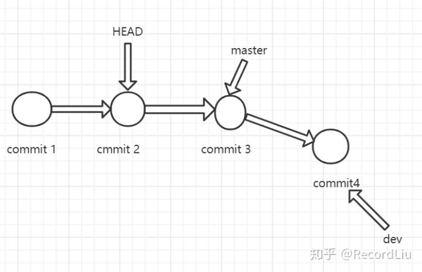
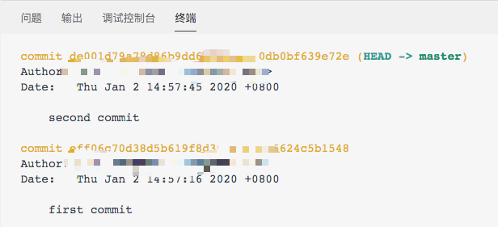
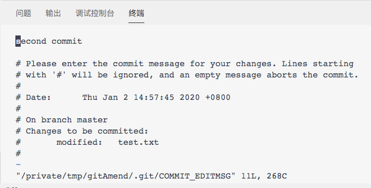
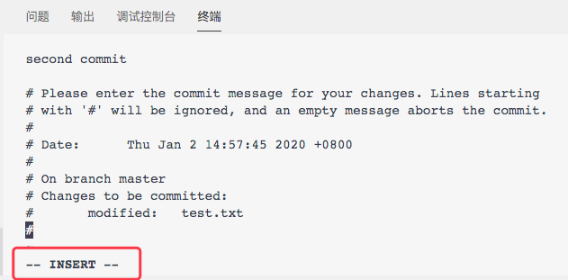
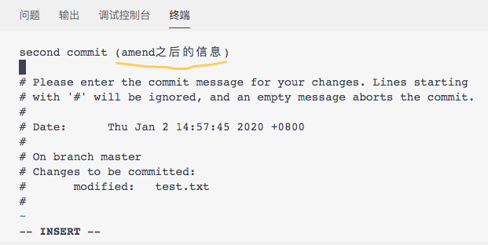
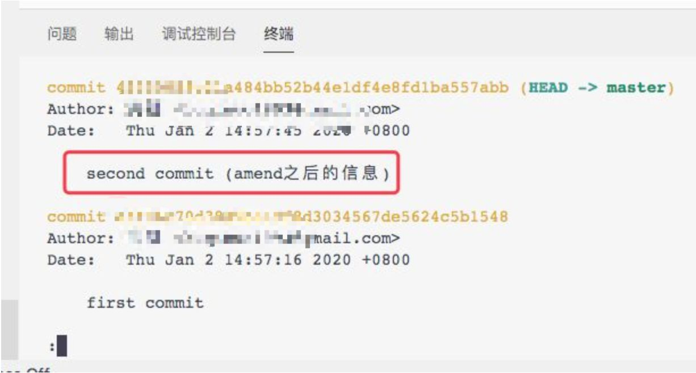
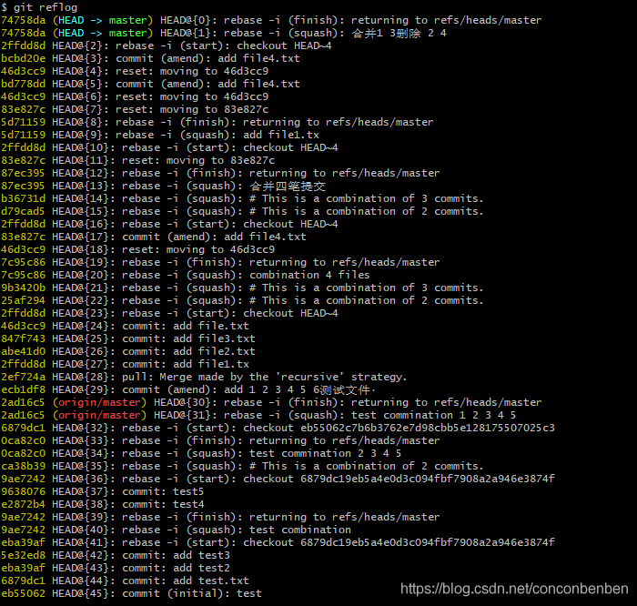
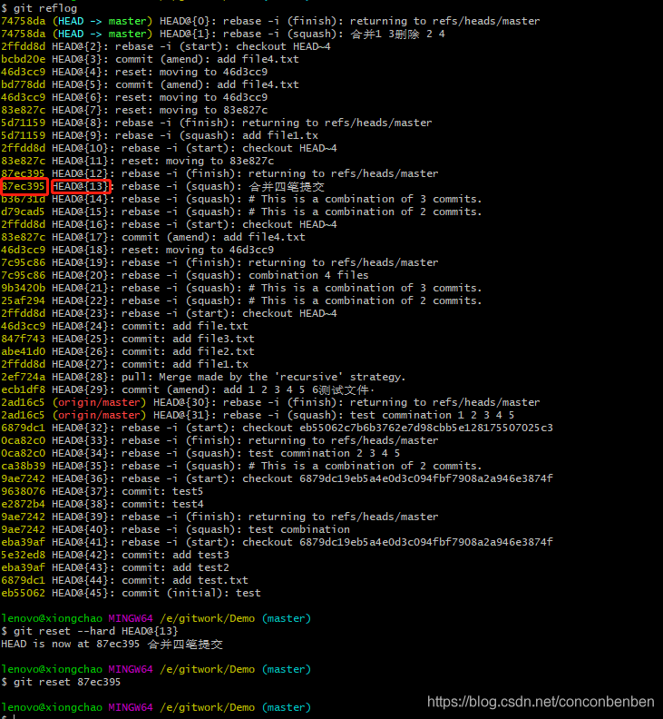

# GIT 专题

### git tag

* 列出标签  

```console
git tag
git tag -l "v1.8.5   // 模糊匹配
```

* 创建标签

Git 支持两种标签：**轻量标签（lightweight）与附注标签（annotated）**。

轻量标签很像一个不会改变的分支——它只是某个特定提交的引用。

而附注标签是存储在 Git 数据库中的一个完整对象， 它们是可以被校验的，其中包含打标签者的名字、电子邮件地址、日期时间， 此外还有一个标签信息，并且可以使用 GNU Privacy Guard （GPG）签名并验证。 通常会建议创建附注标签，这样你可以拥有以上所有信息。但是如果你只是想用一个临时的标签， 或者因为某些原因不想要保存这些信息，那么也可以用轻量标签。

* 附注标签

在 Git 中创建附注标签十分简单。 最简单的方式是当你在运行 `tag` 命令时指定 `-a` 选项：

```console
$ git tag -a v1.4 -m "my version 1.4"
```

### 共享标签

默认情况下，`git push` 命令并不会传送标签到远程仓库服务器上。 在创建完标签后你必须显式地推送标签到共享服务器上。 这个过程就像共享远程分支一样——你可以运行 `git push origin <tagname>`。

```console
$ git push origin v1.5
Counting objects: 14, done.
Delta compression using up to 8 threads.
Compressing objects: 100% (12/12), done.
Writing objects: 100% (14/14), 2.05 KiB | 0 bytes/s, done.
Total 14 (delta 3), reused 0 (delta 0)
To git@github.com:schacon/simplegit.git
 * [new tag]         v1.5 -> v1.5
```

如果想要一次性推送很多标签，也可以使用带有 `--tags` 选项的 `git push` 命令。 这将会把所有不在远程仓库服务器上的标签全部传送到那里。

```console
$ git push origin --tags
Counting objects: 1, done.
Writing objects: 100% (1/1), 160 bytes | 0 bytes/s, done.
Total 1 (delta 0), reused 0 (delta 0)
To git@github.com:schacon/simplegit.git
 * [new tag]         v1.4 -> v1.4
 * [new tag]         v1.4-lw -> v1.4-lw
```

现在，当其他人从仓库中克隆或拉取，他们也能得到你的那些标签。

| Note | `git push` 推送两种标签使用 `git push <remote> --tags` 推送标签并不会区分轻量标签和附注标签， 没有简单的选项能够让你只选择推送一种标签。 |
| ---- | ------------------------------------------------------------ |
|      |                                                              |

### 删除标签

要删除掉你本地仓库上的标签，可以使用命令 `git tag -d <tagname>`。 例如，可以使用以下命令删除一个轻量标签：

```console
$ git tag -d v1.4-lw
Deleted tag 'v1.4-lw' (was e7d5add)
```

注意上述命令并不会从任何远程仓库中移除这个标签，你必须用 `git push <remote> :refs/tags/<tagname>` 来更新你的远程仓库：

第一种变体是 `git push <remote> :refs/tags/<tagname>` ：

```console
$ git push origin :refs/tags/v1.4-lw
To /git@github.com:schacon/simplegit.git
 - [deleted]         v1.4-lw
```

上面这种操作的含义是，将冒号前面的空值推送到远程标签名，从而高效地删除它。

第二种更直观的删除远程标签的方式是：

```console
$ git push origin --delete <tagname>
```

### 检出标签

如果你想查看某个标签所指向的文件版本，可以使用 `git checkout` 命令， 虽然这会使你的仓库处于“分离头指针（detached HEAD）”的状态——这个状态有些不好的副作用：

```console
$ git checkout 2.0.0
Note: checking out '2.0.0'.

You are in 'detached HEAD' state. You can look around, make experimental
changes and commit them, and you can discard any commits you make in this
state without impacting any branches by performing another checkout.

If you want to create a new branch to retain commits you create, you may
do so (now or later) by using -b with the checkout command again. Example:

  git checkout -b <new-branch>

HEAD is now at 99ada87... Merge pull request #89 from schacon/appendix-final

$ git checkout 2.0-beta-0.1
Previous HEAD position was 99ada87... Merge pull request #89 from schacon/appendix-final
HEAD is now at df3f601... add atlas.json and cover image
```

在“分离头指针”状态下，如果你做了某些更改然后提交它们，标签不会发生变化， 但你的新提交将不属于任何分支，并且将无法访问，除非通过确切的提交哈希才能访问。 因此，如果你需要进行更改，比如你要修复旧版本中的错误，那么通常需要创建一个新分支：

```console
$ git checkout -b version2 v2.0.0
Switched to a new branch 'version2'
```

如果在这之后又进行了一次提交，`version2` 分支就会因为这个改动向前移动， 此时它就会和 `v2.0.0` 标签稍微有些不同，这时就要当心了。

### git 分离头指针

https://zhuanlan.zhihu.com/p/158635615

那究竟什么是分离头指针呢，**它指的是HEAD不指向任何分支，而指向某次提交。**我们用`git checkout commit2`,来分离头指针，让它指向commit2这次提交，现在git时间线模式如下：



这个时候git会在终端提示(以我电脑输出示例)

```text
git checkout 58df8b3
Note: checking out '58df8b3'.

You are in 'detached HEAD' state. You can look around, make experimental
changes and commit them, and you can discard any commits you make in this
state without impacting any branches by performing another checkout.

If you want to create a new branch to retain commits you create, you may
do so (now or later) by using -b with the checkout command again. Example:

  git checkout -b <new-branch-name>

HEAD is now at 58df8b3 Update 2020-04-11-Git分支操作命令.md
```

翻译过来就是，Git提示你现在处于“分离头指针状态”，你可以查看、并且做些代码调试，还可以提交他们，**在这种状态下，如果checkout到其他分支，完全可以丢弃在此基础上做的修改,而不会影响到其他分支。** 如果你想保留本次的修改，你可以使用”git checkout -b 新的分支名”来保留它(现在或者以后都可以)。

Git提示你现在处于“分离头指针状态”，你可以查看、并且做些代码调试，还可以提交他们，在这种状态下，如果checkout到其他分支，完全可以丢弃在此基础上做的修改,而不会影响到其他分支。 如果你想保留本次的修改，你可以使用”git checkout -b 新的分支名”来保留它(现在或者以后都可以)。

有时候我们不想为某次的修改单独创建一个分支，也没有想要提交到版本库的意思，只是做下调试，那么我们就可以使用git提供的分离头指针方法。如果发现真的有必要提交到版本库，还可以使用`git checkout -b`命令来为这次的提交新建一个分支，再把分支合并上去。

### git submodule 添加，更新与删除

>三、subm子仓库更新
>主工程依赖的字仓库更新了，主工程如何更新
>1、更新主仓库
>2、git submodule update --remote
>这样会将子仓库的更新拉取下来
>如果远程仓库有更新。

### git merge 解决冲突之后，输 git merge --continue ，不要 重新 add commit。


### [git merge的原理（递归三路合并算法）](https://segmentfault.com/a/1190000021712743)  讲得很通透

>
>
>

### h3[自定义 Git - Git 钩子???](https://git-scm.com/book/zh/v2/%E8%87%AA%E5%AE%9A%E4%B9%89-Git-Git-%E9%92%A9%E5%AD%90)

>

### [7.11 Git 工具 - 子模块](https://git-scm.com/book/zh/v2/Git-%E5%B7%A5%E5%85%B7-%E5%AD%90%E6%A8%A1%E5%9D%97)

>## 子模块
>
>有种情况我们经常会遇到：某个工作中的项目需要包含并使用另一个项目。也许是第三方库，或者你独立开发的，用于多个父项目的库。 现在问题来了：你想要把它们当做两个独立的项目，同时又想在一个项目中使用另一个。
>
>将一个已存在的 Git 仓库添加为正在工作的仓库的子模块:
>
>```console
>git submodule add https://github.com/chaconinc/DbConnector
>```
>
>如果这时运行 `git status`，你会注意到几件事。
>
>```console
>$ git status
>On branch master
>Your branch is up-to-date with 'origin/master'.
>
>Changes to be committed:
>(use "git reset HEAD <file>..." to unstage)
>
>	new file:   .gitmodules
>	new file:   DbConnector
>```
>
>首先应当注意到新的 `.gitmodules` 文件。 该配置文件保存了项目 URL 与已经拉取的本地目录之间的映射：
>
>```ini
>[submodule "DbConnector"]
>	path = DbConnector
>	url = https://github.com/chaconinc/DbConnector
>```
>
>如果有多个子模块，该文件中就会有多条记录。 要重点注意的是，该文件也像 `.gitignore` 文件一样受到（通过）版本控制。 它会和该项目的其他部分一同被拉取推送。 这就是克隆该项目的人知道去哪获得子模块的原因。
>
>如果你已经克隆了项目但忘记了 `--recurse-submodules`，那么可以运行 `git submodule update --init` 将 `git submodule init` 和 `git submodule update` 合并成一步。如果还要初始化、抓取并检出任何嵌套的子模块， 请使用简明的
>
>**`git submodule update --init --recursive`**

### [intelliJ IDEA版本控制时文件颜色代表的含义](https://www.jianshu.com/p/4ed962c86c05)

>### idea文件名颜色代表含义:
>
>绿色，已经加入版本控制暂未提交； add但没commit
>红色，未加入版本控制； 没有add
>蓝色，加入版本控制，已提交，有改动； add且commit
>白色，加入版本控制，已提交，无改动；
>黄色：版本控制已忽略文件。比如runtime文件，意思是不用git上去的文件

### [git stash 用法总结和注意点](https://www.cnblogs.com/zndxall/p/9586088.html)

>常用git stash命令：
>
>（1）**git stash** save "save message" : 执行存储时，添加备注，方便查找，只有git stash 也要可以的，但查找时不方便识别。
>
>（2）**git stash list** ：查看stash了哪些存储
>
>（3）**git stash show** ：显示做了哪些改动，默认show第一个存储,如果要显示其他存贮，后面加stash@{$num}，比如第二个 git stash show stash@{1}
>
>（4）**git stash show -p** : 显示第一个存储的改动，如果想显示其他存存储，命令：git stash show stash@{$num} -p ，比如第二个：git stash show stash@{1} -p
>
>（5）**git stash apply** :应用某个存储,但不会把存储从存储列表中删除，默认使用第一个存储,即stash@{0}，如果要使用其他个，git stash apply stash@{$num} ， 比如第二个：git stash apply stash@{1} 
>
>（6）**git stash pop** ：命令恢复之前缓存的工作目录，将缓存堆栈中的对应stash删除，并将对应修改应用到当前的工作目录下,默认为第一个stash,即stash@{0}，如果要应用并删除其他stash，命令：git stash pop stash@{$num} ，比如应用并删除第二个：git stash pop stash@{1}
>
>（7）**git stash drop** stash@{$num} ：丢弃stash@{$num}存储，从列表中删除这个存储
>
>（8）**git stash clear** ：删除所有缓存的stash

### [Could not restore untracked files from stash —— git stash -a 之后的事故处理](https://www.jianshu.com/p/efb9f2f1bd05)


### [Gerrit实践系列之-- refs/for/branch和refs/head/branch](https://www.jianshu.com/p/e58b382af0f3)

>#### git push时的refs/for/[branch_name]和refs/head/[branch_name]
>
>谈到git push时的refs/for/[branch_name]指令，其实它是[Gerrit](https://links.jianshu.com/go?to=https%3A%2F%2Fzh.wikipedia.org%2Fwiki%2FGerrit)工具的一种机制。简单的说，Gerrit为了保证每次代码提交都强制开启代码评审,要求研发人员在提交代码的时候统一使用:
>
>git push [REPO_NAME] HEAD:refs/for/[BRANCH_NAME]
>
>那么，再来说说refs/head/[BRANCH_NAME]，**和前面对应的，这条命令的意思就是提交代码，但是不开启代码评审。**

### [git rm与git rm --cached](https://www.cnblogs.com/toward-the-sun/p/6599656.html)

当我们需要删除`暂存区`或`分支`上的文件, 同时工作区也不需要这个文件了, 可以使用

```bash
1 git rm file_path
2 git commit -m 'delete somefile'
3 git push
```

当我们需要删除`暂存区`或`分支`上的文件, 但本地又需要使用, 只是不希望这个文件被版本控制, 可以使用。

```bash
git rm --cached file_path
git commit -m 'delete remote somefile'
git push
```

### [Git中tag标签的使用](https://blog.csdn.net/wei78008023/article/details/81866590)

### [2.6 Git 基础 - 打标签](https://git-scm.com/book/zh/v2/Git-%E5%9F%BA%E7%A1%80-%E6%89%93%E6%A0%87%E7%AD%BE)

### [git在工作中正确的使用方式----git rebase篇](https://blog.csdn.net/nrsc272420199/article/details/85555911)

>Git 操作
>假设Git目前只有一个分支master。开发人员的工作流程是
>
>git clone master branch
>在自己本地checkout -b local创建一个本地开发分支
>在本地的开发分支上开发和测试
>阶段性开发完成后（包含功能代码和单元测试），可以准备提交代码
>首先切换到master分支，git pull拉取最新的分支状态
>然后切回local分支
>**通过git rebase -i 将本地的多次提交合并为一个，以简化提交历史。本地有多个提交时,如果不进行这一步,在git rebase master时会多次解决冲突(最坏情况下,每一个提交都会相应解决一个冲突)**
>**git rebase master 将master最新的分支同步到本地，这个过程可能需要手动解决冲突(如果进行了上一步的话,只用解决一次冲突)**
>然后切换到master分支，git merge将本地的local分支内容合并到master分支
>git push将master分支的提交上传.

### [git rebase -i合并多次提交](https://blog.csdn.net/w57685321/article/details/86597808)

>简介
>在日常开发中，代码变更比较频繁，有时候想让前几次提交的合并为一次提交，这里可以使用git rebase -i 命令来完成，当然，git rebase命令不仅仅用于合并提交，它还有许多用处，比如可以使用git rebase onto将某一段commit粘贴到另一个分支上等等，这里主要介绍合并提交。
>
>命令介绍
>rebase为变基
>git rebase -i 命令可以压缩合并多次提交
>格式：git rebase -i [startpoint] [endpoint]
>
>其中-i的意思是–interactive，即弹出交互式的界面让用户编辑完成合并操作，[startpoint] [endpoint]则指定了一个编辑区间，如果不指定[endpoint]，则该区间的终点默认是当前分支HEAD所指向的commit(注：该区间指定的是一个前开后闭的区间)。
>
>在查看git的log后，可以使用如下命令
>
>```shell
>// 合并从当前head到15f745b(commit id)
>git rebase -i 15f745b
>或:
>// 合并最近的两次提交
>git rebase -i HEAD~2
>```
>
>执行这个命令后会跳到一个vi编辑器
>里面的提示有：
>pick：保留该commit（缩写:p）
>reword：保留该commit，但我需要修改该commit的注释（缩写:r）
>edit：保留该commit, 但我要停下来修改该提交(不仅仅修改注释)（缩写:e）
>squash：将该commit和前一个commit合并（缩写:s）
>fixup：将该commit和前一个commit合并，但我不要保留该提交的注释信息（缩写:f）
>exec：执行shell命令（缩写:x）
>drop：我要丢弃该commit（缩写:d）

### [git commit --amend 修改git提交记录用法详解](https://zhuanlan.zhihu.com/p/100243017)

>有时你提交过代码之后，发现一个地方改错了，你下次提交时不想保留上一次的记录；或者你上一次的commit message的描述有误，这时候你可以使用接下来的这个命令：git commit --amend。
>
>git功能十分强大，接下来我将讲解一下git commit --amend命令的用法~
>
>git log之后，可以看到你之前提交过的git历史：
>
>
>
>接下来，在bash里输入wq退出log状态，执行：
>
>```text
>$ git commit --amend
>```
>
>这时bash里会出现以下内容：
>
>
>
>其中，*second commit* 是你上次提交的描述，下面是一下说明信息，有告诉你上次提交的文件信息等等，可忽略。接下来你要是想修改描述信息的话。直接键入：i，此时进入了输入模式，变成这样子：
>
>
>
>可用键盘上下键转到描述所在的那一行，然后进行修改：
>
>
>
>修改完成后，按下 Esc键退出编辑模式，在键入 :wq 回车退出并保存修改，完成提交。这是你再git log 看一下提交日志：
>
>
>
>已经修改了提交描述信息，且原来的git版本没有了~喜大普奔！！
>但是有个地方要注意，就是该操作会改变你原来的commit id哦。

### [IDEA 中配置 Gerrit 插件以便快速操作](https://www.zifangsky.cn/1613.html)

### git 分支命名规范

>1. git 分支命名规范
>
>git 分支分为集成分支、功能分支和修复分支，分别命名为 develop、feature 和 hotfix，均为单数。不可使用 features、future、hotfixes、hotfixs 等错误名称。
>
>- master（主分支，永远是可用的稳定版本，不能直接在该分支上开发）
>- develop（开发主分支，所有新功能以这个分支来创建自己的开发分支，该分支只做只合并操作，不能直接在该分支上开发）
>- feature-xxx（功能开发分支，在develop上创建分支，以自己开发功能模块命名，功能测试正常后合并到develop分支）
>- feature-xxx-fix(功能bug修复分支，feature分支合并之后发现bug，在develop上创建分支修复，之后合并回develop分支。PS:feature分支在申请合并之后，未合并之前还是可以提交代码的，所以feature在合并之前还可以在原分支上继续修复bug)
>- hotfix-xxx（紧急bug修改分支，在master分支上创建，修复完成后合并到 master）
>
>注意事项：
>
>- 一个分支尽量开发一个功能模块，不要多个功能模块在一个分支上开发。
>- feature 分支在申请合并之前，最好是先 pull 一下 develop 主分支下来，看一下有没有冲突，如果有就先解决冲突后再申请合并。

### git reflog

https://blog.csdn.net/servermanage/article/details/103020846

>git-reflog 是用来恢复本地错误操作很重要的一个命令。
>
>命令：git reflog.
>
>代码运行效果截图如下：
>
>
>
>说明：
>
>（0）.最左侧黄色字体列为修改的commit的前7位，根据7位可以将代码恢复到对应节点位置。
>
>（1）.{n}表示HEAD更改历史记录，最近的操作在上面。
>
>（2）.通过HEAD{n}语法可以引用存在reflog中的提交。
>
>（3）.与HEAD~n功能类似，但HEAD{n}引用的是reflog记录中的commit提交，而HEAD~n引用是commit提交历史记录。
>
>（4）.rebase commit等为git操作与提交节点相关的具体指令。
>
>（5）.最后一个冒号后面的字串为提交信息的摘要信息。
>
>例如：我们需要把代码回退到HEAD@{13}处，我们可以执行：
>
>git reset --hard HEAD@{13}
>
>或者：git reset --hard 87ec395
>
>87ec395为HEAD@{13}对应的7位commit id 
>
>执行结果如下：
>
>
>
>更多:git相关实战技巧：git commit操作进阶
>————————————————
>版权声明：本文为CSDN博主「IT_熊」的原创文章，遵循CC 4.0 BY-SA版权协议，转载请附上原文出处链接及本声明。
>原文链接：https://blog.csdn.net/servermanage/article/details/103020846

### [git checkout -b dev origin/dev详解](https://zhuanlan.zhihu.com/p/84855994)

>一般来说
>
>在目录下用git clone git@github.com:xxxxx/yyyyy.git
>
>接着要查看下本地的当前分支嘛
>
>git branch
>
>你会看到你在master分支下
>
>这个时候往往会用git checkout -b dev origin/dev这个命令
>
>它意思是说.切换到dev分支上,接着跟**远程的origin地址上的dev分支关联起来**,这里要注意origin代表是一个路径,可以用git remote -v 查看
>
>说来白了,origin/dev有点像是git@github.com:xxxxx/yyyyy.git/dev

### git 删除分支

- **删除本地分支**
  git branch -d dev 【git branch -参数 本地分支名称】
- **删除远程分支**
  git push origin --delete dev 【git push origin --参数 远程分支名称】

### [git cherry-pick 教程](http://www.ruanyifeng.com/blog/2020/04/git-cherry-pick.html)

>对于多分支的代码库，将代码从一个分支转移到另一个分支是常见需求。
>
>这时分两种情况。一种情况是，你需要另一个分支的所有代码变动，那么就采用合并（`git merge`）。另一种情况是，你只需要部分代码变动（某几个提交），这时可以采用 Cherry pick。

# 