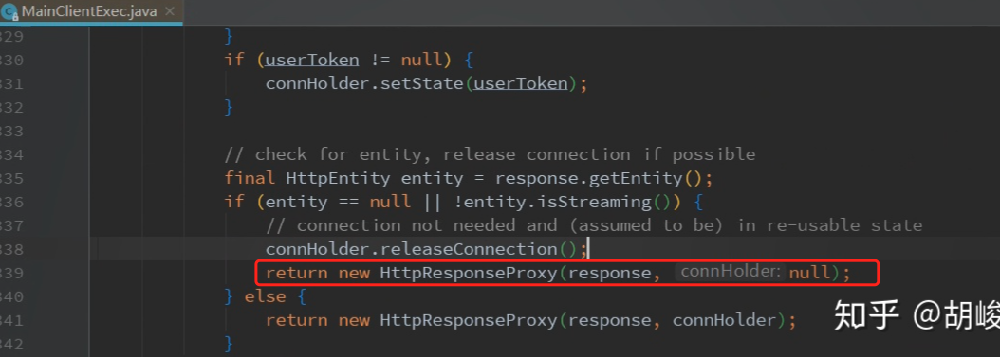
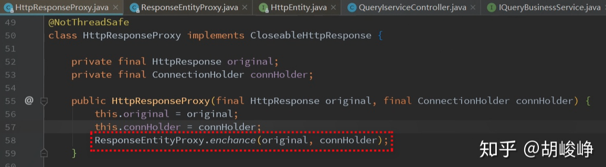

## httpclient

### [总结httpclient资源释放和连接复用](https://www.cnblogs.com/pyx0/p/13125960.html)  有具体的实验过程，讲得很详细。

>#### 二、连接复用
>
>根据 http 协议 1.1 版本，各个 web 服务器都默认支持 keepalive，因此当 http 请求正常完成后，服务器不会主动关闭 tcp（直到空闲超时或数量达到上限），使连接会保留一段时间，前面我们也知道 httpclient 在判断可以 keepalive 后，即使调用了 close 也不会关闭 tcp 连接（可以认为 release 到连接池）。为了管理这些保留的连接，以及方便 api 调用，一般设置一个全局的连接池，并基于该连接池提供 httpclient 实例，这样就不需要考虑维护 httpclient 实例生命周期，随用随取（方便状态管理？），此外考虑到 http 的单路性，一个请求响应完成结束后，该连接才可以再次复用，因此连接池的最大连接数决定了并发处理量，该配置也是一种保护机制，超出上限的请求会被阻塞，也可以配合熔断组件使用，当服务方慢、或不健康时熔断降级。
>
>最后还有一个问题，观察到 keepalive 的 tcp 连接过一段时间后会变成如下状态：
>
>```shell
># netstat -n | grep tcp4 | grep 8080
>tcp4       0      0  127.0.0.1.8080         127.0.0.1.51866        FIN_WAIT_2
>tcp4       0      0  127.0.0.1.51866        127.0.0.1.8080         CLOSE_WAIT
>```
>
>可以看出服务器经过一段时间，认为该连接空闲，因此主动关闭，收到对方响应后进入 FIN_WAIT_2 状态（等待对方也发起关闭），而客户端进入 CLOSE_WAIT 状态后却不再发起自己这一方的关闭请求，这时双方处于半关闭。官方文档解释如下：
>
>> One of the major shortcomings of the classic blocking I/O model is that the network socket can react to I/O events only when blocked in an I/O operation. When a connection is released back to the manager, it can be kept alive however it is unable to monitor the status of the socket and react to any I/O events. If the connection gets closed on the server side, the client side connection is unable to detect the change in the connection state (and react appropriately by closing the socket on its end).
>
>这需要有定期主动做一些检测和关闭动作，从这个角度考虑，默认配置产生的 HttpClient 没有这一功能，不应该用于生产环境，下面这个监控线程可以完成该工作，包含它的完整的 HttpUtil 从文章最后连接获取。
>
>```java
>public static class IdleConnectionMonitorThread extends Thread {
>
> private final HttpClientConnectionManager connMgr;
> private volatile boolean shutdown;
>
> public IdleConnectionMonitorThread(HttpClientConnectionManager connMgr) {
>   super();
>   this.connMgr = connMgr;
> }
>
> @Override
> public void run() {
>   try {
>     while (!shutdown) {
>       synchronized (this) {
>         wait(30 * 1000);
>         // Close expired connections
>         connMgr.closeExpiredConnections();
>         // Optionally, close connections
>         // that have been idle longer than 30 sec
>         connMgr.closeIdleConnections(30, TimeUnit.SECONDS);
>       }
>     }
>   } catch (InterruptedException ex) {
>     // terminate
>   }
> }
>```

>

### [HTTP协议的Keep-Alive 模式](https://www.jianshu.com/p/49551bda6619)  http 协议中的 keep-alive、长连接、短连接概念，http1.0 、http1.1、http2.0 版本的区别 讲得很清楚

># Keep-Alive模式
>
>由上面的示例可以看到里面的请求头部和响应头部都有一个key-value`Connection: Keep-Alive`，这个键值对的作用是让HTTP保持连接状态，因为HTTP 协议采用“请求-应答”模式，当使用普通模式，即非 Keep-Alive 模式时，每个请求/应答客户和服务器都要新建一个连接，完成之后立即断开连接（HTTP 协议为无连接的协议）；当使用 Keep-Alive 模式时，**Keep-Alive 功能使客户端到服务器端的连接持续有效**。
>
>在HTTP 1.1版本后，默认都开启Keep-Alive模式，只有加入加入 `Connection: close`才关闭连接，当然也可以设置Keep-Alive模式的属性，例如 `Keep-Alive: timeout=5, max=100`，表示这个TCP通道可以保持5秒，max=100，表示这个长连接最多接收100次请求就断开。
>
>### Keep-Alive模式下如何知道某一次数据传输结束
>
>如果不是Keep-Alive模式，HTTP协议中客户端发送一个请求，服务器响应其请求，返回数据。服务器通常在发送回所请求的数据之后就关闭连接。这样客户端读数据时会返回EOF（-1），就知道数据已经接收完全了。
>但是如果开启了 Keep-Alive模式，那么客户端如何知道某一次的响应结束了呢？
>
>**以下有两个方法**
>
>- 如果是静态的响应数据，可以通过判断响应头部中的Content-Length 字段，判断数据达到这个大小就知道数据传输结束了。
>- 但是返回的数据是动态变化的，服务器不能第一时间知道数据长度，这样就没有 Content-Length 关键字了。这种情况下，服务器是分块传输数据的，`Transfer-Encoding：chunk`，这时候就要根据传输的数据块chunk来判断，数据传输结束的时候，最后的一个数据块chunk的长度是0。
>
># TCP的Keep Alive
>
>**HTTP的Keep-Alive与TCP的Keep Alive，有些不同，两者意图不一样。前者主要是 TCP连接复用，避免建立过多的TCP连接。而TCP的Keep Alive的意图是在于保持TCP连接的存活，就是发送心跳包。隔一段时间给连接对端发送一个探测包，如果收到对方回应的 ACK，则认为连接还是存活的，在超过一定重试次数之后还是没有收到对方的回应，则丢弃该 TCP 连接。**
>
># 短连接
>
>**所谓短连接，及连接只保持在数据传输过程，请求发起，连接建立，数据返回，连接关闭。它适用于一些实时数据请求，配合轮询来进行新旧数据的更替。**
>
># 长连接
>
>长连接便是在连接发起后，**在请求关闭连接前客户端与服务端都保持连接，实质是保持这个通信管道，之后便可以对其进行复用。**
>它适用于涉及消息推送，请求频繁的场景（直播，流媒体）。连接建立后，在该连接下的所有请求都可以重用这个长连接管道，避免了频繁了连接请求，提升了效率。
>
># 使用HTTP建立长连接
>
>当需要建立 HTTP 长连接时，HTTP 请求头将包含如下内容：
>`Connection: Keep-Alive`
>如果服务端同意建立长连接，HTTP 响应头也将包含如下内容：
>`Connection: Keep-Alive`
>当需要关闭连接时，HTTP 头中会包含如下内容：
>`Connection: Close`
>
># HTTP版本区别
>
>### HTTP/1.0与HTTP/1.1
>
>主要体现在长连接与部分发送上面
>
>- 在 HTTP/1.0 时代，每一个请求都会重新建立一个 TCP 连接，一旦响应返回，就关闭连接，这种就是短连接，HTTP/1.1版本就支持Keep-Alive 模式，实现长连接了。
>- HTTP 1.1支持只发送header信息(不带任何body信息)，如果服务器认为客户端有权限请求服务器，则返回100，否则返回401。客户端如果接受到100，才开始把请求body发送到服务器。这样当服务器返回401的时候，客户端就可以不用发送请求body了，节约了带宽。
>
>### HTTP/1.1 与HTTP/2.0
>
>主要体现在多路复用上面。
>
>- HTTP2.0使用了多路复用的技术，做到同一个连接并发处理多个请求，而且并发请求的数量比HTTP1.1大了好几个数量级。当然HTTP1.1也可以多建立几个TCP连接，来支持处理更多并发的请求，但是创建TCP连接本身也是有开销的。
>- 支持header数据压缩
>- 支持服务器推送

### **[httpclient参数配置](https://cloud.tencent.com/developer/article/1339986)**   httpclient需要配置哪些关键参数，以及各个参数的含义、配置的原因。讲得非常好，全面

>

### [HttpClient连接池的一些思考](https://zhuanlan.zhihu.com/p/85524697)   对httpclient 的工作原理，源码的解释很清楚

>### MainClientExec处理连接
>
>处理完请求后，获取到response，通过**ConnectionReuseStrategy**判断连接是否可重用，如果是通过**ConnectionKeepAliveStrategy**获取到连接最长有效时间，并设置连接可重用标记。
>
>## 连接释放原理分析
>
>HttpClientBuilder 会构建一个 InternalHttpClient 实例，也是CloseableHttpClient实例。InternalHttpClient的doExecute方法来完成一次request的执行。
>
>会继续调用MainClientExec的execute方法，通过连接池管理者获取连接（HttpClientConnection）。
>
>请求执行完返回HttpResponse类型对象，然后包装成HttpResponseProxy对象（是CloseableHttpResponse实例）返回。
>
>
>
>CloseableHttpClient类**其中一个execute方法**如下，finally方法中会调用HttpResponseProxy对象的close方法释放连接。
>
>最终调用ConnectionHolder的releaseConnection方法释放连接。
>
>CloseableHttpClient类**另一个execute方法**如下，返回一个HttpResponseProxy对象（是CloseableHttpResponse实例）。
>
>**这种情况下调用者获取了HttpResponseProxy对象，可以直接拿到HttpEntity对象。大家关心的就是操作完HttpEntity对象，使用完InputStream到底需不需要手动关闭流呢？**（不用手动关闭流，再看看源码，深入理解）
>
>其实调用者不需要手动关闭流，因为HttpResponseProxy构造方法里有增强HttpEntity的处理方法，如下。
>
>
>
>调用者最终拿到的HttpEntity对象是ResponseEntityProxy实例。
>
>ResponseEntityProxy重写了获取InputStream的方法，返回的是EofSensorInputStream类型的InputStream对象。
>
>EofSensorInputStream对象每次读取都会调用checkEOF方法，判断是否已经读取完毕。
>
>checkEOF方法会调用ResponseEntityProxy（实现了EofSensorWatcher接口）对象的eofDetected方法。
>
>EofSensorWatcher#eofDetected方法中会释放连接并关闭流。
>
>**综上，通过CloseableHttpClient实例处理请求，无需调用者手动释放连接。**
>
>## 总结
>
>Apache的HttpClient组件可谓良心之作，细细的品味一下源码可以学到很多设计模式和比编码规范。不过在阅读源码之前最好了解一下**不同版本的HTTP协议，尤其是HTTP协议的Keep-Alive模式**。使用Keep-Alive模式（又称持久连接、连接重用）时，Keep-Alive功能使客户端到服 务器端的连接持续有效，当出现对服务器的后继请求时，Keep-Alive功能避免了建立或者重新建立连接。这里推荐一篇参考链接：[https://www.jianshu.com/p/49551bda6619](https://link.zhihu.com/?target=https%3A//www.jianshu.com/p/49551bda6619)。


------------------


### [HttpClient连接池设置引发的一次雪崩](https://blog.csdn.net/aaa31203/article/details/104687886)   排查问题的过程有点价值

> 这篇文章排查问题的过程有点价值。


### [异步httpclient(httpasyncclient)的使用与总结](https://blog.csdn.net/ouyang111222/article/details/78884634)

>### 1. 前言
>
>应用层的网络模型有同步与异步。同步意味当前线程是阻塞的，只有本次请求完成后才能进行下一次请求;异步意味着所有的请求可以同时塞入缓冲区,不阻塞当前的线程;
>
>httpclient在4.x之后开始提供基于nio的异步版本 httpasyncclient, httpasyncclient借助了Java并发库和nio进行封装(虽说NIO是同步非阻塞IO,但是HttpAsyncClient提供了回调的机制,与netty类似,所以可以模拟类似于AIO的效果),其调用方式非常便捷,但是其中也有许多需要注意的地方。

### [HttpClient Quick Start](http://hc.apache.org/httpcomponents-client-5.1.x/quickstart.html)  官网

>- The same requests can be executed using a simpler, albeit less flexible, fluent API.
>
> ```java
> // The fluent API relieves the user from having to deal with manual deallocation of system
> // resources at the cost of having to buffer response content in memory in some cases.
>
> Request.Get("http://targethost/homepage")
>     .execute().returnContent();
> Request.Post("http://targethost/login")
>     .bodyForm(Form.form().add("username",  "vip").add("password",  "secret").build())
>     .execute().returnContent();
> ```
>
> * The below code fragment illustrates the execution of HTTP requests using HttpClient async API.
>
>```java
>try (CloseableHttpAsyncClient httpclient = HttpAsyncClients.createDefault()) {
>   // Start the client
>   httpclient.start();
>
>   // Execute request
>   SimpleHttpRequest request1 = SimpleHttpRequests.get("http://httpbin.org/get");
>   Future<SimpleHttpResponse> future = httpclient.execute(request1, null);
>   // and wait until response is received
>   SimpleHttpResponse response1 = future.get();
>   System.out.println(request1.getRequestUri() + "->" + response1.getCode());
>
>   // One most likely would want to use a callback for operation result
>   CountDownLatch latch1 = new CountDownLatch(1);
>   SimpleHttpRequest request2 = SimpleHttpRequests.get("http://httpbin.org/get");
>   httpclient.execute(request2, new FutureCallback<SimpleHttpResponse>() {
>
>       @Override
>       public void completed(SimpleHttpResponse response2) {
>           latch1.countDown();
>           System.out.println(request2.getRequestUri() + "->" + response2.getCode());
>       }
>
>       @Override
>       public void failed(Exception ex) {
>           latch1.countDown();
>           System.out.println(request2.getRequestUri() + "->" + ex);
>       }
>
>       @Override
>       public void cancelled() {
>           latch1.countDown();
>           System.out.println(request2.getRequestUri() + " cancelled");
>       }
>
>   });
>   latch1.await();
>
>   // In real world one most likely would want also want to stream
>   // request and response body content
>   CountDownLatch latch2 = new CountDownLatch(1);
>   AsyncRequestProducer producer3 = AsyncRequestBuilder.get("http://httpbin.org/get").build();
>   AbstractCharResponseConsumer<HttpResponse> consumer3 = new AbstractCharResponseConsumer<HttpResponse>() {
>
>       HttpResponse response;
>
>       @Override
>       protected void start(HttpResponse response, ContentType contentType) throws HttpException, IOException {
>           this.response = response;
>       }
>
>       @Override
>       protected int capacityIncrement() {
>           return Integer.MAX_VALUE;
>       }
>
>       @Override
>       protected void data(CharBuffer data, boolean endOfStream) throws IOException {
>           // Do something useful
>       }
>
>       @Override
>       protected HttpResponse buildResult() throws IOException {
>           return response;
>       }
>
>       @Override
>       public void releaseResources() {
>       }
>
>   };
>   httpclient.execute(producer3, consumer3, new FutureCallback<HttpResponse>() {
>
>       @Override
>       public void completed(HttpResponse response3) {
>           latch2.countDown();
>           System.out.println(request2.getRequestUri() + "->" + response3.getCode());
>       }
>
>       @Override
>       public void failed(Exception ex) {
>           latch2.countDown();
>           System.out.println(request2.getRequestUri() + "->" + ex);
>       }
>
>       @Override
>       public void cancelled() {
>           latch2.countDown();
>           System.out.println(request2.getRequestUri() + " cancelled");
>       }
>
>   });
>   latch2.await();
>
>}
>```

### [HttpClient Examples (Classic)](http://hc.apache.org/httpcomponents-client-5.1.x/examples.html) 官网

### [HttpClient 三种 Http Basic Authentication 认证方式](https://blog.csdn.net/z694644032/article/details/100532526)


### [简单利用PoolingHttpClientConnectionManager来优化HttpClient方法，避免httpclient导致的排队堆积从而引发java.net.SocketException: Network is unreachable (connect failed)](https://www.cnblogs.com/zhuyu20/p/14165621.html)   ???

>

### httpClient 能复用吗？??

[httpClient可以复用吗？](https://www.imooc.com/wenda/detail/556925)

[总结httpclient资源释放和连接复用](https://www.cnblogs.com/pyx0/p/13125960.html)   详细

># Httpclient.close
>
>httpclient.close 会彻底关闭 httpclient 实例的连接池，以及其中所有连接，一般情况下，只有在关闭应用时调用以释放资源。

### [Spring boot集成httpclient](https://blog.csdn.net/weixin_40706319/article/details/90447435) 理论讲得很好

>二、HttpClient中的http持久连接
>2.1 HttpClient连接池的原理：
>当有连接第一次使用的时候建立连接；
>结束时对应连接不关闭，归还到池中；
>下次同个目的的连接可从池中获取一个可用连接；
>定期清理过期连接；
>2.2 HttpClient连接池的实现
>HttpClient通过连接池来管理持久连接，连接池分为两个，一个是总连接池，一个是每个route对应的连接池
>HttpClient通过异步的Future<CPoolEntry>来获取一个池化的连接
>默认连接重用策略与HTTP协议约束一致，根据response先判断Connection:Close则关闭，在判断Connection:Keep-Alive则开启，最后版本大于1.0则开启
>只有在HttpClientBuilder中手动开启了清理过期与空闲连接的开关后，才会清理连接池中的连接
>HttpClient4.4之后的版本通过一个死循环线程清理过期与空闲连接，该线程每次执行都sleep一会，以达到定期执行的效果
>2.3 HttpClient对持久连接的复用
>如果request首部中包含Connection:Close，不复用
>如果response中Content-Length长度设置不正确，不复用
>如果response首部包含Connection:Close，不复用
>如果reponse首部包含Connection:Keep-Alive，复用
>都没命中的情况下，如果HTTP版本高于1.0则复用
>2.4 HttpClient清理过期连接
>只有在HttpClientBuilder手动设置后，才会开启清理过期与空闲连接
>手动设置后，会启动一个线程死循环执行，每次执行sleep一定时间，调用HttpClientConnectionManager的清理方法清理过期与空闲连接。
>————————————————
>版权声明：本文为CSDN博主「weixin_40706319」的原创文章，遵循CC 4.0 BY-SA版权协议，转载请附上原文出处链接及本声明。
>原文链接：https://blog.csdn.net/weixin_40706319/article/details/90447435

### [SpringBoot集成HttpClient](https://blog.csdn.net/wanghaoalain/article/details/103988606)

