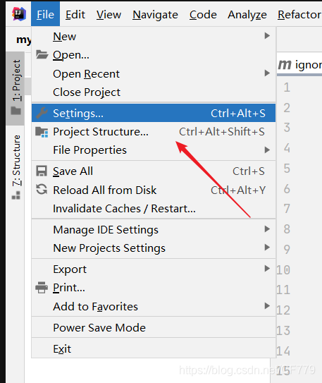
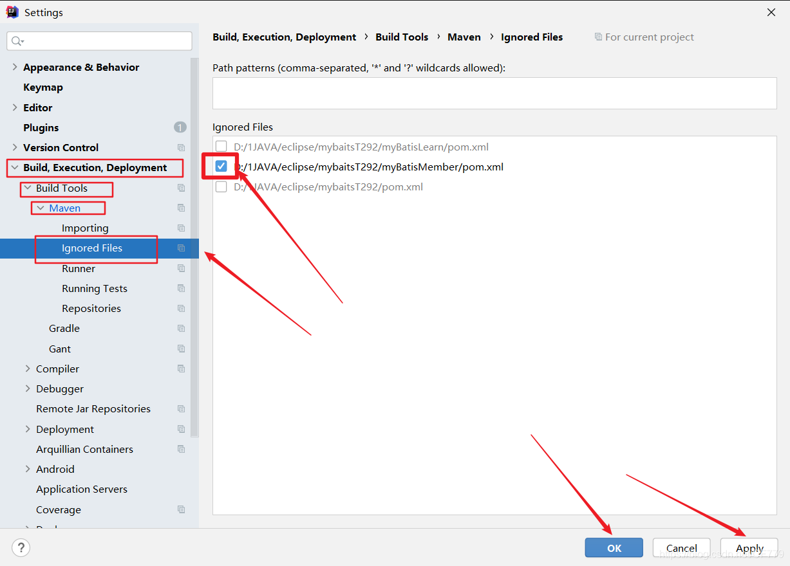
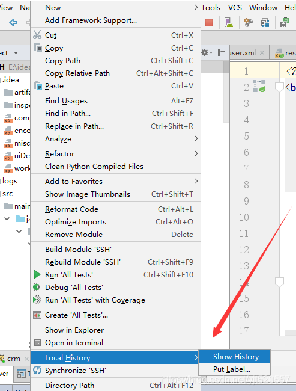
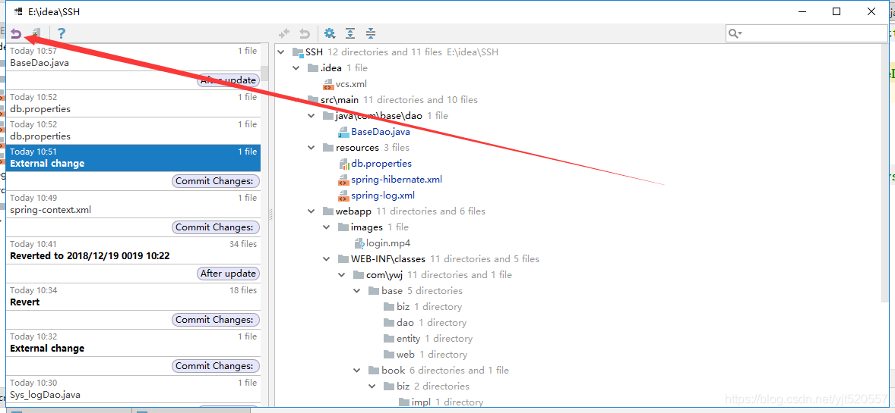

# idea 专题

## IDEA添加子Module的正确姿势

https://blog.csdn.net/jwcxs_m/article/details/82260483

## 关于Maven创建module弹出被忽略(Ignored)的Ignored pom.xml文件如何解决

https://blog.csdn.net/CF779/article/details/112269347

>您的小可爱在Maven创建module时，因为初次接触，没有正确建好module所以把它删掉了！又创建了一个之前删除了的**同名的module名称**。但是，却弹出被忽略(Ignored)的Ignored pom.xml文件，如图：
>
>**问题分析：**
>
>- 由于相同名称的module在之前被创建过，因此在IDEA中留有痕迹。重新创建一个新的同名module会让IDEA误以为是之前被删除掉的module，所以才自动将这个pom.xml文件忽略了呢。
>
>**解决方案：**
>
>1. 点击**file > Setting**进入设置
>     
>2. 找到**lgnored file**，**把右边已选中的选项取消勾选**，然后点击 ok
>     
>3. 建议再点击右上角Maven中的刷新一下，这样pom.xml 文件就被变回来了哦

## idea for Mac try catch 快捷键

option+command+t

## [解决了一个IDA编译代码时maven总是自动执行单元测试的问题](https://www.cnblogs.com/kingstarer/p/13977933.html)

通过debug日志分析，我发现选中“闪电”按钮，idea编译时，是给代码增加一个-DskipTests=true的参数。

>该篇文章个别地方说得不准确：
>
>-DskipTests，不执行测试用例，但编译测试用例类生成相应的class文件至target/test-classes下。该配置命令行优先级>pom配置的优先级。
>
>-Dmaven.test.skip=true，不执行测试用例，也不编译测试用例类。**该配置 pom 中的配置优先级>mvn 命令行的优先级。**

## idea项目误删恢复

https://blog.csdn.net/yjt520557/article/details/85095883

因为idea有历史记录的功能所以你对于项目的操作都有记录所以可以选择回退

首先项目右键选择local history ->Show history 

然后 选择你误操作之前的版本，然后点击返回就会恢复了

