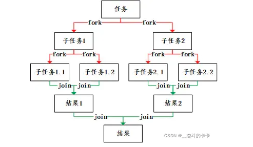
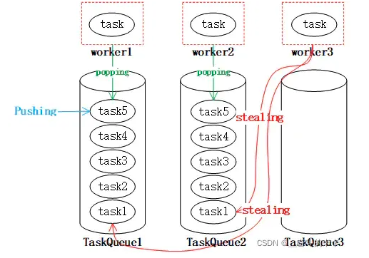
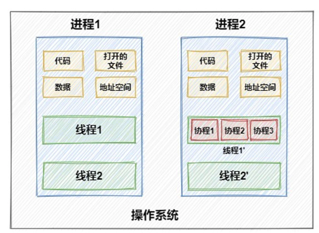
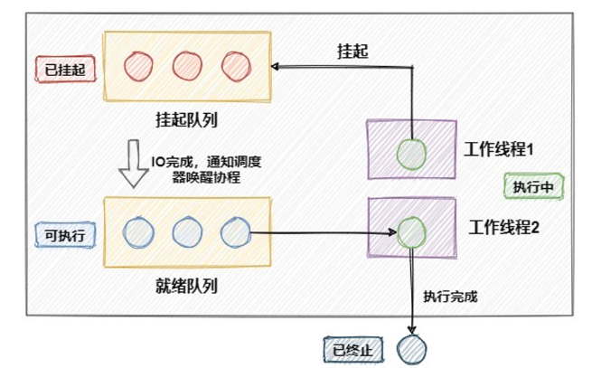
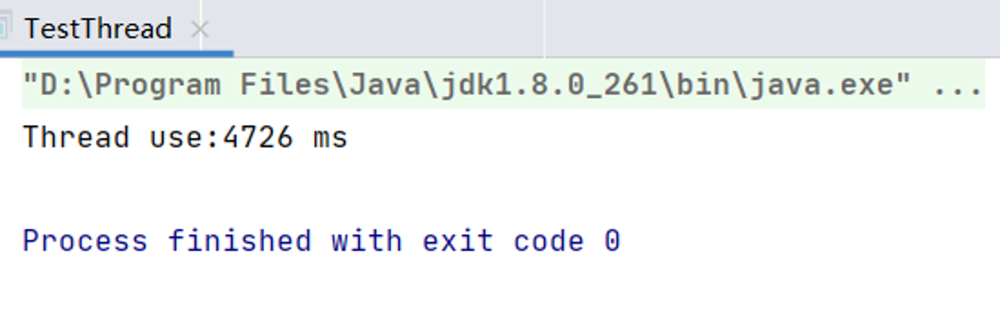
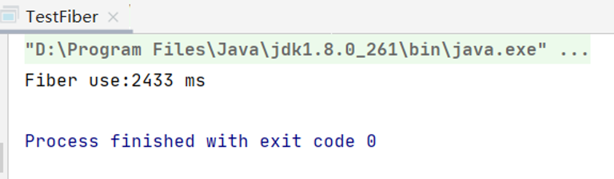
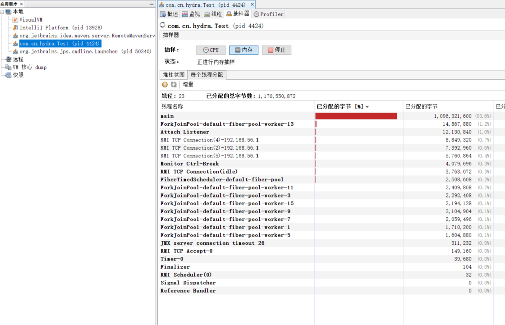

# java 线程池学习笔记

Alibaba命名规范的解释：

【强制】线程池不允许使用 Executors 去创建，而是通过 ThreadPoolExecutor 的方式，这样 的处理方式让写的同学更加明确线程池的运行规则，规避资源耗尽的风险。 说明： Executors 返回的线程池对象的弊端如下： 1） FixedThreadPool 和 SingleThreadPool : 允许的请求队列长度为 Integer.MAX_VALUE ，可能会堆积大量的请求，从而导致 OOM 。 2） CachedThreadPool 和 ScheduledThreadPool : 允许的创建线程数量为 Integer.MAX_VALUE ，可能会创建大量的线程，从而导致 OOM 。

文章笔记

## 1.  [一次Java线程池误用引发的血案和总结](https://zhuanlan.zhihu.com/p/32867181)

### （1）线程池工作流程、常用参数：


线程池内的线程数的大小相关的概念有两个，**一个是核心池大小，还有最大池大小。如果当前的线程个数比核心池个数小，当任务到来，会优先创建一个新的线程并执行任务。当已经到达核心池大小，则把任务放入队列，为了资源不被耗尽，队列的最大容量可能也是有上限的，如果达到队列上限则考虑继续创建新线程执行任务，如果此刻线程的个数已经到达最大池上限，则考虑把任务丢弃。**

``` java
public ThreadPoolExecutor(int corePoolSize,
                              int maximumPoolSize,
                              long keepAliveTime,
                              TimeUnit unit,
                              BlockingQueue<Runnable> workQueue,
                              ThreadFactory threadFactory,
                              RejectedExecutionHandler handler) {
} 
```

***corePoolSize***- 核心池大小，既然如前原理部分所述。需要注意的是在初创建线程池时线程不会立即启动，直到有任务提交才开始启动线程并逐渐时线程数目达到corePoolSize。若想一开始就创建所有核心线程需调用prestartAllCoreThreads方法。

***maximumPoolSize***-池中允许的最大线程数。需要注意的是当***核心线程满且阻塞队列也满时***才会判断当前线程数是否小于最大线程数，并决定***是否创建新线程***。

***keepAliveTime*** - **当线程数大于核心时，多于的空闲线程最多存活时间**

***unit*** - keepAliveTime 参数的时间单位。

***workQueue*** - **当线程数目超过核心线程数时用于保存任务的队列。**主要有3种类型的BlockingQueue可供选择：无界队列，有界队列和同步移交。将在下文中详细阐述。从参数中可以看到，此队列仅保存实现Runnable接口的任务。 别看这个参数位置很靠后，但是真的很重要，因为楼主的坑就因这个参数而起，这些细节有必要仔细了解清楚。

***threadFactory*** - 执行程序创建新线程时使用的工厂。

***handler*** - 阻塞队列已满且线程数达到最大值时所采取的饱和策略。java默认提供了4种饱和策略的实现方式：中止、抛弃、抛弃最旧的、调用者运行。将在下文中详细阐述。

### （2）BlockingQueue详解

* **无界队列**  队列大小无限制，常用的为无界的 ***LinkedBlockingQueue***，使用该队列做为阻塞队列时要尤其当心，当任务耗时较长时可能会导致大量新任务在队列中堆积最终导致OOM。阅读代码发现，Executors.newFixedThreadPool 采用就是 LinkedBlockingQueue.
* **有界队列** 常用的有两类，一类是遵循FIFO原则的队列如ArrayBlockingQueue与有界的LinkedBlockingQueue，另一类是优先级队列如PriorityBlockingQueue。PriorityBlockingQueue中的优先级由任务的Comparator决定。
  使用有界队列时队列大小需和线程池大小互相配合，线程池较小有界队列较大时可减少内存消耗，降低cpu使用率和上下文切换，但是可能会限制系统吞吐量。

* **同步移交队列** 如果不希望任务在队列中等待而是希望将任务直接移交给工作线程，可使用 **SynchronousQueue** 作为等待队列。SynchronousQueue 不是一个真正的队列，而是一种线程之间移交的机制。要将一个元素放入SynchronousQueue中，必须有另一个线程正在等待接收这个元素。

### (3) 可选择的饱和策略 RejectedExecutionHandler 详解

* **AbortPolicy中止策略**   

``` java
public void rejectedExecution(Runnable r, ThreadPoolExecutor e) {
            throw new RejectedExecutionException("Task " + r.toString() +
                                                 " rejected from " +
                                                 e.toString());
 } 
```

使用该策略时在饱和时会抛出RejectedExecutionException（继承自RuntimeException），调用者可捕获该异常自行处理。

* **DiscardPolicy抛弃策略** 

``` java
public void rejectedExecution(Runnable r, ThreadPoolExecutor e) {
}
```

如代码所示，不做任何处理直接抛弃任务

* **DiscardOldestPolicy抛弃旧任务策略**

``` java
public void rejectedExecution(Runnable r, ThreadPoolExecutor e) {
            if (!e.isShutdown()) {
                e.getQueue().poll();
                e.execute(r);
            }
} 
```

如代码，先将阻塞队列中的头元素出队抛弃，再尝试提交任务。如果此时阻塞队列使用 PriorityBlockingQueue 优先级队列，将会导致优先级最高的任务被抛弃，因此**不建议将该种策略配合优先级队列使用。** 

* **CallerRunsPolicy调用者运行** 

``` java
public void rejectedExecution(Runnable r, ThreadPoolExecutor e) {
            if (!e.isShutdown()) {
                r.run();
            }
} 
```

既不抛弃任务也不抛出异常，直接运行任务的run方法，换言之将任务回退给调用者来直接运行。使用该策略时***线程池饱和后将由调用线程池的主线程自己来执行任务，因此在执行任务的这段时间里主线程无法再提交新任务，从而使线程池中工作线程有时间将正在处理的任务处理完成***。


## 2. [Java线程组](https://www.jianshu.com/p/307888c32daf)


## ForkJoinPool

### 【第十五篇】ForkJoinPool 的使用及基本原理【重点】 

https://blog.csdn.net/weixin_42039228/article/details/123206215

关键点：**分治法、工作窃取**

>## 分治法
>
>其主旨是 **将大任务分成若干小任务，之后再并行对这些小任务进行计算，最终汇总这些任务的结果**。 得到最终的结果。
>
>此外，**ForkJoinPool 采取工作窃取算法，以避免工作线程由于拆分了任务之后的join等待过程**。这样**处于空闲的工作线程将从其他工作线程的队列中主动去窃取任务来执行**。这里涉及到的两个基本知识点是**分治法和工作窃取**。
>
>​       分治法的基本思想是一个规模为N的问题分解为K个规模较小的子问题，这些子问题的相互独立且与原问题的性质相同，求出子问题的解之后，将这些解合并，就可以得到原有问题的解。是一种分目标完成的程序算法。简单的问题，可以用二分法来完成。
>  二分法，就是我们之前在检索的时候经常用到的 Binary Search 。这样可以迅速将时间复杂度从O(n)降低到O(log n)。那么对应到ForkJoinPool对问题的处理也如此。基本原理如下图：
>
>
>
>这只是一个简化版本的 Fork-Join，实际上我们在日常工作中的应用可能比这要复杂很多。但是基本原理类似。这样就将一个大的任务，通过fork方法不断拆解，直到能够计算为止，之后，再将这些结果用join合并。这样逐次递归，就得到了我们想要的结果。这就是再ForkJoinPool中的分治法。
>## 1.2.2 工作窃取
>**工作窃取是指当某个线程的任务队列中没有可执行任务的时候，从其他线程的任务队列中窃取任务来执行，以充分利用工作线程的计算能力，减少线程由于获取不到任务而造成的空闲浪费**。**在ForkJoinpool中，工作任务的队列都采用双端队列Deque容器。**我们知道，在通常使用队列的过程中，我们都在队尾插入，而在队头消费以实现FIFO。而为了实现工作窃取。一般我们会改成**工作线程在工作队列上LIFO，而窃取其他线程的任务的时候，从队列头部取获取**。示意图如下：
>
>
>工作线程 worker1、worker2以及worker3都从taskQueue的尾部popping获取task，而任务也从尾部Pushing，当 worker3队列中没有任务的时候，就会从其他线程的队列中取stealing，这样就使得worker3不会由于没有任务而空闲。这就是工作窃取算法的基本原理。
>可以想象，要是不使用 工作窃取算法，那么我们在不断fork的过程中，可能某些worker就会一直处于join的等待中。
>
>## 1.2.3 ForkJoinPool
>
>Java提供了 ForkJoinPool 来支持将一个任务拆分成多个“小任务”并行计算，再把多个“小任务”的结果合成总的计算结果。
>
>ForkJoinPool是ExecutorService的实现类，因此是一种特殊的线程池。ForkJoinPool提供了如下两个常用的构造器。
>
>```java
>// 创建一个包含parallelism个并行线程的ForkJoinPool
>public ForkJoinPool(int parallelism)
>
>//以Runtime.getRuntime().availableProcessors()的返回值作为parallelism来创建ForkJoinPool
>public ForkJoinPool() 
>
>```
>
>创建ForkJoinPool实例后，可以调用**ForkJoinPool的submit(ForkJoinTask task) 或者invoke(ForkJoinTask task) 来执行指定任务。**其中**ForkJoinTask代表一个可以并行、合并的任务**。ForkJoinTask 是一个抽象类，它有两个抽象子类：**RecursiveAction和RecursiveTask。**
>
>**RecursiveTask** 代表有返回值的任务。
>**RecursiveAction** 代表没有返回值的任务。
>
>1、执行分治任务的有两个相关类：
>
>**RecursiveTask**
>带有返回值的任务
>
>**RecursiveAction**
>不带返回值的任务
>
>根据需要，继承这两个相关类之一，重写compute()方法，在compute()方法中分解任务，并且将任务结果合并
>2、调用总task
>有两种调用方式：
>
>task.fork()
>直接调用task.fork()会利用ForkJoinPool.common来执行任务，ForkJoinPool.common是ForkJoinPool的一个静态变量线程池。
>
>新建ForkJoinPool执行
>
>```java
>ForkJoinPool fjp = new ForkJoinPool(4);
>T result = fjp.invoke(task);
>```
>
>

# 协程 | 纤程

## Java 不支持协程？那是你不知道Quasar！

https://www.mdnice.com/writing/33fba48618634c71963944b0181cceb8

>**协程是什么？**
>
>我们知道，线程在阻塞状态和可运行状态的切换，以及线程间的上下文切换都会造成性能的损耗。为了解决这些问题，引入协程`coroutine`这一概念，就像在一个**进程中允许存在多个线程，在一个线程中，也可以存在多个协程**。
>
>
>
>那么，使用协程究竟有什么好处呢？
>
>首先，执行效率高。**线程的切换由操作系统内核执行，消耗资源较多。而协程由程序控制，在用户态执行，不需要从用户态切换到内核态，我们也可以理解为，协程是一种进程自身来调度任务的调度模式，因此协程间的切换开销远小于线程切换。**
>
>其次，节省资源。**因为协程在本质上是通过分时复用了一个单线程，因此能够节省一定的资源。**
>
>类似于线程的五种状态切换，协程间也存在状态的切换，下面这张图展示了协程调度器内部任务的流转。
>
>
>
>综合上面这些角度来看，**和原生支持协程的go比起来，java在多线程并发上还真的是不堪一击。但是，虽然在Java官方的jdk中不能直接使用协程，但是，有其他的开源框架借助动态修改字节码的方式实现了协程，就比如我们接下来要学习的Quasar。**
>
>## **Quasar使用**
>
>**Quasar 是一个开源的Java协程框架，通过利用`Java instrument`技术对字节码进行修改，使方法挂起前后可以保存和恢复jvm栈帧，方法内部已执行到的字节码位置也通过增加状态机的方式记录，在下次恢复执行可直接跳转至最新位置。**
>
>### 1、运行时间
>
>下面我们模拟一个简单的场景，假设我们有一个任务，平均执行时间为1秒，分别测试一下使用线程和协程并发执行10000次需要消耗多少时间。
>
>先通过线程进行调用，直接使用`Executors`线程池：
>
>```java
>public static void main(String[] args) throws InterruptedException {
>    CountDownLatch countDownLatch=new CountDownLatch(10000);
>    long start = System.currentTimeMillis();
>    ExecutorService executor= Executors.newCachedThreadPool();
>    for (int i = 0; i < 10000; i++) {
>        executor.submit(() -> {
>            try {
>                TimeUnit.SECONDS.sleep(1);
>            } catch (InterruptedException e) {
>                e.printStackTrace();
>            }
>            countDownLatch.countDown();
>        });
>    }
>    countDownLatch.await();
>    long end = System.currentTimeMillis();
>    System.out.println("Thread use:"+(end-start)+" ms");
>}
>```
>
>查看运行时间：
>
>
>
>好了，下面我们再用Quasar中的协程跑一下和上面相同的流程。这里我们要使用的是Quasar中的`Fiber`，它可以被翻译为**协程**或**纤程**，创建`Fiber`的类型主要可分为下面两类：
>
>```java
>public Fiber(String name, FiberScheduler scheduler, int stackSize, SuspendableRunnable target);
>public Fiber(String name, FiberScheduler scheduler, int stackSize, SuspendableCallable<V> target);
>```
>
>在`Fiber`中可以运行无返回值的**`SuspendableRunnable`**或有返回值的**`SuspendableCallable`**，看这个名字也知道区别就是java中的`Runnable`和`Callable`的区别了。其余参数都可以省略，`name`为协程的名称，**`scheduler`是调度器，默认使用`FiberForkJoinScheduler`，`stackSize`指定用于保存fiber调用栈信息的`stack`大小。**
>
>在下面的代码中，**使用了`Fiber.sleep()`方法进行协程的休眠，和`Thread.sleep()`非常类似。**
>
>```java
>public static void main(String[] args) throws InterruptedException {
>    CountDownLatch countDownLatch=new CountDownLatch(10000);
>    long start = System.currentTimeMillis();
>
>    for (int i = 0; i < 10000; i++) {
>        new Fiber<>(new SuspendableRunnable(){
>            @Override
>            public Integer run() throws SuspendExecution, InterruptedException {
>                Fiber.sleep(1000);
>                countDownLatch.countDown();
>            }
>        }).start();
>    }
>
>    countDownLatch.await();
>    long end = System.currentTimeMillis();
>    System.out.println("Fiber use:"+(end-start)+" ms");
>}
>```
>
>直接运行，报了一个警告：
>
>```java
>QUASAR WARNING: Quasar Java Agent isn't running. If you're using another instrumentation method you can ignore this message; otherwise, please refer to the Getting Started section in the Quasar documentation.
>```
>
>还记得我们前面说过的Quasar生效的原理是基于 `Java instrument` 技术吗，所以这里需要给它添加一个代理 Agent。找到本地maven仓库中已经下好的jar包，在`VM options`中添加参数：
>
>```java
>-javaagent:E:\Apache\maven-repository\co\paralleluniverse\quasar-core\0.7.10\quasar-core-0.7.10.jar
>```
>
>这次运行时就没有提示警告了，查看一下运行时间：
>
>
>
>运行时间只有使用线程池时的一半多一点，确实能大大缩短程序的效率。
>
>### 2、内存占用
>
>在测试完运行时间后，我们再来测试一下运行内存占用的对比。通过下面代码尝试在本地启动100万个线程：
>
>```java
>public static void main(String[] args) {
>    for (int i = 0; i < 1000000; i++) {
>        new Thread(() -> {
>            try {
>                Thread.sleep(100000);
>            } catch (InterruptedException e) {
>                e.printStackTrace();
>            }
>        }).start();
>    }
>}
>```
>
>本来以为会报`OutOfMemoryError`，但是没想到的是我的电脑直接直接卡死了…而且不是一次，试了几次都是以卡死只能重启电脑而结束。好吧，我选择放弃，那么下面再试试启动100万个`Fiber`协程。
>
>```java
>public static void main(String[] args) throws Exception {
>    CountDownLatch countDownLatch=new CountDownLatch(1000000);
>    for (int i = 0; i < 1000000; i++) {
>        int finalI = i;
>        new Fiber<>((SuspendableCallable<Integer>)()->{
>            Fiber.sleep(100000);
>            countDownLatch.countDown();
>            return finalI;
>        }).start();
>    }
>    countDownLatch.await();
>    System.out.println("end");
>}
>```
>
>程序能够正常执行结束，看样子使用的内存真的比线程少很多。上面我故意使每个协程结束的时间拖得很长，这样我们就可以在运行过程中使用Java VisualVM查看内存的占用情况了：
>
>
>
>**可以看到在使用`Fiber`的情况下只使用了1G多一点的内存，平均到100万个协程上也就是说每个`Fiber`只占用了`1Kb`左右的内存空间，和`Thread`线程比起来真的是非常的轻量级。** 
>
>从上面这张图中我们也可以看到，**运行了非常多的`ForkJoinPool`，它们又起到了什么作用呢？我们在前面说过，协程是由程序控制在用户态进行切换，而Quasar中的调度器就使用了一个或多个`ForkJoinPool`来完成对`Fiber`的调度。**
>
>这里简单介绍一下Quasar的原理，**在编译时框架会对代码进行扫描，如果方法带有`@Suspendable`注解，或抛出了`SuspendExecution`，或在配置文件 `META-INF/suspendables`中指定该方法，那么Quasar就会修改生成的字节码，在`park`挂起方法的前后，插入一些字节码。**
>
>**这些字节码会记录此时协程的执行状态，例如相关的局部变量与操作数栈，然后通过抛出异常的方式将cpu的控制权从当前协程交回到控制器（重要），此时控制器可以再调度另外一个协程运行，并通过之前插入的那些字节码恢复当前协程的执行状态，使程序能继续正常执行。**
>
>**回头看一下前面例子中的`SuspendableRunnable`和`SuspendableCallable`，它们的`run`方法上都抛出了`SuspendExecution`，其实这并不是一个真正的异常，仅作为识别挂起方法的声明，在实际运行中不会抛出。当我们创建了一个`Fiber`，并在其中调用了其他方法时，如果想要Quasar的调度器能够介入，那么必须在使用时层层抛出这个异常或添加注解。**
>
>看一下简单的代码书写的示例：
>
>```java
>public void request(){
>    new Fiber<>(new SuspendableRunnable() {
>        @Override
>        public void run() throws SuspendExecution, InterruptedException {
>            String content = sendRequest();
>            System.out.println(content);
>        }
>    }).start();
>}
>
>private String sendRequest() throws SuspendExecution {
>    return realSendRequest();
>}
>
>private String realSendRequest() throws SuspendExecution{
>    HttpResponse response = HttpRequest.get("http://127.0.0.1:6879/name").execute();
>    String content = response.body();
>    return content;
>}
>```
>
>需要注意的是，如果在方法内部已经通过try/catch的方式捕获了`Exception`，也应该再次手动抛出这个`SuspendExecution`异常。
>
>
>
>Quasar和Loom的相关的文档放在下面，有兴趣的小伙伴们可以自己看一下。
>
>> Quasar git：https://github.com/puniverse/quasar
>>
>> Quasar api：http://docs.paralleluniverse.co/quasar/javadoc/
>>
>> OpenJdk Wiki：https://wiki.openjdk.java.net/display/loom/Main


