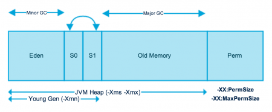
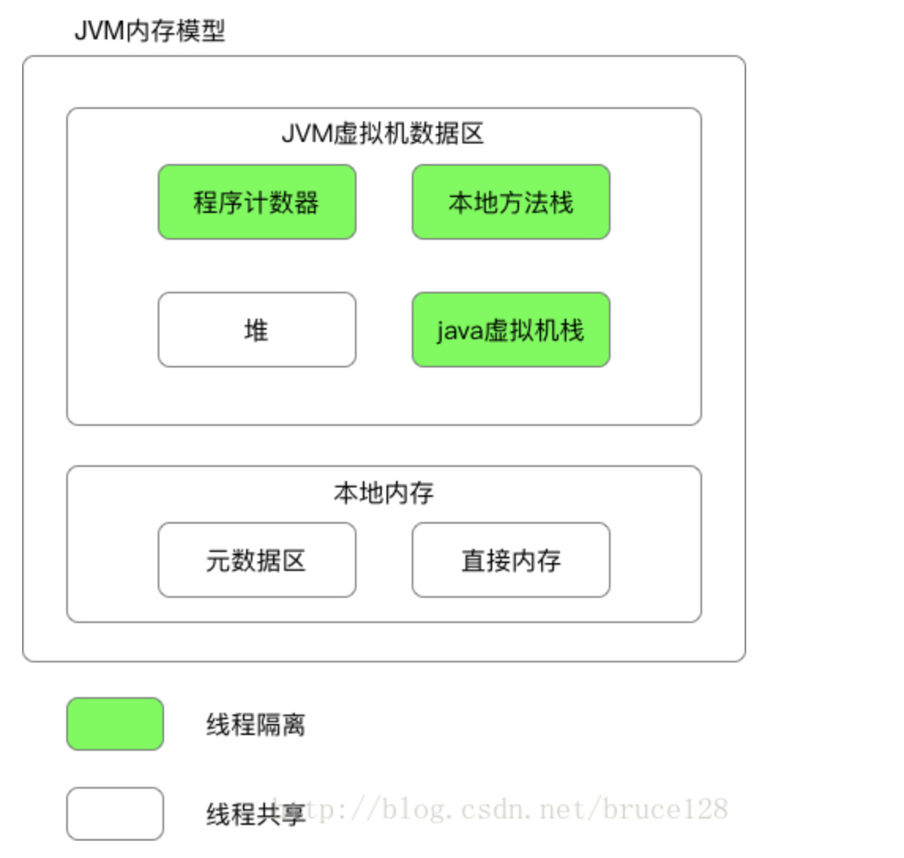
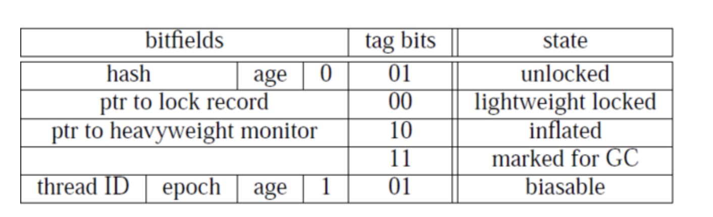
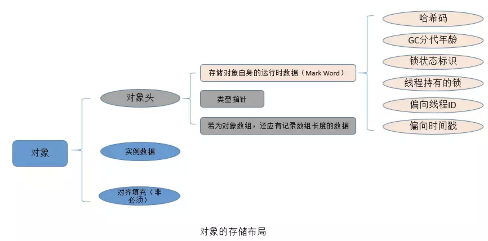
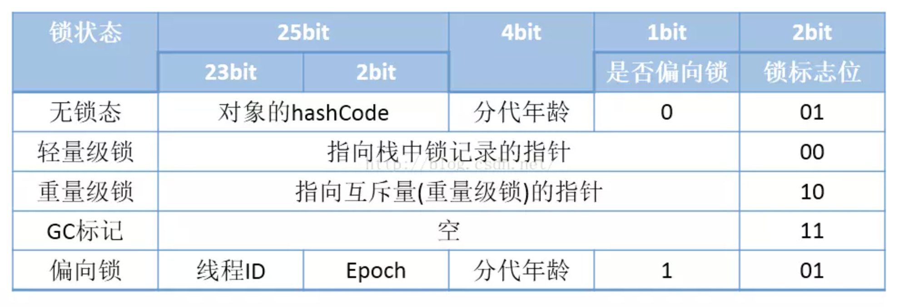
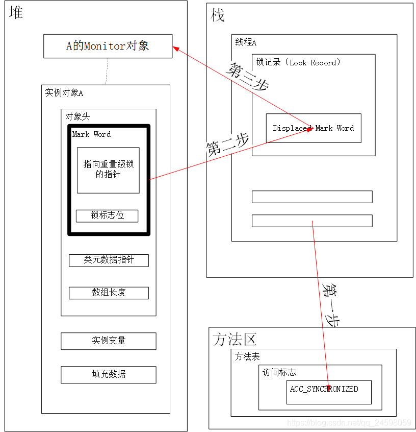
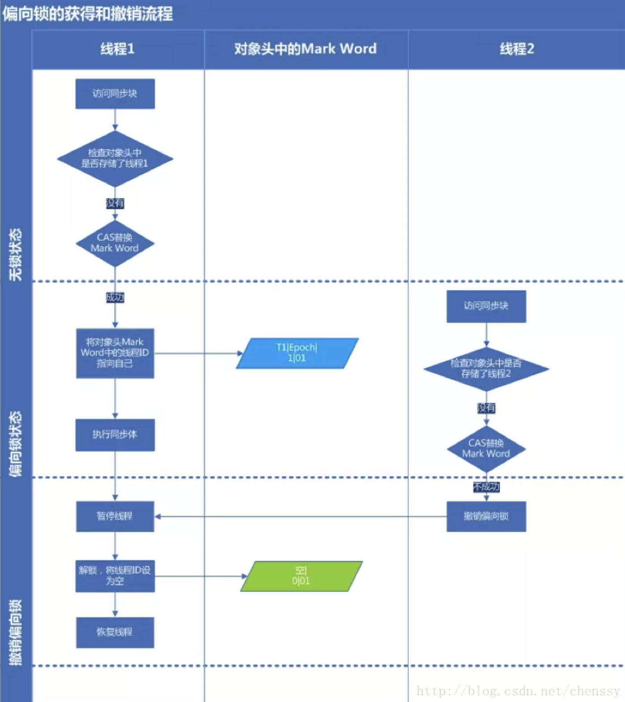
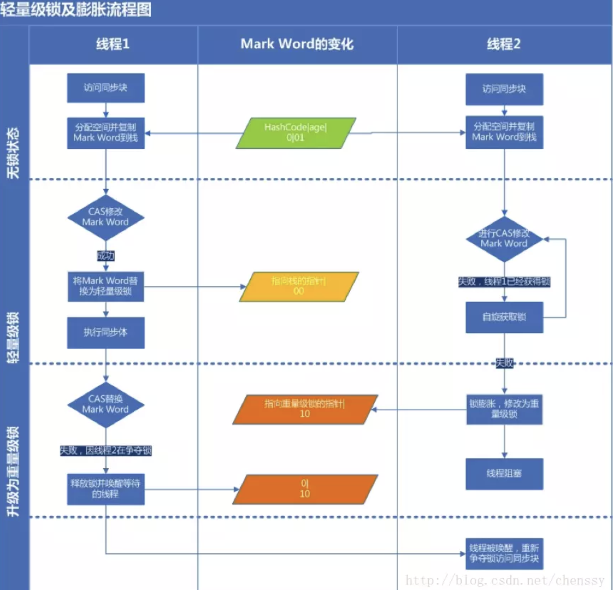

## JVM 学习专题      #####

JVM?? 深入理解 java 虚拟机；

### MAC 版配置 jvisualvm，插件配置与指令配置，一键搞定

https://blog.csdn.net/weixin_41926301/article/details/120177364

>jvisualvm 是一款官方提供的JVM监控工具。
>
>VisualVM 提供了一个可视界面，用于查看 Java 虚拟机 (Java Virtual Machine, JVM) 上运行的基于 Java 技术的应用程序的详细信息。VisualVM 对 Java Development Kit (JDK) 工具所检索的 JVM 软件相关数据进行组织，并通过一种使您可以快速查看有关多个 Java 应用程序的数据的方式提供该信息。您可以查看本地应用程序或远程主机上运行的应用程序的相关数据。此外，还可以捕获有关 JVM 软件实例的数据，并将该数据保存到本地系统，以供后期查看或与其他用户共享。
>
>

### [[g1垃圾回收器与cms垃圾回收器详解及最佳实践](https://my.oschina.net/begin01running/blog/1606677)](https://my.oschina.net/begin01running/blog/1606677)  (翻译于oracle java 的官方网站，实用性很强，并且容易理解)

英文原文https://www.oracle.com/webfolder/technetwork/tutorials/obe/java/G1GettingStarted/index.html

>G1执行垃圾回收的处理方式与CMS相似. G1在全局标记阶段(global marking phase)并发执行, 以确定堆内存中哪些对象是存活的。标记阶段完成后,G1就可以知道哪些heap区的empty空间最大。它会首先回收这些区,通常会得到大量的自由空间. 这也是为什么这种垃圾收集方法叫做Garbage-First(垃圾优先)的原因。顾名思义,**G1将精力集中放在可能布满可收回对象的区域, 可回收对象(reclaimable objects)也就是所谓的垃圾. G1使用暂停预测模型(pause prediction model)来达到用户定义的目标暂停时间,并根据目标暂停时间来选择此次进行垃圾回收的heap区域数量. **
>
>**被G1标记为适合回收的heap区将使用转移(evacuation)的方式进行垃圾回收. G1将一个或多个heap区域中的对象拷贝到其他的单个区域中,并在此过程中压缩和释放内存. 在多核CPU上转移是并行执行的(parallel on multi-processors), 这样能减少停顿时间并增加吞吐量. 因此,每次垃圾收集时, G1都会持续不断地减少碎片, 并且在用户给定的暂停时间内执行.** 这比以前的方法强大了很多. CMS垃圾收集器(Concurrent Mark Sweep,并发标记清理)不进行压缩. ParallelOld 垃圾收集只对整个堆执行压缩,从而导致相当长的暂停时间。
>
>#### G1 的内存占用(Footprint)
>
>如果从 ParallelOldGC 或者 CMS收集器迁移到 G1, 您可能会看到JVM进程占用更多的内存(a larger JVM process size). 这在很大程度上与 “accounting” 数据结构有关, 如 Remembered Sets 和 Collection Sets.
>
>Remembered Sets 简称 RSets, 跟踪指向某个heap区内的对象引用. 堆内存中的每个区都有一个 RSet. RSet 使heap区能并行独立地进行垃圾集合. RSets的总体影响小于5%.
>
>**Collection Sets 简称 CSets, 收集集合, 在一次GC中将执行垃圾回收的heap区. GC时在CSet中的所有存活数据(live data)都会被转移(复制/移动). 集合中的heap区可以是 Eden, survivor, 和/或 old generation. CSets所占用的JVM内存小于1%.  **   **(重要，因此即使在老年代中也不容易产生碎片)**
>
>#### **推荐使用 G1 的场景(Recommended Use Cases)**
>
>**G1的首要目标是为需要大量内存的系统提供一个保证GC低延迟的解决方案. 也就是说堆内存在6GB及以上,稳定和可预测的暂停时间小于0.5秒.**
>
>**如果应用程序具有如下的一个或多个特征,那么将垃圾收集器从CMS或ParallelOldGC切换到G1将会大大提升性能.**
>
>- **Full GC 次数太频繁或者消耗时间太长.**
>- **对象分配的频率或代数提升(promotion)显著变化.**
>- **受够了太长的垃圾回收或内存整理时间(超过0.5~1秒)**
>
>**注意: 如果正在使用CMS或ParallelOldGC,而应用程序的垃圾收集停顿时间并不长,那么继续使用现在的垃圾收集器是个好主意. 使用最新的JDK时并不要求切换到G1收集器。**
>
>## CMS的GC概述
>
>### 分代GC(Generational GC)与 CMS
>
>并发标记清理(CMS, Concurrent Mark Sweep)收集器(也称为多并发低暂停的收集器)回收老年代内存(tenured generation). **它将垃圾回收中的绝大部分工作与应用程序的线程一起并发执行,以期能最小化暂停时间. 通常多并发低暂停收集器收集器不复制或也不压缩存活的对象. 垃圾回收不移动存活的对象, 如果产生内存碎片问题,就会分配/占用更大的堆内存空间。**  **（标记-清除： 容易产生碎片）**
>
>注意: 年轻代使用的CMS收集器也和并行收集器（ParNew 收集器）采用一样的算法.
>
>#### CMS 垃圾收集阶段划分(Collection Phases)
>
>CMS收集器在老年代堆内存的回收中执行分为以下阶段:
>
>| 阶段                              | 说明                                                         |
>| --------------------------------- | ------------------------------------------------------------ |
>| (1) 初始标记 (Initial Mark)       | (Stop the World Event,所有应用线程暂停) **在老年代(old generation)中的对象, 如果从年轻代(young generation)中能访问到, 则被 “标记,marked” 为可达的(reachable).**对象在旧一代“标志”可以包括这些对象可能可以从年轻一代。暂停时间一般持续时间较短,相对小的收集暂停时间. |
>| (2) 并发标记 (Concurrent Marking) | 在Java应用程序线程运行的同时遍历老年代(tenured generation)的可达对象图。扫描从被标记的对象开始,直到遍历完**从root可达的所有对象**. 调整器(mutators)在并发阶段的2、3、5阶段执行,在这些阶段中新分配的所有对象(包括被提升的对象)都立刻标记为存活状态. |
>| **(3) 再次标记(Remark)**          | **(Stop the World Event, 所有应用线程暂停) 查找在并发标记阶段漏过的对象，这些对象是在并发收集器完成对象跟踪之后由应用线程更新的.****（**并发标记不会 STW, 再次标记会 STW**）** |
>| (4) 并发清理(Concurrent Sweep)    | 回收在标记阶段(marking phases)确定为不可及的对象. 死对象的回收将此对象占用的空间增加到一个空闲列表(free list),供以后的分配使用。死对象的合并可能在此时发生. 请注意,**存活的对象并没有被移动.** |
>| (5) 重置(Resetting)               | 清理数据结构,为下一个并发收集做准备. 重置(resetting phase), 然后等候下一次的GC阀值到来(GC threshold). |
>
>
>
>#### CMS的GC步骤
>
>总结起来,G1的年轻代收集归纳如下:
>
>- 堆一整块内存空间,被分为多个heap区(regions).
>- 年轻代内存由一组不连续的heap区组成. 这使得在需要时很容易进行容量调整.
>- 年轻代的垃圾收集,或者叫 young GCs, 会有 stop the world 事件. 在操作时所有的应用程序线程都会被暂停(stopped).
>- 年轻代 GC 通过多线程并行进行.
>- 存活的对象被拷贝到新的 survivor 区或者老年代.
>
>### Old Generation Collection with G1
>
>和 CMS 收集器相似, G1 收集器也被设计为用来对老年代的对象进行低延迟(low pause)的垃圾收集. 下表描述了G1收集器在老年代进行垃圾回收的各个阶段.
>
>#### G1 收集阶段 - 并发标记周期阶段(Concurrent Marking Cycle Phases)
>
>G1 收集器在老年代堆内存中执行下面的这些阶段. 注意有些阶段也是年轻代垃圾收集的一部分.
>
>| 阶段                                 | 说明                                                         |
>| ------------------------------------ | ------------------------------------------------------------ |
>| (1) 初始标记(Initial Mark)           | (Stop the World Event,所有应用线程暂停) 此时会有一次 stop the world(STW)暂停事件. 在G1中, 这附加在(piggybacked on)一次正常的年轻代GC. 标记可能有引用指向老年代对象的survivor区(根regions). |
>| (2) 扫描根区域(Root Region Scanning) | 扫描 survivor 区中引用到老年代的引用. 这个阶段应用程序的线程会继续运行. 在年轻代GC可能发生之前此阶段必须完成. |
>| (3) 并发标记(Concurrent Marking)     | 在整个堆中查找活着的对象. 此阶段应用程序的线程正在运行. 此阶段可以被年轻代GC打断(interrupted). |
>| (4) 再次标记(Remark)                 | (Stop the World Event,所有应用线程暂停) 完成堆内存中存活对象的标记. 使用一个叫做 snapshot-at-the-beginning(SATB, 起始快照)的算法, 该算法比CMS所使用的算法要快速的多. |
>| (5) 清理(Cleanup)                    | (Stop the World Event,所有应用线程暂停,并发执行) **在存活对象和完全空闲的区域上执行统计(accounting). (Stop the world) 擦写 Remembered Sets. (Stop the world) 重置空heap区并将他们返还给空闲列表(free list). (Concurrent, 并发)** |
>| (*) **拷贝**(Copying)                | (Stop the World Event,所有应用线程暂停) 产生STW事件来转移或拷贝存活的对象到新的未使用的heap区(new unused regions). 只在年轻代发生时日志会记录为 `[GC pause (young)]`. **如果在年轻代和老年代一起执行则会被日志记录为 `[GC Pause (mixed)]`.** |
>
>#### 老年代GC(Old Generation GC)总结
>
>总结下来,G1对老年代的GC有如下几个关键点:
>
>- 并发标记清理阶段(Concurrent Marking Phase)
>- 活跃度信息在程序运行的时候被并行计算出来
>- 活跃度(liveness)信息标识出哪些区域在转移暂停期间最适合回收.
>- 不像CMS一样有清理阶段(sweeping phase).
>- 再次标记阶段(Remark Phase)
>- 使用的 Snapshot-at-the-Beginning (SATB, 开始快照) 算法比起 CMS所用的算法要快得多.
>- 完全空的区域直接被回收.
>- 拷贝/清理阶段(Copying/Cleanup Phase)
>- 年轻代与老年代同时进行回收.
>- 老年代的选择基于其活跃度(liveness).
>
>G1 的 GC 参数完全列表
>
>下面是完整的 G1 的 GC 开关参数列表. 在使用时请记住上面所述的最佳实践.
>
>| 选项/默认值                          | 说明                                                         |
>| ------------------------------------ | ------------------------------------------------------------ |
>| -XX:+UseG1GC                         | 使用 G1 (Garbage First) 垃圾收集器                           |
>| -XX:MaxGCPauseMillis=n               | 设置最大GC停顿时间(GC pause time)指标(target). 这是一个软性指标(soft goal), JVM 会尽量去达成这个目标. |
>| -XX:InitiatingHeapOccupancyPercent=n | 启动并发GC周期时的堆内存占用百分比. G1之类的垃圾收集器用它来触发并发GC周期,基于整个堆的使用率,而不只是某一代内存的使用比. 值为 0 则表示"一直执行GC循环". 默认值为 45. |
>| -XX:NewRatio=n                       | 新生代与老生代(new/old generation)的大小比例(Ratio). 默认值为 2. |
>| -XX:SurvivorRatio=n                  | eden/survivor 空间大小的比例(Ratio). 默认值为 8.             |
>| -XX:MaxTenuringThreshold=n           | 提升年老代的最大临界值(tenuring threshold). 默认值为 15.     |
>| -XX:ParallelGCThreads=n              | 设置垃圾收集器在并行阶段使用的线程数,默认值随JVM运行的平台不同而不同. |
>| -XX:ConcGCThreads=n                  | 并发垃圾收集器使用的线程数量. 默认值随JVM运行的平台不同而不同. |
>| -XX:G1ReservePercent=n               | 设置堆内存保留为假天花板的总量,以降低提升失败的可能性. 默认值是 10. |
>| -XX:G1HeapRegionSize=n               | 使用G1时Java堆会被分为大小统一的的区(region)。此参数可以指定每个heap区的大小. 默认值将根据 heap size 算出最优解. 最小值为 1Mb, 最大值为 32Mb. |
>
>#### 最佳实践
>
>在使用 G1 作为垃圾收集器时,你应该遵循下面这些最佳实践的指导.
>
>**不要设置年轻代的大小(Young Generation Size)**
>
>假若通过 -Xmn 显式地指定了年轻代的大小, 则会干扰到 G1收集器的默认行为.
>
>- **G1在垃圾收集时将不再关心暂停时间指标. 所以从本质上说,设置年轻代的大小将禁用暂停时间目标.**
>- **G1在必要时也不能够增加或者缩小年轻代的空间. 因为大小是固定的,所以对更改大小无能为力.**
>
>**响应时间指标(Response Time Metrics)**
>
>设置 `XX:MaxGCPauseMillis=<N>` 时不应该使用平均响应时间(ART, average response time) 作为指标,而应该考虑使用目标时间的90%或者更大作为响应时间指标. 也就是说90%的用户(客户端/?)请求响应时间不会超过预设的目标值. 记住,暂停时间只是一个目标,并不能保证总是得到满足.
>
>**什么是转移失败(Evacuation Failure)?**
>
>对 survivors 或 promoted objects 进行GC时如果JVM的heap区不足就会发生提升失败(promotion failure). 堆内存不能继续扩充,因为已经达到最大值了. 当使用 `-XX:+PrintGCDetails` 时将会在GC日志中显示 to-space overflow (to-空间溢出)。
>
>这是很昂贵的操作!
>
>- GC仍继续所以空间必须被释放.
>- 拷贝失败的对象必须被放到正确的位置(tenured in place).
>- CSet指向区域中的任何 RSets 更新都必须重新生成(regenerated).
>- 所有这些步骤都是代价高昂的.
>
>如何避免转移失败(Evacuation Failure)
>
>要避免避免转移失败, 考虑采纳下列选项.
>
>- **增加堆内存大小**
> - 增加 -XX:G1ReservePercent=n, 其默认值是 10.
> - G1创建了一个假天花板(false ceiling),在需要更大 'to-space' 的情况下会尝试从保留内存获取(leave the reserve memory free).
>- 更早启动标记周期(marking cycle)
>- 通过采用 -XX:ConcGCThreads=n 选项增加标记线程(marking threads)的数量.


### h3 [G1垃圾回收器详解](https://blog.csdn.net/fedorafrog/article/details/104503829/)(讲得很详细，很多不懂，不好理解)

># 4. 总结
>
>G1是一款非常优秀的垃圾收集器，不仅适合堆内存大的应用，同时也简化了调优的工作。通过主要的参数初始和最大堆空间、以及最大容忍的GC暂停目标，就能得到不错的性能；同时，我们也看到G1对内存空间的浪费较高，但通过**首先收集尽可能多的垃圾(Garbage First)**的设计原则，可以及时发现过期对象，从而让内存占用处于合理的水平。


### [**JDK8**的**GC**类型 与 高并发生产环境中不同**GC**类型带来的性能提升  ](https://blog.csdn.net/chengyun19830206/article/details/84727818)

> (1)在JVM中是+XX配置实现的搭配组合：
>
> UseSerialGC 表示 "Serial" + "Serial Old"组合
> UseParNewGC 表示 "ParNew" + "Serial Old"
> UseConcMarkSweepGC 表示 "ParNew" + "CMS". 组合，"CMS" 是针对旧生代使用最多的.
> UseParallelGC 表示 "Parallel Scavenge" + "Serial Old"组合
> UseParallelOldGC 表示 "Parallel Scavenge" + "Parallel Old"组合
> 在实践中使用UseConcMarkSweepGC 表示 "ParNew" + "CMS" 的组合是经常使用的.
>
> (2)JDK8不同启动方式所启用的GC介绍
>
> * JDK8 默认启动参数：-Xms2048M -Xmx2048M -XX:+PrintGC -Xloggc:/log/Jdk7GC.GCDeatil.log
>   垃圾回收器的名称：Parallel Scavenge (PS Scavenge)(新生代)
>   垃圾回收器的名称：Parallel Old (PS MarkSweep) (老年代)
>   等于启动参数使用 -XX:+UseParallelOldGC
> * JDK8使用UseConcMarkSweepGC启动参数：-Xms2048M -Xmx2048M -XX:+UseConcMarkSweepGC -XX:+PrintGC -Xloggc:/log/Jdk7GC.GCDeatil.log
>   垃圾回收器的名称：ParNew(新生代)
>   垃圾回收器的名称：ConcurrentMarkSweep (老年代)
>
> （3）GC额外配置 最佳实战说明
>
> * -XX:NewRatio=3：设置新生代与老年代的比例(需要根据企业产品的特征来做不同的设置：程序开辟内存驻留时间长短，手动销毁内存等)
> * -XX:SurvivorRatio=8：设置新生代中Eden与Survivor的比例(需要根据企业产品的特征来做不同的设置,一般需要在测试环境做不同配置参数的压力测试，从而得到最佳配置)
> * -Xms6144M -Xmx6144M -XX:PermSize=128M -XX:MaxPermSize=256M: 这些较为常见不做详细介绍。-XX:MetaspaceSize是JDK8里面的。

### [jvm中的PermSize、MaxPermSize](https://www.cnblogs.com/sharpest/p/5756324.html)

JVM使用-XX:PermSize设置非堆内存初始值，默认是物理内存的1/64；

在数据量的很大的文件导出时，一定要把这两个值设置上，否则会出现内存溢出的错误。

由XX:MaxPermSize设置最大非堆内存的大小，默认是物理内存的1/4。

那么，如果是物理内存4GB，那么64分之一就是64MB，这就是PermSize默认值，也就是永生代内存初始大小；

四分之一是1024MB，这就是MaxPermSize默认大小。

### [JVM底层原理之堆内存初始大小](https://blog.csdn.net/lixinkuan328/article/details/94506118)

元空间（java8）与永久代（java7）之间最大的区别在于：

java8以后的元空间并不在虚拟机中，而是使用本机物理内存。

**因此，默认情况下，元空间大小受本地内存限制。类的元数据放入native memory，字符串池和类的静态变量放入java堆，这样可以加载多少类的元数据就不再由MaxPermSize控制，而是由系统实际可用空间决定。**


### [G1 垃圾收集器架构和如何做到可预测的停顿(阿里)](https://www.cnblogs.com/aspirant/p/8663872.html)

> 一般的垃圾回收器把内存分成三类: Eden(E), Suvivor(S)和Old(O), 其中Eden和Survivor都属于年轻代，Old属于老年代，新对象始终分配在Eden里面，熬过一次垃圾回收的对象就被移动到Survisor区了，经过数次垃圾回收之后还活着的对象会被移到Old区。
>
> 
>
> 跟其它垃圾回收器不一样的是：**G1虽然也把内存分成了这三大类，但是在G1里面这三大类不是泾渭分明的三大块内存，G1把内存划分成很多小块, 每个小块会被标记为E/S/O中的一个，可以前面一个是Eden后面一个就变成Survivor了。**
>
> 
>
> G1的内存分布
>
> 这么做给G1带来了很大的好处，由于把三块内存变成了几百块内存，**内存块的粒度变小了，从而可以垃圾回收工作更彻底的并行化。**
>
> **G1的并行收集做得特别好，我们第一次听到并行收集应该是CMS(Concurrent Mark & Sweep)垃圾回收算法, 但是CMS的并行收集也只是在收集老年代能够起效，而在回收年轻代的时候CMS是要暂停整个应用的(Stop-the-world)。而G1整个收集全程几乎都是并行的，**它回收的大致过程是这样的:
>
> - 在垃圾回收的最开始有一个短暂的时间段(Inital Mark)会停止应用(stop-the-world)
> - 然后应用继续运行，同时G1开始Concurrent Mark
> - 再次停止应用，来一个Final Mark (stop-the-world)
> - 最后根据Garbage First的原则，***选择一些内存块***进行回收。(stop-the-world)
>
> 由于它高度的并行化，因此它在应用停止时间(Stop-the-world)这个指标上比其它的GC算法都要好。
>
> **G1的另一个显著特点他能够让用户设置应用的暂停时间，为什么G1能做到这一点呢？也许你已经注意到了，G1回收的第4步，它是“选择一些内存块”，而不是整代内存来回收，这是G1跟其它GC非常不同的一点，其它GC每次回收都会回收整个Generation的内存(Eden, Old), 而回收内存所需的时间就取决于内存的大小，以及实际垃圾的多少，所以垃圾回收时间是不可控的；而G1每次并不会回收整代内存，到底回收多少内存就看用户配置的暂停时间，配置的时间短就少回收点，配置的时间长就多回收点，伸缩自如。 (阿里面试)**
>
> 由于内存被分成了很多小块，又带来了另外好处，由于内存块比较小，进行内存压缩整理的代价都比较小，相比其它GC算法，可以有效的规避内存碎片的问题。
>
> 说了G1的这么多好处，也该说说G1的坏处了，**如果应用的内存非常吃紧，对内存进行部分回收根本不够，始终要进行整个Heap的回收，那么G1要做的工作量就一点也不会比其它垃圾回收器少，而且因为本身算法复杂了一点，可能比其它回收器还要差。因此G1比较适合内存稍大一点的应用(一般来说至少4G以上)，小内存的应用还是用传统的垃圾回收器比如CMS比较合适**。

### [GC参数解析 UseSerialGC、UseParNewGC、UseParallelGC、UseConcMarkSweepGC](https://blog.csdn.net/leo187/article/details/88920036)

>XX:+UseSerialGC
>使用串行回收器进行回收，这个参数会使新生代和老年代都使用串行回收器，新生代使用复制算法，老年代使用标记-整理算法。Serial 收集器是最基本、历史最悠久的收集器，它是一个单线程收集器。一旦回收器开始运行时，整个系统都要停止。Client模式下默认开启，其他模式默认关闭。
>
>-XX:+UseParNewGC
>Parallel是并行的意思，**ParNew收集器是Serial收集器的多线程版本，使用这个参数后会在新生代进行并行回收，老年代仍旧使用串行回收**。新生代S区任然使用复制算法。操作系统是多核CPU上效果明显，单核CPU建议使用串行回收器。打印GC详情时ParNew标识着使用了ParNewGC回收器。默认关闭。
>————————————————
>
>-XX:+UseConcMarkSweepGC
>Concurrent Mark Sweep 并发标记清除，即使用CMS收集器。它是和应用程序线程一起执行，相对于Stop The World来说虚拟机停顿时间较少。停顿减少，吞吐量会降低。它使用的是 标记清除算法，运作过程为四个步骤，分别是 初始标记—并发标识—重新标记—并发清除。它是老年代的收集算法，新生代使用ParNew收集算法。默认关闭.
>**CMS收集器的缺点是对服务器CPU资源较为敏感，在并发标记时会降低吞吐量。它使用的标记清除算法也会产生大量空间碎片，空间碎片的存在会加大Full GC的频率，虽然老年代还有足够的内存，但是因为内存空间连续，不得不进行Full GC。**

### [**ElasticSearch**中的**JVM**性能调优](https://www.cnblogs.com/hapjin/p/11135187.html)

>note: 
>
>在使用CMS垃圾回收器时，**jmap -heap pid** 查看jvm实际为ES进程分配的新生代的大小。
>
>- -XX:CMSInitiatingOccupancyFraction 设置成75%。主要是因为CMS是并发收集，垃圾回收线程和用户线程同时运行，用户线程运行时可能继续无用的垃圾对象，如果到90%再去回收就太晚了。老年代使用到75%就回收可减少OOM异常发生的概率。
>- -XX:MaxTenuringThreshold 设置成6。这个值默认为15，即Survivor区对象经历15次Young GC后才进入老年代，设置成6就只需6次YGC就晋升到老年代了。默认情况下ES新生代采用 -XX:+UseParNewGC
>
>-Xms 初始堆内存
>
>-Xmx 最大堆内存
>
>-Xmn 年轻代内存
>
>-Xss 线程占用栈内存
>
>**Linux free** 内存参数 **:**
>
>free -m 查看机器的内存使用情况时，
>
>free 命令输出的内容其实就是 /proc/meminfo 中的内容，因此真正的是要理解 /proc/meminfo 中每一行的内容。
>
>命令输出的 free 和 available 之间的区别是什么？free表示：Unused memory (MemFree and SwapFree in /proc/meminfo)。而available 一般都比free字段数值大，这是因为：**available** 还包含了那些已经被使用但是可以被回收的内存。
>
>* 一个**JVM**长时间停顿的示例（部署Kafka和ES的机器上为什么常常要禁用内存交换？）
>
>**随着系统的运行，JVM堆内存会被使用，引用不可达对象就是垃圾对象，而操作系统有可能会把这些垃圾对象（长期未用的物理页面）交换到磁盘上去。当JVM堆使用到一定程度时，触发FullGC，FullGC过程中发现这些未引用的对象都被交换到磁盘上去了，于是JVM垃圾回收进程得把它们重新读回来到内存中，然而戏剧性的是：这些未引用的对象本身就是垃圾，读到内存中的目的是回收被丢弃它们！而这种来回读取磁盘的操作导致了FullGC 消耗了大量时间，(有可能)发生长时间的stop the world。因此，需要禁用内存交换以避免这种现象，这也是为什么在部署Kafka和ES的机器上都应该要禁用内存交换的原因吧(如果因长时间STW导致node与master之间的"心跳包"失效，集群的master节点认为该节点发生了故障，于是是自动进行failover，对于ES来说可能就发生自动rebalance分片迁移)。**


### [关键业务系统的**JVM**参数推荐**(2018**仲夏版**)** ](https://blog.csdn.net/u014172271/article/details/82221238) 

>**2.** 内存与**GC**篇
>
>-XX:+UseConcMarkSweepGC -XX:CMSInitiatingOccupancyFraction=75 -XX:+UseCMSInitiatingOccupancyOnly
>
>因为我们的监控系统会通过JMX监控内存达到90%的状况，所以设置让它75%就开始跑了，早点开始也能减少Full GC等意外情况(概念重申，这种主动的CMS GC，和JVM的老生代、永久代、堆外内存完全不能分配内存了而强制Full GC是不同的概念)。
>为了让这个设置生效，还要设置-XX:+UseCMSInitiatingOccupancyOnly，否则75％只被用来做开始的参考值，后面还是JVM自己算。
>
>**2. -XX:MaxTenuringThreshold=2**
>
>这是改动效果最明显的一个参数了。对象在Survivor区最多熬过多少次Young GC后晋升到年老代，JDK8里CMS 默认是6，其他如G1是15。
>
>内存分配：
>
>**-Xmn or -XX:NewSize or -XX:NewRatio**
>
>JDK默认新生代占堆大小的1/3，个人喜欢把对半分， 因为增大新生代能减少GC的频率，如果老生代里没多少长期对象的话，占2/3通常太多了。可以用-Xmn 直接赋值(等于-XX:NewSize and -XX:MaxNewSize同值的缩写)，或把NewRatio设为1来对半分。

* [**JVM** 的 **Stop The World**，安全点，黑暗的地底世界](https://juejin.im/entry/57dfa54d128fe10064d60abe) 

>-XX:+PrintGCApplicationStoppedTime   把全部的JVM停顿时间（不只是GC），打印在GC日志里。
>
>-XX:+PrintGCApplicationConcurrentTime 打印JVM在两次停顿之间的正常运行时间（同样没有时间戳），但好歹能配合有时间戳的GC日志，反推出Stop发生的时间了。
>
>怎么进的安全点？
>
>-XX:+PrintSafepointStatistics -XX: PrintSafepointStatisticsCount=1
>
>那长期打开安全点日志如何？
>
>在实战中，我们利用安全点日志，**发现过有程序定时调用Thread Dump（会导致GC停顿）等等情况**。
>
>但是，
>
>1. 安全点日志默认输出到stdout，一是stdout日志的整洁性，二是stdout所重定向的文件如果不在/dev/shm，可能被锁。
>
>2. 对于一些很短的停顿，比如**取消偏向锁**，**打印的消耗比停顿本身还大**。
>
>3. 安全点日志是在安全点内打印的，**本身加大了安全点的停顿时间**。
>
>  所以并不建议默认长期打开，只在问题排查时打开。		

[JVM参数分享 OmitStackTraceInFastThrow](https://www.jianshu.com/p/e87d166380eb)

### [Metaspace 之三--jdk8 Metaspace 调优](https://www.cnblogs.com/duanxz/p/10276603.html)

>从JDK8开始，永久代(PermGen)的概念被废弃掉了，取而代之的是一个称为Metaspace的存储空间。**Metaspace使用的是本地内存**，而不是堆内存，也就是说在默认情况下Metaspace的大小只与本地内存大小有关。当然你也可以通过以下的几个参数对Metaspace进行控制：
>
>1. -XX:MetaspaceSize=N ：**这个参数是初始化的Metaspace大小，该值越大触发Metaspace GC的时机就越晚。**随着GC的到来，**虚拟机会根据实际情况调控Metaspace的大小，可能增加上限也可能降低。**在默认情况下，这个值大小根据不同的平台在12M到20M浮动。使用java -XX:+PrintFlagsInitial命令查看本机的初始化参数，-XX:Metaspacesize为21810376B（大约20.8M）。
>2. -XX:MaxMetaspaceSize=N ：**这个参数用于限制Metaspace增长的上限，防止因为某些情况导致Metaspace无限的使用本地内存，影响到其他程序。默认无上限。**
>3. -XX:MinMetaspaceFreeRatio=N ：当进行过Metaspace GC之后，会计算当前Metaspace的空闲空间比，如果空闲比小于这个参数，那么虚拟机将增长Metaspace的大小。在本机该参数的默认值为40，也就是40%。设置该参数可以控制Metaspace的增长的速度，太小的值会导致Metaspace增长的缓慢，Metaspace的使用逐渐趋于饱和，可能会影响之后类的加载。而太大的值会导致Metaspace增长的过快，浪费内存。
>4. -XX:MaxMetasaceFreeRatio=N ：当进行过Metaspace GC之后， 会计算当前Metaspace的空闲空间比，如果空闲比大于这个参数，那么虚拟机会释放Metaspace的部分空间。在本机该参数的默认值为70，也就是70%。
>5. -XX:MaxMetaspaceExpansion=N ：Metaspace增长时的最大幅度。在本机上该参数的默认值为5452592B（大约为5MB）。
>6. -XX:MinMetaspaceExpansion=N ：Metaspace增长时的最小幅度。在本机上该参数的默认值为340784B（大约330KB为）.		

**Java**偏向锁实现原理**(Biased Locking)**

https://blog.csdn.net/hsuxu/article/details/9472381   理解的不深刻？？？

>**挂起持有偏向锁的线程**，这步操作类似GC的pause，但不同之处是，它只挂起持有偏向锁的线程（非当前线程）。
>
>在抢占模式的橙色区域说明中有提到，**指向当前堆栈中最近的一个lock record（在轻量级锁原理一文有讲到，lock record是进入锁前会在stack上创建的一份内存空间）。**
>这里提到的最近的一个lock record，其实就是当前锁所在的stack frame上分配的lock record。
>整个步骤是从偏向锁恢复到轻量级锁的过程。
>
>

难道这些 Java 大牛说的都是真的？

https://toutiao.io/posts/hltb1e/preview

### JVM 系列文章之 **Full GC** 和 **Minor GC** 

https://juejin.im/post/5b8d2a5551882542ba1ddcf8

>**JVM**如何避免**Minor GC**扫描全堆
>
>HotSpot 给出的解决方案是 一项叫做 **卡表** 的技术。
>
>**Full GC**
>
>**Full GC** 就是收集整个堆，包括**新生代，老年代，永久代**(在**JDK 1.8**及以后，永久代会被移除，换为**metaspace**)等收集所有部分的模式。
>
>**Partial GC(**局部 **GC)**: 并不收集整个 GC 堆的模式
>
>- Young GC: 只收集young gen的GC，**Young GC**还有种说法就叫做 **"Minor GC"**
>- Old GC: 只收集old gen的GC。只有垃圾收集器CMS的concurrent collection 是这个模式
>- Mixed GC: 收集整个young gen 以及部分old gen的GC。只有垃圾收集器 G1有这个模式
>
>### Full GC的触发条件
>
>针对不同的垃圾收集器，Full GC的触发条件可能不都一样。**按HotSpot VM的serial GC的实现来看**，触发条件是:
>
>- **当准备要触发一次 young GC时，如果发现统计数据说之前 young GC的平均晋升大小比目前的 old gen剩余的空间大，则不会触发young GC而是转为触发 full GC** (因为HotSpot VM的GC里，除了垃圾回收器 CMS的concurrent collection 之外，其他能收集old gen的GC都会同时收集整个GC堆，包括young gen，所以不需要事先准备一次单独的young GC)
>- **如果有永久代(perm gen),要在永久代分配空间但已经没有足够空间时，也要触发一次 full GC**
>- **System.gc()，heap dump带GC,其默认都是触发 full GC.**
>- **如果Metaspace的空间占用达到了设定的最大值，那么就会触发GC来收集死亡对象和类的加载器。根据JDK 8的特性，G1和CMS都会很好地收集Metaspace区（一般都伴随着Full GC）。**
>
>## Minor GC
>
>Minor GC 是俗称，**新生代(新生代分为一个 Eden区和两个Survivor区)的垃圾收集叫做 Minor GC**。在 Oracle 高级研究员郑雨迪的[极客时间专栏 《深入拆解Java虚拟机》](https://link.juejin.cn?target=https%3A%2F%2Ftime.geekbang.org%2Fcolumn%2Fintro%2F108)中也谈到 **Minor GC**，内容如下:
>
>### 触发条件
>
>> 当 Eden 区的空间耗尽了怎么办？这个时候 Java虚拟机便会触发一次 **Minor GC**来收集新生代的垃圾，存活下来的对象，则会被送到 Survivor区。
>
>**简单说就是当新生代的Eden区满的时候触发 Minor GC**

**MetaspaceSize** 是存什么的；

类的Class metadata；

[深入探究 JVM | 探秘 Metaspace](https://www.sczyh30.com/posts/Java/jvm-metaspace/)

>首先，Metaspace（元空间）是哪一块区域？官方的解释是：
>
>> In JDK 8, classes metadata is now stored in the **native heap** and this space is called **Metaspace**.
>
>## 优点
>
>使用本地内存有什么好处呢？最直接的表现就是OOM问题将不复存在，因为**默认的类的元数据分配只受本地内存大小的限制，也就是说本地内存剩余多少，理论上Metaspace就可以有多大**（貌似容量还与操作系统的虚拟内存有关？这里不太清楚），这解决了空间不足的问题。不过，让 Metaspace 变得无限大显然是不现实的，因此我们也要限制 Metaspace 的大小：使用 **-XX:MaxMetaspaceSize** 参数来指定 Metaspace 区域的大小。JVM 默认在运行时根据需要动态地设置。
>
>**MaxMetaspaceSize** 的大小。也就是说，JDK 8 开始把类的元数据放到本地堆内存(native heap)中，这一块区域就叫 Metaspace，中文名叫元空间。
>
>**如果Metaspace的空间占用达到了设定的最大值，那么就会触发GC来收集死亡对象和类的加载器。根据JDK 8的特性，G1和CMS都会很好地收集Metaspace区（一般都伴随着Full GC）。**
>
>**为了减少垃圾回收的频率及时间，控制吞吐量，对Metaspace进行适当的监控和调优是非常有必要的。如果在Metaspace区发生了频繁的Full GC，那么可能表示存在内存泄露或Metaspace区的空间太小了**。

https://docs.oracle.com/javase/8/docs/technotes/guides/vm/gctuning/considerations.html#sthref66

**JVM** 参数**MetaspaceSize**的误解     （理解的不深刻）

https://www.jianshu.com/p/b448c21d2e71

>**那么-XX:MetaspaceSize=256m的含义到底是什么呢？其实，这个JVM参数是指Metaspace扩容时触发FullGC的初始化阈值，也是最小的阈值。**
>
>如果没有配置-XX:MetaspaceSize，那么触发FGC的阈值是21807104（约20.8m），可以通过jinfo -flag MetaspaceSize pid得到这个值；
>
>如果配置了-XX:MetaspaceSize，那么触发FGC的阈值就是配置的值；
>
>Metaspace由于使用不断扩容到-XX:MetaspaceSize参数指定的量，就会发生FGC；且之后每次Metaspace扩容都可能会发生FGC（至于什么时候会，比较复杂，跟几个参数有关）；
>
>如果Old区配置CMS垃圾回收，那么扩容引起的FGC也会使用CMS算法进行回收；
>
>如果MaxMetaspaceSize设置太小，可能会导致频繁FullGC，甚至OOM；
>
>JDK8+移除了Perm，引入了Metapsace，它们两者的区别是什么呢？Metaspace上面已经总结了，无论-XX:MetaspaceSize和-XX:MaxMetaspaceSize两个参数如何设置，随着类加载越来越多不断扩容调整，直到MetaspaceSize(如果没有配置就是默认20.8m)触发FGC，上限是-XX:MaxMetaspaceSize，默认是几乎无穷大。而Perm的话，我们通过配置-XX:PermSize以及-XX:MaxPermSize来控制这块内存的大小，jvm在启动的时候会根据-XX:PermSize初始化分配一块连续的内存块，这样的话，如果-XX:PermSize设置过大，就是一种赤果果的浪费。很明显，Metapsace比Perm好多了.

什么是 JVM Segment Fault 。

[Major GC和Full GC的区别是什么？触发条件呢？](https://www.zhihu.com/question/41922036)

>Partial GC：并不收集整个GC堆的模式
>
>- Young GC：只收集young gen的GC
>- Old GC：只收集old gen的GC。只有CMS的concurrent collection是这个模式
>- Mixed GC：收集整个young gen以及部分old gen的GC。**只有G1有这个模式**
>
>Full GC：收集整个堆，包括young gen、old gen、perm gen（如果存在的话）等所有部分的模式。
>
>最简单的分代式GC策略，按HotSpot VM的serial GC的实现来看，触发条件是：
>
>- young GC：**当young gen中的eden区分配满的时候触发**。注意young GC中有部分存活对象会晋升到old gen，所以young GC后old gen的占用量通常会有所升高。
>- full GC：**当准备要触发一次young GC时，如果发现统计数据说之前young GC的平均晋升大小比目前old gen剩余的空间大，则不会触发young GC而是转为触发full GC**（因为HotSpot VM的GC里，**除了CMS的concurrent collection之外，其它能收集old gen的GC都会同时收集整个GC堆，包括young gen，所以不需要事先触发一次单独的young GC**）；或者，**如果有perm gen的话，要在perm gen分配空间但已经没有足够空间时，也要触发一次full GC；或者System.gc()、heap dump带GC，默认也是触发full GC**。**并发GC的触发条件就不太一样。以CMS GC为例，它主要是定时去检查old gen的使用量，当使用量超过了触发比例就会启动一次CMS GC，对old gen做并发收集。**
>
>4.1 **各种Young GC的触发原因都是eden区满了**；
>
>4.2 Serial Old GC／PS MarkSweep GC／Parallel Old GC的触发则是在要执行Young GC时候预测其promote的object的总size超过老生代剩余size；
>
>4.3 CMS GC的initial marking的触发条件是**老生代使用比率超过某值**；
>
>4.4 G1 GC的initial marking的触发条件是**Heap使用比率超过某值**，跟4.3 heuristics 类似；
>
>4.5 Full GC for CMS算法和Full GC for G1 GC算法的触发原因很明显，**就是4.3 和 4.4 的fancy算法不赶趟了，只能全局范围大搞一次GC了（相信我，这很慢！这很慢！这很慢！）；**
>
>作者：Ted Mosby
>链接：https://www.zhihu.com/question/41922036/answer/144566789
>来源：知乎
>著作权归作者所有。商业转载请联系作者获得授权，非商业转载请注明出处。

* [**使用jmap dump 分析JVM内存状态**](https://blog.csdn.net/xidiancoder/article/details/70948569)

>[root@node-10-122-157-64 ~]# jmap
>Usage:
>jmap [option] <pid>
>   (to connect to running process)
>jmap [option] <executable <core>
>   (to connect to a core file)
>jmap [option] [server_id@]<remote server IP or hostname>
>   (to connect to remote debug server)
>
>where <option> is one of:
><none>               to print same info as Solaris pmap
>-heap                to print java heap summary
>-histo[:live]        to print histogram of java object heap; if the "live"
>                    suboption is specified, only count live objects
>-clstats             to print class loader statistics
>-finalizerinfo       to print information on objects awaiting finalization
>-dump:<dump-options> to dump java heap in hprof binary format
>                    dump-options:
>                      live         dump only live objects; if not specified,
>                                   all objects in the heap are dumped.
>                      format=b     binary format
>                      file=<file>  dump heap to <file>
>                    Example: jmap -dump:live,format=b,file=heap.bin <pid>
>-F                   force. Use with -dump:<dump-options> <pid> or -histo
>                    to force a heap dump or histogram when <pid> does not
>                    respond. The "live" suboption is not supported
>                    in this mode.
>-h | -help           to print this help message
>-J<flag>             to pass <flag> directly to the runtime system
>
>1.查看整个JVM内存状态
>
>jmap -heap [pid]   要注意的是在使用CMS GC 情况下，jmap -heap的执行有可能会导致[Java](http://lib.csdn.net/base/javase) 进程挂起
>
>2.导出整个JVM 中内存信息
>jmap -dump:format=b,file=文件名 [pid]
>
>3.jhat是sun 1.6及以上版本中自带的一个用于分析JVM 堆DUMP 文件的工具，基于此工具可分析JVM HEAP 中对象的内存占用情况
>jhat -J-Xmx1024M [file]
>执行后等待console 中输入start HTTP server on port 7000 即可使用浏览器访问 IP：7000
>
>4.查看JVM堆中对象详细占用情况
>
>jmap -histo [pid]
>
>5.查看堆栈信息
>
>jstack 是sun JDK 自带的工具，通过该工具可以看到JVM 中线程的运行状况，包括锁等待，线程是否在运行。
>执行 jstack [pid] ,线程的所有堆栈信息，**包括死锁进程**。

* [Java开发必须掌握的线上问题排查命令](https://juejin.im/post/5ac442946fb9a028d700cfdf#heading-8)

>### 1. jps 功能
>
>显示当前所有java进程pid的命令。
>
>```java
>jps：显示当前用户的所有java进程的PID
>
>jps -v 3331：显示虚拟机参数
>
>jps -m 3331：显示传递给main()函数的参数
>
>jps -l 3331：显示主类的全路径
>```
>
>##### 2. jinfo
>
>实时查看和调整虚拟机参数，可以显示未被显示指定的参数的默认值。
>
>##### 3.jstat (常用)
>
>显示进程中的类装载、内存、垃圾收集、JIT编译等运行数据。
>
>### 常用指令
>
>``` java
>jstat -gc 3331 250 20 ：查询进程2764的垃圾收集情况，每250毫秒查询一次，一共查询20次。
>
>jstat -gccause：额外输出上次GC原因
>
>jstat -calss：件事类装载、类卸载、总空间以及所消耗的时间
>```
>
>##### 4.jmap   (常用)
>
>生成堆转储快照（heapdump）
>
>``` java
>jmap -heap 3331：查看java 堆（heap）使用情况
>jmap -histo 3331：查看堆内存(histogram)中的对象数量及大小
>jmap -histo:live 3331：JVM会先触发gc，然后再统计信息
>jmap -dump:format=b,file=heapDump 3331：将内存使用的详细情况输出到文件，之后一般使用其他工具进行分析。
>```
>
>##### 5.jhat
>
>一般与jmap搭配使用，用来分析jmap生成的堆转储文件。
>
>```java
>由于有很多可视化工具（Eclipse Memory Analyzer 、IBM HeapAnalyzer）可以替代，所以很少用。不过在没有可视化工具的机器上也是可用的。
>```
>
>``` java
>jmap -dump:format=b,file=heapDump 3331 + jhat heapDump：解析Java堆转储文件,并启动一个 web server
>```
>
>##### 6.jstack
>
>生成当前时刻的线程快照。
>
>### 常用指令
>
>``` java
>`jstack 3331`：查看线程情况
>
>`jstack -F 3331`：正常输出不被响应时，使用该指令
>
>`jstack -l 3331`：除堆栈外，显示关于锁的附件信息
>```
>
>_________
>
>### 频繁GC问题或内存溢出问题
>
>一、使用`jps`查看线程ID
>
>二、使用`jstat -gc 3331 250 20` 查看gc情况，一般比较关注PERM区的情况，查看GC的增长情况。
>
>三、使用`jstat -gccause`：额外输出上次GC原因
>
>四、使用`jmap -dump:format=b,file=heapDump 3331`生成堆转储文件
>
>五、使用jhat或者可视化工具（Eclipse Memory Analyzer 、IBM HeapAnalyzer）分析堆情况。
>
>六、结合代码解决内存溢出或泄露问题。
>
>------
>
>### 死锁问题
>
>一、使用`jps`查看线程ID
>
>二、使用`jstack 3331`：查看线程情况
>
>----------

* [4大JVM性能分析工具详解，及内存泄漏分析方案](https://youzhixueyuan.com/jvm-performance-analysis-tool.html)

* [Java内存分析工具jmap](https://www.cnblogs.com/lujiango/p/9002270.html)

>- - [2.1 jmap -dump:live,format=b,file=dump.hprof 129665](https://www.cnblogs.com/lujiango/p/9002270.html#_lab2_1_0)
> - [2.2 jmap -heap 129665](https://www.cnblogs.com/lujiango/p/9002270.html#_lab2_1_1)
> - [2.3 jmap -finalizerinfo 129665](https://www.cnblogs.com/lujiango/p/9002270.html#_lab2_1_2)
> - [2.4 jmap -histo:live 129665](https://www.cnblogs.com/lujiango/p/9002270.html#_lab2_1_3)
> - [2.5 jmap -clstats 129665](https://www.cnblogs.com/lujiango/p/9002270.html#_lab2_1_4)
> - [2.6 -F](https://www.cnblogs.com/lujiango/p/9002270.html#_lab2_1_5)


### [Java 内存模型和 JVM 内存结构真不是一回事](https://juejin.im/post/6844903941805703181)（重点，不仅要知道jvm的内存结构，还要知道java内存模型）

># Java 内存模型
>
>**Java 内存模型**（下文简称 **JMM**）就是在底层处理器内存模型的基础上，定义自己的多线程语义。它明确指定了一组排序规则，来保证线程间的可见性。
>
>这一组规则被称为 **Happens-Before**, JMM 规定，要想保证 B 操作能够看到 A 操作的结果（无论它们是否在同一个线程），那么 A 和 B 之间必须满足 **Happens-Before 关系**：
>
>- **单线程规则**：一个线程中的每个动作都 happens-before 该线程中后续的每个动作
>- **监视器锁定规则**：监听器的**解锁**动作 happens-before 后续对这个监听器的**锁定**动作
>- **volatile 变量规则**：对 volatile 字段的写入动作 happens-before 后续对这个字段的每个读取动作
>- **线程 start 规则**：线程 **start()** 方法的执行 happens-before 一个启动线程内的任意动作
>- **线程 join 规则**：一个线程内的所有动作 happens-before 任意其他线程在该线程 **join()** 成功返回之前
>- **传递性**：如果 A happens-before B, 且 B happens-before C, 那么 A happens-before C
>
>怎么理解 happens-before 呢？如果按字面意思，比如第二个规则，线程（不管是不是同一个）的解锁动作发生在锁定之前？这明显不对。happens-before 也是为了保证可见性，比如那个解锁和加锁的动作，可以这样理解，线程1释放锁退出同步块，线程2加锁进入同步块，那么线程2就能看见线程1对共享对象修改的结果。
>
>Java 提供了几种语言结构，包括 *volatile*, *final* 和 *synchronized*, 它们旨在帮助程序员向**编译器**描述程序的并发要求，其中：
>
>- **volatile** - 保证**可见性**和**有序性**
>- **synchronized** - 保证**可见性**和**有序性**; 通过**管程（Monitor）\**保证一组动作的\**原子性**
>- **final** - 通过禁止**在构造函数初始化**和**给 final 字段赋值**这两个动作的重排序，保证**可见性**（如果 **this 引用逃逸**就不好说可见性了）
>
>编译器在遇到这些关键字时，会插入相应的内存屏障，保证语义的正确性。
>
>有一点需要**注意**的是，**synchronized** **不保证**同步块内的代码禁止重排序，因为它通过锁保证同一时刻只有**一个线程**访问同步块（或临界区），也就是说同步块的代码只需满足 **as-if-serial** 语义 - 只要单线程的执行结果不改变，可以进行重排序。
>
>所以说，Java 内存模型描述的是多线程对共享内存修改后彼此之间的可见性，另外，还确保正确同步的 Java 代码可以在不同体系结构的处理器上正确运行。
>
>小结
>
>它们之间的关系可以这样来个总结，实现一个 JVM 要满足**内存结构**描述的组成部分，设计如何执行多个线程的时候，要满足**Java 内存模型**约定的多线程语义。

[Volatile可见性、主内存简介](https://blog.csdn.net/weixin_45216590/article/details/108273132)

>为了获得较好的执行效能，Java内存模型并没有限制执行引擎使用处理器的特定寄存器或缓存来和主内存进行交互，也没有限制即时编译器进行调整代码执行顺序这类优化措施。

###  [JVM常见垃圾回收算法](https://www.cnblogs.com/yulinfeng/p/7163052.html)

>**GC算法**
>
>　　1.**标记-清除算法**
>
>　　等待被回收对象的“标记”过程在上文已经提到过，如果在被标记后直接对对象进行清除，会带来另一个新的问题——内存碎片化。如果下次有比较大的对象实例需要在堆上分配较大的内存空间时，可能会出现无法找到足够的连续内存而不得不再次触发垃圾回收。
>
>　　2.**复制算法****（Java堆中新生代的垃圾回收算法）**
>
>此GC算法实际上解决了标记-清除算法带来的“内存碎片化”问题。首先还是先标记处待回收内存和不用回收的内存，下一步将不用回收的内存复制到新的内存区域，这样旧的内存区域就可以全部回收，而新的内存区域则是连续的。它的缺点就是会损失掉部分系统内存，因为你总要腾出一部分内存用于复制。
>
>　　在上文[《JVM](http://www.cnblogs.com/yulinfeng/p/7153391.html)[入门——运行时数据区》](http://www.cnblogs.com/yulinfeng/p/7153391.html)提到过在Java堆中被分为了新生代和老年代，这样的划分是方便GC。Java堆中的新生代就使用了GC复制算法。在新生代中又分为了三个区域：Eden 空间、To Survivor空间、From Survivor空间。不妨将注意力回到这张图的左边新生代部分：
>
>
>
>　　新的对象实例被创建的时候通常在Eden空间，发生在Eden空间上的GC称为Minor GC，**当在新生代发生一次GC后****，****会将Eden****和其中一个Survivor空间的内存复制到另外一个Survivor中**，如果反复几次有对象一直存活，此时内存对象将会被移至老年代。可以看到新生代中Eden占了大部分，而两个Survivor实际上占了很小一部分。这是因为大部分的对象被创建过后很快就会被GC（这里也许运用了是二八原则）。
>
>　　3.**标记****-****压缩算法****（或称为标记-整理算法，Java堆老年代的垃圾回收算法）**
>
>　　对于新生代，大部分对象都不会存活，所以在新生代中使用复制算法较为高效，而对于老年代来讲，大部分对象可能会继续存活下去，如果此时还是利用复制算法，效率则会降低。**标记-压缩算法首先还是“标记”，标记过后，将不用回收的内存对象压缩到内存一端，此时即可直接清除边界处的内存**，这样就能避免复制算法带来的效率问题，同时也能避免内存碎片化的问题。老年代的垃圾回收称为“Major GC”。

### h3 [对象如何进入老年代](https://blog.csdn.net/liyu121/article/details/90105990)

>问题：一般而言，对象首次创建会被放置在新生代的eden区，如果没有gc的介入就不会离开eden区，那么eden区的对象怎么进入老年代呢？
>
>主要有下面三种方式：大对象，长期存活的对象，动态对象年龄判定
>
>1：**大对象直接进入老年代**。比如很长的字符串，或者很大的数组等，参数-XX:PretenureSizeThreshold=3145728设置，超过这个参数设置的值就直接进入老年代
>
>2：**长期存活的对象进入老年代**。在堆中分配内存的对象，其内存布局的对象头中（Header）包含了 GC 分代年 龄标记信息。如果对象在 eden 区出生，那么它的 GC 分代年龄会初始值为 1，每熬过一次 Minor GC 而不被回收，这个值就会增  加 1 岁。当它的年龄到达一定的数值时，就会晋升到老年代中，可以通过参数-XX:MaxTenuringThreshold设置年龄阀值（默认是 15 岁）
>
>3：**动态年龄判断并进入老年代**。**当 Survivor 空间中相同年龄所有对象的大小总和大于 Survivor 空间的一半，年龄大于或等于该年龄的对象就可以直接进入老年代，而不需要达到默认的分代年龄。**

### [JDK1.8 JVM内存结构](https://blog.csdn.net/ztx114/article/details/79400789)

>
>
>这里介绍的是JDK1.8 JVM内存模型。1.8同1.7比，最大的差别就是：**元数据区取代了永久代**。元空间的本质和永久代类似，都是对JVM规范中方法区的实现。不过元空间与永久代之间最大的区别在于：**元数据空间并不在虚拟机中，而是使用本地内存**。


## h2轻量级锁、偏向锁 、重量级锁专题     ###

### [java AQS的实现原理（大部分同步类都依赖AQS实现）](https://www.jianshu.com/p/279baac48960)

>
>
>

**Java**轻量级锁原理详解**(Lightweight Locking)**

https://blog.csdn.net/chen_fly2011/article/details/54895316

>[Java ](http://lib.csdn.net/base/java)Object Model中定义，Object Header是一个2字（1 word = 4 byte）长度的存储区域。
>
>第一个字长度的区域用来标记同步，**GC**以及**hash code**等，官方称之为  **mark word** 。第二个字长度的区域是指向到对象的 **Class**。
>
>在2个word中，mark word是轻量级锁实现的关键。它的结构见下表：
>
>
>
>最后一步unlock中，我们发现，JVM同样使用了CAS来验证 object mark word 在持有锁到释放锁之间，有无被其他线程访问。
>
>如果其他线程在持有锁这段时间里，尝试获取过锁，则可能自身被挂起，而mark word的重量级锁指针也会被相应修改。
>
>此时，unlock后就需要唤醒被挂起的线程。
>
>

**Java**偏向锁实现原理**(Biased Locking)**

https://blog.csdn.net/hsuxu/article/details/9472381

>轻量级锁是通过 CAS 来避免进入开销较大的互斥操作，而偏向锁是在无竞争场景下完全消除同步，连 CAS 也不执行。
>
>偏向锁，顾名思义，它会偏向于第一个访问锁的线程，如果在接下来的运行过程中，该锁没有被其他的线程访问，则持有偏向锁的线程将永远不需要触发同步。
>
>如果在运行过程中，遇到了其他线程抢占锁，则持有偏向锁的线程会被挂起，JVM会尝试消除它身上的偏向锁，将锁恢复到标准的轻量级锁。(偏向锁只能在单线程下起作用)
>
>偏向锁也会带来额外开销
>
>在JDK6中，偏向锁是默认启用的。它提高了单线程访问同步资源的性能。
>但试想一下，如果你的同步资源或代码一直都是多线程访问的，那么消除偏向锁这一步骤对你来说就是多余的。事实上，消除偏向锁的开销还是蛮大的。
>
>所以在你非常熟悉自己的代码前提下，大可禁用偏向锁 -XX:-UseBiasedLocking 。


### [synchronized中重量级锁、偏向锁和轻量级锁的区别](https://blog.csdn.net/qq_24598059/article/details/98475865)    （这篇文章讲得很明白）

>Java1.5之前synchronized是一个重量级锁，Java 1.6对synchronized进行的各种优化后，synchronized 并不会显得那么重了。我们先介绍重量级锁，然后介绍优化后的轻量级锁和偏向锁。
>
># 0.对象头以及Mark Word
>
>
>
>
>
># 1重量级锁
>
>重量级的synchronized有三个用法：
>
>- 普通同步方法，锁的是当前实例对象。
>- 静态同步方法，锁的是当前类的class对象。
>
>同步代码块，锁的是synchronized括号里配置的对象。
>
>上述这三种机制的切换是根据竞争激烈程度进行的：
>
>- **在几乎无竞争的条件下， 会使用偏向锁**
>- **在轻度竞争的条件下， 会由偏向锁升级为轻量级锁**
>- **在重度竞争的情况下， 会由轻量级锁升级为重量级锁。**
>
>## 1.1普通同步方法用法及原理
>
>用法：
>
>```java
>public class SynchronizedMethod {
> public synchronized void method() {
>     System.out.println("Hello World!");
> }
>}
>```
>
>方法调用如下图所示：
>
>
>
>1.当前线程调用指令将会调用当前实例对象，去检查当前实例对象（**在堆中**）所对应的类方法（**在方法区中**）方法表中的**访问标志（ACC_SYNCHRONIZED）**是否被设置；
>
>2.如果设置了，那么检查此同步对象有没有被锁定，即检查它的**Mark Word**的锁标志位是不是01，则虚拟机首先在当前线程的栈中创建我们称之为“**锁记录（Lock Record）**”的空间，用于存储锁对象的Mark Word的拷贝，官方把这个拷贝称为**Displaced Mark Word**。
>
>3.执行线程将通过Displaced Mark Word中指向重量级锁的指针，找到**Monitor对象的起始地址**，获取到monitor对象，获取成功之后才能执行方法体，方法执行完后再释放monitor。在方法执行期间，其他任何线程都无法再获得同一个monitor对象。 
>
>## 1.2同步代码块用法及原理
>
>用法：
>
>```java
>public class SynchronizedDemo {
> public void method() {
>     synchronized (this) {
>         System.out.println("Method 1 start");
>     }
> }
>}
>```
>
>原理同2.1.1。
>
>## 1.3静态同步方法用法及原理
>
>用法：
>
>```java
>public static class Synchronized Method {
> public synchronized void method() {
>     System.out.println("Hello World!");
> }
>}
>```
>
>在类中如果某方法或某代码块中有 synchronized，那么在生成一个该类实例后，该实例也就有一个单独的Monitor对象，而**static synchronized则是所有该类的所有实例公用得一个 Monitor 对象。**
>
># 2偏向锁
>
>大多数情况下，锁不仅不存在多线程竞争，而且**总是由同一线程多次获得，偏向锁可以降低多次加锁解锁的开销。**
>
>偏向锁会偏向于第一个获得它的线程，如果在接下来的执行过程中，该锁没有被其他的线程获取，则持有偏向锁的线程将永远不需要同步。大多数情况下，锁不仅不存在多线程竞争，而且总是由同一线程多次获得，为了让线程获得锁的代价更低而引入了偏向锁。
>
>**当有另外一个线程去尝试获取这个锁时，偏向模式就宣告结束。**根据锁对象目前是否处于被锁定的状态，撤销偏向后恢复到未锁定或轻量级锁定状态。
>
>
>
>
>
># 3轻量级锁
>
>
>
># 4总结
>
>| **锁**       | **优点**                                                     | **缺点**                                         | **适用场景**                         |
>| ------------ | ------------------------------------------------------------ | ------------------------------------------------ | ------------------------------------ |
>| **偏向锁**   | 加锁和解锁不需要额外的消耗，和执行非同步方法比仅存在纳秒级的差距。 | 如果线程间存在锁竞争，会带来额外的锁撤销的消耗。 | 适用于只有一个线程访问同步块场景。   |
>| **轻量级锁** | **竞争的线程不会阻塞，提高了程序的响应速度。**               | 如果始终得不到锁竞争的线程使用自旋会消耗CPU。    | 追求响应时间。同步块执行速度非常快。 |
>| **重量级锁** | 线程竞争**不使用自旋**，不会消耗CPU。                        | 线程阻塞，响应时间缓慢。                         | 追求吞吐量。同步块执行速度较长。     |
>
>偏向锁和轻重量级锁最大的区别：**没有MarkWord 拷贝到栈，不用 cas 修改MarkWord 的指针。**
>
>轻量级锁和重量级锁最大的区别：**重量级锁没有 Cas**，拷贝到线程栈中的 Mark Word 没有指向Monitor对象就**直接挂起**。
>
>synchronized的执行过程： 
>\1. 检测Mark Word里面是不是当前线程的ID，如果是，表示当前线程处于偏向锁 
>\2. 如果不是，则使用CAS将当前线程的ID替换进 Mark Word 中，如果成功则表示当前线程获得偏向锁，置偏向标志位1 
>\3. 如果失败，则说明发生竞争，撤销偏向锁，进而升级为轻量级锁。 
>\4. 当前线程使用CAS将对象头的Mark Word替换为锁记录指针(指向当前栈中的 MarkWord 对象的指针)，如果成功，当前线程获得锁 
>\5. 如果失败，表示其他线程竞争锁，当前线程便尝试使用**自旋来获取锁**。 
>\6. 如果自旋成功则依然处于轻量级状态。 
>\7. 如果自旋失败，则升级为重量级锁。
>
>上面几种锁都是JVM自己内部实现，当我们执行synchronized同步块的时候jvm会根据启用的锁和当前线程的争用情况，决定如何执行同步操作；
>
>在所有的锁都启用的情况下**线程进入临界区时会先去获取偏向锁，如果已经存在偏向锁了，则会尝试获取轻量级锁，启用自旋锁，如果自旋也没有获取到锁，则使用重量级锁，没有获取到锁的线程阻塞挂起，直到持有锁的线程执行完同步块唤醒他们；**
>
>偏向锁是在无锁争用的情况下使用的，也就是同步开在当前线程没有执行完之前，没有其它线程会执行该同步块，一旦有了第二个线程的争用，偏向锁就会升级为轻量级锁，如果轻量级锁自旋到达阈值后，没有获取到锁，就会升级为重量级锁；
>
>如果线程争用激烈，那么应该禁用偏向锁。
>
>
>
>参考：
>
>https://www.jianshu.com/p/e62fa839aa41
>
>https://www.jianshu.com/p/73b9a8466b9c
>
>https://www.cnblogs.com/deltadeblog/p/9559035.html
>
>https://www.cnblogs.com/linghu-java/p/8944784.html
>
>

[GC之详解CMS收集过程和日志分析](https://blog.csdn.net/weixin_30736301/article/details/99312120?utm_medium=distribute.pc_relevant.none-task-blog-BlogCommendFromMachineLearnPai2-1.channel_param&depth_1-utm_source=distribute.pc_relevant.none-task-blog-BlogCommendFromMachineLearnPai2-1.channel_param)

