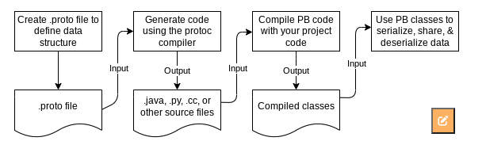

# 序列化

# Protobuf

# [官网](https://protobuf.dev/)

## Overview

https://protobuf.dev/overview/

>Protocol buffers are a combination of the definition language (created in `.proto` files), the code that the proto compiler generates to interface with data, language-specific runtime libraries, and the serialization format for data that is written to a file (or sent across a network connection).
>
>## What Problems do Protocol Buffers Solve?
>
>Protocol buffers are the most commonly-used data format at Google. **They are used extensively in inter-server communications as well as for archival storage of data on disk.** Protocol buffer *messages* and *services* are described by engineer-authored `.proto` files. 
>
>## What are the Benefits of Using Protocol Buffers?
>
>Some of the advantages of using protocol buffers include: 
>
>- **Compact data storage**
>- **Fast parsing**
>- **Availability in many programming languages**
>- **Optimized functionality through automatically-generated classes**
>
>**New code will also transparently read old messages. New fields will not be present in old messages; in these cases protocol buffers provide a reasonable default value.** (向前向后都兼容，缺失字段会提供默认值)
>
>### When are Protocol Buffers not a Good Fit?
>
>## How do Protocol Buffers Work?
>
>
>
>

## Tutorials

https://protobuf.dev/getting-started/

>
>
>

# 文章

## Protobuf 语法指南

https://colobu.com/2015/01/07/Protobuf-language-guide/

## Protobuf 初探

https://juejin.cn/post/6844904034428698637

>## Protobuf 的优点
>
>- 更小——序列化后，数据大小可缩小约3倍
>
>- 更快——序列化速度更快，比xml和JSON快20-100倍，体积缩小后，传输时，带宽也会优化
>
>- 更简单——proto编译器，自动进行序列化和反序列化
>
>- 维护成本低——跨平台、跨语言，多平台仅需要维护一套对象协议（.proto）
>
>- 可扩展——“向后”兼容性好，不必破坏已部署的、依靠“老”数据格式的程序就可以对数据结构进行升级
>
>- 加密性好——HTTP传输内容抓包只能看到字节。
>
>  在传输数据量大、网络环境不稳定的数据存储和RPC数据交换场景比较合适
>
>## Protobuf 的不足
>
>- 功能简单，无法用来表示复杂的概念
>- 通用性较差，XML和JSON已成为多种行业标准的编写工具，pb只是geogle内部使用
>- 自解释性差，以二进制数据流方式存储（不可读），需要通过.proto文件才可以
>
>
>
>作者：贾大星
>链接：https://juejin.cn/post/6844904034428698637
>来源：稀土掘金
>著作权归作者所有。商业转载请联系作者获得授权，非商业转载请注明出处。

## java序列化机制之protoStuff 

https://zhuanlan.zhihu.com/p/78781763

对原理的分析很清晰。

>**三、protoStuff底层是如何实现序列化的？**
>
>上面只是给出了一个基本的使用，并且对Protostuff序列化工具类中的字段和方法进行了一个简单的介绍，在这里我们深入的去分析一下到底底层是如何实现序列化和反序列化的，
>
>在上面序列化方法中，最核心的其实就是最后一句：data = ProtostuffIOUtil.toByteArray(obj, schema, buffer);如何实现序列化其实就在于这个toByteArray方法，我们深入这个方法中看看：
>
>```java
>public static <T> byte[] toByteArray(T message, Schema<T> schema, LinkedBuffer buffer){
>   if (buffer.start != buffer.offset)
>     throw new IllegalArgumentException("Buffer previously used and had not been reset.");
>
>   final ProtostuffOutput output = new ProtostuffOutput(buffer);
>   try{
>     //这才是实现序列化的核心
>      schema.writeTo(output, message);
>   }
>   catch (IOException e){
>       throw new RuntimeException("Serializing to a byte array threw an IOException " +
>               "(should never happen).", e);
>   }
>   return output.toByteArray();
>}
>```
>
>我们可以看到schema.writeTo(output, message);是真正的核心，我们继续追进去看看：
>
>```java
>public final void writeTo(Output output, T message) throws IOException{
>     for (Field<T> f : getFields())
>        f.writeTo(output, message);
>}
>```
>
>原来里面还有一层，没关系真正实现序列化的源头马上就要浮出水面了
>
>```java
>@Override
>public void writeTo(Output output, T message) throws IOException{
>         CharSequence value = (CharSequence)us.getObject(message, offset);
>         if (value != null)
>              output.writeString(number, value, false);
>}
>```
>
>看到了吧其实就是把序列化对象信息保存成CharSequence，然后序列化。
>
>对于反序列化呢？核心ProtostuffIOUtil.mergeFrom(data, obj, schema);我们也追进去看看
>
>```java
> public static <T> void mergeFrom(byte[] data, T message, Schema<T> schema){
>     IOUtil.mergeFrom(data, 0, data.length, message, schema, true);
> }
>```
>
>想要弄清楚，就想继续追进去看：
>
>```java
>static <T> void mergeFrom(byte[] data, int offset, int length, T message,
>      Schema<T> schema, boolean decodeNestedMessageAsGroup){
>     try{
>        final ByteArrayInput input = new ByteArrayInput(data, offset, length,
>              decodeNestedMessageAsGroup);
>        // 继续跟进
>        schema.mergeFrom(input, message);
>        input.checkLastTagWas(0);
>     }
>     catch (ArrayIndexOutOfBoundsException ae){
>        throw new RuntimeException("Truncated.", ProtobufException.truncatedMessage(ae));
>     }
>     catch (IOException e){
>        throw new RuntimeException("Reading from a byte array threw"+
>                   "an IOException (should never happen).", e);
>     }
>}
>```
>
>继续进去看看
>
>```java
>@Override
>public final void mergeFrom(Input input, T message) throws IOException{
>   // 按顺序获取字段
>   for (int n = input.readFieldNumber(this); n != 0; n = input.readFieldNumber(this)){
>       final Field<T> field = getFieldByNumber(n);
>       if (field == null){
>           input.handleUnknownField(n, this);
>       }
>       else{
>           field.mergeFrom(input, message);
>       }
>   }
>}
>```
>
>OK，真正马上出来了，有点耐心继续跟进去：
>
>```java
>public void mergeFrom(Input input, T message)throws IOException{
>    // 负载给字段
>    us.putObject(message, offset, input.readString());
>}
>```
>
>到了这一步了，应该就明白了吧。
>
>

## [Protobuf与JAVA](https://blog.csdn.net/joeyon1985/article/details/78428232)

>我们在开发一些RPC调用的程序时，通常会涉及到对象的序列化/反序列化的问题，比如一个“Person”对象从Client端通过TCP方式发送到Server端；因为TCP协议(UDP等这种低级协议)只能发送字节流，所以需要应用层将Java对象序列化成字节流，数据接收端再反序列化成Java对象即可。“序列化”一定会涉及到编码（encoding，format），目前我们可选择的编码方式：
>
>1）使用JSON，将java对象转换成JSON结构化字符串。在web应用、移动开发方面等，基于Http协议下，这是常用的，因为JSON的可读性较强。性能稍差。
>
>2）基于XML，和JSON一样，数据在序列化成字节流之前，都转换成字符串。可读性强，性能差，异构系统、open api类型的应用中常用。
>
>3）使用JAVA内置的编码和序列化机制，可移植性强，性能稍差。无法跨平台（语言）。
>
>4）其他开源的序列化/反序列化框架，比如Apache Avro，Apache Thrift，这两个框架和Protobuf相比，性能非常接近，而且设计原理如出一辙；其中Avro在大数据存储（RPC数据交换，本地存储）时比较常用；Thrift的亮点在于内置了RPC机制，所以在开发一些RPC交互式应用时，Client和Server端的开发与部署都非常简单。 
>
>评价一个序列化框架的优缺点，大概有2个方面：1）结果数据大小，原则上说，序列化后的数据尺寸越小，传输效率越高。 2）结构复杂度，这会影响序列化/反序列化的效率，结构越复杂，越耗时。 
>
>Protobuf是一个高性能、易扩展的序列化框架，它的性能测试有关数据可以参看官方文档。通常在TCP Socket通讯（RPC调用）相关的应用中使用；它本身非常简单，易于开发，而且结合Netty框架可以非常便捷的实现一个RPC应用程序，同时Netty也为Protobuf解决了有关Socket通讯中“半包、粘包”等问题（反序列化时，字节成帧）。

## protobuf 与 protostuff 区别

https://www.cnblogs.com/zhaoxinshanwei/p/8482358.html

使用JDK的序列化，也即在需要序列化的类上implements Serializable接口去实现序列化，我想说的是这种方式在小系统中尚且可以用一用，如果是并发很大的系统会受到严重影响，这是由于JDK自带的序列化效率很低，不论是时间上还是空间上。我们经常使用的序列化方式还有XML和Json，说实在的我更多的是使用Json，我觉得它很方便很友好，但这些都不够好，我今天要将的是google开发的开源的序列化方案**protocol buffer（简称protobuf），它的好处很多，独立于语言，独立于平台，最最重要的是它的效率相当高，用protobuf序列化后的大小是json的10分之一，xml格式的20分之一，是二进制序列化的10分之一，**是不是很心动。其实我也刚接触这个好东西，写下此篇博客就当一个学习笔记吧。

* protobuf 需要写 .proto 文件，如果我们需要序列化的类非常多，那么我们是不是得写非常多的.proto文件，并且还需要更新它们，这个代价可以想象一下也是非常大的。那么，接下来我们就来讲一讲protostuff，看这名字是不是跟protobuf很像，嗯，它们是有关系，前者就是基于后者实现的。
* protostuff 是一个基于 protobuf 实现的序列化方法，它较于protobuf最明显的好处是，**在几乎不损耗性能的情况下做到了不用我们写.proto文件来实现序列化**。使用它也非常简单，所以直接上代码。

```java
package gudao.red.protostuff;  
  
import java.util.Arrays;  
import java.util.List;  
  
public class Po {  
      
    private Integer id;  
    private String name;  
    private String remark;  
    private Integer age;  
    private int[] array;  
    private InnerPo innerPo;  
    private List<String> more;  
      
    public Po(){}  
      
    public Po(Integer id,String name,String remark,Integer age,  
            int[] array,InnerPo innerPo,List<String> more){  
        this.id = id;  
        this.name = name;  
        this.remark = remark;  
        this.age = age;  
        this.array = array;  
        this.innerPo = innerPo;  
        this.more = more;  
    }  
      
    public Integer getId() {  
        return id;  
    }  
    public void setId(Integer id) {  
        this.id = id;  
    }  
    public String getName() {  
        return name;  
    }  
    public void setName(String name) {  
        this.name = name;  
    }  
    public String getRemark() {  
        return remark;  
    }  
    public void setRemark(String remark) {  
        this.remark = remark;  
    }  
    public Integer getAge() {  
        return age;  
    }  
    public void setAge(Integer age) {  
        this.age = age;  
    }  
    public int[] getArray() {  
        return array;  
    }  
    public void setArray(int[] array) {  
        this.array = array;  
    }  
    public InnerPo getInnerPo() {  
        return innerPo;  
    }  
    public void setInnerPo(InnerPo innerPo) {  
        this.innerPo = innerPo;  
    }  
  
    public List<String> getMore() {  
        return more;  
    }  
  
    public void setMore(List<String> more) {  
        this.more = more;  
    }  
    
    @Override  
    public String toString() {  
          
        StringBuffer sb = new StringBuffer();  
        sb.append("id:"+id+"\n");  
        sb.append("name:"+name+"\n");  
        sb.append("remark:"+remark+"\n");  
        sb.append("age:"+age+"\n");  
        sb.append("array:"+Arrays.toString(array)+"\n");  
        sb.append("innerPo:"+innerPo.toString()+"\n");  
        sb.append("more:"+more);  
        return  sb.toString();  
    }       
}  
```


```java
package gudao.red.protostuff;  
  
import java.util.ArrayList;  
import java.util.List;  
  
import com.dyuproject.protostuff.LinkedBuffer;  
import com.dyuproject.protostuff.ProtostuffIOUtil;  
import com.dyuproject.protostuff.runtime.RuntimeSchema;  
  
public class ProtostuffTest {  
      
    static RuntimeSchema<Po> poSchema = RuntimeSchema.createFrom(Po.class);   
   
  private static byte[] decode(Po po){  
        return ProtostuffIOUtil.toByteArray(po, poSchema, LinkedBuffer.allocate(LinkedBuffer.DEFAULT_BUFFER_SIZE));  
    }  
      
    private static Po ecode(byte[] bytes){  
        Po po = poSchema.newMessage();  
        ProtostuffIOUtil.mergeFrom(bytes, po, poSchema);  
        return po;  
    } 
      
    public static void main(String[] args) {  
        InnerPo innerPo = new InnerPo(1, "InnerPo1");  
        List<String> list = new ArrayList<String>();  
        list.add("a");  
        list.add("b");  
        Po po = new Po(1, "Fong", "备注", 24, new int[]{1,2,3,4},innerPo,list);  
        byte[] bytes = decode(po);  
        System.out.println(bytes.length);  
        Po newPo = ecode(bytes);  
        System.out.println(newPo);  
    }  
  
}  
```

## [Google Protobuf ByteString vs. Byte[\]](https://stackoverflow.com/questions/29018411/google-protobuf-bytestring-vs-byte)

**A `ByteString` gives you the ability to perform more operations on the underlying data without having to copy the data into a new structure.** For instance, if you wanted to provide a subset of `bytes` in a `byte[]` to another method, you would need to supply it with a start index and an end index. You can also concatenate `ByteStrings` without having to create a new data structure and manually copy the data. 

However, with a `ByteString` you can give the method a subset of that data without the method knowing anything about the underlying storage. Just like a a substring of a normal String.

**A String is for representing text and is *not* a good way to store binary data (as not all binary data has a textual equivalent unless you encode it in a manner that does: e.g. hex or Base64).**

# Kryo

## [序列化-Kryo的使用详解](https://blog.csdn.net/w727655308/article/details/121879000)

对 Kryo 的使用方式，常见 api 的介绍 比较清晰，容易理解。

>## 1. 简单使用
>
>```java
>public static byte[] serialize(UserDto dto) {
>		Kryo kryo = new Kryo();
>		kryo.register(UserDto.class);
>		ByteArrayOutputStream bos = new ByteArrayOutputStream();
>		Output output = new Output(bos);
>		kryo.writeObject(output,dto);//写入null时会报错
>		output.close();
>		return bos.toByteArray();
>}
>
>public static UserDto deserialize(byte[] bytes) {
>		Kryo kryo = new Kryo();
>		kryo.register(UserDto.class);
>		ByteArrayInputStream bis = new ByteArrayInputStream(bytes);
>		Input input = new Input(bis);
>		UserDto userDto = kryo.readObject(input, UserDto.class);//读出null时会报错
>		input.close();
>		return userDto;
>	}
>
>```
>
>正常情况下, 序列化类必须包含无参构造.
>
>## 2. 两种读写方式
>
>根据是否写入class类型分为两种方式, 这里特别指出这里的的class指的是读写对象的class, 如果读写的是有嵌套类型对象,则不管采用哪种方式, 子类型class都会序列化.
>
>### 2.1 只写实例信息
>
>- 知道class且对象不为null
>
>```java
>kryo.writeObject(output, someObject);
>   // ...
>SomeClass someObject = kryo.readObject(input, SomeClass.class);
>
>```
>
>- 知道class且对象可能为null
>
>```java
>kryo.writeObjectOrNull(output, someObject);
>   // ...
>SomeClass someObject = kryo.readObjectOrNull(input, SomeClass.class);
>
>```
>
>### 2.2 同时写入class类型和实例信息
>
>class 未知且对象可能为null, 但这种场景, 会多占用空间. 这种方式是我们在RPC中应当使用的方式
>
>```java
>kryo.writeClassAndObject(output, object);
>// ...
>Object object = kryo.readClassAndObject(input);
>if (object instanceof SomeClass) {
> // ...
>}
>
>```
>
>## 3 相关配置参数
>
>- 类注册
>
>kryo 支持通过类注册, 注册会给每一个class一个int类型的Id相关联，这显然比类名称高效，但同时要求反序列化的时候的Id必须与序列化过程中一致。这意味着注册的顺序非常重要。
>
>但是由于现实原因，同样的代码，同样的Class在不同的机器上注册编号任然不能保证一致，所以多机器部署时候反序列化可能会出现问题。所以kryo默认会开启类注册(version:5.0.2)，可以通过kryo.setRegistrationRequired(false)关闭, 关闭后Kryo会根据类型去loadClass关联
>
>```java
>kryo.setRegistrationRequired(false);//一般设置为false
>```
>
>- 循环引用检测
>
>对循环引用的支持，可以有效防止栈内存溢出，kryo默认会打开这个属性。当你确定不会有循环引用发生的时候，可以通过`kryo.setReferences(false);` 关闭循环引用检测，从而提高一些性能。
>
>```java
>kryo.setRegistrationRequired(true);//大多数情况下，请保持kryo.setReferences(true)
>```
>
>- 实例化器
>
>```java
>kryo.setInstantiatorStrategy(new Kryo.DefaultInstantiatorStrategy(
>                   new StdInstantiatorStrategy()));
>```
>
>上面这句话显式指定了实例化器。
>
>在一些依赖了kryo的开源软件中，可能由于实例化器指定的问题而抛出空指针异常。例如hive的某些版本中，默认指定了StdInstantiatorStrategy。
>
>```java
>public static ThreadLocal<Kryo> runtimeSerializationKryo = new ThreadLocal<Kryo>() {
>   @Override
>   protected synchronized Kryo initialValue() {
>     Kryo kryo = new Kryo();
>     kryo.setClassLoader(Thread.currentThread().getContextClassLoader());
>     kryo.register(java.sql.Date.class, new SqlDateSerializer());
>     kryo.register(java.sql.Timestamp.class, new TimestampSerializer());
>     kryo.register(Path.class, new PathSerializer());
>     kryo.setInstantiatorStrategy(new StdInstantiatorStrategy());
>     ......
>     return kryo;
>   };
> };
>
>```
>
>而StdInstantiatorStrategy在是依据JVM version信息及JVM vendor信息创建对象的，可以不调用对象的任何构造方法创建对象。那么例如碰到ArrayList这样的对象时候，就会出问题。观察一下ArrayList的源码：
>
>```java
>public ArrayList() {
>       this.elementData = DEFAULTCAPACITY_EMPTY_ELEMENTDATA;
>   }
>
>```
>
>既然没有调用构造器，那么这里elementData会是NULL，那么在调用类似ensureCapacity方法时，就会抛出一个异常。
>
>```java
>public void ensureCapacity(int minCapacity) {
>       if (minCapacity > elementData.length
>           && !(elementData == DEFAULTCAPACITY_EMPTY_ELEMENTDATA
>                && minCapacity <= DEFAULT_CAPACITY)) {
>           modCount++;
>           grow(minCapacity);
>       }
>   }
>
>```
>
>解决方案很简单，就如框架中代码写的一样，显示指定实例化器，首先使用默认无参构造策略DefaultInstantiatorStrategy，若创建对象失败再采用StdInstantiatorStrategy。
>
>## 4. 解决线程不安全
>
>由于Kryo线程不安全, 意味着每次序列化和反序列化时都需要实例化一次, 或借助ThreadLocal来维护以保证其线程安全。
>
>```java
>private static final ThreadLocal<Kryo> kryos = new ThreadLocal<Kryo>() {
>   protected Kryo initialValue() {
>       Kryo kryo = new Kryo();
>       // configure kryo instance, customize settings
>       return kryo;
>   };
>};
>// Somewhere else, use Kryo
>Kryo k = kryos.get();
>...
>
>```
>
>或者使用kryo提供的pool:
>
>```java
>public KryoPool newKryoPool() {
>       return new KryoPool.Builder(() -> {
>           final Kryo kryo = new Kryo();
>           kryo.setInstantiatorStrategy(new Kryo.DefaultInstantiatorStrategy(
>                   new StdInstantiatorStrategy()));
>           return kryo;
>       }).softReferences().build();
>}
>
>```
>
>## 5.解决增删字段
>
>kryo默认不支持Bean中增删字段
>
>在实际开发中，class增删字段是很常见的事情，但对于kryo来说，确是不支持的，而如果恰好需要(集群)缓存数据，那么这个问题会被放得更大。例如一个对象使用kryo序列化后，数据放入了缓存中，而这时候如果这个对象增删了一个属性，那么缓存中反序列化的时候就会报错。所以频繁使用缓存的场景，可以尽量避免kryo。
>
>不过现在的Kryo提供了兼容性的支持，使用CompatibleFieldSerializer.class，在kryo.writeClassAndObject时候写入的信息如下:
>
>```java
>class name|field length|field1 name|field2 name|field1 value| filed2 value
>```
>
>而在读入kryo.readClassAndObject时，会先读入field names，然后匹配当前反序列化类的field和顺序再构造结果。`对两种读写方式均有效`. 当然如果在做好缓存隔离的情况下，这一切都不用在意。
>
>```java
>kryo.setDefaultSerializer(new SerializerFactory.CompatibleFieldSerializerFactory());
>```
>
>也可以换成支持增减字段的其他框架, 如protoBuff.
>
>## 6. 使用模版类
>
>```java
>public class KryoSerializer {
>   private static final ThreadLocal<Kryo> kryoLocal = ThreadLocal.withInitial(() -> {
>		Kryo kryo = new Kryo();
>		kryo.setReferences(true);//检测循环依赖，默认值为true,避免版本变化显式设置
>		kryo.setRegistrationRequired(false);//默认值为true，避免版本变化显式设置
>		((DefaultInstantiatorStrategy) kryo.getInstantiatorStrategy())
>			.setFallbackInstantiatorStrategy(new StdInstantiatorStrategy());//设定默认的实例化器
>		return kryo;
>	});
>
>	public byte[] serialize(Object obj) {
>		Kryo kryo = getKryo();
>		ByteArrayOutputStream byteArrayOutputStream = new ByteArrayOutputStream();
>		Output output = new Output(byteArrayOutputStream);
>		kryo.writeClassAndObject(output, obj);
>		output.close();
>		return byteArrayOutputStream.toByteArray();
>	}
>
>	public <T> T deserialize(byte[] bytes) {
>		Kryo kryo = getKryo();
>		Input input = new Input(new ByteArrayInputStream(bytes));
>		return (T) kryo.readClassAndObject(input);
>	}
>
>	private Kryo getKryo() {
>		return kryoLocal.get();
>	}
>}
>
>```


