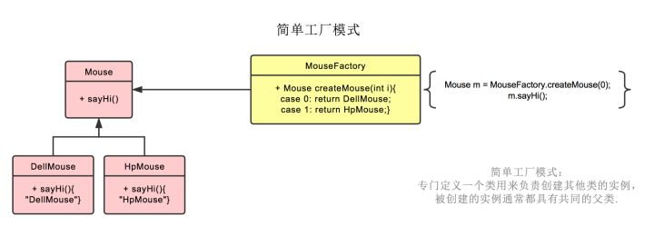
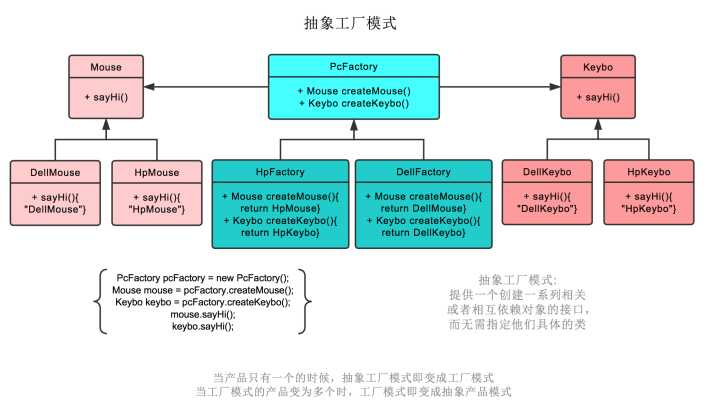
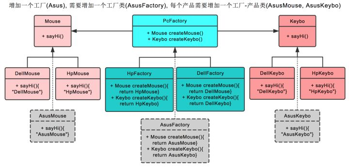
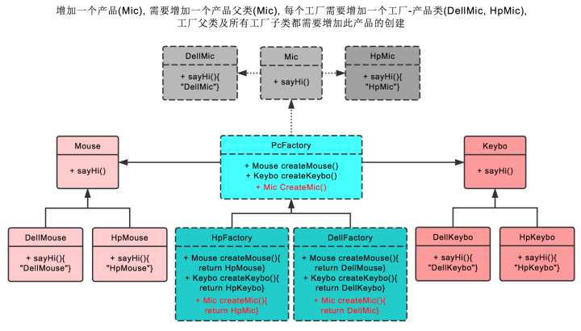

# 设计模式

## 工厂模式

### 抽象工厂模式和工厂模式的区别？

作者：名姓
链接：https://www.zhihu.com/question/20367734/answer/115807228    （清晰、简洁）

### **工厂模式可以分为三类：**

- 简单工厂模式（Simple Factory）
- [工厂方法模式](https://www.zhihu.com/search?q=工厂方法模式&search_source=Entity&hybrid_search_source=Entity&hybrid_search_extra={"sourceType"%3A"answer"%2C"sourceId"%3A1089721250})（Factory Method）
- 抽象工厂模式（Abstract Factory）

这三种工厂模式在设计模式的分类中都属于**创建型模式**，三种模式从上到下逐步抽象。

### **创建型模式**

创建型模式(Creational Pattern)对类的实例化过程进行了抽象，能够将软件模块中对象的创建和对象的使用分离。为了使软件的结构更加清晰，外界对于这些对象只需要知道它们共同的接口，而不清楚其具体的实现细节，使整个系统的设计更加符合**单一职责原则**。

创建型模式隐藏了类的实例的创建细节，通过隐藏对象如何被创建和组合在一起达到使整个系统独立的目的。

工厂模式是创建型模式中比较重要的。工厂模式的主要功能就是帮助我们实例化对象。之所以名字中包含工厂模式四个字，是因为对象的实例化过程是通过工厂实现的，是用工厂代替new操作的。

### 工厂模式适用场景

不管是简单工厂模式，工厂方法模式还是抽象工厂模式，他们具有类似的特性，所以他们的适用场景也是类似的。

首先，作为一种创建类模式，在任何需要生成**复杂对象**的地方，都可以使用工厂方法模式。有一点需要注意的地方就是复杂对象适合使用工厂模式，而简单对象，特别是只需要通过new就可以完成创建的对象，无需使用工厂模式。如果使用工厂模式，就需要引入一个工厂类，会增加系统的复杂度。

其次，工厂模式是一种典型的**解耦模式**，[迪米特法则](https://www.zhihu.com/search?q=迪米特法则&search_source=Entity&hybrid_search_source=Entity&hybrid_search_extra={"sourceType"%3A"answer"%2C"sourceId"%3A1089721250})在工厂模式中表现的尤为明显。假如调用者自己组装产品需要增加依赖关系时，可以考虑使用工厂模式。将会大大降低对象之间的耦合度。

再次，由于工厂模式是依靠抽象架构的，它把实例化产品的任务交由实现类完成，**扩展性比较好**。也就是说，当需要系统有比较好的扩展性时，可以考虑工厂模式，不同的产品用不同的实现工厂来组装。

>**简单工厂模式**
>
>简单工厂模式不是23种里的一种，简而言之，就是有一个专门生产某个产品的类。 比如下图中的鼠标工厂，专业生产鼠标，给参数0，生产[戴尔鼠标](https://www.zhihu.com/search?q=戴尔鼠标&search_source=Entity&hybrid_search_source=Entity&hybrid_search_extra={"sourceType"%3A"answer"%2C"sourceId"%3A115807228})，给参数1，生产惠普鼠标。
>**工厂模式**  
>工厂模式也就是鼠标工厂是个父类，有生产鼠标这个接口。 戴尔鼠标工厂，惠普鼠标工厂继承它，可以分别生产戴尔鼠标，惠普鼠标。  生产哪种鼠标不再由参数决定，而是创建鼠标工厂时，由戴尔鼠标工厂创建。  后续直接调用鼠标工厂.生产鼠标()即可  
>**抽象工厂模式**  
>抽象工厂模式也就是不仅生产鼠标，同时生产键盘。 也就是PC厂商是个父类，有生产鼠标，生产键盘两个接口。  戴尔工厂，惠普工厂继承它，可以分别生产戴尔鼠标+[戴尔键盘](https://www.zhihu.com/search?q=戴尔键盘&search_source=Entity&hybrid_search_source=Entity&hybrid_search_extra={"sourceType"%3A"answer"%2C"sourceId"%3A115807228})，和惠普鼠标+惠普键盘。  创建工厂时，由戴尔工厂创建。  后续工厂.生产鼠标()则生产戴尔鼠标，工厂.生产键盘()则生产戴尔键盘。  
>***在抽象工厂模式中，假设我们需要增加一个工厂\***
>假设我们增加华硕工厂，则我们需要增加华硕工厂，和戴尔工厂一样，继承PC厂商。  之后创建[华硕鼠标](https://www.zhihu.com/search?q=华硕鼠标&search_source=Entity&hybrid_search_source=Entity&hybrid_search_extra={"sourceType"%3A"answer"%2C"sourceId"%3A115807228})，继承鼠标类。创建华硕键盘，继承键盘类。  即可。  
>***在抽象工厂模式中，假设我们需要增加一个产品\***
>假设我们增加耳麦这个产品，则首先我们需要增加耳麦这个父类，再加上[戴尔耳麦](https://www.zhihu.com/search?q=戴尔耳麦&search_source=Entity&hybrid_search_source=Entity&hybrid_search_extra={"sourceType"%3A"answer"%2C"sourceId"%3A115807228})，惠普耳麦这两个子类。 之后在PC厂商这个父类中，增加生产耳麦的接口。最后在戴尔工厂，惠普工厂这两个类中，分别实现生产戴尔耳麦，惠普耳麦的功能。  以上。
>
>  
>
>

作者：贾不假
链接：https://www.zhihu.com/question/20367734/answer/1089721250
来源：知乎
著作权归作者所有。商业转载请联系作者获得授权，非商业转载请注明出处。

### **2.3 工厂方法模式适用场景**

工厂方法模式和简单工厂模式虽然都是通过工厂来创建对象，他们之间最大的不同是——工厂方法模式在设计上完全完全符合“**开闭原则**”。 

在以下情况下可以使用工厂方法模式：

- **一个类不知道它所需要的对象的类**：在工厂方法模式中，客户端不需要知道具体产品类的类名，只需要知道所对应的工厂即可，具体的产品对象由具体工厂类创建；客户端需要知道创建具体产品的工厂类。
- **一个类通过其子类来指定创建哪个对象**：在工厂方法模式中，对于抽象工厂类只需要提供一个创建产品的接口，而由其子类来确定具体要创建的对象，利用面向对象的多态性和里氏代换原则，在程序运行时，子类对象将覆盖父类对象，从而使得系统更容易扩展。
- **将创建对象的任务委托给多个工厂子类中的某一个，客户端在使用时可以无须关心是哪一个工厂子类创建产品子类，需要时再动态指定，可将具体工厂类的类名存储在配置文件或数据库中。**

### **三、抽象工厂模式**

工厂方法模式通过引入工厂等级结构，解决了简单工厂模式中工厂类职责太重的问题，但**由于工厂方法模式中的每个工厂只生产一类产品，可能会导致系统中存在大量的工厂类，势必会增加系统的开销。此时，我们可以考虑将一些相关的产品组成一个“产品族”，由同一个工厂来统一生产，这就是抽象工厂模式的基本思想。**

