# java 基础专题

## 什么是Core Dump?

https://blog.csdn.net/ljx0305/article/details/4065082

>**什么是Core Dump?**
>Core的意思是内存, Dump的意思是扔出来, 堆出来.
>开发和使用Unix程序时, 有时程序莫名其妙的down了, 却没有任何的提示(有时候会提示 core dumped ). 这时候可以查看一下有没有形如core.进程号的文件生成, 这个文件便是操作系统把程序down掉时的内存内容扔出来生成的, 它可以做为调试程序的参考. 
>core dump又叫核心转储, 当程序运行过程中发生异常, 程序异常退出时, 由操作系统把程序当前的内存状况存储在一个core文件中, 叫core dump.
>
>**如何使用core文件?**
>gdb -c core文件路径 [应用程序的路径]
>进去后输入where回车, 就可以显示程序在哪一行当掉的, 在哪个函数中.
>
>**为什么没有core文件生成呢?**
>有时候程序down了, 但是core文件却没有生成. core文件的生成跟你当前系统的环境设置有关系, 可以用下面的语句设置一下, 然后再运行程序便成生成core文件.
>ulimit -c unlimited
>core文件生成的位置一般于运行程序的路径相同, 文件名一般为core.进程号
>
>\4. 用gdb查看core文件:
>下面我们可以在发生运行时信号引起的错误时发生core dump了.
>发生core dump之后, 用gdb进行查看core文件的内容, 以定位文件中引发core dump的行.
>gdb [exec file] [core file]
>如:
>gdb ./test test.core
>在进入gdb后, 用bt命令查看backtrace以检查发生程序运行到哪里, 来定位core dump的文件->行.
>
>

## Java反射如何获取jar包下的某个类的所有子类？

Java反射如何获取jar包下的某个类的所有子类？ - 强哥叨逼叨的回答 - 知乎
https://www.zhihu.com/question/494993864/answer/2193034342

>首本来觉得实现这个功能应该挺简单的，而且市面上也已经有了开源的工具比如：Reflections，简单的两句代码就能实现这个功能：
>
>```java
>Reflections reflections = new Reflections("my.project");
>Set<Class<? extends SomeType>> subTypes = reflections.getSubTypesOf(SomeType.class);
>```
>
>这个在本地Idea调试时确实也都比较好用。不过，当遇到需要加载依赖[jar](https://www.zhihu.com/search?q=jar&search_source=Entity&hybrid_search_source=Entity&hybrid_search_extra={"sourceType"%3A"answer"%2C"sourceId"%3A2193034342})里的对象时，在部署启动Tomcat服务的时候就会遇到无法到子类的问题。

## try-with-resources语法详解

https://blog.csdn.net/qq_42449963/article/details/124372736

>### 六、异常情况处理
>
>**前提：** 使用try-with-resources写法
>
>**情况1：** try中发生异常，同时close方法也出现异常
>
>catch中只会捕获try中的异常，而会压制close()方法中出现的异常，当然前提是catch中捕获的异常范围符合要求
>
>**情况2：** try中不发生异常，而close方法也出现异常
>
>catch中将捕获close()方法中出现的异常，当然前提是catch中捕获的异常范围符合要求

## UML 的九种模型图

https://blog.51cto.com/u_16088628/6226372

>标准建模语言UML可以由下列5类图来定义。
>
>用例图：从用户角度描述系统功能，并指出各功能的操作者。
>静态图：包括类图和对象图。类图描述系统中类的静态结构，不仅定义系统中的类，表示类之间的联系，如关联、依赖、聚合等，也包括类的属性和操作，类图描述的是一种静态关系，在系统的整个生命周期都是有效的。对象图是类图的实例，几乎使用与类图完全相同的标识。一个对象图是类图的一个实例。由于对象存在生命周期，因此对象图只能在系统某一时间段存在。
>行为图：描述系统的动态模型和组成对象间的交互关系，包括状态图和活动图。状态图描述类的对象所有可能的状态以及事件发生时状态的转移条件，状态图是对类图的补充，活动图描述满足用例要求所要进行的活动以及活动间的约束关系，有利于识别并进行活动。
>交互图：**描述对象间的交互关系，包括时序图和协作图。**时序图显示对象之间的动态合作关系，它强调对象之间消息发送的顺序，同时显示对象之间的交互；协作图描述对象间的协作关系，协作图跟时序图相似，显示对象间的动态合作关系。除显示信息交换外，协作图还显示对象以及它们之间的关系。如果强调时间和顺序，则使用时序图；如果强调上下级关系，则选择协作图。
>实现图：包括组件图和部署图。组件图描述代码部件的物理结构及各部件之间的依赖关系，组件图有助于分析和理解部件之间的相互影响程度；部署图定义系统中软硬件的物理体系结构。
>
>采用 UML 来设计系统时，**第一步是描述需求；第二步根据需求建立系统的静态模型，以构造系统的结构；第三步是描述系统的行为。**其中在**第一步与第二步中所建立的模型都是静态的，包括用例图、类图、对象图、组件图和部署图等5种图形，**是标准建模语言UML的**静态建模机制**。其中**第三步中所建立的模型或者可以执行，或者表示执行时的时序状态或交互关系。它包括状态图、活动图、时序图和协作图等4种图形**，是标准建模语言UML的**动态建模机制**。
>
>

## 理解ClassNotFoundException与NoClassDefFoundError的区别

https://cloud.tencent.com/developer/article/1356060

>## ClassNotFoundException
>
>先来说说第一个异常提示名字已经非常友好了，就是告诉我们使用类加载器就加载某个类的时候，发现所有的path下面都没有找到，从引导类路径，扩展类路径到当前的classpath下全部没有找到，就会抛出上面的异常，最常见的例子就是加载JDBC驱动包的时候，它的依赖jar并不在classpath里面。
>
>这种情况下，其实就是类找不到，通常在执行下面的方法时容易抛出：
>
>```java
>Class.forName(),
>ClassLoader.loadClass()  
>ClassLoader.findSystemClass()
>```
>
>## NoClassDefFoundError
>
>这个错误，主要有两种情况：
>
>（1）编译时存在某个类，但是运行时却找不到。
>
>（2）第二种情况，**类根本就没有初始化成功，结果你还把它当做正常类使用，所以这事也不小，必须抛出ERROR告诉你不能再使用了。**
>
>看下面的一段代码：
>
>```javascript
>public class  Loading {
>
>    static double i=1/0;//故意使得类初始化失败.
>
>    public static void print(){
>        System.out.println("123");
>    }
>}
>```
>
>调用如下：
>
>```javascript
>public static void main(String[] args) {
>
>        try {
>            double i=Loading.i;
>        } catch (Throwable e) {
>        //此处，必须用Throwable，用Exception会直接退出.
>            System.out.println(e);
>        }
>        //继续使用.
>        Loading.print();
>    }
>```
>
>结果如下：
>
>```javascript
>Exception in thread "main" java.lang.NoClassDefFoundError: Could not initialize class class_loader.exception.Loading
>java.lang.ExceptionInInitializerError
>    at class_loader.exception.NoClassFoundErrorTest.main(NoClassFoundErrorTest.java:18)
>    at sun.reflect.NativeMethodAccessorImpl.invoke0(Native Method)
>    at sun.reflect.NativeMethodAccessorImpl.invoke(NativeMethodAccessorImpl.java:62)
>    at sun.reflect.DelegatingMethodAccessorImpl.invoke(DelegatingMethodAccessorImpl.java:43)
>    at java.lang.reflect.Method.invoke(Method.java:498)
>    at com.intellij.rt.execution.application.AppMain.main(AppMain.java:147)
>```
>
>注意这种情况比较特殊，并不是因为编译时和运行时环境不一致导致的，而是对于一个类如果初始化失败后，你还继续使用，那么JVM会认为是不正常的，由于它第一次调用已经失败，JVM就会假设后面继续调用肯定仍然会失败，所以直接抛ERROR给客户端。
>
>这里需要注意，类初始化失败的异常是：
>
>```java
>java.lang.ExceptionInInitializerError
>```
>
>也是一个严重级别的错误。
>
>总结：
>
>本文主要对比介绍了ClassNotFoundException与NoClassDefFoundError的区别和发生条件，从上面的测试我们可以分析出，直接采用反射或者类加载器的loadClass方法去动态加载一个所有classpath里面的都不存在的类，类加载器在运行时的load阶段就会直接抛出ClassNotFoundException异常。此外jvm认为这个异常是可以被预知的需要提前被check。对于另一种请情况，如果在编译时候正常，但在运行时执行new关键词的时候，发现依赖类找不到，或者是对于初始化失败的一个类，再次访问其静态成员或者方法，那么会直接抛出NoClassDefFoundError错误。这两种异常本质上的侧重点还是不一样的，前者侧重在类加载器加载阶段找不到类信息，后者则侧重在使用阶段时却出现了问题比如实例化依赖类找不到或者类本身就初始化失败了。


## JDK1.8HashMap也会死循环？记一次线上问题排查经历

http://sd.jd.com/article/17023?shareId=81296&isHideShareButton=1

>## 问题追踪
>
>首先查看线上占用 cpu 最高的线程栈信息，命令组合如下： 
>
>```
>1. top //查看，占用 cpu 比较高的进程id 
>2. top -H -p <pid> //查看当前进程下占用最高的线程栈，记录tid
>3. printf "%x\n" <tid> //将tid转换为16进制
>4. jstack <pid> | grep <tid~16> -A 50 //查看线程栈信息
>```
>
>最终触发了死循环，代码一直处于执行状态，此时将jvm快照进行dump，并使用jprofiler软件分析发现，在转红黑树的过程中，出现了自我引用的对象，并且其堆栈信息和线上问题代码一致，如图9所示：
>
>
>
>
>
>
>
>图9 复现代码HashMap对象及堆栈信息
>
>通过debug balanceInsertion代码，发现在执行for循环时由于自我引用对象的存在，导致循环永远执行。
>
>
>
>图10 jdk1.8 死循环复现

## 如何读懂火焰图？

https://www.ruanyifeng.com/blog/2017/09/flame-graph.html

>## 一、perf 命令
>
>让我们从 perf 命令（performance 的缩写）讲起，它是 Linux 系统原生提供的性能分析工具，会返回 CPU 正在执行的函数名以及调用栈（stack）。
>
>通常，它的执行频率是 99Hz（每秒99次），如果99次都返回同一个函数名，那就说明 CPU 这一秒钟都在执行同一个函数，可能存在性能问题。  
>
>> ```bash
>> $ sudo perf record -F 99 -p 13204 -g -- sleep 30
>> ```
>
>上面的代码中，`perf record`表示记录，`-F 99`表示每秒99次，`-p 13204`是进程号，即对哪个进程进行分析，`-g`表示记录调用栈，`sleep 30`则是持续30秒。 
>
>运行后会产生一个庞大的文本文件。如果一台服务器有16个 CPU，每秒抽样99次，持续30秒，就得到 47,520 个调用栈，长达几十万甚至上百万行。 
>
>为了便于阅读，`perf record`命令可以统计每个调用栈出现的百分比，然后从高到低排列。
>
>> ```bash
>> $ sudo perf report -n --stdio
>> ```
>
>
>
>这个结果还是不易读，所以才有了火焰图。
>
>## 二、火焰图的含义
>
>火焰图是基于 perf 结果产生的 [SVG 图片](http://queue.acm.org/downloads/2016/Gregg4.svg)，用来展示 CPU 的调用栈。
>
>[](http://queue.acm.org/downloads/2016/Gregg4.svg)
>
>y 轴表示调用栈，每一层都是一个函数。调用栈越深，火焰就越高，顶部就是正在执行的函数，下方都是它的父函数。
>
>x 轴表示抽样数，如果一个函数在 x 轴占据的宽度越宽，就表示它被抽到的次数多，即执行的时间长。注意，x 轴不代表时间，而是所有的调用栈合并后，按字母顺序排列的。
>
>**火焰图就是看顶层的哪个函数占据的宽度最大。只要有"平顶"（plateaus），就表示该函数可能存在性能问题。**
>
>颜色没有特殊含义，因为火焰图表示的是 CPU 的繁忙程度，所以一般选择暖色调。
>
>有了这个调用栈统计，[火焰图工具](https://github.com/brendangregg/FlameGraph)就能生成 SVG 图片。
>
>https://github.com/brendangregg/FlameGraph
>
>
>
>上面图片中，最顶层的函数`g()`占用 CPU 时间最多。`d()`的宽度最大，但是它直接耗用 CPU 的部分很少。`b()`和`c()`没有直接消耗 CPU。因此，如果要调查性能问题，首先应该调查`g()`，其次是`i()`。
>
>另外，从图中可知`a()`有两个分支`b()`和`h()`，这表明`a()`里面可能有一个条件语句，而`b()`分支消耗的 CPU 大大高于`h()`。

## Java诊断工具Arthass

## https://arthas.aliyun.com/doc/

>Arthas 是一款线上监控诊断产品，通过全局视角实时查看应用 load、内存、gc、线程 的状态信息，并能在不修改应用代码的情况下，对业务问题进行诊断，包括查看方法调用的出入参、异常，监测方法执行耗时，类加载信息等，大大提升线上问题排查效率。 
>
>## 背景
>
>通常，本地开发环境无法访问生产环境。如果在生产环境中遇到问题，则无法使用 IDE 远程调试。更糟糕的是，在生产环境中调试是不可接受的，因为它会暂停所有线程，导致服务暂停。
>
>开发人员可以尝试在测试环境或者预发环境中复现生产环境中的问题。但是，某些问题无法在不同的环境中轻松复现，甚至在重新启动后就消失了。
>
>如果您正在考虑在代码中添加一些日志以帮助解决问题，您将必须经历以下阶段：测试、预发，然后生产。这种方法效率低下，更糟糕的是，该问题可能无法解决，因为一旦 JVM 重新启动，它可能无法复现，如上文所述。
>
>Arthas 旨在解决这些问题。开发人员可以在线解决生产问题。无需 JVM 重启，无需代码更改。 Arthas 作为观察者永远不会暂停正在运行的线程。
>
>## [#](https://arthas.aliyun.com/doc/#arthas-阿尔萨斯-能为你做什么)Arthas（阿尔萨斯）能为你做什么？
>
>`Arthas` 是 Alibaba 开源的 Java 诊断工具，深受开发者喜爱。
>
>当你遇到以下类似问题而束手无策时，`Arthas`可以帮助你解决：
>
>1. 这个类从哪个 jar 包加载的？为什么会报各种类相关的 Exception？
>2. 我改的代码为什么没有执行到？难道是我没 commit？分支搞错了？
>3. 遇到问题无法在线上 debug，难道只能通过加日志再重新发布吗？
>4. 线上遇到某个用户的数据处理有问题，但线上同样无法 debug，线下无法重现！
>5. 是否有一个全局视角来查看系统的运行状况？
>6. 有什么办法可以监控到 JVM 的实时运行状态？
>7. 怎么快速定位应用的热点，生成火焰图？
>8. 怎样直接从 JVM 内查找某个类的实例？
>
>`Arthas` 支持 JDK 6+，支持 Linux/Mac/Windows，采用命令行交互模式，同时提供丰富的 `Tab` 自动补全功能，进一步方便进行问题的定位和诊断。
>
>

## 性能测试应该怎么做？

https://coolshell.cn/articles/17381.html

>
>
>

## 限流算法

https://www.51cto.com/article/747497.html

>## 四种限流算法
>
>常见的限流算法有4种，它们的实现原理和优缺点各不相同，在实际设计的时候需要根据业务场景来选择。
>
>1. **固定时间窗**
>
>固定时间窗算法的实现原理是，统计固定时间周期内的请求量或者资源消耗量，超过限额就会启动限流，如下图所示：
>
>
>
>优点：
>
>- 实现简单
>
>缺点：
>
>- 存在临界点问题。例如上图中的红蓝两点只间隔了短短10秒，期间的请求数却已经达到200，超过了算法规定的限额（1分钟内处理100）。但是因为这些**请求分别来自两个统计窗口，从单个窗口来看还没有超出限额，所以并不会启动限流，结果可能导致系统因为压力过大而挂掉。**
>
>2. **滑动时间窗**
>
>为了解决临界点问题，滑动时间窗算法应运而生，**它的实现原理是，两个统计周期部分重叠，从而避免短时间内的两个统计点分属不同的时间窗的情况**，如下图所示：
>
>
>
>优点：
>
>- 不存在临界点问题
>
>缺点：
>
>- 相对于固定窗口，复杂度有所提升
>
>3. **漏桶算法**
>
>**漏桶算法的实现原理是，将请求放入“桶”（消息队列等），业务处理单元（线程、进程和应用等）从桶里拿请求处理，桶满则丢弃新的请求**，如下图所示：
>
>
>
>优点：
>
>- 突发大量流量时丢弃的请求较少，因为漏桶本身有缓存请求的作用
>
>缺点：
>
>- 可以平滑流量，但是无法解决流量突增的问题。
>- 桶大小动态调整比较困难，需要不断的尝试才能找到符合业务需求的最佳桶大小。
>- 无法精确控制流出速度，也就是业务的处理速度。
>
>漏桶算法主要适用于瞬时高并发流量的场景（例如刚才提到的0点签到、整点秒杀等）。在短短几分钟内涌入大量请求时，为了更好的业务效果和用户体验，即使处理慢一些，也要做到尽量不丢弃用户请求。
>
>4. **令牌桶算法**
>
>**令牌桶算法和漏桶算法的不同之处在于，桶中放入的不是请求，而是“令牌”，这个令牌就是业务处理前需要拿到的“许可证”。也就是说，当系统收到一个请求时，先要到令牌桶里面拿“令牌”，拿到令牌才能进一步处理，拿不到就要丢弃请求。**
>
>它的实现原理是如下图所示：
>
>
>
>优点：
>
>- **通过控制放入令牌的速率，可以动态调整处理速率，实现更加灵活。**
>- **可以平滑限流，同时可以容忍突发流量，因为桶里面可以累积一定数量的令牌，当突发流量过来的时候，桶里面有累积的令牌，此时的业务处理速度会超过令牌放入的速度。**
>
>缺点：
>
>- **突发大量流量的时候可能丢弃很多请求，因为令牌桶不能累积太多令牌。**
>- **实现相对复杂。**
>
>令牌桶算法主要适用于两种典型的场景，**一种是需要控制访问第三方服务的速度，防止把下游压垮，例如支付宝需要控制访问银行接口的速率；另一种是需要控制自己的处理速度，防止过载，例如压测结果显示系统最大处理TPS是100，那么就可以用令牌桶来限制最大的处理速度。**
>
>## 三个限流位置
>
>1. **接入层限流**
>
>可以通过 Nginx、API 路由网关等对域名或IP进行限流，同时可以拦截非法请求。
>
>2. **应用限流**
>
>**每个服务可以有自己的单机或集群限流措施，也可以调用第三方的限流服务，比如阿里的Sentinel限流框架。**
>
>3. **基础服务限流**
>
>也可以对基础服务层进行限流。
>
>- 数据库：限制数据库连接、限制读写速率
>- 消息队列：限制消费速率（消费量、消费线程）
>
>## 总结
>
>本文从宏观角度总结了服务限流的两种方式，三个可以限流的位置，四种常见的限流算法，五种限流的策略。最后再补充几句，**合理的限流配置，需要了解系统的吞吐量，所以，限流一般需要结合容量规划和压测来进行。当外部请求接近或者达到系统的最大阈值时，触发限流，采取其他的手段进行降级，保护系统不被压垮。**


## ReflectASM 详解

>### 概述
>
>ReflectASM 是一个很小的java类库，它仅仅有5个类，但是却**提供了非常高性能的属性操作、方法调用、构造方法调用，它在底层使用了asm（https://www.ibm.com/developerworks/cn/java/j-lo-asm30/index.html）动态构建出字节码，这相比于反射，直接方法的调用性能高出很多。**
>
>可以看下官方给出的性能对比：
>
>
>
>### 原理分析
>
>以MethodAccess为例，使用方式很简单
>
>```kotlin
>MethodAccess access = MethodAccess.get(SomeClass.class);
>access.invoke(someObject, "setName", "abc");
>```
>
>通过get方法得到某个类的加强类，直接调用类上的setName完成方法的调用，主要的过程便是在get方法中，它通过asm生成SomeClass的代理类，实现了MethodAccess的invoke方法，方法的内容是生成SomeClass的所有方法的调用index，这样可以通过指定方法名称的方式调用类上的方法。直接调用类上方法的速度肯定要快于反射调用了
>
>### 复制类
>
>应用中用到从一个类到另外一个类的copy使用ReflectASM性能会好很多，具体的方式如下：
>其中对于耗时的get操作增加了缓存，代理类生成一次就够了.
>
>```java
>public class ReflectAsmManager {
>    private static final ConcurrentMap<Class, MethodAccess> localCache = Maps.newConcurrentMap();
>
>    public static MethodAccess get(Class clazz) {
>        if(localCache.containsKey(clazz)) {
>            return localCache.get(clazz);
>        }
>
>        MethodAccess methodAccess = MethodAccess.get(clazz);
>        localCache.putIfAbsent(clazz, methodAccess);
>        return methodAccess;
>    }
>
>    public static <F,T> void copyProperties(F from, T to) {
>        MethodAccess fromMethodAccess = get(from.getClass());
>        MethodAccess toMethodAccess = get(to.getClass());
>        Field[] fromDeclaredFields = from.getClass().getDeclaredFields();
>        for(Field field : fromDeclaredFields) {
>            String name = field.getName();
>            try {
>                Object value = fromMethodAccess.invoke(from,  "get" + StringUtils.capitalize(name), null);
>                toMethodAccess.invoke(to, "set" + StringUtils.capitalize(name), value);
>            } catch (Exception e) {
>                // 设置异常，可能会没有对应字段，忽略
>            }
>        }
>    }
>}
>```
>
>

## [Java NIO浅析](https://tech.meituan.com/2016/11/04/nio.html)

https://tech.meituan.com/2016/11/04/nio.html

讲得很详细，并且易懂。

>NIO（Non-blocking I/O，在Java领域，也称为New I/O），是一种同步非阻塞的I/O模型，也是I/O多路复用的基础，已经被越来越多地应用到大型应用服务器，成为解决高并发与大量连接、I/O处理问题的有效方式。
>
>这是一个经典的每连接每线程的模型，之所以使用多线程，主要原因在于 socket.accept()、socket.read()、socket.write()三个主要函数都是同步阻塞的，当一个连接在处理I/O的时候，系统是阻塞的，如果是单线程的话必然就挂死在那里；但CPU是被释放出来的，开启多线程，就可以让CPU去处理更多的事情。其实这也是所有**使用多线程的本质： 1. 利用多核。 2. 当I/O阻塞系统，但CPU空闲的时候，可以利用多线程使用CPU资源。** (多线程的优点)
>
>现在的**多线程一般都使用线程池，可以让线程的创建和回收成本相对较低。在活动连接数不是特别高（小于单机1000）的情况下，这种模型是比较不错的，可以让每一个连接专注于自己的I/O并且编程模型简单，也不用过多考虑系统的过载、限流等问题。线程池本身就是一个天然的漏斗，可以缓冲一些系统处理不了的连接或请求。** (线程池的优点)
>
>不过，**这个模型最本质的问题在于，严重依赖于线程。但线程是很”贵”的资源，主要表现在： 1. 线程的创建和销毁成本很高，在Linux这样的操作系统中，线程本质上就是一个进程。创建和销毁都是重量级的系统函数。 2. 线程本身占用较大内存，像Java的线程栈，一般至少分配512K～1M的空间，如果系统中的线程数过千，恐怕整个JVM的内存都会被吃掉一半。 3. 线程的切换成本是很高的。操作系统发生线程切换的时候，需要保留线程的上下文，然后执行系统调用。如果线程数过高，可能执行线程切换的时间甚至会大于线程执行的时间，这时候带来的表现往往是系统load偏高、CPU sy使用率特别高（超过20%以上)，导致系统几乎陷入不可用的状态。 4. 容易造成锯齿状的系统负载。因为系统负载是用活动线程数或CPU核心数，一旦线程数量高但外部网络环境不是很稳定，就很容易造成大量请求的结果同时返回，激活大量阻塞线程从而使系统负载压力过大。** (重点，**过多线程的缺点、或者协程的优点**)
>
>所以，当面对十万甚至百万级连接的时候，传统的BIO模型是无能为力的。随着移动端应用的兴起和各种网络游戏的盛行，百万级长连接日趋普遍，此时，必然需要一种更高效的I/O处理模型。
>
>很多刚接触NIO的人，第一眼看到的就是Java相对晦涩的API，比如：Channel，Selector，Socket什么的；然后就是一坨上百行的代码来演示NIO的服务端Demo……瞬间头大有没有？
>
>我们不管这些，抛开现象看本质，先分析下NIO是怎么工作的。
>
>## 常见I/O模型对比
>
>所有的系统I/O都分为两个阶段：等待就绪和操作。举例来说，读函数，分为等待系统可读和真正的读；同理，写函数分为等待网卡可以写和真正的写。
>
>需要说明的是等待就绪的阻塞是不使用CPU的，是在“空等”；而真正的读写操作的阻塞是使用CPU的，真正在”干活”，而且这个过程非常快，属于memory copy，带宽通常在1GB/s级别以上，可以理解为基本不耗时。
>
>下图是几种常见I/O模型的对比：
>
>
>
>NIO一个重要的特点是：**socket主要的读、写、注册和接收函数，在等待就绪阶段都是非阻塞的，真正的I/O操作是同步阻塞的（消耗CPU但性能非常高）。**
>
>## 如何结合事件模型使用NIO同步非阻塞特性
>
>回忆**BIO模型，之所以需要多线程，是因为在进行I/O操作的时候，一是没有办法知道到底能不能写、能不能读，只能”傻等”，即使通过各种估算，算出来操作系统没有能力进行读写，也没法在socket.read()和socket.write()函数中返回，这两个函数无法进行有效的中断。所以除了多开线程另起炉灶，没有好的办法利用CPU。 **（BIO模式下，只能通过多开线程，提高CPU利用率）
>
>NIO 的读写函数可以立刻返回，这就给了我们不开线程利用CPU的最好机会：**如果一个连接不能读写（socket.read()返回0或者socket.write()返回0），我们可以把这件事记下来，记录的方式通常是在Selector上注册标记位，然后切换到其它就绪的连接（channel）继续进行读写。**
>
>下面具体看下如何利用事件模型单线程处理所有I/O请求：
>
>NIO的主要事件有几个：读就绪、写就绪、有新连接到来。
>
>我们首先需要注册当这几个事件到来的时候所对应的处理器。然后在合适的时机告诉事件选择器：我对这个事件感兴趣。对于写操作，就是写不出去的时候对写事件感兴趣；对于读操作，就是完成连接和系统没有办法承载新读入的数据的时；对于accept，一般是服务器刚启动的时候；而对于connect，一般是connect失败需要重连或者直接异步调用connect的时候。
>
>**其次，用一个死循环选择就绪的事件，会执行系统调用（Linux 2.6之前是select、poll，2.6之后是epoll，Windows是IOCP），还会阻塞的等待新事件的到来。新事件到来的时候，会在selector上注册标记位，标示可读、可写或者有连接到来。** 
>
>注意，**select是阻塞的，无论是通过操作系统的通知（epoll）还是不停的轮询(select，poll)，这个函数是阻塞的。所以你可以放心大胆地在一个while(true)里面调用这个函数而不用担心CPU空转。**
>
>所以我们的程序大概的模样是：
>
>```java
>   interface ChannelHandler{
>      void channelReadable(Channel channel);
>      void channelWritable(Channel channel);
>   }
>   class Channel{
>     Socket socket;
>     Event event;//读，写或者连接
>   }
>
>   //IO线程主循环:
>   class IoThread extends Thread{
>   public void run(){
>   Channel channel;
>   while(channel=Selector.select()){//选择就绪的事件和对应的连接
>      if(channel.event==accept){
>         registerNewChannelHandler(channel);//如果是新连接，则注册一个新的读写处理器
>      }
>      if(channel.event==write){
>         getChannelHandler(channel).channelWritable(channel);//如果可以写，则执行写事件
>      }
>      if(channel.event==read){
>          getChannelHandler(channel).channelReadable(channel);//如果可以读，则执行读事件
>      }
>    }
>   }
>   Map<Channel，ChannelHandler> handlerMap;//所有channel的对应事件处理器
>  }
>```
>
>这个程序很简短，也是最简单的Reactor模式：注册所有感兴趣的事件处理器，单线程轮询选择就绪事件，执行事件处理器。
>
>## 优化线程模型
>
>由上面的示例我们大概可以总结出**NIO是怎么解决掉线程的瓶颈并处理海量连接的**：
>
>由上面的示例我们大概可以总结出NIO是怎么解决掉线程的瓶颈并处理海量连接的：
>
>**NIO由原来的阻塞读写（占用线程）变成了单线程轮询事件，找到可以进行读写的网络描述符进行读写。除了事件的轮询是阻塞的（没有可干的事情必须要阻塞），剩余的I/O操作都是纯CPU操作，没有必要开启多线程。**
>
>**并且由于线程的节约，连接数大的时候因为线程切换带来的问题也随之解决，进而为处理海量连接提供了可能。**
>
>单线程处理I/O的效率确实非常高，没有线程切换，只是拼命的读、写、选择事件。**但现在的服务器，一般都是多核处理器，如果能够利用多核心进行I/O，无疑对效率会有更大的提高。**
>
>仔细分析一下我们需要的线程，其实主要包括以下几种： **1. 事件分发器，单线程选择就绪的事件。 2. I/O处理器，包括connect、read、write等，这种纯CPU操作，一般开启CPU核心个线程就可以。 3. 业务线程，在处理完I/O后，业务一般还会有自己的业务逻辑，有的还会有其他的阻塞I/O，如DB操作，RPC等。只要有阻塞，就需要单独的线程。**
>
>**Java的Selector对于Linux系统来说，有一个致命限制：同一个channel的select不能被并发的调用。因此，如果有多个I/O线程，必须保证：一个socket只能属于一个IoThread，而一个IoThread可以管理多个socket。**
>
>另外连接的处理和读写的处理通常可以选择分开，这样对于海量连接的注册和读写就可以分发。虽然read()和write()是比较高效无阻塞的函数，但毕竟会占用CPU，如果面对更高的并发则无能为力。
>
>
>
>通过上面的分析，可以看出NIO在服务端对于解放线程，优化I/O和处理海量连接方面，确实有自己的用武之地。那么在客户端上，NIO又有什么使用场景呢?
>
>常见的客户端BIO+连接池模型，可以建立n个连接，然后当某一个连接被I/O占用的时候，可以使用其他连接来提高性能。
>
>但多线程的模型面临和服务端相同的问题：如果指望增加连接数来提高性能，则连接数又受制于线程数、线程很贵、无法建立很多线程，则性能遇到瓶颈。
>
>## 每连接顺序请求的Redis
>
>
>
>## 多连接短连接的HttpClient
>
>类似于竞对抓取的项目，往往需要建立无数的HTTP短连接，然后抓取，然后销毁，当需要单机抓取上千网站线程数又受制的时候，怎么保证性能呢?
>
>**何不尝试NIO，单线程进行连接、写、读操作？如果连接、读、写操作系统没有能力处理，简单的注册一个事件，等待下次循环就好了。**
>
>如何存储不同的请求/响应呢？由于http是无状态没有版本的协议，又没有办法使用队列，好像办法不多。比较笨的办法是对于不同的socket，直接存储socket的引用作为map的key。
>
>## 常见的RPC框架，如Thrift，Dubbo
>
>这种框架内部**一般维护了请求的协议和请求号，可以维护一个以请求号为key，结果的result为future的map，结合NIO+长连接，获取非常不错的性能。**
>
>## Proactor与Reactor
>
>一般情况下，**I/O 复用机制需要事件分发器（event dispatcher）**。 事件分发器的作用，即将那些读写事件源分发给各读写事件的处理者，就像送快递的在楼下喊: 谁谁谁的快递到了， 快来拿吧！开发人员在开始的时候需要在分发器那里注册感兴趣的事件，并提供相应的处理者（event handler)，或者是回调函数；事件分发器在适当的时候，会将请求的事件分发给这些handler或者回调函数。
>
>涉及到事件分发器的两种模式称为：**Reactor和Proactor**。 Reactor模式是基于同步I/O的，而Proactor模式是和异步I/O相关的。在Reactor模式中，事件分发器等待某个事件或者可应用或个操作的状态发生（比如文件描述符可读写，或者是socket可读写），事件分发器就把这个事件传给事先注册的事件处理函数或者回调函数，由后者来做实际的读写操作。
>
>而在Proactor模式中，事件处理者（或者代由事件分发器发起）直接发起一个异步读写操作（相当于请求），而实际的工作是由操作系统来完成的。发起时，需要提供的参数包括用于存放读到数据的缓存区、读的数据大小或用于存放外发数据的缓存区，以及这个请求完后的回调函数等信息。事件分发器得知了这个请求，它默默等待这个请求的完成，然后转发完成事件给相应的事件处理者或者回调。举例来说，在Windows上事件处理者投递了一个异步IO操作（称为overlapped技术），事件分发器等IO Complete事件完成。**这种异步模式的典型实现是基于操作系统底层异步API的，所以我们可称之为“系统级别”的或者“真正意义上”的异步，因为具体的读写是由操作系统代劳的。**
>
>## Selector.wakeup()
>
>### 主要作用
>
>**解除阻塞在Selector.select()/select(long)上的线程，立即返回。**
>
>两次成功的select之间多次调用wakeup等价于一次调用。
>
>**如果当前没有阻塞在select上，则本次wakeup调用将作用于下一次select——“记忆”作用。**
>
>**为什么要唤醒？**
>
>**注册了新的channel或者事件。**
>
>**channel关闭，取消注册。**
>
>**优先级更高的事件触发（如定时器事件），希望及时处理。**
>
>## Buffer的选择
>
>**通常情况下，操作系统的一次写操作分为两步： 1. 将数据从用户空间拷贝到系统空间。 2. 从系统空间往网卡写。同理，读操作也分为两步： ① 将数据从网卡拷贝到系统空间； ② 将数据从系统空间拷贝到用户空间。**
>
>**对于NIO来说，缓存的使用可以使用DirectByteBuffer和HeapByteBuffer。如果使用了DirectByteBuffer，一般来说可以减少一次系统空间到用户空间的拷贝。但Buffer创建和销毁的成本更高，更不宜维护，通常会用内存池来提高性能。**
>
>如果数据量比较小的中小应用情况下，可以考虑使用heapBuffer；反之可以用 directBuffer。
>
>使用 NIO != 高性能，当连接数<1000，并发程度不高或者局域网环境下NIO并没有显著的性能优势。
>
>NIO并没有完全屏蔽平台差异，它仍然是基于各个操作系统的I/O系统实现的，差异仍然存在。**使用NIO做网络编程构建事件驱动模型并不容易，陷阱重重。**
>
>**推荐大家使用成熟的NIO框架，如Netty，MINA等。解决了很多NIO的陷阱，并屏蔽了操作系统的差异，有较好的性能和编程模型。**
>
>最后总结一下到底NIO给我们带来了些什么： (重要)
>
>- **事件驱动模型**
>- **避免多线程**
>- **单线程处理多任务**
>- **非阻塞I/O，I/O读写不再阻塞，而是返回0**
>- **基于block的传输，通常比基于流的传输更高效**
>- **更高级的IO函数，zero-copy**
>- **IO多路复用大大提高了Java网络应用的可伸缩性和实用性**


## 一文搞懂select、poll和epoll区别

https://zhuanlan.zhihu.com/p/272891398

讲得很详细。

>
>
>select 单个进程可监视的fd数量受到限制，epoll和select都可实现同时监听多个I/O事件的状态。
>
>- select 基于轮询机制
>- epoll基于os支持的I/O通知机制。epoll支持水平触发和边沿触发两种模式。
>
>## **1 select**
>
>select通过设置或检查存放fd标志位的数据结构进行下一步处理，这带来缺点：
>
>- 单个进程可监视的fd数量被限制，即能监听端口的数量有限 单个进程能打开的最大连接数由`FD_SETSIZE`宏定义，其大小是32个整数的大小（在32位的机器上，大小就是32^32，同理64位机器上FD_SETSIZE为32^64），当然也可对其修改，然后重新编译内核，但性能可能受影响，这需要进一步测试。一般该数和系统内存关系很大，具体数目可以`cat /proc/sys/fs/file-max`察看。32位机默认1024个，64位默认2048。
>
>
>
>
>
>
>
>
>
>
>
>
>
>- **对socket是线性扫描，即轮询，效率较低： 仅知道有I/O事件发生，却不知哪几个流，只会无差异轮询所有流，找出能读/写数据的流进行操作。同时处理的流越多，无差别轮询时间越长 - O(n)。**
>
>当socket较多时，每次select都要通过遍历`FD_SETSIZE`个socket，不管是否活跃，这会浪费很多CPU时间。若能给 socket 注册某个回调函数，当他们活跃时，自动完成相关操作，即可避免轮询，这就是**epoll**与**kqueue**。
>
>## **1.1 调用过程**
>
>
>
>1. **poll方法返回时会返回一个描述读写操作是否就绪的mask掩码，根据这个mask掩码给fd_set赋值**
>2. 若遍历完所有fd，还没返回一个可读写的mask掩码，则调schedule_timeout使调用select的进程（也就是current）进入睡眠。当设备驱动发生自身资源可读写后，会唤醒其等待队列上睡眠的进程。若超过一定超时时间（schedule_timeout指定），还没人唤醒，则调用select的进程会重新被唤醒获得CPU，进而重新遍历fd，判断有无就绪的fd
>3. 把fd_set从内核空间拷贝到用户空间
>
>## **1.2 缺点**
>
>内核需要将消息传递到用户空间，都需要内核拷贝动作。需要维护一个用来存放大量fd的数据结构，使得用户空间和内核空间在传递该结构时复制开销大。
>
>- 每次调用select，都需把fd集合从用户态拷贝到内核态，fd很多时开销就很大
>- 同时，每次调用select都需在内核遍历传递进来的所有fd，fd很多时开销就很大
>- select支持的文件描述符数量太小，默认最大支持1024个
>- 主动轮询效率很低
>
>## **2 poll**
>
>和select类似，只是描述fd集合（文件描述符集合）的方式不同，poll使用`pollfd`结构而非select的`fd_set`结构。
>
>```c
>struct pollfd {
>int fd;
>short events;
>short revents;
>};
>```
>
>管理多个描述符也是进行轮询，根据描述符的状态进行处理，但**poll无最大文件描述符数量的限制**。
>
>poll和select同样存在一个缺点：**包含大量文件描述符的数组被整体复制于用户态和内核的地址空间之间，而不论这些文件描述符是否就绪，其开销也随着文件描述符数量增加而线性增大。**
>
>- **将用户态传入的数组拷贝到内核空间**
>
>- **然后查询每个fd对应设备状态：**
>
>- - **若设备就绪 在设备等待队列中加入一项继续遍历**
>  - **若遍历完所有fd后，都没发现就绪的设备 挂起当前进程，直到设备就绪或主动超时，被唤醒后它又再次遍历fd。这个过程经历多次无意义遍历。**
>
>- 无最大连接数限制，因其基于链表存储，缺点：
>
>- - **大量fd数组被整体复制于用户态和内核地址空间间，而不管是否有意义**
>  - **若报告了fd后，没有被处理，则下次poll时会再次报告该fd**
>
>- 所以又有epoll模型。
>
>- ## **3 epoll（基于Linux2.4.5）**
>
>**epoll模型修改主动轮询为被动通知，当有事件发生时，被动接收通知。所以epoll模型注册套接字后，主程序可做其他事情，当事件发生时，接收到通知后再去处理。** （重点）
>
>可理解为**event poll**，**epoll会把哪个流发生哪种I/O事件通知我们。所以epoll是事件驱动（每个事件关联fd），此时我们对这些流的操作都是有意义的。复杂度也降到O(1)。**
>
>### **ET的意义**
>
>若用`LT`，系统中一旦有大量无需读写的就绪文件描述符，它们每次调用`epoll_wait`都会返回，这大大降低处理程序检索自己关心的就绪文件描述符的效率。 而采用`ET`，当被监控的文件描述符上有可读写事件发生时，`epoll_wait`会通知处理程序去读写。若这次没有把数据全部读写完(如读写缓冲区太小)，则下次调用`epoll_wait`时，它不会通知你，即只会通知你一次，直到该文件描述符上出现第二次可读写事件才通知你。这比水平触发效率高，系统不会充斥大量你不关心的就绪文件描述符。
>
>## **3.2 优点**
>
>- 无最大并发连接的限制，能打开的FD上限远大于1024（1G内存能监听约10万个端口）
>- 效率提升，不是轮询，不会随FD数目增加而效率下降。只有活跃可用的FD才会调用callback函数 即Epoll最大优点在于它只关心“活跃”连接，而跟连接总数无关，因此实际网络环境中，Epoll效率远高于select、poll
>- 内存拷贝，利用mmap()文件映射内存加速与内核空间的消息传递；即epoll使用mmap减少复制开销。
>- epoll通过内核和用户空间共享一块内存而实现
>
>表面上看epoll的性能最好，但在连接数少且都十分活跃情况下，select/poll性能可能比epoll好，毕竟epoll通知机制需要很多函数回调。
>
>epoll跟select都能提供多路I/O复用。在现在的Linux内核里有都能够支持，epoll是Linux所特有，而select则是POSIX所规定，一般os均有实现。
>
>select和poll都只提供一个函数：select或poll函数。而epoll提供了三个函数：
>
>### 3.2.2 epoll_ctl
>
>注册要监听的事件类型。
>
>对于第一个缺点，epoll的解决方案在epoll_ctl.c。每次注册新事件到epoll句柄中时（在epoll_ctl中指定EPOLL_CTL_ADD），会把所有fd拷贝进内核，而非在epoll_wait时重复拷贝。epoll保证每个fd在整个过程中**只会拷贝一次**！
>
>```c
>EPOLL_CTL_ADD：在文件描述符epfd所引用的epoll实例上注册目标文件描述符fd，并将事件事件与内部文件链接到fd
>EPOLL_CTL_MOD：更改与目标文件描述符fd相关联的事件
>EPOLL_CTL_DEL：从epfd引用的epoll实例中删除目标文件描述符fd。该事件将被忽略，并且可以为NULL
>```
>
>
>
>### 3.2.3 epoll_wait
>
>等待事件的产生。
>
>对于第二个缺点，**epoll解决方案不像select/poll每次都把current(当前进程)流加入fd对应的设备等待队列，而只在epoll_ctl时把current挂一遍（这一遍必不可少），并为每个fd指定一个回调函数。**
>
>当设备就绪，唤醒等待队列上的等待者时，就会调用该回调函数，而回调函数会把就绪fd加入一个就绪链表。
>
>epoll_wait实际上就是在该就绪链表中查看有无就绪fd（利用schedule_timeout()实现睡一会，判断一会的效果，和select实现中的第7步类似）。
>
>对于第三个缺点，epoll无此限制，其支持FD上限是最大可以打开文件的数目，一般远大于2048。1GB内存机器大约10万左右，具体数目可查看 cat /proc/sys/fs/file-max，这数目和系统内存关系很大。
>
>## **4 总结**
>
>select，poll，epoll都是I/O多路复用机制，即能监视多个fd，一旦某fd就绪（读或写就绪），能够通知程序进行相应读写操作。 但select，poll，epoll本质都是**同步I/O**，因为他们都需在读写事件就绪后，自己负责进行读写，即该读写过程是阻塞的，而异步I/O则无需自己负责进行读写，异步I/O实现会负责把数据从内核拷贝到用户空间。
>
>**select，poll需自己主动不断轮询所有fd集合，直到设备就绪，期间可能要睡眠和唤醒多次交替。而epoll其实也需调用epoll_wait不断轮询就绪链表，期间也可能多次睡眠和唤醒交替，但它是设备就绪时，调用回调函数，把就绪fd放入就绪链表，并唤醒在epoll_wait中进入睡眠的进程。虽然都要睡眠和交替，但select和poll在“醒着”时要遍历整个fd集合，而epoll在“醒着”的时候只需判断就绪链表是否为空，节省大量CPU时间，这就是回调机制带来的性能提升。**
>
>select，poll每次调用都要把fd集合从用户态往内核态拷贝一次，且要把current往设备等待队列中挂一次，而epoll只要一次拷贝，且把current往等待队列上挂也只挂一次（在epoll_wait开始，注意这里的等待队列并不是设备等待队列，只是一个epoll内部定义的等待队列）。这也能节省不少开销。


## 什么是布隆过滤器？如何解决高并发缓存穿透问题？

https://mp.weixin.qq.com/s?__biz=MzU0OTE4MzYzMw==&mid=2247515984&idx=5&sn=391c392a5b4581cf3b0d4c3f2e09e1c4&chksm=fbb136aeccc6bfb827fd0c34fe79fc8dec2a46c181609a74c42ad7b50729dc36fe6b4efd8a01&scene=27

>
>
>**3、那么如何处理缓存穿透？**
>
>我们的思路是，缓存中能不能判断这个数据库值的存在性，如果真的不存在，直接返回，也避免一次数据库查询。
>
>**由于不存在是个`无限边界`，所以，我们采用反向策略，将存在的值建立一个高效的检索。每次缓存取值时，先走一次判空检索。**
>
>简单归纳下，这个框架的要求：
>
>- 快速检索
>- 内存空间要非常小
>
>经调研，我们发现`布隆过滤器`具备以上两个条件。
>
>**4、什么是布隆过滤器？**
>
>布隆过滤器（Bloom Filter）是1970年由布隆提出的。它实际上是一个很长的二进制向量和一系列随机映射函数。布隆过滤器可以用于检索一个元素是否在一个集合中。
>
>- 优点：空间效率和查询时间都远远超过一般的算法。
>- 缺点：有一定的误识别率，删除困难。
>
>**5、布隆过滤器如何构建？**
>
>布隆过滤器本质上是一个 n 位的二进制数组，用0和1表示。
>
>假如我们以商品为例，有三件商品，商品编码分别为，`id1`、`id2`、`id3`
>
>a）首先，对`id1`，进行三次哈希，并确定其在二进制数组中的位置。
>
>
>
>
>
>> 三次哈希，对应的二进制数组下标分别是 2、5、8，将原始数据从 0 变为 1。
>
>b）对`id2`，进行三次哈希，并确定其在二进制数组中的位置。
>
>
>
>> 三次哈希，对应的二进制数组下标分别是 2、7、98，将原始数据从 0 变为 1。
>
>下标 2，之前已经被操作设置成 1，则本次认为是哈希冲突，不需要改动。
>
>Hash 规则：如果在 Hash 后，原始位它是 0 的话，将其从 0 变为 1；如果本身这一位就是 1 的话，则保持不变。
>
>**6、布隆过滤器如何使用？**
>
>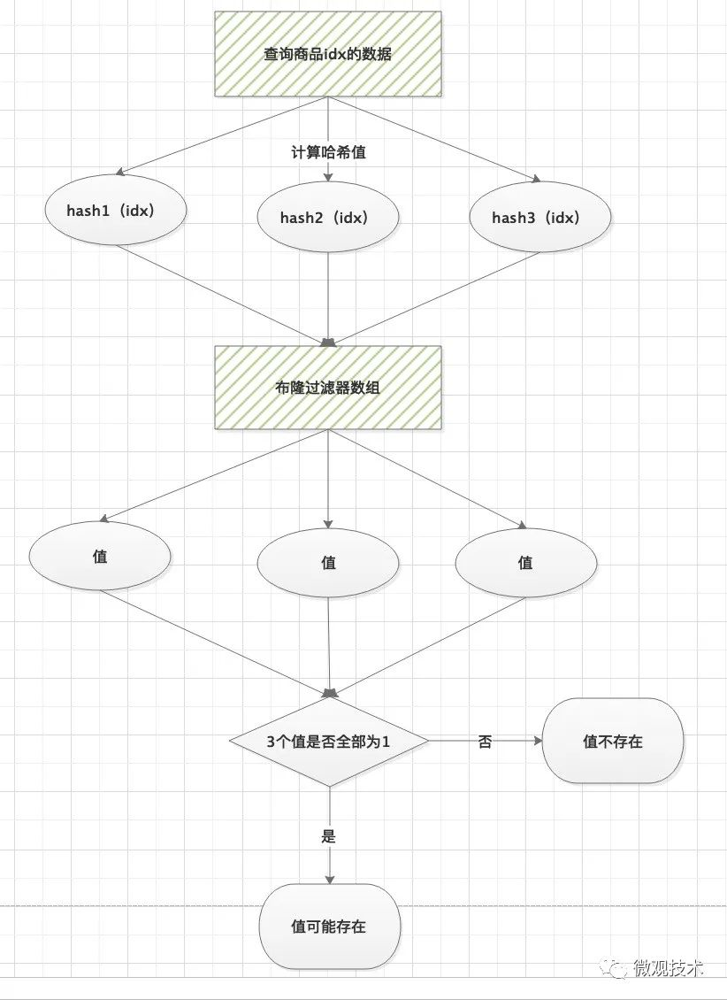
>
>跟初始化的过程有点类似，当查询一件商品的缓存信息时，我们首先要判断这件商品是否存在。
>
>- **通过三个哈希函数对商品id计算哈希值**
>- **然后，在布隆数组中查找访问对应的位值，0或1**
>- **判断，三个值中，只要有一个不是1，那么我们认为数据是不存在的。**
>
>注意：**布隆过滤器只能精确判断数据不存在情况，对于存在我们只能说是可能，因为存在Hash冲突情况，当然这个概率非常低。**  
>
>**7、如何减少布隆过滤器的误判？** 
>
>**a）增加二进制位数组的长度。这样经过hash后数据会更加的离散化，出现冲突的概率会大大降低**
>
>**b）增加Hash的次数，变相的增加数据特征，特征越多，冲突的概率越小**
>
>**9、Java应用中，如何使用布隆过滤器？代码实例**
>
>Java语言的生态非常繁荣，提供了很多开箱即用的开源框架供我们使用。布隆过滤器也不例外，Java 中提供了一个 `Redisson` 的组件，它内置了布隆过滤器。
>
>
>
>首先引入依赖包
>
>```
><dependency>
>    <groupId>org.redisson</groupId>
>    <artifactId>redisson</artifactId>
>    <version>3.11.1</version>
></dependency>
>```
>
>代码示例：
>
>```
>/**
> * @author 微信公众号：微观技术
> */
>@Test
>public void test5() {
>    Config config = new Config();
>    config.useSingleServer().setAddress("redis://172.16.67.37:6379");
>    RedissonClient cient = Redisson.create(config);
>    RBloomFilter<String> bloomFilter = cient.getBloomFilter("test5-bloom-filter");
>    // 初始化布隆过滤器，数组长度100W，误判率 1%
>    bloomFilter.tryInit(1000000L, 0.01);
>    // 添加数据
>    bloomFilter.add("Tom哥");
>    // 判断是否存在
>    System.out.println(bloomFilter.contains("微观技术"));
>    System.out.println(bloomFilter.contains("Tom哥"));
>}
>```
>
>运行结果：
>
>```
>false   // 肯定不存在
>true    // 可能存在，有1%的误判率
>```
>
>注意：误判率设置过小，会产生更多次的 Hash 操作，降低系统的性能。通常我们的建议值是 1%
>
>**10、布隆过滤器二进制数组，如何处理删除？**
>
>初始化后的布隆过滤器，可以直接拿来使用了。但是如果原始数据删除了怎么办？布隆过滤器二进制数组如何维护？
>
>直接删除不行吗？
>
>还真不行！因为这里面有Hash冲突的可能，会导致误删。
>
>怎么办？
>
>方案1：开发定时任务，每隔几个小时，自动创建一个新的布隆过滤器数组，替换老的，有点`CopyOnWriteArrayList`的味道
>
>方案2：布隆过滤器增加一个等长的数组，存储计数器，主要解决冲突问题，每次删除时对应的计数器减一，如果结果为0，更新主数组的二进制值为0
>
>**11、布隆过滤器的应用场景**
>
>- 本文重点介绍的，解决缓存穿透
>- 网页爬虫对URL的去重，避免爬取相同的URL地址
>- 反垃圾邮件，从数十亿个垃圾邮件列表中判断某邮箱是否垃圾邮箱
>
>

## 从根上理解用户态与内核态

https://juejin.cn/post/6923863670132850701

># 用户态与内核态
>
>通关了**C P U 指令集权限**，现在再说**用户态与内核态**就十分简单了，用户态与内核态的概念就是**C P U 指令集权限**的区别，进程中要读写 `I O`，必然会用到 **ring 0** 级别的 `C P U 指令集`，而此时 **C P U** 的指令集操作权限只有 **ring 3**，为了可以操作**ring 0** 级别的 `C P U 指令集`， **C P U** 切换指令集操作权限级别为 **ring 0**，C P U再执行相应的**ring 0** 级别的 `C P U 指令集`（**内核代码**），执行的**内核代码**会使用当前进程的内核栈。
>
>**PS：每个进程都有两个栈，分别是用户栈与内核栈，对应用户态与内核态的使用**
>
>## 用户态与内核态的空间
>
>在内存资源上的使用，操作系统对**用户态与内核态**也做了限制，每个进程创建都会分配「虚拟空间地址」（**不懂可以参考我的另一篇文章“15分钟！一文帮小白搞懂操作系统之内存”**），以Linux32位操作系统为例，它的寻址空间范围是 `4G`（2的32次方），而操作系统会把虚拟控制地址划分为两部分，一部分为**内核空间**，另一部分为**用户空间**，高位的 `1G`（从虚拟地址 0xC0000000 到 0xFFFFFFFF）由内核使用，而低位的 `3G`（从虚拟地址 0x00000000 到 0xBFFFFFFF）由各个进程使用。
>
>
>
>- 用户态：只能操作 `0-3G` 范围的低位虚拟空间地址
>- 内核态：`0-4G` 范围的虚拟空间地址都可以操作，尤其是对 `3-4G` 范围的高位虚拟空间地址必须由内核态去操作
>- 补充：`3G-4G` 部分大家是共享的（指所有进程的内核态逻辑地址是共享同一块内存地址），是内核态的地址空间，这里存放在整个内核的代码和所有的内核模块，以及内核所维护的数据
>
>**每个进程的 `4G` 虚拟空间地址，高位 `1G` 都是一样的，即内核空间。只有剩余的 `3G` 才归进程自己使用，换句话说就是， 高位 `1G` 的内核空间是被所有进程共享的！**
>
>> **最后做个小结，我们通过指令集权限区分用户态和内核态，还限制了内存资源的使用，操作系统为用户态与内核态划分了两块内存空间，给它们对应的指令集使用**.
>
>
>
>## 用户态与内核态的切换
>
>相信大家都听过这样的话「**用户态和内核态切换的开销大**」，但是它的开销大在那里呢？简单点来说有下面几点
>
>- **保留用户态现场（上下文、寄存器、用户栈等）**
>- **复制用户态参数，用户栈切到内核栈，进入内核态**
>- **额外的检查（因为内核代码对用户不信任）**
>- **执行内核态代码**
>- **复制内核态代码执行结果，回到用户态**
>- **恢复用户态现场（上下文、寄存器、用户栈等）**
>
>实际上操作系统会比上述的更复杂，这里只是个大概，我们可以发现一次切换经历了**「用户态 -> 内核态 -> 用户态」**。
>
>用户态要主动切换到内核态，那必须要有入口才行，实际上内核态是提供了统一的入口，下面是Linux整体架构图
>
>
>
>从上图我们可以看出来通过**系统调用**将Linux整个体系分为用户态和内核态，为了使应用程序访问到内核的资源，如CPU、内存、I/O，内核必须提供一组通用的访问接口，这些接口就叫**系统调用**。
>
>**库函数**就是屏蔽这些复杂的底层实现细节，减轻程序员的负担，从而更加关注上层的逻辑实现，它对系统调用进行封装，提供简单的基本接口给程序员。
>
>**Shell**顾名思义，就是外壳的意思，就好像把内核包裹起来的外壳，它是一种特殊的应用程序，俗称命令行。**Shell**也是可编程的，它有标准的**Shell**语法，符合其语法的文本叫**Shell**脚本，很多人都会用**Shell**脚本实现一些常用的功能，可以提高工作效率。
>
>最后来说说，什么情况会导致用户态到内核态切换
>
>- **系统调用：用户态进程主动切换到内核态的方式，用户态进程通过系统调用向操作系统申请资源完成工作，例如 fork（）就是一个创建新进程的系统调用，系统调用的机制核心使用了操作系统为用户特别开放的一个中断来实现，如Linux 的 int 80h 中断，也可以称为软中断**
>- **异常：当 C P U 在执行用户态的进程时，发生了一些没有预知的异常，这时当前运行进程会切换到处理此异常的内核相关进程中，也就是切换到了内核态，如缺页异常**
>- **中断：当 C P U 在执行用户态的进程时，外围设备完成用户请求的操作后，会向 C P U 发出相应的中断信号，这时 C P U 会暂停执行下一条即将要执行的指令，转到与中断信号对应的处理程序去执行，也就是切换到了内核态。如硬盘读写操作完成，系统会切换到硬盘读写的中断处理程序中执行后边的操作等。**
>
>

## pb 对象和字符串的相互转换


## 【Java】Java项目的绝对地址和相对地址问题以及ClassLoader

https://bbs.huaweicloud.com/blogs/329191?utm_source=luntan&utm_medium=bbs-ex&utm_campaign=ei&utm_content=content

>#### 关于在获取路径的的绝对路径问题和相对路径问题
>
>在纯java代码里 我们一般都会用**class.getResource(String name) 或者 class.getClassLoader().getResource(String name) 两种方法获取文件的地址 （当然不止这两种方法）**。今天就说说这两种方法的异同。这里说的纯java代码不是java web项目.
>
>

## java中Scanner类的HasNext,Next,HasNextLine,NextLine如何使用？为什么接收字符串和整数, 建议使用next方法接受字符串

https://blog.csdn.net/song_6666/article/details/125602152

>一、java中Scanner类的HasNext,Next,HasNextLine,NextLine如何使用？
>1.HasNext和HasNextLine解读
>HasNext和HasNextLine会要求⽤户在控制台输⼊字符，然后回车，把字符存储到Scanner对象中，不会赋值到变量中，可以⽤于判断输⼊的字符是否符合规则要求。
>HasNext会以空格为结束标志，空格后的数字会被抛弃。
>HashNextLine会以Enter为结束标志
>
>2.Next和NextLine解读
>Next和NextLine是直接从Scanner中获取HasNext和HasNextLine存储起来的值给到变量中。如果前⾯没有HasNext或者HashNextLine获取值，也可以⾃⼰获取⽤户在控制台中输⼊的字符。
>
>3、建议先⽤HashNext或者HasNextLine获取⽤户在控制台要求输⼊的字符。再⽤Next或NextLine从Scanner中获取值到程序变量中.
>

## java meta-annotation

https://www.geeksforgeeks.org/java-retention-annotations/

>In Java, annotations are used to attach meta-data to a program element such as a class, method, instances, etc. Some annotations are used to annotate other annotations. These types of annotations are known as meta-annotations. @Retention is also a meta-annotation that comes with some retention policies. These retention policies determine at which point an annotation is discarded. **There are three types of retention policies: SOURCE, CLASS, and RUNTIME.**
>
>- **RetentionPolicy.SOURCE:** The annotations annotated using the SOURCE retention policy are discarded at runtime.
>- **RetentionPolicy.CLASS:** The annotations annotated using the CLASS retention policy are recorded in the .class file but are discarded during runtime. CLASS is the default retention policy in Java.
>- **RetentionPolicy.RUNTIME:** The annotations annotated using the RUNTIME retention policy are retained during runtime and can be accessed in our program during runtime.


## Bug的严重程度(Blocker, Critical, Major, Minor/Trivial)和Bug修复优先级如何定义

https://blog.csdn.net/fly910905/article/details/78246027

## Java中的线程休眠大法系列（三）LockSupport.park()

https://blog.csdn.net/liujianyangbj/article/details/117919108

>Java 的线程休眠我们从 **Thread.sleep到Object.wait()**, 都进行了逐一讲解，现在我们研究最后一种方式 **LockSupport.park()** 。 
>
>## 2.线程被打断，不抛异常
>
>当通过 LockSupport.unpark() 唤醒线程的时候，线程的 Interrupt 状态是 fasle。
>
>```java
>package com.kinyang.lockSupport;
>
>import java.util.concurrent.locks.LockSupport;
>
>/**
> * @author KinYang.Liu
> * @date 2021/6/15 9:46 上午
> */
>public class LockSupportTest2 {
>    public static void main(String[] args) throws InterruptedException {
>        Thread t1 = new Thread(()->{
>            System.out.println("t1 线程开始执行");
>            System.out.println("t1 线程 park()  ");
>            LockSupport.park();
>            System.out.println("t1 线程 继续执行");
>            System.out.println("t1 线程 当前的 Interrupt 状态:"+Thread.currentThread().isInterrupted());
>        });
>
>        t1.start();
>        Thread.sleep(1000L);
>        /// 将t1 线程打断
>          t1.interrupt();
>    }
>}
>
>```
>
>运行结果
>
>
>
>当我们通过 interrupt 打断线程的时候，线程的 Interrupt 状态是true。
>
>通过上面两个例子，我们可以看到 LockSupport.park(); 不会抛出受检查异常，当出现被打断的情况下，也不会抛出异常，但是会将Interrupt的状态修改，也就是当我们的线程被唤醒后(**被 unpark() 和 interrupt 都会唤醒线程** )，**我们可以通过Interrupt的状态来判断，我们的线程是不是被interrupt的还是被unpark或者到达指定休眠时间。**
>
>## 2.是否会释放锁
>
>```java
>package com.kinyang.lockSupport;
>
>import java.util.Scanner;
>import java.util.concurrent.locks.LockSupport;
>
>/**
> * @author KinYang.Liu
> * @date 2021/6/15 9:46 上午
> */
>public class LockSupportTest3 {
>    private static Object monitor = new Object();
>    public static void main(String[] args) throws InterruptedException {
>         创建一个 t1 线程
>        Thread t1 = new Thread(() -> {
>            System.out.println("t1 尝试获取锁");
>            synchronized (monitor){
>                System.out.println("t1 获取到锁");
>                System.out.println("t1 执行 LockSupport.parkNanos() 方法，休眠该线程！");
>                /// 我们执行 parkNanos 操作，让线程进入休眠，看看其他线程是否能抢到 monitor 锁，
>                ///  如果其他线程可以获取到 monitor 锁后，那么说明 parkNanos 会释放monitor锁.
>                ///  否则，说明parkNanos不会释放monitor锁
>                LockSupport.parkNanos(1000*1000*1000*5L);
>                System.out.println("t1 线程执行完成");
>            }
>        },"t1-thread");
>         启动t1线程
>        t1.start();
>        /// 这里让主线程休眠1s后，确保t1线程已经执行,并获取到锁
>        Thread.sleep(1000L);
>        Thread t2 = new Thread(() -> {
>            System.out.println("t2 尝试获取锁");
>            synchronized (monitor){
>                System.out.println("t2 获取到锁");
>                System.out.println("执行 t2 方法");
>            }
>        },"t2-thread");
>        t2.start();
>        Scanner scanner = new Scanner(System.in);
>        while (scanner.hasNextLine()) {
>            if (scanner.nextLine().equalsIgnoreCase("bye")){
>                System.out.println("再见");
>                break;
>            }else {
>                System.out.println("指令错误");
>            }
>
>        }
>    }
>}
>```
>
>
>
>**从执行结果我们就能看出来是，LockSupport.parkNanos() 是不会释放锁的。**
>其实也很容易理解，**LockSupport.park跟synchronized就没有关系，休眠线程的原理和Object.wait不同，LockSupport.park休眠线程不需要依赖monitor锁，所以也就不会涉及到释放与不释放锁，这一点和Thread.sleep()是一致的。**
>
>## 3.传递自定义数据
>
>```java
>package com.kinyang.lockSupport;
>
>import java.util.HashMap;
>import java.util.concurrent.locks.LockSupport;
>/**
> * @author KinYang.Liu
> * @date 2021/6/15 9:46 上午
> */
>public class LockSupportTest4 {
>    public static void main(String[] args) throws InterruptedException {
>        Thread t1 = new Thread(()->{
>            System.out.println("t1 线程开始执行");
>            System.out.println("t1 线程 parkNanos()  ");
>            HashMap blocker = new HashMap();
>            blocker.put("reason","测试LockSupport的park的blocker");
>            blocker.put("code","1000");
>            LockSupport.parkNanos(blocker,2000*1000*2000L);
>            System.out.println("t1 线程 继续执行");
>            System.out.println("t1 线程 当前的 Interrupt 状态:"+Thread.currentThread().isInterrupted());
>        });
>        t1.start();
>        Thread.sleep(1000L);
>        Object blocker = LockSupport.getBlocker(t1);
>        System.out.println("t1 线程的blocker："+blocker);
>        Thread.sleep(1000*100L);
>    }
>}
>```
>
>
>
>LockSupport.park(Object blocker); 方法可以在 park 线程的时候，传一个Object参数。调用者在其他线程可以通过LockSupport.getBlocker(t1)参数。 
>
>## 总结
>* **LockSupport.park()休眠线程，LockSupport.unpark()唤醒线程，两个方法配合使用。也可以通过LockSupport.parkNanos()指定休眠时间后，自动唤醒。**
>* **LockSupport.park()不会释放monitor锁。**
>* **线程被打断，LockSupport.park()不会抛出异常，也不会吞噬掉interrupt的状态，调用者可以获取interrupt状态，自行进行判断，线程是由于什么原因被唤醒了。**
>* LockSupport.park()会是线程进入WAITING状态，而LockSupport.parkNanos(long nanos) 会进入TIMED_WAITING状态。
>* **LockSupport.park(Object blocker)和LockSupport.getBlocker(t1)配合使用，可以进行自定义数据传输。**
>

## collection.toArray(new String[0])中new String[0]的作用

https://blog.csdn.net/ystyaoshengting/article/details/50697783

>new string[0]的作用
>
>比如：**String[] result = set.toArray(new String[0]);**
>
>Collection的公有方法中，toArray()是比较重要的一个。
>**但是使用无参数的toArray()有一个缺点，就是转换后的数组类型是Object[]。** 虽然Object数组也不是不能用，但当你真的想用一个具体类型的数组，比如String[]时，问题就来了。而把Object[]给cast成String[]还是很麻烦的,需要用到这个：
>
>String[] stringArray = Arrays.copyOf(objectArray, objectArray.length, String[].class);
>
>不管是从哪方面看还是一开始就弄成String[]比较好。
>
>具体怎么办呢？其实用带参数的toArray就好了。官方是这样给出的例子：
>**String[] a = c.toArray(new String[0]);**
>
>**如果指定的数组能容纳该 collection，则返回包含此 collection 元素的数组。否则，将根据指定数组的运行时类型和此 collection 的大小分配一个新数组。** 这里给的参数的数组长度是0，因此就会返回包含此 collection 中所有元素的数组，并且返回数组的类型与指定数组的运行时类型相同。


---------

# 纤程 ?

## java 协程 quasar 从原理到代码应用

https://blog.csdn.net/guzhangyu12345/article/details/84666423

>**java 并不原生支持协程，框架 quasar 便是为此而生。**所谓原生支持，就是在语法级别支持执行某个语句的时候就进入挂起态，然后有统一的调度中心去调度。quasar 便是为java做了这个工作。

## java基于quasar实现协程池【前篇】

https://blog.csdn.net/weixin_47723549/article/details/125377215

>线程是抢占式，而**协程是非抢占式的，所以需要用户自己释放使用权来切换到其他协程**，因此同一时间其实只有一个协程拥有运行权，相当于单线程的能力。
>
>协程并不是取代线程, 而且抽象于线程之上, **线程是被分割的CPU资源, 协程是组织好的代码流程, 协程需要线程来承载运行, 线程是协程的资源, 但协程不会直接使用线程, 协程直接利用的是执行器(Interceptor), 执行器可以关联任意线程或线程池, 可以使当前线程, UI线程, 或新建新程.。**
>线程是协程的资源。协程通过Interceptor来间接使用线程这个资源。
>
>

## java基于quasar实现协程池【后篇】

https://blog.csdn.net/weixin_47723549/article/details/125534140

>在上一个文章中讲述了通过仿照java自写线程池的方式改写成[quasar](https://so.csdn.net/so/search?q=quasar&spm=1001.2101.3001.7020)协程池，功能可以说实现了效果，但是遇到了一个烦恼就是在协程阻塞过程中会疯狂报警告，如果您的项目有日志文件产生当遇到一个非常耗时的任务时后面的任务阻塞产生警告，那么该日志文件的体量是致命的！
>
>## FiberExecutorScheduler
>
>http://docs.paralleluniverse.co/quasar/javadoc/co/paralleluniverse/fibers/FiberExecutorScheduler.html

--------


## Commons CLI 入门及代码简单分析

https://cloud.tencent.com/developer/article/1622149

>## 入门
>
>commons-cli 中把解释参数分为三种状态，分别是**定义、解释和询问交互**。
>
>### 定义
>
>在定义这一部分，最重要的类是`Option`，Option类中定义了一个基本的选项，例如`-t xxx` ，是否为必选项，该命令的解释等等。
>
>### 解析
>
>接下来就是`CommandLineParser`接口，**在1.3.1版本中取消了Parser抽象类，`GnuParser`、`BasicParser`、`PosixParser`类，取而代之的是`DefaultParser`类。DefaultParser类提供了对Options实例的解析，即对入参命令和Options实例之间对应关系的解析，返回的类是CommandLine。如果入参命令与Options实例对应不上就会抛出解析异常。**
>
>DefaultParser 类解析方法最基本的方法是handleToken(String token)，token是每一个入参字符串。这个方法会在解析错误的时候抛出解析异常。
>
>### 查询交互
>
>`CommandLine`可以对入参命令进行判断解析，例如可以查询是否存在某个选项，以及获取这个选项的值。


## org.aopalliance.intercept  ？？  

面向切面编程的接口标准。


## @RefreshScope 支持动态刷新 ？？


## java.lang.reflect.Type  的作用？ 

###  【Java】java.lang.reflect.Type详解

https://blog.csdn.net/u013718730/article/details/106165426/

>
>
>

## Java多线程问题--方法await()和awaitUninterruptibly()的用法和区别

https://blog.csdn.net/XIANZHIXIANZHIXIAN/article/details/86633966

>使用了condition.await()的线程被中断后报错，使用了condition.awatUninterruptibly()的线程被中断后不报错。

## spring-boot-devtools: 免费的热部署工具

https://blog.csdn.net/fly910905/article/details/115550175

>**spring-boot-devtools**
>是一个为开发者服务的一个模块，其中最重要的功能就是自动将应用代码更改到最新的App上面去，即在我们改变了一些代码或者配置文件的时候，应用可以自动重启，这在我们开发的时候，非常有用。
>
>**重新启动 vs 重新加载**
>Spring Boot 提供的重启技术通过使用两个类加载器来工作。
>
>**不改变的类（例如来自第三方jar的类）被加载到base classloader中。**
>
>**我们正在开发的类会加载到restart classloader中。当应用程序重新启动时，restart classloader 将被丢弃并创建一个新类。这种方法意味着应用程序重启通常比"cold starts"快得多，因为基类加载器已经可用并且已经被填充。**
>

## [Java 受检异常与lambda表达式](https://geek-docs.com/java/java-examples/java-client-and-lambda-expressions.html)

>### Java 受检异常与lambda表达式 问题描述
>
>存在一个抛出受检异常的 lambda 表达式，且所实现的函数式接口中的抽象方法并未声明该异常。
>
>### Java 受检异常与lambda表达式 解决方案
>
>为 lambda 表达式添加一个 try/catch 代码块，或委托给某个提取的方法进行处理。
>
>### Java 受检异常与lambda表达式 具体实例
>
>lambda 表达式实际上属于**函数式接口中单一抽象方法的实现，因此只能抛出在抽象方法签名中声明的受检异常。**
>

## Java 子类和父类同名属性

https://blog.csdn.net/Komatsu_1137/article/details/122597789?spm=1001.2101.3001.6650.1&utm_medium=distribute.pc_relevant.none-task-blog-2%7Edefault%7ECTRLIST%7ERate-1-122597789-blog-89155433.pc_relevant_multi_platform_whitelistv3&depth_1-utm_source=distribute.pc_relevant.none-task-blog-2%7Edefault%7ECTRLIST%7ERate-1-122597789-blog-89155433.pc_relevant_multi_platform_whitelistv3&utm_relevant_index=2

>
>
>### 总结
>
>**若子类有一个属性，和父类的某个属性同名，则该属性和父类的同名属性是完全独立的，想要调用父类的属性要用super。**
>
>**若子类的属性是由父类继承得到的，则会获取和改变父类属性的值。**
>
>

## URL和URI的区别

https://maizitoday.github.io/post/url%E5%92%8Curi%E7%9A%84%E5%8C%BA%E5%88%AB/


## 高性能 Java 计算服务的性能调优实战

https://mp.weixin.qq.com/mp/profile_ext?action=home&__biz=MzI4NjY4MTU5Nw==&scene=124#wechat_redirect

## 锁--简述

https://www.jianshu.com/p/5188dee836c8

比各种锁的理解和使用场景 **应该更加清晰、能够简洁得表达出来**。

>## 公平锁和非公平锁
>
>**公平锁指的根据先进先出（FIFO）的原则来获取锁。**
> **非公平锁指的是不管队列顺序，谁先获取到资源就获取到锁。这样的话，可能会造成饥饿现象。**
> Java中 ReentrantLock 实现了两种锁的模式。
>
>### 优缺点分析
>
>**公平锁的优点是按序平均分配锁资源，不会出现线程饿死的情况，它的缺点是按序唤醒线程的开销大，执行性能不高。**
>**非公平锁的优点是执行效率高，谁先获取到锁，锁就属于谁，不会“按资排辈”以及顺序唤醒，但缺点是资源分配随机性强，可能会出现线程饿死的情况。**
>
>### 总结
>
>在 Java 语言中，锁的默认实现都是非公平锁，原因是非公平锁的效率更高，使用 ReentrantLock 可以手动指定其为公平锁。非公平锁注重的是性能，而**公平锁注重的是锁资源的平均分配，所以我们要选择合适的场景来应用二者。**
>
>## 可重入锁（递归锁）
>
>### 描述
>
>**指在同一线程在外层方法获取锁的时候，进入内层方法时如果内层方法需要相同锁，则会自动获取锁。**
>
>可重入锁，也叫做递归锁，是指在一个线程中可以多次获取同一把锁，
>比如：**一个线程在执行一个带锁的方法，该方法中又调用了另一个需要相同锁的方法，则该线程可以直接执行调用的方法【即可重入】，而无需重新获得锁；**
>
>### 可重入锁的作用
>
><p data-pid="Ua7lV8Wd">在没可重入锁之前，funA调用了funB，直接死锁。</p>
><p data-pid="mWzy1Pa6">所以为了避免死锁，还要一个内部用的无锁版本的funA_和funB_，供有锁版本的funA和funB调用。</p><p data-first-child="" data-pid="IgnfWaoF">同样是两个函数funA和funB，多线程使用同一个锁的时候</p><p data-pid="aAaQreH2">后来有重入锁之后，一切清净了。</p>
>
>
>
>


## 利用 LockSupport 实现先进先出锁

java doc 上提供的示例： 

```java
class FIFOMutex {
    
    private final AtomicBoolean locked = new AtomicBoolean(false);
    private final Queue<Thread> waiters = new ConcurrentLinkedQueue<Thread>();
    
    public void lock() { 
        boolean wasInterrupted = false;
        Thread current = Thread.currentThread();
        waiters.add(current); 
        while (waiters.peek() != current ||
               !locked.compareAndSet(false, true)) {
            LockSupport.park(this);
            if (Thread.interrupted())
                wasInterrupted = true;
        }

        waiters.remove();
        if (wasInterrupted)
            current.interrupt();
    }

    public void unlock() {
        locked.set(false);
        LockSupport.unpark(waiters.peek());
    }
  
}

```

## BAT面试官：你先手动用 LockSupport 实现一个先进先出的不可重入锁？吊炸天

https://juejin.cn/post/6844903981924548621

> 
>
>```java
>public class FIFOMutex {
>private final AtomicBoolean locked = new AtomicBoolean(false);
>private final Queue<Thread> waiters
>    = new ConcurrentLinkedQueue<Thread>();
>
>public void lock() {
>    boolean wasInterrupted = false;
>    Thread current = Thread.currentThread();
>    waiters.add(current);
>
>    // 只有自己在队首才可以获得锁，否则阻塞自己
>    //cas 操作失败的话说明这里有并发，别人已经捷足先登了，那么也要阻塞自己的
>    //有了waiters.peek() != current判断如果自己队首了，为什么不直接获取到锁还要cas 操作呢？
>    //主要是因为接下来那个remove 操作把自己移除掉了额，但是他还没有真正释放锁，锁的释放在unlock方法中释放的
>    while (waiters.peek() != current ||
>        !locked.compareAndSet(false, true)) {
>        //这里就是使用LockSupport 来阻塞当前线程
>        LockSupport.park(this);
>        //这里的意思就是忽略线程中断，只是记录下曾经被中断过
>        //大家注意这里的java 中的中断仅仅是一个状态，要不要退出程序或者抛异常需要程序员来控制的
>        if (Thread.interrupted()) {
>            wasInterrupted = true;
>        }
>    }
>    // 移出队列，注意这里移出后，后面的线程就处于队首了，但是还是不能获取到锁的，locked 的值还是true,
>    // 上面while 循环的中的cas 操作还是会失败进入阻塞的
>    waiters.remove();
>    //如果被中断过，那么设置中断状态
>    if (wasInterrupted) {
>        current.interrupt();
>    }
>
>}
>
>public void unlock() {
>    locked.set(false);
>    //唤醒位于队首的线程
>    LockSupport.unpark(waiters.peek());
>}
>}
>```
>
>上面这个例子其实就是jdk中LockSupport 提供的一个例子。LockSupport 是提供线程的同步原语的非常底层的一个类，如果一定要深挖的话，他的实现又是借用了Unsafe这个类来实现的，Unsafe 类中的方法都是native 的，真正的实现是C++的代码
>
>通过上面这个例子，分别调用了以下两个方法
>
>```java
>public static void park(Object blocker) 
>public static void unpark(Thread thread) 
>```
>LockSupport 的等待和唤醒是基于许可的，这个许可在C++ 的代码中用一个变量count来保存,它只有两个可能的值，一个是0，一个是1。初始值为0. 
>
>## 调用一次 park 
>
>1. 如果count=0，阻塞，等待count 变成1
>2. 如果count=1,修改count=0,并且直接运行，整个过程没有阻塞
>
>## 调用一次unpark ( 让变量 count 置为 1)
>
>1. 如果count=0，修改count=1
>2. 如果count=1,保持count=1
>
>## 多次连续调用unpark 效果等同于一次
>
>所以整个过程即使你多次调用unpark，他的值依然只是等于1，并不会进行累加。
>
>### park 和unpark 的调用不分先后顺序 (重要)
>
>从结果中可以看到，即使先调用unpark,后调用park,线程也可以马上返回，并且整个过程是不阻塞的。**这个跟Object对象的wait()和notify（）有很大的区别，Object 中的wait() 和notify（）顺序错乱的话，会导致线程一直阻塞在wait()上得不到唤醒。**正是LockSupport这个特性，使我们并**不需要去关心线程的执行顺序**，大大的**降低了死锁的可能性**。
>
>## 支持超时
>
>```tex
>//nanos 单位是纳秒，表示最多等待nanos 纳秒，
>//比如我最多等你1000纳秒，如果你还没到，就不再等你了，其他情况跟park 一样
>public static void parkNanos(Object blocker, long nanos)
>//deadline 是一个绝对时间，单位是毫秒，表示等待这个时间点就不再等
>//（比如等到今天早上9点半，如果你还没到，我就不再等你了） ，其他情况跟park 一样
>public static void parkUntil(Object blocker, long deadline)
>```
>
>正是有了这个方法，所以我们平时用的ReentrantLock 等各种lock 才可以支持超时等待，底层其实就是借用了这两个方法来实现的。这个也是synchronized 没有办法实现的特性.
>
>## 支持查询线程在哪个对象上阻塞
>
>```java
>public static Object getBlocker(Thread t) {
>    if (t == null)
>        throw new NullPointerException();
>    return UNSAFE.getObjectVolatile(t, parkBlockerOffset);
>}
>```
>## LockSupport中的 park ,unpark 和Object 中的wait,notify 比较
>
>1. 他们都可以实现线程之间的通讯
>2. park 和wait 都可以让线程进入阻塞状态
>3. park 和unpark 可以在代码的任何地方使用
>4. wait 和notify,notifyAll 需要和synchronized 搭配使用，必须在获取到监视锁之后才可以使用,例如
>
>```
>复制代码synchronized (lock){
> lock.wait()
>}
>```
>
>5. wait 和notify 需要严格控制顺序，如果wait 在notify 后面执行，则这个wait 会一直得不到通知
>
>6. park 和unpark 通过许可来进行通讯，无需保证顺序
>
>7. park 支持超时等待，但是wait 不支持
>
>8. unpark 支持唤醒指定线程，但是notify 不支持
>
>9. wait 和park 都可以被中断唤醒，wait 会获得一个中断异常
>
>## 最佳实践 
>
>阻塞语句 LockSupport.park()  需要在循环体，例如本文一开始的例子. 
>
>```java
>复制代码        while (waiters.peek() != current ||
>            !locked.compareAndSet(false, true)) {
>            //在循环体内
>            LockSupport.park(this);
>            //唤醒后来到这里
>            //忽略其他无关代码
>        }
>```
>
>如果不在循环体内会有什么问题呢？假如变成以下代码片段
>
>```java
>复制代码        if (waiters.peek() != current ||
>            !locked.compareAndSet(false, true)) {
>            //在循环体内
>            LockSupport.park(this);
>            //唤醒后来到这里
>            //忽略其他无关代码
>        }
>```
>
>这里涉及一个**线程无理由唤醒的概念**，也就是说阻塞的线程并没有其他线程调用 unpark() 方法的时候就被唤醒. 
>
>假如先后来了两个线程A和B，这时候A先到锁，这个时候B阻塞。但是在A还没释放锁的时候，同时B被无理由唤醒了，如果是if,那么 线程B就直接往下执行获取到了锁，这个时候同时A和B都可以访问临界资源，这样是不合法的，如果是while 循环的话，会判断B不是 在队首或者CAS 失败的会继续调用park 进入阻塞。所以大家记得park方法一定要放在循环体内.
>
>

## [java线程阻塞LockSupport.park()和Thread.sleep()、Object.wait()的区别](http://bcxw.net/article/755.html)

>**4.park和sleep、wait的区别**
>
>4.1park、unpark方法和wait、notify()方法有一些相似的地方。都是休眠，然后唤醒。但是wait、notify方法有一个不好的地方，就是我们在编程的时候必须能保证wait方法比notify方法先执行。如果notify方法比wait方法晚执行的话，就会导致因wait方法进入休眠的线程接收不到唤醒通知的问题。而**park、unpark则不会有这个问题，我们可以先调用unpark方法释放一个许可证，这样后面线程调用park方法时，发现已经许可证了，就可以直接获取许可证而不用进入休眠状态了。**

## [java AQS的实现原理（大部分同步类都依赖AQS实现）](https://www.jianshu.com/p/279baac48960)

>**1.LockSupport介绍**
>
>  Thread.sleep()、Object.wait() 是比较常用的线程阻塞方法，其实LockSupport也是鼎鼎有名的。LockSupport是JDK中比较底层的类，用来创建锁和其他同步工具类的**基本线程阻塞原语**。
>
>LockSupport.park 的实现原理是通过二元信号量做的阻塞，要注意的是，这个信号量最多只能加到1。我们也可以理解成获取释放许可证的场景。**unpark() 方法会释放一个许可证，park()方法则是获取许可证，如果当前没有许可证，则进入休眠状态，知道许可证被释放了才被唤醒。无论执行多少次unpark()方法，也最多只会有一个许可证。**
>
>**LockSupport并不需要获取对象的监视器。(因此不会释放锁)** LockSupport机制是每次unpark给线程1个"许可"——最多只能是1，而**park则相反，如果当前线程有许可，那么park方法会消耗1个并返回，否则会阻塞线程直到线程重新获得许可，在线程启动之前调用 park/unpark方法没有任何效果。因为它们本身的实现机制不一样，所以它们之间没有交集，也就是说LockSupport阻塞的线程，notify/notifyAll没法唤醒.**  
>
>   Java锁和同步器框架的核心AQS:AbstractQueuedSynchronizer，就是通过调用LockSupport.park()和LockSupport.unpark()实现线程的阻塞和唤醒的。LockSupport很类似于二元信号量(只有1个许可证可供使用)，如果这个许可还没有被占用，当前线程获取许可并继续执行；如果许可已经被占用，当前线程阻塞，等待获取许可。
>
>   LockSupport中的park() 和 unpark() 的作用分别是阻塞线程和解除阻塞线程，而且park()和unpark()不会遇到“Thread.suspend 和 Thread.resume所可能引发的死锁”问题。因为park() 和 unpark()有许可的存在；调用 park() 的线程和另一个试图将其 unpark() 的线程之间的竞争将保持活性。
>
>**2.1 Sync.nonfairTryAcquire**
>
>1.该方法会首先判断当前状态，**如果c==0说明没有线程正在竞争该锁，如果不c !=0 说明有线程正拥有了该锁。**
>2.**如果发现c==0，则通过CAS设置该状态值为acquires,acquires的初始调用值为1，每次线程重入该锁都会+1，每次unlock都会-1，但为0时释放锁。**如果CAS设置成功，则可以预计其他任何线程调用CAS都不会再成功，也就认为当前线程得到了该锁，也作为Running线程，**很显然这个Running线程并未进入等待队列。**
>3.**如果c !=0 但发现自己已经拥有锁，**只是简单地++acquires，并修改status值，但因为没有竞争，所以通过setStatus修改，而非 CAS，**也就是说这段代码实现了偏向锁的功能，并且实现的非常漂亮。**
>
>
>

------


### [java中的float和double的精度问题](https://www.cnblogs.com/vineleven/p/8267005.html)

>**1、背景知识** 
>在java中没有细讲，只是讲了float占32位（bit），double占 64位。 
>对于计算机来说，用位数表示是合适的。但有人喜欢用字节(byte)表示。一个字节占8位。 
>1 byte = 8 bit. 
>所以float占4个字节，double占8个字节。 
>不过我还是喜欢用位数表示。这样更直接，也更容易理解计算机是怎么存储这些类型的。
>
>**3、下面切入正题** 
>===================== 
>在c++中单精度float类型与双精度double类型的问题 
>
>【"单精度用float表示，在计算机中使用4位字节（32位bit）来表示，具有7位有效数字"】 
>
>float类型存储的时候1个bit是符号位，8个bit是指数位，剩下的23个bit是有效数字位。 
>2的23次方是8388608，即7位有效数字，精度（10进制）。 
>
>一个单精度的浮点数在内存当中占用了32个bit位，按照浮点数的表示标准，最高位表示符号，这32位一部分用来表示阶码，一部分用来表示小数部分。 
>按照这个表示方法转化成10进制之后，它能表示的最高精度是7位有效数字。 
>
>比如 
>float a=3.14159;a在内存中实际上表示为0.314159乘以10的1次方（0是符号位），而分配给a的存储单元就分为两部分，一部分存0.314159，一部分存指数1，而且也都是转化为2进制来存。 
>
>================== 
>float ，1位符号位， 8位指数位，23位尾数位 
>double，1位符号位，11位指数位，52位尾数位 
>
>float尾数位23位，2^23=8.3E6，7位，所以不同的编译器规定不同，有些是7位，有些8位 
>double尾数52位，2^52=4.5E15，15位，所以double的有效位数是15位 .

## [对 AtomicReference 的理解和使用](http://ckjava.com/2020/05/08/Java-AtomicReference-understand-practice/)

>## 2 方法列表
>
>1. public final V get() 以非原子的方式 返回当前值
>2. public final void set(V newValue) 以非原子的方式 直接将值设置为预期值
>3. public final void lazySet(V newValue) 以原子的方式 将值设置为预期值
>4. public final boolean compareAndSet(V expect, V update) 以原子的方式 只有在当前值等于预期值的时候才会将值更新，返回是否更新成功
>5. public final boolean weakCompareAndSet(V expect, V update) 以原子的方式 只有在当前值等于预期值的时候才会将值更新，返回是否更新成功
>6. public final V getAndSet(V newValue) 以原子的方式修改后返回旧值
>7. public final V getAndUpdate(UnaryOperator updateFunction) 以原子的方式 修改后返回旧值
>8. public final V updateAndGet(UnaryOperator updateFunction) 以原子的方式 修改后返回新值
>9. public final V getAndAccumulate(V x, BinaryOperator accumulatorFunction) 以原子的方式 修改指定值后返回旧值
>10. public final V accumulateAndGet(V x, BinaryOperator accumulatorFunction) 以原子的方式 修改指定值后返回新值
>
>## 3 构造函数
>
>1. `public AtomicReference()`
>2. `public AtomicReference(V initialValue)`

## [高并发编程之ConcurrentLinkedDeque讲解]( https://blog.csdn.net/weixin_42146366/article/details/88012792)

>四、总结
>①、基于链接节点的无界并发 deque 。 **并发插入，删除和访问操作可以跨多个线程安全执行。** 一个 ConcurrentLinkedDeque是许多线程将共享对公共集合的访问的适当选择。 像大多数其他并发集合实现一样，此类不允许使用null元素， ConcurrentLinkedDeque是一个双向链表 。
>
>②、ConcurrentLinkedDeque使用了**自旋+CAS的非阻塞算法**来保证线程并发访问时的数据一致性。由于队列本身是一种双链表结构，所以虽然算法看起来很简单，但其实需要考虑各种并发的情况，实现复杂度较高，并且 ConcurrentLinkedDeque 不具备实时的数据一致性，实际运用中，如果需要一种线程安全的栈结构，可以使用ConcurrentLinkedDeque。
>
>③、关于ConcurrentLinkedDeque还有以下需要注意的几点：
>
>1、ConcurrentLinkedDeque的迭代器是**弱一致性的**，这在并发容器中是比较普遍的现象，主要是指在一个线程在遍历队列结点而另一个线程尝试对某个队列结点进行修改的话不会抛出ConcurrentModificationException，这也就造成在遍历某个尚未被修改的结点时，在next方法返回时可以看到该结点的修改，但在遍历后再对该结点修改时就看不到这种变化。
>2、size方法需要**遍历链表，所以在并发情况下，其结果不一定是准确的**，只能供参考。
>

### 两个不同的类加载加载同一个类时可能导致的问题？

1. https://stackoverflow.com/questions/29504180/slf4j-error-class-loader-have-different-class-objects-for-the-type

>In Java, **the class signature is composed of the class full qualified name and the classloader that loaded the class. If a class is loaded two times from two different classloaders (same hierarchy), there will be two different classes for the JVM. Trying to point a object reference of one class to a variable of the other will trhow a ClassCastException. **

2. java多类加载器类冲突案例分析

   http://www.zyiz.net/tech/detail-151948.html

>众所周知，jvm类加载机制采用双亲委派机制。但在有些框架中，常常为了提供某种形式的“隔离和沙盒”，自定义一种称为`ChildFirst`的了类加载器，简单的说就是破坏了双亲委派，由自定义子类加载器优先加载类，而不是先委派给父加载器。由于同一个类可以在不同的类加载器中分别加载，使用`ChildFirst`机制，可以让类加载器形成一个“沙盒”，在程序中同时运行两个相同但不同版本的类。

3. [Java LinkageError:loader constraint violation 异常分析与解决](https://bigzuo.github.io/2017/03/19/java-LinkageError-loader-constraint-violation-error/)     

>当解析`"org.slf4j.impl.StaticLoggerBinder.getLoggerFactory()Lorg/slf4j/ILoggerFactory;"`方法时，类`org/slf4j/LoggerFactory`的加载器是`instance of org/apache/catalina/loader/WebappClassLoader`，但是类`org/slf4j/impl/StaticLoggerBinder`的类加载器是`instance of org/apache/catalina/loader/StandardClassLoader`，因此分别被两个类加载器加载的类`org/slf4j/LoggerFactory`发生交互，所以JVM抛出“**LinkageError**”异常。
>
>读到这里，大家就应该可以很明显发现问题所在：
>
>- Tomcat启动时，**Common**加载器会加载`$CATALINA_HOME/lib`和`$CATALINA_BASE/lib`目录下的**slf4j-api-1.7.7.jar** jar包中的类，其中包括`org/slf4j/LoggerFactory`类。日志中显示的类加载器是`instance of org/apache/catalina/loader/StandardClassLoader`，因为`CommonLoader`是`StandardClassLoader`的子类。
>- **WebappX**加载器会加载`/WEB-INF/lib`目录下所有的jar包中的类和额外的类，也包括**slf4j-api-1.7.7.jar** jar包中的`org/slf4j/LoggerFactory`类。日志显示的类加载器是`WebappClassLoader`。
>- 当应用程序在解析`"org.slf4j.impl.StaticLoggerBinder`类的`getLoggerFactory()`方法时，发现同一个类有两个不同的类加载器，类加载器冲突，所以抛出`java.lang.LinkageError`异常。

4. [探讨ClassLoader引发的 java.lang.LinkageError](https://blog.csdn.net/helowken2/article/details/87927831)  全面  ？？？

   >问题探讨
   >先好好解读一下异常信息：
   >
   >1. 存在2个ClassLoader：WebAppClassLoader 和 URLClassLoade
   >2. 由WebAppClassLoader加载的LoggerFactory，在调用自身getILoggerFactory()方法时，需要解析调用StaticLoggerBinder.getLoggerFactory()方法
   >3. StaticLoggerBinder由URLClassLoader加载
   >4. LoggerFactory.getILoggerFactory()方法，返回类型是ILoggerFactory，由WebAppClassLoader加载
   >  StaticLoggerBinder.getLoggerFactory()方法，返回类型为ILoggerFactory，由URLClassLoader加载
   >5. **JVM认为这2个ILoggerFactory虽然源于同一个类，但是由不同的ClassLoader加载，所以它们拥有不同的签名，不能被视作同一类型，于是报错**
   >
   >**LoggerFactory**的源码：
   >
   >```java
   >    public static ILoggerFactory getILoggerFactory() {
   >		...
   >        switch (INITIALIZATION_STATE) {
   >        case SUCCESSFUL_INITIALIZATION:
   >            return StaticLoggerBinder.getSingleton().getLoggerFactory(); // 在这里调用的
   >		...
   >    }
   >```
   >
   >jetty 在加载web应用的时候，每个应用都使用一个独立的 WebAppClassLoader，它继承了URLClassLoader，应用启动时，会把自己lib目录下的所有jar包和classes目录添加到它的资源列表中(URLClassPath)，查看它的 loadClass()方法，可以知道它会优先从自己的资源列表中查找class：
   >
   >```java
   >    @Override
   >    protected Class<?> loadClass(String name, boolean resolve) throws ClassNotFoundException {
   >        synchronized (getClassLoadingLock(name)) {
   >            ClassNotFoundException ex = null;
   >            Class<?> parent_class = null;
   >            Class<?> webapp_class = null;
   >
   >			// 如果已经加载过，则直接返回
   >            webapp_class = findLoadedClass(name);
   >            if (webapp_class != null) {
   >                if (LOG.isDebugEnabled())
   >                    LOG.debug("found webapp loaded {}", webapp_class);
   >                return webapp_class;
   >            }
   >
   >			// 看是否优先使用parent来查找
   >            if (_context.isParentLoaderPriority()) {
   >           		// 一般都不会走这个分支，因为web应用应该优先使用自己的class和jar
   >                ... 
   >            } else {
   >                // 从这里可以看出，应用会优先使用自己的资源来查找class
   >                // loadAsResource方法会调用URLClassLoader的findResource来查找class的URL
   >                webapp_class = loadAsResource(name, true); 
   >
   >                if (webapp_class != null) {
   >                    return webapp_class;
   >                }
   >				// 往下是使用parent来加载
   >				...
   >            }
   >        }
   >    }
   >
   >```
   >
   >结论：
   >一旦出现LinkageError：
   >
   >**系统存在多个ClassLoader，某些类都被它们加载过**
   >**它们之间存在代理关系**
   >**它们在执行方法调用的时候，出现了交集**
   >解决方法：
   >
   >1. 根据错误信息，找出冲突的类所在的URL（jar包，目录，远程资源）
   >2. 看哪些ClassLoader的资源列表引入了这些URL
   >3. 尽量简化为只在其中一个ClassLoader进行加载，即优先通过代理加载
   >或者让各个ClassLoader都拥有完整的资源列表，即不进行代理加载

### [通俗易懂的双亲委派机制](https://blog.csdn.net/codeyanbao/article/details/82875064)

>你得先知道
>在介绍双亲委派机制的时候，不得不提ClassLoader（类加载器）。说ClassLoader之前，我们得先了解下Java的基本知识。  
>Java是运行在Java的虚拟机(JVM)中的，但是它是如何运行在JVM中了呢？我们在IDE中编写的Java源代码被编译器编译成.class的字节码文件。然后由我们得ClassLoader负责将这些class文件给加载到JVM中去执行。  
>
>JVM中提供了三层的ClassLoader：
>
>**Bootstrap classLoader**:主要负责加载核心的类库(java.lang.*等)，构造ExtClassLoader和APPClassLoader。
>
>**ExtClassLoader**：主要负责加载jre/lib/ext目录下的一些扩展的jar。
>
>**AppClassLoader**：主要负责加载应用程序的主函数类
>
>那如果有一个我们写的Hello.java编译成的Hello.class文件，它是如何被加载到JVM中的呢？别着急，请继续往下看。
>
>### 双亲委派机制
>
>我打开了我的AndroidStudio，搜索了下“ClassLoader”,然后打开“java.lang”包下的**ClassLoader**类。然后将代码翻到**loadClass**方法：
>
>```java
>public Class<?> loadClass(String name) throws ClassNotFoundException {
>   return loadClass(name, false);
>}
>//              -----??-----
>protected Class<?> loadClass(String name, boolean resolve)
>   throws ClassNotFoundException
>{
>       // 首先，检查是否已经被类加载器加载过
>       Class<?> c = findLoadedClass(name);
>       if (c == null) {
>           try {
>               // 存在父加载器，递归的交由父加载器
>               if (parent != null) {
>                   c = parent.loadClass(name, false);
>               } else {
>                   // 直到最上面的Bootstrap类加载器
>                   c = findBootstrapClassOrNull(name);
>               }
>           } catch (ClassNotFoundException e) {
>               // ClassNotFoundException thrown if class not found
>               // from the non-null parent class loader
>           }
>
>           if (c == null) {
>               // If still not found, then invoke findClass in order
>               // to find the class.
>               c = findClass(name);
>           }
>       }
>       return c;
>}
>```
>
>其实这段代码已经很好的解释了双亲委派机制，为了大家更容易理解，我做了一张图来描述一下上面这段代码的流程： 
>
>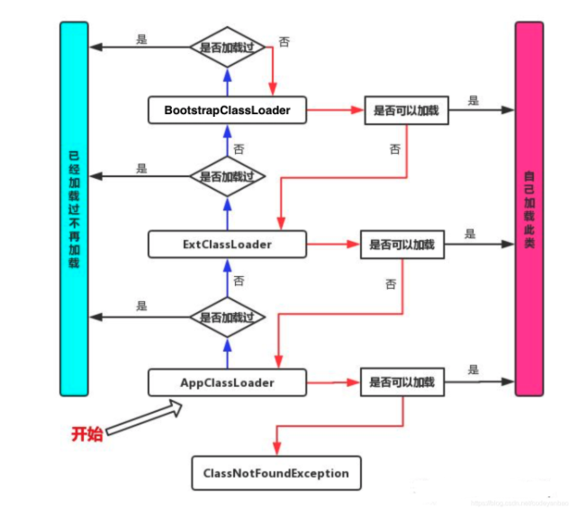
>
>从上图中我们就更容易理解了，当一个Hello.class这样的文件要被加载时。不考虑我们自定义类加载器，首先会在AppClassLoader中检查是否加载过，如果有那就无需再加载了。如果没有，那么会拿到父加载器，然后调用父加载器的loadClass方法。父类中同理也会先检查自己是否已经加载过，如果没有再往上。**注意这个类似递归的过程，直到到达Bootstrap classLoader之前，都是在检查是否加载过，并不会选择自己去加载。直到BootstrapClassLoader，已经没有父加载器了，这时候开始考虑自己是否能加载了，如果自己无法加载，会下沉到子加载器去加载，一直到最底层，如果没有任何加载器能加载，就会抛出 ClassNotFoundException。**那么有人就有下面这种疑问了？
>
>为什么要设计这种机制
>这种设计有个好处是，如果有人想替换系统级别的类：String.java。篡改它的实现，在这种机制下这些系统的类已经被Bootstrap classLoader加载过了（为什么？因为当一个类需要加载的时候，最先去尝试加载的就是BootstrapClassLoader），所以其他类加载器并没有机会再去加载，**从一定程度上防止了危险代码的植入**。
>
>总结了一张脑图如下：
>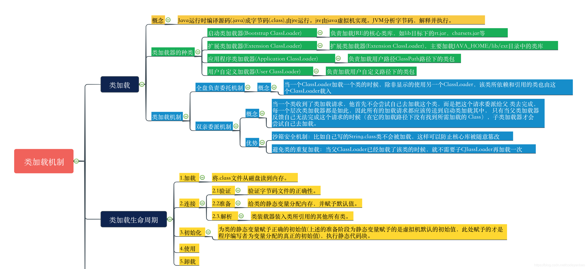


## [JavaGuide ms 突击版](https://snailclimb.gitee.io/javaguide-interview/#/?id=javaguide面试突击版)

## 妙用Java 8中的 Function接口 消灭if...else...

>### Function 函数式接口
>
>使用注解`@FunctionalInterface`标识，并且只包含一个抽象方法的接口是函数式接口。函数式接口主要分为Supplier供给型函数、Consumer 消费型函数、Runnable无参无返回型函数和Function有参有返回型函数。
>
>#### Supplier供给型函数
>
>Supplier的表现形式为不接受参数、只返回数据.
>
>#### Consumer消费型函数
>
>Consumer消费型函数和Supplier刚好相反。Consumer接收一个参数，没有返回值.
>
>#### Runnable无参无返回型函数
>
>Runnable的表现形式为即没有参数也没有返回值.
>
>**Function有参有返回型函数**
>
>Function函数的表现形式为**接收一个参数，并返回一个值**。`Supplier`、`Consumer`和`Runnable`可以看作Function的一种特殊表现形式。

## [javaagent使用指南](https://www.cnblogs.com/rickiyang/p/11368932.html)  看不明白???

>#### [JVM启动前静态Instrument](https://www.cnblogs.com/rickiyang/p/11368932.html#468667690)
>
>Javaagent 是什么？
>
>Javaagent是java命令的一个参数。参数 javaagent 可以用于指定一个 jar 包，并且对该 java 包有2个要求：
>
>1. **这个 jar 包的 MANIFEST.MF 文件必须指定 Premain-Class 项。**
>2. **Premain-Class 指定的那个类必须实现 premain() 方法。**
>
>premain 方法，从字面上理解，就是运行在 main 函数之前的的类。**当Java 虚拟机启动时，在执行 main 函数之前，JVM 会先运行`-javaagent`所指定 jar 包内 Premain-Class 这个类的 premain 方法 。**
>
>##### 运行时加载 instrument agent 过程：
>
>通过 JVM 的attach机制来请求目标 JVM 加载对应的agent，过程大致如下：
>
>1. 创建并初始化JPLISAgent；
>2. 解析 javaagent 里 MANIFEST.MF 里的参数；
>3. 创建 InstrumentationImpl 对象；
>4. 监听 ClassFileLoadHook 事件；
>5. 调用 InstrumentationImpl 的`loadClassAndCallAgentmain`方法，在这个方法里会去调用javaagent里 MANIFEST.MF 里指定的`Agent-Class`类的`agentmain`方法。
>
>#### Instrumentation的局限性[#](https://www.cnblogs.com/rickiyang/p/11368932.html#2512116431)
>
>大多数情况下，我们使用Instrumentation都是使用其**字节码插桩的功能，或者笼统说就是类重定义(Class Redefine)的功能**，但是有以下的局限性：
>
>1. premain和agentmain两种方式修改字节码的时机都是类文件加载之后，也就是说必须要带有Class类型的参数，不能通过字节码文件和自定义的类名重新定义一个本来不存在的类。
>
>2. 类的字节码修改称为类转换(Class Transform)，类转换其实最终都回归到类重定义Instrumentation#redefineClasses()方法，此方法有以下限制：
>
>   1. 新类和老类的父类必须相同；
>   2. 新类和老类实现的接口数也要相同，并且是相同的接口；
>   3. 新类和老类访问符必须一致。 新类和老类字段数和字段名要一致；
>   4. 新类和老类新增或删除的方法必须是private static/final修饰的；
>   5. 可以修改方法体。
>
>   ## 和类加载器比较
>
>   类加载器也可以实现运行时修改代码。但是对代码的侵入性很高。使用 java agent 能让修改字节码这个动作化于无形，对业务透明，减少侵入性。

## [java Process类详解！](https://zhuanlan.zhihu.com/p/44957705)

>java.lang
>类 Process
>java.lang.Object
>
>**java.lang.Process**
>
>public abstract class **Process**extends Object
>
>**`ProcessBuilder.start()` 和 `Runtime.exec` 方法创建一个本机进程，并返回 `Process` 子类的一个实例，该实例可用来控制进程并获得相关信息。`Process` 类提供了执行从进程输入、执行输出到进程、等待进程完成、检查进程的退出状态以及销毁（杀掉）进程的方法。**
>创建进程的方法可能无法针对某些本机平台上的特定进程很好地工作，比如，本机窗口进程，守护进程，Microsoft Windows 上的 Win16/DOS 进程，或者 shell 脚本。创建的子进程没有自己的终端或控制台。**它的所有标准 io（即 stdin、stdout 和 stderr）操作都将通过三个流 (`getOutputStream()`、`getInputStream()` 和 `getErrorStream()`) 重定向到父进程。**父进程使用这些流来提供到子进程的输入和获得从子进程的输出。因为有些本机平台仅针对标准输入和输出流提供有限的缓冲区大小，如果读写子进程的输出流或输入流迅速出现失败，则可能导致子进程阻塞，甚至产生死锁。
>当没有 `Process` 对象的更多引用时，不是删掉子进程，而是继续异步执行子进程。
>对于带有 `Process` 对象的 Java 进程，没有必要异步或并发执行由 `Process` 对象表示的进程。
>
>当`ProcessBuilder.start()` 和 `Runtime.exec` 方法执行之后都会返回一个Process类的实例，它不代表上述方法创建的进程，但是可以用来操纵该进程。那么既然可以操纵进程，那肯定要调用方法，如下：
>
>

## java 内部类

1.匿名内部类、静态内部类 的用法。
内部类的好处：
解决 java 只能支持单继承的问题，内部类的唯一好处就是可以方便的访问外部类的私有属性。
为什么用匿名内部类？
如果接口实现类只使用一次，那么还有必要单独定义一个子类B吗？很显然是没有必要的，所以此时就可以使用匿名内部类完成，匿名内部类的好处是使代码更加简洁，紧凑。

### [java内部类有什么作用？](https://www.zhihu.com/question/26954130)

>作者：BWH.Steven
>链接：https://www.zhihu.com/question/26954130/answer/708467570
>来源：知乎
>著作权归作者所有。商业转载请联系作者获得授权，非商业转载请注明出处。
>
>
>
>## **内部类**
>
>### **(一) 概述**
>
>把类定义在另一个类的内部，该类就被称为内部类。
>
>举例：把类Inner定义在类Outer中，类Inner就被称为内部类。
>
>```java
>  class Outer {
>      class Inner {
>      }
>  }
>```
>
>### **(二) 内部类的访问规则**
>
>​	A:可以直接访问外部类的成员，包括私有
>
>​	B:外部类要想访问内部类成员，必须创建对象
>
>### **(三) 内部类的分类**
>
>​	A：成员内部类
>
>​	B：局部内部类
>
>​	C：静态内部类
>
>​	D：匿名内部类
>
>### **(1) 成员内部类**
>
>> 成员内部类——就是位于外部类成员位置的类
>> 特点：**可以使用外部类中所有的成员变量和成员方法（包括private的）**
>
>### **A：格式：**
>
>```java
>  class Outer {
>      private int age = 20;
>      //成员位置
>      class Inner {
>          public void show() {
>              System.out.println(age);
>          }
>      }
>  }
>  
>  class Test {
>      public static void main(String[] ages) {
>          //成员内部类是非静态的演示
>          Outer.Inner oi = new Outer().new Inner();
>          oi.show();
>      }
>  }
>```
>
>### **B：创建对象时：**
>
>```java
>  //成员内部类不是静态的：
>  外部类名.内部类名 对象名 = new 外部类名.new 内部类名();
>  
>  //成员内部类是静态的：
>  外部类名.内部类名 对象名 = new 外部类名.内部类名();    
>```
>
>### **C：成员内部类常见修饰符：**
>
>**A：private**
>
>如果我们的内部类不想轻易被任何人访问，可以选择使用private修饰内部类，这样我们就无法通过创建对象的方法来访问，想要访问只需要在外部类中定义一个public修饰的方法，间接调用。这样做的好处就是，我们可以在这个public方法中增加一些判断语句，起到数据安全的作用。
>
>```java
>  class Outer {
>      private class Inner {
>          public void show() {
>              System.out.println(“密码备份文件”);
>          }
>      }
>      
>      public void method() {
>          if(你是管理员){
>              Inner i = new Inner();
>              i.show();
>          }else {
>              System.out.println(“你没有权限访问”);
>          }
>      }
>  }
>```
>
>下面我们给出一个更加规范的写法
>
>```java
>  class Outer {
>      private class Inner {
>          public void show() {
>              System.out.println(“密码备份文件”);
>          }
>      }
>      //使用getXxx()获取成员内部类，可以增加校验语句（文中省略）
>      public Inner getInner() {
>          return new Inner();
>      }
>      
>      public static void main(String[] args) {
>          Outer outer = new Outer();
>          Outer.Inner inner = outer.getInner();
>          inner.show();
>      }
>  }
>```
>
>### **B：static**
>
>这种被 static 所修饰的内部类，按位置分，属于成员内部类，但也可以称作静态内部类，也常叫做嵌套内部类。具体内容我们在下面详细讲解。
>
>**D：成员内部类经典题(填空)**
>
>请在三个println 后括号中填空使得输出25,20,18
>
>```java
>  class Outer {
>      public int age = 18;    
>      class Inner {
>          public int age = 20;    
>          public viod showAge() {
>              int age  = 25;
>              System.out.println(age);//空1
>              System.out.println(this.age);//空2
>              System.out.println(Outer.this.age);//空3
>          }
>      }
>  } 
>```
>
>### **(2) 局部内部类**
>
>> 局部内部类——就是定义在一个方法或者一个作用域里面的类
>> 特点：主要是作用域发生了变化，只能在自身所在方法和属性中被使用
>
>**A 格式：**
>
>```java
>  class Outer {
>      public void method(){
>          class Inner {
>          }
>      }
>  }
>```
>
>**B：访问时：**
>
>```java
>  //在局部位置，可以创建内部类对象，通过对象调用和内部类方法
>  class Outer {
>      private int age = 20;
>      public void method() {
>          final int age2 = 30;
>          class Inner {
>              public void show() {
>                  System.out.println(age);
>                  //从内部类中访问方法内变量age2，需要将变量声明为最终类型。
>                  System.out.println(age2);
>              }
>          }
>          
>          Inner i = new Inner();
>          i.show();
>      }
>  }
>```
>
>**C: 为什么局部内部类访问局部变量必须加final修饰呢？**
>
>因为**局部变量是随着方法的调用而调用**，**使用完毕就消失**，**而堆内存的数据并不会立即消失**。
>
>所以，堆内存还是用该变量，而该变量已经没有了。**为了让该值还存在，就加final修饰。**
>
>原因是，当我们使用final修饰变量后，堆内存直接存储的**是值**，而**不是变量名**。
>
>（即上例 age2 的位置存储着常量30 而不是 age2 这个变量名）
>
>### **(3) 静态内部类**
>
>> 我们所知道static是不能用来修饰类的,但是成员内部类可以看做外部类中的一个成员,所以可以用static修饰,这种用static修饰的内部类我们称作静态内部类,也称作嵌套内部类.
>> 特点：不能使用外部类的非static成员变量和成员方法
>
>**解释**：非静态内部类编译后会默认的保存一个指向外部类的引用，而静态类却没有。
>
>**简单理解**：
>
>即使没有外部类对象，也可以创建静态内部类对象，而外部类的非static成员必须依赖于对象的调用，静态成员则可以直接使用类调用，不必依赖于外部类的对象，所以静态内部类只能访问静态的外部属性和方法。
>
>```java
>  class Outter {
>      int age = 10;
>      static age2 = 20;
>      public Outter() {        
>      }
>       
>      static class Inner {
>          public method() {
>              System.out.println(age);//错误
>              System.out.println(age2);//正确
>          }
>      }
>  }
>  
>  public class Test {
>      public static void main(String[] args)  {
>          Outter.Inner inner = new Outter.Inner();
>          inner.method();
>      }
>  }
>```
>
>
>
>### **(4) 匿名内部类**
>
>> 一个没有名字的类，是内部类的简化写法
>
>**A 格式：**
>
>```java
>  new 类名或者接口名() {
>      重写方法();
>  }
>```
>
>本质：其实是继承该类或者实现接口的子类匿名对象
>
>这也就是下例中，可以直接使用 new Inner() {}.show(); 的原因 == **子类**对象.show();
>
>```java
>  interface Inner {
>      public abstract void show();
>  }
>  
>  class Outer {
>      public void method(){
>          new Inner() {
>              public void show() {
>                  System.out.println("HelloWorld");
>              }
>          }.show();
>      }
>  }
>  
>  class Test {
>      public static void main(String[] args)  {
>          Outer o = new Outer();
>          o.method();
>      }
>  }    
>```
>
>
>
>如果匿名内部类中有多个方法又该如何调用呢？
>
>```java
>  Inter i = new Inner() {  //多态，因为new Inner(){}代表的是接口的子类对象
>      public void show() {
>      System.out.println("HelloWorld");
>      }
>  };
>```
>
>
>
>**B：匿名内部类在开发中的使用**
>
>我们在开发的时候，会看到抽象类，或者接口作为参数。
>
>而这个时候，实际需要的是一个子类对象。
>
>如果该方法仅仅调用一次，我们就可以使用匿名内部类的格式简化。
>
>\-----------------------------------------------------------------------------
>
>2019-8-17更新补充
>
>## **使用内部类的原因**
>
>## **(一) 封装性**
>
>作为一个类的编写者，我们很显然需要对这个类的使用访问者的访问权限做出一定的限制，我们需要将一些我们不愿意让别人看到的操作隐藏起来，
>
>如果我们的内部类不想轻易被任何人访问，可以选择使用private修饰内部类，这样我们就无法通过创建对象的方法来访问，想要访问只需要在外部类中定义一个public修饰的方法，间接调用。
>
>```java
>  public interface Demo {
>      void show();
>  }
>  
>  class Outer {
>      private class test implements Demo {
>          public void show() {
>              System.out.println("密码备份文件");
>          }
>      }
>      
>      public Demo getInner() {
>          return new test();
>      }
>      
>  }
>```
>
>我们来看其测试
>
>```java
>      public static void main(String[] args) {
>          Outer outer = new Outer();
>          Demo d = outer.getInner();
>          i.show();
>      }
>  
>  //运行结果
>  密码备份文件
>```
>
>这样做的好处之一就是，我们可以在这个public方法中增加一些判断语句，起到数据安全的作用。
>
>其次呢，我们的对外可见的只是getInner()这个方法，它返回了一个Demo接口的一个实例，而我们真正的内部类的名称就被隐藏起来了
>
>## **(二) 实现多继承 **
>
>我们之前的学习知道，java是不可以实现多继承的，一次只能继承一个类，我们学习接口的时候，有提到可以用接口来实现多继承的效果，即一个接口有多个实现，但是这里也是有一点弊端的，那就是，一旦实现一个接口就必须实现里面的所有方法，有时候就会出现一些累赘，但是使用内部类可以很好的解决这些问题
>
>```java
>  public class Demo1 {
>      public String name() {
>          return "BWH_Steven";
>      }
>  }
>  
>  public class Demo2 {
>      public String email() {
>          return "xxx.@163.com";
>      }
>  }
>  
>  public class MyDemo {
>  
>      private class test1 extends Demo1 {
>          public String name() {
>              return super.name();
>          }
>      }
>  
>      private class test2 extends Demo2  {
>          public String email() {
>              return super.email();
>          }
>      }
>  
>      public String name() {
>          return new test1().name();
>      }
>  
>      public String email() {
>          return new test2().email();
>      }
>  
>      public static void main(String args[]) {
>          MyDemo md = new MyDemo();
>          System.out.println("我的姓名:" + md.name());
>          System.out.println("我的邮箱:" + md.email());
>      }
>  }
>```
>
>我们编写了两个待继承的类Demo1和Demo2，在MyDemo类中书写了两个内部类，test1和test2 两者分别继承了Demo1和Demo2类，这样MyDemo中就间接的实现了多继承
>
>## **(三) 用匿名内部类实现回调功能**
>
>我们用通俗讲解就是说在Java中，通常就是编写一个接口，然后你来实现这个接口，然后把这个接口的一个对象作以参数的形式传到另一个程序方法中， 然后通过接口调用你的方法，匿名内部类就可以很好的展现了这一种回调功能
>
>```java
>  public interface Demo {
>      void demoMethod();
>  }
>  
>  public class MyDemo{
>      public test(Demo demo){
>          System.out.println("test method");
>      }
>      
>      public static void main(String[] args) {
>          MyDemo md = new MyDemo();
>          //这里我们使用匿名内部类的方式将接口对象作为参数传递到test方法中去了
>          md.test(new Demo){
>              public void demoMethod(){
>                  System.out.println("具体实现接口")
>              }
>          }
>      }
>  }
>```
>
>## **(四) 解决继承及实现接口出现同名方法的问题**
>
>编写一个接口 Demo
>
>```java
>  public interface Demo {
>      void test();
>  }
>```
>
>编写一个类 MyDemo
>
>```java
>  public class MyDemo {
>  
>      public void test() {
>          System.out.println("父类的test方法");
>      }
>      
>  }
>```
>
>编写一个测试类
>
>```java
>  public class DemoTest extends MyDemo implements Demo {
>      public void test() {
>      }
>  }
>```
>
>这样的话我就有点懵了，这样如何区分这个方法是接口的还是继承的，所以我们使用内部类解决这个问题
>
>```java
>  public class DemoTest extends MyDemo {
>  
>  
>      private class inner implements Demo {
>          public void test() {
>              System.out.println("接口的test方法");
>          }
>      }
>      
>      public Demo getIn() {
>          return new inner();
>      }
>      
>      
>      public static void main(String[] args) {
>          //调用接口而来的test()方法
>          DemoTest dt = new DemoTest();
>          Demo d = dt.getIn();
>          d.test();
>          
>          //调用继承而来的test()方法
>          dt.test();
>      }
>  }
>  
>  //运行结果
>  接口的test方法
>  父类的test方法
>```
>
>

### [java为什么匿名内部类的参数引用时final？](https://www.zhihu.com/question/21395848)

>java为什么匿名内部类的参数引用时final？ - kenan-7 的回答 - 知乎 https://www.zhihu.com/question/21395848/answer/353882210
>
>**内部类会持有外部类引用和方法中参数的引用，这个是正解。反编译class文件后，内部类的class文件的构造函数参数 中会显示传入 外部类对象（必然会加）以及方法内局部变量和形参（如果内部类有调用会加），不管是基本数据类型还是引用变量，如果重新赋值了，会导致内外指向的对象不一致，所以java就暴力的规定使用final，不能重新赋值。**
>
>final 如果修饰基本数据类型，不能重新赋值.
>
>final 如果修饰引用对象，不能重新赋值，但是可以修改对象本身，比如修改对象的属性。

### [Why are only final variables accessible in anonymous class?](https://stackoverflow.com/questions/4732544/why-are-only-final-variables-accessible-in-anonymous-class)


## HashMap

3.(转)为什么HashMap中链表长度超过8会转换成红黑树
https://www.cnblogs.com/rgever/p/9643872.html
15、HashMap工作原理和扩容机制
https://www.jianshu.com/p/c3633291ecda

#### [hashmap扩容时死循环问题](https://blog.csdn.net/chenyiminnanjing/article/details/82706942)

>废话不多说，大家都知道，hashmap 不能用于多线程场景中，多线程下推荐使用 concurrentHashmap！
>但为什么多线程下不能使用hashmap那，主要原因就在于其的**扩容机制**。
>
>**扩容时，1.7 的头插法容易导致死循环。** 

## int 溢出

* [java int溢出总结](https://njucz.github.io/2017/08/16/java-int溢出总结/)

>java的int是32位有符号整数类型，其最大值是0x7fffffff,最小值则是0x80000000。即int表示的数的范围是-2147483648 ～ 2147483647之间。当int类型的运算结果超出了这个范围时则发生了溢出，而且不会有任何异常抛出。

## [Comparable vs Comparator in Java](https://www.geeksforgeeks.org/comparable-vs-comparator-in-java/)

>**Using Comparable Interface**
>
>A comparable object is capable of comparing itself with another object. The class itself must implements the **java.lang.Comparable** interface to compare its instances.
>
>Consider a Movie class that has members like, rating, name, year. Suppose we wish to sort a list of Movies based on year of release. We can implement the Comparable interface with the Movie class, and we override the method compareTo() of Comparable interface.
>
>**Using Comparator**
>
>Unlike Comparable, Comparator is external to the element type we are comparing. It’s a separate class. We create multiple separate classes (that implement Comparator) to compare by different members.

### 浅谈CAS以及CAS在java中应用

原文链接：https://blog.csdn.net/ln6am/article/details/85642853
它可以解决多线程并发安全的问题，以前我们对一些多线程操作的代码都是使用synchronize关键字，来保证线程安全的问题；现在我们将cas放入到多线程环境里我们看一下它是怎么解决的，**我们假设有A、B两个线程同时执行一个int值value自增的代码，并且同时获取了当前的value，我们还要假设线程B比A快了那么0.00000001s，所以B先执行，线程B执行了cas操作之后，发现当前值和预期值相符，就执行了自增操作，此时这个value = value + 1;然后A开始执行，A也执行了cas操作，但是此时value的值和它当时取到的值已经不一样了，所以此次操作失败，重新取值然后比较成功，然后将value值更新，这样两个线程进入，value值自增了两次，符合我们的预期。**
**CAS有没有什么不好的隐患呢？**
**1、首先就是经典的ABA问题**
**2、长时间自旋非常消耗资源**

### 经典的ABA问题与解决方法
https://blog.csdn.net/qq_42576040/article/details/88240595


**在hadoop中有些 Writable 类型继承了 java.lang.Comparable，同时hadoop提供了一个优化接口是继承了 java Comparator 的 RawCompatator 接口。**，该接口允许直接比较数据流中的记录，无需把数据流反序列化为对象。

### [详解 & 0xff 的作用](https://blog.csdn.net/i6223671/article/details/88924481)

> 1. 只是为了取得低八位
> 2. 保证补码的一致性

### Java protected 关键字详解

>- 基类的 protected 成员是包内可见的，并且对子类可见；
>- 若子类与基类不在同一包中，那么在子类中，子类实例可以访问其从基类继承而来的protected方法，而不能访问基类实例的protected方法。

### [java中boolean占用几个字节](http://www.spring4all.com/article/19154)

- 因为在虚拟机规范中说了，boolean 值在编译之后都使用**Java虚拟机中的int数据类型**来代替，而int是4个字节，那么boolean值就是4个字节。 
- **boolean 类型数组的访问与修改共用 *byte* 类型数组的baload和 bastore指令**，因为两者共用，只有两者字节一样才能通用呀，所以byte数组中一个byte是1个字节，那么boolean数组中boolean是1个字节。
- 总结：**boolean在数组情况下为1个字节，单个boolean为4个字节。**

### [Java transient关键字使用小记](https://www.cnblogs.com/lanxuezaipiao/p/3369962.html)

* [Java ConcurrentModificationException异常原因和解决方法](https://www.cnblogs.com/dolphin0520/p/3933551.html)

>单线程解决方法：
>
>因此，在迭代器中如果要删除元素的话，需要调用Itr类的remove方法。
>
>　　将上述代码改为下面这样就不会报错了：
>
>```java
>public class Test {
>
>    public static void main(String[] args) {  
>
>    ArrayList list = new ArrayList();   
>    list.add(2);   
>    Iterator iterator = list.iterator();   
>    while(iterator.hasNext()){ 
>    Integer integer = iterator.next();  
>    if(integer==2)    
>    iterator.remove();  //注意这个地方  
>    } 
>    }
>}
>```
>
>多线程解决方法：
>
>有可能有朋友说ArrayList是非线程安全的容器，换成Vector就没问题了，实际上换成Vector还是会出现这种错误。
>
>　　原因在于，虽然Vector的方法采用了synchronized进行了同步，但是实际上通过Iterator访问的情况下，每个线程里面返回的是不同的iterator，也即是说expectedModCount是每个线程私有。假若此时有2个线程，线程1在进行遍历，线程2在进行修改，那么很有可能导致线程2修改后导致Vector中的modCount自增了，线程2的expectedModCount也自增了，但是线程1的expectedModCount没有自增，此时线程1遍历时就会出现expectedModCount不等于modCount的情况了。
>
>　　因此一般有2种解决办法：
>
>　　1）在使用iterator迭代的时候使用synchronized或者Lock进行同步；
>
>　　2）使用并发容器CopyOnWriteArrayList代替ArrayList和Vector。

### java中的lock和synchronized

JAVA并发编程：LOCK（锁）
https://www.cnblogs.com/wuhan729/p/8601108.html

1. Lock 是个接口。
总结一下，**也就是说Lock提供了比synchronized更多的功能**。但是要注意以下几点：
　　1）**Lock不是Java语言内置的，synchronized是Java语言的关键字，因此是内置特性。Lock是一个类，通过这个类可以实现同步访问；**
　　2）**Lock和synchronized有一点非常大的不同，采用synchronized不需要用户去手动释放锁，当synchronized方法或者synchronized代码块执行完之后，系统会自动让线程释放对锁的占用；而Lock则必须要用户去手动释放锁，如果没有主动释放锁，就有可能导致出现死锁现象。**

 Lock 接口的几个方法的区别。

1. lockInterruptibly()

  　lockInterruptibly()方法比较特殊，当通过这个方法去获取锁时，如果线程正在等待获取锁，则这个线程能够响应中断，即中断线程的等待状态。也就使说，当两个线程同时通过lock.lockInterruptibly()想获取某个锁时，假若此时线程A获取到了锁，而线程B只有在等待，那么对线程B调用threadB.interrupt()方法能够中断线程B的等待过程。

  **当一个线程获取了锁之后，是不会被interrupt()方法中断的。**因为本身在前面的文章中讲过**单独调用interrupt()方法不能中断正在运行过程中的线程，只能中断阻塞过程中的线程**。

2. ReentrantLock
      ReentrantLock，意思是“可重入锁”，关于可重入锁的概念在下一节讲述。ReentrantLock是唯一实现了Lock接口的类，并且ReentrantLock提供了更多的方法。下面通过一些实例看具体看一下如何使用ReentrantLock。

3. ReadWriteLock
      ReadWriteLock 也是一个接口，在它里面只定义了两个方法：

4. ReentrantReadWriteLock
      ReentrantReadWriteLock里面提供了很多丰富的方法，不过最主要的有两个方法：readLock()和writeLock()用来获取读锁和写锁。
        　　下面通过几个例子来看一下ReentrantReadWriteLock具体用法。

5. tryLock()方法是有返回值的，它表示用来尝试获取锁，如果获取成功，则返回true，如果获取失败（即锁已被其他线程获取），则返回false，也就说这个方法无论如何都会立即返回。在拿不到锁时不会一直在那等待。

5.Lock和synchronized的选择
　　总结来说， Lock 和 synchronized 有以下几点不同：
　　1）Lock是一个接口，而synchronized是Java中的关键字，synchronized是内置的语言实现；
　　2）**synchronized在发生异常时，会自动释放线程占有的锁，因此不会导致死锁现象发生；而Lock在发生异常时，如果没有主动通过unLock()去释放锁，则很可能造成死锁现象，因此使用Lock时需要在finally块中释放锁**；
　　3）Lock 可以让等待锁的线程响应中断，而synchronized却不行，使用synchronized时，等待的线程会一直等待下去，不能够响应中断；
　　4）通过Lock可以知道有没有成功获取锁，而synchronized却无法办到。
　　5）Lock可以提高多个线程进行读操作的效率。

### 深入理解Lock的底层实现原理


### ThreadLocal

ThreadLocal作用、场景、原理         （内容较简单）

https://www.jianshu.com/p/6fc3bba12f38

Java中的ThreadLocal详解
https://www.cnblogs.com/fsmly/p/11020641.html

>4、如下图所示：每个线程内部有一个名为threadLocals的成员变量，该变量的类型为ThreadLocal.ThreadLocalMap类型（类似于一个HashMap），其中的key为当前定义的ThreadLocal变量的this引用，value为我们使用set方法设置的值。每个线程的本地变量存放在自己的本地内存变量threadLocals中，如果**当前线程一直不消亡，那么这些本地变量就会一直存在（所以可能会导致内存溢出），因此使用完毕需要将其remove掉。**
>InheritableThreadLocal
>在上面说到的ThreadLocal类是不能提供子线程访问父线程的本地变量的，而InheritableThreadLocal类则可以做到这个功能。
>
>### 2、分析ThreadLocalMap内部实现
>
>　　上面我们知道ThreadLocalMap内部实际上是一个Entry数组，我们先看看Entry的这个内部类
>
>```java
>1 /**
>2  * 是继承自WeakReference的一个类，该类中实际存放的key是
> 3  * 指向ThreadLocal的弱引用和与之对应的value值(该value值
> 4  * 就是通过ThreadLocal的set方法传递过来的值)
> 5  * 由于是弱引用，当get方法返回null的时候意味着坑能引用
> 6  */
> 7 static class Entry extends WeakReference<ThreadLocal<?>> {
> 8     /** value就是和ThreadLocal绑定的 */
> 9     Object value;
> 10 
> 11     //k：ThreadLocal的引用，被传递给WeakReference的构造方法
>12     Entry(ThreadLocal<?> k, Object v) {
>13         super(k);
>14         value = v;
>15     }
>16 }
>17 //WeakReference构造方法(public class WeakReference<T> extends Reference<T> )
>18 public WeakReference(T referent) {
>19     super(referent); //referent：ThreadLocal的引用
>20 }
>21 
>22 //Reference构造方法     
>23 Reference(T referent) {
>24     this(referent, null);//referent：ThreadLocal的引用
>25 }
>26 
>27 Reference(T referent, ReferenceQueue<? super T> queue) {
>28     this.referent = referent;
>29     this.queue = (queue == null) ? ReferenceQueue.NULL : queue;
>30 }
>```
>
>　　在上面的代码中，我们可以看出，**当前ThreadLocal的引用k被传递给WeakReference的构造函数，所以ThreadLocalMap中的key为ThreadLocal的弱引用。当一个线程调用ThreadLocal的set方法设置变量的时候，当前线程的ThreadLocalMap就会存放一个记录，这个记录的key值为ThreadLocal的弱引用，value就是通过set设置的值。如果当前线程一直存在且没有调用该ThreadLocal的remove方法，如果这个时候别的地方还有对ThreadLocal的引用，那么当前线程中的ThreadLocalMap中会存在对ThreadLocal变量的引用和value对象的引用，是不会释放的，就会造成内存泄漏。**
>
>　　考虑这个ThreadLocal变量没有其他强依赖，**如果当前线程还存在**，由于线程的ThreadLocalMap里面的key是弱引用，所以当前线程的ThreadLocalMap里面的ThreadLocal变量的弱引用在gc的时候就被回收，但是对应的value还是存在的这就可能造成内存泄漏(因为这个时候ThreadLocalMap会存在key为null但是value不为null的entry项)。
>
>　　总结：**THreadLocalMap中的Entry的key使用的是ThreadLocal对象的弱引用，在没有其他地方对ThreadLoca依赖，ThreadLocalMap中的ThreadLocal对象就会被回收掉，但是对应的 value 不会被回收，这个时候Map中就可能存在key为null但是value不为null的项，这需要实际的时候使用完毕及时调用remove方法避免内存泄漏。**


### Java的ConcurrentHashMap

#### [探索 ConcurrentHashMap 高并发性的实现机制](https://developer.ibm.com/zh/articles/java-lo-concurrenthashmap/) 主要针对 jdk1.7 的实现

>**非结构性修改操作**只是更改某个 HashEntry 的 value 域的值。由于对 Volatile 变量的写入操作将与随后对这个变量的读操作进行同步。当一个写线程修改了某个 HashEntry 的 value 域后，另一个读线程读这个值域，Java 内存模型能够保证读线程读取的一定是更新后的值。所以，写线程对链表的非结构性修改能够被后续不加锁的读线程“看到”。
>
>**结构性修改**，实质上是对某个桶指向的链表做结构性修改。如果能够确保：在读线程遍历一个链表期间，写线程对这个链表所做的结构性修改不影响读线程继续正常遍历这个链表。那么读 / 写线程之间就可以安全并发访问这个 ConcurrentHashMap。
>
>结构性修改操作包括 put，remove，clear。下面我们分别分析这三个操作。
>
>clear 操作只是把 ConcurrentHashMap 中所有的桶”置空”，每个桶之前引用的链表依然存在，只是桶不再引用到这些链表（所有链表的结构并没有被修改）。正在遍历某个链表的读线程依然可以正常执行对该链表的遍历。
>
>从上面的代码清单”在 Segment 中执行具体的 put 操作”中，我们可以看出：put 操作如果需要插入一个新节点到链表中时 , 会在**链表头部插入这个新节点**。此时，链表中的原有节点的链接并没有被修改。也就是说：插入新健 / 值对到链表中的操作不会影响读线程正常遍历这个链表。
>
>下面来分析 remove 操作，先让我们来看看 remove 操作的源代码实现。
>
>##### 清单 7.remove 操作
>
>```java
>V remove(Object key, int hash, Object value) {
>       lock();         // 加锁
>       try{
>           int c = count - 1;
>           HashEntry<K,V>[] tab = table;
>           // 根据散列码找到 table 的下标值
>           int index = hash & (tab.length - 1);
>           // 找到散列码对应的那个桶
>           HashEntry<K,V> first = tab[index];
>           HashEntry<K,V> e = first;
>           while(e != null&& (e.hash != hash || !key.equals(e.key)))
>               e = e.next;
>
>           V oldValue = null;
>           if(e != null) {
>               V v = e.value;
>               if(value == null|| value.equals(v)) { // 找到要删除的节点
>                   oldValue = v;
>                   ++modCount;
>                   // 所有处于待删除节点之后的节点原样保留在链表中
>                   // 所有处于待删除节点之前的节点被克隆到新链表中
>                   HashEntry<K,V> newFirst = e.next;// 待删节点的后继结点
>                   for(HashEntry<K,V> p = first; p != e; p = p.next)
>                       newFirst = new HashEntry<K,V>(p.key, p.hash,
>                                                     newFirst, p.value);
>                   // 把桶链接到新的头结点
>                   // 新的头结点是原链表中，删除节点之前的那个节点
>                   tab[index] = newFirst;
>                   count = c;      // 写 count 变量
>               }
>           }
>           return oldValue;
>       } finally{
>           unlock();               // 解锁
>       }
>   }
>```
>
>`和 get 操作一样，首先根据散列码找到具体的链表；然后遍历这个链表找到要删除的节点；最后把待删除节点之后的所有节点原样保留在新链表中，把待删除节点之前的每个节点克隆到新链表中。下面通过图例来说明 remove 操作。` 假设写线程执行 remove 操作，要删除链表的 C 节点，另一个读线程同时正在遍历这个链表。
>
>**图 4. 执行删除之前的原链表：**
>
>
>
>**图 5. 执行删除之后的新链表**
>
>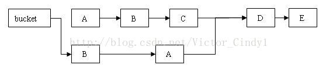
>
>从上图可以看出，删除节点 C 之后的所有节点原样保留到新链表中；删除节点 C 之前的每个节点被克隆到新链表中，注意：它们在新链表中的链接顺序被反转了。
> 在执行 remove 操作时，原始链表并没有被修改，也就是说：**读线程不会受同时执行 remove 操作的并发写线程的干扰**。
> 综合上面的分析我们可以看出，**写线程对某个链表的结构性修改不会影响其他的并发读线程对这个链表的遍历访问。**
>
>**用 HashEntery 对象的不变性来降低读操作对加锁的需求**
> 在代码清单“HashEntry 类的定义”中我们可以看到，HashEntry 中的 key，hash，next 都声明为 final 型。这意味着，不能把节点添加到链接的中间和尾部，也不能在链接的中间和尾部删除节点。这个特性可以保证：**在访问某个节点时，这个节点之后的链接不会被改变。这个特性可以大大降低处理链表时的复杂性。**
>
>根据 Java 内存模型，对 同一个 volatile 变量的写 / 读操作可以确保：写线程写入的值，能够被之后未加锁的读线程”看到”。
>
>这个特性和前面介绍的 HashEntry 对象的不变性相结合，使得在 ConcurrentHashMap 中，读线程在读取散列表时，基本不需要加锁就能成功获得需要的值。这两个特性相配合，不仅减少了请求同一个锁的频率（读操作一般不需要加锁就能够成功获得值），也减少了持有同一个锁的时间（只有读到 value 域的值为 null 时 , 读线程才需要加锁后重读）。
>
>### 基于通常情形而优化
>
>在实际的应用中，散列表一般的应用场景是：除了少数插入操作和删除操作外，绝大多数都是读取操作，而且读操作在大多数时候都是成功的。正是基于这个前提，ConcurrentHashMap 针对读操作做了大量的优化。**通过 HashEntry 对象的不变性和用 volatile 型变量协调线程间的内存可见性**，使得 大多数时候，读操作不需要加锁就可以正确获得值。这个特性使得 ConcurrentHashMap 的并发性能在分离锁的基础上又有了近一步的提高。
>
>总结：
>
>在使用锁来协调多线程间并发访问的模式下，减小对锁的竞争可以有效提高并发性。有两种方式可以减小对锁的竞争：
>
>1. 减小请求 同一个锁的 频率。
>2. 减少持有锁的 时间。
>
>ConcurrentHashMap 的高并发性主要来自于三个方面：
>
>1. 用分离锁实现多个线程间的更深层次的共享访问。
>2. **用 HashEntery 对象的不变性来降低执行读操作的线程在遍历链表期间对加锁的需求。**
>3. 通过对同一个 Volatile 变量的写 / 读访问，协调不同线程间读 / 写操作的内存可见性。
>

#### [ConcurrentHashMap 1.7 和 1.8 实现上的不同](https://blog.csdn.net/weixin_44460333/article/details/86770169)


>ConcurrentHashMap 同样也分为 1.7 、1.8 版，两者在实现上略有不同。
>
>### Base 1.7
>
>1.7 的实现，下面是他的结构图：
>
>
>
>原理上来说：**ConcurrentHashMap 采用了分段锁技术，其中 Segment 继承于 ReentrantLock。**不会像 HashTable 那样不管是 put 还是 get 操作都需要做同步处理，理论上 ConcurrentHashMap 支持 CurrencyLevel (Segment 数组数量)的线程并发。每当一个线程占用锁访问一个 Segment 时，不会影响到其他的 Segment。
>
>#### get 方法
>
>get 逻辑比较简单：
>
>只需要将 Key 通过 Hash 之后定位到具体的 Segment ，再通过一次 Hash 定位到具体的元素上。
>
>由于 HashEntry 中的 value 属性是用 volatile 关键词修饰的，保证了内存可见性，所以每次获取时都是最新值。
>
>ConcurrentHashMap 的 get 方法是非常高效的，**因为整个过程都不需要加锁**。
>
>### Base 1.8
>
>其中抛弃了原有的 Segment 分段锁，**而采用了 `CAS + synchronized` 来保证并发安全性。**
>
>也将 1.7 中存放数据的 HashEntry 改为 Node，但作用都是相同的。
>
>其中的 `val next` 都用了 volatile 修饰，保证了可见性。
>
>```text
>1.8 在 1.7 的数据结构上做了大的改动，采用红黑树之后可以保证查询效率（O(logn)），甚至取消了 ReentrantLock 改为了 synchronized，这样可以看出在新版的 JDK 中对 synchronized 优化是很到位的。
>```
>
>**1.8之后HashMap采用尾插法不会形成环形链表.**
>
>#### put 方法
>
>**(Note: 取消了分段锁，改 lock 加锁的方式为 cas + synchronized)**
>
>- 根据 key 计算出 hashcode 。
>- 判断是否需要进行初始化。
>- `f` 即为当前 key 定位出的 Node，**如果为空表示当前位置可以写入数据，利用 CAS 尝试写入，失败则自旋保证成功。**
>- 如果当前位置的 `hashcode == MOVED == -1`,则需要进行扩容。
>- 如果都不满足，则利用 synchronized 锁写入数据。
>- 如果数量大于 `TREEIFY_THRESHOLD` 则要转换为红黑树。
>
>#### get 方法
>
>- 根据计算出来的 hashcode 寻址，如果就在桶上那么直接返回值。
>- 如果是红黑树那就按照树的方式获取值。
>- 就不满足那就按照链表的方式遍历获取值。

### [泛型的定义、用法与类型通配符的使用方式](https://www.cnblogs.com/fwnboke/p/8529670.html)

>#### 定义泛型方法
>
>先使用常规方法进行对比。
>
>```java
>	public static void main(String[] args) {
>		int[] arr = new int[] {1, 8, 15, 6, 3};
>		double[] douArr = {10.5, 25.1, 4.9, 1.8};
>		String[] strArr = {"我","是","字","符","串"};
>		forArr(strArr);
>	}
>	
>//遍历数组的重载方法，支持int和double类型	
>	public static void forArr(int[] arr) {
>		for(int i=0; i<arr.length; i++) {
>			System.out.println(arr[i]);
>		}
>	}
>	//重载了
>	public static void forArr(double[] arr) {
>		for(double d : arr) {
>			System.out.println(d);
>		}
>	}
>	//……
>	//……
>```
>
>如上所示，如果想遍历String类型数组，那就还要再次重载代码，如果是八种类型都有，代码量非常庞大。使用泛型方法全部通用，代码如下：
>
>```java
>	public static void main(String[] args) {
>		Integer[] arr =  {1, 8, 15, 6, 3};
>		Double[] douArr = {10.5, 25.1, 4.9, 1.8};
>		String[] strArr = {"我","是","字","符","串"};
>		
>		forArrGenric(strArr);
>		
>	}
>	//泛型方法
>	public static <T> void forArrGenric(T[] arr) {
>		for(int i=0; i < arr.length; i++) {
>			System.out.println(arr[i]);
>		}
>	}
>```
>
>只需定义一个泛型方法，根据运行时传入的参数类型，动态地获取类型，就能做到遍历所有类型数组。但需要注意，泛型的类型参数只能是引用类型，值类型无法在泛型中使用，所以上面的数组都改成了引用类型。值类型需要使用对应的包装类类型。
>
>**泛型为何不能应用于静态申明的实例解析**
>
>先给一个例子，在静态变量中和静态代码块中使用泛型。
>
>```java
>public class Test<T> {
>	public static T name;  //error
>	public T sex ;
>	
>	static {
>		T ab; //error
>	}
>}
>```
>
>报出异常：不能使一个静态引用指向一个非静态的类型 T。静态和非静态之分就在于静态是编译时类型，动态是运行时类型。T代表未知类型，如果可以用于静态申明，因为是未知类型，系统没法指定初始值，手动赋值也不行，因为不知道啥类型，只有运行时才可以指定。而泛型存在的意义就是为了动态指定具体类型，增强灵活性和通用性，所以用于静态声明违背了使用原则。为什么实例变量和实例方法可以使用呢？因为当你使用实例变量或者方法时，就说明对象存在了，即代表泛型参数也指定了。未指定具体类型默认是Object类型。
>
>## 为什么静态方法中可以定义泛型方法呢？
>
>先给三个实例，我们来慢慢分析。
>
>```java
>public class Test<T> {
>	public static void main(String[] args) {
>		
>	}
>	
>	//泛型方法
>	public T demo1(T t) {
>		return t;
>	}
>	
>	//静态方法使用泛型参数
>//	public static T demo2(T t) { return t;}
>				
>	//定义泛型静态方法
>	public static <W> void demo3(W w) {
>		System.out.println(w);
>	}  
>}
>```
>
>首先，要明确一点，泛型作用是确定具体类型。先看一个泛型方法，使用了泛型参数T作为返回值，当使用对象时来调用该方法时，T类型会变成具体类型。第二个泛型方法是静态的，使用了T作为返回值和方法参数类型，但是静态方法是属于类的，类直接调用的话，T类型无法指定具体类型，那么该方法就没有意义。所以直接报错。第三个也是静态方法，但是该静态方法是自定义一个泛型参数，并非使用类型参数。所以当传入一个具体类型时，该静态方法的<W>就是具体类型了。两者静态方法的区别就是一个是使用泛型参数，一个是定义泛型方法。

### [世界时区和Java时区详解](https://www.cnblogs.com/oldtrafford/p/9680791.html)

>### 3、UTC 时间的时间戳
>
>讲清楚了时间表达方式，再讲时间戳。其实时间戳是没有时区概念的，或者说时间戳只能是0时区的。时间戳是从1970-01-11 00:00:00+0000开始的（原因大家都知道），也就是在'1970-01-11 00:00:00+0000'这个时间点，时间戳是0。再换句话说在'1970-01-11 08:00:00+0800'时间戳也是0。这也是Java里时间组件的默认方式，不管用户输入的人类可识别的时间是什么格式，在内部统一存的是时间戳。
>
>例如时间是'2018-09-01 08:00:00+0800'，那么使用date.getTime()获取到时间戳是1535760000000；时间是'2018-09-01 00:00:00+0000'，获取到时间戳也是1535760000000。
>
>**测试代码如下：**
>
>```
>SimpleDateFormat sdf = new SimpleDateFormat("yyyy-MM-dd HH:mm:ssZ");
>System.out.println(sdf.parse("2018-09-01 08:00:00+0800").getTime());
>System.out.println(sdf.parse("2018-09-01 00:00:00+0000").getTime());
>```
>
>可以观察到这2行代码的输出都是1535760000000，这就证明了上面的观点。再啰嗦2点：
>
>- 第一行代码DateFormat中Z表示时区，所以String类型格式时间带上+0800这种表达式，就能正确获取时间戳了。
>- SimpleDateFormat是线程不安全的，不要用
>

### volatile

[volatile 可见性 防止指令重排](https://blog.csdn.net/weixin_40849725/article/details/106968177)

>### 详细说明：
>
>如果对声明了volatile的变量进行写操作，JVM就会向处理器发送一条Lock前缀的指令，将这个变量所在缓存行的数据写回到系统内存。
>
>| Java代码： | instance = new Singleton();//instance是volatile变量          |
>| ---------- | ------------------------------------------------------------ |
>| 汇编代码： | 0x01a3de1d: movb $0x0,0x1104800(%esi);0x01a3de24: **lock addl** $0x0,(%esp); |
>
>但是，就算写回到内存，如果其他处理器缓存的值还是旧的，再执行计算操作就会有问题。
>所以在多处理器下，为了保证各个处理器的缓存是一致的，就会实现缓存一致性协议，每个处理器通过嗅探在总线上传播的数据来检查自己缓存的值是不是过期了，当处理器发现自己缓存行对应的内存地址被修改，就会将当前处理器的缓存行设置成无效状态，当处理器对这个数据进行修改操作的时候，就会重新从系统内存中把数据读到处理器缓存里。
>
>### 缓存一致性协议
>
>最出名的就是Intel 的MESI协议，MESI协议保证了每个缓存中使用的共享变量的副本是一致的。它核心的思想是：当CPU（中央处理器，central processing unit）写数据时，如果发现操作的变量是共享变量（被多个线程访问的变量），即在其他CPU中也存在该变量的副本，会发出信号通知其他CPU将该变量的缓存行置为无效状态，因此当其他CPU需要读取这个变量时，发现自己缓存中缓存该变量的缓存行是无效的，那么它就会从内存重新读取。
>
>防止指令重排：
>

[DCL单例模式，如何解决DCL问题](https://blog.csdn.net/qq_37001674/article/details/87984698)

>何为DCL，DCL即Double Check Lock，双重检查锁定。
>
>懒汉式
>
>```java
>public void Singleton{
>private static Singleton singleton;
>private Singleton(){}
>    
>public static Singleton getInstance(){
> if(singleton==null){
>      singleton=new Singleton();
>    }
>     
>       return singleton;
> }
>     }
>```
>
>这种方法在单线程下是可取的，但是在并发也就是在多线程的情况下是不可取的，因为其无法保证线程安全，优化如下：
>
> ```java
>public void Singleton{
>private static Singleton singleton;
>
>    private Singleton(){}
> 
>    public synchronized static Singleton getInstance(){
>    if(singleton==null){
>              singleton=new Singleton();
>        }
>     
>        return singleton;
> }
>     
>    }
> ```
>
>优化非常简单，在getInstance方法上加上了synchronized同步，尽管jdk6以后对synchronized做了优化，但还是会效率较低的，性能下降。那该如何解决这个问题？于是有人就想到了双重检查DCL
>
>```java
>public void Singleton{
>private static Singleton singleton;
>
>    private Singleton(){}
> 
>    public static Singleton getInstance(){
>    if(singleton==null){
>           synchronized(Singleton.class){
>                if(singleton==null)  singleton=new Singleton();
>            }
>     
>        }
>                 return singleton;
>     }
>     
>    }
> ```
>
>这个代码看起来perfect：
>
>1. 如果检查第一一个singleton不为null，则不需要执行加锁动作，极大的提高了性能
>2. 如果第一个singleton为null，即使有多个线程同时判断，但是由于synchronized的存在，只有一个线程能创建对象
>3. 当第一个获取锁的线程创建完成singleton对象后，其他的在第二次判断singleton一定不会为null，则直接返回已经创建好的singleton对象
>
>DCL看起来非常完美，但其实这个是不正确的。逻辑没问题，分析也没问题？但为何是不正确的？不妨我们先回顾一下创建对象的过程
>
>1. 为对象分配内存空间
>2. 初始化对象
>3. 将内存空间的地址赋值给对应的引用
>
>但由于jvm编译器的优化产生的重排序缘故，步骤2、3可能会发生重排序：
>
>1. 为对象分配内存空间
>2. 将内存空间的地址赋值给对应的引用
>3. 初始化对象
>
>如果2、3发生了重排序就会导致第二个判断会出错，singleton != null，但是它其实仅仅只是一个地址而已，此时对象还没有被初始化，所以return的singleton对象是一个没有被初始化的对象
>
>知道问题的原因，那么我们就可以解决？
>
>不允许重排序
>
>重排序不让其他线程看到
>
>### 解决方法
>
>利用volatile的特性即可阻止重排序和可见性
>
>```java
>public class Singleton {
>  //通过volatile关键字来确保安全
>  private volatile static Singleton singleton;
> 
>   private Singleton(){}
> 
>   public static Singleton getInstance(){
>       if(singleton == null){
>           synchronized (Singleton.class){
>               if(singleton == null){
>                   singleton = new Singleton();
>               }
>           }
>       }
>       return singleton;
>   }
> }
> ```
>
>类初始化的解决方案
>
>```java
>public class Singleton {
>  private static class SingletonHolder{
>      public static Singleton singleton = new Singleton();
>   }
> 
>   public static Singleton getInstance(){
>       return SingletonHolder.singleton;
>   }
> }
> ```
>
>该解决方案的根本就在于：利用classloder的机制来保证初始化instance时只有一个线程。JVM在类初始化阶段会获取一个锁，这个锁可以同步多个线程对同一个类的初始化。
>
>```text
>Java语言规定，对于每一个类或者接口C,都有一个唯一的初始化锁LC与之相对应。从C到LC的映射，由JVM的具体实现去自由实现。JVM在类初始化阶段期间会获取这个初始化锁，并且每一个线程至少获取一次锁来确保这个类已经被初始化过了。
>```

### [单例模式之六种实现方式](https://www.cnblogs.com/dafengdeai/p/12180476.html)

>#### 注意：
>
>1. 单例类只能有一个实例。
>2. 单例类必须自己创建自己的唯一实例。
>3. 单例类必须给所有其他对象提供这一实例。
>
>## 介绍
>
>#### 意图：
>
>> 保证一个类仅有一个实例，并提供一个访问它的全局访问点。
>
>#### 主要解决：
>
>> 一个全局使用的类频繁地创建与销毁。
>
>#### 何时使用：
>
>> 当您想控制实例数目，节省系统资源的时候。
>
>#### 如何解决：
>
>> 判断系统是否已经有这个单例，如果有则返回，如果没有则创建。
>
>#### 关键代码：
>
>> 构造函数是私有的。
>
>#### 优点：
>
>1. 在内存里只有一个实例，减少了内存的开销，尤其是频繁的创建和销毁实例
>2. 避免对资源的多重占用（比如写文件操作）
>
>### 4、双检锁/双重校验锁（DCL，即 double-checked locking）
>
>是否 Lazy 初始化：是
>
>是否多线程安全：是
>
>实现难度：较复杂
>
>描述：这种方式采用双锁机制，安全且在多线程情况下能保持高性能。
>getInstance() 的性能对应用程序很关键。
>
>```java
>public class Singleton { 
>  // volatile 防止指令重排，
>  // 但是java1.6后直接new对象没有指令重排的问题了,需要再确定下？？？
>    private volatile static Singleton singleton;  
>    private Singleton (){}  
>    public static Singleton getSingleton() {  
>        if (singleton == null) {  
>            synchronized (Singleton.class) {  
>            if (singleton == null) {  
>                singleton = new Singleton();  
>            }  
>        }  
>    }  
>    return singleton;  
>    }  
>}
>```
>
>### 5、静态内部类
>
>**是否 Lazy 初始化：是**
>
>是否多线程安全：是
>
>实现难度：一般
>
>描述：这种方式能达到双检锁方式一样的功效，但实现更简单。对静态域使用延迟初始化，应使用这种方式而不是双检锁方式。这种方式只适用于静态域的情况，双检锁方式可在实例域需要延迟初始化时使用。
>**这种方式同样利用了 classloader 机制来保证初始化 instance 时只有一个线程，**它跟第 3 种方式不同的是：第 3 种方式只要 Singleton 类被装载了，那么 instance 就会被实例化（没有达到 lazy loading 效果），而这种方式是 Singleton 类被装载了，instance 不一定被初始化。**因为 SingletonHolder 类没有被主动使用，只有通过显式调用 getInstance 方法时，才会显式装载 SingletonHolder 类，从而实例化 instance。想象一下，如果实例化 instance 很消耗资源，所以想让它延迟加载，另外一方面，又不希望在 Singleton 类加载时就实例化，因为不能确保 Singleton 类还可能在其他的地方被主动使用从而被加载，那么这个时候实例化 instance 显然是不合适的。这个时候，这种方式相比第 3 种方式就显得很合理。**
>
>```java
>public class Singleton {  
>    private static class SingletonHolder {  
>        private static final Singleton INSTANCE = new Singleton();  
>    }  
>    private Singleton (){}  
>    public static final Singleton getInstance() {  
>        return SingletonHolder.INSTANCE;  
>    }  
>}
>```
>
>### 6、枚举   （不懂？？？）
>
>JDK 版本：JDK1.5 起
>
>是否 Lazy 初始化：否
>
>是否多线程安全：是
>
>实现难度：易
>
>描述：这种实现方式还没有被广泛采用，但这是实现单例模式的最佳方法。它更简洁，自动支持序列化机制，绝对防止多次实例化。
>这种方式是 Effective Java 作者 Josh Bloch 提倡的方式，它不仅能避免多线程同步问题，而且还自动支持序列化机制，防止反序列化重新创建新的对象，绝对防止多次实例化。不过，由于 JDK1.5 之后才加入 enum 特性，用这种方式写不免让人感觉生疏，在实际工作中，也很少用。
>不能通过 reflection attack 来调用私有构造方法。
>
>```java
>public enum StringUtil {
>    INSTANCE;
>    public int str2Int(String str){
>        return Integer.parseInt(str);
>    }
>}
>```

### [Java正则表达式详解](https://www.jianshu.com/p/d47851245dba)

### [Java ServiceLoader使用和解析](https://blog.csdn.net/shi2huang/article/details/80308531)

>一、使用场景
>一般使用接口的实现类都是静态new一个实现类赋值给接口引用，如下：
>
>HelloService service = new HelloImpl();
>
>如果需要动态的获取一个接口的实现类呢？全局扫描全部的Class，然后判断是否实现了某个接口？代价太大，一般不会这么做。一种合适的方式就是使用配置文件，把实现类名配置在某个地方，然后读取这个配置文件，获取实现类名。JDK给我们提供的TestServiceLoader 就是这种方式。
>
>二、使用方式
>
>在实现类的jar包的META-INF下新建一个文件夹services，并在services下新建一个文件，以接口的全限定名为文件名，内容为实现类的全限定名。
>
>通过以下的例子来分析实现原理.
>
>1. 新建一个接口，2个实现类。
>
>```java
>package com.test.loader;
>public interface HelloService {
>	public void sayHello();
>}
>package com.test.loader;
>public class Dog implements HelloService {
>@Override
>public void sayHello() {
>System.out.println("bark bark bark...");
>}
>}
>package com.test.loader;
>public class Sheep implements HelloService {
>@Override
>public void sayHello() {
>	System.out.println("bleat bleat bleat...");
>}
>}
>```
>
>2. 分别把接口、2个实现类打成3个jar包，放在D盘下。
>
>
>
>3. 在Dog.jar、Sheep.jar 分别加上META-INF下新建一个文件夹services，并在services下新建一个文件，以接口的全限定名为文件名，内容为实现类的全限定名。如下：
>
>
>
>4. 使用指定的ClassLoader不包含实现类
>
>```java
>public static void notInTheClassLoader() throws MalformedURLException {
>		ClassLoader serviceCL = new URLClassLoader(new URL[] { new URL("file:" + "D:/HelloService.jar") }, TestServiceLoader.class.getClassLoader().getParent());
>		/* 指定的ClassLoader没有实现类，所以扫描不到META-INF/services/com.test.loader.HelloService */
>		ServiceLoader<HelloService> helloServices = ServiceLoader.load(HelloService.class, serviceCL);
>		Iterator<HelloService> it = helloServices.iterator();
>		while (it.hasNext()) {
>			HelloService service = it.next();
>			service.sayHello();
>		}
>	}
>```
>
>结果不会打印任何信息。
>
>5. 指定的ClassLoader包含实现类
>
>```java
>public static void inTheClassLoader() throws MalformedURLException {
>ClassLoader serviceCL = new URLClassLoader(new URL[] { new URL("file:" + "D:/Dog.jar"), new URL("file:" + "D:/Sheep.jar") },TestServiceLoader.class.getClassLoader().getParent());
>/* 实现类在指定的ClassLoader，所以可以扫描META-INF/services/com.test.loader.HelloService */
> ServiceLoader<HelloService> helloServices = ServiceLoader.load(HelloService.class, serviceCL);
>		Iterator<HelloService> it = helloServices.iterator();
>	while (it.hasNext()) {
>			HelloService service = it.next();
>			service.sayHello();
>		}
>	}
>```
>
>结果如下：
>
>```properties
>bark bark bark...
>bleat bleat bleat...
>```
>
>6. 使用指定的ClassLoader加载接口类，不指定ClassLoader加载实现类。
>
>```java
>public static void defaultClassLoader() throws MalformedURLException, ClassNotFoundException {
>		ClassLoader serviceCL = new URLClassLoader(new URL[] { new URL("file:" + "D:/HelloService.jar"),
>				new URL("file:" + "D:/Dog.jar"), new URL("file:" + "D:/Sheep.jar") },
>				TestServiceLoader.class.getClassLoader().getParent());
>		/* 默认会使用 ClassLoader.getSystemClassLoader() */
>		ServiceLoader<HelloService> helloServices = ServiceLoader
>				.load(
>         (Class<HelloService>) (serviceCL.loadClass("com.test.loader.HelloService")));
>		Iterator<HelloService> it = helloServices.iterator();
>		while (it.hasNext()) {
>			HelloService service = it.next();
>			service.sayHello();
>		}
>	}
>```
>
>结果不打印任何信息。
>
>7. 把2个实现jar加到工程的Build Path里面，不指定ClassLoader。
>
>
>
>```java
>public static void notSpecifyClassLoader() {
>
>		ServiceLoader<HelloService> helloServices = ServiceLoader.load(HelloService.class);
>		Iterator<HelloService> it = helloServices.iterator();
>		while (it.hasNext()) {
>      HelloService service = it.next();
>		   service.sayHello();
>		}
>	}
>```
>
>结果如下：
>
>```properties
>bark bark bark...
>
>bleat bleat bleat...
>```
>

### [背压(Back Pressure)与流量控制](https://lotabout.me/2020/Back-Pressure/)

>背压(back pressure)，也叫“反压”，指的是下游系统处理过慢，导致上游系统阻塞的现象。我们来聊聊背压后面的流控吧。
>
>## 流控策略
>
>如上图，系统中存在三方：生产者(Producer)产生数据，通过管道(Pipeline)传输给消费者(Consumer)。
>
>
>
>此时生产的速率(100/s)大于消费的速率(75/s)，多余的流量无处可去。于是自然地衍生出三种策略：
>
>1. 控制(Control)。降低生产速率，从源头减少流量
>2. 缓冲(Buffer)。管道将多余的流量存储起来
>3. 丢弃(Drop)。消费者将无暇处理的流量丢弃
>
>由于“控制”策略需要将消费者的压力反馈给生产者，从而降低生产速率，与“背压”现象很类似，因此在资料中背压也常常代指“控制”策略。

### [volatile 可见性 防止指令重排](https://blog.csdn.net/weixin_40849725/article/details/106968177)

># 指令重排
>
>指令重排是指在程序执行过程中, 为了性能考虑, 编译器和CPU可能会对指令重新排序.
>可参考：[Java内存模型与指令重排](https://www.cnblogs.com/xdecode/p/8948277.html).
>
>## 指令重排遵循的原则
>
>### as-if-serial原则
>
>[as-if-serial](https://www.cnblogs.com/jiuya/p/10791903.html)
>不管怎么重排序（编译器和处理器为了提高并行度），（单线程）程序的执行结果不能被改变。
>编译器，runtime 和处理器都必须遵守as-if-serial语义，（把单线程程序保护了起来）。
>为了遵守as-if-serial语义，编译器和处理器不会对存在数据依赖关系的操作做重排序，因为这种重排序会改变执行结果。但是，如果操作之间不存在数据依赖关系，这些操作可能被编译器和处理器重排序。
>
>### happens-before原则
>
>
>
>## 指令重排序导致的问题
>
>在单线程程序中，对存在控制依赖的操作重排序，不会改变执行结果（这也是as-if-serial语义允许对存在控制依赖的操作做重排序的原因）；但在多线程程序中，对存在控制依赖的操作重排序，可能会改变程序的执行结果。

### [@PostConstruct和@PreDestroy的使用说明](https://blog.csdn.net/qa275267067/article/details/89495290)

>有些需要在项目启动时执行的方法，如设置全局环境语言变量等，需要用到@PostConstruct注解，在此记录一下。
>
>1.@PostConstruct说明
>
>   被@PostConstruct修饰的方法会在服务器加载Servlet的时候运行，并且只会被服务器调用一次，类似于Servlet的inti()方法。被@PostConstruct修饰的方法会在构造函数之后，init() 方法之前运行。
>
>2.@PreDestroy说明
>
> 被@PreDestroy修饰的方法会在服务器卸载Servlet的时候运行，并且只会被服务器调用一次，类似于Servlet的destroy()方法。被@PreDestroy修饰的方法会在destroy()方法之后运行，在Servlet被彻底卸载之前。

### 理解 java.io.ObjectInputStream 和 java.io.ObjectOutputStream ？？？

java.io.ObjectOutputStream#annotateClass

java.io.ObjectInputStream#resolveObject

### 利用try-with-resource机制关闭连接

>JDK1.7之后有了try-with-resource处理机制。首先被自动关闭的资源需要实现Closeable或者AutoCloseable接口，因为只有实现了这两个接口才可以自动调用close()方法去自动关闭资源。写法为try(){}catch(){}，将要关闭的外部资源在try()中创建，catch()捕获处理异常。其实try-with-resource机制是一种语法糖，其底层实现原理仍然是try{}catch(){}finally{}写法，不过在catch(){}代码块中有一个addSuppressed()方法，即异常抑制方法。如果业务处理和关闭连接都出现了异常，业务处理的异常会抑制关闭连接的异常，只抛出处理中的异常，仍然可以通过getSuppressed()方法获得关闭连接的异常。
>————————————————
>版权声明：本文为CSDN博主「滴哩哩哩滴哩哩哩哒哒」的原创文章，遵循CC 4.0 BY-SA版权协议，转载请附上原文出处链接及本声明。
>原文链接：https://blog.csdn.net/weixin_42447959/article/details/81192098
>
>Java try-with-resource语句
>
>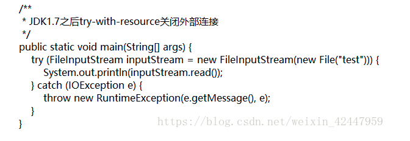


### java 的 RMI机制？？？


### 动态代理

https://www.liaoxuefeng.com/wiki/1252599548343744/1264804593397984

**简洁明了**

>有没有可能不编写实现类，直接在运行期创建某个`interface`的实例呢？
>
>这是可能的，因为Java标准库提供了一种动态代理（Dynamic Proxy）的机制：可以在运行期动态创建某个`interface`的实例。
>
>什么叫运行期动态创建？听起来好像很复杂。所谓动态代理，是和静态相对应的。我们来看静态代码怎么写：
>
>定义接口：
>
>```java
>public interface Hello {
>    void morning(String name);
>}
>```
>
>编写实现类：
>
>```java
>public class HelloWorld implements Hello {
>    public void morning(String name) {
>        System.out.println("Good morning, " + name);
>    }
>}
>```
>
>创建实例，转型为接口并调用：
>
>```java
>Hello hello = new HelloWorld();
>hello.morning("Bob");
>```
>
>这种方式就是我们通常编写代码的方式。
>
>还有一种方式是**动态代码，我们仍然先定义了接口`Hello`，但是我们并不去编写实现类，而是直接通过JDK提供的一个`Proxy.newProxyInstance()`创建了一个`Hello`接口对象**。这种没有实现类但是**在运行期动态创建了一个接口对象的方式，我们称为动态代码。JDK提供的动态创建接口对象的方式，就叫动态代理。**
>
>一个最简单的动态代理实现如下：
>
>```java
>import java.lang.reflect.InvocationHandler; import java.lang.reflect.Method; import java.lang.reflect.Proxy; 
>```
>
>一个最简单的动态代理实现如下：
>
>```java
>import java.lang.reflect.InvocationHandler; 
>import java.lang.reflect.Method; 
>import java.lang.reflect.Proxy; 
>
>public class Main {
>    public static void main(String[] args) {
>        InvocationHandler handler = new InvocationHandler() {
>            @Override
>            public Object invoke(Object proxy, Method method, Object[] args) throws Throwable {
>                System.out.println(method);
>                if (method.getName().equals("morning")) {
>                    System.out.println("Good morning, " + args[0]);
>                }
>                return null;
>            }
>        };
>        Hello hello = (Hello) Proxy.newProxyInstance(
>            Hello.class.getClassLoader(), // 传入ClassLoader
>            new Class[] { Hello.class }, // 传入要实现的接口
>            handler); // 传入处理调用方法的InvocationHandler
>        hello.morning("Bob");
>    }
>}
>
>interface Hello {
>    void morning(String name);
>}
>
>```
>
>**在运行期动态创建一个`interface`实例的方法如下：** 
>
>1. **定义一个`InvocationHandler`实例，它负责实现接口的方法调用；**
>2. **通过 `Proxy.newProxyInstance()` 创建 `interface` 实例，它需要3个参数：**
>   1. **使用的`ClassLoader`，通常就是接口类的`ClassLoader`；**
>   2. **需要实现的接口数组，至少需要传入一个接口进去；**
>   3. **用来处理接口方法调用的`InvocationHandler`实例。**
>3. **将返回的`Object`强制转型为接口。**


### [JAVA学习篇--静态代理VS动态代理](https://blog.csdn.net/hejingyuan6/article/details/36203505)

>Proxy 代理模式是一种结构型设计模式，主要解决的问题是：在直接访问对象时带来的问题。
>
>代理是一种常用的设计模式，其目的就是为其他对象提供一个代理以控制对某个对象的访问。
>
>AOP只是在对OOP的基础上进行进一步抽象，使我们的类的职责更加单一。
>
>
>
>按照代理的创建时期，代理类可以分为两种： 
>
>**静态：由程序员创建代理类或特定工具自动生成源代码再对其编译。在程序运行前代理类的.class文件就已经存在了。**
>
>**动态：在程序运行时运用反射机制动态创建而成。**
>
>* 静态代理类优缺点
>
>优点：
>
>代理使客户端不需要知道实现类是什么，怎么做的，而客户端只需知道代理即可（解耦合），对于如上的客户端代码，newUserManagerImpl()可以应用工厂将它隐藏，如上只是举个例子而已。
>
>缺点：
>
>1）代理类和委托类实现了相同的接口，代理类通过委托类实现了相同的方法。这样就出现了大量的代码重复。如果接口增加一个方法，除了所有实现类需要实现这个方法外，所有代理类也需要实现此方法。增加了代码维护的复杂度。
>
>2）**代理对象只服务于一种类型的对象，如果要服务多类型的对象。势必要为每一种对象都进行代理，静态代理在程序规模稍大时就无法胜任了。如上的代码是只为UserManager类的访问提供了代理，但是如果还要为其他类如Department类提供代理的话，就需要我们再次添加代理Department的代理类。**
>
>2.动态代理类
>与静态代理类对照的是动态代理类，动态代理类的字节码在程序运行时由Java反射机制动态生成，无需程序员手工编写它的源代码。动态代理类不仅简化了编程工作，而且提高了软件系统的可扩展性，因为Java 反射机制可以生成任意类型的动态代理类。java.lang.reflect 包中的Proxy类和InvocationHandler 接口提供了生成动态代理类的能力。
>Proxy类提供了创建动态代理类及其实例的静态方法。
>（1）getProxyClass()静态方法负责创建动态代理类，它的完整定义如下：
>public static Class<?> getProxyClass(ClassLoader loader, Class<?>[] interfaces) throws IllegalArgumentException
>参数loader 指定动态代理类的类加载器，参数interfaces 指定动态代理类需要实现的所有接口。
>（2）newProxyInstance()静态方法负责创建动态代理类的实例，它的完整定义如下：
>public static Object newProxyInstance(ClassLoader loader, Class<?>[] interfaces, InvocationHandler handler) throws
>IllegalArgumentException
>参数loader 指定动态代理类的类加载器，参数interfaces 指定动态代理类需要实现的所有接口，参数handler 指定与动态代理类关联的 InvocationHandler 对象。
>以下两种方式都创建了实现Foo接口的动态代理类的实例：
>*方式一 
>//创建InvocationHandler对象
>InvocationHandler handler = new MyInvocationHandler(...);
>//创建动态代理类
>Class proxyClass = Proxy.getProxyClass(Foo.class.getClassLoader(), new Class[] { Foo.class });
>//创建动态代理类的实例
>Foo foo = (Foo) proxyClass.getConstructor(new Class[] { InvocationHandler.class }).
>newInstance(new Object[] { handler });
>*方式二 
>//创建InvocationHandler对象
>InvocationHandler handler = new MyInvocationHandler(...);
>//直接创建动态代理类的实例
>Foo foo = (Foo) Proxy.newProxyInstance(Foo.class.getClassLoader(),new Class[] { Foo.class }, handler);
>由Proxy类的静态方法创建的动态代理类具有以下特点：
>动态代理类是public、final和非抽象类型的；
>动态代理类继承了java.lang.reflect.Proxy类；
>动态代理类的名字以“$Proxy”开头；
>动态代理类实现getProxyClass()和newProxyInstance()方法中参数interfaces指定的所有接口；

### [java不同的包下相同的类名的问题与解决办法](https://www.cnblogs.com/yanggb/p/10650256.html)

>第二个问题，不同的jar里面相同的包名类名怎么去区别导入。
>
>这个问题与标题不符，标题是不同的包，这里的问题是不同的jar，虽然跑题了，但是还是可以归类到这里。
>
>具体问题是，如果两个jar包里面有相同的包，有相同的类名，如果同时引用了这两个jar，就可能会产生引用的类不对的问题。
>
>要知道这个问题产生的原因，就要了解JVM加载的方法。JVM在加载包的时候，是按CLASSPATH的路径从上往下找，找到第一个后就将这个包引用。
>
>这时如果包名和类名都相同，那么JVM就没法区分了。一般来说我们用的IDE都是会提示发生冲突而报错的，如果不报错的话，那么就只有第一个包被引入，即在CLASSPATH路径下排在前面的包，第二个包会在classLoader加载类的时候判断重复而忽略。
>
>知道了JVM加载包的方法，那么解决问题就很容易了，只需要将需要引用包的jar放在前边就可以了，也就是说放在CLASSPATH路径下前沿的位置。

### [受检异常和非受检异常的区别](https://blog.csdn.net/weixin_39506180/article/details/106720843)

>**非受检异常（RuntimeException）**：这类异常是编程人员的逻辑问题，不需要对异常进行捕获或者抛出。程序自动输入异常信息，常见的异常有：NullPointerException,ClassCastException,ArrayIndexsOutOfBoundsException.
>
>**受检异常（非RuntimeException）**：这类异常是由一些外部的偶然因素所引起的，**必须对该类型的异常进行捕获或者抛出**；受检异常可以控制义务逻辑，可在catch中处理异常带了的问题，常见的异常有：Exception, FileNotFoundException, IOException, SQLException。
>
>
>两者的差异和优缺点:
>受检异常是通过继承 Exception 来实现的.
>非受检异常是通过继承 RuntimeException 来实现的.
>
>受检异常降低代码的可读性，也可以影响代码规范的原则。
>当受检异常威胁到系统的稳定性、安全性、可靠性的时候必须进行处理，不能转换成非受检异常。其他情况下可转换成非受检异常。

### h3 [为什么阿里巴巴Java开发手册中强制要求接口返回值不允许使用枚举？](https://blog.csdn.net/qq_27276045/article/details/106152887)

>由于升级原因，导致双方的枚举类不尽相同，在接口解析，类反序列化时出现异常。
>
>Java 中出现的任何元素，在 Gosling 的角度都会有背后的思考和逻辑（尽管并非绝对完美，但 Java 的顶层抽象已经是天才级了），比如：接口、抽象类、注解、和本文提到的枚举。枚举有好处，类型安全，清晰直接，还可以使用等号来判断，也可以用在 switch 中。它的劣势也是明显的，就是不要扩展。可是为什么在返回值和参数进行了区分呢，如果不兼容，那么两个都有问题，怎么允许参数可以有枚举。当时的考虑，如果参数也不能用，那么枚举几乎无用武之地了。参数输入，毕竟是本地决定的，你本地有的，传送过去，向前兼容是不会有问题的。但如果是接口返回，就比较恶心了，因为解析回来的这个枚举值，可能本地还没有，这时就会抛出序列化异常。
>
>比如：你的本地枚举类，有一个天气 Enum：SUNNY, RAINY, CLOUDY，如果根据天气计算心情的方法：guess(WeatcherEnum xx)，传入这三个值都是可以的。返回值：Weather guess(参数)，那么对方运算后，返回一个 SNOWY，本地枚举里没有这个值，傻眼了。

### [自定义注解详细介绍](https://blog.csdn.net/xsp_happyboy/article/details/80987484)   实用，清晰

>2.1 基本语法
>注解类型的声明部分：
>
>注解在Java中，与类、接口、枚举类似，因此其声明语法基本一致，只是所使用的关键字有所不同@interface。在底层实现上，所有定义的注解都会自动继承java.lang.annotation.Annotation接口。
>
>```java
>public @interface CherryAnnotation {
>}
>```
>
>注解类型的实现部分：
>
>根据我们在自定义类的经验，在类的实现部分无非就是书写构造、属性或方法。但是，在自定义注解中，其实现部分只能定义一个东西：注解类型元素（annotation type element）。咱们来看看其语法：
>
>```java
>public @interface CherryAnnotation {
>	public String name();
>	int age();
>	int[] array();
>}
>```
>
>也许你会认为这不就是接口中定义抽象方法的语法嘛？别着急，咱们看看下面这个：
>
>```java
>public @interface CherryAnnotation {
>	public String name();
>	int age() default 18;
>	int[] array();
>}
>
>```
>
>看到关键字default了吗？还觉得是抽象方法吗？
>
>注解里面定义的是：注解类型元素！
>
>定义注解类型元素时需要注意如下几点：
>
>**访问修饰符必须为public，不写默认为public；**
>**该元素的类型只能是基本数据类型、String、Class、枚举类型、注解类型（体现了注解的嵌套效果）以及上述类型的一位数组；**
>**该元素的名称一般定义为名词，如果注解中只有一个元素，请把名字起为value（后面使用会带来便利操作）；**
>**()不是定义方法参数的地方，也不能在括号中定义任何参数，仅仅只是一个特殊的语法；**
>**default代表默认值，值必须和第2点定义的类型一致；**
>**如果没有默认值，代表后续使用注解时必须给该类型元素赋值。**
>**可以看出，注解类型元素的语法非常奇怪，即又有属性的特征（可以赋值）,又有方法的特征（打上了一对括号）**。
>
>但是这么设计是有道理的，我们在后面的章节中可以看到：**注解在定义好了以后，使用的时候操作元素类型像在操作属性，解析的时候操作元素类型像在操作方法。**
>
>2.2 常用的元注解
>一个最最基本的注解定义就只包括了上面的两部分内容：1、注解的名字；2、注解包含的类型元素。但是，我们在使用JDK自带注解的时候发现，有些注解只能写在方法上面（比如@Override）；有些却可以写在类的上面（比如@Deprecated）。当然除此以外还有很多细节性的定义，那么这些定义该如何做呢？接下来就该元注解出场了！
>元注解：专门修饰注解的注解。它们都是为了更好的设计自定义注解的细节而专门设计的。我们为大家一个个来做介绍。
>
>2.2.1 @Target
>@Target注解，是专门用来限定某个自定义注解能够被应用在哪些Java元素上面的。它使用一个枚举类型定义如下：
>
>```java
>public enum ElementType {
>    /** 类，接口（包括注解类型）或枚举的声明 */
>    TYPE,
>/** 属性的声明 */
>FIELD,
>
>/** 方法的声明 */
>METHOD,
>
>/** 方法形式参数声明 */
>PARAMETER,
>
>/** 构造方法的声明 */
>CONSTRUCTOR,
>
>/** 局部变量声明 */
>LOCAL_VARIABLE,
>
>/** 注解类型声明 */
>ANNOTATION_TYPE,
>
>/** 包的声明 */
>PACKAGE
>}
>```
>
>//@CherryAnnotation被限定只能使用在类、接口或方法上面
>
>```java
>//@CherryAnnotation被限定只能使用在类、接口或方法上面
>@Target(value = {ElementType.TYPE,ElementType.METHOD})
>public @interface CherryAnnotation {
>    String name();
>    int age() default 18;
>    int[] array();
>}
>
>```
>
>2.2.2 @Retention
>@Retention 注解，翻译为持久力、保持力。即用来修饰自定义注解的生命力。
>注解的生命周期有三个阶段：1、Java源文件阶段；2、编译到class文件阶段；3、运行期阶段。同样使用了RetentionPolicy枚举类型定义了三个阶段：
>
>```java
>public enum RetentionPolicy {
>    /**
>     * Annotations are to be discarded by the compiler.
>     * （注解将被编译器忽略掉）
>     */
>    SOURCE,
>
>    /**
>     * Annotations are to be recorded in the class file by the compiler
>     * but need not be retained by the VM at run time.  This is the default
>     * behavior.
>     * （注解将被编译器记录在class文件中，但在运行时不会被虚拟机保留，这是一个默认的行为）
>     */
>    CLASS,
>
>    /**
>     * Annotations are to be recorded in the class file by the compiler and
>     * retained by the VM at run time, so they may be read reflectively.
>     * （注解将被编译器记录在class文件中，而且在运行时会被虚拟机保留，因此它们能通过反射被读取到）
>     * @see java.lang.reflect.AnnotatedElement
>     */
>    RUNTIME
>}
>
>```
>
>我们再详解一下：
>
>如果一个注解被定义为RetentionPolicy.SOURCE，则它将被限定在Java源文件中，那么这个注解即不会参与编译也不会在运行期起任何作用，这个注解就和一个注释是一样的效果，只能被阅读Java文件的人看到；
>如果一个注解被定义为RetentionPolicy.CLASS，则它将被编译到Class文件中，那么编译器可以在编译时根据注解做一些处理动作，但是运行时JVM（Java虚拟机）会忽略它，我们在运行期也不能读取到；
>如果一个注解被定义为RetentionPolicy.RUNTIME，那么这个注解可以在运行期的加载阶段被加载到Class对象中。那么在程序运行阶段，我们可以通过反射得到这个注解，并通过判断是否有这个注解或这个注解中属性的值，从而执行不同的程序代码段。我们实际开发中的自定义注解几乎都是使用的RetentionPolicy.RUNTIME；
>在默认的情况下，自定义注解是使用的RetentionPolicy.CLASS。
>2.2.3 @Documented
>@Documented注解，是被用来指定自定义注解是否能随着被定义的java文件生成到JavaDoc文档当中。
>
>2.2.4 @Inherited
>@Inherited注解，是指定某个自定义注解如果写在了父类的声明部分，那么子类的声明部分也能自动拥有该注解。@Inherited注解只对那些@Target被定义为ElementType.TYPE的自定义注解起作用。
>————————————————
>版权声明：本文为CSDN博主「cherry-peng」的原创文章，遵循CC 4.0 BY-SA版权协议，转载请附上原文出处链接及本声明。
>原文链接：https://blog.csdn.net/xsp_happyboy/article/details/80987484


### h3   guava 官方文档

https://github.com/google/guava/wiki


## [Apache HttpComponents](http://hc.apache.org/index.html)


## [@JsonFormat与@DateTimeFormat注解的使用](https://www.cnblogs.com/mracale/p/9828346.html)

>在 controller 层我们使用 spring mvc 表单自动封装映射对象时，我们在对应的接收前台数据的对象的属性上加@@DateTimeFormat
>
>```
>@DateTimeFormat(pattern = ``"yyyy-MM-dd"``)``@JsonFormat(pattern = ``"yyyy-MM-dd HH:mm:ss"``,timezone=``"GMT+8"``)``private` `Date symstarttime;` `@DateTimeFormat(pattern = ``"yyyy-MM-dd"``)``@JsonFormat(pattern = ``"yyyy-MM-dd HH:mm:ss"``,timezone=``"GMT+8"``)``private` `Date symendtime;
>```
>
>　　我这里就只贴这两个属性了，这里我两个注解都同时使用了，因为我既需要取数据到前台，也需要前台数据传到后台，都需要进行时间格式的转换，可以同时使用
>
>3.通过上面两个步骤之后，我们就可以获取一个符合自定义格式的时间格式存储到数据库了
>
>总结： 
>
> 注解@JsonFormat主要是后台到前台的时间格式的转换.
>
> 注解@DataFormAT主要是前后到后台的时间格式的转换.

**Java Integer(-128~127)**值的**==**和**equals**比较产生的思考

https://blog.csdn.net/chengzhezhijian/article/details/9628251

>**<-128~127**以内的**Integer**值，**Integer x = value;**的方式赋值！**>**
>
>**i=127,j =127**
>
>**i == j**：**true<--**比较**-->i.equals(j):true**
>
>**<-128~127**以外的**Integer**值，**Integer x = value;**的方式赋值！**>**
>
>**m=128,n =128**
>
>**m == n**：**false<--**比较**-->m.equals(n):true**
>
>**<**任意**Integer**值，**Integer x = new Integer(value);**的方式赋值！**>**
>
>**x=299,y =299**
>
>**1**、以上代码第一段和第二段旨在说明：在**-128~127**的**Integer**值并且以**Integer x = value;**的方式赋值的**Integer**值在进行**==**和**equals**比较时，都会返回**true**，数值之间==也是比较的对象地址值，可是都取的静态数组里面的integer对象，所以是一样的，超过就会创建新的integer对象。
>
>**2**、第三段旨在说明：**==**和**equals**的区别，**==**是进行地址及值比较，无法对**==**操作符进行重载，而对于**equals**方法，**Integer**里面的**equals**方法重写了**Object**的**equals**方法，查看**Integer**源码可以看出**equals**方法进行的是数值比较。
>
>这儿的IntegerCache有一个静态的Integer数组，在类加载时就将-128 到 127 的Integer对象创建了，并保存在cache数组中，一旦程序调用valueOf 方法，如果i的值是在-128 到 127 之间就直接在cache缓存数组中去取Integer对象。
>
>***使用Oracle/Sun JDK 6，在server模式下，使用-XX:AutoBoxCacheMax=NNN参数即可将Integer的自动缓存区间设置为[-128,NNN]。注意区间的下界固定在-128不可配置。***
>
>在设置了-XX:+AggressiveOpts启动参数后，AutoBoxCacheMax 的默认值会被修改为 20000 并且生效。


## 线程池和信号量的区别？--------------0524

Semaphore和线程池的差异
https://zhuanlan.zhihu.com/p/111038801

2. Semaphore和线程池的区别
先亮结果，Semaphore和线程池的区别如下：

使用Semaphore，实际工作线程由开发者自己创建；使用线程池，实际工作线程由线程池创建.
使用Semaphore，并发线程的控制必须手动通过acquire()和release()函数手动完成；使用线程池，并发线程的控制由线程池自动管理.
使用Semaphore不支持设置超时和实现异步访问；使用线程池则可以实现超时和异步访问，通过提交一个Callable对象获得Future，从而可以在需要时调用Future的方法获得线程执行的结果，同样利用Future也可以实现超时.

用Semaphore实现互斥锁
使用信号值为1的Semaphore对象便可以实现互斥锁，示例如下：

``` java
public static void testSemaphoreMutex() {
    Semaphore semaphore = new Semaphore(1);
    for (int i = 0; i < 6; i++) {
        new Thread() {
            public void run() {
                try {
                    semaphore.acquire();
                    System.out.println(Thread.currentThread().getName() + " get semaphore");
                    Thread.sleep(2000);
                    System.out.println(Thread.currentThread().getName() + " release semaphore");
                    semaphore.release();
                } catch (InterruptedException e) {
                    e.printStackTrace();
                }
            }
        }.start();
    }
}
```

可以看出，任何一个线程在释放许可之前，其它线程都拿不到许可。这样当前线程必须执行完毕，其它线程才可执行，这样就实现了互斥。

4. Semaphore 的易错点
使用Semophore时有一个非常容易犯错误的地方，即先release再acqure后会导致Semophore管理的虚拟许可额外新增一个.


## [悲观锁、乐观锁](https://blog.csdn.net/qq_34337272/article/details/81072874)

>悲观锁
>**总是假设最坏的情况，每次去拿数据的时候都认为别人会修改，所以每次在拿数据的时候都会上锁**，这样别人想拿这个数据就会阻塞直到它拿到锁（**共享资源每次只给一个线程使用，其它线程阻塞，用完后再把资源转让给其它线程**）。传统的关系型数据库里边就用到了很多这种锁机制，比如行锁，表锁等，读锁，写锁等，都是在做操作之前先上锁。Java中synchronized和ReentrantLock等独占锁就是悲观锁思想的实现。
>
>乐观锁：适用于多读的应用类型
>**总是假设最好的情况，每次去拿数据的时候都认为别人不会修改，所以不会上锁，但是在更新的时候会判断一下在此期间别人有没有去更新这个数据，可以使用版本号机制和CAS算法实现。乐观锁适用于多读的应用类型，这样可以提高吞吐量**，像数据库提供的类似于write_condition机制，其实都是提供的乐观锁。在Java中java.util.concurrent.atomic包下面的原子变量类就是使用了乐观锁的一种实现方式CAS实现的。
>
>**两种锁的使用场景
>从上面对两种锁的介绍，我们知道两种锁各有优缺点，不可认为一种好于另一种，像乐观锁适用于写比较少的情况下（多读场景），即冲突真的很少发生的时候，这样可以省去了锁的开销，加大了系统的整个吞吐量。但如果是多写的情况，一般会经常产生冲突，这就会导致上层应用会不断的进行retry，这样反倒是降低了性能，所以一般多写的场景下用悲观锁就比较合适。**
>
>**CAS与synchronized的使用情景**
>**简单的来说CAS适用于写比较少的情况下（多读场景，冲突一般较少），synchronized适用于写比较多的情况下（多写场景，冲突一般较多）**
>
>对于资源竞争较少（线程冲突较轻）的情况，使用synchronized同步锁进行线程阻塞和唤醒切换以及用户态内核态间的切换操作额外浪费消耗cpu资源；而CAS基于硬件实现，不需要进入内核，不需要切换线程，操作自旋几率较少，因此可以获得更高的性能。
>对于资源竞争严重（线程冲突严重）的情况，CAS自旋的概率会比较大，从而浪费更多的CPU资源，效率低于synchronized。
>补充： **Java并发编程这个领域中synchronized关键字一直都是元老级的角色，很久之前很多人都会称它为 “重量级锁” 。但是，在JavaSE 1.6之后进行了主要包括为了减少获得锁和释放锁带来的性能消耗而引入的 偏向锁 和 轻量级锁 以及其它各种优化之后变得在某些情况下并不是那么重了。synchronized的底层实现主要依靠 Lock-Free 的队列，基本思路是 自旋后阻塞，竞争切换后继续竞争锁，稍微牺牲了公平性，但获得了高吞吐量。在线程冲突较少的情况下，可以获得和CAS类似的性能；而线程冲突严重的情况下，性能远高于CAS。**


## Java里一个线程调用了Thread.interrupt()到底意味着什么？

https://www.zhihu.com/question/41048032/answer/89431513

首先，一个线程不应该由其他线程来强制中断或停止，而是应该由线程自己自行停止。

所以，Thread.stop, Thread.suspend, Thread.resume 都已经被废弃了。

而 Thread.interrupt 的作用其实也不是中断线程，而是「[通知线程](https://www.zhihu.com/search?q=通知线程&search_source=Entity&hybrid_search_source=Entity&hybrid_search_extra={"sourceType"%3A"answer"%2C"sourceId"%3A89431513})应该中断了」，

**具体到底中断还是继续运行，应该由被通知的线程自己处理。**

具体来说，当对一个线程，调用 interrupt() 时，

**① 如果线程处于被阻塞状态（例如处于sleep, wait, join 等状态），那么线程将立即退出被阻塞状态，并抛出一个InterruptedException异常。仅此而已。**

**② 如果线程处于正常活动状态，那么会将该线程的中断标志设置为 true，仅此而已。被设置中断标志的线程将继续正常运行，不受影响。**

interrupt() 并不能真正的中断线程，需要被调用的线程自己进行配合才行。

也就是说，一个线程如果有被中断的需求，那么就可以这样做。

**① 在正常运行任务时，经常检查本线程的中断标志位，如果被设置了中断标志就自行停止线程。**

**② 在调用[阻塞方法](https://www.zhihu.com/search?q=阻塞方法&search_source=Entity&hybrid_search_source=Entity&hybrid_search_extra={"sourceType"%3A"answer"%2C"sourceId"%3A89431513})时正确处理InterruptedException异常。（例如，catch异常后就结束线程。**


## Nginx 专题   #####


### nginx 常用命令

* nginx 常用命令

```shell
# linux/mac启动
$ service nginx start
# 手动指定配置
$ nginx -c /usr/local/nginx/conf/nginx.conf
# -p指定nginx运行目录(日志存储位置)
$ nginx -c /path/nginx.conf -p /path/
# 重启
$ nginx -s reload
# 关闭
$ nginx -s stop
# 查看nginx.conf配置文件位置
nginx -t
```

* nginx 配置文件解析

[nginx常用配置文件解析](https://www.jianshu.com/p/cee15a00728b)

>**server虚拟主机配置**
>
>http服务上支持若干虚拟主机。每个虚拟主机一个对应的server配置项，配置项里面包含该虚拟主机相关的配置。在提供mail服务的代理时，也可以建立若干server。每个server通过监听地址或端口来区分。
>
>### listen
>
>监听端口，默认80，小于1024的要以root启动。可以为listen *:80、listen 127.0.0.1:80等形式。
>
>### server_name
>
>服务器名，如localhost、[www.example.com](https://links.jianshu.com/go?to=http%3A%2F%2Fwww.example.com)，可以通过正则匹配。
>
>## location配置
>
>http服务中，某些特定的URL对应的一系列配置项
>
>### root /var/www/html
>
>定义服务器的默认网站根目录位置。如果locationURL匹配的是子目录或文件，root没什么作用，一般放在server指令里面或/下。
>
>### index index.jsp index.html index.htm
>
>定义路径下默认访问的文件名，一般跟着root放
>
>### proxy_pass http:/backend
>
>**请求转向backend定义的服务器列表，即反向代理，对应upstream负载均衡器**。也可以proxy_pass [http://ip:port](https://links.jianshu.com/go?to=http%3A%2F%2Fip%3Aport)。

* [Nginx配置中的log_format用法梳理（设置详细的日志格式）](https://www.cnblogs.com/kevingrace/p/5893499.html)

>```
>参数           说明                     示例
>$remote_addr       客户端地址                  211.28.65.253
>$remote_user       客户端用户名称                --
>$time_local       访问时间和时区                18``/Jul/2012``:17:00:01 +0800
>$request         请求的URI和HTTP协议              ``"GET /article-10000.html HTTP/1.1"
>$http_host        请求地址，即浏览器中你输入的地址（IP或域名）   www.wang.com 192.168.100.100
>$status         HTTP请求状态                 200
>$upstream_status     upstream状态                 200
>$body_bytes_sent     发送给客户端文件内容大小            1547
>$http_referer      url跳转来源                  https:``//www``.baidu.com/
>$http_user_agent     用户终端浏览器等信息              "Mozilla``/4``.0 (compatible; MSIE 8.0; Windows NT 5.1; Trident``/4``.0; SV1; GTB7.0; .NET4.0C;
>$ssl_protocol      SSL协议版本                  TLSv1
>$ssl_cipher       交换数据中的算法                RC4-SHA
>$upstream_addr      后台upstream的地址，即真正提供服务的主机地址   10.10.10.100:80
>$request_time      整个请求的总时间                0.205
>$upstream_response_time 请求过程中，upstream响应时间          0.002
>```

* [nginx 中通过server_name listen的方式配置多个服务器](https://blog.csdn.net/thlzjfefe/article/details/84489311)

>nginx作为代理服务器部署在主机 A 上面，B 和 C 作为两台应用服务器。现在想实现通过A访问B和C，有以下两种方式：
>
>一、通过不同的listen实现对B和C的访问，实现方式如下：在nginx.conf中添加两个server
>
>server {
>            listen  8081;
>            server_name test1;
>            location / {
>                proxy_pass http://192.168.1.168:9093;
>            }
>   }
>
>server {
>            listen  8082;
>            server_name test2;
>            location / {
>                proxy_pass http://192.168.1.169:9093;
>            }
>   }
>
>注意：1、在以上配置中，server_name 可以任意取名。
>
>           2、主机B的访问方式通过A监听端口8081来代理，访问方式：http://192.168.1.167:8081
>                                                                                                                                
>           3、主机C的访问方式通过A监听端口8082来代理，访问方式：http://192.168.1.167:8082
>
>二、通过相同的listen，不同的server_name实现对B和C的访问，即通过不同的域名方式访问B和C，实现方式如下：
>
>server {
>            listen  8080;
>            server_name www.test1.com;
>            location / {
>                proxy_pass http://192.168.1.168:9093;
>            }
>   }
>
>server {
>            listen  8080;
>            server_name www.test2.com;
>            location / {
>                proxy_pass http://192.168.1.169:9093;
>            }
>   }
>————————————————
>版权声明：本文为CSDN博主「thlzjfefe」的原创文章，遵循CC 4.0 BY-SA版权协议，转载请附上原文出处链接及本声明。
>原文链接：https://blog.csdn.net/thlzjfefe/article/details/84489311

Nginx 日志

* [Configuring Logging](https://docs.nginx.com/nginx/admin-guide/monitoring/logging/)

>Another example of the log format enables tracking different time values between NGINX and an upstream server that may help to diagnose a problem if your website experience slowdowns. You can use the following variables to log the indicated time values:
>
>- [`$upstream_connect_time`](https://nginx.org/en/docs/http/ngx_http_upstream_module.html?&_ga=2.138239600.17528474.1591347329-1120404259.1591347329#var_upstream_connect_time) – The time spent on establishing a connection with an upstream server
>- [`$upstream_header_time`](https://nginx.org/en/docs/http/ngx_http_upstream_module.html#var_upstream_header_time) – The time between establishing a connection and receiving the first byte of the response header from the upstream server
>- [`$upstream_response_time`](https://nginx.org/en/docs/http/ngx_http_upstream_module.html#var_upstream_response_time) – The time between establishing a connection and receiving the last byte of the response body from the upstream server
>- [`$request_time`](https://nginx.org/en/docs/http/ngx_http_log_module.html#var_request_time) – The total time spent processing a request

* [FastCGI介绍及Nginx fastcgi配置优化](https://www.cnblogs.com/xiewenming/p/8109292.html)

* [[FastCGI - 维基百科，自由的百科全书](https://zh.wikipedia.org/zh-hans/FastCGI)

* [nginx优化之request_time和upstream_response_time差别](https://www.cnblogs.com/dongruiha/p/7007801.html)

>1、request_time
>
>官网描述：request processing time in seconds with a milliseconds resolution; time elapsed between the first bytes were read from the client and the log write after the last bytes were sent to the client 。
>
>指的就是从接受用户请求的第一个字节到发送完响应数据的时间，即包括接收请求数据时间、程序响应时间、输出响应数据时间。
>
>2、upstream_response_time
>
>官网描述：keeps times of responses obtained from upstream servers; times are kept in seconds with a milliseconds resolution. Several response times are separated by commas and colons like addresses in the $upstream_addr variable
>
>是指从Nginx向后端（php-cgi)建立连接开始到接受完数据然后关闭连接为止的时间。
>
>从上面的描述可以看出，$request_time肯定大于等于$upstream_response_time，特别是使用POST方式传递参数时，因为Nginx会把request body缓存住，接受完毕后才会把数据一起发给后端。所以如果用户网络较差，或者传递数据较大时，$request_time会比$upstream_response_time大很多。 
>
>所以如果使用nginx的accesslog查看php程序中哪些接口比较慢的话，记得在log_format中加入$upstream_response_time。
>
>根据引贴对官网描述的翻译：
>upstream_response_time:从 Nginx 建立连接 到 接收完数据并关闭连接
>request_time:从 接受用户请求的第一个字节 到 发送完响应数据.

## [logback 配置详解—logger、root](https://blog.csdn.net/u012129558/article/details/79947477)

>第2种：带有loger的配置，不指定级别，不指定appender，
>
>```java
>package logback;  
>  
>import org.slf4j.Logger;  
>import org.slf4j.LoggerFactory;  
>  
>public class LogbackDemo {  
>    private static Logger log = LoggerFactory.getLogger(LogbackDemo.class);  
>    public static void main(String[] args) {  
>        log.trace("======trace");  
>        log.debug("======debug");  
>        log.info("======info");  
>        log.warn("======warn");  
>        log.error("======error");  
>    }  
>}
>```
>
>
>
>```xml
> <configuration>   
>   
>  <appender name="STDOUT" class="ch.qos.logback.core.ConsoleAppender">   
>    <!-- encoder 默认配置为PatternLayoutEncoder -->   
>    <encoder>   
>      <pattern>%d{HH:mm:ss.SSS} [%thread] %-5level %logger{36} - %msg%n</pattern>   
>    </encoder>   
>  </appender>   
>   
>  <!-- logback为java中的包 -->   
>  <logger name="logback"/>   
>   
>  <root level="DEBUG">             
>    <appender-ref ref="STDOUT" />   
>  </root>     
>     
> </configuration>
>```
>
>其中appender的配置表示打印到控制台(稍后详细讲解appender )；
>
>**<logger name="logback" />将控制logback包下的所有类的日志的打印，但是并没用设置打印级别，所以继承他的上级<root>的日志级别“DEBUG”；
>没有设置addtivity，默认为true，将此loger的打印信息向上级传递；
>没有设置appender，此loger本身不打印任何信息。
><root level="DEBUG">将root的打印级别设置为“DEBUG”，指定了名字为“STDOUT”的appender.**
>
>**当执行logback.LogbackDemo类的main方法时， 因为LogbackDemo 在包logback中，所以首先执行<logger name="logback" />，将级别为“DEBUG”及大于“DEBUG”的日志信息传递给root，本身并不打印;**

## 跨域专题     ###

什么是跨域？
因为浏览器的同源策略规定某域下的客户端在没明确授权的情况下，不能读写另一个域的资源。
而在实际开发中，前后端常常是相互分离的，并且前后端的项目部署也常常不在一个服务器内或者在一个服务器的不同端口下。前端想要获取后端的数据，就必须发起请求，如果不做一些处理，就会受到浏览器同源策略的约束。后端可以收到请求并返回数据，但是前端无法收到数据。
为何浏览器会制定同源策略
同源（同协议、同域名、同端口）

如果在A网站中，我们希望使用Ajax来获得B网站中的特定内容
如果A网站与B网站不在同一个域中，那么就出现了跨域访问问题。
CSRF（Cross-site request forgery），中文名称：跨站请求伪造。
Cross Origin Resource Share (CORS)
CORS是一个跨域资源共享方案，为了解决跨域问题，通过增加一系列请求头和响应头，规范安全地进行跨站数据传输。

* 客户端只需按规范设置请求头。
* 服务端按规范识别并返回对应响应头，或者安装相应插件，修改相应框架配置文件等。具体视服务端所用的语言和框架而定。

同源：
如果两个页面的协议、域名、端口都相同，则两个页面具有相同的源。
同源策略限制了从同一个源加载的文档或脚本如何与来自另一个源的资源进行交互。
跨域可以大概分为两种目的

* 前后端分离时，前端为了获取后端数据而跨域
* 为不同域下的前端页面通信而跨域

## XSS 注入专题     ###

XSS注入问题是如何处理的？
XSS(Cross Site Scripting)，即跨站脚本攻击，XSS 通过在用户端注入恶意的可运行脚本，若服务器端对用户输入不进行处理，直接将用户输入输出到浏览器，则浏览器将会执行用户注入的脚本。
XSS常见漏洞出现的地方：
　　数据交互的地方：
　　　　-get post cookies headers
　　　　-反馈与浏览
　　　　-富文本编辑器
　　　　-各类标签插入和自定义
　　数据输出的地方：
　　　　-用户资料
　　　　-关键词、标签、说明
　　　　-文件上传
XSS出现的原因？
　　在HTML中常用到字符实体，将常用到的字符实体没有进行转译，导致完整的标签出现，在可输入的文本框等某些区域内输入特定的某些标签导致代码被恶意篡改。

防御措施就是对任何用户提交到服务器上的文本都要经过编码或者转译。

验证码生成工具：
Kaptcha

## 机器学习     ####

GBDT，LR

-----------数据结构---------------------------

MQ的 exactly-once 阻塞队列。

## MQ专题      ####

* rabbitMQ 相关
  （6）.消息基于什么传输？
  由于TCP连接的创建和销毁开销较大，且并发数受系统资源限制，会造成性能瓶颈。
  RabbitMQ使用信道的方式来传输数据。信道是建立在真实的TCP连接内的虚拟连接，且每条TCP连接上的信道数量没有限制。
  （7）.消息如何分发？
  若该队列至少有一个消费者订阅，消息将以循环（round-robin）的方式发送给消费者。每条消息只会分发给一个订阅的消费者（前提是消费者能够正常处理消息并进行确认）。
  通过路由可实现多消费的功能
  （9）.如何确保消息不丢失？
  **消息持久化，当然前提是队列必须持久化**
  RabbitMQ 确保持久性消息能从服务器重启中恢复的方式是，将它们写入磁盘上的一个持久化日志文件，当发布一条持久性消息到持久交换器上时，Rabbit 会在消息提交到日志文件后才发送响应。
  **一旦消费者从持久队列中消费了一条持久化消息，RabbitMQ会在持久化日志中把这条消息标记为等待垃圾收集**。如果持久化消息在被消费之前RabbitMQ重启，那么Rabbit会自动重建交换器和队列（以及绑定），
  并重新发布持久化日志文件中的消息到合适的队列。
  （10）mq好处
  （11）：为什么使用MQ?
  主要是：解耦、异步、削峰。
  （1）解耦：A 系统发送数据到 BCD 三个系统，通过接口调用发送。如果 E 系统也要这个数据呢？那如果 C 系统现在不需要了呢？A 系统负责人几乎崩溃......A 系统跟其它各种乱七八糟的系统严重耦合，A 系统产生一条比较关键的数据，很多系统都需要 A 系统将这个数据发送过来。如果使用 MQ，A 系统产生一条数据，发送到 MQ 里面去，哪个系统需要数据自己去 MQ 里面消费。如果新系统需要数据，直接从 MQ 里消费即可；如果某个系统不需要这条数据了，就取消对 MQ 消息的消费即可。这样下来，A 系统压根儿不需要去考虑要给谁发送数据，不需要维护这个代码，也不需要考虑人家是否调用成功、失败超时等情况。
  就是一个系统或者一个模块，调用了多个系统或者模块，互相之间的调用很复杂，维护起来很麻烦。但是其实这个调用是不需要直接同步调用接口的，如果用 MQ 给它异步化解耦。
  （2）异步：A 系统接收一个请求，需要在自己本地写库，还需要在 BCD 三个系统写库，自己本地写库要 3ms，BCD 三个系统分别写库要 300ms、450ms、200ms。最终请求总延时是 3 + 300 + 450 + 200 = 953ms，接近 1s，用户感觉搞个什么东西，慢死了慢死了。用户通过浏览器发起请求。如果使用 MQ，那么 A 系统连续发送 3 条消息到 MQ 队列中，假如耗时 5ms，A 系统从接受一个请求到返回响应给用户，总时长是 3 + 5 = 8ms。
  （3）削峰：减少高峰时期对服务器压力。
  （12）详情服务的mq是用的fanout路由策略；fanout广播模式

* [MQ如何保证消息的可靠性传输（绝对通俗易懂）](https://blog.csdn.net/qq_32662795/article/details/88742397)

>## 面试题剖析
>
>数据的丢失问题，可能出现在**生产者、MQ、消费者**中，咱们从 RabbitMQ 和 Kafka 分别来分析一下吧。
>
>* **生产者弄丢了数据**
>
>生产者将数据发送到 RabbitMQ 的时候，可能数据就在半路给搞丢了，因为网络问题啥的，都有可能。
>
>此时可以选择用 RabbitMQ 提供的事务功能，就是生产者**发送数据之前**开启 RabbitMQ 事务`channel.txSelect`，然后发送消息，如果消息没有成功被 RabbitMQ 接收到，那么生产者会收到异常报错，此时就可以回滚事务`channel.txRollback`，然后重试发送消息；如果收到了消息，那么可以提交事务`channel.txCommit`。
>
>``` java
>// 开启事务
>channel.txSelect
>try {
>    // 这里发送消息
>} catch (Exception e) {
>    channel.txRollback
> 
>    // 这里再次重发这条消息
>}
> 
>// 提交事务
>channel.txCommit
>```
>
>但是问题是，RabbitMQ 事务机制（同步）一搞，基本上**吞吐量会下来，因为太耗性能**。
>
>所以一般来说，如果你要确保说**写 RabbitMQ 的消息别丢，可以开启 `confirm` 模式，在生产者那里设置开启 `confirm` 模式之后，你每次写的消息都会分配一个唯一的 id，然后如果写入了 RabbitMQ 中，RabbitMQ 会给你回传一个 `ack` 消息，告诉你说这个消息 ok 了。如果 RabbitMQ 没能处理这个消息，会回调你的一个 `nack` 接口，告诉你这个消息接收失败，你可以重试**。而且你可以结合这个机制自己在内存里维护每个消息 id 的状态，如果超过一定时间还没接收到这个消息的回调，那么你可以重发。
>
>事务机制和 `confirm` 机制最大的不同在于，**事务机制是同步的**，你提交一个事务之后会**阻塞**在那儿，但是 `confirm` 机制是**异步**的，你发送个消息之后就可以发送下一个消息，然后那个消息 RabbitMQ 接收了之后会异步回调你的一个接口通知你这个消息接收到了。
>
>所以一般在生产者这块**避免数据丢失**，都是用 `confirm` 机制的。
>
>* **RabbitMQ 弄丢了数据**
>
>就是 RabbitMQ 自己弄丢了数据，这个你必须**开启 RabbitMQ 的持久化**，就是消息写入之后会持久化到磁盘，哪怕是 RabbitMQ 自己挂了，**恢复之后会自动读取之前存储的数据**，一般数据不会丢。除非极其罕见的是，RabbitMQ 还没持久化，自己就挂了，**可能导致少量数据丢失**，但是这个概率较小。
>
>设置持久化有**两个步骤**：
>
>- 创建 queue 的时候将其设置为持久化 这样就可以保证 RabbitMQ 持久化 queue 的元数据，但是它是不会持久化 queue 里的数据的。
>- 第二个是发送消息的时候将消息的 `deliveryMode` 设置为 2
>  就是将消息设置为持久化的，此时 RabbitMQ 就会将消息持久化到磁盘上去。
>
>必须要同时设置这两个持久化才行，RabbitMQ 哪怕是挂了，再次重启，也会从磁盘上重启恢复 queue，恢复这个 queue 里的数据。
>
>注意，哪怕是你给 RabbitMQ 开启了持久化机制，也有一种可能，就是这个消息写到了 RabbitMQ 中，但是还没来得及持久化到磁盘上，结果不巧，此时 RabbitMQ 挂了，就会导致内存里的一点点数据丢失。
>
>所以，持久化可以跟生产者那边的 `confirm` 机制配合起来，只有消息被持久化到磁盘之后，才会通知生产者 `ack` 了，所以哪怕是在持久化到磁盘之前，RabbitMQ 挂了，数据丢了，生产者收不到 `ack`，你也是可以自己重发的。
>
>* **消费端弄丢了数据**
>
>RabbitMQ 如果丢失了数据，主要是因为你消费的时候，**刚消费到，还没处理，结果进程挂了**，比如重启了，那么就尴尬了，RabbitMQ 认为你都消费了，这数据就丢了。
>
>这个时候得用 RabbitMQ 提供的 `ack` 机制，简单来说，就是你必须关闭 RabbitMQ 的自动 `ack`，可以通过一个 api 来调用就行，然后每次你自己代码里确保处理完的时候，再在程序里 `ack` 一把。这样的话，如果你还没处理完，不就没有 `ack` 了？那 RabbitMQ 就认为你还没处理完，这个时候 RabbitMQ 会把这个消费分配给别的 consumer 去处理，消息是不会丢的。

### [OpenMessaging概述](http://dazhuanlan.com/2020/01/30/5e328b5fd5f5d/)

>## 领域架构
>
>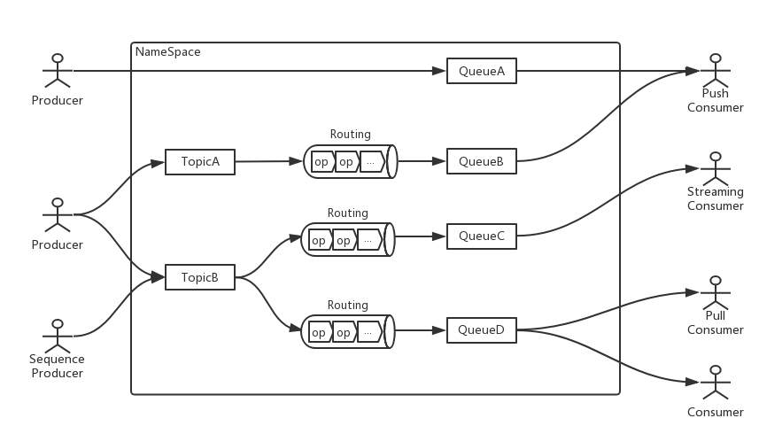
>
>上图展示了OpenMessaging的领域架构。可见不同于普通仅提供管道和存储功能的消息队列，OpenMessaging还具备转换数据的能力(Routing)，并且不像Kafka作为附加组件的Streams，OpenMessaging的Routing更多是原生架构的一部分，地位更高。下面逐一解释图中涉及的实体。
>
>### NameSpace
>
>NameSpace类似于Linux的cgroup，用于安全地对资源进行隔离。每个NameSpace下都有自己的一组producer, consumer, topic, queue等等。
>
>### Producer
>
>OpenMessaging提供两种Producer:
>
>- 普通Producer，为延迟优化，提供多种方法来将消息流式地发送到Topic或者Queue，但是specification并没有进一步描述具体有什么方法，只能拭目以待。
>- SequenceProducer，为吞吐量优化，可以将多条消息合并为一个batch再发送给下游。
>
>看起来两种producer并没有什么质的差别，或许最关键的点在于发送方法上的不同。
>
>### Consumer
>
>不同于有固定消息模式的消息队列，OpenMessaging 提供推、拉和流三种消息模式，分别对应三种consumer:
>
>- PullConsumer，从指定queue拉取消息，可以在任何时候通过消息确认机制提交消费结果。一个PullConsumer只能从一个指定的queue拉取消息。
>- PushConsumer，可以从多个queue接受消息，消息是以推的方式从服务端发送过来。PushConsumer可以通过不同的MessageListener来连接多个queue，然后在任何时间通过ReceiveMessageContext来条消费结果。
>- StreamingConsumer，一个面向流的consumer，可以很容易地和流式计算/大数据相关的平台集成。StreamingConsumer支持从指定queue像迭代器一样逐条消费消息。
>
>### Topic， Queue和Routing
>
>这三个实体有很强的联系，尽管 Topic 和 Queue 的作用不同，人们有可能会将它搞混。
>
>#### Topic
>
>Topic用于存储原始数据，服务端接收到的消息首先会被存放到这里。对于topic是否对消息的分布和顺序提供保证，OpenMessaging未作出要求。
>
>#### Routing
>
>在topic里面的消息是原始未经处理的，这并不能被consumer直接使用。换句话讲，topic是面向producer的，而不是面向consumer。Routing负责对topic里的消息进行处理，并路由到合适的queue。每个Routing拥有一个operator pipeline，后者由一系列的operator组成。消息经过这个pipeline从topic流向queue。 类似于流计算的一个转换函数，operator代表了对数据进行处理的操作。operator的种类有表达式operator(估计和lambda相似)，deduplicatot operator(用于去重)，joiner operator，filter operator, rpc operator等等。 最后，Routing可以跨网络传输，即通过建立多个routing实例将消息从一个网络发往另外一个网络。
>
>#### Queue
>
>消息被路由到queue之后，consumer就可以进行消费了。值得注意的是，Queue是分区的，分区键是消息header的`SHARDING_KEY`。Queue也可以从producer直接接收消息，即在数据流中跳过Topic和Routing，这样的话延迟更低，适合不需要对消息进行转换的场景。


## 线程专题     ####

Java线程的生命周期

>在线程的生命周期中，它要经过 **新建（New）、就绪（Runnable）、运行（Running）、阻塞（Blocked）和死亡（Dead）5种状态**。尤其是当线程启动以后，它不可能一直"霸占"着CPU独自运行，所以CPU需要在多条线程之间切换，于是 **线程状态也会多次在运行、阻塞之间切换**。
>
>作者：猿码道
>链接：https://juejin.im/post/5a72d4bd518825735300f37b
>来源：掘金
>著作权归作者所有。商业转载请联系作者获得授权，非商业转载请注明出处。

* [定时任务类ScheduledThreadPoolExecutor和心跳的使用](https://blog.csdn.net/genffe880915/article/details/101759261)

* [使用ThreadPoolExecutor进行多线程编程](https://www.cnblogs.com/fpqi/p/9719874.html)

>一旦程序启动将无限制执行下去，实际中可以通过限制定时任务的次数或者时间来终止程序的执行。
>
>1，限制程序执行的时间：scheduled.awaitTermination(100,TimeUnit.SECONDS); 这句话表明100毫秒后程序终止。
>
>2，限制程序执行的次数：如果是单线程，那么可以直接定义一个静态变量count，每执行一次，count加一，如果count大于某个值就调用shutdown或者shutdownNow函数；如果是多线程，稍微要复杂一点，但是原理也是一样的。定义一个静态变量count，没执行一个也是count加一，只不过在执行加一操作之前需要加锁，执行完之后需要解锁。

* [Java定时任务以及ScheduledThreadPoolExecutor需要注意的问题](https://blog.csdn.net/xfxf996/article/details/80876335)

>Java提供Timer和ScheduledThreadPoolExecutor两个类实现定时任务，其中Timer简单易用，但所有任务都是由同一个线程来调度，任务串行执行，任务之间存在互相干扰，一是前一个任务的延迟会导致后面的任务延迟，二是前一个任务异常导致后面的任务不再执行，三是Timer执行周期任务时依赖系统时间，如果当前系统时间发生变化，执行行为也会出现变化。
>
>  \1. 一定要使用try{}catch(Throwable t){}捕获所有可能的异常，因为ScheduledThreadPoolExecutor会在任务执行遇到异常时取消后续执行。
>
>  \2. 注意scheduleAtFixedRate与scheduleWithFixedDelay的区别，scheduleAtFixedRate是上一个任务开始执行之后延迟设定时间再执行，是从上一个任务开始时计时，但对于运行时长超过延迟时长的任务，会等上一个任务执行完之后，下一个任务才开始执行，此时，延时没有任何意义。而scheduleWithFixedDelay是在上一个任务结束执行之后延迟设定时间再执行，是从上一个任务结束时开始计算。

* [并发系列（7）之 ScheduledThreadPoolExecutor 详解](https://www.cnblogs.com/sanzao/p/10760641.html)


### FutureTask

futureTask 用法
https://www.cnblogs.com/yanliang12138/p/9798654.html

FutureTask 详解

https://blog.csdn.net/qq_39654841/article/details/90631795

>FutureTask介绍
>一个可取消的异步计算。FutureTask提供了对Future的基本实现，可以调用方法去开始和取消一个计算，可以查询计算是否完成并且获取计算结果。只有当计算完成时才能获取到计算结果，一旦计算完成，计算将不能被重启或者被取消，除非调用runAndReset方法。
>除了实现了Future接口以外，FutureTask还实现了Runnable接口，因此FutureTask交由Executor执行，也可以直接用线程调用执行(futureTask.run())。根据FutureTask的run方法执行的时机，FutureTask可以处于以下三种执行状态：
>1、未启动：在FutureTask.run()还没执行之前，FutureTask处于未启动状态。当创建一个FutureTask对象，并且run()方法未执行之前，FutureTask处于未启动状态。
>2、已启动：FutureTask对象的run方法启动并执行的过程中，FutureTask处于已启动状态。
>3、已完成：FutureTask正常执行结束，或者FutureTask执行被取消(FutureTask对象cancel方法)，或者FutureTask对象run方法执行抛出异常而导致中断而结束，FutureTask都处于已完成状态。
>FutureTask状态迁移图
>
>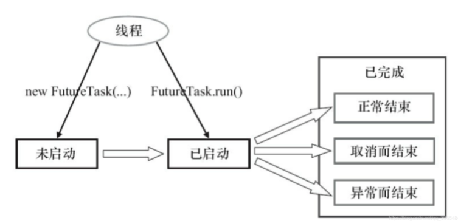
>
>当FutureTask处于未启动或者已启动的状态时，调用FutureTask对象的get方法会将导致调用线程阻塞。当FutureTask处于已完成的状态时，调用FutureTask的get方法会立即放回调用结果或者抛出异常。
>当FutureTask处于未启动状态时，调用FutureTask对象的cancel方法将导致线程永远不会被执行；当FutureTask处于已启动状态时，调用FutureTask对象cancel(true)方法将以中断执行此任务的线程的方式来试图停止此任务;当FutureTask处于已启动状态时，调用FutureTask对象cancel(false)方法将不会对正在进行的任务产生任何影响；当FutureTask处于已完成状态时，调用FutureTask对象cancel方法将返回false；
>FutureTask的get和cancel的执行示意图
>
>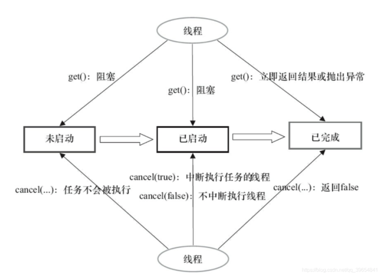

[关于java线程池的研究-Future与FutureTask](https://blog.csdn.net/chaofanwei/article/details/17300401)

___________


## 分布式事务

[关于分布式事务，XA协议的学习笔记](https://www.cnblogs.com/monkeyblog/p/10449363.html)


## 算法专题     ####

* **树型结构**
* [**MySQL索引背后的数据结构及算法原理**](http://blog.codinglabs.org/articles/theory-of-mysql-index.html)

>### 局部性原理与磁盘预读
>
>由于存储介质的特性，磁盘本身存取就比主存慢很多，再加上机械运动耗费，磁盘的存取速度往往是主存的几百分分之一，因此为了提高效率，**要尽量减少磁盘I/O**。为了达到这个目的，磁盘往往不是严格按需读取，而是每次都会预读，即使只需要一个字节，磁盘也会从这个位置开始，顺序向后读取一定长度的数据放入内存。这样做的理论依据是计算机科学中著名的局部性原理：
>
>**当一个数据被用到时，其附近的数据也通常会马上被使用。**
>
>**程序运行期间所需要的数据通常比较集中。**
>
>**由于磁盘顺序读取的效率很高（不需要寻道时间，只需很少的旋转时间），因此对于具有局部性的程序来说，预读可以提高I/O效率。**
>
>**预读的长度一般为页（page）的整倍数。页是计算机管理存储器的逻辑块，硬件及操作系统往往将主存和磁盘存储区分割为连续的大小相等的块，每个存储块称为一页（在许多操作系统中，页得大小通常为4k），主存和磁盘以页为单位交换数据。**当程序要读取的数据不在主存中时，会触发一个缺页异常，此时系统会向磁盘发出读盘信号，磁盘会找到数据的起始位置并向后连续读取一页或几页载入内存中，然后异常返回，程序继续运行。
>
>### B-/+Tree索引的性能分析
>
>到这里终于可以分析B-/+Tree索引的性能了。
>
>上文说过一般使用磁盘I/O次数评价索引结构的优劣。**先从B-Tree分析，根据B-Tree的定义，可知检索一次最多需要访问h个节点(h 表示树的高度)。数据库系统的设计者巧妙利用了磁盘预读原理，将一个节点的大小设为等于一个页，这样每个节点只需要一次I/O就可以完全载入。**为了达到这个目的，在实际实现B-Tree还需要使用如下技巧：
>
>**每次新建节点时，直接申请一个页的空间，这样就保证一个节点物理上也存储在一个页里，加之计算机存储分配都是按页对齐的，就实现了一个node只需一次I/O。**
>
>B-Tree中一次检索最多需要h-1次I/O（根节点常驻内存），渐进复杂度为(根据树的结构理解这个公式)
>
>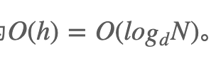
>
>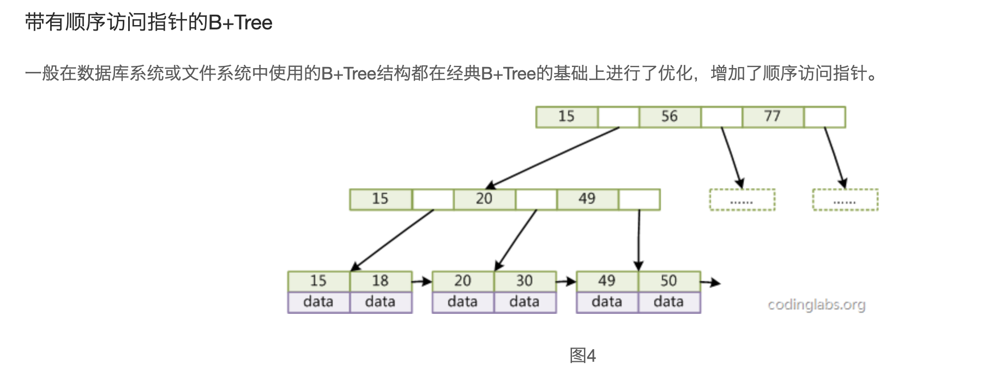
>
>O(h)=O(log d N)  。一般实际应用中，出度d是非常大的数字，通常超过100，因此h非常小（通常不超过3）。
>
>综上所述，用B-Tree作为索引结构效率是非常高的。
>
>而红黑树这种结构，h明显要深的多。由于逻辑上很近的节点（父子）物理上可能很远，无法利用局部性，所以红黑树的I/O渐进复杂度也为O(h)，效率明显比B-Tree差很多。
>
>上文还说过，B+Tree更适合外存索引，原因和内节点出度d有关。从上面分析可以看到，d越大索引的性能越好，而出度的上限取决于节点内key和data的大小：
>
>dmax=floor(pagesize/(keysize+datasize+pointsize))
>
>**floor表示向下取整。由于B+Tree内节点去掉了data域，因此可以拥有更大的出度，拥有更好的性能。**
>
>这一章从理论角度讨论了与索引相关的数据结构与算法问题，下一章将讨论B+Tree是如何具体实现为MySQL中索引，同时将结合MyISAM和InnDB存储引擎介绍非聚集索引和聚集索引两种不同的索引实现形式。
>
>

* [**从2-3树理解红黑树**](https://juejin.im/post/5c540e2ff265da2db155ee57)

1. B树

B-Tree，首先定义一条数据记录为一个二元组[key, data]，key为记录的键值，对于不同数据记录，key是互不相同的；data为数据记录除key外的数据。那么B-Tree是满足下列条件的数据结构：

d为大于1的一个正整数，称为B-Tree的度。

h为一个正整数，称为B-Tree的高度。

每个非叶子节点由n-1个key和n个指针组成，其中d<=n<=2d。

每个叶子节点最少包含一个key和两个指针，最多包含2d-1个key和2d个指针，叶节点的指针均为null 。

所有叶节点具有相同的深度，等于树高h。

key和指针互相间隔，节点两端是指针。

一个节点中的key从左到右非递减排列。

所有节点组成树结构。

每个指针要么为null，要么指向另外一个节点。

如果某个指针在节点node最左边且不为null，则其指向节点的所有key小于v(key1)v(key1)，其中v(key1)v(key1)为node的第一个key的值。

如果某个指针在节点node最右边且不为null，则其指向节点的所有key大于v(keym)v(keym)，其中v(keym)v(keym)为node的最后一个key的值。

如果某个指针在节点node的左右相邻key分别是keyikeyi和keyi+1keyi+1且不为null，则其指向节点的所有key小于v(keyi+1)v(keyi+1)且大于v(keyi)v(keyi)。

图2是一个d=2的B-Tree示意图。


2. **B+树**

B-Tree有许多变种，其中最常见的是B+Tree，例如MySQL就普遍使用B+Tree实现其索引结构。

与B-Tree相比，B+Tree有以下不同点：

每个节点的指针上限为2d而不是2d+1。

内节点不存储data，只存储key；叶子节点不存储指针。


一般来说，B+Tree比B-Tree更适合实现外存储索引结构，具体原因与外存储器原理及计算机存取原理有关.

**一般在数据库系统或文件系统中使用的B+Tree结构都在经典B+Tree的基础上进行了优化，增加了顺序访问指针。**


3. **二三树、红黑树** 

   https://juejin.im/post/5c540e2ff265da2db155ee57

2-3树的意思就是说，**一个父节点可以有两个子节点，也可以有三个子节点**，并且其也满足类似`二叉搜索树`的定义（父节点的值大于左子树，但小于右子树），所有叶子节点都在同一层。

红黑树也是一种**二叉平衡树**，它满足如下几个特性（根据算法中的定义）：

1. 根节点是黑色的。
2. 红链接均为左链接。
3. 从任一节点到其可达叶子节点，经过的黑色节点数量一样（黑平衡）。
4. 没有任何一个节点同时与两个红链接相连。

这个定义可能跟我们平常看到的不太一样，由于是以2-3树来理解红黑树，定义红链在左边，这样才能跟2-3树完全对应上。

`AVL`是一种极度平衡的二叉树，那为什么不用AVL呢？因为`AVL`插入删除要保持平衡，相比红黑树要慢一些，需要左旋右旋等等。但实际上它的旋转也只是几个场景的套用，哪些场景需要怎么旋转，理解就行了。

而**红黑树是近似平衡的（黑平衡），也就是说它不像`AVL`那样绝对的平衡，所以添加/删除节点后的平衡操作没那么多。所以对于插入和删除操作较多的场景，用红黑树效率会高一些**。

**将2-3树转换成红黑树**

主要思想：3节点分裂成2节点。

>将3节点的第一个元素，作为第二个元素的左节点，并用红色的线连接，此时红色线连接的节点就相当于红色。

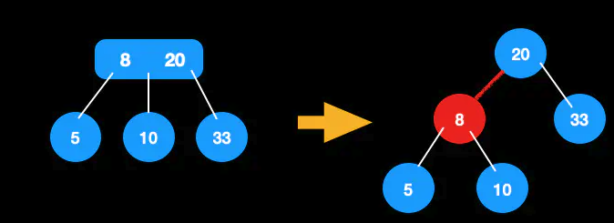

将2-3树按照以上思想转换后，就得到了一颗红黑树。用这种方式理解是不是简单多了呢？

同时也有几个问题值得我们思考：

1. 为什么红链规定在左边呢？

   我觉得是前人的一个约定，为了保持统一，简化处理，都放在左边。那都放右边是不是也可以呢？

2. 没有任何一个节点同时与两个红链接相连

   因为一个红链表示一个3节点，如果有2个红链相连，则表示为4节点，不符合2-3树定义。

3. 根节点为黑色

   只有3节点的左链才为红色。根节点没有父节点，不可能为红色。

4. 根节点到叶子节点经过的黑色节点数目相同

   因为2-3树是完美平衡的。红黑树中经过的黑节点数=其层数。

   作者：summer_liu_liu
   链接：https://juejin.im/post/5c540e2ff265da2db155ee57
   来源：掘金
   著作权归作者所有。商业转载请联系作者获得授权，非商业转载请注明出处。

### 红黑树的应用

1. 散列表的冲突处理

   map的实现，底层一般会采用红黑树，在节点多的时候效率高。 在节点少的时候，可用链表方式。

2. 动态插入、删除和查询较多的场景

### [PriorityQueue详解](https://www.jianshu.com/p/f1fd9b82cb72)


## python专题     ###

### python数据类型
​    Numbers（数字）
​    String（字符串）
​    List（列表）
​    Tuple（元组）
​    Dictionary（字典）

### [Python内置的HTTP协议服务器SimpleHTTPServer使用指南](https://blog.51cto.com/tenderrain/1980603)

>Python内置了一个简单的HTTP服务器，只需要在命令行下面敲一行命令，一个HTTP服务器就起来了：
>
>```python
>python -m SimpleHTTPServer 80
>```
>
>如果当前文件夹有index.html文件，会默认显示该文件，否则，会以文件列表的形式显示目录下所有文件。这样已经实现了最基本的文件分享的目的，你可以做成一个脚本，再建立一个快捷方式，就可以很方便的启动文件分享了。

## Docker 专题   ###

[Dockerfile 中的Volume有什么意义，光用docker run -v效果相同吗？](https://segmentfault.com/q/1010000004107293)

>你可以把VOLUME理解为，从镜像中复制指定卷的文件夹到本地`/var/lib/docker/volumes/xxxxxxxxx/文件夹`，然后把本地的该文件夹挂载到容器里面去。
>
>本质上还是相当于一个本地文件夹挂载而已。
>
>继续补充，因为VOLUME实际上就是在本地新建了一个文件夹挂载了，那么实际上容器内部的文件夹有三种情况：
>1、没有指定VOLUME也没有指定-v，这种是普通文件夹。
>2、指定了VOLUME没有指定-v，这种文件夹可以在不同容器之间共享，但是无法在本地修改。
>3、指定了-v的文件夹，这种文件夹可以在不同容器之间共享，且可以在本地修改。
>
>首先，我们先了解容器中获取动态数据的方式：
>1、本地提供，挂载到容器
>2、远程提供，从远程下载
>3、生成提供，在容器内部生成
>
>后面两种命令都不需要在本地修改，但是他们生成的动态数据却可能需要共享。
>下载命令，比如git clone直接从git服务器拉取代码，不需要挂载本地文件夹。

* [关于Docker目录挂载的总结](https://www.cnblogs.com/ivictor/p/4834864.html)

docker 挂载多个主机文件夹作为数据卷,挂载几个主机目录就用几个-v选项。

   `docker run -it -P --name v_test -v /home/amor/Documents/:/opt/web_doc -v /home/amor/Downloads/:/opt/web_down centos /bin/bash`

* [如何运行多进程Docker容器？](http://dockone.io/article/951)

>一种方法是使用**Shell脚本**，另一种方法是使用进程管理工具[Supervisor](http://supervisord.org/)。

* [ubuntu中supervisor的安装及配置](https://www.jianshu.com/p/68605ac9d06a)

* [docker开机启动nginx，mysql等服务的方式](https://blog.csdn.net/u013945470/article/details/85268286)

>注意！注意！注意！
>
>所有supervisor管理的进程都不能开启后台模式，例如"service nginx start"这种，只能使用前台模式进行配置，否则服务会一直重启！

* [Docker容器时间与宿主机时间不同步](https://blog.csdn.net/lin521lh/article/details/78349739)

>统一两者的时区有下面几种方法
>1、共享主机的localtime
>
>#创建容器的时候指定启动参数，挂载localtime文件到容器内，保证两者所采用的时区是一致的。
>docker run -it -d --name web -v /etc/localtime:/etc/localtime:ro  centos:1.0  /bin/bash
>2、复制主机的localtime
>
>docker cp /etc/localtime 753f856bca45:/etc/
>3、创建dockerfile文件的时，自定义该镜像的时间格式及时区。在dockerfile文件里添加下面内容：
>#设置时区
>RUN /bin/cp /usr/share/zoneinfo/Asia/Shanghai /etc/localtime && echo 'Asia/Shanghai' >/etc/timezone
>————————————————
>版权声明：本文为CSDN博主「VacantYang」的原创文章，遵循CC 4.0 BY-SA版权协议，转载请附上原文出处链接及本声明。
>原文链接：https://blog.csdn.net/lin521lh/article/details/78349739

[docker mac 命令行登录报错处理 : Error saving credentials: error storing credentials - err: exit status 1](https://blog.csdn.net/xufwind/article/details/88756557?utm_medium=distribute.pc_relevant.none-task-blog-BlogCommendFromMachineLearnPai2-3.channel_param&depth_1-utm_source=distribute.pc_relevant.none-task-blog-BlogCommendFromMachineLearnPai2-3.channel_param)

>在网上找了很久，总算找个一个能用的:以下为具体操作
>
>\1. 点开启动台，搜索 Keychain Access并点开, 或是点开 访达(findder) -> 应用程序(applications) -> 实用工具(utilities) ->钥匙串访问(Keychain Access)
>
>\2. 右键点击登录 -> 锁定钥匙串登录，再解锁钥匙串登录就可以了，注意解锁的时候需要输入mac登录密码
>
>
>
>知识背景参考：
>
>https://docs.docker.com/engine/reference/commandline/login/#credentials-store

### ENTRYPOINT 指令

类似于 CMD 指令，但其不会被 docker run 的命令行参数指定的指令所覆盖，**而且这些命令行参数会被当作参数送给 ENTRYPOINT 指令指定的程序。所以 Dockerfile 中使用了ENTRYPOINT指令后使用命令行 docker run 加参数时要慎重，会直接加到 ENTRYPOINT 指令指定的程序后面。**

但是, 如果运行 docker run 时使用了 --entrypoint 选项，此选项的参数可当作要运行的程序覆盖 ENTRYPOINT 指令指定的程序。

[docker 安装](https://yeasy.gitbook.io/docker_practice/install/mac)

##  ###

# Netty 专题

## [Netty的高低水位](https://zhuanlan.zhihu.com/p/272840446)

>假如我们的底层使用Netty作为网络通信框架,业务流程在将业务数据发送到对端之前,实际先要将发送到Netty的缓冲区中,然后再从Netty的缓冲区发送到TCP的缓冲区,最后再到对端.
>
>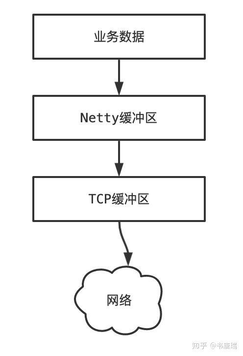
>
>业务数据不可能无限制向Netty缓冲区写入数据,TCP缓冲区也不可能无限制写入数据.Netty通过高低水位控制向Netty缓冲区写入数据的多少.
>
>它的大体流程就是向Netty缓冲区写入数据的时候,会判断写入的数据总量是否超过了设置的高水位值,如果超过了就设置通道(Channel)不可写状态.
>
>当Netty缓冲区中的数据写入到TCP缓冲区之后,Netty缓冲区的数据量变少,当低于低水位值的时候,就设置通过(Channel)可写状态.

# 并发

## Cpu高速缓存 & 缓存行填充

https://blog.csdn.net/noob_can/article/details/124960690

>为什么要缓存
>在系统工程中，无论是在数据库、系统内存等对于数据的访问，通常存在部分数据在时间上、空间上大概率的再次访问现象 ，所谓的二八原则
>
>  1. **时间局部性现象。** 如果一个主存数据正在被访问，那么在近期它被再次访问的概率非常大。 80%的时间在运行20% 的代码
>  2. **空间局部性现象。**CPU使用到某块内存区域数据，这块内存区域后面临近的数据很大概率立即会被使用到。 例如数组、集合经常会顺序访问（内存地址连续或邻近）。
>  因此， 缓存能大大提高热数据的访问效率。
>
>### **Linux内核的文件预读readahead**
>
>由于磁盘的访问更慢，所以一般从磁盘中拿数据不是按需，而是***\*按页预读\****，一次会读一页的数据，每次加载更多的数据，如果未来要读取的数据就在此页中，可以避免未来的磁盘IO，提高效率 。
>
>*操作系统一页数据是4K，MySQL的一页是16K*
>
>## 高速缓存
>最快是 CPU 的寄存器 ：指令寄存器（IR）、程序计数器（PC）、地址寄存器（AR）、数据寄存器（DR）等。 
>
>其次是 CPU 的高速缓存。由近到远分为L1缓存  -> L2缓存  ->L3缓存，离得越远，速度越慢，容量越大。
>
>每核心都有一个私有的 L1 缓存，但对同核内的多线程是共享的。
>大多数多核 CPU 的各核都各自拥有一个 L2 缓存，但也有多核共享 L2 缓存的设计；
>L3 在现代多核机器中更普遍，更大，更慢，并且被单个插槽上的所有 CPU 核共享 。
>
>
>
>
>
>## 缓存一致性
>
>当 Cpu执行运算的时候，它先去 L1 查找所需的数据，再去 L2，然后是 L3，最后再去主内存拿。走得越远，运算耗费的时间就越长。所以如果需更快的处理，要确保数据在 L1 缓存中。 
>
>
>
>**总线负责了Cpu与外设的通讯。在多核Cpu架构上，它们共用一条总线的来和主内存进行数据交互。**
>
>当多个线程访问的变量为共享变量（主存中）时，因每个线程栈都存在私有的 Cpu 缓存变量副本，就不可避免会遇到缓存一致性问题 。
>
> 于是就出现了缓存一致性协议，最出名的就是 Intel 的 MESI 协议。MESI 协议保证了每个缓存中使用的共享变量的副本是一致的。它核心的思想是： **modified（修改）、exclusive（互斥）、share（共享）、invalid（无效）**。
>
>简单的说：**写能同步更新到主存中，其他线程再读时，缓存副本失效需要从主存中拿更新后的数据。**
>
>```tex
>1. CPU1 使用共享数据时会先数据拷贝到 CPU1 缓存中，然后置为独占状态 (E)
>2. 这时 CPU2 也使用了共享数据，也会拷贝也到 CPU2 缓存中。通过总线嗅探机制，当该 CPU1 监听总线中 CPU2 对内存中共享变量也拷贝了，此时共享变量在 CPU1 和 CPU2 两个缓存中的状态会被标记为共享状态 (S)；
>3. 若 CPU1 将变量通过缓存回写到主存中，需要先锁住缓存行，此时状态切换为修改（M），向总线发消息告诉其他在嗅探的 CPU 该变量已经被 CPU1 改变并回写到主存中。接收到消息的其他 CPU 会将共享变量状态从（S）改成无效状态（I），缓存行失效。
>4. 此时若其他 CPU 需要再次操作共享变量则需要重新从内存读取。
>```
>
>解决缓存不一致性问题的方式：
>
>```tex
>1. 通过缓存一致性协议  -> 优先 锁缓存行 　
>2. 通过在总线加LOCK#锁的方式  -> 影响整个通讯，优先级最低　
>3. 其他： 关中断、锁北桥
>```
>
>**失效**的情况：
>
>```tex
>1. 共享变量大于缓存行大小，MESI 无法进行缓存行加锁；
>2. Cpu 并不支持缓存一致性协议
>```
>
>

## CPU的缓存行(Cache Line)是什么

https://blog.csdn.net/m0_50163856/article/details/124121430

>存储器的层次结构: 
>
>
>
>其中，**L1、L2在CPU内部，L3在主板上，越往上CPU到达的时间越短，CPU内部的数据是独立的，CPU外部的数据是所有CPU共享的。**
>
>* **CPU的数据不一致问题**
>
>  产生原因： 假如主存里有x、y两个数据，它们会先被加载到L3缓存里，再加载到L1、L2缓存，但是L1、L2是在CPU内部的，那就有可能CPU1把x加载到缓存修改成1，CPU2把x加载到缓存修改成2，产生CPU之间的数据不一致问题，也就是CPU1修改数据CPU2不知道。
>
>* **解决方案**
>  方案一：总线锁。由于L2是通过使用总线与L3通讯的，所有当CPU1访问L3是可以对总线加锁，不允许其他CPU访问。
>  缺点：效率偏低
>  方案二：缓存锁。各种各样的一致性协议，例如英特尔CPU使用了MESI一致性协议，标记成不同的状态，不同的状态进行不同的处理
>  缺点：对于不能进入缓存的数据无法加锁
>  现在的CUP是总线锁+缓存锁一起完成的数据一致性
>
>* **缓存行是什么**
>  **当 CPU 从内存里读取一个4个字节数据时，不会只把这4个字节读进来，而是会把这4个字节之后的很多的数据一起读进来，这就是缓存行，现在缓存行的大小多数是64个字节。**
>
>* **伪共享问题**
>  假设有内存相邻的数据想x、y，CPU1要修改x，CPU2要修改y，CPU1读取x时会把x、y都读进来，CPU1改完要通知其他CPU，CPU1会把整个缓存行数据都通知一遍，这时CPU2虽然不用x但y被通知了，需要重新在读取y所在的缓存行，CPU2改完y后也会把整个缓存行数据都通知一遍，这时CPU1虽然不用y但y被通知了也需要重新读取缓存行，这就产生了位于同一缓存行的两个不同数据，被两个不同CPU锁定，产生互相影响问题 ，也就是伪共享问题.


## java 并发包中的容器

#### CopyOnWriteArrayList 

[CopyOnWriteArrayList应用场景](https://www.cnblogs.com/zz-ksw/p/12774371.html)

>### 适用场景
>
>#### 读操作可以尽可能的快，而写即使慢一些也没关系
>
>在很多应用场景中，读操作可能会远远多于写操作。比如，有些系统级别的信息，往往只需要加载或者修改很少的次数，但是会被系统内所有模块频繁的访问。对于这种场景，我们最希望看到的就是读操作可以尽可能的快，而写即使慢一些也没关系。
>
>#### 读多写少
>
>黑名单是最典型的场景，假如我们有一个搜索网站，用户在这个网站的搜索框中，输入关键字搜索内容，但是某些关键字不允许被搜索。这些不能被搜索的关键字会被放在一个黑名单中，黑名单并不需要实时更新，可能每天晚上更新一次就可以了。当用户搜索时，会检查当前关键字在不在黑名单中，如果在，则提示不能搜索。这种读多写少的场景也很适合使用 CopyOnWrite 集合。
>
>### 读写规则
>
>#### 读写锁的规则
>
>读写锁的思想是：读读共享、其他都互斥（写写互斥、读写互斥、写读互斥），原因是由于读操作不会修改原有的数据，因此并发读并不会有安全问题；而写操作是危险的，所以当写操作发生时，不允许有读操作加入，也不允许第二个写线程加入。
>
>### 对读写锁规则的升级
>
>CopyOnWriteArrayList 的思想比读写锁的思想又更进一步。为了将读取的性能发挥到极致，CopyOnWriteArrayList **读取是完全不用加锁的**，更厉害的是，**写入也不会阻塞读取操作**，也就是说你可以在写入的同时进行读取，只有写入和写入之间需要进行同步，也就是不允许多个写入同时发生，但是在写入发生时允许读取同时发生。这样一来，读操作的性能就会大幅度提升。
>
>```java
> /**
>     * Appends the specified element to the end of this list.
>     *
>     * @param e element to be appended to this list
>     * @return {@code true} (as specified by {@link Collection#add})
>     */
>    public boolean add(E e) {
>        final ReentrantLock lock = this.lock;
>        lock.lock();
>        try {
>            Object[] elements = getArray();
>            int len = elements.length;
>            Object[] newElements = Arrays.copyOf(elements, len + 1);
>            newElements[len] = e;
>            setArray(newElements);
>            return true;
>        } finally {
>            lock.unlock();
>        }
>    }
>```
>
>#### 特点
>
>**CopyOnWrite的含义**
>
>从 CopyOnWriteArrayList 的名字就能看出它是满足 CopyOnWrite 的 ArrayList，CopyOnWrite 的意思是说，当容器需要被修改的时候，不直接修改当前容器，而是先将当前容器进行 Copy，复制出一个新的容器，然后修改新的容器，完成修改之后，再将原容器的引用指向新的容器。这样就完成了整个修改过程。

#### ConcurrentLinkedQueue

无锁的设计

##### Java并发编程之ConcurrentLinkedQueue详解 (java 并发编程的艺术  方腾飞 书中内容)

https://blog.csdn.net/qq_38293564/article/details/80798310


## java 实战


### [接口响应时间长的调优经验](https://www.jianshu.com/p/f386fdc50620)

># 解决方案
>
>## Version 1
>
>引入redis 缓存。
>
>为了提高接口的性能，并通过一步步的引入缓存、队列等中间件减少数据库的读请求和分离数据库的写请求，且对线程池的调优。
>
>## Version 2
>
>此版本接入了队列，**通过队列将数据库插入和修改操作在队列消费端操作**，**在接口中隔离了对数据库的操作**。
>
>引入队列后，博主以为接口应该不会超时了，虽然`数据库的数据量`比较大，CRUD比较慢，可接口中已经将写操作清零，读操作减少一大半。查询`nginx日志`发现超时尽管有所减少，但超时每秒还是有几百，总体每日平均超时为`5%`左右。
>
>## Version 3
>
>看下Java线程是否可以调优，目前系统使用的是Netty4作为容器，监听端口来响应；作了以下事情：
>
>1. 查看GC日志，配合[jstat命令](https://links.jianshu.com/go?to=http%3A%2F%2Fwww.tongtech.com%2Fupload_files%2Ffiles%2Fdoc%2F56.pdf)查询GC频率，是否出现频繁GC，或者Full GC次数过多等情况
>2. 查看线程日志，配合[jstack命令](https://links.jianshu.com/go?to=http%3A%2F%2Fwww.cnblogs.com%2Fchenpi%2Fp%2F5377445.html)分析是否出现线程死锁，Object.wait()情况
>3. 通过jdk自带的jmc工具观察堆内存使用情况；也可观察线程占用CPU百分比
>
>通过上面的三步操作，得到结果：
>
>- GC频率不高，Full GC几乎没有
>- 内存使用正常，尚未超过临界值
>- 通过jstack发现大量的线程处于WAITING状态，可是在jstack中尚未发现是哪个方法是引起WAITING的元凶
>
>于是去网上找资料，如何能定位某个方法的执行时间，找到了jdk自带的[jvisualvm工具](https://links.jianshu.com/go?to=https%3A%2F%2Fwww.ibm.com%2Fdeveloperworks%2Fcn%2Fjava%2Fj-lo-visualvm%2F)[Notes：jdk1.7u45后才自带有该工具，否则需要自行安装]
>
>打开jvisualvm->远程->添加JMX连接->抽样器->CPU->在CPU样例中点击快照
>
>**Notes:快照需要等一两分钟跑了数据后再进行生成，一般生成两三次快照进行观察对比。**

### [面对数据量大的情况如何进行优化？](https://www.zhihu.com/question/267560156)

### [阿里编码规范插件idea](https://github.com/alibaba/p3c/blob/master/idea-plugin/README_cn.md)

### [IntelliJ 创建main函数快捷](https://blog.csdn.net/tiantiandjava/article/details/42269173)

>提示可以CTRL + j 可以查看，mac系统下是  command＋j。

## LVS专题

[LVS介绍及工作原理图解](http://www.178linux.com/89580)

>二、LVS体系架构
>
>使用LVS架设的服务器集群系统有三个部分组成：最前端的负载均衡层（Loader Balancer），中间的服务器群组层，用Server Array表示，最底层的数据共享存储层，用Shared Storage表示。在用户看来所有的应用都是透明的，用户只是在使用一个虚拟服务器提供的高性能服务。
>
>LVS的各个层次的详细介绍：
>
>Load Balancer层：位于整个集群系统的最前端，有一台或者多台负载调度器（Director Server）组成，LVS模块就安装在Director Server上，而Director的主要作用类似于一个路由器，它含有完成LVS功能所设定的路由表，通过这些路由表把用户的请求分发给Server Array层的应用服务器（Real Server）上。同时，在Director Server上还要安装对Real Server服务的监控模块Ldirectord，此模块用于监测各个Real Server服务的健康状况。在Real Server不可用时把它从LVS路由表中剔除，恢复时重新加入。
>
>Server Array层：由一组实际运行应用服务的机器组成，Real Server可以是WEB服务器、MAIL服务器、FTP服务器、DNS服务器、视频服务器中的一个或者多个，每个Real Server之间通过高速的LAN或分布在各地的WAN相连接。在实际的应用中，Director Server也可以同时兼任Real Server的角色。
>
>Shared Storage层：是为所有Real Server提供共享存储空间和内容一致性的存储区域，在物理上，一般有磁盘阵列设备组成，为了提供内容的一致性，一般可以通过NFS网络文件系统共享数 据，但是NFS在繁忙的业务系统中，性能并不是很好，此时可以采用集群文件系统，例如Red hat的GFS文件系统，oracle提供的OCFS2文件系统等。
>
>从整个LVS结构可以看出，Director Server是整个LVS的核心，目前，用于Director Server的操作系统只能是Linux和FreeBSD，linux2.6内核不用任何设置就可以支持LVS功能，而FreeBSD作为 Director Server的应用还不是很多，性能也不是很好。对于Real Server，几乎可以是所有的系统平台，Linux、windows、Solaris、AIX、BSD系列都能很好的支持。

## 规范

### [RESTful API 设计指南](http://www.ruanyifeng.com/blog/2014/05/restful_api.html)


# typesafe config

## [配置文件神器 typesafe conf 用法简介](https://blog.csdn.net/weixin_34319374/article/details/91913624)


## [HOCON (Human-Optimized Config Object Notation) 说明文档](https://github.com/lightbend/config/blob/master/HOCON.md#config-object-merging-and-file-merging)

>### Duplicate keys and object merging
>
>The JSON spec does not clarify how duplicate keys in the same object should be handled. In HOCON, duplicate keys that appear later override those that appear earlier, unless both values are objects. If both values are objects, then the objects are merged.
>
>Note: this would make HOCON a non-superset of JSON if you assume that JSON requires duplicate keys to have a behavior. The assumption here is that duplicate keys are invalid JSON.
>
>To merge objects:
>
>- add fields present in only one of the two objects to the merged object.
>- for non-object-valued fields present in both objects, the field found in the second object must be used.
>- for object-valued fields present in both objects, the object values should be recursively merged according to these same rules.


# 实战-逻辑删除时的唯一约束

逻辑删除 唯一约束， 会导致虽然某条数据已经被删除，但是加了唯一约束的字段还是不能插入相同的数据？

### [逻辑删除和唯一索引](https://chsm1998.github.io/2020/08/29/logical-deletion-and-unique-index/)

**建立联合索引，is_deteled字段不要用单纯的0和1来表示，可以用0来表示正常数据，逻辑删除数据可以有以下几种方案来表示（推荐）**

1. 将删除标识的正常设为固定值,删除值使用叠加值(-1,-2,-3)**（该方案需保证字段值为全局递增或全局递减，分布式环境下实现复杂）**

2. **将删除标识的删除状态设为id（推荐，使用主键确保不会发生索引冲突，并且实现简单）**

   若使用的是mybatis-plus框架可将logic-delete-value设置为如下：（看 mybatis-plus 官网，更深入掌握？？）

   ```
   logic-delete-value: id
   ```

3. 将删除标识设为当前时间戳**（时间戳在极端情况下依旧有索引冲突的风险）**

   若使用的是mybatis-plus框架可将logic-delete-value设置为如下：

   ```
   logic-delete-value: REPLACE(unix_timestamp(current_timestamp(3)),'.','')
   ```

# [TCP协议中的三次握手和四次挥手(图解)](https://blog.csdn.net/whuslei/article/details/6667471)

>
>
>

# [logger.isDebugEnabled()的作用](https://blog.csdn.net/broucetrong/article/details/53505966)

>在项目中经常会看到这样的代码：
>
>```java
>if (logger.isDebugEnabled()) {
>    logger.debug(message);
>}
>```
>
>##### **为什么要这样做呢？**
>
>　　且看isDebugEnabled()的源码：
>
>```java
>public boolean isDebugEnabled() {    
>  if(repository.isDisabled( Level.DEBUG_INT))
>      return false;
>  return Level.DEBUG.isGreaterOrEqual(this.getEffectiveLevel());
>}
>```
>
>以下是debug()的源码：
>
>```java
>public void debug(Object message) {
>    if(repository.isDisabled(Level.DEBUG_INT))
>        return;
>    if(Level.DEBUG.isGreaterOrEqual(this.getEffectiveLevel())) {
>        forcedLog(FQCN, Level.DEBUG, message, null);
>    }
>}
>```
>
>可见，debug()中做了跟isDebugEnabled()几乎一样的判断，看起来直接调用debug()比先判断isDebugEnabled()更加效率。
>　　此时来看下面的代码：
>`logger.debug("The money is " + getTotalMoney());`
>
>　　假设我们的日志级别设置为info，debug()方法调用后会判断`if(repository.isDisabled(Level.DEBUG_INT))`，然后return。但是在调用debug()方法时，必须提供参数。要获得参数，就需要执行getTotalMoney()并拼接。假设这个获取参数的过程需要10秒钟，则系统会在花费10秒后决定return，这显然很得不偿失。
>　　加上logger.isDebugEnabled()判断，只会使写日志的时间增加大概万分之一，但是如果不加此判断，系统可能需要花费更多的时间，所以在大多数情况下，在输出debug日志前加上logger.isDebugEnabled()比较好。

# [Post 方法参数写在body中和写在url中有什么区别？](https://www.zhihu.com/question/64312188)

> 解释之前我们先基于Http协议,根据Http的请求方法对应的数据传输能力把Http请求分为Url类请求和Body类请求，Url类请求包括但不限于GET、HEAD、OPTIONS、TRACE 等请求方法。Body类请求包括但不限于POST、PUSH、PATCH、DELETE 等请求方法。
>
> 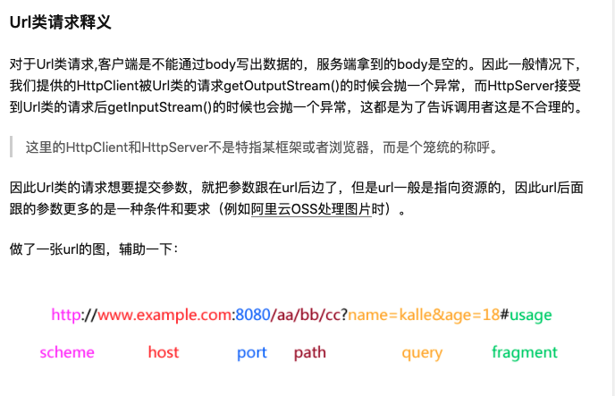
>
> **Body类请求除了可以把参数放到url中，也可以通过body发送数据。**
>
> 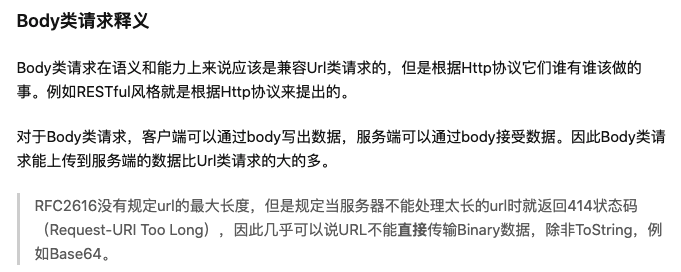


# [Curator Framework的基本使用方法](https://www.cnblogs.com/jun-ma/p/4918137.html)

# 跨站请求伪造

>**跨站请求伪造**（英语：Cross-site request forgery），也被称为 **one-click attack** 或者 **session riding**，通常缩写为 **CSRF** 或者 **XSRF**， 是一种挟制用户在当前已登录的Web[应用程序](https://baike.baidu.com/item/应用程序/5985445)上执行非本意的操作的攻击方法。跟[跨网站脚本](https://baike.baidu.com/item/跨网站脚本/23316003)（XSS）相比，**XSS** 利用的是用户对指定网站的信任，CSRF 利用的是[网站](https://baike.baidu.com/item/网站/155722)对用户[网页浏览器](https://baike.baidu.com/item/网页浏览器/8309940)的信任.
>
>假如一家银行用以运行转账操作的URL地址如下：http://www.examplebank.com/withdraw?account=AccoutName&amount=1000&for=PayeeName
>
>那么，一个恶意攻击者可以在另一个网站上放置如下代码： 
>
>如果有账户名为Alice的用户访问了恶意站点，而她之前刚访问过银行不久，登录信息尚未过期，那么她就会损失1000资金。
>
>这种恶意的网址可以有很多种形式，藏身于网页中的许多地方。此外，攻击者也不需要控制放置恶意网址的网站。例如他可以将这种地址藏在论坛，博客等任何[用户生成内容](https://baike.baidu.com/item/用户生成内容)的网站中。这意味着**如果服务端没有合适的防御措施的话，用户即使访问熟悉的可信网站也有受攻击的危险**。
>
>透过例子能够看出，攻击者并不能通过CSRF攻击来直接获取用户的账户控制权，也不能直接窃取用户的任何信息。他们能做到的，是**欺骗用户浏览器，让其以用户的名义运行操作**。 [1] 
>
>## 防御措施
>
>**检查Referer字段**
>
>HTTP头中有一个Referer字段，这个字段用以标明请求来源于哪个地址。在处理敏感数据请求时，通常来说，Referer字段应和请求的地址位于同一域名下。以上文银行操作为例，Referer字段地址通常应该是转账按钮所在的网页地址，应该也位于www.examplebank.com之下。而如果是CSRF攻击传来的请求，Referer字段会是包含恶意网址的地址，不会位于www.examplebank.com之下，这时候服务器就能识别出恶意的访问。
>
>这种办法简单易行，工作量低，仅需要在关键访问处增加一步校验。但这种办法也有其局限性，因其完全依赖浏览器发送正确的Referer字段。虽然http协议对此字段的内容有明确的规定，但并无法保证来访的浏览器的具体实现，亦无法保证浏览器没有安全漏洞影响到此字段。并且也存在攻击者攻击某些浏览器，篡改其Referer字段的可能。
>
>**添加校验token**
>
>由于CSRF的本质在于攻击者欺骗用户去访问自己设置的地址，所以如果要求在访问敏感数据请求时，要求用户浏览器提供不保存在cookie中，并且攻击者无法伪造的数据作为校验，那么攻击者就无法再运行CSRF攻击。这种数据通常是窗体中的一个数据项。服务器将其生成并附加在窗体中，其内容是一个伪随机数。当客户端通过窗体提交请求时，这个伪随机数也一并提交上去以供校验。正常的访问时，客户端浏览器能够正确得到并传回这个伪随机数，而通过CSRF传来的欺骗性攻击中，攻击者无从事先得知这个伪随机数的值，服务端就会因为校验token的值为空或者错误，拒绝这个可疑请求。

# [cookie](https://baike.baidu.com/item/cookie/1119?fr=aladdin)

>Cookie 是一段不超过4KB的小型[文本](https://baike.baidu.com/item/文本/5443630)数据，由一个名称（Name）、一个值（Value）和其它几个用于控制Cookie有效期、安全性、使用范围的可选属性组成。其中 [3] ：
>
>(1)Name/Value：设置Cookie的名称及相对应的值，对于认证Cookie，Value值包括Web服务器所提供的访问令牌 [3] 。
>
>(2)Expires属性：设置Cookie的生存期。有两种存储类型的Cookie：会话性与持久性。Expires属性缺省时，为会话性Cookie，仅保存在[客户端](https://baike.baidu.com/item/客户端/101081)内存中，并在用户关闭浏览器时失效；持久性Cookie会保存在用户的硬盘中，直至生存期到或用户直接在网页中单击“注销”等按钮结束会话时才会失效 [3] 。
>
>(3)Path属性：定义了Web站点上可以访问该Cookie的目录 [3] 。
>
>(4)Domain属性：指定了可以访问该 Cookie 的 Web 站点或域。Cookie 机制并未遵循严格的同源策略，允许一个[子域](https://baike.baidu.com/item/子域/5873902)可以设置或获取其父域的 Cookie。当需要实现单点登录方案时，Cookie 的上述特性非常有用，然而也增加了 Cookie受攻击的危险，比如攻击者可以借此发动会话定置攻击。因而，浏览器禁止在 [Domain](https://baike.baidu.com/item/Domain/68165) 属性中设置.org、.com 等通用顶级域名、以及在国家及地区顶级域下注册的二级域名，以减小攻击发生的范围 [3] 。
>
>(5)Secure属性：指定是否使用[HTTPS](https://baike.baidu.com/item/HTTPS/285356)安全协议发送 Cookie。使用HTTPS安全协议，可以保护Cookie在浏览器和Web服务器间的传输过程中不被窃取和篡改。该方法也可用于Web站点的身份鉴别，即在HTTPS的连接建立阶段，浏览器会检查Web网站的[SSL](https://baike.baidu.com/item/SSL/320778)证书的有效性。但是基于兼容性的原因（比如有些网站使用自签署的证书）在检测到[SSL证书](https://baike.baidu.com/item/SSL证书/5201468)无效时，浏览器并不会立即终止用户的连接请求，而是显示安全风险信息，用户仍可以选择继续访问该站点。由于许多用户缺乏安全意识，因而仍可能连接到Pharming攻击所伪造的网站 [3] 。
>
>(6)HTTPOnly 属性 ：用于防止客户端脚本通过document.cookie属性访问Cookie，有助于保护Cookie不被跨站脚本攻击窃取或篡改。但是，HTTPOnly的应用仍存在局限性，一些浏览器可以阻止客户端脚本对Cookie的读操作，但允许写操作；此外大多数浏览器仍允许通过[XMLHTTP](https://baike.baidu.com/item/XMLHTTP/481421)对象读取[HTTP](https://baike.baidu.com/item/HTTP/243074)响应中的Set-Cookie头 [3] 。

# UML 专题

## 绘制流程图中的注意事项

>绘制流程图中的注意事项：
>
>1、绘制流程图时，为了提高流程图的逻辑性，应遵循从左到右、从上到下的顺序排列。
>
>2、绘制流程图时，为了提高流程图的逻辑性，应遵循从左到右、从上到下的顺序排列。一个流程从开始符开始，以结束符结束。开始符号只能出现一次，而结束符号可出现多次。若流程足够清晰，可省略开始、结束符号。
>
>3、菱形为判断符号，必须要有“是和否（或Y和N）”两种处理结果，意思是说，菱形判断框一定需要有两条箭头流出；且判断符号的上下端流入流出一般用“是（或Y）”，左右端流入流出用“否（或Y）”。
>
>4、同一流程图内，符号大小需要保持一致，同时连接线不能交叉，连接线不能无故弯曲。
>
>5、流程处理关系为并行关系的，需要将流程放在同一高度。
>
>6、必要时应采用标注，以此来清晰地说明流程，标注要用专门的标注符号。
>
>7、处理流程须以单一入口和单一出口绘制，同一路径的指示箭头应只有一个。

# 服务网格化

## [What’s a service mesh? And why do I need one?](https://buoyant.io/what-is-a-service-mesh/)

## [linkerd](https://linkerd.io/2.11/overview/)

## [下一代微服务网格化](https://www.jianshu.com/p/16998a350ca8)


# Common-cli的使用

https://www.jianshu.com/p/c3ae61787a42

### 简介

`common-cli`组件是一个解析命令参数的jar包，它能解析`gnu`风格参数、`posix`风格参数。精简而又强大，大小仅由二十多个`class`组成，maven地址如下：

```java
<dependency>
    <groupId>commons-cli</groupId>
    <artifactId>commons-cli</artifactId>
    <version>1.4</version>
</dependency>
```

# CAP

一致性（C）：在[分布式系统](https://baike.baidu.com/item/分布式系统/4905336)中的所有数据备份，在同一时刻是否同样的值。（等同于所有节点访问同一份最新的数据副本）

可用性（A）：保证每个请求不管成功或者失败都有响应。

分区容忍性（P）：系统中任意信息的丢失或失败不会影响系统的继续运作。 [1] 

## CAP 定理的含义

https://www.ruanyifeng.com/blog/2018/07/cap.html

>## 五、Consistency 和 Availability 的矛盾
>
>**一致性和可用性，为什么不可能同时成立？答案很简单，因为可能通信失败（即出现分区容错）。**
>
>如果保证 G2 的一致性，那么 G1 必须在写操作时，锁定 G2 的读操作和写操作。只有数据同步后，才能重新开放读写。锁定期间，G2 不能读写，没有可用性不。
>
>如果保证 G2 的可用性，那么势必不能锁定 G2，所以一致性不成立。
>
>综上所述，G2 无法同时做到一致性和可用性。系统设计时只能选择一个目标。如果追求一致性，那么无法保证所有节点的可用性；如果追求所有节点的可用性，那就没法做到一致性。
>
>[更新 2018.7.17]
>
>读者问，在什么场合，可用性高于一致性？
>
>举例来说，发布一张网页到 CDN，多个服务器有这张网页的副本。后来发现一个错误，需要更新网页，这时只能每个服务器都更新一遍。
>
>一般来说，网页的更新不是特别强调一致性。短时期内，一些用户拿到老版本，另一些用户拿到新版本，问题不会特别大。当然，所有人最终都会看到新版本。所以，这个场合就是可用性高于一致性。

# 单元测试

## Failures 和 Errors 区别

 https://stackoverflow.com/questions/3425995/whats-the-difference-between-failure-and-error-in-junit

**Failures** are `when your test cases fail` – i.e. your assertions are incorrect.  

**Errors** are `when unexpected errors/exceptions occur` - i.e. while trying to actually run the test and an unexpected exception is thrown like FileNotFound, etc`. 


## [单元测试 注入方法 @ExtendWith](https://www.cnblogs.com/pass-ion/p/15064785.html)

>当涉及Spring时：
>
>如果您想在测试中使用Spring测试框架功能（例如）`@MockBean`，则必须使用`@ExtendWith(SpringExtension.class)`。它取代了不推荐使用的JUnit4`@RunWith(SpringJUnit4ClassRunner.class)`
>
>当不涉及Spring时：
>
>例如，如果您只想涉及Mockito而不必涉及Spring，那么当您只想使用`@Mock`/ `@InjectMocks`批注时，您就想使用`@ExtendWith(MockitoExtension.class)`，因为它不会加载到很多不需要的Spring东西中。它替换了不推荐使用的JUnit4 `@RunWith(MockitoJUnitRunner.class)`。
>
>要回答您的问题：
>
>是的，您可以只使用`@ExtendWith(SpringExtension.class)`，但是如果您的测试中没有涉及Spring测试框架功能，那么您可能只想使用`@ExtendWith(MockitoExtension.class)`。

## [Mockito中的@Mock和@Spy如何使用 ](https://www.cnblogs.com/zendwang/p/mockito-mock-spy-usage.html)

>### 相同点
>
>spy和mock生成的对象不受spring管理
>
>### 不同点
>
>**1.默认行为不同**
>
>对于未指定mock的方法，spy默认会调用真实的方法，有返回值的返回真实的返回值，而mock默认不执行，有返回值的，默认返回null
>
>**2.使用方式不同
>
>**Spy中用when...thenReturn私有方法总是被执行，预期是私有方法不应该执行，因为很有可能私有方法就会依赖真实的环境。
>Spy中用doReturn..when才会不执行真实的方法。
>
>mock中用 when...thenReturn 私有方法不会执行*。
>
>**3.代码统计覆盖率不同
>**@spy使用的真实的对象实例，调用的都是真实的方法，所以通过这种方式进行测试，在进行sonar覆盖率统计时统计出来是有覆盖率；
>@mock出来的对象可能已经发生了变化，调用的方法都不是真实的，在进行sonar覆盖率统计时统计出来的Calculator类覆盖率为0.00%。


# jinkens

## 持续集成：Jenkins Pipeline语法介绍

https://blog.csdn.net/u010698107/article/details/122913713

# 限流算法

## 亿级流量治理系列：常用的限流算法有哪些

https://mp.weixin.qq.com/s/ZxTQ4CqbM8t6XsPEnaQFVw

>**漏桶算法的优点是能够以固定的速率去控制流量，稳定性比较好。缺点就是无法应对突发流量的来袭，我们来分析具体的分析下这个缺点。**
>
>假设你的漏桶出口固定了每秒钟只能通过100个请求，如果此时有150个请求，无论你后方的系统能不能抗住这150个请求，通过漏桶算法都会将另外50个请求进行拦截，只能等前面的100个请求结束后才能继续放行剩下的50个请求。
>
>那么有没有什么算法**既能做流量控制，又能应对突发流量的场景**呢？接下来为你介绍**令牌桶算法**。
>
>   **令牌桶**
>
>令牌桶算法用比较官方的术语来解释就是：**一个有固定容量的桶，按一定的速度往桶里面放令牌，如果桶里面装不下令牌了就不放了。有请求进来就去桶里面获取对应的令牌，能拿到令牌就可以通过，拿不到就拒绝，也就是限流了。**
>
>

## 服务降级 & 熔断机制

https://blog.csdn.net/qq_39144436/article/details/123781009

>
>
>### 3. 服务降级的分类 
>
>降级按照是否自动化可分为:
>
>- 自动开关降级(超时、失败次数、故障、限流·
>- 人工开关降级(秒杀、电商大促等)
>
>自动降级分类又分为: 
>
>**超时降级**: 主要配置好超时时间和超时重试次数和机制，并使用异步机制探测回复情况
>**失败次数降级**: 主要是一些不稳定的api，当失败调用次数达到一定阀值自动降级，同样要使用异步机制探测回复情况
>**故障降级**: 比如要调用的远程服务挂掉了(网络故障、DNS故障、http服务返回错误的状态码、rpc服务抛出异常)，则可以直接降级。降级后的处理方案有:默认值(比如库存服务挂了，返回默认现货)、兜底数据(比如广告挂了，返回提前准备好的一些静态页面)、缓存(之前暂存的一些缓存数据)
>**限流降级**: 当我们去秒杀或者抢购一些限购商品时，此时可能会因为访问量太大而导致系统崩溃，此时开发者会使用限流来进行限制访问量，当达到限流阀值，后续请求会被降级:降级后的处理方案可以是:排队页面(将用户导流到排队页面等一会重试)无货(直接告知用户没货了)、错误页(如活动太火爆了，稍后重试)
>
>### 4.大规模[分布式系统](https://so.csdn.net/so/search?q=分布式系统&spm=1001.2101.3001.7020)如何降级 
>
>1.什么是熔断？ 
>熔断是应对微服务雪崩效应的一种链路保护机制，类似 股市、保险丝.
>
>微服务之间的数据交互是通过远程调用来完成的。服务A调用服务，服务B调用服务c，某一时间链路上对服务 C的调用响应时间过长或者服务C不可用，随着时间的增长，对服务C的调用也越来越多，然后服务C崩溃了，但是链路调用还在，对服务B的调用也在持续增多，然后服务B崩溃，随之A也崩溃，导致雪崩效应.
>
>服务熔断是应对雪崩效应的一种微服务链路保护机制。例如在高压电路中，如果某个地方的电压过高，熔断器就会熔断，对电路进行保护。同样，在微服务架构中，熔断机制也是起着类似的作用。当调用链路的某个微服务不可用或者响应时间太长时，会进行服务熔断，不再有该节点微服务的调用，快速返回错误的响应信息。当检测到该节点微服务调用响应正常后，恢复调用链路。
>
>服务熔断的作用类似于我们家用的保险丝，当某服务出现不可用或响应超时的情况时，为了防止整个系统出现雪崩，暂时停止对该服务的调用。
>
>### 2.降级和熔断的区别 
>
>熔断和降级是两个比较容易混淆的概念，两者的含义并不相同。
>
>**降级的目的在于应对系统自身的故障，而熔断的目的在于应对当前系统依赖的外部系统或者第三方系统的故障。**
>
>

# 架构设计

## c4model 架构图画法

大家可以学习下c4model的架构图画法（https://zhuanlan.zhihu.com/p/382270915），这套可视化模型的方法给了一些视角帮助我们了解如何更好地分层展现架构，先理清架构图的受众，再选择不同层级的图去更好地展现系统/组件间关系，好的架构图可以大幅简化方案的理解和沟通成本。


# 使用堡垒机端口转发实现远程开发

为了更方便自己和团队的开发，堡垒机支持端口转发功能，不仅可以很好的做到代码补全和跳转，甚至还可以直接远程debug。远离刀耕火种，让远程开发和本地一样自如。

### 步骤1.建立本地到远程开发机的隧道

隧道可以实现传文件, 中转等用途

1. 在本地生成密钥
2. 把本地的`~/.ssh/id_rsa.pub`中的数据粘贴到开发机的`~/.ssh/authorized_keys`文件中
3. 这样在使用过程中就可以进行免密使用.
4. 打开一个终端新窗口, 建立隧道:
   `ssh -L 2345:172.28.117.121:22 your_erp@bastion.jd.com` , 并输入erp密码登录. 现在访问localhost的2345(可自定义)端口，就能连接172.28.117.121（此IP需改成自己需要建立隧道的IP）的22端口了。

```
ps: 原来可以后来升级vscode 版本后连接不上，修改本地的 ~/.ssh/config 文件，加入
Host *
HostkeyAlgorithms +ssh-rsa
PubkeyAcceptedKeyTypes +ssh-rsa
```

如果出现：

> bind [0.0.0.0]:2345: Address already in use channel_setup_fwd_listener_tcpip: cannot listen to port: 2345 Could not request local forwarding.
>
> 需要lsof -i:2345。然后kill掉这个端口的进程